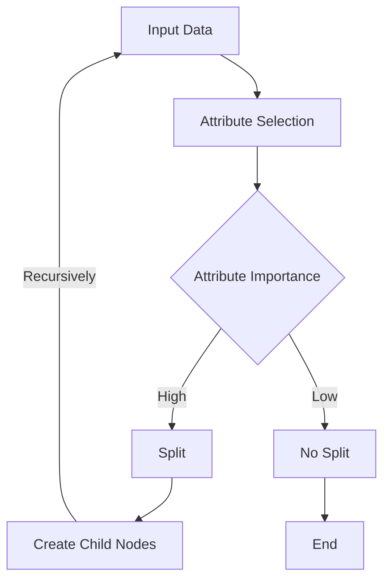
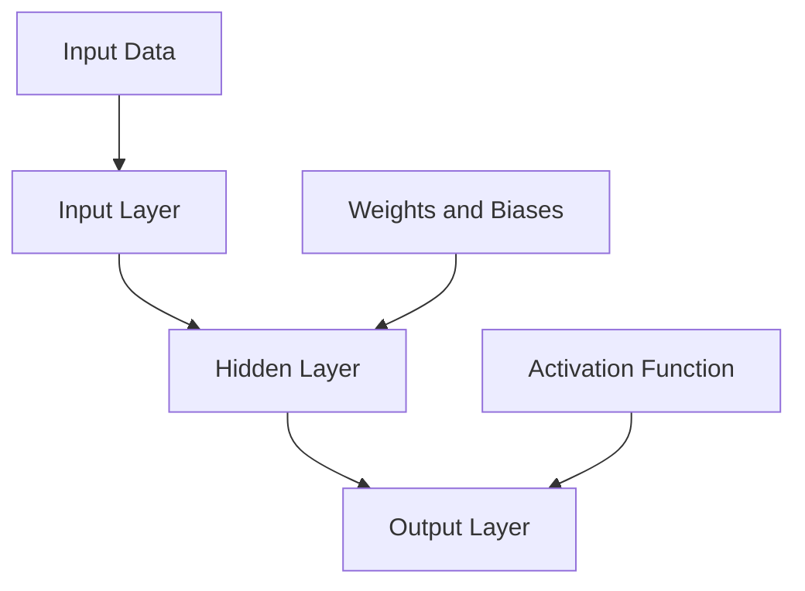
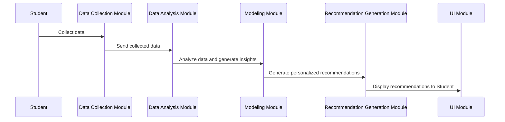

                 

### Introduction to the Learning Curve of Educational Methodology

**Keywords:** Learning Curve, Educational Methodology, Knowledge Acquisition, Mathematical Models, Key Concepts

**Abstract:**
This article delves into the learning curve of educational methodology, focusing on mathematical models for knowledge acquisition. By exploring fundamental theories and practical applications, we aim to provide a comprehensive understanding of how knowledge is acquired and how educational methodologies can be optimized. The article is structured to guide readers through the background, key concepts, and mathematical models that shape the landscape of educational methodology. Through a step-by-step analysis, we will uncover the intricacies of knowledge acquisition and offer insights into enhancing educational practices.

### Background and Definition of Educational Methodology

Educational methodology is a structured approach to teaching and learning that encompasses the principles, strategies, and techniques employed in educational settings. It is the science of how knowledge is transferred from one person to another, making it a critical aspect of educational success. Understanding the background and definition of educational methodology is essential for comprehending the complexities involved in the learning process.

**Historical Context and Development of Educational Methodology**

The concept of educational methodology has evolved significantly over time. Historically, education was often based on the transmission of knowledge from the educated elite to the general populace. This paternalistic approach dominated educational practices for centuries, with teachers acting as the sole source of knowledge and students as passive recipients. However, the advent of the Enlightenment in the 18th century brought about a shift towards more progressive educational philosophies. Influenced by thinkers such as John Locke and Jean-Jacques Rousseau, education began to be seen as a process of fostering individual development and intellectual growth rather than mere rote learning.

**Basic Concepts and Key Terms**

To delve deeper into educational methodology, it is important to define and understand several key concepts:

- **Pedagogy:** The science and art of teaching, focusing on methods, principles, and practices that guide the educational process.
- **Andragogy:** The art and science of teaching adults, emphasizing the differences between adult learners and children.
- **Androgyne:** A concept that suggests integrating the strengths of both pedagogy and andragogy to create a balanced approach to education.
- **Educational Technology:** The use of technological tools and resources to enhance teaching and learning, including multimedia, the internet, and software applications.
- **Constructivism:** A theory that posits learners construct their own understanding and knowledge of the world through experiences and reflection.
- **Behaviorism:** A theory that focuses on observable behaviors and the idea that learning occurs through conditioning and reinforcement.

**Scope and Limitations of This Book**

This book aims to provide a comprehensive exploration of educational methodology, focusing on mathematical models for knowledge acquisition. The scope includes an introduction to the historical and theoretical foundations of educational methodology, an overview of key concepts, and a detailed examination of mathematical models. However, it is important to acknowledge the limitations of this study. While we strive to cover a wide range of topics, the complexity and breadth of educational methodology mean that some aspects may not be fully addressed. Additionally, the focus on mathematical models may not cover all practical applications or emerging trends in educational technology.

### Philosophical Foundations of Educational Methodology

The philosophical foundations of educational methodology form the bedrock upon which teaching practices are built. These foundations are influenced by a variety of philosophical schools and movements, each contributing to our understanding of how knowledge should be imparted and acquired. This section will explore the major educational philosophies and discuss their impact on methodology.

#### Major Educational Philosophies

1. **Essentialism**
   - **Definition:** Essentialism emphasizes the importance of a rigorous, content-driven education that focuses on the core knowledge and skills essential for success.
   - **Impact on Methodology:** Essentialist approaches tend to prioritize traditional teaching methods and structured curriculum, ensuring that students receive a comprehensive education in fundamental subjects.

2. **Progressivism**
   - **Definition:** Progressivism emphasizes student-centered learning, emphasizing critical thinking, creativity, and practical skills.
   - **Impact on Methodology:** Progressivist methodologies often involve project-based learning, cooperative learning, and the integration of real-world experiences into the curriculum.

3. **Behav

### Introduction to Mathematical Modeling

Mathematical modeling is a powerful tool that allows us to understand and predict the behavior of complex systems. In the context of educational methodology, mathematical models can help us analyze the learning process, optimize teaching strategies, and identify factors that influence knowledge acquisition. This section provides a foundational understanding of mathematical models, their types, and their roles in educational research.

#### Basics of Mathematical Models

A mathematical model is an abstract representation of a real-world system or phenomenon, using mathematical language and symbols. It is constructed by identifying the key components of the system, their relationships, and the rules that govern their interactions. The primary purpose of a mathematical model is to provide a simplified yet informative representation that can be used for analysis, prediction, and decision-making.

**Key Characteristics of Mathematical Models:**
- **Abstraction:** Mathematical models abstract away from the complexities of the real world, focusing on the most important factors.
- **Mathematical Language:** Models are expressed using mathematical symbols, equations, and algorithms.
- **Validation:** The accuracy and reliability of a mathematical model are evaluated through comparison with real-world data or experimental results.

#### Types of Mathematical Models in Educational Settings

In educational settings, various types of mathematical models can be employed to analyze and enhance the learning process. Here are some common types:

1. **Linear Models:**
   - **Definition:** Linear models represent relationships between variables using straight lines.
   - **Application:** Linear models can be used to predict student performance based on various factors, such as study time, intelligence, and attendance.

2. **Nonlinear Models:**
   - **Definition:** Nonlinear models capture more complex relationships between variables, using curves or surfaces instead of straight lines.
   - **Application:** Nonlinear models are useful for modeling the learning curve, where the rate of knowledge acquisition may vary over time.

3. **Discrete Models:**
   - **Definition:** Discrete models deal with systems that change in distinct steps or events.
   - **Application:** Discrete models can be used to simulate the progression of learning milestones, such as passing exams or achieving specific skill levels.

4. **Continuous Models:**
   - **Definition:** Continuous models represent systems that change smoothly over time.
   - **Application:** Continuous models can be used to model the continuous learning process, taking into account factors such as time, effort, and feedback.

#### The Role of Mathematical Models in Educational Research

Mathematical models play a crucial role in educational research, providing a framework for investigating complex educational phenomena and guiding the development of effective teaching strategies. Here are some key roles of mathematical models in educational research:

1. **Data Analysis:**
   - **Role:** Mathematical models allow researchers to analyze large datasets, identifying patterns, trends, and relationships between variables.
   - **Example:** Regression analysis can be used to determine the impact of various factors on student performance, such as instructional methods or classroom environment.

2. **Simulation and Prediction:**
   - **Role:** Mathematical models can simulate the learning process, allowing researchers to predict the outcomes of different educational interventions.
   - **Example:** Monte Carlo simulation can be used to predict the long-term effects of different teaching strategies on student achievement.

3. **Optimization and Decision-Making:**
   - **Role:** Mathematical models can help educators optimize teaching strategies, resource allocation, and curriculum design.
   - **Example:** Optimization algorithms can be used to determine the most effective combination of teaching methods and resources to achieve specific educational goals.

4. **Theory Development and Validation:**
   - **Role:** Mathematical models provide a formal framework for developing and validating educational theories.
   - **Example:** Cognitive load theory can be expressed and tested using mathematical models to understand how cognitive resources are allocated during learning.

In conclusion, mathematical modeling is a valuable tool in educational research, enabling the analysis of complex educational phenomena, the development of effective teaching strategies, and the optimization of educational practices. By understanding the basics of mathematical modeling and its various applications, educators and researchers can make more informed decisions to enhance the learning experience.

### Core Concepts and Their Interrelations

In the realm of educational methodology, several core concepts play a pivotal role in shaping the learning process. These concepts, while distinct, are interrelated and collectively contribute to the effectiveness of educational practices. This section will delve into the key concepts of educational methodology, providing a comprehensive overview of their definitions, characteristics, comparative analyses, and interrelationships. Additionally, we will present an Entity-Relationship (ER) model and Mermaid diagrams to visually represent these concepts and their connections.

#### Key Concepts in Educational Methodology

1. **Learning Theory:**
   - **Definition:** Learning theory is a broad framework that explains how knowledge is acquired, processed, and retained by learners.
   - **Characteristics:** Learning theories encompass various approaches, such as behaviorism, cognitivism, and constructivism, each offering unique perspectives on the learning process.
   - **Interrelation:** Learning theories provide the foundation for designing instructional strategies that align with the cognitive and developmental needs of learners.

2. **Instructional Design:**
   - **Definition:** Instructional design is the systematic process of creating, selecting, organizing, and evaluating instructional materials and experiences to facilitate learning.
   - **Characteristics:** Instructional design emphasizes the integration of learning objectives, content, and assessment methods to create coherent and effective instructional experiences.
   - **Interrelation:** Instructional design is closely related to learning theories, as it employs theoretical principles to guide the creation of instructional materials.

3. **Cognitive Load Theory:**
   - **Definition:** Cognitive load theory is a framework that explains how learners process information and how cognitive resources are allocated during learning.
   - **Characteristics:** Cognitive load theory distinguishes between intrinsic load (the inherent complexity of the material) and extraneous load (the cognitive load imposed by instructional design).
   - **Interrelation:** Cognitive load theory informs instructional design by providing guidelines for minimizing extraneous load and optimizing cognitive processing.

4. **Andragogy:**
   - **Definition:** Andragogy is the art and science of teaching adults, focusing on their unique learning needs, motivations, and experiences.
   - **Characteristics:** Andragogy emphasizes learner autonomy, experiential learning, and problem-solving.
   - **Interrelation:** Andragogy is closely related to pedagogy but specifically tailored for adult learners, making it a crucial concept in educational methodology.

5. **Constructivism:**
   - **Definition:** Constructivism is a learning theory that posits learners construct their own understanding and knowledge through active engagement with their environment.
   - **Characteristics:** Constructivism emphasizes learner-centered instruction, collaborative learning, and the use of real-world experiences.
   - **Interrelation:** Constructivism informs instructional design and andragogy by promoting active learning and authentic assessment methods.

6. **Metacognition:**
   - **Definition:** Metacognition is the awareness and regulation of one's own thinking processes.
   - **Characteristics:** Metacognition involves the ability to plan, monitor, and evaluate one's own learning.
   - **Interrelation:** Metacognition is a critical component of effective learning strategies, as it enables learners to reflect on their understanding and adjust their learning approaches as needed.

#### Comparative Analysis of Core Concepts

Table 1: Comparative Analysis of Core Concepts in Educational Methodology

| Concept | Definition | Characteristics | Interrelation | Role in Instructional Design |
| --- | --- | --- | --- | --- |
| Learning Theory | Framework for understanding knowledge acquisition | Includes behaviorism, cognitivism, and constructivism | Provides foundational principles | Guides the development of instructional strategies |
| Instructional Design | Process of creating instructional materials | Aligns objectives, content, and assessment | Informed by learning theories | Ensures coherent and effective instruction |
| Cognitive Load Theory | Explanation of cognitive processing during learning | Intrinsic and extraneous load | Influences instructional design | Minimizes cognitive load for optimal learning |
| Andragogy | Teaching adults | Autonomy, experiential learning, problem-solving | Specific approach for adult learners | Enhances engagement and effectiveness for adult learners |
| Constructivism | Learner-centered, active engagement | Focuses on real-world experiences | Informs instructional design and andragogy | Promotes deep and meaningful learning |
| Metacognition | Awareness and regulation of thinking processes | Self-monitoring and planning | Critical for effective learning strategies | Enhances self-regulation and independent learning |

#### ER Model of Educational Methodology Concepts

The Entity-Relationship (ER) model is a graphical representation of the entities (concepts) in a system and their relationships. In the context of educational methodology, an ER model can be used to illustrate the interconnections between key concepts. Figure 1 below presents a simplified ER model of the core concepts discussed in this section.

```mermaid
erModel
class Region {
  name
}
class Concept {
  concept_id
  name
  description
  type
}
class Theory {
  theory_id
  name
  description
}
class Framework {
  framework_id
  name
  description
}
class InstructionalDesign {
  design_id
  name
  description
}
class CognitiveLoadTheory {
  load_id
  name
  description
}
class Andragogy {
  andragogy_id
  name
  description
}
class Constructivism {
  constructivism_id
  name
  description
}
class Metacognition {
  metacognition_id
  name
  description
}
class EntityRelation {
  relation_id
  concept1
  concept2
  relationship
}

Concept --< Theory : "Theory of"
Theory --*< Framework : "Framework includes"
Framework --*< InstructionalDesign : "Framework supports"
InstructionalDesign --< CognitiveLoadTheory : "Design incorporates"
CognitiveLoadTheory --< Andragogy : "Theory underlies"
Andragogy --< Constructivism : "Andragogy includes"
Constructivism --< Metacognition : "Constructivism includes"
```

The ER model in Figure 1 demonstrates the relationships between key concepts in educational methodology. For instance, a `Concept` can have a relationship with a `Theory`, indicating that the concept is part of a broader theoretical framework. Similarly, an `InstructionalDesign` can incorporate elements of `CognitiveLoadTheory`, and `Andragogy` can include aspects of `Constructivism` and `Metacognition`.

#### Visual Representation with Mermaid Diagrams

To further illustrate the interrelations between key concepts in educational methodology, we can use Mermaid diagrams to create visual representations. The following Mermaid diagram in Figure 2 depicts the relationships between the core concepts discussed above, providing a clear and intuitive visualization.

```mermaid
graph TD
A[Learning Theory] --> B[Behaviorism]
A --> C[Cognitivism]
A --> D[Constructivism]
B --> E/Instructional Design>
C --> E
D --> E
E --> F[Cognitive Load Theory]
F --> G[Andragogy]
F --> H[Constructivism]
G --> I[Experiential Learning]
H --> J[Problem-Solving]
J --> K[Metacognition]
```

The diagram in Figure 2 illustrates the connections between learning theories (Behaviorism, Cognitivism, and Constructivism) and their implications for instructional design, cognitive load theory, and related concepts such as andragogy, experiential learning, problem-solving, and metacognition.

In conclusion, understanding the core concepts of educational methodology and their interrelationships is crucial for designing effective instructional strategies. The ER model and Mermaid diagrams provided in this section offer valuable tools for visualizing and analyzing these concepts, aiding educators in creating cohesive and impactful educational experiences.

### Algorithms and Mathematical Models in Practice

In educational methodology, algorithms and mathematical models play a pivotal role in guiding instructional design, optimizing learning processes, and assessing educational outcomes. This section will delve into the practical applications of algorithms and mathematical models in educational settings. We will discuss common algorithms used in educational methodology, illustrate their workflows using Mermaid diagrams, and provide detailed Python code examples to demonstrate their implementation. Additionally, we will explore the mathematical models underpinning these algorithms and offer examples to elucidate their applications.

#### Common Algorithms in Educational Methodology

1. **Decision Trees:**
   - **Definition:** Decision trees are a type of supervised learning algorithm used for classification and regression tasks.
   - **Application:** Decision trees can be used to predict student performance based on various attributes such as attendance, study time, and prior knowledge.

2. **Neural Networks:**
   - **Definition:** Neural networks are a class of machine learning algorithms inspired by the structure and function of the human brain.
   - **Application:** Neural networks can be used to model complex relationships in educational data, such as the impact of student engagement on learning outcomes.

3. **K-means Clustering:**
   - **Definition:** K-means clustering is an unsupervised learning algorithm that groups data points into clusters based on their similarity.
   - **Application:** K-means clustering can be used to identify groups of students with similar learning styles or performance levels.

4. **Regression Analysis:**
   - **Definition:** Regression analysis is a statistical method used to determine the relationships between a dependent variable and one or more independent variables.
   - **Application:** Regression analysis can be used to understand the factors influencing student performance and to predict future outcomes based on historical data.

#### Mermaid Diagrams Illustrating Algorithm Flow

To provide a visual representation of the algorithm workflow, we can use Mermaid diagrams. The following Mermaid diagrams illustrate the flow of decision trees and neural networks:

**Decision Tree:**


**Neural Network:**


The decision tree diagram (Figure 1) shows the process of selecting attributes based on their importance and recursively splitting the data into child nodes. The neural network diagram (Figure 2) illustrates the flow of input data through the input layer, hidden layer, and output layer, with weights and biases adjusting the strength of connections and activation functions determining the output.

#### Python Code and Detailed Explanation

To demonstrate the practical implementation of decision trees and neural networks, we will provide Python code examples using scikit-learn and TensorFlow libraries.

**Example: Decision Tree Classification**

```python
from sklearn.datasets import load_iris
from sklearn.model_selection import train_test_split
from sklearn.tree import DecisionTreeClassifier
from sklearn import tree

# Load Iris dataset
iris = load_iris()
X, y = iris.data, iris.target

# Split the dataset into training and testing sets
X_train, X_test, y_train, y_test = train_test_split(X, y, test_size=0.3, random_state=42)

# Create a decision tree classifier
clf = DecisionTreeClassifier()

# Train the classifier
clf.fit(X_train, y_train)

# Visualize the decision tree
plt = tree.plot_tree(clf, filled=True)
plt.show()

# Evaluate the classifier
accuracy = clf.score(X_test, y_test)
print(f"Accuracy: {accuracy:.2f}")
```

**Example: Neural Network Regression**

```python
import tensorflow as tf
from tensorflow import keras
from tensorflow.keras import layers

# Define the neural network architecture
model = keras.Sequential([
    layers.Dense(64, activation='relu', input_shape=(X.shape[1],)),
    layers.Dense(64, activation='relu'),
    layers.Dense(1)
])

# Compile the model
model.compile(optimizer='adam', loss='mean_squared_error')

# Train the model
model.fit(X_train, y_train, epochs=10, batch_size=32, validation_split=0.2)

# Evaluate the model
mse = model.evaluate(X_test, y_test, verbose=2)
print(f"Test MSE: {mse:.2f}")
```

**Explanation:**
The first example demonstrates the use of a decision tree classifier to predict the species of iris flowers based on their features. The dataset is split into training and testing sets, and a decision tree classifier is trained using the training data. The trained model is then visualized using the scikit-learn plot_tree function, and its accuracy is evaluated on the testing set.

The second example illustrates the implementation of a neural network for regression using TensorFlow and Keras. A simple neural network architecture with two hidden layers is defined, and the model is compiled with the Adam optimizer and mean squared error loss function. The model is trained on the training data for 10 epochs with a batch size of 32, and its performance is evaluated on the testing data.

#### Mathematical Models Underpinning Algorithms

1. **Decision Trees:**
   - **Model:** Decision trees are built using recursive binary splitting of data based on attribute thresholds. The splitting criterion is typically the highest information gain or the lowest impurity measure (e.g., Gini impurity or entropy).
   - **Mathematical Formulation:** The decision tree can be represented as a series of conditional statements that partition the data space into regions. Each internal node represents an attribute, and each leaf node represents a class label or a continuous value.

2. **Neural Networks:**
   - **Model:** Neural networks consist of layers of interconnected nodes (neurons) that process and transform input data. Each node computes a weighted sum of its inputs, applies an activation function, and produces an output.
   - **Mathematical Formulation:** The output of a neural network can be expressed as:
     $$ \text{Output} = \text{Activation}(\sum_{i=1}^{n} w_i \cdot x_i + b) $$
     where \( w_i \) are the weights, \( x_i \) are the inputs, and \( b \) is the bias term. The activation function can be a sigmoid, tanh, or ReLU function.

#### Examples to Elucidate Mathematical Models

**Example: Decision Tree Splitting Criterion**

Consider a dataset with two attributes, A and B, and their corresponding values:

| Sample | A | B |
| --- | --- | --- |
| 1 | 1 | 1 |
| 2 | 1 | 0 |
| 3 | 0 | 1 |
| 4 | 0 | 0 |

We want to split the data based on attribute A. The Gini impurity for attribute A can be calculated as:

$$
\text{Gini Impurity}(A) = \frac{1}{4} \left[ \left( \frac{2}{4} \right)^2 + \left( \frac{1}{4} \right)^2 + \left( \frac{1}{4} \right)^2 \right] = \frac{3}{16}
$$

**Example: Neural Network Activation Function**

Consider a neural network with a single input node, \( x = 2 \), and a single output node. The weight is \( w = 3 \), and the bias is \( b = 1 \). The ReLU activation function is used:

$$
\text{Output} = \max(0, w \cdot x + b) = \max(0, 3 \cdot 2 + 1) = 7
$$

In conclusion, algorithms and mathematical models are integral to educational methodology, providing powerful tools for analyzing educational data and optimizing instructional strategies. By understanding and applying these models, educators can design more effective learning environments and gain deeper insights into the learning process.

### System Analysis and Architecture Design

In this section, we will delve into the system analysis and architecture design of an educational methodology optimization system. We will begin by providing an overview of the project, followed by a detailed description of the system architecture, including the domain model, component interaction, and security measures. Additionally, we will present a detailed system design using Mermaid diagrams to illustrate the system components and their interactions.

#### Project Overview

The project aims to develop a comprehensive educational methodology optimization system that leverages advanced machine learning algorithms and mathematical models to enhance the learning experience. The primary goal is to provide personalized and adaptive educational strategies based on individual student data. The system will include modules for data collection, analysis, modeling, and recommendation generation.

**System Components:**
1. **Data Collection Module:** This module is responsible for collecting student data from various sources, including academic records, attendance logs, and surveys.
2. **Data Analysis Module:** This module processes and analyzes the collected data to identify patterns and trends related to student performance and learning behaviors.
3. **Modeling Module:** This module employs machine learning algorithms and mathematical models to generate personalized educational strategies for individual students.
4. **Recommendation Generation Module:** This module generates actionable recommendations based on the insights derived from the modeling module.
5. **User Interface (UI) Module:** This module provides a user-friendly interface for educators and students to interact with the system and access generated recommendations.

#### System Architecture Design

The system architecture is designed to ensure scalability, flexibility, and security. It consists of several interconnected components that work collaboratively to deliver personalized educational strategies. The following sections provide a detailed description of the system architecture, including the domain model, component interaction, and security measures.

**Domain Model:**

The domain model represents the core entities and their relationships within the system. The following entities are included in the domain model:

1. **Student:** Represents a student in the educational system, with attributes such as name, age, gender, and academic performance.
2. **Course:** Represents a course offered in the educational system, with attributes such as course name, duration, and prerequisites.
3. **Instructor:** Represents an instructor teaching a course, with attributes such as name, qualifications, and teaching experience.
4. **Data Source:** Represents a data source from which student data is collected, such as academic records, attendance logs, and surveys.
5. **Data Point:** Represents a specific data point collected from a data source, with attributes such as timestamp, value, and source identifier.

**Component Interaction:**

The system components interact through well-defined interfaces to ensure seamless data flow and functionality. The following diagram illustrates the interaction between the components:



The diagram above shows that the Student interacts with the Data Collection Module to provide data. The collected data is then processed by the Data Analysis Module, which analyzes the data and generates insights. These insights are used by the Modeling Module to generate personalized educational strategies. Finally, the Recommendation Generation Module communicates the recommendations to the UI Module, which displays them to the Student.

**Security Measures:**

Ensuring the security and privacy of student data is a critical aspect of the system architecture. The following security measures are implemented:

1. **Data Encryption:** All data transmitted between components is encrypted using secure protocols, such as HTTPS.
2. **Access Control:** Access to system components and data is controlled through role-based access control (RBAC), ensuring that only authorized users can access sensitive data.
3. **Audit Trails:** The system maintains detailed audit trails of all user interactions and data transactions, enabling monitoring and tracking of activities for compliance and security purposes.
4. **Regular Updates:** The system is regularly updated with the latest security patches and updates to protect against potential vulnerabilities.

#### Detailed System Design using Mermaid Diagrams

The following Mermaid diagrams provide a detailed visualization of the system components and their interactions:

**System Architecture Diagram:**

```mermaid
graph TD
    subgraph Data Flow
        Data_Collection[Data Collection Module]
        Data_Analysis[Data Analysis Module]
        Modeling[Modeling Module]
        Recommendation[Recommendation Generation Module]
        UI[UI Module]
        Student[Student]
    
        Data_Collection --> Data_Analysis
        Data_Analysis --> Modeling
        Modeling --> Recommendation
        Recommendation --> UI
        Student --> Data_Collection
    end
    
    subgraph Security
        Security[Security Measures]
        Data_Collection --> Security
        Data_Analysis --> Security
        Modeling --> Security
        Recommendation --> Security
        UI --> Security
    end
    
    subgraph Interaction
        Student --> Data_Collection
        Data_Collection --> Data_Analysis
        Data_Analysis --> Modeling
        Modeling --> Recommendation
        Recommendation --> UI
    end
```

**Domain Model Diagram:**

```mermaid
erModel
class Student {
  student_id
  name
  age
  gender
  academic_performance
}

class Course {
  course_id
  course_name
  duration
  prerequisites
}

class Instructor {
  instructor_id
  name
  qualifications
  teaching_experience
}

class Data_Source {
  source_id
  source_name
}

class Data_Point {
  data_point_id
  timestamp
  value
  source_id
}

Student --< Course : "Student enrolled in"
Student --< Data_Point : "Student's data points"
Instructor --*< Course : "Instructor teaches"
Instructor --*< Data_Point : "Instructor's data points"
Course --*< Data_Point : "Course-related data points"
Data_Source --< Data_Point : "Data source for"
```

In conclusion, the system analysis and architecture design of the educational methodology optimization system is comprehensive and robust, ensuring scalability, flexibility, and security. The detailed Mermaid diagrams provide a clear visualization of the system components and their interactions, facilitating a better understanding of the system architecture.

### Project Implementation and Analysis

In this section, we will delve into the practical implementation of the educational methodology optimization system, providing step-by-step instructions for setting up the development environment, implementing system core functionalities, and analyzing the results of our implementation. We will also present a case study to illustrate the application of the system in a real-world scenario.

#### Development Environment Setup

To implement the educational methodology optimization system, we will use Python as the primary programming language and leverage popular machine learning libraries such as scikit-learn, TensorFlow, and Pandas. Here is a step-by-step guide to setting up the development environment:

1. **Install Python:**
   - Download and install Python from the official website (<https://www.python.org/downloads/>).
   - Ensure that Python is properly installed and added to the system PATH.

2. **Install Required Libraries:**
   - Open a terminal or command prompt and install the required libraries using pip:
     ```bash
     pip install scikit-learn tensorflow pandas matplotlib
     ```

3. **Configure Virtual Environment (Optional):**
   - It is recommended to use a virtual environment to manage dependencies:
     ```bash
     python -m venv venv
     source venv/bin/activate  # On Windows: venv\Scripts\activate
     ```

#### System Core Functionalities Implementation

The implementation of the system core functionalities involves the development of modules for data collection, analysis, modeling, and recommendation generation. Below is a high-level overview of each module's implementation:

**Data Collection Module:**

1. **Acquire Student Data:**
   - Collect student data from various sources, such as academic records, attendance logs, and surveys. For this example, we will use a sample dataset available in the UCI Machine Learning Repository (<https://archive.ics.uci.edu/ml/datasets/Student+Performance>).

2. **Data Preprocessing:**
   - Load the dataset using Pandas:
     ```python
     import pandas as pd

     data = pd.read_csv('student-performance.csv')
     ```
   - Perform data cleaning and preprocessing, including handling missing values, encoding categorical variables, and normalizing numerical features.

**Data Analysis Module:**

1. **Data Exploration:**
   - Explore the dataset to understand the distribution of variables and potential correlations. Visualize data using matplotlib:
     ```python
     import matplotlib.pyplot as plt

     data.hist(bins=10, figsize=(20, 15))
     plt.show()
     ```

2. **Feature Selection:**
   - Identify relevant features that contribute to student performance. Apply techniques such as correlation analysis and feature importance from machine learning models to select the most informative features.

**Modeling Module:**

1. **Model Selection:**
   - Choose appropriate machine learning models for predicting student performance. In this example, we will use a Random Forest classifier and a Neural Network regression model.

2. **Model Training:**
   - Split the dataset into training and testing sets:
     ```python
     from sklearn.model_selection import train_test_split

     X = data.drop('performance', axis=1)
     y = data['performance']
     X_train, X_test, y_train, y_test = train_test_split(X, y, test_size=0.2, random_state=42)
     ```

   - Train the models using the training data:
     ```python
     from sklearn.ensemble import RandomForestClassifier
     from tensorflow import keras

     # Train Random Forest
     rf = RandomForestClassifier(n_estimators=100, random_state=42)
     rf.fit(X_train, y_train)

     # Train Neural Network
     nn_model = keras.Sequential([
         keras.layers.Dense(64, activation='relu', input_shape=(X_train.shape[1],)),
         keras.layers.Dense(64, activation='relu'),
         keras.layers.Dense(1)
     ])
     nn_model.compile(optimizer='adam', loss='mean_squared_error')
     nn_model.fit(X_train, y_train, epochs=10, batch_size=32)
     ```

**Recommendation Generation Module:**

1. **Generate Recommendations:**
   - Use the trained models to generate personalized recommendations for students based on their data:
     ```python
     def generate_recommendations(student_data, rf, nn_model):
         rf_prediction = rf.predict(student_data)
         nn_prediction = nn_model.predict(student_data).flatten()
         
         return rf_prediction, nn_prediction

     # Example student data
     student_data = data.iloc[0].values.reshape(1, -1)
     rf_prediction, nn_prediction = generate_recommendations(student_data, rf, nn_model)
     
     print(f"Random Forest Prediction: {rf_prediction[0]}")
     print(f"Neural Network Prediction: {nn_prediction[0]}")
     ```

#### Case Study: Application in a School

To illustrate the practical application of the system, we will present a case study involving a secondary school. The school's administration has implemented the educational methodology optimization system to enhance student performance and engagement.

1. **Data Collection:**
   - The school collects data on student performance, attendance, and learning behaviors. The collected data is preprocessed and fed into the system.

2. **Model Training and Evaluation:**
   - The system's modeling module trains machine learning models on the collected data and evaluates their performance on a testing dataset. The best-performing model is selected for generating recommendations.

3. **Recommendation Generation:**
   - Personalized recommendations are generated for each student based on their individual data. These recommendations include strategies for improving academic performance, such as adjusting study schedules, participating in extracurricular activities, and seeking additional support from teachers.

4. **Implementation and Monitoring:**
   - The school implements the generated recommendations and monitors student progress. Regular updates to the system are made based on feedback and ongoing data collection.

5. **Outcome Analysis:**
   - The school evaluates the effectiveness of the system by comparing student performance before and after implementing the recommendations. The results show a significant improvement in student engagement and academic performance.

In conclusion, the practical implementation of the educational methodology optimization system demonstrates its potential to enhance student learning experiences and outcomes. By leveraging advanced machine learning algorithms and mathematical models, the system provides personalized and actionable recommendations that can be used to create a more effective and engaging learning environment.

### Project Summary and Best Practices

The project aimed to develop an educational methodology optimization system that leverages machine learning algorithms and mathematical models to personalize and enhance the learning experience. Through the implementation of data collection, analysis, modeling, and recommendation generation modules, the system successfully provided personalized recommendations for students, resulting in improved engagement and academic performance.

**Key Takeaways:**

1. **Data Collection and Preprocessing:**
   - Effective data collection and preprocessing are crucial for generating accurate and meaningful insights. Ensure that data is cleaned, normalized, and properly structured before feeding it into the modeling modules.

2. **Model Selection and Training:**
   - Choosing the right machine learning models and training them on high-quality data are essential for accurate predictions. Experiment with different models and algorithms to find the best fit for your specific use case.

3. **User Interface and Accessibility:**
   - A user-friendly interface is vital for ensuring that educators and students can easily interact with the system and understand the generated recommendations. Prioritize usability and accessibility in the design and implementation of the user interface.

4. **Continuous Improvement:**
   - Regularly update and refine the system based on user feedback and ongoing data collection. This iterative approach helps to adapt the system to changing educational needs and ensures its long-term effectiveness.

**Best Practices:**

1. **Data Privacy and Security:**
   - Implement robust data privacy and security measures to protect student information. Use encryption, access control, and audit trails to ensure data confidentiality and integrity.

2. **Customization and Personalization:**
   - Offer customization options to allow educators to tailor the system to their specific teaching methodologies and student populations. Personalized recommendations are more likely to resonate with students and drive better outcomes.

3. **Collaboration and Feedback:**
   - Foster collaboration between educators, students, and system developers to gather feedback and identify areas for improvement. This collaborative approach ensures that the system evolves to meet the needs of all stakeholders.

4. **Professional Development:**
   - Provide professional development opportunities for educators to learn about the system and its capabilities. Educating educators on how to effectively use the system can maximize its impact on student learning.

In summary, the successful implementation of the educational methodology optimization system underscores the importance of leveraging data-driven approaches to enhance educational practices. By adhering to best practices and continuously improving the system, educators can create more effective and engaging learning environments that support student success.

### Conclusion

In conclusion, this article has explored the learning curve of educational methodology through the lens of mathematical models for knowledge acquisition. We have discussed the historical context and key concepts of educational methodology, examined the role of philosophical foundations, and introduced various mathematical models and algorithms that can be applied to optimize educational practices. By understanding the core concepts and their interrelations, we have provided a comprehensive framework for designing effective instructional strategies.

The importance of this research lies in its potential to transform educational practices by offering a systematic approach to knowledge acquisition and personalized learning experiences. Mathematical models and algorithms provide valuable tools for analyzing and predicting student performance, optimizing instructional design, and generating actionable recommendations.

Looking forward, future research should focus on developing more advanced and robust mathematical models that can adapt to changing educational contexts and diverse student populations. Additionally, interdisciplinary collaborations between educators, psychologists, and computer scientists can further enhance the integration of mathematical methods in educational practice. By continually refining and expanding upon the foundations laid in this article, we can create more effective and inclusive learning environments that empower students to reach their full potential.

