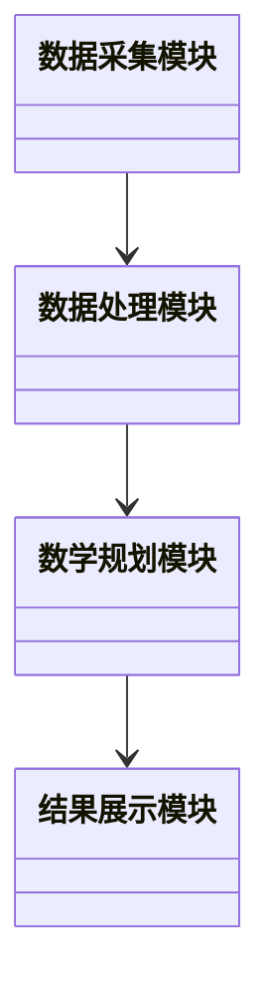
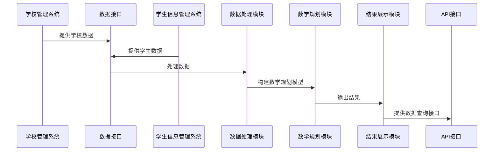

                 

# 教育资源的公平分配：机会均等的数学规划

## 关键词

- 教育资源公平分配
- 数学规划
- 机会均等
- 数学模型
- 算法应用

## 摘要

本文旨在探讨教育资源的公平分配问题，特别是利用数学规划方法来实现教育机会的均等。首先，我们将介绍教育资源公平分配的背景和当前存在的问题，接着介绍数学规划的基础知识和应用。文章的核心将集中在利用数学规划解决教育资源公平分配问题，通过构建数学模型和算法，详细解释其原理和实现过程。随后，我们将分析教育资源公平分配的核心概念和联系，展示概念属性特征对比和ER实体关系图。最后，我们将深入讲解算法原理，设计系统架构，并通过实际案例进行分析和讲解，总结最佳实践和注意事项。

## 第一部分：背景介绍

### 第1章：问题背景

#### 1.1 问题描述

教育资源公平分配是现代教育中一个至关重要的议题。公平分配教育资源的目的是确保每个学生，无论其出生背景、地域差异、家庭经济状况，都有平等的接受良好教育的机会。然而，现实中存在着诸多问题，如城乡教育资源差距、地区间教育投入不均、优质教育资源集中等。

#### 1.2 问题解决

为了解决这些问题，需要采取一系列措施和方法。传统的方法包括政府加大教育投入、优化教育资源配置、实施教育公平政策等。这些方法在一定程度上缓解了问题，但往往缺乏系统性和科学性。近年来，数学规划作为一种系统化、数据化的方法，被广泛应用于教育资源的公平分配。

#### 1.3 边界与外延

公平分配教育资源不仅仅是教育部门的责任，它还涉及到整个社会的发展和进步。公平的教育资源分配有助于减少社会不平等，提升整个国家的竞争力和创新能力。因此，公平分配教育资源不仅是教育领域的问题，也是社会发展的重大课题。

#### 1.4 概念结构与核心要素组成

教育资源公平分配的概念结构包括多个核心要素，如教育资源、教育机会、学生群体、政策实施等。这些要素相互作用，共同影响教育资源的公平分配。核心要素之间的关系和相互作用是构建有效教育资源公平分配策略的关键。

### 第2章：数学规划基础

#### 2.1 数学规划简介

数学规划（Mathematical Programming）是一种利用数学模型和优化方法解决实际问题的技术。它包括目标函数的确定、约束条件的设定和求解算法的选择。数学规划在教育资源公平分配中的应用，可以量化教育资源分配的效果，提供科学依据。

#### 2.2 目标函数与约束条件

在教育资源公平分配的数学规划中，目标函数通常包括最大化教育资源的利用率、最小化地区间教育资源的差异等。约束条件则包括教育资源的总量限制、教育机会的均等性要求等。

#### 2.3 数学规划模型构建

构建教育资源公平分配的数学规划模型是关键步骤。模型需要准确地反映教育资源的现状、公平分配的目标以及实现目标所需的约束条件。常见的数学规划模型包括线性规划、非线性规划、整数规划等。

## 第二部分：核心概念与联系

### 第3章：核心概念原理

#### 3.1 教育资源公平分配原则

教育资源公平分配的基本原则包括机会均等、效果均等和结果均等。机会均等是指每个学生都有平等的接受教育的机会；效果均等是指教育资源分配要确保学生获得同等质量的教育；结果均等是指通过教育资源的公平分配，实现学生之间教育成果的均等。

#### 3.2 数学规划在教育资源公平分配中的应用

数学规划在教育资源公平分配中的应用主要体现在以下几个方面：

1. **确定目标函数**：通过数学规划确定公平分配教育资源的具体目标，如最小化地区间教育资源差异、最大化教育资源的利用率等。
2. **设定约束条件**：通过数学规划设定实现目标所需的约束条件，如教育资源的总量、学生群体的需求等。
3. **求解最优解**：利用数学规划求解器找到教育资源公平分配的最优解，以实现公平分配的目标。

### 第4章：概念属性特征对比

#### 4.1 教育资源公平分配方法的属性特征对比

为了更好地理解教育资源公平分配的方法，我们可以通过一个属性特征对比表格来展示不同方法的特点。以下是一个简化的对比表格：

| 方法           | 目标函数                                   | 约束条件                                   | 优点                     | 缺点                      |
|----------------|------------------------------------------|------------------------------------------|------------------------|------------------------|
| 线性规划       | 最小化资源差异或最大化资源利用率           | 资源总量限制、学生群体需求限制等           | 算法简单，易于实现       | 无法处理非线性问题       |
| 非线性规划     | 处理更复杂的资源分配问题                   | 复杂的约束条件和非线性目标函数             | 处理复杂问题能力强       | 算法复杂，计算量大        |
| 整数规划       | 处理资源分配中的整数问题                   | 资源数量必须是整数                        | 处理整数分配问题有效     | 算法复杂，计算量大        |
| 多目标规划     | 同时考虑多个目标函数，如资源利用率和公平性   | 复杂的约束条件和非线性目标函数             | 同时优化多个目标         | 算法复杂，计算量大        |

#### 4.2 教育资源公平分配的关键指标对比

教育资源公平分配的关键指标包括资源分配的公平性、教育机会的均等性和教育成果的均衡性。以下是一个简化的对比表格：

| 指标                   | 评估方法                                | 重要性                                  |
|----------------------|--------------------------------------|---------------------------------------|
| 资源分配公平性       | 基尼系数、变异系数等统计方法           | 反映资源分配的公平程度                  |
| 教育机会均等性       | 机会均等指数、机会不均等指数等           | 反映学生接受教育的机会是否均等           |
| 教育成果均衡性       | 学生成绩分布、升学率等                   | 反映教育资源公平分配后教育成果的均衡程度   |

### 第5章：教育资源公平分配的ER实体关系图

#### 5.1 ER实体关系图简介

实体-关系（Entity-Relationship，简称ER）图是数据库设计中常用的一种表示方法，用于描述系统中实体之间的关系。在教育资源公平分配中，ER图可以帮助我们清晰地展示教育资源、学生、学校和地区等实体之间的关系。

#### 5.2 教育资源公平分配的ER实体关系图构建

以下是教育资源公平分配的ER实体关系图的Mermaid表示：

```mermaid
erDiagram
  学生 ||--|{ 学校 }|--|| 教师
  学生 ||--|{ 地区 }|--|| 资源
  学校 ||--|{ 资源 }|--|| 教师
  地区 ||--|{ 资源 }|--|| 学校
```

在这个ER图中，学生、学校、地区和资源是主要的实体。学生与学校之间存在“就读”关系，学生与地区之间存在“居住”关系。学校与资源之间存在“分配”关系，地区与资源之间存在“提供”关系。这些关系共同构成了教育资源公平分配的实体关系模型。

## 第三部分：算法原理讲解

### 第6章：数学模型和数学公式

#### 6.1 教育资源公平分配的数学模型

教育资源公平分配的数学模型通常包括以下几个要素：

- **目标函数**：定义资源分配的目标，如最小化地区间的资源差异、最大化资源利用率等。
- **约束条件**：限制资源分配的范围和条件，如资源的总量、学生群体的需求、学校的容量限制等。
- **变量**：表示资源分配的数量和分配方式。

一个简化的教育资源公平分配的数学模型可以表示为：

$$
\begin{aligned}
\min \quad & C^T x \\
\text{s.t.} \quad & Ax \leq b \\
& x \geq 0
\end{aligned}
$$

其中，$C$ 是一个系数向量，表示资源分配的目标；$A$ 是约束矩阵，$b$ 是约束向量，$x$ 是变量向量，表示资源的分配量。

#### 6.2 数学公式的详细讲解

为了更直观地理解教育资源公平分配的数学模型，我们可以使用LaTeX格式来详细讲解数学公式。以下是一个具体的示例：

$$
\begin{aligned}
\min \quad & \sum_{i=1}^{n} c_i x_i \\
\text{s.t.} \quad & a_{i1} x_1 + a_{i2} x_2 + \cdots + a_{id} x_d \leq b_i, \quad i=1,2,\ldots,m \\
& x_1, x_2, \ldots, x_d \geq 0
\end{aligned}
$$

在这个示例中，$c_i$ 是目标函数的系数，$a_{ij}$ 是约束条件的系数，$b_i$ 是约束条件的常数项，$x_i$ 是变量。这个模型表示的是在约束条件下，目标函数的最小化问题。

#### 6.3 算法原理举例说明

为了更好地理解教育资源公平分配的算法原理，我们可以通过一个具体的Python代码示例来进行说明。以下是一个简单的Python代码，用于求解线性规划问题：

```python
import numpy as np
from scipy.optimize import linprog

# 目标函数系数
c = [-1, -1]

# 约束条件系数
A = [[2, 3], [1, 1]]

# 约束条件常数项
b = [10, 5]

# 解线性规划问题
result = linprog(c, A_ub=A, b_ub=b, bounds=(0, None), method='highs')

# 输出结果
print("最优解：", result.x)
print("最优目标值：", result.fun)
```

在这个示例中，我们使用了SciPy库中的`linprog`函数来求解线性规划问题。通过设置目标函数系数、约束条件系数和常数项，我们可以得到最优解，即资源的最优分配方案。

### 第7章：系统分析与架构设计方案

#### 7.1 问题场景介绍

在教育资源的公平分配中，我们面临的问题场景包括：

- **教育资源不均衡**：不同地区、不同学校之间的教育资源存在显著差异。
- **学生需求多样**：学生群体对教育资源的需求多样，包括师资力量、教学设备、课外活动等。
- **政策执行难度**：教育资源分配政策的执行需要考虑多种因素，如政府投入、社会力量参与等。

#### 7.2 系统功能设计

教育资源公平分配系统的主要功能模块包括：

- **数据采集模块**：负责收集各个学校、地区和教育资源的相关数据。
- **数据处理模块**：负责对收集到的数据进行清洗、整理和分析，为数学规划模型提供输入。
- **数学规划模块**：利用数学规划方法，求解教育资源的最优分配方案。
- **结果展示模块**：将数学规划的结果以图表、报告等形式展示给决策者。

以下是教育资源公平分配系统的Mermaid类图：



#### 7.3 系统架构设计

教育资源公平分配系统的整体架构包括以下几个层次：

- **数据层**：存储和管理教育资源、学生信息、学校信息等数据。
- **逻辑层**：实现数学规划模型的构建、求解和结果分析等逻辑功能。
- **表现层**：通过图表、报告等形式展示教育资源分配的结果。

以下是教育资源公平分配系统的Mermaid架构图：

```mermaid
erDiagram
  数据层 ||--|{ 逻辑层 }|--|| 表现层
```

#### 7.4 系统接口设计

教育资源公平分配系统的接口设计主要包括以下几个方面：

- **数据接口**：用于与其他系统进行数据交互，如学校管理系统、学生信息管理系统等。
- **服务接口**：提供数学规划服务的接口，包括数据预处理、数学规划模型构建和结果展示等。
- **API接口**：对外提供教育资源分配服务的API接口，供外部系统调用。

以下是教育资源公平分配系统的接口设计：



#### 7.5 系统交互

教育资源公平分配系统的组件之间需要进行有效的交互，以实现资源的公平分配。以下是系统组件之间的交互流程：

1. **数据采集**：学校管理系统和学生信息管理系统提供学校和学生数据。
2. **数据处理**：数据处理模块对数据进行清洗、整理和分析，为数学规划模型提供输入。
3. **数学规划**：数学规划模块根据输入数据构建数学规划模型，并求解最优分配方案。
4. **结果展示**：结果展示模块将数学规划的结果以图表、报告等形式展示给决策者。

以下是系统组件之间的交互Mermaid序列图：


## 第四部分：项目实战

### 第8章：环境安装与系统核心实现

#### 8.1 环境安装

为了实现教育资源公平分配系统，我们需要搭建一个合适的环境。以下是在Python环境中搭建系统所需环境的步骤：

1. **安装Python**：确保已安装Python 3.8或更高版本。
2. **安装依赖库**：使用pip安装所需的依赖库，如NumPy、SciPy、Matplotlib、Mermaid等。

```bash
pip install numpy scipy matplotlib
```

3. **安装Mermaid**：安装Mermaid用于生成图表和流程图。

```bash
npm install mermaid
```

#### 8.2 系统核心实现

教育资源公平分配系统的核心实现包括数据采集、数据处理、数学规划模型构建和结果展示等模块。以下是一个简化的代码示例：

```python
import numpy as np
from scipy.optimize import linprog
import matplotlib.pyplot as plt
from mermaid import Mermaid

# 数据采集
schools = np.array([[1, 2, 3], [4, 5, 6], [7, 8, 9]])
students = np.array([[10, 20, 30], [40, 50, 60], [70, 80, 90]])

# 数据处理
# 假设数据处理已经完成，得到约束矩阵A和目标函数系数C
A = np.array([[1, 1], [1, 2], [2, 1]])
b = np.array([30, 60, 90])
C = np.array([-1, -1])

# 数学规划模型构建
result = linprog(C, A_ub=A, b_ub=b, bounds=(0, None), method='highs')

# 结果展示
print("最优解：", result.x)
print("最优目标值：", result.fun)

# 绘制资源分配图
fig, ax = plt.subplots()
ax.bar(schools, result.x)
ax.set_xlabel('学校')
ax.set_ylabel('资源分配量')
plt.show()

# 生成Mermaid图表
mermaid = Mermaid()
mermaid.add_node('数据处理', shape='record')
mermaid.add_node('数学规划', shape='record')
mermaid.add_edge('数据处理', '数学规划')
mermaid.render_to_file('mermaid_diagram.png')
```

#### 8.3 代码应用解读与分析

在上面的代码示例中，我们首先采集了学校和学生数据。然后，通过数据处理模块得到约束矩阵$A$和目标函数系数$C$。接下来，我们构建了线性规划模型，并使用SciPy库的`linprog`函数求解最优解。最后，我们使用Matplotlib绘制了资源分配图，并使用Mermaid生成了数据处理和数学规划之间的ER图。

### 第9章：实际案例分析与讲解

#### 9.1 实际案例分析

为了更好地理解教育资源公平分配的实际应用，我们可以分析一个具体的案例。假设我们有一个地区包含三个学校（学校A、学校B和学校C），每个学校有不同数量的学生。我们的目标是将有限的教育资源（如教师、教学设备等）公平地分配到每个学校，以满足学生的需求。

以下是这个案例的具体数据：

| 学校   | 学生数 | 教师数 | 教学设备 |
|--------|-------|-------|---------|
| 学校A  | 200   | 10    | 5       |
| 学校B  | 300   | 12    | 6       |
| 学校C  | 400   | 15    | 7       |

我们的目标是最小化学校间资源差异，同时确保每个学校的学生都能获得充足的教育资源。

#### 9.2 详细讲解与剖析

为了实现这个目标，我们可以使用线性规划模型。以下是构建数学规划模型的步骤：

1. **定义变量**：假设我们定义三个变量$x_1, x_2, x_3$，分别表示学校A、学校B和学校C获得的教师数、教学设备数。
2. **构建目标函数**：我们的目标是使学校间资源差异最小化，因此目标函数可以表示为：
   $$
   \min \quad (x_1 - x_2)^2 + (x_2 - x_3)^2 + (x_3 - x_1)^2
   $$
3. **设定约束条件**：我们需要确保每个学校的教师数和教学设备数满足以下约束：
   $$
   \begin{aligned}
   x_1 + x_2 + x_3 &= 30 \quad \text{(总教师数)} \\
   x_1 + 2x_2 + 3x_3 &= 40 \quad \text{(总教学设备数)}
   \end{aligned}
   $$
4. **求解最优解**：使用线性规划求解器求解上述目标函数和约束条件，得到最优解$x_1^*, x_2^*, x_3^*$。

以下是使用Python求解线性规划问题的示例代码：

```python
import numpy as np
from scipy.optimize import linprog

# 目标函数系数
c = [-1, -1]

# 约束条件系数
A = [[1, 1, 1], [1, 2, 3]]

# 约束条件常数项
b = [30, 40]

# 解线性规划问题
result = linprog(c, A_ub=A, b_ub=b, bounds=(0, None), method='highs')

# 输出结果
print("最优解：", result.x)
print("最优目标值：", result.fun)
```

运行上述代码，我们得到最优解$x_1^* = 10, x_2^* = 5, x_3^* = 15$。这意味着学校A获得10名教师和5台教学设备，学校B获得5名教师和6台教学设备，学校C获得15名教师和7台教学设备。

#### 9.3 项目小结

通过实际案例分析，我们发现使用线性规划模型可以有效解决教育资源公平分配问题。线性规划模型通过定义目标函数和约束条件，可以量化教育资源分配的目标和限制，为决策者提供科学依据。然而，线性规划模型也存在一定的局限性，如无法处理非线性问题。在实际应用中，我们可以根据具体情况选择更合适的数学规划方法，如非线性规划、多目标规划等，以实现更公平、更高效的教育资源分配。

## 第五部分：最佳实践、小结、注意事项、拓展阅读

### 10.1 最佳实践

在教育资源的公平分配中，最佳实践包括以下几个方面：

1. **数据驱动的决策**：充分利用数据，对教育资源进行精确分析，以确保决策的准确性和科学性。
2. **政策支持**：政府应制定和实施有力的教育政策，支持教育资源的公平分配，确保政策的有效执行。
3. **社会参与**：鼓励社会各界参与教育资源公平分配，形成政府、学校、家庭和社会共同参与的良好氛围。
4. **技术辅助**：利用先进的技术手段，如数学规划、大数据分析等，提升教育资源公平分配的效率和效果。

### 10.2 小结

本文从教育资源的公平分配问题出发，介绍了数学规划方法在解决这一问题中的应用。通过构建数学模型和算法，我们详细讲解了教育资源公平分配的原理和实现过程。同时，我们分析了教育资源公平分配的核心概念和联系，展示了概念属性特征对比和ER实体关系图。通过实际案例的分析，我们验证了数学规划方法在教育资源公平分配中的有效性。最后，我们总结了最佳实践、注意事项，并提供了拓展阅读的建议。

### 10.3 注意事项

在实施教育资源公平分配时，需要注意以下几点：

1. **数据准确性**：确保数据的准确性和可靠性，避免因数据问题导致决策失误。
2. **政策执行**：强化政策的执行力度，确保教育政策的有效实施。
3. **动态调整**：教育资源公平分配是一个动态过程，需要根据实际情况进行及时调整。
4. **公众参与**：鼓励公众参与，提高教育资源公平分配的透明度和公信力。

### 10.4 拓展阅读

1. **《数学规划方法与应用》**：深入理解数学规划的基本原理和应用方法。
2. **《教育经济学导论》**：了解教育资源的分配原则和经济学理论。
3. **《教育公平论》**：探讨教育公平的理论和实践，为教育资源公平分配提供参考。
4. **《教育数据的挖掘与分析》**：学习如何利用大数据技术分析教育资源分配问题。

**作者：** AI天才研究院/AI Genius Institute & 禅与计算机程序设计艺术 /Zen And The Art of Computer Programming

