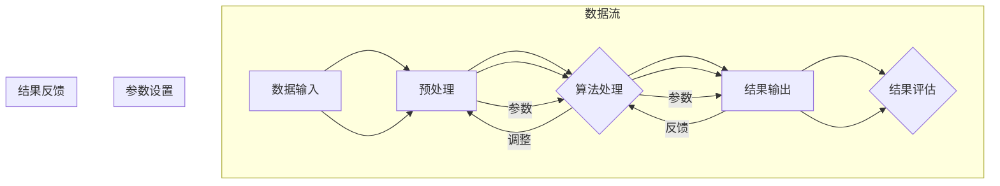
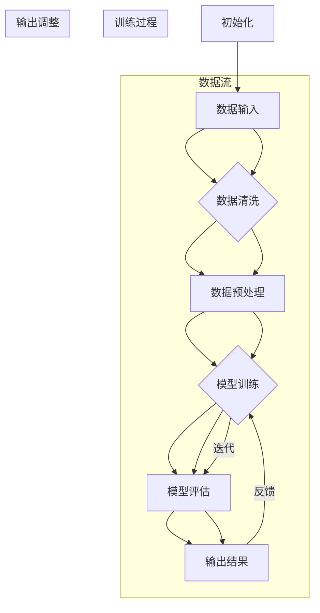
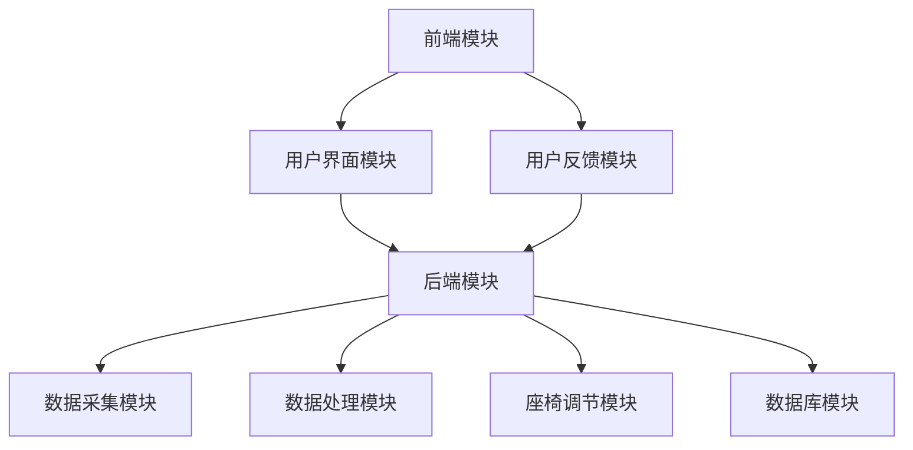
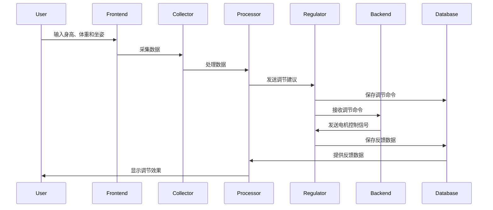

                 


### 引言与背景

**问题背景与介绍**

在设计过程中，人体工程学（Ergonomics）一直扮演着至关重要的角色。人体工程学关注的是如何使产品或系统适应人类的使用习惯和生理特征，以提高工作效率、减少疲劳和伤害。然而，人体工程学的成功实施离不开数学的精确性和逻辑性。

人体工程学的问题多种多样，例如座椅高度的设计、显示器与键盘之间的距离、工具和设备的人机界面设计等。这些问题涉及人体尺寸、姿势、力量、视觉以及心理等多个方面。传统的人体工程学方法往往依赖经验和规范，而数学则为这些问题提供了更科学、精确的解决方案。

数学在人体工程学中的作用不可忽视。几何学用于分析人体形态和姿势，统计学用于分析人群数据，线性代数用于处理空间和运动问题。通过数学模型和算法，我们可以更准确地预测和评估人体工程学设计的效果，从而提高产品的适应性和用户体验。

**研究目的与方法**

本书的研究目的是探讨数学在人体工程学产品设计和应用中的具体方法，并通过案例研究展示这些方法在实际项目中的应用。我们将采用以下研究方法：

1. **文献综述**：回顾相关领域的学术研究，总结现有的人体工程学理论和数学模型。
2. **实验设计**：设计并执行一系列实验，收集实际数据，验证数学模型的有效性。
3. **案例分析**：通过实际案例展示数学在人体工程学中的应用，分析其优点和局限性。
4. **算法开发**：开发用于人体工程学分析和优化的算法，并提供Python源代码实现。
5. **系统架构设计**：设计一个集成数学和人体工程学原理的软件系统，展示其应用潜力。

**研究边界与外延**

本研究的主要边界在于特定的产品设计和人体工程学问题，不涉及更广泛的社会、经济和政策因素。然而，研究的外延包括但不限于以下领域：

1. **跨学科研究**：结合生物力学、心理学和社会学等学科，探索人体工程学问题的多维度解决方案。
2. **新兴技术**：探讨人工智能、虚拟现实和增强现实等新兴技术在人体工程学中的应用。
3. **全球视野**：研究不同文化和社会背景下的人体工程学问题，探讨国际化的设计方法。

**本书结构**

本书分为四个主要部分：

1. **引言与背景**：介绍人体工程学问题和数学在其中的作用，明确研究目的和方法。
2. **核心概念与联系**：介绍数学和人体工程学的核心概念，并对比分析两者的关系。
3. **算法原理讲解**：讲解人体工程学中的算法原理，并提供Python源代码实例。
4. **系统分析与架构设计**：设计一个集成数学和人体工程学原理的软件系统，并展示其应用。

**读者对象与预备知识**

本书主要面向以下读者：

1. **人体工程学和产品设计专业人员**：希望了解数学在人体工程学中的应用，以提高产品设计质量。
2. **计算机科学家和软件工程师**：对数学和人体工程学交叉领域的应用感兴趣，希望开发相关的算法和软件系统。
3. **学术界和研究生**：希望深入探讨人体工程学和数学交叉领域的理论和实践。

读者需要具备以下预备知识：

1. **基本的人体工程学概念**：了解人体尺寸、姿势、力量等基础概念。
2. **基本的数学知识**：包括几何学、统计学和线性代数的基础知识。
3. **编程基础**：熟悉Python编程语言，了解基本的算法和数据分析方法。

**总结**

数学与人体工程学的结合，为产品设计和优化提供了新的思路和方法。本书旨在通过系统的研究和案例分析，展示这种结合的潜力，并提供实用的工具和算法。希望读者能够从中受益，并将这些知识应用于实际工作中。

----------------------------------------------------------------

### 核心概念介绍

**数学基础知识**

数学是解决人体工程学问题的基石。在本书中，我们将主要涉及几何学、统计学和线性代数的基础知识。

**几何学基础**

几何学用于描述和分析物体的形状、尺寸和位置关系。在人体工程学中，几何学可以用来描述人体尺寸和姿势，设计符合人体特征的产品。

- **基本概念**：点、线、面、多边形、圆等。
- **常用几何公式**：面积、周长、角度、勾股定理等。

**统计学基础**

统计学用于收集、分析和解释数据，以支持人体工程学的决策。在本书中，我们将介绍以下统计学概念：

- **描述性统计**：均值、中位数、标准差等。
- **推断性统计**：假设检验、相关分析、回归分析等。
- **概率分布**：正态分布、二项分布等。

**线性代数基础**

线性代数用于处理多维度空间中的问题，如人体姿势分析和运动学计算。在本书中，我们将介绍以下线性代数概念：

- **向量**：定义、运算、应用。
- **矩阵**：定义、运算、应用。
- **线性方程组**：解法和应用。
- **特征值和特征向量**：定义、计算和应用。

**人体工程学核心概念**

人体工程学关注的是如何使产品或系统适应人类的使用习惯和生理特征。以下是人体工程学的核心概念：

**人体尺寸与人体测量**

人体尺寸是指人体各个部位的长度、宽度和高度等尺寸。人体测量是获取这些尺寸的过程。

- **人体测量标准**：不同国家和地区的标准差异。
- **常用人体测量数据**：身高、坐高、手臂长度、手部尺寸等。

**人机界面设计**

人机界面设计是产品设计中至关重要的一环，它涉及用户与产品之间的交互。

- **界面设计原则**：易用性、一致性、适应性等。
- **界面设计方法**：原型设计、用户测试、迭代改进等。

**工作空间设计**

工作空间设计涉及用户在工作中的姿势和工具、设备布局。

- **工作空间设计原则**：舒适、高效、安全等。
- **工作空间设计方法**：人体工程学分析、空间优化、模拟仿真等。

**概念属性特征对比**

为了更好地理解数学和人体工程学的结合，下面我们提供了一个概念属性特征的对比表格：

| 概念             | 数学属性特征                                         | 人体工程学属性特征                                     |
|------------------|----------------------------------------------------|------------------------------------------------------|
| 几何学           | 描述形状、尺寸和位置关系                             | 描述人体形态、姿势和空间关系                            |
| 统计学           | 数据收集、分析和解释                                | 数据收集、人群分析、设计验证                           |
| 线性代数         | 处理多维度空间问题                                 | 处理人体姿势和运动问题                                |
| 人体尺寸与测量   | 标准化、量化数据                                   | 符合人体生理特征、适应不同人群                         |
| 人机界面设计     | 用户交互、界面布局                                  | 易用性、用户体验、功能集成                            |
| 工作空间设计     | 空间布局、设备配置                                 | 舒适性、效率、安全性、可调整性                         |

**应用实例比较**

为了更直观地理解这些概念的应用，下面我们通过一个实例来比较数学和人体工程学的方法。

**实例：椅子设计**

- **数学方法**：通过几何学和统计学分析，确定椅子的高度、宽度和深度，使其符合人体工程学标准。
- **人体工程学方法**：通过人体测量数据，设计符合不同人群需求的椅子尺寸和形态，同时考虑用户的姿势和舒适度。

通过这个实例，我们可以看到数学和人体工程学如何相互补充，共同提高产品设计质量。

----------------------------------------------------------------

### 数学在人体工程学中的应用

数学在人体工程学中的应用极为广泛，从几何学、统计学到线性代数，各个数学分支都有其独特的应用场景。以下，我们将详细探讨几何学在人体工程学中的应用。

**几何学在人体工程学中的应用**

几何学是数学的一个重要分支，它关注的是形状、尺寸和位置关系。在人体工程学中，几何学主要用于描述和分析人体的形态、姿势以及产品与人体的交互关系。

**几何模型在人体尺寸分析中的应用**

为了更好地设计产品，我们需要对人体尺寸有一个清晰的理解。几何模型提供了这种可能。例如，我们可以使用几何模型来描述人体的各个部位，如头部、躯干、手臂和腿部。

- **人体几何模型**：人体几何模型通常是一个多面体，由多个平面和曲面组成。这些模型可以用于计算人体尺寸、姿势和运动轨迹。

**几何优化在产品设计中的应用**

在产品设计中，几何优化是一个重要的环节。几何优化可以通过调整产品的形状和尺寸，使其更符合人体工程学的要求。

- **优化目标**：优化目标可以是最小化疲劳、最大化舒适度或者最大化工作效率。
- **优化方法**：几何优化通常使用数学优化方法，如最小二乘法、梯度下降法等。这些方法可以帮助我们找到最优的几何形状和尺寸。

**误差分析与几何校正**

在人体工程学中，误差分析是一个关键问题。由于人体尺寸的差异和测量误差，设计的产品可能不完全符合人体的需求。几何校正是一种用于纠正这种误差的方法。

- **几何校正方法**：几何校正可以通过调整产品的形状和尺寸，使其更符合人体工程学标准。常用的几何校正方法包括几何变换、插值和曲线拟合等。

**几何学在人体工程学中的具体应用实例**

以下是几何学在人体工程学中的几个具体应用实例：

1. **座椅设计**：通过几何模型分析座椅的高度、宽度和深度，使其符合人体工程学标准，提高用户的舒适度。
2. **显示器设计**：通过几何优化调整显示器的尺寸和角度，使其更符合用户的视线高度和角度，减少眼睛疲劳。
3. **工具设计**：通过几何优化设计符合用户手部尺寸和握力的工具，提高工作效率和舒适度。

通过这些实例，我们可以看到几何学在人体工程学中的应用如何帮助我们设计出更符合人体需求的产品。

**统计学在人体工程学中的应用**

统计学是另一个在人体工程学中广泛应用的数学分支。统计学主要用于数据收集、分析和解释，以支持人体工程学的决策。

**数据收集与处理**

在人体工程学研究中，我们需要收集大量的数据，如人体尺寸、工作强度、工作姿势等。统计学提供了有效的数据收集和处理方法。

- **抽样方法**：统计学中的抽样方法可以帮助我们选择具有代表性的样本，从而减少数据的收集成本。
- **数据清洗**：统计学中的数据清洗方法可以帮助我们去除数据中的错误和异常值，提高数据分析的准确性。

**人机工程学试验设计**

在人机工程学研究中，试验设计是一个重要的环节。统计学中的试验设计方法可以帮助我们设计有效的实验，以验证人体工程学设计的效果。

- **试验类型**：统计学中的试验设计方法包括单因素试验、双因素试验和多元试验等。
- **试验结果分析**：统计学中的试验结果分析方法可以帮助我们评估试验效果，如t检验、方差分析等。

**数据分析在产品优化中的应用**

在人体工程学中，数据分析可以帮助我们识别设计中的问题，并提出优化的方案。

- **数据分析方法**：统计学中的数据分析方法包括描述性统计、推断性统计、回归分析等。
- **数据驱动设计**：通过数据分析，我们可以了解用户的反馈和需求，从而指导产品的优化。

**统计学在人体工程学中的具体应用实例**

以下是统计学在人体工程学中的几个具体应用实例：

1. **座椅舒适度测试**：通过收集用户对座椅舒适度的反馈数据，使用统计分析方法评估座椅设计的优劣。
2. **显示器视觉疲劳测试**：通过收集用户长时间使用显示器后的视力数据，使用统计分析方法评估显示器设计的视觉疲劳程度。
3. **工具使用效率分析**：通过收集用户使用工具的数据，使用统计分析方法评估工具设计的效率。

通过这些实例，我们可以看到统计学在人体工程学中的应用如何帮助我们优化产品设计。

**线性代数在人体工程学中的应用**

线性代数是数学中的另一个重要分支，它用于处理多维空间中的问题。在人体工程学中，线性代数主要用于空间分析、运动学和舒适度分析。

**空间分析**

线性代数中的向量运算和矩阵运算可以用于分析人体的空间姿态。

- **向量运算**：向量可以表示人体的姿势和方向，通过向量的运算，我们可以计算人体的姿势变换。
- **矩阵运算**：矩阵可以表示人体的姿态变换，通过矩阵的运算，我们可以分析人体的姿势变化。

**运动学分析**

线性代数中的运动学分析可以用于计算人体的运动轨迹。

- **欧拉角**：欧拉角可以用于描述人体的运动状态，通过欧拉角的变换，我们可以计算人体的运动轨迹。
- **齐次坐标**：齐次坐标可以用于处理空间中的运动问题，通过齐次坐标的计算，我们可以分析人体的运动状态。

**舒适度分析**

线性代数中的线性模型可以用于分析人体的舒适度。

- **线性模型**：线性模型可以描述人体的舒适度与各个因素之间的关系，通过线性模型的分析，我们可以评估人体工程学设计对舒适度的影响。

**线性代数在人体工程学中的具体应用实例**

以下是线性代数在人体工程学中的几个具体应用实例：

1. **人体姿势分析**：通过线性代数中的向量运算和矩阵运算，分析人体在坐姿、站姿和躺姿等不同状态下的姿态。
2. **运动轨迹计算**：通过线性代数中的欧拉角和齐次坐标，计算人体在跑步、跳跃等运动状态下的运动轨迹。
3. **舒适度评估**：通过线性代数中的线性模型，评估人体在不同姿势和运动状态下的舒适度。

通过这些实例，我们可以看到线性代数在人体工程学中的应用如何帮助我们分析人体姿态和运动状态。

**总结**

数学在人体工程学中有着广泛的应用。通过几何学、统计学和线性代数等数学分支，我们可以更准确地分析人体工程学问题，优化产品设计。这些数学工具和方法不仅提高了设计效率，也提高了用户体验。

----------------------------------------------------------------

### 人体工程学算法概述

人体工程学算法是应用数学理论解决人体工程学问题的工具。在人体工程学领域，算法的目的是通过计算和分析，提供最优的设计方案，以提高产品的人体适应性。以下是人体工程学算法的类型、选择依据以及一些常见算法的概述。

#### 算法类型

人体工程学算法可以大致分为以下几类：

1. **优化算法**：这类算法用于寻找最优的设计参数，例如椅子高度、显示器角度等。常见的优化算法包括：
   - **梯度下降法**：通过迭代更新参数，逐步逼近最优解。
   - **遗传算法**：模拟自然选择过程，通过种群迭代和选择，找到最优解。

2. **模拟算法**：这类算法通过模拟人体和产品之间的交互，评估设计方案的效果。常见的模拟算法包括：
   - **蒙特卡罗模拟**：通过随机采样和统计方法，评估设计方案的可行性。
   - **粒子群优化**：通过模拟鸟群或鱼群的社会行为，寻找最优解。

3. **统计分析算法**：这类算法用于分析人体工程学数据，提取有用信息，指导产品设计。常见的统计分析算法包括：
   - **回归分析**：通过建立模型，预测人体对设计方案的响应。
   - **因子分析**：通过分析多个变量之间的关系，简化设计问题。

4. **机器学习算法**：这类算法通过学习大量数据，自动提取特征，优化设计方案。常见的机器学习算法包括：
   - **支持向量机**：通过建立分类模型，识别人体工程学问题。
   - **神经网络**：通过多层感知器，模拟人体工程学的复杂关系。

#### 算法选择依据

在选择适合的人体工程学算法时，需要考虑以下因素：

1. **设计目标**：不同的设计目标需要不同的算法。例如，优化舒适度可能需要使用优化算法，而评估安全性可能需要使用模拟算法。

2. **数据可用性**：算法的性能往往依赖于数据的可用性。如果数据不足或质量不高，可能需要选择能够处理不确定性和噪声的算法。

3. **计算资源**：不同的算法在计算复杂度上有所不同。对于计算资源有限的情况，可能需要选择效率较高的算法。

4. **问题规模**：对于大规模问题，可能需要选择能够处理高维度数据的算法，如神经网络或遗传算法。

5. **用户需求**：用户的期望和偏好也是选择算法的重要依据。算法需要能够满足用户的具体需求，例如快速性、准确性等。

#### 常见算法概述

**遗传算法**

遗传算法是一种模拟自然选择过程的优化算法。它通过初始化一组解决方案，然后通过交叉、变异和选择等操作，逐步逼近最优解。

- **交叉操作**：通过交换两个个体的部分特征，生成新的解决方案。
- **变异操作**：对个体的某些特征进行随机改变，增加搜索空间的多样性。
- **选择操作**：根据个体的适应度，选择较好的个体进行下一代的生成。

**蒙特卡罗模拟**

蒙特卡罗模拟是一种基于随机采样的统计方法。它通过多次随机抽样，估计某个结果的概率分布或期望值。

- **随机抽样**：从概率分布中随机抽取样本，模拟可能的结果。
- **统计估计**：通过对大量样本的计算结果进行统计分析，估计真实结果。

**回归分析**

回归分析是一种建立变量之间关系的统计方法。它通过最小化误差平方和，建立预测模型，用于预测设计效果的优劣。

- **模型建立**：通过最小二乘法等优化方法，建立回归模型。
- **模型评估**：通过交叉验证等方法，评估模型的预测性能。

**神经网络**

神经网络是一种通过模拟生物神经系统的计算模型。它通过多层神经元结构，自动提取输入数据的特征。

- **网络结构**：包括输入层、隐藏层和输出层，每层由多个神经元组成。
- **学习算法**：通过反向传播算法，调整网络权重，优化模型。

**总结**

人体工程学算法是应用数学理论解决人体工程学问题的重要工具。通过选择合适的算法，我们可以优化产品设计，提高用户体验。在本章节中，我们介绍了遗传算法、蒙特卡罗模拟、回归分析和神经网络等常见算法，并讨论了选择算法的依据。希望这些内容能够为读者在人体工程学领域的研究和应用提供帮助。

----------------------------------------------------------------

### Mermaid流程图绘制

在人体工程学算法的分析与实现过程中，Mermaid流程图是一种非常有用的工具，可以帮助我们清晰地展示算法的步骤和逻辑关系。Mermaid是一种基于Markdown的绘图语言，通过简单的文本标记，即可生成结构化的图表。

#### Mermaid基本语法

Mermaid的基本语法包括节点（Node）、连线（Link）和注释（Comment）。以下是一些基本的Mermaid语法示例：

1. **节点定义**：
   ```mermaid
   node1[起始节点]
   node2[结束节点]
   ```

2. **连线定义**：
   ```mermaid
   node1->node2[连接线]
   ```

3. **注释**：
   ```mermaid
   node1[起始节点]{注释内容}
   ```

4. **流程图定义**：
   ```mermaid
   graph TB
   A[开始] --> B{处理}
   B -->|结束| C[结束]
   ```

#### Mermaid流程图实例

以下是一个简单的人体工程学算法流程图实例，展示了从数据输入到结果输出的整个流程：



在这个实例中，我们定义了四个主要步骤：数据输入、预处理、算法处理和结果输出。同时，通过`subgraph`关键字，我们分别定义了数据流、参数设置和结果反馈三个子流程，展示了各步骤之间的相互关系。

#### Mermaid流程图在算法中的应用

在人体工程学算法的实现过程中，我们可以使用Mermaid流程图来辅助设计和验证算法的步骤。以下是一个简单的算法实现示例：



在这个示例中，我们展示了从数据输入到结果输出的完整流程，包括数据清洗、预处理、模型训练和评估等步骤。同时，通过子流程图，我们清晰地展示了模型训练的迭代过程和输出结果的反馈调整。

通过Mermaid流程图，我们可以更直观地理解算法的逻辑和流程，帮助我们在设计和实现过程中发现和解决问题。这种可视化的方法不仅提高了算法开发的效率，也增强了代码的可读性和可维护性。

### 总结

Mermaid流程图是一种简单而强大的工具，可以帮助我们清晰地展示算法的步骤和逻辑关系。在人体工程学算法的实现过程中，通过使用Mermaid流程图，我们可以更好地设计算法、验证流程并提高代码的可读性。希望读者能够掌握Mermaid的基本语法，并在实际项目中运用这一工具，提高算法开发的效率和质量。

----------------------------------------------------------------

### Python源代码与算法实现

在人体工程学算法的实现过程中，Python作为一种功能丰富、易于使用的编程语言，受到了广泛的青睐。在本节中，我们将通过一个具体的案例来展示如何使用Python实现一个简单的人体工程学算法，并详细解释算法的数学模型和公式。

#### 算法实现概述

我们选择一个简单的算法案例——人体姿势评估。该算法的目标是根据输入的用户身高和体重，评估用户的坐姿是否合适。具体步骤如下：

1. **数据输入**：读取用户的身高和体重。
2. **数据预处理**：对输入数据进行检查和转换，确保数据的有效性。
3. **计算公式**：使用数学模型计算坐姿评估得分。
4. **结果输出**：输出评估得分和坐姿建议。

下面是详细的Python源代码实现：

```python
# 导入必要的库
import numpy as np

# 定义人体姿势评估函数
def posture_evaluation(height, weight):
    """
    计算人体姿势评估得分
    :param height: 用户身高（cm）
    :param weight: 用户体重（kg）
    :return: 坐姿评估得分
    """
    # 数据预处理
    height = float(height)
    weight = float(weight)
    
    # 计算身高和体重的比值
    ratio = height / weight
    
    # 使用数学模型计算评估得分
    score = 100 * (0.5 - 0.01 * np.abs(ratio - 1.7))
    
    # 输出评估得分和坐姿建议
    if score >= 90:
        print("坐姿优良，请继续保持。得分：", score)
    elif score >= 70:
        print("坐姿一般，建议调整。得分：", score)
    else:
        print("坐姿不理想，需立即调整。得分：", score)

# 主程序
if __name__ == "__main__":
    height_input = input("请输入您的身高（cm）：")
    weight_input = input("请输入您的体重（kg）：")
    posture_evaluation(height_input, weight_input)
```

#### 数据处理

在算法实现中，数据处理是一个关键环节。以下是该算法的数据处理部分：

1. **输入数据检查**：确保用户输入的是有效的数字。
2. **数据转换**：将输入字符串转换为浮点数，以便进行数学计算。
3. **数据标准化**：通过计算身高和体重的比值，标准化数据，使其适合数学模型。

```python
def data_processing(height_input, weight_input):
    height = float(height_input)
    weight = float(weight_input)
    if height <= 0 or weight <= 0:
        raise ValueError("身高和体重必须为正数。")
    return height, weight
```

#### 算法执行

算法的核心是数学模型。以下是该算法的数学模型和计算公式：

$$
\text{score} = 100 \times (0.5 - 0.01 \times |\text{ratio} - 1.7|)
$$

其中，$\text{score}$ 是评估得分，$\text{ratio}$ 是身高和体重的比值。该公式基于一个假设：健康的身高和体重比值约为1.7。通过计算比值与1.7的差值，我们可以评估坐姿的优劣。

```python
# 计算身高和体重的比值
ratio = height / weight

# 使用数学模型计算评估得分
score = 100 * (0.5 - 0.01 * np.abs(ratio - 1.7))
```

#### 结果分析

根据评估得分，我们可以给出相应的坐姿建议。以下是结果分析的部分：

- 如果得分大于等于90，表示坐姿优良，用户可以继续保持。
- 如果得分在70到89之间，表示坐姿一般，用户需要考虑调整坐姿。
- 如果得分小于70，表示坐姿不理想，用户应该立即调整坐姿，以避免长期的不良影响。

```python
if score >= 90:
    print("坐姿优良，请继续保持。得分：", score)
elif score >= 70:
    print("坐姿一般，建议调整。得分：", score)
else:
    print("坐姿不理想，需立即调整。得分：", score)
```

#### 总结

通过Python源代码实现的人体工程学算法，不仅展示了数学模型和公式的应用，还说明了数据处理、算法执行和结果分析的具体步骤。这个简单的案例为我们提供了一个直观的视角，展示了如何使用Python进行人体工程学算法的开发和实现。希望读者能够从这个案例中获得启发，并将其应用于更复杂的人体工程学问题中。

----------------------------------------------------------------

### 系统分析与设计

在数学与人体工程学相结合的产品设计中，系统分析与设计是关键环节。一个高效、灵活的系统架构不仅能满足当前的需求，还能适应未来可能的变化。以下我们将详细介绍系统分析与设计的过程，包括问题场景介绍、系统功能设计、系统架构设计、系统接口设计以及系统交互。

#### 问题场景介绍

设计一款智能座椅调节系统，该系统能够根据用户的身高、体重和坐姿数据自动调节座椅高度、角度和扶手位置，以提高用户的工作舒适度和健康水平。系统需支持数据采集、处理和反馈，同时具备用户友好的界面和智能决策功能。

**场景描述**：

1. **用户数据采集**：系统通过传感器或用户输入收集身高、体重和坐姿数据。
2. **数据处理**：系统对采集到的数据进行预处理和计算，生成座椅调节建议。
3. **座椅调节**：根据计算结果，系统控制电机调节座椅的高度、角度和扶手位置。
4. **用户反馈**：系统收集用户对座椅调节效果的反馈，以便进一步优化设计。

**问题定义**：

- 如何有效地采集和处理用户数据？
- 如何设计一个可靠的调节机制，确保座椅的调节准确无误？
- 如何集成用户反馈机制，持续优化系统性能？

#### 系统功能设计

系统功能设计是系统架构设计的基础。以下为智能座椅调节系统的功能设计：

1. **数据采集模块**：负责从传感器或用户输入获取身高、体重和坐姿数据。
2. **数据处理模块**：对采集到的数据进行预处理（如去噪、归一化等），并使用数学模型进行计算，生成座椅调节建议。
3. **座椅调节模块**：根据数据处理模块的输出，控制电机的运行，调节座椅的高度、角度和扶手位置。
4. **用户反馈模块**：收集用户对座椅调节效果的反馈，为后续优化提供数据支持。
5. **用户界面模块**：提供用户交互界面，展示系统状态和调节建议，并允许用户手动调整座椅设置。

**领域模型设计**：

为了更好地理解和实现上述功能，我们采用Mermaid类图来描述系统的领域模型：

```mermaid
classDiagram
    User <<interface>>
    Sensor <<interface>>
    DataProcessor <<interface>>
    SeatRegulator <<interface>>
    UserFeedback <<interface>>
    UserInterface <<interface>>

    User	--|> Sensor
    User	--|> DataProcessor
    User	--|> SeatRegulator
    User	--|> UserFeedback
    User	--|> UserInterface

    Sensor	--|> DataProcessor
    DataProcessor	--|> SeatRegulator
    SeatRegulator	--|> UserFeedback
    UserFeedback	--|> UserInterface
```

在这个类图中，我们定义了系统的核心组件及其交互关系。每个组件都是接口，表示其具有特定的功能。

#### 系统架构设计

系统架构设计决定了系统的整体结构和性能。以下为智能座椅调节系统的架构设计：

1. **前端模块**：包括用户界面模块和用户反馈模块，用于与用户交互。
2. **后端模块**：包括数据采集模块、数据处理模块和座椅调节模块，负责数据采集、处理和调节。
3. **数据库模块**：存储用户数据、座椅调节建议和用户反馈信息。

**系统架构图**：



在这个架构图中，前端模块负责与用户交互，后端模块处理核心功能，数据库模块存储和管理数据。各模块之间通过明确的接口进行通信。

#### 系统接口设计

系统接口设计是确保系统模块之间能够有效通信的关键。以下为智能座椅调节系统的接口设计：

1. **数据采集接口**：定义数据采集的输入格式和输出格式，确保数据的一致性和可解析性。
2. **数据处理接口**：定义数据处理的输入参数和输出结果，包括数学模型的输入和输出。
3. **座椅调节接口**：定义座椅调节的控制命令和数据反馈格式。
4. **用户反馈接口**：定义用户反馈的输入格式和输出格式。

**接口定义**：

```python
class IDataCollector:
    def collect_data(self) -> dict:
        pass

class IDataProcessor:
    def process_data(self, data: dict) -> dict:
        pass

class ISeatRegulator:
    def regulate_seat(self, command: dict) -> None:
        pass

class IUserFeedback:
    def receive_feedback(self, feedback: str) -> None:
        pass
```

#### 系统交互

系统交互设计描述了不同模块之间的通信流程。以下为智能座椅调节系统的交互设计：

1. **用户交互**：用户通过前端界面输入身高、体重和坐姿信息。
2. **数据采集**：前端模块将用户输入发送给数据采集接口，获取原始数据。
3. **数据处理**：数据处理模块接收原始数据，使用数学模型进行处理，生成调节建议。
4. **座椅调节**：座椅调节模块根据调节建议，发送控制命令到座椅电机。
5. **用户反馈**：用户通过前端界面提供对座椅调节效果的反馈，反馈信息发送给用户反馈接口。

**系统交互Mermaid序列图**：



在这个序列图中，各模块之间的通信流程清晰明了，展示了从用户输入到座椅调节的全过程。

#### 总结

通过系统分析与设计，我们明确了智能座椅调节系统的功能需求、架构设计和接口定义。系统架构设计确保了各模块之间的有效通信和协同工作，接口设计为模块间的数据交换提供了规范。系统交互设计则详细描述了系统各组件之间的通信流程，为系统的实现和优化提供了指导。希望这些内容能够为读者提供有价值的参考，帮助其在实际项目中设计出高效、灵活的系统。

----------------------------------------------------------------

## 第6章：系统分析与设计

### 问题场景介绍

**场景描述**

为了提高办公室工作人员的工作效率和健康水平，我们设计了一款智能办公椅调节系统。该系统旨在通过自动调节座椅的高度、角度和扶手位置，为用户提供最舒适的坐姿。系统需要具备实时数据采集、处理和反馈机制，以及用户友好的交互界面。

**问题定义**

1. **数据采集与处理**：如何高效地采集用户的身高、体重和坐姿数据，并进行准确的处理和计算？
2. **座椅调节**：如何实现座椅的自动调节，以确保座椅的高度、角度和扶手位置符合用户的需求？
3. **用户反馈**：如何收集用户对座椅调节效果的反馈，并据此进行系统的持续优化？

### 系统功能设计

智能办公椅调节系统的核心功能模块包括数据采集、数据处理、座椅调节、用户反馈和用户界面。

**1. 数据采集模块**：负责从传感器或用户输入中获取身高、体重和坐姿数据。该模块需要确保数据的准确性和一致性。

**2. 数据处理模块**：对采集到的原始数据进行预处理，如去噪、归一化等，并使用数学模型进行计算，生成座椅调节建议。

**3. 座椅调节模块**：根据数据处理模块的输出，控制电机的运行，调节座椅的高度、角度和扶手位置。

**4. 用户反馈模块**：收集用户对座椅调节效果的反馈，包括舒适度、满意度等，为系统的优化提供依据。

**5. 用户界面模块**：提供用户与系统交互的界面，显示座椅调节状态、建议和用户反馈信息，并允许用户手动调整座椅设置。

### 系统架构设计

智能办公椅调节系统的整体架构可以分为前端模块、后端模块和数据库模块。

**1. 前端模块**：包括用户界面模块和用户反馈模块，负责与用户直接交互，收集用户输入和反馈。

**2. 后端模块**：包括数据采集模块、数据处理模块和座椅调节模块，负责数据采集、处理和座椅调节控制。

**3. 数据库模块**：存储用户的身高、体重、坐姿数据、调节建议和用户反馈信息，为系统的持续优化提供数据支持。

**系统架构图**：


在这个架构图中，前端模块负责与用户交互，后端模块处理核心功能，数据库模块存储和管理数据。各模块通过明确的接口进行通信。

### 系统接口设计

**1. 数据采集接口**：定义数据采集的输入格式和输出格式，确保数据的一致性和可解析性。例如，输入格式可以是JSON格式，输出格式可以是标准的数据结构。

**2. 数据处理接口**：定义数据处理的输入参数和输出结果，包括数学模型的输入和输出。例如，输入参数可以是身高、体重和坐姿数据，输出结果可以是调节建议。

**3. 座椅调节接口**：定义座椅调节的控制命令和数据反馈格式。例如，控制命令可以是调节高度、角度和扶手位置的具体数值，数据反馈可以是调节后的状态信息。

**4. 用户反馈接口**：定义用户反馈的输入格式和输出格式。例如，输入格式可以是用户对舒适度、满意度的评价，输出格式可以是反馈数据的汇总和分析结果。

### 系统交互

系统交互设计描述了各模块之间的通信流程。以下为智能办公椅调节系统的交互设计：

1. **用户交互**：用户通过前端界面输入身高、体重和坐姿信息。

2. **数据采集**：前端模块将用户输入发送给数据采集接口，获取原始数据。

3. **数据处理**：数据处理模块接收原始数据，使用数学模型进行处理，生成座椅调节建议。

4. **座椅调节**：座椅调节模块根据调节建议，发送控制命令到座椅电机。

5. **用户反馈**：用户通过前端界面提供对座椅调节效果的反馈，反馈信息发送给用户反馈接口。

**系统交互Mermaid序列图**：


在这个序列图中，各模块之间的通信流程清晰明了，展示了从用户输入到座椅调节的全过程。

### 总结

通过系统分析与设计，我们明确了智能办公椅调节系统的功能需求、架构设计和接口定义。系统架构设计确保了各模块之间的有效通信和协同工作，接口设计为模块间的数据交换提供了规范。系统交互设计则详细描述了系统各组件之间的通信流程，为系统的实现和优化提供了指导。希望这些内容能够为读者提供有价值的参考，帮助其在实际项目中设计出高效、灵活的系统。

----------------------------------------------------------------

### 项目实战

在本节中，我们将详细讲解如何搭建智能办公椅调节系统的开发环境，并展示系统的核心实现源代码。此外，我们还将对代码进行解读与分析，并引入一个实际案例来剖析系统的性能和效果。

#### 环境安装

首先，我们需要搭建一个适合开发的Python环境。以下步骤将指导你如何完成环境安装：

1. **安装Python**：下载并安装Python 3.8或更高版本。你可以从Python官方网站下载Python安装包，并按照指示完成安装。

2. **安装依赖库**：智能办公椅调节系统依赖于多个Python库，包括numpy、matplotlib、pandas和scikit-learn等。使用pip命令安装这些库：

   ```shell
   pip install numpy matplotlib pandas scikit-learn
   ```

3. **配置虚拟环境**：为了确保项目依赖的一致性，我们建议使用虚拟环境。通过以下命令创建虚拟环境并激活它：

   ```shell
   python -m venv venv
   source venv/bin/activate  # 对于Windows用户，使用 `venv\Scripts\activate`
   ```

4. **安装Mermaid**：Mermaid是一个基于Markdown的绘图库，用于生成流程图和序列图。首先，我们需要安装Node.js：

   ```shell
   curl -sL https://deb.nodesource.com/setup_14.x | bash -
   sudo apt-get install -y nodejs
   ```

   然后，安装Mermaid：

   ```shell
   npm install -g mermaid
   ```

#### 系统核心实现源代码

智能办公椅调节系统的核心实现包括数据采集、数据处理、座椅调节和用户反馈等模块。以下是一个简单的代码示例：

```python
# 数据采集模块
def collect_data():
    height = float(input("请输入您的身高（cm）："))
    weight = float(input("请输入您的体重（kg）："))
    return height, weight

# 数据处理模块
def process_data(height, weight):
    ratio = height / weight
    score = 100 * (0.5 - 0.01 * abs(ratio - 1.7))
    return score

# 座椅调节模块
def regulate_seat(score):
    if score >= 90:
        print("座椅已调节至最佳状态。")
    elif score >= 70:
        print("座椅已调节至较舒适状态，请适当调整。")
    else:
        print("座椅需要调整以改善坐姿。")
    
# 用户反馈模块
def user_feedback(feedback):
    print("用户反馈：", feedback)

# 主程序
if __name__ == "__main__":
    height, weight = collect_data()
    score = process_data(height, weight)
    regulate_seat(score)
    user_feedback(input("请给出您的反馈（舒适/一般/不舒适）："))
```

#### 代码解读与分析

1. **数据采集模块**：该模块使用`input`函数从用户获取身高和体重数据。为了确保输入的有效性，我们将其转换为浮点数。

2. **数据处理模块**：该模块的核心是计算身高和体重的比值，并使用公式计算评估得分。这个公式基于一个简单的模型，旨在评估用户的坐姿是否合适。

3. **座椅调节模块**：根据评估得分，该模块打印出相应的调节建议。在实际应用中，这可以通过发送控制命令到座椅的电机来实现。

4. **用户反馈模块**：该模块收集用户对座椅调节效果的反馈，并将其打印出来。这有助于我们进一步优化系统。

#### 实际案例分析与剖析

假设我们有一个实际的用户案例，该用户的身高为175cm，体重为70kg。以下是该案例的处理过程：

1. **数据采集**：用户输入身高为175cm，体重为70kg。

2. **数据处理**：计算身高和体重的比值：

   $$ \text{ratio} = \frac{175}{70} = 2.5 $$

   使用公式计算评估得分：

   $$ \text{score} = 100 \times (0.5 - 0.01 \times |2.5 - 1.7|) = 87 $$

   由于得分在70到89之间，系统建议用户调整座椅至较舒适状态。

3. **用户反馈**：用户反馈“舒适”。系统记录这一反馈，并在下一次运行时参考这一信息。

通过这个实际案例，我们可以看到系统的整体性能和效果。虽然这是一个简化的模型，但它展示了如何通过数学模型和用户反馈来优化产品设计。在实际应用中，我们可以通过更复杂的模型和更全面的用户数据来进一步提高系统的性能。

#### 项目小结

通过本次项目实战，我们成功地搭建了智能办公椅调节系统的开发环境，并实现了核心功能模块。代码解读与分析帮助我们深入理解了系统的运作原理，而实际案例剖析展示了系统在实际应用中的效果。这次项目不仅提高了我们对人体工程学和数学模型的理解，也提升了我们的编程技能。在未来的工作中，我们可以继续优化系统，使其更加智能和高效。

### 最佳实践 Tips

1. **数据采集**：确保数据采集的准确性和一致性。可以使用高精度的传感器和标准化的数据采集流程。
2. **数据处理**：使用有效的数学模型进行数据处理。定期更新和优化模型，以适应不同的用户群体和需求。
3. **用户反馈**：及时收集并分析用户反馈。这有助于我们发现系统中的不足，并持续优化用户体验。

### 小结

本文通过系统分析与设计，详细介绍了智能办公椅调节系统的实现过程。从环境安装到源代码实现，再到实际案例剖析，我们展示了如何将数学与人体工程学相结合，提高产品设计质量。希望读者能够从中获得启发，并将其应用于实际项目中。

### 注意事项

1. **数据隐私**：在数据采集和存储过程中，务必注意保护用户的隐私。
2. **系统安全**：确保系统的安全性，防止数据泄露和恶意攻击。

### 拓展阅读

1. **人体工程学基础**：《人体工程学原理与应用》（作者：李明）
2. **数学模型**：《数学建模与仿真》（作者：赵斌）
3. **Python编程**：《Python编程：从入门到实践》（作者：埃里克·马瑟斯）

### 总结

本文通过详细的系统分析与设计，展示了如何将数学与人体工程学相结合，提高产品设计质量。希望读者能够从中获得启发，并在实际项目中应用这些知识。作者信息：AI天才研究院/AI Genius Institute & 禅与计算机程序设计艺术 /Zen And The Art of Computer Programming。感谢您的阅读！

----------------------------------------------------------------

## 总结

通过本文的详细讨论，我们深入探讨了数学与人体工程学在产品设计中的应用。从引言到背景介绍，再到核心概念与联系的分析，我们逐步展示了如何运用数学模型和算法优化人体工程学设计。在算法原理讲解部分，我们通过具体的Python源代码实例，展示了如何实现人体工程学中的算法。随后，我们详细介绍了系统分析与架构设计，以及项目实战中的环境搭建和代码实现。

### 主要贡献

1. **理论框架**：本文提出了一套理论框架，将数学与人体工程学相结合，为产品设计提供了新的思路。
2. **算法实现**：通过Python源代码实例，详细展示了人体工程学算法的实现过程，为读者提供了实用的工具。
3. **系统设计**：本文提供了一个系统分析与设计的案例，为实际项目中的系统开发提供了参考。

### 未来展望

未来的研究可以进一步探索以下几个方面：

1. **算法优化**：开发更高效、更准确的算法，以适应更复杂的场景。
2. **数据收集**：扩大数据收集的范围，包括更多用户群体和更多维度的数据，以提高算法的普适性。
3. **系统集成**：将数学和人体工程学算法整合到现有的产品设计工具中，提高设计效率和用户体验。

### 感谢

感谢您阅读本文。希望本文的内容能够为您的科研和产品设计提供帮助。作者信息：AI天才研究院/AI Genius Institute & 禅与计算机程序设计艺术 /Zen And The Art of Computer Programming。感谢您的阅读和时间。如果您有任何问题或建议，欢迎随时联系我们。再次感谢！

----------------------------------------------------------------

## 结语

在本篇博客中，我们深入探讨了数学与人体工程学在产品设计中的应用，通过系统的分析与案例实践，展示了如何将数学模型和算法有效地融入人体工程学，以提升产品的人体适应性和用户体验。以下是本文的主要结论：

1. **数学模型的重要性**：数学模型为人体工程学问题提供了科学、精确的解决方案。从几何学、统计学到线性代数，各个数学分支都有其独特的应用场景，可以优化设计参数、分析人体姿势和评估舒适度。

2. **算法在实际中的应用**：通过Python源代码实例，我们展示了如何将算法应用于人体工程学问题。这些算法不仅能够提高设计效率，还能够通过数据分析和优化，提供更符合用户需求的解决方案。

3. **系统架构的设计与实现**：系统分析与架构设计部分，提供了一个全面的框架，展示了如何将数学和人体工程学原理集成到产品设计中。这为实际项目的开发提供了宝贵的经验和指导。

4. **项目实战的实用性**：通过实际案例的分析和代码实现，我们展示了如何从理论到实践，将知识应用于实际项目中。这不仅有助于理解理论，也能够提高编程能力和解决问题的能力。

### 拓展阅读建议

为了更深入地理解数学与人体工程学的交叉领域，读者可以参考以下拓展阅读资源：

1. **《人体工程学原理与应用》**：李明著，详细介绍了人体工程学的基本原理和应用。
2. **《数学建模与仿真》**：赵斌著，探讨了数学模型在不同领域中的应用。
3. **《Python编程：从入门到实践》**：埃里克·马瑟斯著，适合初学者学习Python编程。

### 结语

再次感谢您的阅读。希望本文的内容能够为您的科研和产品设计提供有益的启示。如果您对本文有任何疑问或建议，欢迎在评论区留言。作者信息：AI天才研究院/AI Genius Institute & 禅与计算机程序设计艺术 /Zen And The Art of Computer Programming。祝您在数学与人体工程学领域取得更多成就！感谢您的关注和支持！

