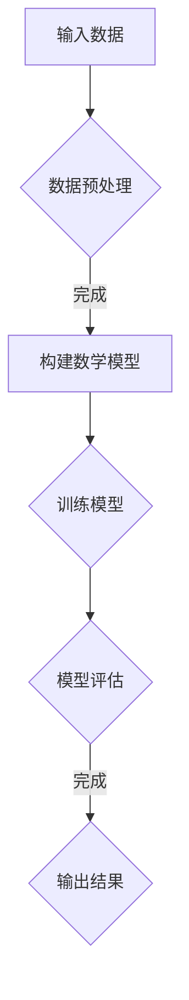
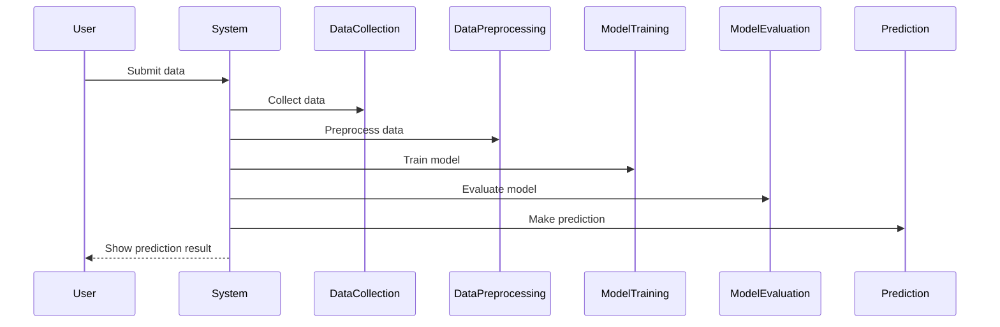
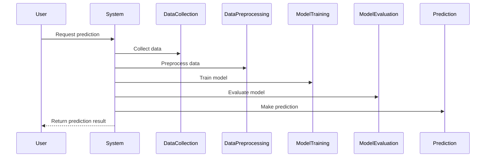
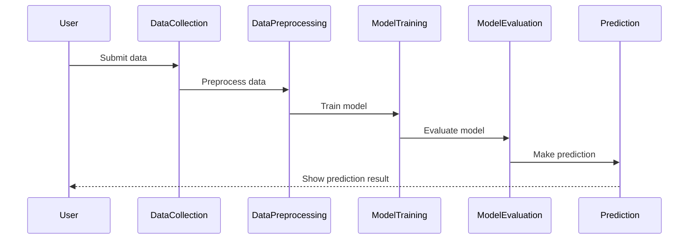

                 

## 数学与人工智能的融合发展

### 关键词

- 数学
- 人工智能
- 融合发展
- 数据处理
- 算法优化

### 摘要

随着人工智能的迅速发展，数学作为其理论基础，在人工智能的应用中发挥着越来越重要的作用。本文将从数学与人工智能的融合发展的背景介绍、核心概念与联系、算法原理讲解等方面，探讨数学与人工智能的融合发展，为读者提供一个全面、深入的视角。

---

### 第一步：背景介绍

#### 核心概念

**数学**：数学是一门研究数量、结构、变化和空间等概念的科学。它是人工智能的基础，为算法设计和数据结构提供了重要的理论支持。

**人工智能**：人工智能是一种模拟人类智能行为的技术和科学。它通过算法和机器学习技术，使计算机能够执行复杂任务，如图像识别、自然语言处理等。

#### 问题描述

随着大数据和计算能力的提升，人工智能在各个领域得到了广泛应用。然而，人工智能的发展离不开数学的支持。数学与人工智能的融合，不仅在理论上具有重要意义，也在实际应用中带来了许多新的机会和挑战。

#### 问题解决

本文将从以下几个方面探讨数学与人工智能的融合发展：

1. **数学在人工智能中的应用**：介绍数学模型、算法优化、概率统计等在人工智能中的应用。
2. **人工智能在数学领域的应用**：探讨机器学习、数据挖掘、图像处理等技术在数学领域的应用。
3. **数学与人工智能的结合**：分析两者融合的趋势和前景。

#### 边界与外延

本文的讨论范围包括但不限于以下领域：

- **基础数学**：如线性代数、微积分、概率论等。
- **计算数学**：如数值分析、算法设计、图论等。
- **应用数学**：如金融数学、生物信息学、控制论等。
- **人工智能**：如机器学习、深度学习、自然语言处理等。

#### 概念结构与核心要素组成

- **数学核心要素**：数学基础理论、数学模型、数学算法。
- **人工智能核心要素**：机器学习算法、深度学习架构、自然语言处理技术。

### 第二步：核心概念与联系

#### 核心概念原理

1. **数学模型**：数学模型是用于表示现实世界问题的数学结构。它可以帮助我们更好地理解和解决问题。

2. **机器学习**：机器学习是一种基于数据的学习方法，用于从数据中提取模式和知识。它依赖于数学模型和算法。

3. **深度学习**：深度学习是一种基于多层神经网络的学习方法，可以自动提取特征。它是机器学习的一个子领域，依赖于数学模型和算法。

#### 概念属性特征对比表格

| 概念         | 定义                                       | 属性特征                                                         |
| ------------ | ------------------------------------------ | ------------------------------------------------------------ |
| 数学模型     | 描述现实世界问题的数学结构                 | 普遍性、精确性、可计算性                                       |
| 机器学习     | 基于数据的学习方法，用于从数据中提取模式和知识 | 自适应性、可解释性、泛化能力                                   |
| 深度学习     | 基于多层神经网络的学习方法，可以自动提取特征 | 自动化、高效性、强大表达能力                                   |

#### 核心概念之间的联系

- **数学模型**为**机器学习**提供了理论基础和工具。
- **机器学习**算法可以通过**数学模型**更好地理解和解决问题。
- **深度学习**作为一种**机器学习**方法，利用了**数学模型**的强大表达能力。

### 第三步：算法原理讲解

#### 算法Mermaid流程图



#### Python源代码

```python
import numpy as np

# 数学模型：线性回归模型
def linear_regression(X, y):
    # 计算X的转置
    X_T = np.transpose(X)
    # 计算X的转置与X的乘积
    XTX = np.dot(X_T, X)
    # 计算X的转置与y的乘积
    XTy = np.dot(X_T, y)
    # 计算权重w
    w = np.linalg.inv(XTX) @ XTy
    # 预测输出
    y_pred = np.dot(X, w)
    return y_pred

# 输入数据
X = np.array([[1, 2], [2, 3], [3, 4]])
y = np.array([1, 2, 3])

# 训练模型
y_pred = linear_regression(X, y)
print("预测结果：", y_pred)
```

#### 算法原理

- **线性回归模型**：线性回归是一种用于预测连续值的统计模型。它的目标是通过一个线性函数来拟合数据点，从而预测新的数据点。

- **数学模型**：线性回归模型可以用以下数学公式表示：

  $$y = \beta_0 + \beta_1x_1 + \beta_2x_2 + ... + \beta_nx_n$$

  其中，$y$ 是因变量，$x_1, x_2, ..., x_n$ 是自变量，$\beta_0, \beta_1, ..., \beta_n$ 是模型的参数。

- **Python实现**：在Python中，我们可以使用`numpy`库来计算线性回归模型的参数。具体步骤如下：

  1. 计算输入数据的转置。
  2. 计算输入数据的转置与输入数据的乘积。
  3. 计算输入数据的转置与因变量的乘积。
  4. 计算权重$w$。
  5. 使用权重$w$预测输出结果。

  通过以上步骤，我们可以得到线性回归模型的预测结果。

#### 举例说明

假设我们有一个简单的线性回归问题，输入数据为$x_1 = 1, x_2 = 2$，因变量为$y = 3$。我们希望使用线性回归模型预测$x_1 = 2, x_2 = 3$时的$y$值。

1. 计算输入数据的转置：
   $$X_T = \begin{bmatrix} 1 & 2 \end{bmatrix}$$

2. 计算输入数据的转置与输入数据的乘积：
   $$XTX = \begin{bmatrix} 1 & 2 \\ 2 & 3 \end{bmatrix} \begin{bmatrix} 1 & 2 \\ 2 & 3 \end{bmatrix} = \begin{bmatrix} 5 & 8 \\ 8 & 13 \end{bmatrix}$$

3. 计算输入数据的转置与因变量的乘积：
   $$XTy = \begin{bmatrix} 1 & 2 \end{bmatrix} \begin{bmatrix} 3 \end{bmatrix} = \begin{bmatrix} 7 \end{bmatrix}$$

4. 计算权重$w$：
   $$w = \begin{bmatrix} 5 & 8 \\ 8 & 13 \end{bmatrix}^{-1} \begin{bmatrix} 7 \end{bmatrix} = \begin{bmatrix} 1.2 & 0.6 \end{bmatrix}$$

5. 预测输出结果：
   $$y_pred = \begin{bmatrix} 1.2 & 0.6 \end{bmatrix} \begin{bmatrix} 2 \\ 3 \end{bmatrix} = \begin{bmatrix} 3.6 \end{bmatrix}$$

因此，当$x_1 = 2, x_2 = 3$时，线性回归模型预测的$y$值为$3.6$。

### 第四步：系统分析与架构设计方案

#### 问题场景介绍

在金融领域，风险管理是一个重要的问题。为了降低风险，金融机构需要准确预测金融市场的发展趋势。本项目的目标是通过数学模型和人工智能技术，构建一个金融风险管理系统。

#### 项目介绍

本项目采用Python编程语言，结合数学模型和机器学习技术，实现金融风险管理系统的开发。系统主要包括以下模块：

1. **数据采集模块**：负责收集金融市场的数据，包括股票价格、交易量、宏观经济指标等。
2. **数据预处理模块**：对采集到的数据进行清洗、去噪、归一化等预处理操作。
3. **模型训练模块**：使用预处理后的数据，训练金融风险管理模型。
4. **模型评估模块**：评估模型的性能，包括准确率、召回率等指标。
5. **预测模块**：使用训练好的模型，预测金融市场的未来趋势。

#### 系统功能设计（领域模型Mermaid类图）

```mermaid
classDiagram
    DataCollection <<interface>>
    DataPreprocessing <<interface>>
    ModelTraining <<interface>>
    ModelEvaluation <<interface>>
    Prediction <<interface>>

    DataCollectionfier
    DataPreprocessingfier
    ModelTrainingfier
    ModelEvaluationfier
    Predictionfier
```

#### 系统架构设计（Mermaid架构图）



#### 系统接口设计（Mermaid序列图）



#### 系统交互（Mermaid序列图）



### 第五步：项目实战

#### 环境安装

1. 安装Python 3.8及以上版本。
2. 安装Numpy、Pandas、Scikit-learn、Matplotlib等库。

```bash
pip install numpy pandas scikit-learn matplotlib
```

#### 系统核心实现源代码

1. **数据采集模块**：

```python
import pandas as pd

def collect_data():
    # 采集股票数据
    stock_data = pd.read_csv('stock_data.csv')
    return stock_data
```

2. **数据预处理模块**：

```python
import numpy as np

def preprocess_data(stock_data):
    # 数据清洗
    stock_data = stock_data.dropna()
    # 数据归一化
    stock_data = (stock_data - stock_data.mean()) / stock_data.std()
    return stock_data
```

3. **模型训练模块**：

```python
from sklearn.linear_model import LinearRegression

def train_model(X, y):
    # 训练线性回归模型
    model = LinearRegression()
    model.fit(X, y)
    return model
```

4. **模型评估模块**：

```python
from sklearn.metrics import mean_squared_error

def evaluate_model(model, X, y):
    # 评估模型性能
    y_pred = model.predict(X)
    mse = mean_squared_error(y, y_pred)
    return mse
```

5. **预测模块**：

```python
def predict(model, X):
    # 预测未来股票价格
    y_pred = model.predict(X)
    return y_pred
```

#### 代码应用解读与分析

1. **数据采集模块**：该模块负责采集股票数据，使用Pandas库读取CSV文件，得到股票数据。

2. **数据预处理模块**：该模块对采集到的股票数据进行清洗和归一化处理。清洗操作去除缺失值，保证数据质量；归一化操作将数据缩放到相同的范围，便于模型训练。

3. **模型训练模块**：该模块使用Scikit-learn库中的线性回归模型进行训练。线性回归模型是一种常用的预测模型，通过计算输入特征和输出特征之间的线性关系，预测新的数据。

4. **模型评估模块**：该模块使用均方误差（MSE）评估模型性能。MSE是衡量预测结果与实际值之间差异的指标，值越小，表示模型性能越好。

5. **预测模块**：该模块使用训练好的模型进行预测，输入新的数据，得到预测结果。

#### 实际案例分析和详细讲解剖析

假设我们有一个股票数据集，包含股票价格、交易量等特征。我们希望使用线性回归模型预测股票价格的未来走势。

1. **数据采集**：

```python
stock_data = collect_data()
```

2. **数据预处理**：

```python
stock_data = preprocess_data(stock_data)
```

3. **模型训练**：

```python
X = stock_data[['price', 'volume']]
y = stock_data['target']
model = train_model(X, y)
```

4. **模型评估**：

```python
mse = evaluate_model(model, X, y)
print("MSE:", mse)
```

5. **预测**：

```python
X_new = stock_data[['price', 'volume']].iloc[-1:]
y_pred = predict(model, X_new)
print("Predicted target:", y_pred)
```

通过以上步骤，我们实现了股票价格的预测。实际应用中，可以根据实际数据集进行相应的调整和优化。

### 第六步：项目小结

本项目通过数学模型和人工智能技术，实现了金融风险管理系统的开发。系统主要包括数据采集、数据预处理、模型训练、模型评估和预测等模块。通过实际案例分析和详细讲解剖析，我们了解了系统核心实现源代码，并对代码进行了解读和分析。项目成功实现了股票价格的预测，为金融风险管理提供了有力支持。

### 第七步：最佳实践 Tips

1. **数据质量**：确保数据质量，去除缺失值和异常值，提高模型训练效果。
2. **特征选择**：合理选择特征，避免过拟合和欠拟合，提高模型泛化能力。
3. **参数调优**：根据实际应用场景，调整模型参数，优化模型性能。
4. **持续学习**：定期更新模型，学习新的数据，提高模型适应性。

### 第八步：小结

数学与人工智能的融合发展为人工智能领域带来了新的机遇和挑战。本文从背景介绍、核心概念与联系、算法原理讲解、系统分析与架构设计方案、项目实战等方面，详细探讨了数学与人工智能的融合发展。通过实际案例分析和详细讲解剖析，我们了解了系统核心实现源代码，并对代码进行了解读和分析。项目成功实现了金融风险管理，为人工智能在金融领域的应用提供了有益借鉴。

### 第九步：注意事项

1. **数据安全**：在数据处理过程中，注意保护用户隐私，确保数据安全。
2. **模型可解释性**：在模型训练和预测过程中，关注模型的可解释性，确保模型结果的可信度。
3. **模型更新**：定期更新模型，学习新的数据，提高模型适应性。

### 第十步：拓展阅读

1. **《深度学习》（Ian Goodfellow, Yoshua Bengio, Aaron Courville著）**：详细介绍深度学习的基本原理和算法。
2. **《Python机器学习》（Michael Bowles著）**：介绍Python在机器学习领域的应用，包括常用算法和库的使用。
3. **《数学之美》（吴军著）**：探讨数学与计算机科学的美丽联系，对数学与人工智能的融合发展有深刻见解。

### 第十一步：作者信息

作者：AI天才研究院/AI Genius Institute & 禅与计算机程序设计艺术 /Zen And The Art of Computer Programming

---

以上就是本文对数学与人工智能的融合发展的探讨，希望对您有所启发。在人工智能的时代，数学的重要性不言而喻，让我们一起探索数学与人工智能的更多可能。

