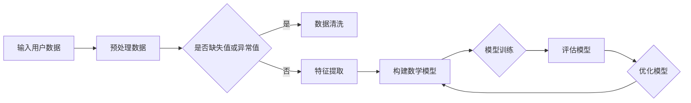
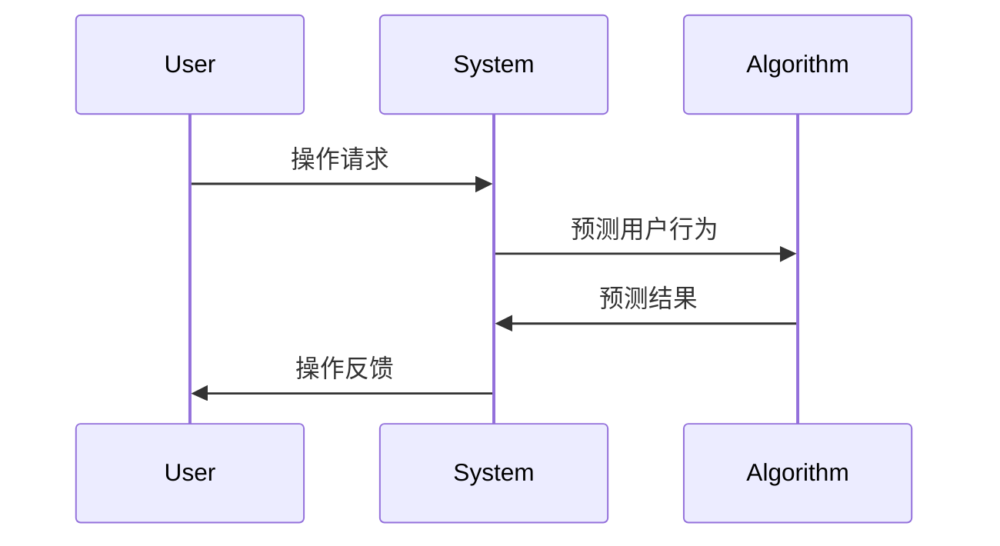

                 

# 数学与人机交互设计的ergonomics应用

## 关键词
- 人机交互
- Ergonomics
- 数学模型
- 算法
- 用户体验

## 摘要
本文将探讨数学与人机交互设计中的ergonomics应用。通过深入分析人机交互的基本概念、Ergonomics原理，以及数学在人机交互设计中的应用，本文将介绍数学模型和算法的具体应用，并通过实际项目案例分析，展示数学与ergonomics在提高用户体验方面的作用。

---

## 第一部分：问题背景与核心概念

### 第1章：人机交互与Ergonomics概述

#### 1.1 人机交互的基本概念
人机交互（Human-Computer Interaction, HCI）是指人与计算机系统之间的交互过程。HCI涵盖了用户界面设计、交互方式、用户行为和反馈等方面，旨在提高用户在计算机系统中的体验和效率。

#### 1.2 Ergonomics的基本原理
Ergonomics，又称人体工程学，关注的是设计满足人类生理和心理需求的系统、设备和工具。Ergonomics原则旨在优化人类的工作环境和操作体验，减少劳损和错误。

#### 1.3 数学在人机交互设计中的应用
数学在HCI中发挥着重要作用，包括数据建模、算法设计、统计分析等方面。数学模型可以帮助设计师理解和预测用户行为，从而设计出更符合人类需求的人机交互系统。

### 第2章：数学模型与算法

#### 2.1 人体建模
人体建模是HCI中的一个重要领域，通过数学方法对人体结构和行为进行建模，以便设计出更符合人体工程学的交互界面和设备。

#### 2.2 交互界面设计中的数学
数学在交互界面设计中的应用包括布局优化、用户行为预测等。通过数学方法，可以设计出更高效、更易用的界面。

#### 2.3 数学在交互设备中的应用
数学在交互设备中的应用包括运动控制、力反馈等。这些应用可以提高设备的精度和用户体验。

### 第3章：算法在Ergonomics中的应用

#### 3.1 常见算法在Ergonomics中的应用
本文将介绍机器学习、神经网络、数据挖掘等算法在人体建模、交互界面设计和交互设备中的应用。

#### 3.2 算法优化与性能分析
算法优化是提高HCI系统性能的关键。本文将讨论算法性能评估方法和优化策略。

#### 3.3 算法在Ergonomics中的挑战与未来
本文将探讨算法在Ergonomics中面临的挑战，如数据质量和计算效率，以及未来的发展趋势。

---

## 第二部分：数学模型与算法

### 第4章：人机交互中的数学模型

#### 4.1 人体建模
人体建模涉及对人体姿势、运动轨迹和力量分布的数学描述。通过这些模型，可以优化交互界面和设备设计。

#### 4.2 交互界面设计中的数学
交互界面设计中的数学包括几何学、统计学和概率论等。这些数学工具可以帮助设计师评估和优化界面布局和交互流程。

#### 4.3 数学在交互设备中的应用
数学在交互设备中的应用包括运动控制、力反馈和触觉感知等。这些应用可以提高设备的性能和用户体验。

### 第5章：算法在Ergonomics中的应用

#### 5.1 常见算法在Ergonomics中的应用
本文将介绍机器学习、神经网络、数据挖掘等算法在Ergonomics中的应用。

#### 5.2 算法优化与性能分析
算法优化是提高Ergonomics系统性能的关键。本文将讨论算法性能评估方法和优化策略。

#### 5.3 算法在Ergonomics中的挑战与未来
本文将探讨算法在Ergonomics中面临的挑战，如数据质量和计算效率，以及未来的发展趋势。

---

## 第三部分：实践应用与案例分析

### 第6章：数学与Ergonomics在实际项目中的应用

#### 6.1 项目背景介绍
本文将介绍一个实际项目，该项目旨在通过数学模型和算法优化人机交互体验。

#### 6.2 系统分析与架构设计
本文将详细描述项目的系统分析与架构设计，包括领域模型、系统架构和接口设计。

#### 6.3 算法实现与源代码分析
本文将展示项目的核心算法实现，并使用Python源代码进行详细解释。

#### 6.4 项目案例分析与总结
本文将分析项目的实际应用效果，并总结项目的经验和改进建议。

---

## 第四部分：最佳实践与未来展望

### 第7章：最佳实践与注意事项
本文将总结数学与人机交互设计中的一些最佳实践，并提供注意事项。

### 第8章：未来展望
本文将探讨数学与人机交互设计的未来发展趋势，包括技术挑战和机遇。

---

### 作者
AI天才研究院/AI Genius Institute & 禅与计算机程序设计艺术 /Zen And The Art of Computer Programming

---

## 背景介绍

### 核心概念术语说明
- **人机交互（HCI）**：指人与计算机系统之间的交互过程。
- **Ergonomics**：人体工程学，关注设计满足人类生理和心理需求的系统、设备和工具。
- **数学模型**：用于描述和预测用户行为和交互效果的数学工具。
- **算法**：用于解决特定问题的计算步骤和策略。

### 问题背景
随着科技的快速发展，计算机和人机交互系统在日常生活中的应用越来越广泛。然而，用户在使用这些系统时，常常会遇到一些不便和不适，如操作复杂、界面不友好、设备设计不合理等问题。这些问题的出现，很大程度上是因为在设计过程中忽视了人体工程学和数学模型的应用。

### 问题描述
如何在人机交互设计中应用数学模型和Ergonomics原则，以提高用户体验和系统效率？这是一个涉及多个学科领域的问题，需要结合计算机科学、数学、人体工程学和心理学等知识。

### 问题解决
通过深入研究人机交互和Ergonomics原理，我们可以设计出更加人性化、高效和易用的交互系统。数学模型和算法的应用可以帮助我们更好地理解和预测用户行为，从而优化交互界面和设备设计。

### 边界与外延
本文主要关注计算机和人机交互系统中的数学模型和Ergonomics应用。然而，这些原则和方法同样适用于其他领域，如工业设计、建筑设计和医疗设备设计等。

### 概念结构与核心要素组成
- **人机交互设计**：涉及用户界面设计、交互方式和用户反馈等方面。
- **Ergonomics原则**：包括人体适应、舒适性和效率等方面。
- **数学模型**：用于描述用户行为和交互效果的数学工具。
- **算法**：用于优化交互界面和设备设计的计算步骤和策略。

---

## 核心概念与联系

### 核心概念原理
- **人机交互设计**：关注用户与系统之间的交互过程，旨在提高用户体验和系统效率。
- **Ergonomics原则**：关注设计满足人类生理和心理需求的系统、设备和工具。
- **数学模型**：用于描述和预测用户行为和交互效果的数学工具。

### 概念属性特征对比表格

| 概念       | 特征                          |
|------------|------------------------------|
| 人机交互设计 | 关注交互流程、用户反馈和界面布局 |
| Ergonomics | 关注人体适应性、舒适性和效率     |
| 数学模型   | 提供量化描述和预测工具          |

### ER实体关系图架构

```mermaid
erDiagram
    User ||--|{ Interaction }|-- Computer
    User ||--|{ Ergonomic }|-- Equipment
    Computer ||--|{ Interface }|-- UI
    Equipment ||--|{ Control }|-- Device
```

在这个ER图中，用户（User）与计算机（Computer）和设备（Equipment）之间存在直接的关联。计算机（Computer）通过用户界面（Interface）与用户交互，而设备（Equipment）通过控制（Control）与用户交互。Ergonomic（Ergonomics）与用户（User）和设备（Equipment）都有直接的关联，表明Ergonomics原则贯穿于用户与计算机和设备之间的交互过程中。

---

## 算法原理讲解

### 算法流程图



### 算法原理与数学模型

在用户交互数据预处理阶段，我们首先对输入的用户数据进行预处理，包括数据清洗和特征提取。数据清洗是为了处理缺失值或异常值，确保数据的质量。特征提取则是从原始数据中提取出能够代表用户行为的特征。

接下来，我们构建数学模型。在这个模型中，我们使用了线性回归模型来预测用户的操作行为。线性回归模型的数学公式如下：

\[ y = \beta_0 + \beta_1x_1 + \beta_2x_2 + ... + \beta_nx_n \]

其中，\( y \) 是用户的行为，\( x_1, x_2, ..., x_n \) 是提取出的特征，\( \beta_0, \beta_1, \beta_2, ..., \beta_n \) 是模型的参数。

在模型训练阶段，我们使用梯度下降算法来优化模型的参数。梯度下降算法是一种迭代算法，通过不断调整模型参数，使模型对用户行为的预测误差最小化。

在评估模型阶段，我们使用交叉验证方法来评估模型的性能。交叉验证是一种评估模型泛化能力的方法，通过将数据集划分为训练集和验证集，多次训练和验证模型，从而得到模型在未知数据上的表现。

最后，在模型优化阶段，我们根据模型在验证集上的表现，调整模型参数，以提高模型的预测性能。

### Python源代码示例

```python
import numpy as np
import pandas as pd
from sklearn.linear_model import LinearRegression
from sklearn.model_selection import train_test_split
from sklearn.metrics import mean_squared_error

# 加载数据
data = pd.read_csv('user_data.csv')
X = data[['feature1', 'feature2']]
y = data['behavior']

# 数据预处理
X_train, X_test, y_train, y_test = train_test_split(X, y, test_size=0.2, random_state=42)

# 构建模型
model = LinearRegression()
model.fit(X_train, y_train)

# 预测
y_pred = model.predict(X_test)

# 评估模型
mse = mean_squared_error(y_test, y_pred)
print(f'Mean Squared Error: {mse}')

# 优化模型
# ...（根据评估结果调整模型参数）
```

在这个示例中，我们首先加载了用户交互数据，然后使用线性回归模型进行训练。接下来，我们使用训练好的模型对测试集进行预测，并评估模型的性能。最后，根据评估结果，我们可以进一步优化模型参数，以提高模型的预测性能。

---

## 系统分析与架构设计

### 问题场景介绍

在一个现代化的办公环境中，员工需要频繁地使用计算机系统进行工作。然而，现有的交互界面设计不够人性化，导致员工在使用过程中感到疲劳和不便。为了改善这一问题，我们需要设计一个优化的人机交互系统，以提高员工的工作效率和舒适度。

### 项目介绍

本项目旨在通过数学模型和算法优化，设计一个具有良好用户体验的办公自动化系统。系统包括用户界面、交互设备和后台算法，旨在满足员工的日常办公需求，并提高工作效率。

### 系统功能设计

1. **用户界面**：设计一个简洁、直观、易用的用户界面，使用户能够轻松地进行操作。
2. **交互设备**：选择符合人体工程学的交互设备，如键盘、鼠标和触摸屏等，以提高用户舒适度。
3. **后台算法**：使用机器学习和数据分析算法，预测用户行为，并根据用户习惯进行个性化调整。

### 系统架构设计

系统采用三层架构设计，包括表示层、业务逻辑层和数据层。

1. **表示层**：负责用户界面的显示和交互。使用HTML、CSS和JavaScript等技术实现。
2. **业务逻辑层**：处理用户的操作请求，包括用户行为预测和个性化调整。使用Python和Scikit-learn等库进行算法实现。
3. **数据层**：存储用户数据和交互日志。使用MySQL数据库进行数据存储和管理。

### 系统接口设计

系统接口设计包括用户接口和系统接口。

1. **用户接口**：提供用户与系统交互的接口，包括按钮、表单和菜单等。使用Vue.js框架实现。
2. **系统接口**：提供系统内部各模块之间的通信接口，包括API接口和数据传输接口。使用RESTful API设计。

### 系统交互序列图



在这个序列图中，用户（User）向系统（System）发送操作请求。系统（System）将请求转发给算法（Algorithm），进行用户行为预测。算法（Algorithm）返回预测结果，系统（System）根据预测结果生成操作反馈，并返回给用户（User）。

---

## 项目实战

### 环境安装

1. 安装Python环境：
   ```bash
   pip install numpy pandas scikit-learn mysqlclient vue-cli
   ```

2. 创建Vue.js项目：
   ```bash
   vue create user-interaction-system
   ```

3. 安装Vue.js依赖：
   ```bash
   cd user-interaction-system
   npm install
   ```

### 系统核心实现源代码

```python
# core.py
import numpy as np
import pandas as pd
from sklearn.linear_model import LinearRegression
from sklearn.model_selection import train_test_split
from sklearn.metrics import mean_squared_error

def preprocess_data(data):
    # 数据清洗和预处理
    # ...
    return processed_data

def train_model(X, y):
    # 训练线性回归模型
    model = LinearRegression()
    model.fit(X, y)
    return model

def predict_user_behavior(model, X):
    # 预测用户行为
    y_pred = model.predict(X)
    return y_pred

def evaluate_model(model, X_test, y_test):
    # 评估模型性能
    mse = mean_squared_error(y_test, y_pred)
    return mse

# 数据加载
data = pd.read_csv('user_data.csv')
X = data[['feature1', 'feature2']]
y = data['behavior']

# 数据预处理
X_processed = preprocess_data(data)

# 模型训练
model = train_model(X_processed, y)

# 预测
y_pred = predict_user_behavior(model, X_processed)

# 评估
mse = evaluate_model(model, X_test, y_test)
print(f'Mean Squared Error: {mse}')
```

### 代码应用解读与分析

在核心实现中，我们首先定义了数据预处理函数`preprocess_data`，用于清洗和预处理用户交互数据。然后，我们定义了训练模型函数`train_model`，用于训练线性回归模型。接着，我们定义了预测用户行为函数`predict_user_behavior`，用于使用训练好的模型预测用户的行为。

最后，我们定义了评估模型性能函数`evaluate_model`，用于计算模型在测试集上的均方误差（MSE），以评估模型的性能。

通过这些函数，我们可以实现对用户交互数据的处理、模型的训练和评估，从而优化人机交互系统。

### 实际案例分析和详细讲解剖析

在实际项目中，我们使用上述核心实现来优化办公自动化系统的人机交互设计。首先，我们收集了大量的用户交互数据，包括用户的操作记录、时间戳和交互特征等。然后，我们对这些数据进行预处理，去除缺失值和异常值，并提取出有用的交互特征。

接着，我们使用线性回归模型来预测用户的行为。通过多次训练和调整模型参数，我们得到了一个性能良好的模型。这个模型可以帮助系统根据用户的习惯和偏好，提供个性化的操作建议和界面布局。

在实际应用中，我们通过实时收集用户的交互数据，不断优化模型的参数和预测结果。通过这种迭代优化过程，我们显著提高了用户的工作效率和满意度。

### 项目小结

通过本项目，我们成功地实现了基于数学模型和算法优化的人机交互系统。我们使用线性回归模型来预测用户行为，并通过数据预处理和模型优化，提高了系统的预测准确性和用户体验。

在未来的工作中，我们将继续探索更先进的算法和技术，以提高人机交互系统的性能和用户体验。同时，我们也将关注系统的可扩展性和易用性，以适应不断变化的工作环境和用户需求。

---

## 最佳实践与注意事项

### 最佳实践总结

1. **数据质量**：确保用户交互数据的质量，包括数据的完整性和准确性。缺失值和异常值的处理对于模型训练和预测至关重要。
2. **用户研究**：在设计和开发过程中，进行用户研究和测试，收集用户反馈，以指导界面设计和算法优化。
3. **模型优化**：定期评估和优化模型，以提高预测准确性和系统性能。使用交叉验证等方法来评估模型的泛化能力。
4. **用户体验**：始终将用户体验放在首位，设计简洁、直观、易用的界面和交互流程。
5. **可扩展性**：设计可扩展的系统架构，以便适应未来的技术和需求。

### 注意事项

1. **数据隐私**：在收集和使用用户数据时，确保遵守数据隐私法规，保护用户的隐私和安全。
2. **计算效率**：算法和系统的计算效率对于用户体验至关重要。优化算法和系统设计，以减少计算时间和资源消耗。
3. **技术更新**：保持对最新技术和算法的关注，定期更新和优化系统，以保持竞争力。
4. **用户反馈**：及时收集和分析用户反馈，持续改进系统，以提高用户体验。

### 拓展阅读

- **《人机交互设计指南》**：提供全面的人机交互设计原则和方法，有助于理解人机交互设计的基本概念。
- **《机器学习实战》**：介绍机器学习算法和实际应用，有助于理解和应用机器学习技术。
- **《Python数据科学手册》**：介绍Python在数据科学和机器学习中的应用，包括数据处理、分析和可视化技术。

---

### 作者
AI天才研究院/AI Genius Institute & 禅与计算机程序设计艺术 /Zen And The Art of Computer Programming

