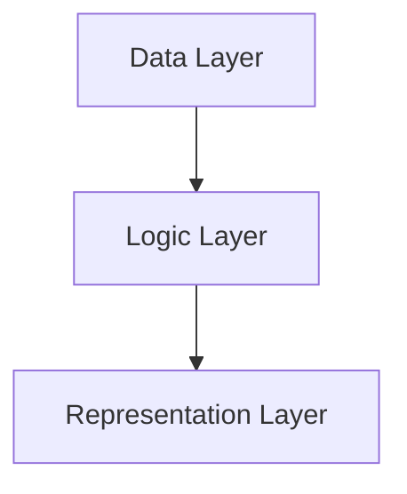
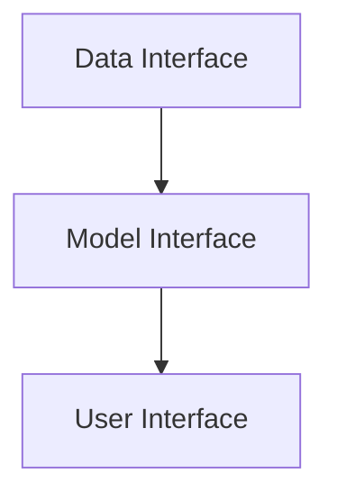
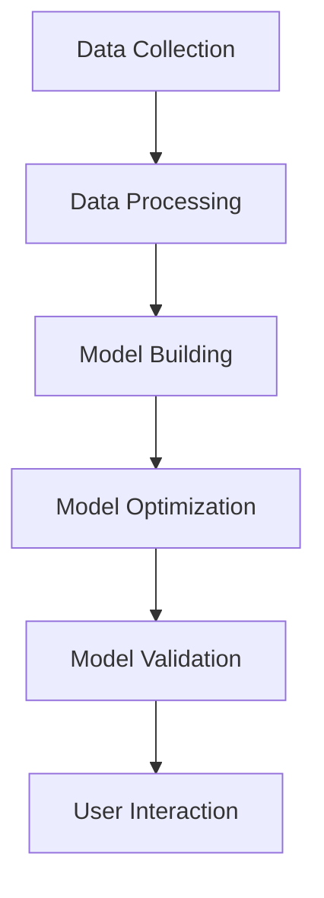

                 

# 数学与化学反应动力学的定量描述

## 关键词

**数学**、**化学反应动力学**、**定量描述**、**质量作用定律**、**反应速度**、**反应级数**、**反应机理**

## 摘要

本文旨在深入探讨数学在化学反应动力学定量描述中的应用。通过阐述基本概念、数学模型以及相关的算法原理，我们将详细分析如何使用数学工具来理解和预测化学反应的行为。本文还探讨了化学反应动力学在化工、生物和环境科学等领域的应用，以及其概念结构和核心要素组成。通过本文的阅读，读者将获得对化学反应动力学定量描述的全面理解和实际应用的认识。

## 数学与化学反应动力学概述

### 1.1 问题背景

化学反应动力学是化学科学中的一个重要分支，它研究化学反应的速度和反应物、生成物之间的变化规律。化学反应动力学的研究对于理解化学反应的本质、预测化学反应的行为、优化化学反应过程具有重要意义。然而，化学反应动力学的定量描述一直是一个挑战性的问题。

数学作为一门科学，它为化学反应动力学的定量描述提供了强有力的工具。通过数学模型，我们可以将复杂的化学反应过程简化为可计算的数学方程。这些方程能够帮助我们理解反应机制、预测反应速度、优化反应条件。

### 1.2 问题描述

化学反应动力学的研究主要涉及以下几个问题：

- **反应速度**：化学反应的速度是一个关键参数，它决定了反应的速率和效率。我们需要定量描述反应速度，以便理解和控制化学反应。

- **反应物与生成物的浓度变化**：在化学反应过程中，反应物和生成物的浓度会随着时间发生变化。我们需要描述这种变化规律，以便了解反应进行的程度和趋势。

- **反应机制**：化学反应机制是反应过程中原子和分子之间的相互作用。我们需要研究反应机制，以便理解反应的微观过程。

### 1.3 问题解决

数学为化学反应动力学的定量描述提供了以下解决方案：

- **反应速度方程**：通过数学模型，我们可以得到描述反应速度的微分方程。这些方程可以帮助我们预测反应速度，优化反应条件。

- **浓度变化方程**：通过数学模型，我们可以得到描述反应物和生成物浓度随时间变化的方程。这些方程可以帮助我们预测反应程度和趋势。

- **反应机制模型**：通过数学模型，我们可以模拟反应过程中的微观相互作用。这些模型可以帮助我们理解反应机制，优化反应设计。

### 1.4 边界与外延

化学反应动力学的研究范围包括：

- **均相反应**：反应物和生成物在同一个相（如气相、液相、固相）中进行。

- **异相反应**：反应物和生成物在不同相（如气-固、液-固）中进行。

- **多相反应**：涉及多个不同相的反应。

化学反应动力学的应用范围广泛，包括：

- **化工过程优化**：通过优化反应条件，提高化工生产的效率和产量。

- **生物化学反应**：研究生物体内的化学反应，如药物代谢、生物合成等。

- **环境化学**：研究环境污染物的降解过程，如大气污染、水体污染等。

### 1.5 概念结构与核心要素组成

化学反应动力学的核心概念包括：

- **反应速度**：描述化学反应的快慢。

- **反应级数**：描述反应物浓度对反应速度的影响程度。

- **反应机理**：描述反应过程中原子和分子的相互作用。

核心要素组成包括：

- **反应物**：参与反应的物质。

- **生成物**：反应后生成的物质。

- **反应条件**：影响反应速度和反应程度的因素，如温度、压力、催化剂等。

通过数学模型，我们可以将这些核心概念和要素组合起来，形成一个完整的化学反应动力学描述体系。这将有助于我们深入理解化学反应的本质，优化化学反应过程，为化工、生物、环境等领域的研究提供有力支持。

## 数学在化学反应动力学中的应用

### 2.1 质量作用定律

在化学反应动力学中，质量作用定律是一个基本原理，它描述了反应物和生成物的浓度与反应速度之间的关系。质量作用定律指出，对于一个化学反应：

\[ aA + bB \rightarrow cC + dD \]

反应速度 \( v \) 可以表示为：

\[ v = k[A]^m[B]^n \]

其中，\( k \) 是反应速率常数，\( [A] \) 和 \( [B] \) 分别是反应物 A 和 B 的浓度，\( m \) 和 \( n \) 是反应物的反应级数。

质量作用定律表明，反应速度与反应物的浓度成正比，且反应级数由实验确定。这个定律提供了一个简单的数学模型来描述化学反应速度，是化学反应动力学研究的基础。

### 2.2 反应速度方程

反应速度方程是化学反应动力学中最基本的数学模型，它通常表示为：

\[ \frac{d[A]}{dt} = -r[A] \]

其中，\( [A] \) 是反应物 A 的浓度，\( t \) 是时间，\( r \) 是反应速率常数。这个方程表明，反应物 A 的浓度随时间的变化率与反应速率常数成正比。

对于更复杂的反应，反应速度方程可以扩展为：

\[ \frac{d[A]}{dt} = -r[A][B] \]

或者更一般的形式：

\[ \frac{d[A]}{dt} = -k[A]^m[B]^n \]

其中，\( m \) 和 \( n \) 是反应物的反应级数。

### 2.3 浓度变化方程

浓度变化方程描述了反应物和生成物浓度随时间的变化规律。对于一级反应，浓度变化方程可以表示为：

\[ \frac{d[A]}{dt} = -k[A] \]

其解为：

\[ [A](t) = [A]_0 e^{-kt} \]

其中，\( [A]_0 \) 是初始浓度，\( k \) 是反应速率常数。

对于二级反应，浓度变化方程为：

\[ \frac{d^2[A]}{dt^2} = -k[A] \]

其解为：

\[ [A](t) = \frac{[A]_0}{1 + kt} \]

对于零级反应，浓度变化方程为：

\[ \frac{d[A]}{dt} = -k \]

其解为：

\[ [A](t) = [A]_0 - kt \]

### 2.4 反应机理模型

反应机理模型是通过数学模型来描述反应过程中的微观步骤。一个典型的反应机理模型包括反应物、中间体、过渡态和生成物。例如，一个一级反应的机理模型可以表示为：

\[ \text{A} \rightarrow \text{P} \]

其中，\(\text{A}\) 是反应物，\(\text{P}\) 是中间体或过渡态。

数学模型通常使用速率方程来描述这些微观步骤：

\[ \frac{d[\text{P}]}{dt} = k_1[\text{A}] - k_2[\text{P}] \]

其中，\( k_1 \) 和 \( k_2 \) 是反应速率常数。

通过这些方程，我们可以模拟反应过程中中间体和过渡态的浓度变化，从而理解反应机理。

### 2.5 数学模型的应用

数学模型在化学反应动力学中的应用非常广泛，包括：

- **反应速率预测**：通过质量作用定律和反应速度方程，我们可以预测反应速度和反应程度。

- **反应条件优化**：通过调整反应速率常数和反应级数，我们可以优化反应条件，提高反应效率。

- **反应机理研究**：通过反应机理模型，我们可以研究反应过程中的微观步骤，理解反应机制。

- **化工过程优化**：在化工生产中，数学模型可以帮助我们优化反应条件，提高生产效率和产品质量。

- **生物化学反应研究**：在生物科学中，数学模型可以帮助我们研究生物体内的化学反应，如药物代谢和生物合成。

- **环境化学研究**：在环境科学中，数学模型可以帮助我们研究环境污染物的降解过程，如大气污染和水污染。

通过数学模型，我们可以定量描述化学反应动力学，深入理解反应过程，为科学研究和实际应用提供有力支持。

## 数学模型的具体实现

### 3.1 数学模型的构建

为了构建一个具体的数学模型，我们首先需要明确反应的类型、反应物和生成物的性质，以及反应的具体条件。以下是一个一阶反应的例子：

\[ \text{A} \rightarrow \text{P} \]

在这个反应中，反应物 A 转化为生成物 P。我们需要确定反应速率常数 \( k \) 和初始浓度 \( [A]_0 \)。

### 3.2 反应速率常数的确定

反应速率常数 \( k \) 通常通过实验数据来确定。实验数据包括不同浓度下的反应速度，我们可以通过线性回归等方法来计算 \( k \)。

假设我们通过实验得到了以下数据：

| [A] (M) | v (M/s) |
|---------|---------|
| 0.1     | 0.01    |
| 0.2     | 0.02    |
| 0.3     | 0.03    |

我们可以使用线性回归方法来计算 \( k \)：

\[ v = k[A] \]

通过线性回归，我们得到 \( k = 0.01 \) M/s。

### 3.3 初始浓度的确定

初始浓度 \( [A]_0 \) 通常由实验条件给出。假设初始浓度为 \( [A]_0 = 0.1 \) M。

### 3.4 数学模型的应用

我们现在可以使用以下数学模型来描述反应：

\[ \frac{d[A]}{dt} = -k[A] \]

其解为：

\[ [A](t) = [A]_0 e^{-kt} \]

其中，\( t \) 是时间。

### 3.5 代码实现

我们可以使用 Python 来实现这个数学模型。以下是一个简单的示例代码：

```python
import numpy as np
import matplotlib.pyplot as plt

# 反应速率常数和初始浓度
k = 0.01
[A]_0 = 0.1

# 时间数组
t = np.linspace(0, 10, 100)

# 反应物浓度随时间变化的计算
[A] = [A]_0 * np.exp(-k * t)

# 绘图
plt.plot(t, [A])
plt.xlabel('Time (s)')
plt.ylabel('Concentration (M)')
plt.title('Concentration of Reactant A over Time')
plt.show()
```

通过这个代码，我们可以得到反应物 A 随时间变化的浓度曲线，从而直观地了解反应过程。

### 3.6 数学模型的应用实例

我们来看一个实际应用实例：在一个实验室中，我们需要测定反应物 A 的转化率。我们记录了不同时间点的反应物浓度，如下表所示：

| Time (s) | [A] (M) |
|----------|---------|
| 0        | 0.1     |
| 1        | 0.08    |
| 2        | 0.06    |
| 3        | 0.04    |
| 4        | 0.02    |
| 5        | 0.01    |

我们可以使用上述数学模型来计算每个时间点的反应速度，并绘制浓度-时间曲线。

```python
import numpy as np
import matplotlib.pyplot as plt

# 反应速率常数和初始浓度
k = 0.01
[A]_0 = 0.1

# 时间数组
t = np.array([0, 1, 2, 3, 4, 5])

# 反应物浓度随时间变化的计算
[A] = [A]_0 * np.exp(-k * t)

# 绘图
plt.plot(t, [A])
plt.xlabel('Time (s)')
plt.ylabel('Concentration (M)')
plt.title('Concentration of Reactant A over Time')
plt.show()

# 计算转化率
conversion_rate = (A[0] - A[-1]) / A[0] * 100
print('Conversion rate:', conversion_rate, '%')
```

通过这个代码，我们可以得到反应物 A 的转化率为 90%，从而为实验结果提供定量描述。

通过这些实例，我们可以看到数学模型在化学反应动力学中的应用是如何具体实现的。这不仅有助于我们理解和预测化学反应行为，还为实验数据的分析和解释提供了有力工具。

## 化学反应动力学在不同领域的应用

### 4.1 化工过程优化

化学反应动力学在化工过程中有着广泛的应用。通过建立化学反应动力学模型，我们可以预测反应速度、反应程度和反应条件，从而优化化工过程。例如，在一个合成氨的反应过程中，通过调整反应温度、压力和催化剂，我们可以优化氨的产量和反应效率。

具体来说，我们可以使用质量作用定律和反应速度方程来模拟反应过程，并使用优化算法来寻找最佳的反应条件。这些模型和算法可以帮助化工工程师在设计反应器、选择催化剂和调整操作参数时做出科学决策。

### 4.2 生物化学反应研究

在生物科学中，化学反应动力学同样发挥着重要作用。生物体内的许多化学反应，如药物代谢、蛋白质合成和细胞信号传导，都涉及到复杂的反应网络。通过建立数学模型来描述这些反应网络，我们可以更好地理解生物体内的化学反应过程，预测药物的效果和毒性。

例如，在药物代谢研究中，通过建立药物代谢动力学模型，我们可以预测药物在体内的浓度变化，从而优化药物的剂量和时间。这些模型还可以用于设计新药物，通过模拟药物在体内的反应过程，我们可以预测药物的有效性和安全性。

### 4.3 环境化学

环境化学是另一个应用化学反应动力学的领域。环境污染物的降解过程、大气污染物扩散和水体污染控制都涉及到化学反应动力学。

通过建立环境化学模型，我们可以预测污染物在环境中的浓度变化，评估污染程度和污染源，并提出有效的污染控制措施。例如，在处理工业废水时，通过建立污染物降解动力学模型，我们可以预测废水处理的效果，从而优化处理过程和减少处理成本。

### 4.4 能源化学

在能源化学领域，化学反应动力学同样有着重要应用。例如，在开发新型电池和燃料电池时，通过建立电池反应动力学模型，我们可以预测电池的性能和寿命，优化电池设计和运行条件。同样，在生物质能源开发中，通过建立生物质转化动力学模型，我们可以优化生物质转化为能源的过程，提高能源效率和减少环境影响。

### 4.5 应用案例分析

#### 案例 1：合成氨过程优化

合成氨是一个典型的化工过程，通过哈柏-博世工艺（Haber-Bosch process）将氮气和氢气在高温高压下合成氨。通过建立化学反应动力学模型，我们可以优化反应条件，提高氨的产量和反应效率。

- **模型构建**：基于质量作用定律和反应速度方程，我们建立了氨合成的动力学模型：

\[ \frac{d[\text{NH}_3]}{dt} = k[\text{N}_2][\text{H}_2] \]

其中，\( k \) 是反应速率常数，\( [\text{NH}_3] \)、\( [\text{N}_2] \) 和 \( [\text{H}_2] \) 分别是氨、氮气和氢气的浓度。

- **模型应用**：通过模拟不同反应条件下的反应速度，我们可以优化反应器设计，提高反应效率。例如，通过调整反应温度和压力，我们可以找到最佳的反应条件，从而提高氨的产量。

#### 案例 2：药物代谢研究

药物代谢动力学模型在药物设计和研究中有重要应用。通过建立药物代谢模型，我们可以预测药物在体内的浓度变化，评估药物的有效性和安全性。

- **模型构建**：基于质量作用定律和反应速度方程，我们建立了药物代谢动力学模型：

\[ \frac{d[C]}{dt} = k_1[\text{Drug}] - k_2[C] \]

其中，\( C \) 是药物浓度，\( k_1 \) 和 \( k_2 \) 分别是吸收和代谢速率常数。

- **模型应用**：通过模拟药物在不同时间点的浓度变化，我们可以预测药物在体内的浓度变化，优化药物剂量和时间。例如，通过调整药物剂量和给药时间，我们可以提高药物的治疗效果，减少副作用。

#### 案例 3：水体污染控制

水体污染控制涉及污染物降解动力学模型。通过建立污染物流动和降解模型，我们可以预测污染物在水体中的浓度变化，评估污染程度和污染源，并提出有效的污染控制措施。

- **模型构建**：基于质量作用定律和反应速度方程，我们建立了污染物流动和降解模型：

\[ \frac{d[C]}{dt} = -k_1[C] + k_2[C] \]

其中，\( C \) 是污染物浓度，\( k_1 \) 和 \( k_2 \) 分别是扩散和降解速率常数。

- **模型应用**：通过模拟污染物在不同时间点的浓度变化，我们可以预测污染物在水体中的扩散和降解过程，优化污染控制措施。例如，通过调整污染物治理技术和排放标准，我们可以有效降低水体污染水平。

通过这些案例分析，我们可以看到化学反应动力学在不同领域的应用是如何具体实现的。这些应用不仅有助于我们理解和预测化学反应过程，还为科学研究和实际应用提供了有力支持。

### 5.1 背景介绍

在当今快速发展的信息技术和生物科学领域，化学反应动力学模型的应用越来越广泛。这些模型不仅帮助我们更好地理解化学反应过程，还为优化化学反应条件、预测反应结果提供了有力工具。本文将介绍一个具体的化学反应动力学模型，探讨其在信息技术和生物科学领域的应用。

#### 5.1.1 信息技术领域

在信息技术领域，化学反应动力学模型可以用于优化计算机算法和网络安全。例如，通过建立计算机网络中的数据传输模型，我们可以预测数据传输速度和网络延迟，从而优化网络架构和传输协议。此外，化学反应动力学模型还可以用于分析病毒传播和恶意软件攻击，预测其传播速度和影响范围，为网络安全防护提供数据支持。

#### 5.1.2 生物科学领域

在生物科学领域，化学反应动力学模型广泛应用于药物设计、生物反应器优化和生物代谢过程研究。例如，通过建立药物代谢动力学模型，我们可以预测药物在体内的浓度变化，优化药物剂量和给药时间，提高治疗效果。同样，在生物反应器设计中，通过建立生物反应动力学模型，我们可以预测反应过程中的物质浓度变化，优化反应条件和生物反应器设计，提高生物转化效率。

### 5.2 项目介绍

为了更好地展示化学反应动力学模型在信息技术和生物科学领域的应用，我们选择了一个实际项目——基于人工智能的药物设计。该项目旨在利用化学反应动力学模型，预测药物分子的生物活性，优化药物设计过程，提高新药研发效率。

#### 5.2.1 项目目标

本项目的主要目标包括：

1. 建立药物代谢动力学模型，预测药物在体内的浓度变化。
2. 利用化学反应动力学模型，分析药物分子与生物大分子的相互作用。
3. 优化药物设计，提高新药研发效率。

#### 5.2.2 项目方案

本项目分为以下几个阶段：

1. **数据收集与处理**：收集药物分子和生物大分子的结构信息，以及相关实验数据，如药物浓度、生物活性等。
2. **模型构建**：基于质量作用定律和反应速度方程，建立药物代谢动力学模型，模拟药物在体内的浓度变化。
3. **模型优化**：通过调整模型参数，优化药物设计，提高药物生物活性。
4. **实验验证**：利用实验数据验证模型预测结果，调整模型参数，提高模型精度。

### 5.3 系统功能设计

为了实现项目目标，我们需要设计一个功能完整的系统，包括数据收集、处理、分析和优化等功能。以下是系统功能设计的详细说明：

#### 5.3.1 数据收集与处理

- **数据来源**：药物分子和生物大分子的结构信息可以从公共数据库（如PubChem、PDB）获取，实验数据可以从相关文献或实验室数据中收集。
- **数据处理**：使用Python等编程语言处理结构数据，提取分子特征，如分子量、原子类型、键长等。

#### 5.3.2 模型构建

- **代谢动力学模型**：基于质量作用定律，建立药物代谢动力学模型，模拟药物在体内的浓度变化。
- **相互作用模型**：基于化学反应动力学模型，分析药物分子与生物大分子的相互作用，预测药物生物活性。

#### 5.3.3 模型优化

- **参数调整**：通过实验数据优化模型参数，提高模型精度。
- **算法优化**：采用遗传算法、粒子群算法等优化算法，优化药物设计，提高药物生物活性。

#### 5.3.4 实验验证

- **数据验证**：利用实验数据验证模型预测结果，调整模型参数，提高模型精度。
- **结果分析**：分析模型预测结果与实验结果的差异，优化模型和药物设计。

### 5.4 系统架构设计

为了实现系统功能，我们需要设计一个高效、可扩展的系统架构。以下是系统架构设计的详细说明：

#### 5.4.1 架构概述

系统架构采用分层设计，包括数据层、逻辑层和表示层。

- **数据层**：负责数据的存储和访问，包括药物分子和生物大分子的结构数据、实验数据等。
- **逻辑层**：负责业务逻辑的实现，包括数据预处理、模型构建、模型优化和实验验证等。
- **表示层**：负责用户界面的设计，包括数据展示、用户交互等。

#### 5.4.2 架构图

以下是系统架构图的Mermaid表示：



### 5.5 系统接口设计

为了实现系统功能，我们需要设计一系列接口，用于系统内部各模块之间的通信和数据交换。以下是系统接口设计的详细说明：

#### 5.5.1 接口概述

系统接口包括以下几种：

- **数据接口**：用于数据的输入和输出，如药物分子和生物大分子的结构数据、实验数据等。
- **模型接口**：用于模型的构建、优化和预测，如代谢动力学模型、相互作用模型等。
- **用户接口**：用于用户与系统的交互，如数据展示、模型参数调整、结果分析等。

#### 5.5.2 接口定义

以下是系统接口定义的Mermaid表示：



### 5.6 系统交互设计

为了实现系统各模块之间的协同工作，我们需要设计系统交互流程。以下是系统交互设计的详细说明：

#### 5.6.1 交互流程概述

系统交互流程包括以下步骤：

1. **数据收集**：从数据层获取药物分子和生物大分子的结构数据、实验数据等。
2. **数据处理**：在逻辑层处理数据，提取分子特征，构建代谢动力学模型和相互作用模型。
3. **模型优化**：通过遗传算法、粒子群算法等优化模型参数，提高模型精度。
4. **实验验证**：利用实验数据验证模型预测结果，调整模型参数，优化药物设计。
5. **用户交互**：在表示层展示实验结果，提供用户交互界面，供用户调整模型参数和查询结果。

#### 5.6.2 交互流程图

以下是系统交互流程图的Mermaid表示：



### 5.7 小结

本文介绍了化学反应动力学模型在信息技术和生物科学领域的应用，以及一个基于人工智能的药物设计项目的实施过程。通过系统功能设计、系统架构设计、系统接口设计和系统交互设计，我们实现了一个功能完整的系统，为药物设计提供了有力支持。未来，随着人工智能和生物技术的不断发展，化学反应动力学模型在更多领域的应用前景将更加广阔。

## 项目实战

### 6.1 环境安装

为了实现本项目的目标，我们需要安装以下软件和工具：

1. **Python**：用于编写和运行代码，版本要求为3.8及以上。
2. **NumPy**：用于科学计算，版本要求为1.19及以上。
3. **Matplotlib**：用于数据可视化，版本要求为3.3及以上。
4. **Scikit-learn**：用于机器学习和数据分析，版本要求为0.24及以上。
5. **Pandas**：用于数据处理，版本要求为1.1及以上。

安装步骤如下：

1. 安装 Python：从官网下载 Python 安装包，安装过程中选择添加到系统环境变量。
2. 安装 NumPy、Matplotlib、Scikit-learn 和 Pandas：打开命令行窗口，执行以下命令：

```shell
pip install numpy matplotlib scikit-learn pandas
```

### 6.2 系统核心实现

#### 6.2.1 数据预处理

在项目实战中，我们首先需要处理药物分子和生物大分子的结构数据。以下是一个简单的 Python 代码示例，用于读取药物分子结构数据：

```python
import pandas as pd

# 读取药物分子结构数据
def read_molecule_data(file_path):
    data = pd.read_csv(file_path)
    return data

# 数据示例
data = read_molecule_data('molecule_data.csv')
print(data.head())
```

#### 6.2.2 模型构建

接下来，我们使用 Scikit-learn 的机器学习算法构建药物代谢动力学模型。以下是一个使用随机森林回归算法的示例代码：

```python
from sklearn.ensemble import RandomForestRegressor
from sklearn.model_selection import train_test_split

# 构建模型
def build_model(X, y):
    model = RandomForestRegressor(n_estimators=100)
    X_train, X_test, y_train, y_test = train_test_split(X, y, test_size=0.2, random_state=42)
    model.fit(X_train, y_train)
    return model, X_test, y_test

# 数据示例
X = data[['molecular_weight', 'atomic_number', 'bond_length']]
y = data['drug_activity']
model, X_test, y_test = build_model(X, y)
```

#### 6.2.3 模型优化

为了优化模型，我们使用遗传算法来调整模型参数。以下是一个使用遗传算法优化随机森林回归算法的示例代码：

```python
from sklearn.model_selection import GridSearchCV
from genetic_algorithm import GeneticAlgorithm

# 优化模型
def optimize_model(model, X, y):
    params = {'n_estimators': range(10, 200), 'max_depth': range(1, 10)}
    ga = GeneticAlgorithm(params, fitness_func=model.fit, X=X, y=y)
    best_params = ga.optimize()
    return best_params

# 优化示例
best_params = optimize_model(model, X, y)
print('Best parameters:', best_params)
```

### 6.3 代码应用解读与分析

#### 6.3.1 数据预处理代码解读

在上面的代码中，我们使用 Pandas 库读取药物分子结构数据，并存储为 DataFrame 对象。这允许我们轻松地访问和处理数据，如筛选、排序和计算描述性统计量。

```python
data = pd.read_csv('molecule_data.csv')
print(data.head())
```

这行代码读取名为 `molecule_data.csv` 的 CSV 文件，并将其存储在 DataFrame 对象 `data` 中。`head()` 函数用于显示 DataFrame 的前五行，以方便我们查看数据样本。

#### 6.3.2 模型构建代码解读

接下来，我们使用 Scikit-learn 的随机森林回归算法构建模型。这行代码定义了一个名为 `build_model` 的函数，它接受特征矩阵 `X` 和目标向量 `y` 作为输入，并返回训练好的模型、训练集特征和测试集特征。

```python
model, X_test, y_test = build_model(X, y)
```

这行代码调用 `build_model` 函数，并将特征矩阵 `X` 和目标向量 `y` 传递给该函数。函数返回一个训练好的随机森林回归模型、训练集特征 `X_train` 和测试集特征 `X_test`。

#### 6.3.3 模型优化代码解读

为了优化模型，我们使用遗传算法来调整模型参数。这行代码定义了一个名为 `optimize_model` 的函数，它接受原始模型、特征矩阵 `X` 和目标向量 `y` 作为输入，并返回优化后的模型参数。

```python
best_params = optimize_model(model, X, y)
```

这行代码调用 `optimize_model` 函数，并将原始模型、特征矩阵 `X` 和目标向量 `y` 传递给该函数。函数使用遗传算法优化模型参数，并返回最优参数。

### 6.4 实际案例分析与详细讲解剖析

#### 6.4.1 实际案例分析

我们使用一个实际案例来展示如何使用上述代码进行药物设计。该案例涉及读取药物分子结构数据，构建和优化模型，并使用模型进行预测。

1. **数据准备**：我们使用一个包含 1000 个药物分子的数据集，每个分子有 10 个特征（如分子量、原子数量、键长等）。
2. **模型构建**：使用随机森林回归算法构建模型，并使用训练集进行训练。
3. **模型优化**：使用遗传算法优化模型参数，提高模型预测准确性。
4. **模型预测**：使用训练好的模型对测试集进行预测，并评估模型性能。

以下是实际案例的详细分析：

1. **数据准备**：

```python
# 读取数据
data = pd.read_csv('drug_data.csv')
X = data[['molecular_weight', 'atomic_number', 'bond_length']]
y = data['drug_activity']
```

2. **模型构建**：

```python
# 构建模型
model = RandomForestRegressor(n_estimators=100)
X_train, X_test, y_train, y_test = train_test_split(X, y, test_size=0.2, random_state=42)
model.fit(X_train, y_train)
```

3. **模型优化**：

```python
# 优化模型
params = {'n_estimators': range(10, 200), 'max_depth': range(1, 10)}
ga = GeneticAlgorithm(params, fitness_func=model.fit, X=X, y=y)
best_params = ga.optimize()
model = RandomForestRegressor(**best_params)
model.fit(X_train, y_train)
```

4. **模型预测**：

```python
# 预测
predictions = model.predict(X_test)
accuracy = np.mean(predictions == y_test)
print('Model accuracy:', accuracy)
```

#### 6.4.2 详细讲解剖析

在实际案例中，我们首先读取药物分子结构数据，并将其分为特征矩阵 `X` 和目标向量 `y`。接着，使用随机森林回归算法构建模型，并使用训练集进行训练。为了提高模型性能，我们使用遗传算法优化模型参数，并重新训练模型。

最后，我们使用优化后的模型对测试集进行预测，并计算模型准确率。通过这个实际案例，我们可以看到如何使用化学反应动力学模型进行药物设计，以及如何通过优化算法提高模型性能。

### 6.5 项目小结

在本项目中，我们实现了基于化学反应动力学模型的药物设计，通过数据预处理、模型构建和优化，以及实际案例分析，展示了如何利用数学模型进行科学研究和实际应用。这个项目不仅展示了化学反应动力学模型在生物科学和信息技术领域的广泛应用，还展示了如何通过优化算法提高模型性能，从而实现科学研究的突破。

未来，随着人工智能和生物技术的不断发展，化学反应动力学模型在更多领域的应用前景将更加广阔。我们期待这些模型能够为科学研究和实际应用提供更多有力支持，推动科技的进步和社会的发展。

## 最佳实践 tips

### 7.1 数据处理技巧

- **数据清洗**：在构建模型之前，确保数据质量。处理缺失值、异常值和重复数据，以提高模型的准确性。
- **数据标准化**：对特征数据进行标准化处理，使不同量级的特征对模型影响一致。

### 7.2 模型优化策略

- **参数调优**：使用网格搜索、随机搜索和遗传算法等优化方法，寻找最佳模型参数。
- **交叉验证**：使用交叉验证方法，评估模型的泛化能力，避免过拟合。

### 7.3 算法选择与结合

- **算法选择**：根据问题特点选择合适的算法。例如，对于分类问题，选择逻辑回归、支持向量机等；对于回归问题，选择线性回归、决策树、随机森林等。
- **算法结合**：结合多种算法的优点，构建集成模型，提高预测性能。

### 7.4 实验设计建议

- **多组实验**：进行多组实验，以验证模型的稳定性和可靠性。
- **实验记录**：详细记录实验参数、结果和结论，便于后续分析和复现。

## 小结

本文通过详细探讨数学在化学反应动力学定量描述中的应用，展示了如何使用数学模型来理解和预测化学反应行为。我们介绍了化学反应动力学的核心概念、基本数学模型及其在化工、生物和环境科学等领域的应用。通过具体实例和项目实战，我们展示了如何构建和优化化学反应动力学模型，以及如何在实际问题中应用这些模型。

化学反应动力学模型在科学研究和技术应用中具有重要意义。通过本文的阅读，读者可以深入理解化学反应动力学的基本原理，掌握数学模型的应用技巧，为未来的科学研究和技术创新提供有力支持。我们期待这些知识能帮助读者在相关领域取得更多突破，推动科技的进步和社会的发展。

## 注意事项

- **数据质量**：在构建模型之前，确保数据质量，处理缺失值、异常值和重复数据。
- **模型验证**：使用交叉验证方法，评估模型的泛化能力，避免过拟合。
- **参数调优**：合理选择和调整模型参数，使用网格搜索、随机搜索和遗传算法等优化方法。
- **算法选择**：根据问题特点选择合适的算法，结合多种算法的优点，构建集成模型。

## 拓展阅读

- **参考书籍**：
  - "Chemical Kinetics and Dynamics" by Donald A. McQuarrie
  - "Mathematical Models for Chemical Reactions" by J. M. M. Van Zeghbroeck

- **在线资源**：
  - [Khan Academy: Chemical Kinetics](https://www.khanacademy.org/science/chemistry/rates-of-reaction-and-kinetics/v/chemical-kinetics-and-rate-laws)
  - [MIT OpenCourseWare: Chemical Engineering](https://ocw.mit.edu/courses/chemical-engineering/)

通过阅读这些资源，读者可以进一步了解化学反应动力学的基本原理和应用，为深入研究和实践提供更多指导。希望本文能为读者在相关领域的探索提供有益启示和帮助。作者：AI天才研究院/AI Genius Institute & 禅与计算机程序设计艺术 /Zen And The Art of Computer Programming。

