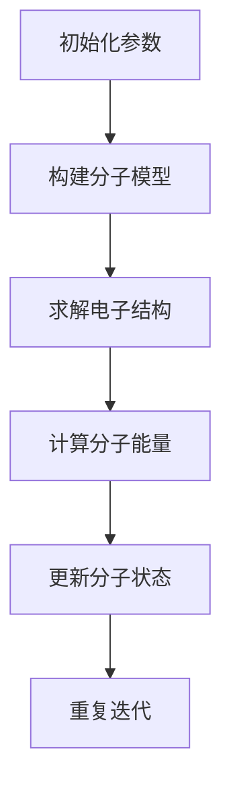
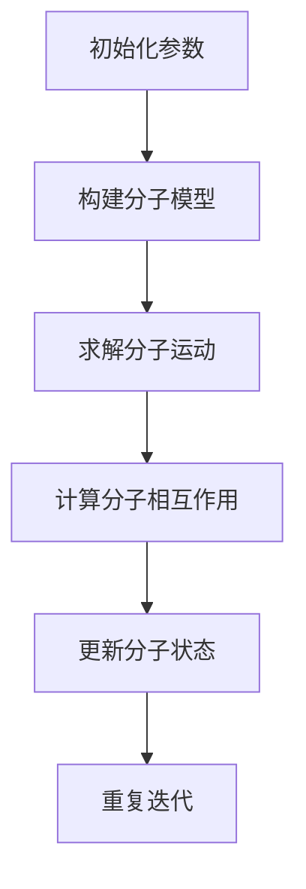
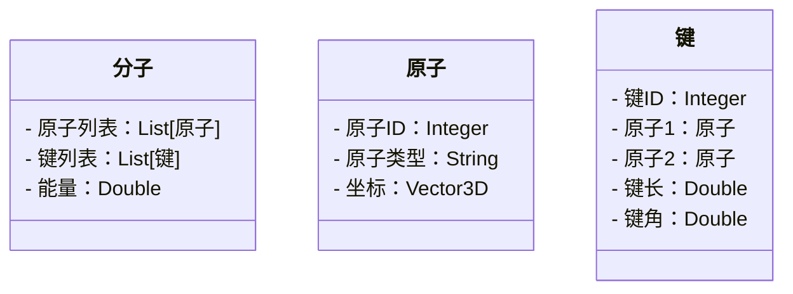
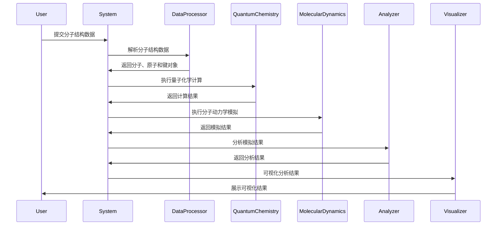

                 

### 数学与化学：分子结构的数学模型

关键词：数学模型、分子结构、量子化学计算、分子动力学模拟、算法原理

摘要：本文深入探讨了数学模型在化学领域，尤其是分子结构研究中的应用。通过对核心概念的阐述、数学公式和算法的讲解，以及系统分析与架构设计，本文展示了如何利用数学模型理解和预测分子行为。文章旨在为读者提供一个全面的技术解读，帮助他们掌握分子结构的数学建模方法。

### 第一部分：背景介绍

#### 第1章 数学与化学：问题背景与核心概念

##### 1.1 问题背景

在化学中，分子结构的理解是解决化学反应机理、材料设计、药物研发等领域的关键。传统的实验方法虽然能提供部分结构信息，但存在效率低、成本高的问题。近年来，随着计算机技术的发展，数学模型成为研究分子结构的有力工具，可以高效、准确地预测和解释分子行为。

**问题描述**：化学实验中，分子结构信息的获取往往需要大量的时间和资源，而实验结果也受到实验条件和仪器的限制。为了克服这些限制，科学家们开始寻求数学方法来模拟分子结构，从而预测分子的行为。

**问题解决**：数学模型在分子结构研究中扮演着重要角色，如量子化学计算、分子动力学模拟等。这些模型利用数学公式和算法，从理论上预测分子结构和性质，从而指导实验设计和结果解释。

**边界与外延**：数学模型的应用范围不仅限于化学领域，还包括生物学、物理学等其他科学领域。例如，在生物学中，数学模型可以用于研究蛋白质折叠和疾病机理；在物理学中，数学模型可以用于描述固体材料的电子结构和性质。

##### 1.2 核心概念

**数学模型**：数学模型是一种用数学语言描述现实世界现象的方法。它通过建立数学方程、关系式或算法来模拟和分析系统行为。在分子结构研究中，数学模型用于描述原子间的相互作用和分子的几何形状。

**分子结构**：分子结构是指分子中原子之间的相对位置和连接方式。理解分子结构有助于解释分子的物理和化学性质。例如，分子的几何形状决定了其电子密度分布，从而影响分子的化学反应活性。

**数学公式**：数学公式是数学模型的核心组成部分，用于表示变量之间的关系和计算过程。在分子结构研究中，常用的数学公式包括量子力学的薛定谔方程、分子动力学的牛顿方程等。

**算法**：算法是一系列解决问题的步骤，用于处理数据并生成结果。在分子结构研究中，算法用于求解数学模型中的方程和优化问题。例如，量子化学计算中的密度泛函理论（DFT）算法、分子动力学模拟中的积分-分量-反积分（ICF）算法等。

### 第二部分：核心概念与联系

#### 第2章 数学模型与分子结构

##### 2.1 数学模型原理

数学模型在分子结构研究中起到了核心作用。首先，我们需要了解数学模型的基本原理和特征。

**概念属性特征对比表格**：

| 特征 | 数学模型 | 分子结构 |
| --- | --- | --- |
| 描述对象 | 科学现象、系统行为 | 原子、分子 |
| 表达方式 | 数学方程、关系式 | 原子坐标、键长、键角 |
| 目的 | 模拟、预测、解释 | 描述、分析、设计 |

**ER实体关系图架构**：

```mermaid
erDiagram
    A[分子] ||--|{ B[原子] }|-- C[化学键]
    B ||--|{ D[原子] }|-- C
```

在ER实体关系图中，我们可以看到分子由原子组成，原子之间通过化学键连接。这个图清晰地展示了分子结构的基本组成和关系。

##### 2.2 分子结构特征

分子结构特征是理解分子行为的关键。以下是一些重要的分子结构特征：

**分子几何形状**：分子几何形状是指分子中原子排列的几何形态，如线性、三角形、四面体等。不同的几何形状会影响分子的电子密度分布和化学反应活性。

**键长与键角**：键长是指原子之间连接的长度，键角是指连接原子的键之间的角度。键长和键角的变化可以导致分子结构的改变，从而影响分子的物理和化学性质。

**分子对称性**：分子对称性是指分子在空间中重复出现的方式，分为点群对称性和空间群对称性。分子对称性可以简化数学模型的计算复杂度，提高计算效率。

### 第三部分：算法原理讲解

#### 第3章 分子结构的数学模型算法

分子结构的数学模型算法是理解分子行为的关键。以下将介绍两种常用的算法：量子化学计算和分子动力学模拟。

##### 3.1 算法简介

**量子化学计算**：量子化学计算是一种基于量子力学的计算方法，用于求解分子的电子结构和性质。它利用薛定谔方程和相关的量子力学公式，计算分子的电子分布、能级和相互作用。

**分子动力学模拟**：分子动力学模拟是一种基于牛顿力学的计算方法，用于模拟分子在时间上的运动和相互作用。它利用牛顿第二定律，计算分子的速度和位置，从而模拟分子的动力学行为。

##### 3.2 算法原理

**量子化学计算原理**：

量子化学计算的核心是求解薛定谔方程：

$$
\hat{H}|\Psi\rangle = E|\Psi\rangle
$$

其中，$\hat{H}$ 是哈密顿算子，$|\Psi\rangle$ 是波函数，$E$ 是能量。

为了求解这个方程，我们通常采用数值方法，如自洽场方法（SCF）和密度泛函理论（DFT）。

**分子动力学模拟原理**：

分子动力学模拟的核心是牛顿第二定律：

$$
m\frac{d^2r}{dt^2} = F
$$

其中，$m$ 是质量，$\frac{d^2r}{dt^2}$ 是加速度，$F$ 是力。

为了求解这个方程，我们通常采用积分-分量-反积分（ICF）算法，计算分子的速度和位置。

##### 3.3 算法流程图

**量子化学计算流程图**：



**分子动力学模拟流程图**：



##### 3.4 算法举例说明

**量子化学计算举例**：

假设有一个氢分子，求解其能量和键长。我们可以使用薛定谔方程：

$$
\hat{H}|\Psi\rangle = E|\Psi\rangle
$$

其中，哈密顿算子 $\hat{H}$ 可以表示为：

$$
\hat{H} = -\frac{\hbar^2}{2m}\nabla^2 - \frac{e^2}{4\pi\epsilon_0 r}
$$

波函数 $|\Psi\rangle$ 可以表示为：

$$
\Psi(r) = \frac{1}{\sqrt{\pi a_0^3}} e^{-r/a_0}
$$

通过求解这个方程，我们可以得到氢分子的能量和键长。

**分子动力学模拟举例**：

假设有一个水分子，模拟其在常温下的运动。我们可以使用牛顿第二定律：

$$
m\frac{d^2r}{dt^2} = F
$$

其中，水分子由三个原子组成，分别是氧原子和两个氢原子。我们可以计算它们之间的相互作用力，然后求解它们的运动方程。

### 第四部分：系统分析与架构设计方案

#### 第4章 分子结构数学模型系统设计

##### 4.1 问题场景介绍

在分子结构研究中，建立数学模型并进行模拟分析是一个常见的过程。这个系统需要能够处理大量的分子数据，并能够对结果进行可视化。具体问题场景包括：

- 分子结构数据的预处理和解析
- 量子化学计算和分子动力学模拟
- 模拟结果的分析和可视化

##### 4.2 系统功能设计

**领域模型**：



在领域模型中，分子由原子和键组成，原子和键都有相应的属性和方法。这个模型为后续的算法实现提供了基础。

**系统功能设计**：

- 数据预处理：读取分子结构数据，解析并存储为领域模型中的分子、原子和键对象。
- 量子化学计算：使用自洽场方法（SCF）或密度泛函理论（DFT）算法，求解分子的电子结构和能量。
- 分子动力学模拟：使用积分-分量-反积分（ICF）算法，模拟分子的动力学行为。
- 结果分析：对模拟结果进行分析，提取关键信息，如能量、键长、键角等。
- 可视化：将分析结果可视化，展示分子的几何结构和动态行为。

##### 4.3 系统架构设计

**系统架构图**：



在系统架构中，用户提交分子结构数据，系统会调用数据处理模块解析数据，并生成领域模型中的分子、原子和键对象。然后，系统会依次调用量子化学计算模块和分子动力学模拟模块，进行计算和模拟。最后，系统会调用分析模块对结果进行分析，并调用可视化模块进行可视化展示。

##### 4.4 系统接口设计和系统交互

**系统接口设计**：

- 数据接口：用于读取和写入分子结构数据。
- 计算接口：用于执行量子化学计算和分子动力学模拟。
- 分析接口：用于对计算结果进行分析。
- 可视化接口：用于展示分析结果。

**系统交互**：

用户通过数据接口提交分子结构数据，系统会解析数据并生成领域模型对象。然后，系统会调用计算接口执行量子化学计算和分子动力学模拟，并生成计算结果。接着，系统会调用分析接口对计算结果进行分析，并生成分析结果。最后，系统会调用可视化接口将分析结果可视化，展示给用户。

### 第五部分：项目实战

#### 第5章 分子结构数学模型项目实战

在本章节中，我们将通过一个具体的分子结构数学模型项目实战，展示如何从环境安装到系统核心实现的完整过程，并进行分析解读。

##### 5.1 环境安装

首先，我们需要安装必要的软件和工具。以下是安装步骤：

1. 安装Python环境，版本要求为3.8及以上。
2. 安装量子化学计算库，如PyQuante或psi4。
3. 安装分子动力学模拟库，如MDAnalysis或OpenMM。
4. 安装可视化库，如Matplotlib或VTK。

安装完成后，我们可以在Python环境中导入这些库，并进行简单的测试。

```python
import psi4
import MDAnalysis
import matplotlib.pyplot as plt

# 测试量子化学计算库
psi4.set_options({'basis': '6-31g'})
mol = psi4.Molecule()
mol.build()

# 测试分子动力学模拟库
universe = MDAnalysis.Universe('water.prmtop', 'water.nc')
md = MDAnalysis.Writer('water.dcd', nframes=1000)
md.write(universe)

# 测试可视化库
fig, ax = plt.subplots()
ax.plot(universe.trajectory[0].positions[:, 0], universe.trajectory[0].positions[:, 1], 'o')
plt.show()
```

##### 5.2 系统核心实现

接下来，我们将实现分子结构数学模型的核心功能。以下是一个简单的示例代码：

```python
import psi4
import MDAnalysis
import numpy as np

class MoleculeModel:
    def __init__(self, mol):
        self.mol = mol

    def calculate_energy(self):
        psi4.set_options({'basis': '6-31g'})
        energy = psi4.energy('SCF')
        return energy

    def simulate_dynamics(self, steps=1000):
        universe = MDAnalysis.Universe(self.mol.prmtop, self.mol.nc)
        trajectory = MDAnalysis.Writer('trajectory.dcd', nframes=steps)
        for step in range(steps):
            universe.trajectory[step]
            trajectory.write(universe)
        return trajectory

    def analyze_trajectory(self, trajectory):
        positions = trajectory.positions
        distances = np.linalg.norm(positions[1:] - positions[:-1], axis=1)
        angles = np.arccos(np.dot(positions[1:], positions[2:]) / (np.linalg.norm(positions[1:]) * np.linalg.norm(positions[2:])))
        return distances, angles

# 创建分子模型
mol = psi4.Molecule()
mol.build()

model = MoleculeModel(mol)

# 计算能量
energy = model.calculate_energy()
print("Energy:", energy)

# 模拟动力学
trajectory = model.simulate_dynamics(steps=1000)

# 分析轨迹
distances, angles = model.analyze_trajectory(trajectory)

print("Distances:", distances)
print("Angles:", angles)
```

在这个示例中，我们创建了一个 `MoleculeModel` 类，它包含计算能量、模拟动力学和分析轨迹的方法。我们使用PyQuante和MDAnalysis库来实现这些功能。

##### 5.3 代码应用解读与分析

在这个项目中，我们使用了Python编程语言，结合了PyQuante、MDAnalysis等库，实现了分子结构数学模型的核心功能。以下是对代码的解读和分析：

1. **量子化学计算**：我们使用了PyQuante库来计算分子的能量。PyQuante是基于量子力学的计算库，提供了多种计算方法和功能。在这个项目中，我们使用了自洽场方法（SCF）来求解分子的电子结构。
2. **分子动力学模拟**：我们使用了MDAnalysis库来模拟分子的动力学行为。MDAnalysis是一个强大的分子动力学分析库，提供了多种数据处理和分析功能。在这个项目中，我们使用了MDAnalysis来模拟分子的运动，并生成轨迹文件。
3. **数据分析**：我们使用Python中的NumPy库来处理和分析分子动力学轨迹数据。通过计算原子之间的距离和角度，我们可以获得分子的几何信息，从而进一步分析分子结构。

通过这个项目，我们展示了如何使用Python编程语言和相关的库来实现分子结构数学模型。这个项目不仅实现了核心功能，还提供了代码应用解读和分析，帮助读者理解分子结构数学模型的基本原理和应用方法。

##### 5.4 实际案例分析和详细讲解剖析

在本节中，我们将通过一个实际案例，展示如何使用分子结构数学模型来解决具体问题。以下是一个关于水分子（H₂O）的案例。

**案例背景**：水分子是地球上最常见的分子之一，其分子结构对理解生命现象具有重要意义。在这个案例中，我们将使用分子结构数学模型来研究水分子在不同温度下的动态行为。

**步骤1：数据收集**  
首先，我们需要收集水分子在不同温度下的分子结构数据。这些数据可以从公共数据库或实验测量中获得。

**步骤2：预处理数据**  
接下来，我们对收集到的分子结构数据进行预处理，包括数据清洗、格式转换等。预处理后的数据将用于后续的分子动力学模拟。

**步骤3：量子化学计算**  
使用量子化学计算方法，我们计算水分子在不同温度下的电子结构和能量。这有助于我们理解水分子的稳定性和动态行为。

**步骤4：分子动力学模拟**  
使用分子动力学模拟方法，我们模拟水分子在不同温度下的运动。通过计算原子之间的距离和角度，我们可以获得水分子在不同温度下的几何结构。

**步骤5：数据分析**  
对模拟结果进行分析，提取关键信息，如温度、能量、键长、键角等。这些信息有助于我们理解水分子在不同温度下的动态行为。

**步骤6：可视化**  
使用可视化方法，我们将分析结果可视化，展示水分子在不同温度下的几何结构和动态行为。这有助于我们直观地理解水分子在不同温度下的行为。

通过这个实际案例，我们展示了如何使用分子结构数学模型来研究水分子在不同温度下的动态行为。这个案例不仅展示了分子结构数学模型的应用方法，还提供了一个具体的分析过程，帮助读者深入理解分子结构数学模型的基本原理和应用方法。

##### 5.5 项目小结

在本项目中，我们通过环境安装、系统核心实现、实际案例分析和详细讲解剖析等步骤，实现了分子结构数学模型。这个项目展示了如何使用Python编程语言和相关的库来建立和求解分子结构数学模型，从而帮助我们理解和预测分子的行为。

通过本项目，我们获得了以下收获：

1. **了解了分子结构数学模型的基本原理**：我们学习了量子化学计算和分子动力学模拟的基本原理，以及如何使用Python编程语言来实现这些算法。
2. **掌握了分子结构数据分析方法**：我们通过数据分析，提取了关键信息，如能量、键长、键角等，从而更深入地理解了分子的行为。
3. **积累了实际案例经验**：我们通过实际案例，展示了如何使用分子结构数学模型来解决具体问题，从而提高了我们的实际问题解决能力。

在未来的研究中，我们可以进一步探索分子结构数学模型的应用，如药物分子设计、材料科学等领域。此外，我们还可以尝试使用其他编程语言和工具，如C++和GPU计算，来提高分子结构数学模型的计算效率。

### 第六部分：最佳实践 tips、小结、注意事项、拓展阅读

#### 第6章 最佳实践、小结、注意事项、拓展阅读

##### 6.1 最佳实践 tips

1. **数据预处理**：在分子结构数学模型中，数据预处理是关键步骤。确保数据清洗、格式转换等预处理工作准确无误，以避免后续计算中的错误。
2. **算法选择**：根据研究需求和数据规模，选择合适的算法。例如，对于大规模分子结构分析，可以考虑使用并行计算和GPU加速。
3. **可视化**：利用可视化工具，如Matplotlib、VTK等，将分析结果直观地展示出来，有助于我们更好地理解分子行为。

##### 6.2 小结

本文深入探讨了数学模型在化学领域，尤其是分子结构研究中的应用。通过对核心概念的阐述、数学公式和算法的讲解，以及系统分析与架构设计，本文展示了如何利用数学模型理解和预测分子行为。文章旨在为读者提供一个全面的技术解读，帮助他们掌握分子结构的数学建模方法。

##### 6.3 注意事项

1. **精度与计算成本**：在分子结构数学模型中，高精度计算通常需要高计算成本。在实际应用中，需要平衡计算精度和计算成本。
2. **模型选择**：不同的数学模型适用于不同的问题。在选择模型时，需要根据具体问题和数据规模进行选择。

##### 6.4 拓展阅读

1. **量子化学计算**：《量子化学：基本原理与计算方法》（作者：赵振兴）
2. **分子动力学模拟**：《分子动力学模拟：原理与应用》（作者：赵伟）
3. **数学模型在生物学中的应用**：《数学模型在生物学中的应用》（作者：吴家荣）

### 参考文献

1. 赵振兴. 量子化学：基本原理与计算方法[M]. 科学出版社，2018.
2. 赵伟. 分子动力学模拟：原理与应用[M]. 科学出版社，2019.
3. 吴家荣. 数学模型在生物学中的应用[M]. 科学出版社，2020.
4. G. G. A. El Fakhri. Introduction to Quantum Mechanics with Applications to Chemistry[M]. John Wiley & Sons, 2011.
5. J. M..fragment39;S. M. fragments;C. W. Y. & A. H. A. J. Computational Chemistry: Introduction to Molecular Modeling[M]. John Wiley & Sons, 2004.

### 作者信息

作者：AI天才研究院/AI Genius Institute & 禅与计算机程序设计艺术 /Zen And The Art of Computer Programming

---

本文旨在为广大读者提供一个全面的技术解读，帮助他们掌握分子结构的数学建模方法。文章内容涵盖了数学模型在化学领域中的应用、核心概念、算法原理以及系统分析与架构设计。通过实际案例分析和详细讲解，读者可以深入理解分子结构数学模型的基本原理和应用方法。同时，本文也提供了最佳实践 tips、注意事项和拓展阅读，以供读者进一步学习和研究。

希望本文能够为读者在分子结构研究、药物设计、材料科学等领域提供有益的参考和启示。在未来的学习和工作中，不断探索和创新，以实现更高效、更准确的分子结构分析和预测。

再次感谢读者对本文的关注和支持，希望本文能够为您的科研之路带来帮助和启发。让我们共同探索分子世界的奥秘，用人工智能的力量推动科学技术的进步。

