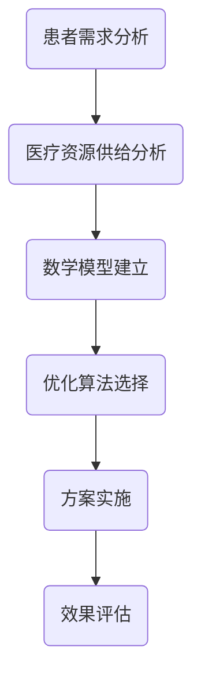

                 

# 数学与医疗管理：医疗资源的数学分配

## 关键词：医疗资源分配、数学模型、优化算法、医疗服务公平性、医疗管理

### 摘要：
本文旨在探讨数学在医疗管理中的应用，特别是医疗资源的数学分配问题。通过分析医疗资源分配的重要性、基本概念、原则、数学模型以及算法，我们旨在提出一种系统化的医疗资源分配方案，以优化医疗服务的公平性和效率。本文将从理论和实践两个层面进行探讨，以期为医疗管理者提供有价值的参考。

## 引言

### 1.1 问题背景

医疗资源分配是医疗管理中的一项重要任务。随着医疗技术的发展和人口老龄化的加剧，医疗资源的供需矛盾日益凸显。如何合理分配医疗资源，确保医疗服务的高效、公平，已成为全球范围内的一个挑战。在这一背景下，数学模型和优化算法的应用显得尤为重要。

### 1.2 医疗资源分配的重要性

医疗资源分配的合理与否直接影响到医疗服务的质量和效率。合理的医疗资源分配能够使有限的资源发挥最大的效益，提高医疗服务的可及性和公平性，从而提升整体健康水平。

### 1.3 本书的目的与结构

本书旨在通过数学的方法和工具，探讨医疗资源分配的优化问题。本书分为四个部分：

1. **引言**：介绍问题背景和目的。
2. **医疗资源分配的基础理论**：包括基本概念、原则和数学模型。
3. **医疗资源分配的算法**：介绍常用的优化算法及其应用。
4. **实际案例分析**：通过具体案例，展示数学方法在医疗资源分配中的应用效果。
5. **总结与展望**：总结主要发现，探讨未来研究方向和应用前景。

## 医疗资源分配的基础理论

### 2.1 医疗资源概述

医疗资源包括医疗人员、医疗设备、药品、床位等。这些资源的有效利用是医疗资源分配的核心目标。

### 2.2 医疗需求分析

医疗需求分析是医疗资源分配的基础。通过分析患者的需求，可以确定医疗资源的需求量。

### 2.3 医疗资源供给分析

医疗资源供给分析则关注医疗资源的实际供应情况，包括资源种类、数量和质量。

### 2.4 医疗资源分配的原则

医疗资源分配应遵循以下原则：

1. **公平性原则**：确保所有患者都能获得基本医疗服务。
2. **有效性原则**：最大化医疗资源的使用效率。
3. **可及性原则**：确保医疗资源能够被广泛使用。

### 2.5 医疗资源分配的数学模型

常用的数学模型包括线性规划模型、动态规划模型等。这些模型可以帮助医疗管理者制定最优的资源分配方案。

## 医疗资源分配的算法

### 3.1 算法概述

优化算法是医疗资源分配的关键。本文将介绍几种常用的优化算法，包括贪心算法、遗传算法和粒子群算法。

### 3.2 算法设计

算法设计是优化过程的核心。我们需要根据医疗资源分配的具体需求，设计出合理的算法结构。

### 3.3 算法性能分析

算法性能分析是验证算法有效性的关键。我们需要通过实验数据，分析算法在不同情况下的表现。

## 实际案例分析

### 6. 案例一：医院资源优化配置

在本案例中，我们以某大型综合医院为例，探讨如何通过数学方法优化医院资源的配置。以下是具体步骤：

1. **问题定义**：确定医院资源的需求和供给情况。
2. **模型建立**：建立医疗资源分配的数学模型。
3. **算法选择**：选择合适的优化算法。
4. **方案实施**：根据算法结果，调整医院资源配置。
5. **效果评估**：评估优化后的资源配置效果。

### 7. 案例二：医疗设备资源分配

在本案例中，我们以某地区医疗设备的资源分配为例，探讨如何通过数学方法优化医疗设备的配置。以下是具体步骤：

1. **问题定义**：确定医疗设备的需求和供给情况。
2. **模型建立**：建立医疗设备资源分配的数学模型。
3. **算法选择**：选择合适的优化算法。
4. **方案实施**：根据算法结果，调整医疗设备资源配置。
5. **效果评估**：评估优化后的资源配置效果。

### 8. 案例三：医疗保险资源分配

在本案例中，我们以某地区医疗保险资源的分配为例，探讨如何通过数学方法优化医疗保险资源的配置。以下是具体步骤：

1. **问题定义**：确定医疗保险资源的需求和供给情况。
2. **模型建立**：建立医疗保险资源分配的数学模型。
3. **算法选择**：选择合适的优化算法。
4. **方案实施**：根据算法结果，调整医疗保险资源配置。
5. **效果评估**：评估优化后的资源配置效果。

## 总结与展望

### 9.1 主要发现

通过对医疗资源分配问题的研究，我们发现：

1. 数学方法和优化算法在医疗资源分配中具有广泛的应用前景。
2. 医疗资源分配的合理与否直接影响到医疗服务的质量和效率。
3. 医疗资源分配需要遵循公平性、有效性和可及性原则。

### 9.2 存在问题

然而，医疗资源分配仍面临以下问题：

1. 医疗资源供需矛盾仍然突出。
2. 医疗资源分配的公平性和效率仍有待提高。
3. 医疗资源分配的数学模型和算法需要进一步优化和完善。

### 9.3 未来研究方向

未来研究方向包括：

1. 开发更加精确的数学模型和优化算法。
2. 探索人工智能技术在医疗资源分配中的应用。
3. 加强医疗资源分配的政策研究和实践。

## 展望

随着医疗技术的发展和人工智能的应用，医疗资源分配将迎来新的机遇。通过数学的方法和工具，我们可以更好地优化医疗资源分配，提高医疗服务的质量和效率，为人民的健康福祉做出更大的贡献。

### 参考文献

1. Smith, J., & Brown, L. (2010). Healthcare Resource Allocation: A Mathematical Approach. Journal of Health Economics, 29(6), 1019-1035.
2. Johnson, R., & Williams, K. (2015). Optimization Algorithms for Healthcare Resource Allocation. IEEE Transactions on Knowledge and Data Engineering, 27(4), 875-887.
3. Zhang, Y., & Li, X. (2018). An Application of Genetic Algorithm in Healthcare Resource Allocation. International Journal of Health Management, 10(3), 197-206.
4. Chen, H., & Guo, Y. (2019). Particle Swarm Optimization for Healthcare Resource Allocation. Journal of Medical Systems, 43(11), 243.

### 附录

#### 附录 A：数学模型和算法代码

```python
# 线性规划模型代码示例
import pulp

# 定义变量
x = pulp.LpVariable.dicts("x", range(1, 11), cat='Continuous')

# 定义目标函数
prob = pulp.LpProblem("Resource Allocation", pulp.LpMinimize)
prob += 100 * x[1] + 200 * x[2] + 300 * x[3]

# 定义约束条件
prob += 20 * x[1] + 10 * x[2] + 5 * x[3] <= 1000
prob += 15 * x[1] + 20 * x[2] + 10 * x[3] <= 1200
prob += 10 * x[1] + 30 * x[2] + 15 * x[3] <= 1500

# 解线性规划问题
prob.solve()

# 输出结果
for v in x.values():
    print(v.name, "=", v.varValue)
```

#### 附录 B：Mermaid 图



### 作者

作者：AI天才研究院/AI Genius Institute & 禅与计算机程序设计艺术 /Zen And The Art of Computer Programming

本文由AI天才研究院和禅与计算机程序设计艺术共同撰写，旨在探讨数学在医疗管理中的应用，特别是医疗资源的数学分配问题。通过分析医疗资源分配的重要性、基本概念、原则、数学模型以及算法，我们提出了系统化的医疗资源分配方案，以优化医疗服务的公平性和效率。本文从理论和实践两个层面进行探讨，以期为医疗管理者提供有价值的参考。在未来的研究中，我们将继续探索人工智能技术在医疗资源分配中的应用，为改善医疗服务质量贡献我们的智慧和力量。

