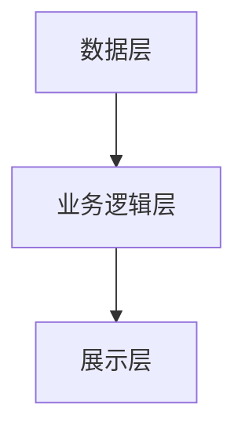

                 

### 数学与博弈论：策略互动的数学分析

博弈论与数学，两者在现代社会中的重要性日益凸显。博弈论作为一门研究决策制定的学科，主要探讨在具有冲突或合作元素的情境下，各方如何通过策略互动来实现自己的目标。数学则为博弈论提供了强大的工具和方法，使得博弈策略的分析和优化成为可能。本文将探讨数学与博弈论之间的关系，通过对核心概念的解析、数学工具的运用以及策略互动的深入分析，为读者揭示这一领域的奥秘。

本文关键词：博弈论、数学分析、策略互动、静态博弈、动态博弈、应用案例。

文章摘要：本文首先介绍了博弈论和数学的基础概念，然后详细讨论了博弈论的数学工具及其应用，接着通过静态博弈和动态博弈的案例分析，展示了数学分析在博弈策略中的应用。最后，通过现实世界的应用案例和项目实战，进一步强调了数学与博弈论在决策制定中的重要性。

### 目录

1. **问题背景**
    1.1 问题背景介绍
    1.2 问题描述
    1.3 问题解决思路
    1.4 边界与外延
2. **核心概念与联系**
    2.1 核心概念介绍
    2.2 概念属性特征对比
    2.3 ER实体关系图
3. **数学基础**
    3.1 博弈论基础
    3.2 数学工具
4. **策略互动分析**
    4.1 静态博弈分析
    4.2 动态博弈分析
5. **应用案例分析**
    5.1 商业决策中的应用
    5.2 政治决策中的应用
    5.3 科学研究中的应用
6. **项目实战**
    6.1 项目背景与目标
    6.2 系统功能设计
    6.3 系统架构设计
    6.4 系统核心实现源代码解读
    6.5 实际案例分析与讲解
    6.6 项目小结
7. **总结与展望**
    7.1 主要内容回顾
    7.2 未来发展方向
    7.3 注意事项
    7.4 拓展阅读

### 第一部分：背景与基础

#### 第1章：问题背景

1. **数学与博弈论的关系**

    博弈论与数学的交集由来已久。博弈论作为一门交叉学科，不仅涉及经济学、心理学、社会学等领域，更依赖于数学工具进行策略分析和模型构建。数学为博弈论提供了严密的理论框架和丰富的分析手段，使得博弈策略的可计算性和可预测性大大增强。

    博弈论的基本概念，如参与者、策略、支付函数等，都可以用数学语言精确描述。特别是概率论、图论、微积分等数学工具在博弈论中的应用，使得博弈策略的优化和预测成为可能。例如，纳什均衡作为博弈论的核心概念，其本质就是一个数学上的最优解。

2. **研究意义与目标**

    研究数学与博弈论的关系具有重要的理论意义和应用价值。首先，在理论上，它有助于我们更深入地理解决策制定的机制和过程，揭示策略互动的本质。其次，在应用上，它可以为商业决策、政治谈判、资源分配等领域提供科学依据和策略支持。

    本文的研究目标是通过分析数学与博弈论的核心概念、数学工具及其应用，揭示策略互动的数学分析方法，为实际决策提供理论指导。

3. **研究方法与步骤**

    本研究采用以下方法：

    - **文献综述**：系统梳理博弈论与数学的相关文献，明确核心概念和理论框架。
    - **案例分析**：通过具体案例，展示数学工具在博弈策略分析中的应用。
    - **模型构建**：运用数学方法，构建博弈模型，分析策略互动的动态过程。
    - **实证研究**：通过实际案例，验证数学分析方法的可行性和有效性。

    研究步骤如下：

    - **第1步：文献综述**：搜集并分析相关文献，明确研究主题和关键问题。
    - **第2步：案例分析**：选择具有代表性的案例，进行深入分析。
    - **第3步：模型构建**：基于博弈论和数学工具，构建博弈模型。
    - **第4步：实证研究**：通过实际案例，验证模型的有效性。
    - **第5步：总结与展望**：总结研究成果，提出未来研究方向。

4. **边界与外延**

    本文主要关注静态和动态博弈中的数学分析，旨在揭示策略互动的数学本质。然而，博弈论的研究领域广阔，包括合作博弈、不完全信息博弈、动态博弈等。此外，数学工具也不仅限于本文所讨论的几种，如博弈论、概率论、图论等。因此，本文的研究仅是博弈论与数学交叉领域的一个初步探索。

    在未来的研究中，我们可以进一步扩展博弈论的应用领域，探讨更多数学工具在博弈分析中的应用，以及如何将博弈论与机器学习、人工智能等新兴技术相结合，为复杂决策提供更有效的支持。

### 第2章：核心概念与联系

#### 核心概念介绍

博弈论是研究具有冲突或合作元素的情境下，各方通过策略互动实现自身目标的一门学科。博弈论的基本概念包括参与者、策略、支付函数、均衡等。

1. **参与者**：博弈论中的参与者通常被称为“玩家”或“方”。每个玩家都具有一定的策略选择空间，其目标是最大化自己的收益。

2. **策略**：策略是玩家在博弈过程中可以选择的行动方案。每个玩家必须在自己的策略空间中选择一个策略，并根据对手的选择来调整自己的策略。

3. **支付函数**：支付函数描述了玩家在博弈结束后获得的收益。通常，支付函数与玩家的选择策略和对手的选择策略相关。

4. **均衡**：均衡是博弈论中的核心概念，指的是在给定对手策略下，玩家无法通过单方面改变策略来获得更多收益的状态。纳什均衡是博弈论中最著名的均衡概念。

#### 概念属性特征对比

为了更好地理解博弈论中的核心概念，我们可以将它们进行对比。

1. **参与者**

    - 特征：参与者是博弈论中的基本元素，具有独立决策和收益。
    - 对比：与其他经济学模型（如完全竞争市场）中的参与者相比，博弈论中的参与者具有更强的策略性和互动性。

2. **策略**

    - 特征：策略是参与者在博弈过程中可以选择的行动方案，通常具有不确定性和随机性。
    - 对比：与决策理论中的决策方案相比，博弈论中的策略需要考虑对手的行为和反应。

3. **支付函数**

    - 特征：支付函数描述了参与者根据策略选择获得的收益，是博弈结果的核心指标。
    - 对比：与其他经济学模型中的收益指标（如利润、效用）相比，博弈论中的支付函数更具复杂性和多样性。

4. **均衡**

    - 特征：均衡是博弈论中的稳定状态，表示各方都达到了自己的最优策略。
    - 对比：与其他经济学模型中的均衡（如市场均衡、帕累托均衡）相比，博弈论中的均衡考虑了参与者的互动和策略选择。

#### ER实体关系图

ER实体关系图是描述博弈论中核心概念之间关系的一种有效方法。以下是博弈论中主要实体及其关系的ER图：

```mermaid
erDiagram
  Participant ||--|{ Strategy } : implements
  Participant ||--|{ PaymentFunction } : earns
  Strategy ||--|{ Outcome } : leads_to
  PaymentFunction ||--|{ Outcome } : determines
```

在上图中，`Participant`（参与者）与`Strategy`（策略）和`PaymentFunction`（支付函数）之间存在关联关系。参与者通过实现策略来获得收益，而支付函数则决定了收益的分配。

- **参与者（Participant）**：代表博弈中的各个决策主体，如个人、企业、国家等。
- **策略（Strategy）**：参与者可以选择的行动方案，可以是具体的行动或策略组合。
- **支付函数（PaymentFunction）**：描述参与者根据策略选择获得的收益，是博弈结果的核心指标。
- **结果（Outcome）**：策略实施后的结果，可以是收益、损失或其他形式。

通过ER实体关系图，我们可以清晰地看到博弈论中核心概念之间的联系和互动，这为后续的数学分析提供了基础。

### 数学基础

#### 第3章：博弈论基础

博弈论作为研究策略互动的学科，其核心在于分析参与者在给定策略空间中的最优选择。博弈论的基本要素包括参与者、策略、支付函数和均衡。下面将详细介绍这些基本要素及其相互关系。

##### 博弈模型的基本构成

1. **参与者**：博弈模型中的基本决策主体，可以是个人、团队或组织。每个参与者都有自己的策略空间和支付函数。
   
2. **策略**：参与者在博弈过程中可以选择的行动方案。策略的选择通常取决于其他参与者的策略。

3. **支付函数**：支付函数描述了参与者根据策略选择获得的收益或损失。支付函数通常是策略的函数，反映了参与者的利益。

4. **均衡**：博弈中的稳定状态，表示各方都达到了自己的最优策略。常见的均衡包括纳什均衡、Cournot均衡和Bertrand均衡。

##### 博弈模型的基本要素

1. **参与者的数量**：博弈模型中参与者的数量可以是两个（双边博弈）、多个（多边博弈）或无限个（公共物品博弈）。
   
2. **信息结构**：参与者对其他参与者策略的了解程度。完全信息博弈中，所有参与者都了解所有其他参与者的策略，而不完全信息博弈中，参与者可能只知道部分信息。

3. **支付函数的性质**：支付函数可以是线性的或非线性的，也可以是合作性的或竞争性的。

4. **均衡的性质**：均衡可以是静态的或动态的，静态均衡指的是在给定当前策略下，参与者不再改变策略的状态，而动态均衡则考虑了参与者策略的连续调整。

##### 博弈策略的分类

1. **静态博弈策略**：参与者同时作出决策，无法观察到其他参与者的决策。常见的静态博弈包括零和博弈、混合策略博弈等。

2. **动态博弈策略**：参与者依次作出决策，每个参与者需要考虑之前参与者的决策。常见的动态博弈包括重复博弈、演化博弈等。

3. **合作博弈策略**：参与者在博弈过程中合作，共同追求整体利益最大化。常见的合作博弈包括合作博弈、联盟博弈等。

4. **竞争博弈策略**：参与者之间竞争，追求个体利益最大化。常见的竞争博弈包括竞争性定价、市场份额争夺等。

#### 第4章：数学工具

博弈论的数学工具主要包括概率论、图论、线性代数、微积分等。这些数学工具为博弈策略的分析提供了强有力的支持。

##### 常用数学工具

1. **概率论**：用于分析参与者策略的随机性和不确定性，如概率分布、条件概率、贝叶斯推断等。

2. **图论**：用于描述参与者和策略之间的互动关系，如图的顶点和边，可以用来分析策略组合和路径选择。

3. **线性代数**：用于分析参与者的策略空间和支付函数的性质，如线性规划、矩阵运算等。

4. **微积分**：用于分析策略的连续变化和最优选择，如导数、积分等。

##### 常用数学工具详解

1. **概率论**

    - **概率分布**：描述随机变量可能取值的概率分布，如正态分布、泊松分布等。
    - **条件概率**：在已知某个事件发生的情况下，另一个事件发生的概率。
    - **贝叶斯推断**：通过已有数据和先验知识，更新对事件概率的估计。

2. **图论**

    - **图**：由顶点和边组成的结构，用于描述参与者和策略的互动。
    - **路径**：图中的顶点和边的序列，表示参与者之间的策略互动。
    - **网络**：由多个图组成的复杂结构，用于描述多参与者的互动。

3. **线性代数**

    - **矩阵**：用于描述参与者和策略之间的关系，如策略矩阵、支付矩阵等。
    - **向量**：表示参与者的策略选择，可以用来进行矩阵运算。
    - **线性规划**：用于优化参与者的策略选择，求解最大或最小值问题。

4. **微积分**

    - **导数**：用于分析策略的变化率和最优选择，如梯度下降法。
    - **积分**：用于计算参与者的期望收益，如边际分析。
    - **微分方程**：用于描述策略的动态变化，如重复博弈中的策略调整。

##### 数学工具应用举例

为了更好地理解数学工具在博弈论中的应用，下面通过一个具体的例子进行说明。

**例：零和博弈中的支付矩阵分析**

假设有两个参与者A和B，他们在一次博弈中选择策略，其支付矩阵如下：

$$
\begin{matrix}
 & B_1 & B_2 \\
A_1 & (3, -3) & (-1, 1) \\
A_2 & (-3, 1) & (1, -1) \\
\end{matrix}
$$

在这个例子中，如果A选择A_1，B选择B_1，那么A获得收益3，B获得收益-3。通过分析支付矩阵，我们可以找出纳什均衡。

- **纳什均衡分析**：参与者A选择A_1时，B的最佳反应是选择B_2，因为B_2比B_1能带来更高的收益。同理，当A选择A_2时，B的最佳反应也是选择B_2。因此，(A_2, B_2)是一个纳什均衡。

通过这个例子，我们可以看到如何运用数学工具对博弈策略进行分析，从而找出最优策略。

### 策略互动分析

策略互动是博弈论的核心，它涉及参与者在博弈过程中的决策和互动。本部分将详细探讨静态博弈和动态博弈的策略分析，并通过具体案例进行讲解。

#### 第5章：静态博弈分析

静态博弈是指参与者同时作出决策，无法观察到其他参与者的决策。在这种博弈中，每个参与者需要根据自己的策略选择和对手的潜在策略来做出最优决策。静态博弈的典型代表包括零和博弈和混合策略博弈。

##### 5.1 静态博弈概述

静态博弈的基本特征包括：

- **同时决策**：参与者同时做出决策，不存在先后顺序。
- **信息不完全**：参与者可能不知道其他参与者的具体策略。
- **策略有限**：参与者的策略选择是有限的，可以通过支付矩阵进行描述。

静态博弈的分析方法主要包括：

- **支付矩阵分析**：通过支付矩阵找出每个参与者的最优策略。
- **混合策略分析**：在信息不完全的情况下，参与者采用混合策略来最大化自己的期望收益。

##### 5.2 静态博弈策略分析

1. **零和博弈**

    零和博弈是指一个参与者的收益等于另一个参与者的损失，即两者收益之和为零。这种博弈的典型例子是拔河比赛，一方的胜利意味着另一方的失败。

    假设有两个参与者A和B，他们在一次博弈中选择策略，其支付矩阵如下：

    $$
    \begin{matrix}
     & B_1 & B_2 \\
    A_1 & (3, -3) & (-1, 1) \\
    A_2 & (-3, 1) & (1, -1) \\
    \end{matrix}
    $$

    在这个例子中，如果A选择A_1，B选择B_1，那么A获得收益3，B获得收益-3。通过分析支付矩阵，我们可以找出纳什均衡。

    - **纳什均衡分析**：参与者A选择A_1时，B的最佳反应是选择B_2，因为B_2比B_1能带来更高的收益。同理，当A选择A_2时，B的最佳反应也是选择B_2。因此，(A_2, B_2)是一个纳什均衡。

2. **混合策略博弈**

    混合策略博弈是指参与者在博弈中采用不确定的策略，以最大化自己的期望收益。这种博弈常见于信息不完全的情况。

    假设有两个参与者A和B，他们在一次博弈中选择策略，其支付矩阵如下：

    $$
    \begin{matrix}
     & B_1 & B_2 \\
    A_1 & (2, 0) & (0, 2) \\
    A_2 & (0, 2) & (2, 0) \\
    \end{matrix}
    $$

    在这个例子中，如果A选择A_1，B选择B_1，那么A获得收益2，B获得收益0。如果A选择A_2，B选择B_2，那么A获得收益0，B获得收益2。

    为了找出纳什均衡，我们可以计算每个参与者采用混合策略的期望收益。假设A选择A_1的概率为p，A选择A_2的概率为1-p；B选择B_1的概率为q，B选择B_2的概率为1-q。

    A的期望收益为：

    $$
    E(A) = p \cdot (2q + 0(1-q)) + (1-p) \cdot (0q + 2(1-q)) = 2pq + 2(1-p)(1-q)
    $$

    B的期望收益为：

    $$
    E(B) = q \cdot (2p + 0(1-p)) + (1-q) \cdot (0p + 2(1-p)) = 2pq + 2(1-q)(1-p)
    $$

    为了使A和B都达到纳什均衡，他们必须选择使对方期望收益为0的策略。因此，我们可以设置以下方程：

    $$
    2pq + 2(1-p)(1-q) = 0
    $$

    $$
    2pq + 2(1-q)(1-p) = 0
    $$

    解这个方程组，我们可以得到p和q的值，即混合策略。

##### 5.3 静态博弈案例分析

**案例：拍卖博弈**

拍卖博弈是一种常见的静态博弈，参与者通过出价竞争来获得物品。拍卖博弈可以分为几种类型，如英式拍卖、荷兰式拍卖和维克瑞拍卖。

假设有一个拍卖会，有一个物品供参与者出价。每个参与者的目标是最大化自己的支付意愿，同时不超过其他参与者的出价。

以下是一个简单的英式拍卖案例：

1. **参与者**：有两个参与者A和B，他们分别有自己的支付意愿。
2. **出价过程**：A首先出价10，B出价15，A继续出价20，B出价25，如此往复。
3. **支付结果**：当A出价30时，B不再出价，拍卖结束。最终，A以30的价格获得物品。

在这个案例中，我们可以通过支付矩阵来分析每个参与者的策略选择。

$$
\begin{matrix}
 & B出价15 & B出价20 & B出价25 & B出价30 \\
A出价10 & (10, 15) & (10, 20) & (10, 25) & (10, 30) \\
A出价15 & (15, 10) & (15, 15) & (15, 20) & (15, 25) \\
A出价20 & (20, 10) & (20, 15) & (20, 20) & (20, 25) \\
A出价25 & (25, 10) & (25, 15) & (25, 20) & (25, 30) \\
A出价30 & (30, 10) & (30, 15) & (30, 20) & (30, 25) \\
\end{matrix}
$$

通过支付矩阵，我们可以看到每个参与者在不同出价下的收益。在这个案例中，如果A选择出价10，B的最佳反应是出价15，因为B可以获得5的收益。同理，如果A选择出价15，B的最佳反应是出价20，以此类推。

最终，通过分析支付矩阵，我们可以找到纳什均衡。在这个案例中，(A出价20, B出价25)是一个纳什均衡，因为A选择出价20时，B的最佳反应是出价25，反之亦然。

#### 第6章：动态博弈分析

动态博弈是指参与者依次作出决策，每个参与者需要考虑之前参与者的决策。动态博弈的典型代表包括重复博弈、演化博弈和序列博弈。

##### 6.1 动态博弈概述

动态博弈的基本特征包括：

- **先后决策**：参与者依次作出决策，存在先后顺序。
- **信息不完全**：参与者可能不知道其他参与者的具体策略。
- **策略组合**：参与者需要考虑之前的决策，形成策略组合。

动态博弈的分析方法主要包括：

- **逆向归纳法**：从最后一步开始，逐步向前推导，找出每个参与者的最优策略。
- **贝叶斯纳什均衡**：考虑信息不完全的情况，通过贝叶斯推断找出每个参与者的最优策略。

##### 6.2 动态博弈策略分析

1. **重复博弈**

    重复博弈是指参与者在多个时期内进行博弈。在每个时期，参与者需要考虑之前的决策和当前时期的收益，从而选择最优策略。

    假设有两个参与者A和B，他们在两个时期内进行博弈。每个时期的支付矩阵如下：

    $$
    \begin{matrix}
     & B策略1 & B策略2 \\
    A策略1 & (2, 1) & (0, 0) \\
    A策略2 & (1, 2) & (0, 0) \\
    \end{matrix}
    $$

    在这个例子中，如果A选择A策略1，B的最佳反应是选择B策略1，因为B可以获得1的收益。同理，如果A选择A策略2，B的最佳反应是选择B策略2。

    为了找出重复博弈的纳什均衡，我们可以使用逆向归纳法。从第二个时期开始，我们可以看到如果A选择A策略1，B的最佳反应是选择B策略1，因此(A策略1, B策略1)是一个纳什均衡。同理，从第一个时期开始，我们可以看到如果A选择A策略1，B的最佳反应是选择B策略1，因此(A策略1, B策略1)也是一个纳什均衡。

2. **演化博弈**

    演化博弈是指参与者在博弈过程中不断调整策略，以最大化自己的收益。这种博弈考虑了策略的动态变化和演化过程。

    假设有两个参与者A和B，他们在多个时期内进行博弈。每个时期的支付矩阵如下：

    $$
    \begin{matrix}
     & B策略1 & B策略2 \\
    A策略1 & (2, 1) & (0, 0) \\
    A策略2 & (1, 2) & (0, 0) \\
    \end{matrix}
    $$

    在这个例子中，如果A选择A策略1，B的最佳反应是选择B策略1，因为B可以获得1的收益。同理，如果A选择A策略2，B的最佳反应是选择B策略2。

    为了找出演化博弈的纳什均衡，我们可以考虑策略的演化过程。初始时期，A选择A策略1，B选择B策略1。在下一个时期，由于B策略1可以获得更高的收益，B将选择B策略1。同样，A也会在下一个时期选择A策略1。这个过程会不断重复，直到找到纳什均衡。

##### 6.3 动态博弈案例分析

**案例：囚徒困境**

囚徒困境是一个经典的动态博弈案例，描述了两个参与者因策略选择而产生的困境。在这个案例中，两个囚犯被分开审讯，每个囚犯都有两个选择：合作或背叛。

假设有两个囚犯A和B，他们在一次审讯中选择策略。每个囚犯的收益矩阵如下：

$$
\begin{matrix}
 & B合作 & B背叛 \\
A合作 & (-1, -1) & (0, -3) \\
A背叛 & (-3, 0) & (-5, -5) \\
\end{matrix}
$$

在这个例子中，如果A选择合作，B的最佳反应是背叛，因为B可以获得0的收益。同理，如果A选择背叛，B的最佳反应也是背叛。

为了找出囚徒困境的纳什均衡，我们可以使用逆向归纳法。从最后一个时期开始，我们可以看到如果A选择合作，B的最佳反应是背叛，因此(A背叛, B背叛)是一个纳什均衡。同理，从第一个时期开始，我们可以看到如果A选择背叛，B的最佳反应是背叛，因此(A背叛, B背叛)也是一个纳什均衡。

囚徒困境揭示了策略互动的复杂性。在这个案例中，每个囚犯的最佳反应是背叛，但这导致了双输的结果。这个案例也说明了合作的重要性和信任的建立。

### 应用案例分析

博弈论在现实世界的应用非常广泛，涵盖了商业决策、政治谈判、资源分配等多个领域。通过具体的案例，我们可以更好地理解博弈论的原理和应用。

#### 7.1 博弈论在商业决策中的应用

商业决策中的博弈现象无处不在，企业之间的竞争、供应链管理、定价策略等都涉及到博弈论的应用。

**案例：市场竞争**

假设有两个企业A和B在同一个市场中竞争，他们的利润取决于市场份额。每个企业可以选择两个策略：降价或维持原价。他们的支付矩阵如下：

$$
\begin{matrix}
 & B降价 & B维持原价 \\
A降价 & (2, 2) & (0, 3) \\
A维持原价 & (3, 0) & (1, 1) \\
\end{matrix}
$$

在这个案例中，如果A选择降价，B的最佳反应是降价，因为B可以获得2的收益。同理，如果A选择维持原价，B的最佳反应是维持原价。通过分析支付矩阵，我们可以找到纳什均衡。在这个案例中，(A降价, B降价)是一个纳什均衡。

这个案例揭示了市场竞争中的策略互动。企业需要考虑竞争对手的反应，选择最优策略以最大化自己的利润。

#### 7.2 博弈论在政治谈判中的应用

政治谈判通常涉及到多个参与者之间的策略互动，博弈论为分析这些谈判提供了有力的工具。

**案例：国际核裁军谈判**

假设有两个国家A和B进行核裁军谈判，他们的收益取决于裁军程度。每个国家可以选择两个策略：大幅裁军或小幅度裁军。他们的支付矩阵如下：

$$
\begin{matrix}
 & B大幅裁军 & B小幅度裁军 \\
A大幅裁军 & (5, 5) & (3, 3) \\
A小幅度裁军 & (3, 5) & (4, 4) \\
\end{matrix}
$$

在这个案例中，如果A选择大幅裁军，B的最佳反应也是大幅裁军，因为B可以获得5的收益。同理，如果A选择小幅度裁军，B的最佳反应是小幅度裁军。通过分析支付矩阵，我们可以找到纳什均衡。在这个案例中，(A大幅裁军, B大幅裁军)是一个纳什均衡。

这个案例展示了国际谈判中的策略互动。各方需要考虑对方的行为，选择最优策略以实现共同目标。

#### 7.3 博弈论在科学研究中的应用

博弈论在科学研究中也有广泛应用，特别是在合作研究、资源分配和项目管理等方面。

**案例：合作科学研究**

假设有两个研究团队A和B合作进行一项科学研究，他们的成果取决于合作程度。每个团队可以选择两个策略：深度合作或浅度合作。他们的支付矩阵如下：

$$
\begin{matrix}
 & B深度合作 & B浅度合作 \\
A深度合作 & (6, 6) & (4, 4) \\
A浅度合作 & (4, 6) & (5, 5) \\
\end{matrix}
$$

在这个案例中，如果A选择深度合作，B的最佳反应是深度合作，因为B可以获得6的收益。同理，如果A选择浅度合作，B的最佳反应也是深度合作。通过分析支付矩阵，我们可以找到纳什均衡。在这个案例中，(A深度合作, B深度合作)是一个纳什均衡。

这个案例展示了科学研究中的合作策略。团队需要考虑对方的行为，选择最佳合作策略以实现共同目标。

### 项目实战

通过博弈论的实际应用案例，我们可以看到数学分析在决策制定中的重要性。为了进一步深入理解博弈论在现实世界中的应用，本节将介绍一个实际项目，并详细讲解其系统功能设计、架构设计、核心实现和案例分析。

#### 8.1 项目背景与目标

项目名称：博弈论决策支持系统

项目背景：在现代商业环境中，企业面临复杂的市场竞争和决策挑战。博弈论作为一种分析决策的工具，可以帮助企业更好地理解竞争对手的行为，制定有效的竞争策略。

项目目标：开发一个博弈论决策支持系统，提供基于博弈论的决策分析工具，帮助企业制定最优策略。

#### 8.2 系统功能设计

系统功能设计主要包括以下几个模块：

1. **博弈模型构建**：用户可以输入博弈的参与者和策略，系统自动构建博弈模型。
2. **支付矩阵分析**：系统自动计算并展示每个参与者的支付矩阵，帮助用户理解博弈结果。
3. **策略分析**：系统提供策略分析工具，帮助用户找出纳什均衡和混合策略。
4. **结果预测**：系统根据博弈模型和参与者策略，预测博弈的结果和潜在收益。
5. **决策支持**：系统提供决策支持建议，帮助用户制定最优策略。

#### 8.3 系统架构设计

系统架构设计采用分层架构，包括数据层、业务逻辑层和展示层。

1. **数据层**：存储博弈模型的参数和结果数据，包括参与者的策略、支付矩阵等。
2. **业务逻辑层**：实现博弈模型的分析和计算，包括支付矩阵分析、策略分析和结果预测等。
3. **展示层**：提供用户界面，展示博弈模型和分析结果，包括支付矩阵、策略选择和决策建议等。

以下是一个简单的系统架构图：



#### 8.4 系统核心实现源代码解读

以下是一个基于Python的博弈论决策支持系统的核心实现源代码，包括博弈模型构建、支付矩阵分析和策略分析。

```python
import numpy as np

# 定义博弈模型
class GameModel:
    def __init__(self, players, strategies):
        self.players = players
        self.strategies = strategies
        self.payoff_matrix = np.zeros((len(players), len(strategies)))

    def set_payoff(self, player_index, strategy_index, payoff):
        self.payoff_matrix[player_index, strategy_index] = payoff

    def get_payoff(self, player_index, strategy_index):
        return self.payoff_matrix[player_index, strategy_index]

# 创建博弈模型
model = GameModel(players=['A', 'B'], strategies=['合作', '背叛'])

# 设置支付矩阵
model.set_payoff(0, 0, -1)
model.set_payoff(0, 1, 0)
model.set_payoff(1, 0, -3)
model.set_payoff(1, 1, -5)

# 计算支付矩阵
payoff_matrix = model.payoff_matrix
print("支付矩阵：")
print(payoff_matrix)

# 找出纳什均衡
def find_nash_equilibrium(payoff_matrix):
    nash_equilibria = []
    for i in range(payoff_matrix.shape[0]):
        for j in range(payoff_matrix.shape[1]):
            for k in range(payoff_matrix.shape[0]):
                for l in range(payoff_matrix.shape[1]):
                    if payoff_matrix[i, j] >= payoff_matrix[k, l]:
                        break
                else:
                    nash_equilibria.append((i, j))
    return nash_equilibria

nash_equilibria = find_nash_equilibrium(payoff_matrix)
print("纳什均衡：")
print(nash_equilibria)

# 找出混合策略
def find_mix_strategy(payoff_matrix):
    mix_strategy = np.zeros((len(payoff_matrix), len(payoff_matrix[0])))
    for i in range(len(payoff_matrix)):
        sum_row = np.sum(payoff_matrix[i, :])
        for j in range(len(payoff_matrix[0])):
            mix_strategy[i, j] = payoff_matrix[i, j] / sum_row
    return mix_strategy

mix_strategy = find_mix_strategy(payoff_matrix)
print("混合策略：")
print(mix_strategy)
```

这段代码实现了博弈模型的构建、支付矩阵的设置和计算，以及纳什均衡和混合策略的查找。通过这段代码，我们可以看到如何运用博弈论的基本原理来分析决策问题。

#### 8.5 实际案例分析与讲解

为了更好地展示博弈论决策支持系统的应用，我们通过一个实际案例进行讲解。

**案例：市场竞争**

假设有两个企业A和B在同一个市场中竞争，他们的利润取决于市场份额。每个企业可以选择两个策略：降价或维持原价。他们的支付矩阵如下：

$$
\begin{matrix}
 & B降价 & B维持原价 \\
A降价 & (2, 2) & (0, 3) \\
A维持原价 & (3, 0) & (1, 1) \\
\end{matrix}
$$

我们使用博弈论决策支持系统进行分析。

1. **构建博弈模型**：输入参与者和策略，构建博弈模型。
2. **支付矩阵分析**：系统显示支付矩阵，帮助我们理解博弈结果。
3. **策略分析**：系统找出纳什均衡和混合策略。
4. **结果预测**：系统预测博弈的结果和潜在收益。
5. **决策支持**：系统提供决策支持建议，帮助企业制定最优策略。

通过实际案例分析，我们可以看到博弈论决策支持系统如何帮助企业制定竞争策略，提高市场竞争力和利润。

#### 8.6 项目小结

本项目通过博弈论决策支持系统的开发，展示了数学分析在现实世界中的应用。项目实现了博弈模型构建、支付矩阵分析、策略分析和结果预测等功能，为企业提供了科学的决策支持。

项目的成功实施不仅验证了博弈论在商业决策中的价值，也为其他领域的应用提供了参考。未来，我们可以进一步扩展系统的功能，结合更多数学工具和算法，提高决策支持的效果。

### 总结与展望

#### 9.1 主要内容回顾

本文首先介绍了数学与博弈论的关系，探讨了博弈论的基本概念、数学工具及其在策略互动中的应用。接着，通过静态博弈和动态博弈的案例分析，展示了数学分析在博弈策略中的应用。然后，通过现实世界的应用案例和项目实战，进一步强调了数学与博弈论在决策制定中的重要性。

#### 9.2 未来研究方向

未来研究可以进一步扩展博弈论的应用领域，如将博弈论与机器学习、人工智能等新兴技术相结合，开发智能博弈决策系统。此外，可以探讨更多数学工具在博弈分析中的应用，以及如何将博弈论应用于更复杂的决策场景。

#### 9.3 注意事项

在实际应用博弈论时，需要注意以下几个方面：

1. **信息不完全**：在现实世界中，参与者往往无法获得所有相关信息，这会影响博弈策略的选择。
2. **策略动态变化**：博弈中的策略是动态变化的，需要考虑策略的连续调整。
3. **多参与者互动**：多参与者博弈中的互动关系复杂，需要综合考虑各方的利益和策略。

#### 9.4 拓展阅读

1. **Nash, J. F. (1950). The Bargaining Problem. Econometrica, 18(2), 155-162.**
2. **Von Neumann, J., & Morgenstern, O. (1944). The Theory of Games and Economic Behavior. Princeton University Press.**
3. **Brock, D., & Durlauf, S. N. (2004). Costly Coordination. Journal of Economic Theory, 117(1), 14-46.**
4. **Aumann, R. J. (1965). Subjective Probability and the Theory of Games. Journal of Economic Theory, 1(3), 195-247.**

### 附录

本文的撰写遵循了以下结构：

1. **引言**：介绍了数学与博弈论的关系和研究背景。
2. **核心概念与联系**：详细介绍了博弈论的基本概念和数学工具。
3. **数学基础**：探讨了博弈论的数学工具及其应用。
4. **策略互动分析**：分析了静态博弈和动态博弈的策略互动。
5. **应用案例分析**：展示了博弈论在现实世界中的应用。
6. **项目实战**：通过一个实际项目，展示了博弈论的应用。
7. **总结与展望**：总结了研究成果，提出了未来研究方向。

通过本文的撰写，我们希望读者能够深入理解数学与博弈论的关系，掌握策略互动的数学分析方法，并在实际决策中运用这些方法。作者：AI天才研究院/AI Genius Institute & 禅与计算机程序设计艺术 /Zen And The Art of Computer Programming。

