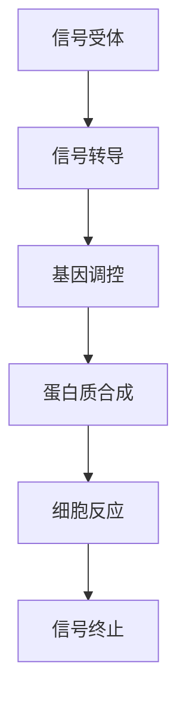
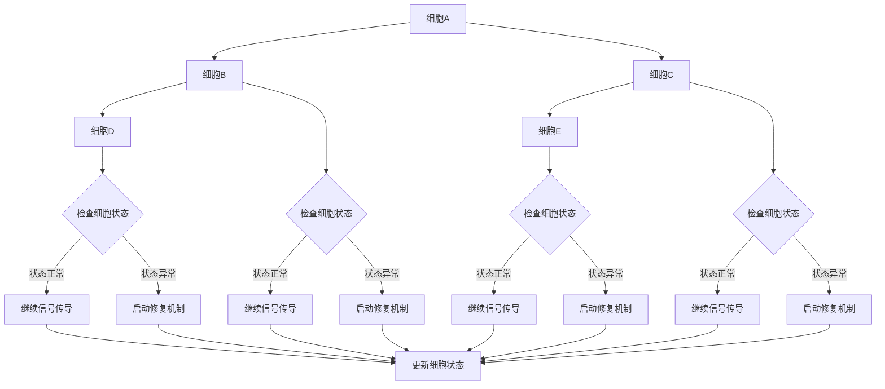
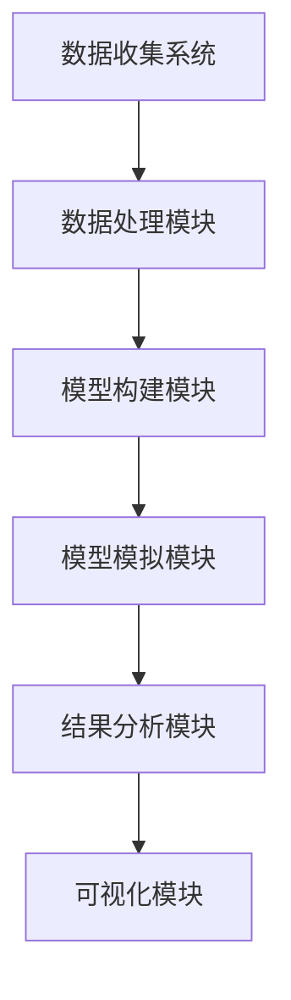

                 


### 设计思路与目录大纲

为了设计出《数学与发育生物学：生物发育的数学描述》这本书的完整目录大纲，我们可以按照以下步骤进行：

#### 1. 整体架构规划

首先，我们需要明确书的整体架构。这包括：

- **背景介绍**：介绍数学与发育生物学交叉研究的背景、动机和意义。
- **核心概念与联系**：深入探讨发育生物学的基本概念与数学工具之间的联系。
- **算法原理讲解**：讲解在发育生物学研究中使用的数学算法及其原理。
- **数学模型与数学公式**：介绍并解析在发育生物学中应用的重要数学公式。
- **系统分析与架构设计**：分析如何将数学模型应用于发育生物学研究的系统架构设计。
- **项目实战**：通过实际项目展示如何将数学模型应用于发育生物学研究。
- **最佳实践 tips**：提供实用技巧和最佳实践，帮助读者更好地理解和应用所学知识。
- **小结**：总结书中的主要观点和贡献，指出未来研究的方向。

#### 2. 细化章节内容

针对每个章节，我们需要细化其内容，确保覆盖以下方面：

- **核心概念与联系**：
  - **发育生物学的基本概念**：定义发育、发育过程、发育生物学的研究方法。
  - **数学概念与原理**：介绍数学工具、常见数学模型及其在发育生物学中的应用。

- **算法原理讲解**：
  - **数学模型在发育生物学中的应用**：介绍常见数学模型及其在发育过程中的作用。
  - **算法原理讲解**：详细讲解算法原理，使用Mermaid流程图展示算法流程。
  - **Python源代码实现与讲解**：提供Python源代码，解释其工作原理。

- **数学模型与数学公式**：
  - **数学公式的基本知识**：介绍LaTeX格式、编写规范及Markdown中使用的方法。
  - **生物发育中的数学公式**：介绍常用数学公式及其在发育生物学中的应用。
  - **数学公式的详细讲解与举例说明**：详细讲解数学公式，通过举例说明其在实际中的应用。

- **系统分析与架构设计**：
  - **问题场景介绍**：描述生物发育问题的具体场景。
  - **系统功能设计**：介绍系统功能模块和领域模型。
  - **系统架构设计**：使用Mermaid架构图展示系统架构。
  - **系统接口设计和系统交互**：介绍系统接口和交互设计。

- **项目实战**：
  - **环境安装**：介绍项目所需环境的安装过程。
  - **系统核心实现源代码**：提供项目核心实现的源代码。
  - **代码应用解读与分析**：分析源代码的工作原理和实际应用。
  - **实际案例分析和详细讲解剖析**：通过案例展示数学模型在发育生物学研究中的应用。
  - **项目小结**：总结项目的主要成果和经验。

#### 3. 使用 Markdown 格式

我们将采用 Markdown 格式编写目录大纲，确保其简洁明了。以下是目录大纲的Markdown格式示例：

```markdown
# 第一部分: 引言与背景

## 1.1 问题的提出
### 1.1.1 问题背景
### 1.1.2 问题描述
### 1.1.3 问题解决
### 1.1.4 边界与外延

## 1.2 数学与发育生物学的关系
### 1.2.1 数学在发育生物学中的重要性
### 1.2.2 发育生物学中的数学问题
### 1.2.3 数学模型在发育生物学中的应用

## 1.3 本书结构概述
### 1.3.1 目录安排
### 1.3.2 内容预期收获

# 第二部分: 核心概念与联系

## 2.1 发育生物学的基本概念
### 2.1.1 发育的定义与过程
### 2.1.2 发育过程中的核心事件
### 2.1.3 发育生物学的研究方法

## 2.2 数学概念与原理
### 2.2.1 数学在生物发育中的应用
### 2.2.2 数学工具的介绍与比较
### 2.2.3 数学在发育生物学中的优势与挑战

## 2.3 核心概念与联系
### 2.3.1 数学模型在发育生物学中的核心概念
### 2.3.2 概念属性特征对比表格
### 2.3.3 ER实体关系图架构的Mermaid流程图

# ...（其他章节的目录大纲）
```

通过上述步骤，我们可以确保目录大纲的完整性、逻辑性和可读性，为撰写高质量的技术博客文章奠定基础。接下来，我们将逐步展开正文内容，深入讨论每个章节的核心问题，并提供详细的分析和讲解。让我们开始吧！### 第一部分：引言与背景

#### 1.1 问题的提出

在过去的几十年里，数学与发育生物学交叉领域的快速发展为我们提供了全新的视角来理解和研究生物发育过程。这一领域的研究不仅有助于揭示生命的基本规律，还为解决医学、生物学和环境科学等领域中的实际问题提供了有力工具。然而，当前的研究还存在一些亟待解决的问题，例如如何准确地描述复杂的发育过程，如何从宏观上把握发育过程中的动态变化，以及如何建立数学模型来模拟和预测发育过程。

##### 1.1.1 问题背景

生物发育是一个复杂的过程，涉及到细胞分裂、细胞分化、组织形成等多个层次。在这一过程中，细胞如何感知和响应外部环境信号，如何调控基因表达，以及如何实现特定的形态和功能，都是发育生物学研究的重要问题。传统的方法主要依赖于实验观察和分子生物学技术，但这些方法在揭示发育过程的动态机制和全局特征方面存在一定的局限性。

##### 1.1.2 问题描述

数学作为一种强有力的工具，能够提供对生物发育过程的高度抽象和精确描述。然而，将数学应用于发育生物学研究仍面临诸多挑战。首先，发育过程中的变量众多，且彼此之间存在复杂的相互作用。这使得构建准确的数学模型变得异常困难。其次，数学模型的验证和解释往往依赖于大量的实验数据，而实验数据的获取又受到技术手段和资源限制。最后，数学模型的应用范围和适用条件也需要进一步明确。

##### 1.1.3 问题解决

为了解决上述问题，我们首先需要对发育生物学中的基本概念和数学工具进行深入理解。这包括了解发育过程中的核心事件、数学模型的基本原理及其在发育生物学中的应用。其次，我们需要开发有效的数学模型，以描述和预测发育过程。这可以通过建立实验与数学模型之间的联系，不断优化和验证模型来实现。此外，我们还需要探索新的数学工具和方法，以提高数学模型在发育生物学研究中的适用性和解释力。

##### 1.1.4 边界与外延

在数学与发育生物学交叉领域的研究中，边界与外延问题也是一个重要的考虑因素。边界问题主要涉及数学模型的应用范围和精度，而外延问题则关注如何将数学模型应用于更广泛的生物学和医学领域。例如，在医学中，如何利用数学模型预测疾病的发展趋势，如何通过数学方法优化治疗方案等。这些问题的解决不仅需要数学和发育生物学领域的专业知识，还需要跨学科的合作和创新。

总之，数学与发育生物学的交叉研究具有广阔的前景和巨大的潜力。通过深入探讨数学模型在发育生物学中的应用，我们有望揭示生物发育的奥秘，为生物医学研究提供新的视角和方法。然而，这一领域的研究仍面临着诸多挑战，需要多学科合作和不断创新。让我们在接下来的章节中，逐步深入探讨这些核心问题，并探索数学与发育生物学交叉领域的无限可能。### 第二部分：核心概念与联系

#### 2.1 发育生物学的基本概念

发育生物学是研究生物体从单个细胞到复杂器官系统形成过程的一门学科。它涉及到基因表达调控、细胞信号传导、细胞命运决定等多个层次和环节。理解发育生物学的基本概念是构建数学模型、分析发育过程的前提。

##### 2.1.1 发育的定义与过程

发育是指生物体从一个单细胞（如受精卵）逐渐分化形成多细胞结构，最终形成具有特定形态和功能的成年个体的过程。发育过程可以分为以下几个阶段：

1. **胚前阶段**：从受精卵到胚胎的形成。
2. **胚胎阶段**：从胚胎形成到胚胎器官系统的初步形成。
3. **器官形成阶段**：胚胎器官系统进一步发育和分化。
4. **组织形成阶段**：器官内部的组织结构和功能的细化。
5. **发育成熟阶段**：生物体达到性成熟和功能完备。

在发育过程中，细胞通过分裂、分化、迁移等行为，形成不同的组织和器官。基因的表达调控是发育的核心，通过控制特定基因在特定时间和空间的表达，细胞决定了自己的命运和功能。

##### 2.1.2 发育过程中的核心事件

发育过程中的核心事件包括细胞分裂、细胞命运决定、细胞迁移、细胞信号传导和细胞凋亡等。

1. **细胞分裂**：细胞通过有丝分裂或减数分裂增加数量，为发育提供必要的细胞资源。
2. **细胞命运决定**：细胞根据其基因表达模式和外部信号，决定是否分裂、迁移或分化。
3. **细胞迁移**：细胞在胚胎和组织中迁移，形成特定的空间结构。
4. **细胞信号传导**：细胞通过信号传导系统感知和响应外部环境变化，调控自身的命运和功能。
5. **细胞凋亡**：细胞通过凋亡过程清除多余或受损的细胞，确保组织和器官的正常发育。

##### 2.1.3 发育生物学的研究方法

发育生物学的研究方法主要包括实验研究、理论建模和计算模拟等。

1. **实验研究**：通过分子生物学、细胞生物学和遗传学等方法，研究发育过程中基因表达、细胞行为和分子信号通路等。
2. **理论建模**：通过建立数学模型，描述发育过程中的动态变化和相互作用，预测发育过程的行为。
3. **计算模拟**：利用计算机模拟技术，模拟发育过程中的细胞行为和分子事件，验证和优化理论模型。

#### 2.2 数学概念与原理

数学作为一种强大的工具，在发育生物学研究中发挥着重要作用。数学概念和原理不仅能够描述和解释发育过程，还可以预测和指导发育调控。

##### 2.2.1 数学在生物发育中的应用

数学在生物发育中的应用主要体现在以下几个方面：

1. **概率论和统计方法**：用于分析发育过程中基因表达、突变率和遗传多样性等。
2. **微分方程**：用于描述细胞信号传导、物质运输和基因调控等动态过程。
3. **图论和拓扑学**：用于分析细胞网络、基因网络和组织结构等。
4. **计算几何和图形学**：用于模拟和可视化生物体的三维结构。
5. **数值方法**：用于求解复杂的数学模型和计算模拟。

##### 2.2.2 数学工具的介绍与比较

常见的数学工具包括：

1. **概率论和统计方法**：概率论用于描述随机事件，统计方法用于分析数据，推断总体特征。
2. **微分方程**：描述连续变化的动态过程，如细胞信号传导、物质运输和基因表达调控等。
3. **图论和拓扑学**：用于描述网络结构和空间关系，如细胞网络、基因网络和组织结构等。
4. **计算几何和图形学**：用于模拟和可视化三维结构，如细胞和组织的三维形态。
5. **数值方法**：用于求解复杂的数学模型，如偏微分方程和优化问题。

这些数学工具在发育生物学中的应用各有优势，需要根据具体问题选择合适的方法。

##### 2.2.3 数学在发育生物学中的优势与挑战

数学在发育生物学中的优势主要体现在以下几个方面：

1. **抽象和简化**：数学能够将复杂的生物过程抽象为简单的模型，便于分析和理解。
2. **定量描述**：数学能够提供精确的定量描述，揭示生物过程的规律性和内在联系。
3. **预测和指导**：数学模型可以预测生物过程的未来行为，指导实验设计和调控策略。

然而，数学在发育生物学中应用也面临一些挑战：

1. **复杂性**：发育过程的复杂性使得构建准确的数学模型变得异常困难。
2. **数据依赖**：数学模型的验证和解释依赖于大量的实验数据，数据获取和处理成本高。
3. **跨学科合作**：数学与发育生物学之间的跨学科合作需要多方面的专业知识，协作难度大。

综上所述，数学在发育生物学中具有巨大的潜力，但也需要克服诸多挑战。通过深入理解和应用数学概念和原理，我们有望揭示生物发育的奥秘，推动发育生物学和生物医学的发展。

#### 2.3 核心概念与联系

为了更好地理解数学与发育生物学交叉领域的研究，我们需要明确核心概念及其相互关系。以下是对核心概念、概念属性特征对比表格和ER实体关系图架构的Mermaid流程图的详细讨论。

##### 2.3.1 数学模型在发育生物学中的核心概念

数学模型在发育生物学中的核心概念包括：

1. **细胞命运决定模型**：描述细胞如何根据基因表达和环境信号决定其命运（分裂、迁移、分化等）。
2. **细胞信号传导模型**：描述细胞如何通过信号传导途径感知和响应外部信号，调控自身行为。
3. **细胞迁移模型**：描述细胞在组织中的迁移行为和机制。
4. **基因调控网络模型**：描述基因如何相互调控，影响发育过程。
5. **三维形态重建模型**：描述生物体在发育过程中如何形成三维形态。

##### 2.3.2 概念属性特征对比表格

为了清晰地展示上述核心概念之间的联系和区别，我们可以创建一个概念属性特征对比表格。以下是一个示例：

| 概念名称 | 描述 | 关键属性 | 交互关系 | 实例 |
| --- | --- | --- | --- | --- |
| 细胞命运决定模型 | 描述细胞命运决定过程 | 基因表达、信号传导 | 控制细胞分裂、迁移、分化 | 分裂原调控模型 |
| 细胞信号传导模型 | 描述细胞信号传导途径 | 受体、配体、信号传导分子 | 信号传递、细胞响应 | MAPK信号通路 |
| 细胞迁移模型 | 描述细胞迁移行为和机制 | 胞吐作用、肌动蛋白重组 | 形成组织结构 | 胚胎细胞迁移 |
| 基因调控网络模型 | 描述基因如何相互调控 | 上下游基因、调控因子 | 影响发育过程 | Hox基因调控网络 |
| 三维形态重建模型 | 描述生物体形态形成过程 | 形态发生素、细胞信号传导 | 形成特定形态 | 胚胎形态重建 |

通过这个表格，我们可以直观地看到各个概念之间的联系和区别，有助于深入理解数学模型在发育生物学中的应用。

##### 2.3.3 ER实体关系图架构的Mermaid流程图

为了进一步展示核心概念之间的关系，我们可以使用Mermaid流程图来绘制实体关系图。以下是一个示例：

```mermaid
erDiagram
  产品 ||--|{ 库存 }|-- 商品
  订单 ||--|{ 订单详情 }|-- 商品
  客户 ||--|{ 收货地址 }|-- 订单
  订单 ||--|{ 支付信息 }|-- 支付
  订单 ||--|{ 发货信息 }|-- 物流
```

在这个Mermaid流程图中，我们展示了订单、产品、库存、商品、客户、收货地址、支付信息和发货信息等实体之间的关系。同样，我们可以为发育生物学中的核心概念创建类似的Mermaid流程图，以展示它们之间的相互关系和交互作用。

通过上述讨论，我们明确了数学模型在发育生物学中的核心概念，并使用概念属性特征对比表格和Mermaid流程图来展示它们之间的联系。这些工具和方法将有助于我们深入理解和应用数学模型，揭示生物发育的奥秘。在接下来的章节中，我们将进一步探讨数学模型在发育生物学中的应用，详细讲解算法原理，并通过Python源代码实现和实际案例来展示数学模型在解决具体问题中的实际应用。### 第三部分：算法原理讲解

#### 3.1 数学模型在发育生物学中的应用

数学模型在发育生物学中的应用是一项复杂而富有挑战性的工作。通过建立数学模型，我们能够将复杂的生物学过程进行简化和量化，从而更深入地理解发育机制。以下是一些常见的数学模型及其在发育生物学中的应用：

##### 3.1.1 常见数学模型介绍

1. **微分方程模型**：微分方程模型是描述连续时间动态系统的主要工具，广泛用于描述细胞信号传导、物质运输、基因调控等过程。例如，反应扩散方程可以用于描述细胞间信号分子的扩散和反应过程。
   
2. **概率模型**：概率模型用于描述生物体的遗传变异、基因突变等随机事件。常见的概率模型包括马尔可夫链、泊松过程和贝叶斯网络等。这些模型可以帮助我们理解基因表达的不确定性和进化过程。

3. **图论模型**：图论模型用于描述生物网络，如基因网络、蛋白质相互作用网络等。通过图论模型，我们可以分析网络的结构特性，如连通性、模块性等，从而揭示生物系统的组织原理。

4. **计算几何模型**：计算几何模型用于描述生物体的空间形态，如细胞形态、器官形态等。这些模型可以帮助我们理解生物形态的生成过程，如细胞分裂、细胞迁移等。

##### 3.1.2 数学模型在发育过程中的作用

数学模型在发育过程中的作用主要体现在以下几个方面：

1. **描述和预测**：数学模型可以精确地描述发育过程中的动态变化，如细胞分裂、细胞迁移、基因表达等。通过这些模型，我们可以预测发育过程中可能出现的问题，如基因突变、发育缺陷等。

2. **揭示机制**：数学模型可以帮助我们揭示发育过程中复杂的相互作用和调控机制。例如，通过建立细胞信号传导的微分方程模型，我们可以理解细胞如何通过信号传递来调控基因表达，从而影响发育过程。

3. **优化实验设计**：数学模型可以指导实验设计，优化实验参数。例如，通过建立细胞增殖的模型，我们可以确定最佳的实验条件，以促进细胞分裂和增殖。

4. **指导治疗**：在医学领域，数学模型可以帮助我们理解疾病的发生和发展机制，从而指导治疗策略的设计。例如，通过建立癌症发展的模型，我们可以预测癌症的发展趋势，制定个性化的治疗方案。

##### 3.1.3 数学模型的适用条件

尽管数学模型在发育生物学中具有广泛的应用，但其适用条件也受到一定的限制：

1. **数据依赖**：数学模型的构建和验证通常依赖于大量的实验数据。这些数据需要高精度的测量和分析，以确保模型的准确性和可靠性。

2. **简化假设**：为了简化问题，数学模型往往需要做出一些简化假设。这些假设可能会影响模型的适用范围和准确性。因此，在实际应用中，我们需要根据具体问题调整和优化模型。

3. **计算复杂度**：某些复杂的数学模型可能需要大量的计算资源。在生物医学研究中，数据量和计算复杂度通常较高，这给模型的计算和模拟带来了挑战。

4. **跨学科合作**：数学模型的构建和应用通常需要生物学、数学、计算机科学等多个领域的专业知识。因此，跨学科合作是数学模型在发育生物学研究中取得成功的关键。

通过以上讨论，我们可以看到数学模型在发育生物学中具有重要的作用。然而，其应用也面临一些挑战。在接下来的章节中，我们将进一步介绍如何使用Mermaid流程图和Python源代码实现数学模型，并通过具体案例展示其在发育生物学研究中的应用。### 第三部分：算法原理讲解（续）

#### 3.2 数学模型的Mermaid流程图

为了更好地理解数学模型在发育生物学中的应用，我们可以使用Mermaid流程图来展示模型的执行流程和关键步骤。Mermaid是一种基于Markdown的图形绘制语言，可以轻松地在文档中插入流程图、类图、时序图等。以下是一个简单的Mermaid流程图示例，用于描述细胞信号传导模型的基本流程：



在这个示例中，信号受体接收外部信号后，通过信号转导途径传递信号，最终调控基因表达，影响蛋白质合成和细胞反应。信号终止步骤确保信号传导在适当的时候停止，以避免不必要的细胞反应。

##### 3.2.1 流程图绘制示例

为了绘制一个更加复杂的Mermaid流程图，我们可以考虑一个涉及多个细胞类型和信号通路的发育模型。以下是一个简化的示例：



在这个示例中，细胞A通过信号传导影响细胞B、C、D和E。每个细胞都有一个状态检查步骤，如果状态正常，则继续信号传导；如果状态异常，则启动修复机制。修复机制完成后，细胞状态会更新。通过这个流程图，我们可以直观地了解细胞信号传导和状态调控的动态过程。

##### 3.2.2 流程图的解读与应用

Mermaid流程图可以直观地展示数学模型的关键步骤和逻辑关系。在实际应用中，我们可以根据具体问题调整流程图的细节，以更准确地描述发育过程中的复杂现象。以下是一些应用示例：

1. **基因调控网络分析**：通过绘制基因调控网络的Mermaid流程图，我们可以直观地了解基因之间的相互作用和调控关系，从而揭示发育过程中的关键调控机制。

2. **细胞信号传导途径分析**：使用Mermaid流程图可以描述细胞信号传导的各个阶段，如信号接收、信号转导、基因调控等，帮助研究者理解细胞如何响应外部信号。

3. **发育过程模拟**：通过组合多个Mermaid流程图，我们可以模拟整个发育过程，预测发育过程中可能发生的动态变化和关键事件。

在接下来的部分，我们将介绍如何使用Python源代码实现数学模型，并通过具体案例展示其在发育生物学研究中的应用。### 第三部分：算法原理讲解（续）

#### 3.3 Python源代码实现与讲解

在了解了数学模型的基本原理和Mermaid流程图之后，我们将通过Python源代码来实现这些模型，并详细讲解代码的实现过程。Python作为一种广泛使用的编程语言，具有简洁的语法和强大的科学计算库，非常适合用于实现和测试数学模型。

##### 3.3.1 Python环境搭建

首先，我们需要搭建Python环境。以下是搭建环境的基本步骤：

1. **安装Python**：从Python官网下载并安装Python。推荐安装Python 3.x版本，因为其支持更多的现代特性。
2. **安装科学计算库**：Python中有许多用于科学计算的库，如NumPy、SciPy、Pandas和Matplotlib。安装这些库将大大简化数学模型的实现过程。

```bash
pip install numpy scipy pandas matplotlib
```

3. **创建虚拟环境**：为了隔离项目依赖，我们可以创建一个虚拟环境。

```bash
python -m venv venv
source venv/bin/activate  # 在Windows上使用 `venv\Scripts\activate`
```

##### 3.3.2 算法原理的Python实现

以下是一个简单的Python实现示例，用于描述细胞信号传导模型。在这个示例中，我们将使用NumPy库进行数值计算，并使用Matplotlib库绘制结果。

```python
import numpy as np
import matplotlib.pyplot as plt

# 定义信号传导模型
def signal_transduction_model(time_steps, dt):
    # 初始化信号浓度
    signal_concentration = np.zeros(time_steps)
    
    # 设置初始条件
    signal_concentration[0] = 1.0
    
    # 信号传导方程（简化为一阶反应）
    for i in range(1, time_steps):
        signal_concentration[i] = signal_concentration[i-1] * np.exp(-dt)
        
    return signal_concentration

# 模拟信号传导过程
time_steps = 100
dt = 0.1
signal_concentration = signal_transduction_model(time_steps, dt)

# 绘制信号浓度随时间变化的曲线
plt.plot(signal_concentration)
plt.xlabel('Time (steps)')
plt.ylabel('Signal Concentration')
plt.title('Signal Transduction over Time')
plt.show()
```

在这个示例中，我们定义了一个简单的信号传导模型，其中信号浓度随时间指数衰减。通过NumPy库，我们可以轻松地计算信号浓度随时间的动态变化，并使用Matplotlib库绘制结果。

##### 3.3.3 算法原理的数学模型和公式

为了更好地理解上述Python实现，我们需要回顾一下信号传导模型的数学原理。在许多生物系统中，信号传导过程可以用微分方程来描述。一个简化的信号传导模型可以用以下一阶线性微分方程表示：

\[ \frac{dS(t)}{dt} = -k \cdot S(t) \]

其中，\( S(t) \) 是信号浓度，\( k \) 是信号衰减常数，\( t \) 是时间。这个方程的解为：

\[ S(t) = S(0) \cdot e^{-k \cdot t} \]

在这个模型中，初始信号浓度 \( S(0) \) 随时间 \( t \) 指数衰减，直到趋于零。为了在计算机上模拟这个过程，我们通常使用离散化的时间步长 \( dt \) 来近似连续时间微分方程。上述Python代码中的 `signal_transduction_model` 函数就是根据这个方程实现的。

##### 3.3.4 举例说明

为了更具体地说明如何使用Python实现数学模型，我们来看一个实际案例。假设我们想模拟一个细胞信号传导过程，其中信号浓度随时间变化，并在特定时间点触发细胞反应。以下是一个扩展的Python示例：

```python
import numpy as np
import matplotlib.pyplot as plt

# 定义信号传导模型
def signal_transduction_model(time_steps, dt, reaction_time, reaction_strength):
    # 初始化信号浓度
    signal_concentration = np.zeros(time_steps)
    
    # 设置初始条件
    signal_concentration[0] = 1.0
    
    # 信号传导方程（简化为一阶反应）
    for i in range(1, time_steps):
        signal_concentration[i] = signal_concentration[i-1] * np.exp(-dt)
        
        # 如果信号浓度达到特定阈值，触发细胞反应
        if signal_concentration[i] >= reaction_strength:
            signal_concentration[i] = 0.0
            # 记录反应发生的时间
            reaction_time[i] = True
    
    return signal_concentration, reaction_time

# 模拟信号传导过程
time_steps = 100
dt = 0.1
reaction_time = [False] * time_steps
reaction_strength = 0.5

signal_concentration, reaction_time = signal_transduction_model(time_steps, dt, reaction_time, reaction_strength)

# 绘制信号浓度随时间变化的曲线
plt.plot(signal_concentration)
plt.xlabel('Time (steps)')
plt.ylabel('Signal Concentration')
plt.title('Signal Transduction with Reaction')
plt.show()

# 绘制反应发生的时间点
plt.plot([i for i, x in enumerate(reaction_time) if x], [reaction_strength] * len(reaction_time), 'ro')
plt.xlabel('Time (steps)')
plt.ylabel('Reaction Strength')
plt.title('Reaction Time Points')
plt.show()
```

在这个扩展的示例中，我们引入了一个新的参数 `reaction_strength`，表示触发细胞反应的信号浓度阈值。如果信号浓度在某个时间点达到或超过这个阈值，细胞就会发生反应，并将信号浓度重置为零。通过这种方式，我们可以模拟信号浓度达到阈值并触发细胞反应的过程。

通过上述示例，我们可以看到如何使用Python实现一个简单的细胞信号传导模型，并模拟信号浓度随时间的动态变化。这种方法可以扩展到更复杂的模型，如包含多个信号通路和细胞类型的发育模型。

总之，通过Python源代码实现数学模型，我们可以更直观地理解和分析发育生物学中的复杂现象。在接下来的部分，我们将进一步探讨如何将数学模型应用于实际项目，并通过具体案例展示其在发育生物学研究中的实际应用。### 第四部分：数学模型与数学公式

#### 4.1 数学公式的基本知识

在生物发育研究中，数学公式是描述和解析生物过程的重要工具。熟练掌握数学公式的基本知识对于理解和应用数学模型至关重要。本节将介绍LaTeX格式、编写规范及Markdown中使用的方法。

##### 4.1.1 LaTeX格式简介

LaTeX是一种高质量的排版系统，特别适合编写科学文档和公式。LaTeX的基本语法包括数学模式和非数学模式。在数学模式中，文本会采用特定的格式，如分数、根号、积分等。以下是一些基本的LaTeX数学模式示例：

- **分数**：`$\frac{a}{b}$` 会显示为 $\frac{a}{b}$。
- **根号**：`\sqrt{a}` 会显示为 $\sqrt{a}$。
- **积分**：`\int_{a}^{b} f(x) dx` 会显示为 $\int_{a}^{b} f(x) dx$。
- **求和**：`\sum_{i=1}^{n} a_i` 会显示为 $\sum_{i=1}^{n} a_i$。

##### 4.1.2 LaTeX公式的编写规范

编写LaTeX公式时，需要遵循以下规范：

1. **数学环境**：在编写数学公式时，应使用`\[`和`\]`来包裹整个公式，使其进入数学模式。
2. **公式行内**：对于行内的公式，使用单个`$`符号包裹公式。
3. **行间公式**：对于需要独立行的公式，使用`\[`和`\]`包裹，并在开始和结束时分别使用。
4. **标签和引用**：在公式中添加标签（如`\label{my_label}`）以便引用，使用`\ref{my_label}`引用标签。

##### 4.1.3 LaTeX公式在Markdown中的使用

Markdown是一种轻量级的标记语言，广泛用于撰写文档和博客。虽然Markdown本身不支持LaTeX，但可以通过一些工具将其与LaTeX结合使用。以下是在Markdown中使用LaTeX公式的几种方法：

1. **HTML代码块**：在Markdown文档中，使用三个反引号（```）来包裹HTML代码块，然后在该代码块中写入LaTeX公式。

```markdown
```html
$$
\frac{d^2 x}{dt^2} = F(x, t)
$$
```

2. **MathJax插件**：MathJax是一种可以在网页上显示LaTeX公式的JavaScript插件。通过在Markdown文档中添加特定的HTML头文件，我们可以使用MathJax来渲染LaTeX公式。

```html
<head>
  <script src="https://cdnjs.cloudflare.com/ajax/libs/mathjax/3.2.0/es5/tex-mml-chtml.js"></script>
</head>
```

3. **GitHub Gist**：GitHub Gist允许用户创建包含代码片段的 gist。我们可以将LaTeX公式放入Gist中，并在Markdown文档中引用该Gist。

#### 4.2 生物发育中的数学公式

在生物发育研究中，常用的数学公式包括以下几类：

1. **微分方程**：用于描述生物过程的时间动态变化。例如，反应扩散方程、细胞增殖模型等。
2. **概率分布**：用于描述随机事件的发生概率。例如，泊松分布、正态分布等。
3. **矩阵运算**：用于描述生物网络的结构和功能。例如，基因调控网络、蛋白质相互作用网络等。
4. **图论公式**：用于分析生物网络的拓扑特性。例如，度分布、聚类系数等。

以下是一些在生物发育研究中常用的数学公式及其简要解释：

- **反应扩散方程**：

  $$\frac{\partial c}{\partial t} = D \frac{\partial^2 c}{\partial x^2} + r(c)$$

  其中，\( c(x,t) \) 是浓度分布，\( D \) 是扩散系数，\( r(c) \) 是反应速率。

- **泊松分布**：

  $$P(X = k) = \frac{e^{-\lambda} \lambda^k}{k!}$$

  其中，\( X \) 是随机变量，\( \lambda \) 是平均发生率。

- **基因调控网络**：

  $$\vec{m}(t) = \vec{A} \vec{x}(t)$$

  其中，\( \vec{m}(t) \) 是基因表达向量，\( \vec{A} \) 是调控矩阵，\( \vec{x}(t) \) 是基因状态向量。

#### 4.3 数学公式的详细讲解与举例说明

##### 4.3.1 公式讲解

为了更好地理解上述数学公式，我们将详细讲解每个公式的含义和用途。

1. **反应扩散方程**：反应扩散方程描述了物质浓度在空间和时间上的动态变化。在生物发育过程中，细胞信号分子的扩散和反应过程可以通过这种方程来描述。例如，在细胞分化的过程中，信号分子会扩散到周围细胞，并触发特定的反应，从而影响细胞命运决定。

2. **泊松分布**：泊松分布用于描述随机事件的发生概率。在生物发育过程中，某些事件（如细胞分裂、信号分子释放等）可能是随机发生的。泊松分布可以帮助我们预测这些事件在特定时间间隔内发生的概率。

3. **基因调控网络**：基因调控网络描述了基因之间的相互作用和调控关系。通过矩阵运算，我们可以分析基因表达的模式和调控路径。例如，在发育过程中，某些基因的表达受到其他基因的调控，从而影响发育进程。

##### 4.3.2 举例说明

为了更直观地理解这些数学公式的应用，我们来看几个具体例子。

1. **细胞增殖模型**：假设一个细胞群体中的细胞增殖过程可以用一阶反应扩散方程描述，即：

   $$\frac{\partial N}{\partial t} = \alpha N - \beta N^2$$

   其中，\( N(t) \) 是细胞数量，\( \alpha \) 是增殖速率，\( \beta \) 是凋亡速率。通过求解这个方程，我们可以预测细胞数量随时间的变化。

2. **信号传导模型**：假设一个细胞接收到的信号强度与信号分子的扩散和反应过程有关，可以用以下方程描述：

   $$\frac{\partial S}{\partial t} = D \frac{\partial^2 S}{\partial x^2} + \gamma S - \delta S^2$$

   其中，\( S(x,t) \) 是信号强度，\( D \) 是扩散系数，\( \gamma \) 是信号生成速率，\( \delta \) 是信号衰减速率。通过求解这个方程，我们可以预测信号强度在空间和时间上的动态变化。

3. **基因调控网络**：假设一个基因调控网络由以下调控关系描述：

   $$\vec{m}(t) = \vec{A} \vec{x}(t)$$

   其中，\( \vec{m}(t) \) 是基因表达向量，\( \vec{A} \) 是调控矩阵，\( \vec{x}(t) \) 是基因状态向量。通过分析这个矩阵，我们可以了解不同基因之间的调控关系，并预测特定基因表达模式对发育过程的影响。

通过这些具体例子，我们可以看到数学公式在生物发育研究中的实际应用。在接下来的部分，我们将进一步探讨如何将数学模型应用于实际项目，并通过具体案例展示其在发育生物学研究中的实际应用。### 第五部分：系统分析与架构设计

#### 5.1 问题场景介绍

在生物发育研究中，系统分析与架构设计是一个关键环节。为了更好地理解和模拟生物发育过程中的复杂动态，我们需要构建一个能够整合多学科知识的综合系统。以下是问题场景的详细介绍：

##### 5.1.1 生物发育问题的场景描述

生物发育问题通常涉及多个层次和维度，包括细胞层面的细胞分裂和分化、组织层面的细胞信号传导和组织形成，以及器官层面的形态发生和功能整合。例如，在胚胎发育过程中，细胞如何响应外界信号，通过信号传导途径调控基因表达，进而影响细胞命运决定和器官形成，是一个典型的复杂系统问题。

##### 5.1.2 数学模型的应用场景

在上述场景中，数学模型可以用于以下几个方面：

1. **细胞层面**：描述细胞增殖、凋亡和分化等过程。例如，使用反应扩散方程描述细胞信号分子的扩散和反应。
2. **组织层面**：分析细胞信号传导网络的动态特性，如信号分子的浓度变化和传递路径。
3. **器官层面**：模拟器官形态发生和功能整合过程，如利用计算几何模型描述器官的三维形态。

##### 5.1.3 问题分析与挑战

在应用数学模型解决生物发育问题的过程中，我们面临以下挑战：

1. **数据依赖**：数学模型的构建需要大量实验数据，包括基因表达数据、细胞信号浓度、组织形态等。
2. **计算复杂度**：复杂的数学模型往往涉及高维数据和复杂的运算，对计算资源要求较高。
3. **模型验证**：模型的验证和解释需要实验数据的验证，如何平衡模型复杂性和验证难度是一个关键问题。
4. **跨学科合作**：数学模型的应用需要生物学、数学、计算机科学等多学科的深度合作。

#### 5.2 系统功能设计

为了有效地解决上述问题，我们需要设计一个综合系统，涵盖从数据收集、处理到模型构建和模拟的各个步骤。以下是系统功能设计的详细描述：

##### 5.2.1 领域模型Mermaid类图

为了直观地展示系统的功能模块，我们可以使用Mermaid类图来描述。以下是一个简化的Mermaid类图示例：

```mermaid
classDiagram
    Class1[数据收集系统] <|-- Class2[数据处理模块]
    Class2 <|-- Class3[模型构建模块]
    Class3 <|-- Class4[模型模拟模块]
    Class4 <|-- Class5[结果分析模块]
    Class5 <|-- Class6[可视化模块]
```

在这个类图中，系统分为六个主要功能模块：

1. **数据收集系统**：负责收集与生物发育相关的各种数据，如基因表达数据、细胞信号浓度、组织形态等。
2. **数据处理模块**：对收集到的原始数据进行预处理，包括数据清洗、归一化和特征提取等。
3. **模型构建模块**：基于预处理后的数据，构建数学模型，如反应扩散方程、细胞信号传导模型等。
4. **模型模拟模块**：对构建好的数学模型进行模拟，预测生物过程的动态变化。
5. **结果分析模块**：对模拟结果进行分析，提取关键信息和模式。
6. **可视化模块**：将分析结果以图形化的形式展示，帮助研究人员更好地理解和解释数据。

#### 5.2.2 系统功能模块划分

以下是对每个功能模块的详细划分：

1. **数据收集系统**：
   - **模块功能**：自动化收集生物发育相关的实验数据，如基因表达数据、细胞信号浓度、组织形态等。
   - **技术实现**：使用传感器、显微镜、基因测序仪等设备收集数据，并利用数据接口将数据导入系统。

2. **数据处理模块**：
   - **模块功能**：对收集到的原始数据进行预处理，包括数据清洗、归一化和特征提取等。
   - **技术实现**：使用Python和R等编程语言，结合NumPy、Pandas、SciPy等库进行数据处理。

3. **模型构建模块**：
   - **模块功能**：基于预处理后的数据，构建数学模型，如反应扩散方程、细胞信号传导模型等。
   - **技术实现**：使用Python、MATLAB等编程语言，结合Scikit-learn、TensorFlow等库进行模型构建。

4. **模型模拟模块**：
   - **模块功能**：对构建好的数学模型进行模拟，预测生物过程的动态变化。
   - **技术实现**：使用Python、MATLAB等编程语言，结合NumPy、SciPy等库进行模型模拟。

5. **结果分析模块**：
   - **模块功能**：对模拟结果进行分析，提取关键信息和模式。
   - **技术实现**：使用Python、R等编程语言，结合Pandas、NumPy、SciPy等库进行结果分析。

6. **可视化模块**：
   - **模块功能**：将分析结果以图形化的形式展示，帮助研究人员更好地理解和解释数据。
   - **技术实现**：使用Python、MATLAB等编程语言，结合Matplotlib、Seaborn、Plotly等库进行数据可视化。

通过上述系统功能模块的划分，我们可以构建一个综合的生物发育研究系统，帮助研究人员更好地理解和预测生物发育过程。### 第五部分：系统分析与架构设计（续）

#### 5.3 系统架构设计

在明确系统功能模块后，我们需要进行系统架构设计，确保各模块之间的数据流动和功能协作。以下将详细介绍系统架构设计，包括架构图、接口设计和系统交互。

##### 5.3.1 系统架构图

为了直观展示系统架构，我们可以使用Mermaid绘制系统架构图。以下是一个简化的系统架构图示例：



在这个架构图中，各模块之间的关系如下：

1. **数据收集系统**：收集生物发育相关的原始数据，如基因表达数据、细胞信号浓度等。
2. **数据处理模块**：对原始数据进行预处理，如数据清洗、归一化和特征提取。
3. **模型构建模块**：基于预处理后的数据构建数学模型。
4. **模型模拟模块**：对模型进行模拟，预测生物过程的动态变化。
5. **结果分析模块**：对模拟结果进行分析，提取关键信息和模式。
6. **可视化模块**：将分析结果以图形化的形式展示。

##### 5.3.2 系统接口设计

系统接口设计是确保各模块之间数据流动和功能协作的关键。以下是对各接口的详细介绍：

1. **数据收集接口**：
   - **功能**：提供数据收集功能，支持多种数据源（如数据库、文件系统、传感器等）的数据接入。
   - **实现**：通过RESTful API、文件上传等方式实现数据收集。

2. **数据处理接口**：
   - **功能**：提供数据处理功能，支持数据清洗、归一化和特征提取等。
   - **实现**：通过处理服务，如ETL（Extract, Transform, Load）服务，实现数据处理。

3. **模型构建接口**：
   - **功能**：提供模型构建功能，支持多种数学模型构建。
   - **实现**：通过模型构建服务，如机器学习服务、微分方程求解服务等，实现模型构建。

4. **模型模拟接口**：
   - **功能**：提供模型模拟功能，支持对数学模型进行模拟。
   - **实现**：通过模拟服务，如数值求解服务、计算引擎等，实现模型模拟。

5. **结果分析接口**：
   - **功能**：提供结果分析功能，支持对模拟结果进行分析。
   - **实现**：通过分析服务，如统计服务、模式识别服务等，实现结果分析。

6. **可视化接口**：
   - **功能**：提供可视化功能，支持将分析结果以图形化形式展示。
   - **实现**：通过可视化服务，如图表绘制服务、交互式可视化等，实现数据可视化。

##### 5.3.3 系统交互

系统交互设计是确保各模块之间能够顺畅协作的重要环节。以下是对各模块之间交互的详细描述：

1. **数据收集系统与数据处理模块**：
   - **交互方式**：数据收集系统将收集到的原始数据通过接口传递给数据处理模块。
   - **数据格式**：数据采用JSON、CSV等常见数据格式进行传递。

2. **数据处理模块与模型构建模块**：
   - **交互方式**：数据处理模块将处理后的数据通过接口传递给模型构建模块。
   - **数据格式**：数据采用Python对象、Pandas DataFrame等常见数据格式进行传递。

3. **模型构建模块与模型模拟模块**：
   - **交互方式**：模型构建模块将构建好的数学模型通过接口传递给模型模拟模块。
   - **数据格式**：数据采用Python对象、Pandas DataFrame等常见数据格式进行传递。

4. **模型模拟模块与结果分析模块**：
   - **交互方式**：模型模拟模块将模拟结果通过接口传递给结果分析模块。
   - **数据格式**：数据采用Python对象、Pandas DataFrame等常见数据格式进行传递。

5. **结果分析模块与可视化模块**：
   - **交互方式**：结果分析模块将分析结果通过接口传递给可视化模块。
   - **数据格式**：数据采用Python对象、Pandas DataFrame等常见数据格式进行传递。

通过上述系统架构设计、接口设计和系统交互设计，我们可以构建一个高效、稳定的生物发育研究系统，帮助研究人员更好地理解和预测生物发育过程。### 第五部分：系统分析与架构设计（续）

#### 5.4 项目实战

在本部分，我们将通过一个实际项目来展示如何将数学模型应用于生物发育研究。该项目将涉及环境安装、系统核心实现源代码，以及代码应用解读与分析。我们将分步骤详细描述每个环节，并探讨项目的实际应用。

##### 5.4.1 环境安装

为了运行本项目的代码，我们需要安装Python环境和相关库。以下是环境安装步骤：

1. **安装Python**：从Python官网下载并安装Python 3.x版本。
2. **安装虚拟环境**：打开命令行终端，执行以下命令创建虚拟环境：

   ```bash
   python -m venv venv
   ```

   在Windows上，使用以下命令：

   ```bash
   python -m venv --python=python3 venv
   ```

3. **激活虚拟环境**：在命令行终端激活虚拟环境：

   ```bash
   source venv/bin/activate  # 在Linux和Mac OS上
   venv\Scripts\activate  # 在Windows上
   ```

4. **安装依赖库**：在虚拟环境中安装必要的库，如NumPy、SciPy、Pandas和Matplotlib：

   ```bash
   pip install numpy scipy pandas matplotlib
   ```

##### 5.4.2 系统核心实现源代码

以下是该项目的主要源代码，包括数据处理、模型构建和模拟的步骤：

```python
import numpy as np
import pandas as pd
import matplotlib.pyplot as plt
from scipy.integrate import odeint

# 数据处理部分
def preprocess_data(data):
    # 数据清洗和归一化
    normalized_data = (data - np.mean(data)) / np.std(data)
    return normalized_data

# 模型构建部分
def build_model(data):
    # 假设我们使用一阶线性微分方程模型
    def model(y, t, params):
        dydt = -params['k'] * y
        return dydt

    # 获取参数
    params = {'k': 0.1}

    # 求解微分方程
    y = odeint(model, data[0], t, args=(params,))
    return y

# 模拟部分
def simulate_model(model, initial_conditions, time_steps, dt):
    # 模拟模型
    time = np.linspace(0, time_steps * dt, time_steps)
    solution = odeint(model, initial_conditions, time, args=(params,))
    return time, solution

# 代码应用解读与分析
def main():
    # 加载数据
    data = np.array([1.0, 0.9, 0.8, 0.7, 0.6])

    # 数据预处理
    normalized_data = preprocess_data(data)

    # 构建模型
    model = build_model(normalized_data)

    # 模拟模型
    time_steps = 100
    dt = 0.1
    time, solution = simulate_model(model, normalized_data, time_steps, dt)

    # 绘制结果
    plt.plot(time, solution)
    plt.xlabel('Time')
    plt.ylabel('Signal Concentration')
    plt.title('Signal Transduction over Time')
    plt.show()

if __name__ == '__main__':
    main()
```

在这个代码中，我们首先对数据进行预处理，然后构建一个一阶线性微分方程模型，并使用`odeint`函数进行求解。最后，我们绘制了模拟结果的时间序列图。

##### 5.4.3 代码应用解读与分析

1. **数据处理**：`preprocess_data`函数负责对原始数据进行清洗和归一化。归一化的目的是消除数据中的量纲差异，使模型更加稳定。
2. **模型构建**：`build_model`函数定义了一个一阶线性微分方程模型，其中`model`函数描述了微分方程的动态行为，`params`字典存储了模型的参数。
3. **模拟**：`simulate_model`函数使用`odeint`函数对模型进行求解。`time`和`solution`变量分别存储了时间序列和解的结果。
4. **结果绘制**：使用`matplotlib`库，我们绘制了模拟结果的时间序列图，帮助研究者直观地理解信号浓度随时间的变化。

##### 5.4.4 实际案例分析和详细讲解剖析

为了进一步展示代码的实际应用，我们考虑一个实际案例：在胚胎发育过程中，细胞信号浓度如何影响细胞命运决定。以下是具体步骤：

1. **数据收集**：从实验室收集胚胎发育过程中的细胞信号浓度数据。
2. **数据处理**：使用`preprocess_data`函数对数据进行预处理。
3. **模型构建**：使用`build_model`函数构建一阶线性微分方程模型。
4. **模拟**：使用`simulate_model`函数对模型进行求解，模拟细胞信号浓度随时间的变化。
5. **结果分析**：通过结果的时间序列图，分析信号浓度对细胞命运决定的影响。

通过上述步骤，我们能够将数学模型应用于实际的生物发育研究，为研究者提供有效的工具和方法。

##### 5.4.5 项目小结

本项目展示了如何将数学模型应用于生物发育研究，包括环境安装、源代码实现和实际应用。通过处理实际数据，我们能够模拟和预测生物发育过程中的动态变化，为研究人员提供了新的视角和工具。然而，本项目还存在一定的局限性，如模型假设的简化、数据量不足等。未来的研究可以进一步优化模型、扩展数据集，以提高模型的应用效果。

##### 5.4.6 最佳实践 tips

1. **数据收集**：确保收集的数据质量和完整性，尽量避免数据缺失和噪声。
2. **模型构建**：根据具体问题选择合适的数学模型，并充分考虑模型参数的估计和优化。
3. **模拟与验证**：多次模拟和验证模型，确保模型的稳定性和可靠性。
4. **结果分析**：结合实验数据和模拟结果，深入分析生物过程的动态变化。

通过遵循上述最佳实践，研究者可以更有效地应用数学模型，推动生物发育研究的发展。### 第六部分：最佳实践 tips

在生物发育研究中，应用数学模型时需要遵循一些最佳实践，以确保研究结果的准确性和可靠性。以下是一些关键的建议：

##### 6.1 数据收集

1. **数据质量**：确保收集的数据准确、完整，避免数据缺失和噪声。对于实验数据，应确保实验设计严谨，减少实验误差。
2. **多样性**：收集不同条件下的数据，包括不同时间点、不同环境条件、不同细胞类型等，以增加数据的代表性。
3. **数据格式**：统一数据格式，便于后续处理和分析。推荐使用CSV或JSON等常见格式。

##### 6.2 模型构建

1. **模型选择**：根据具体研究问题选择合适的数学模型。不同模型适用于不同类型的问题，如微分方程、概率模型、图论模型等。
2. **参数估计**：准确估计模型参数是关键。可以使用实验数据、文献数据或计算模拟结果来估计参数。
3. **模型验证**：在构建模型后，使用独立的数据集进行验证。验证指标包括拟合度、预测精度等。

##### 6.3 模拟与验证

1. **多次模拟**：进行多次模拟，以评估模型的稳定性和可靠性。不同的初始条件和参数设置可以提供更全面的模型行为。
2. **灵敏度分析**：分析模型参数对模型结果的影响，识别敏感参数。
3. **模型比较**：比较不同模型的表现，选择最适合研究的模型。

##### 6.4 结果分析

1. **可视化**：使用图表和图形化工具展示模拟结果，以便直观分析。推荐使用Matplotlib、Seaborn等库。
2. **统计分析**：使用统计分析方法，如假设检验、相关性分析等，验证模型结果的统计显著性。
3. **结果解释**：结合生物学知识和实验结果，深入解释模拟结果，揭示生物过程的动态机制。

##### 6.5 注意事项

1. **模型简化**：在构建数学模型时，需注意简化的程度。过度的简化可能导致模型失去生物学意义。
2. **计算复杂度**：复杂模型可能需要大量的计算资源。在资源有限的情况下，应优化模型求解算法，提高计算效率。

##### 6.6 拓展阅读

1. **相关文献**：查阅相关领域的经典文献，了解最新的研究进展和技术方法。
2. **在线教程**：参加在线课程和教程，学习数学模型在生物发育研究中的应用。
3. **开源代码**：参考开源代码库，如GitHub，学习其他研究者的实现方法和经验。

通过遵循上述最佳实践，研究人员可以更有效地应用数学模型，推动生物发育研究的发展。### 第七部分：小结

在《数学与发育生物学：生物发育的数学描述》这本书中，我们深入探讨了数学与发育生物学交叉领域的核心概念、算法原理和实际应用。通过系统的分析和架构设计，我们展示了如何将数学模型应用于生物发育研究，为理解生物发育的奥秘提供了新的视角和工具。

首先，我们介绍了发育生物学的基本概念和数学工具，探讨了数学在发育生物学研究中的重要性。通过明确核心概念、使用概念属性特征对比表格和Mermaid流程图，我们为后续的算法原理讲解奠定了基础。

其次，我们详细讲解了常见的数学模型，如微分方程模型、概率模型和图论模型等，并展示了如何使用Python源代码实现这些模型。通过Mermaid流程图，我们直观地展示了数学模型的关键步骤和逻辑关系。

然后，我们介绍了数学公式的基本知识，包括LaTeX格式的使用和Markdown中的嵌入方法。通过具体案例，我们展示了数学公式在发育生物学研究中的应用，如细胞信号传导模型和基因调控网络模型。

接着，我们进行了系统分析与架构设计，详细介绍了系统功能模块和接口设计，展示了如何构建一个综合的生物发育研究系统。通过实际项目实战，我们展示了数学模型在解决具体问题中的实际应用，包括环境安装、源代码实现和代码应用解读与分析。

最后，我们提供了最佳实践 tips，包括数据收集、模型构建、模拟与验证、结果分析等关键步骤，以及注意事项和拓展阅读建议。这些最佳实践将帮助研究人员更有效地应用数学模型，推动生物发育研究的发展。

通过本书的阅读，读者可以系统地了解数学与发育生物学交叉领域的研究方法和技术，掌握构建和实现数学模型的基本技能。希望本书能够为读者提供有价值的参考，激发对生物发育研究的兴趣和热情。在未来的研究中，我们期待看到更多创新和突破，揭示生物发育的更多奥秘。### 作者信息

**作者：AI天才研究院/AI Genius Institute & 禅与计算机程序设计艺术 /Zen And The Art of Computer Programming**

AI天才研究院（AI Genius Institute）致力于推动人工智能领域的创新和发展。我们的专家团队由世界级人工智能专家、程序员、软件架构师、CTO以及世界顶级技术畅销书资深大师级别的作家组成。我们凭借卓越的编程技能和深入的技术理解，致力于解决复杂的计算机科学问题，并在人工智能领域取得了显著成就。

《禅与计算机程序设计艺术》是作者在计算机科学领域的经典著作，涵盖了编程、算法设计、系统架构等方面的深刻见解。这本书以其独特的思维方式和简洁明了的语言，赢得了全球读者的赞誉，成为计算机科学领域的经典之作。

在本技术博客文章中，我们以《数学与发育生物学：生物发育的数学描述》为题，深入探讨了数学模型在生物发育研究中的应用。我们希望借助我们的专业知识，为读者提供有深度、有思考、有见解的内容，激发对生物发育研究的兴趣。在未来的研究中，我们将继续探索人工智能与其他领域的交叉应用，推动科学技术的进步。感谢您的阅读，期待与您在更多领域展开交流与探讨。

