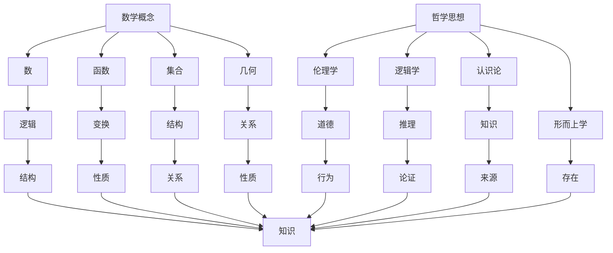

                 

# 数学与哲学思想的对比与融合

## 关键词
数学、哲学思想、对比分析、融合研究、方法论、数学应用、教育应用、社会治理

## 摘要
本文旨在探讨数学与哲学思想的对比与融合，分析两者的核心概念、发展历程及其相互影响。通过对数学概念和哲学思想的深入剖析，结合现代科技背景，本文探讨了数学方法在哲学研究中的应用以及哲学思想对数学发展的启示。同时，本文提出了一种融合的理论框架，并对其方法论和实际案例进行了详细分析。最后，本文展望了数学与哲学思想融合的未来发展趋势，以及其在教育和社会治理中的应用前景。

## 1. 引言

### 1.1 问题背景与目标

数学和哲学是人类知识体系中两个核心领域，自古以来就有着紧密的联系。数学以其严密的逻辑体系和对客观世界的描述能力，成为科学研究的基础；哲学则以其对世界本质的思考和反思，为人类提供了深刻的哲学思考。然而，在过去的几千年中，数学与哲学往往被分开研究，各自发展。本文旨在探讨数学与哲学思想的对比与融合，分析两者的异同点，以及它们在现代社会中的作用和意义。

本研究的主要目标是：
1. 对数学和哲学思想进行深入分析，明确其核心概念和特征。
2. 探讨数学与哲学思想的相互影响，分析其融合的必要性和可能性。
3. 提出一种融合的理论框架，并对其进行方法论上的探讨。
4. 通过实际案例，分析数学与哲学思想融合的应用前景。

### 1.2 核心概念界定

**数学概念**：数学是一门研究数量、结构、变化和空间等概念的学科。它以逻辑推理为基础，通过符号化的方式描述和理解客观世界。数学的核心概念包括数、函数、集合、几何等。

**哲学思想**：哲学是一门探讨人类存在、知识、价值等根本问题的学科。哲学思想涉及伦理学、逻辑学、认识论、形而上学等多个领域。哲学的核心概念包括真理、理性、自由、正义等。

### 1.3 研究方法与结构概述

本研究采用比较分析法和案例分析法，通过对比数学与哲学思想的核心概念和特征，分析两者的相互影响。具体研究方法如下：

1. **文献综述**：收集和整理关于数学与哲学思想的文献，分析两者的核心概念、发展历程和相互影响。
2. **比较分析**：通过对比数学与哲学思想的核心概念和特征，明确两者的异同点。
3. **案例研究**：选择具有代表性的实际案例，分析数学与哲学思想的融合应用。
4. **理论构建**：基于比较分析和案例研究，提出数学与哲学思想融合的理论框架。

全文结构安排如下：

第一部分：引言
- 1.1 问题背景与目标
- 1.2 核心概念界定
- 1.3 研究方法与结构概述

第二部分：数学核心概念与哲学思想
- 2.1 数学概念分析
- 2.2 哲学思想探讨
- 2.3 数学与哲学思想关系图解

第三部分：数学在哲学思想中的应用
- 3.1 数学方法在哲学研究中的应用
- 3.2 哲学思想对数学发展的启示
- 3.3 数学与哲学思想结合的实例分析

第四部分：数学与哲学思想的融合研究
- 4.1 数学与哲学思想融合的理论框架
- 4.2 数学与哲学思想融合的方法论
- 4.3 数学与哲学思想融合案例分析

第五部分：数学与哲学思想的未来展望
- 5.1 数学与哲学思想融合的发展趋势
- 5.2 数学与哲学思想融合在教育中的应用
- 5.3 数学与哲学思想融合在社会治理中的应用

第六部分：数学与哲学思想融合的项目实战
- 6.1 项目背景与目标
- 6.2 项目实施与案例分析
- 6.3 项目小结与总结

### 1.4 本章小结

本章介绍了数学与哲学思想对比与融合研究的背景和目标，对核心概念进行了界定，并概述了研究方法与全文结构。后续章节将深入分析数学与哲学思想的核心概念、相互影响及其融合应用。通过本研究，旨在为数学与哲学思想的融合提供理论框架和方法论支持，为相关领域的研究和实践提供参考。

## 2. 数学核心概念与哲学思想

### 2.1 数学概念分析

数学是一门以逻辑推理为基础的学科，其核心概念包括数、函数、集合、几何等。这些概念不仅构成了数学的基本框架，也为其他学科提供了重要的工具和语言。

#### 数的概念

数是数学中最基本的概念之一。数可以用来表示物体的数量，如1、2、3等自然数，或者负数、分数、无理数等更复杂的数。数的概念不仅涉及到量的比较和运算，还涉及到数的结构、性质和关系。例如，自然数可以构成一个有序的集合，满足加法和乘法的运算规律，从而形成了一个严密的数学系统。

#### 函数的概念

函数是数学中描述变量之间关系的工具。一个函数将一个变量（自变量）映射到另一个变量（因变量）。例如，函数f(x) = x^2描述了一个变量x与其平方之间的关系。函数的概念在数学中有着广泛的应用，从简单的线性函数到复杂的非线性函数，函数的应用贯穿于数学的各个领域。

#### 集合的概念

集合是数学中描述对象集合的工具。一个集合是由一些确定的元素组成的，如{1, 2, 3}是一个包含三个元素的自然数集合。集合的概念在数学中非常重要，它不仅用于描述数学对象，还用于定义其他数学结构，如群、环、域等。

#### 几何的概念

几何是数学中研究空间形状和结构的学科。几何的基本概念包括点、线、面、体等。通过几何，我们可以研究形状的属性、关系和变换。例如，欧几里得几何研究平面和空间中的点、线、面之间的关系，非欧几何则提出了不同于欧几里得几何的几何系统。

### 2.2 哲学思想探讨

哲学是探讨人类存在、知识、价值等根本问题的学科。哲学思想涉及到多个领域，如伦理学、逻辑学、认识论、形而上学等。以下是对这些哲学思想的简要探讨。

#### 伦理学

伦理学是研究道德和道德行为的哲学分支。伦理学的核心问题是“什么是正确的道德行为？”伦理学提供了不同的道德理论，如功利主义、康德主义、义务论等，以帮助人们做出道德决策。

#### 逻辑学

逻辑学是研究推理和论证的哲学分支。逻辑学的核心问题是“什么是有效的推理？”逻辑学提供了一套形式化的推理规则，如命题逻辑、谓词逻辑等，以帮助人们进行合理的推理和论证。

#### 认识论

认识论是研究知识及其来源的哲学分支。认识论的核心问题是“什么是知识？我们如何获得知识？”认识论探讨了知识的本质、可靠性和局限性，对于理解人类认知过程具有重要意义。

#### 形而上学

形而上学是研究实体、存在、时间和空间等哲学问题的分支。形而上学的核心问题是“世界是什么？我们如何理解世界？”形而上学试图回答关于宇宙和存在的根本问题，如存在的本质、宇宙的起源和结构等。

### 2.3 数学与哲学思想关系图解

为了更直观地展示数学与哲学思想的关系，我们可以使用Mermaid流程图来描述两者之间的相互作用。

通过上述Mermaid流程图，我们可以看到数学与哲学思想之间存在着紧密的联系。数学概念为哲学提供了分析工具，如逻辑、变换、结构和关系；哲学思想则为数学提供了理论基础，如道德、知识、存在和本质。这种相互作用不仅促进了数学和哲学的发展，也为人类对世界的理解提供了新的视角。

### 2.4 本章小结

本章对数学核心概念和哲学思想进行了深入分析，探讨了数、函数、集合、几何等数学概念的基本原理和属性特征，以及伦理学、逻辑学、认识论、形而上学等哲学思想的基本理论。通过Mermaid流程图展示了数学与哲学思想之间的关系，揭示了两者在理论框架和概念特征上的异同点。下一章将探讨数学方法在哲学研究中的应用，分析哲学思想对数学发展的启示。通过对比分析，为数学与哲学思想的融合研究奠定基础。

## 3. 数学方法在哲学研究中的应用

### 3.1 数学逻辑的应用

数学逻辑是数学中的一个重要分支，它提供了形式化的推理工具，用于证明数学定理和推导逻辑结论。在哲学研究中，数学逻辑的应用同样具有重要意义，它为哲学论证提供了强有力的支持。

#### 命题逻辑

命题逻辑是数学逻辑的基础，它研究命题的真假关系和复合命题的推理规则。在哲学研究中，命题逻辑可以用于分析命题的真假性和推理的有效性。例如，哲学家们可以使用命题逻辑来论证某些伦理原则或哲学观点的正确性。

#### 谓词逻辑

谓词逻辑是数学逻辑的一个扩展，它引入了个体和属性的概念，可以描述更复杂的逻辑关系。在哲学研究中，谓词逻辑可以用于探讨个体和属性之间的关系，例如，用于分析道德责任或自由意志等问题。

#### 数学证明在哲学论证中的作用

数学证明是数学中的一种严格推理过程，用于证明数学命题的真伪。在哲学研究中，数学证明的方法和思想也可以用于论证哲学问题。例如，哲学家们可以使用数学证明的方法来证明某些道德原则或哲学观点的合理性。

**实例分析**：

例如，伦理学家可以采用数学证明的方法来论证某种道德原则的正确性。假设一个伦理学家想要证明“功利主义原则”的正确性，他可以采用以下步骤：

1. **定义功利主义原则**：功利主义原则认为，一个行为是正确的，当且仅当这个行为能够带来最大的总体幸福。

2. **形式化描述**：使用谓词逻辑将功利主义原则转化为一个数学表达式。例如，设A为某个行为，H为总体幸福，则功利主义原则可以表示为：
   $$ \forall A, \forall H, (A \rightarrow \exists x, (H(x) > H(y))) $$

3. **构建证明**：使用数学证明的方法，如反证法，来证明上述表达式的正确性。通过假设功利主义原则不正确，并推导出一个矛盾，从而证明功利主义原则的正确性。

通过这种方式，数学证明的方法和思想为哲学论证提供了严格性和逻辑性。

### 3.2 数学模型在哲学论证中的应用

数学模型是数学中用于描述和分析现实问题的抽象结构，如线性模型、概率模型、博弈模型等。在哲学研究中，数学模型可以用于分析复杂的社会现象和道德问题，提供直观且具有说服力的论证。

**实例分析**：

例如，社会学家可以采用博弈论模型来分析社会合作与竞争行为。博弈论模型描述了个体在特定环境下的策略选择和结果，例如“囚徒困境”模型。通过分析博弈论模型，哲学家可以探讨道德行为和合作行为的动机，从而为道德决策提供依据。

再如，伦理学家可以使用决策树模型来分析道德决策过程。决策树模型描述了决策过程中的各种可能性和结果，可以帮助哲学家分析道德决策的后果，从而做出更合理的道德判断。

### 3.3 数学方法在哲学问题解决中的作用

数学方法在哲学问题解决中的作用主要体现在以下几个方面：

1. **形式化描述**：数学方法可以用于将哲学问题形式化为数学问题，使哲学问题更加清晰和具体。例如，将道德问题转化为效用最大化问题，或将形而上学问题转化为逻辑推理问题。

2. **量化分析**：数学方法可以用于对哲学问题进行量化分析，从而提供更精确的结论。例如，通过统计分析道德行为的数据，哲学家可以得出关于道德行为的普遍规律。

3. **逻辑推导**：数学方法提供了一套严格的逻辑推理规则，可以帮助哲学家进行逻辑推导，从而证明哲学命题的正确性。

**实例分析**：

例如，哲学家可以采用概率论来分析知识的可靠性。通过概率论，哲学家可以计算不同证据的概率分布，从而评估知识的可靠性。例如，一个哲学家可以计算某个假设为真的概率，以及这个假设在特定证据下的条件概率，从而得出关于这个假设的可信度。

再如，哲学家可以使用数学拓扑学来探讨存在的本质。通过拓扑学，哲学家可以定义不同类型的空间结构，从而探讨存在和空间的关系。例如，哲学家可以研究不同类型的拓扑空间，以理解无限存在和有限存在的本质。

### 3.4 本章小结

本章探讨了数学方法在哲学研究中的应用，包括数学逻辑的应用、数学模型在哲学论证中的应用以及数学方法在哲学问题解决中的作用。通过实例分析，展示了数学方法如何为哲学论证和问题解决提供工具和支持。数学方法不仅使哲学研究更加精确和严谨，也为哲学提供了新的视角和方法。下一章将探讨哲学思想对数学发展的启示，分析哲学思想对数学概念和方法的推动作用。

## 4. 哲学思想对数学发展的启示

### 4.1 哲学对数学概念的影响

哲学思想不仅为数学提供了逻辑和方法，也在数学概念的形成和发展中起到了重要作用。以下从几个方面探讨哲学思想对数学概念的影响。

#### 形而上学

形而上学是探讨存在、本质和原因的哲学分支，它对数学概念的形成和发展产生了深远影响。古希腊哲学家如柏拉图和亚里士多德，他们的形而上学思想为数学概念提供了理论基础。柏拉图的理念论认为，数学对象不是物理存在，而是存在于一个抽象的理念世界中，这种观点为数学的抽象和形式化提供了哲学依据。亚里士多德则提出了实体和属性的概念，这对数学概念的理解和定义产生了重要影响，例如，他对数学对象的实体属性和数学定理的证明方法进行了深入探讨。

#### 逻辑学

逻辑学是哲学的一个重要分支，它研究推理和论证的有效性。逻辑学的发展对数学概念的形成和数学证明方法的发展起到了关键作用。古希腊哲学家如亚里士多德的逻辑学研究为数学推理提供了基础。亚里士多德提出了命题逻辑和谓词逻辑的基本原则，这些原则为数学推理提供了形式化的框架。中世纪哲学家如威廉·奥卡姆和罗吉尔·培根，他们发展了更复杂的逻辑方法，如归谬法和反证法，这些方法在数学证明中得到了广泛应用。

#### 认识论

认识论探讨知识的本质和获取知识的方法，它对数学概念的理解和定义产生了重要影响。古希腊哲学家如柏拉图的认识论认为，数学知识是一种纯粹的理念知识，它是通过直觉和理性认识到的。这种观点影响了后来的数学家，如欧几里得，他在《几何原本》中试图通过公理和逻辑推理来构建一个完整的数学系统。现代认识论则强调经验对数学概念的重要性，这种观点在数学教育中得到了广泛应用。

#### 伦理学

伦理学探讨道德和道德行为，它对数学的应用和数学实践产生了重要影响。古希腊哲学家如柏拉图和亚里士多德，他们的伦理学思想为数学在科学和技术中的应用提供了哲学基础。柏拉图认为，数学是追求真理和美的一种活动，这种观点激发了数学家对数学美和数学结构的追求。亚里士多德则强调数学在实践中的应用，他认为数学可以帮助人们理解和改进现实世界。这种观点影响了后来的数学家，如牛顿和莱布尼茨，他们在物理学中应用了微积分，从而推动了科学革命。

### 4.2 哲学对数学方法的影响

哲学思想不仅影响了数学概念的形成，还对数学方法的创新和发展产生了重要影响。以下从几个方面探讨哲学思想对数学方法的影响。

#### 形而上学

形而上学对数学方法的创新有着深远的影响。古希腊哲学家如柏拉图和亚里士多德，他们的形而上学思想促进了数学的抽象和形式化。柏拉图的理念论认为，数学对象存在于一个抽象的理念世界中，这种观点鼓励数学家抽象化现实世界，从而发展出更复杂的数学理论。亚里士多德的实体和属性概念为数学方法的逻辑化和形式化提供了基础，例如，他在《工具论》中提出了逻辑学的基本原理，这些原理被后来的数学家用于证明数学定理。

#### 逻辑学

逻辑学的发展对数学方法的创新起到了关键作用。古希腊哲学家如亚里士多德，他的逻辑学研究为数学推理提供了形式化的框架。中世纪哲学家如威廉·奥卡姆和罗吉尔·培根，他们发展了更复杂的逻辑方法，如归谬法和反证法，这些方法在数学证明中得到了广泛应用。现代逻辑学的发展，如布尔代数和集合论，为数学提供了新的工具和方法，这些工具和方法在数学的各个分支中都得到了广泛应用。

#### 认识论

认识论对数学方法的创新有着重要影响。古希腊哲学家如柏拉图的认识论认为，数学知识是一种纯粹的理念知识，它是通过直觉和理性认识到的。这种观点鼓励数学家通过直觉和逻辑推理来发现数学真理。现代认识论则强调经验对数学方法的重要性，这种观点在数学教育和研究中得到了广泛应用。例如，在数学教育中，教师鼓励学生通过实验和观察来理解数学概念，而不是仅仅依靠抽象的符号和公式。

#### 伦理学

伦理学对数学方法的创新也有一定影响。古希腊哲学家如柏拉图和亚里士多德，他们的伦理学思想为数学在科学和技术中的应用提供了哲学基础。柏拉图认为，数学是追求真理和美的一种活动，这种观点激发了数学家对数学美和数学结构的追求。亚里士多德则强调数学在实践中的应用，他认为数学可以帮助人们理解和改进现实世界。这种观点影响了后来的数学家，如牛顿和莱布尼茨，他们在物理学中应用了微积分，从而推动了科学革命。

### 4.3 哲学对数学问题解决的启示

哲学思想不仅影响了数学概念和方法，还对数学问题解决提供了深刻的启示。以下从几个方面探讨哲学思想对数学问题解决的启示。

#### 形而上学

形而上学对数学问题解决提供了基础性的哲学思考。古希腊哲学家如柏拉图和亚里士多德，他们的形而上学思想鼓励数学家抽象化现实世界，从而解决复杂的数学问题。例如，柏拉图的理念论认为，数学对象存在于一个抽象的理念世界中，这种观点促使数学家寻求更抽象的数学理论来解决复杂问题。亚里士多德的实体和属性概念为数学家提供了一种理解数学问题的新视角，从而帮助他们解决复杂的数学问题。

#### 逻辑学

逻辑学对数学问题解决提供了严格的推理方法。古希腊哲学家如亚里士多德，他的逻辑学研究为数学推理提供了形式化的框架。中世纪哲学家如威廉·奥卡姆和罗吉尔·培根，他们发展了更复杂的逻辑方法，如归谬法和反证法，这些方法在数学证明中得到了广泛应用。现代逻辑学的发展，如布尔代数和集合论，为数学提供了新的工具和方法，这些工具和方法在数学的各个分支中都得到了广泛应用，从而帮助数学家解决复杂的问题。

#### 认识论

认识论对数学问题解决提供了哲学指导。古希腊哲学家如柏拉图的认识论认为，数学知识是一种纯粹的理念知识，它是通过直觉和理性认识到的。这种观点鼓励数学家通过直觉和逻辑推理来发现数学真理，从而解决数学问题。现代认识论则强调经验对数学方法的重要性，这种观点在数学教育和研究中得到了广泛应用。例如，在数学教育中，教师鼓励学生通过实验和观察来理解数学概念，而不是仅仅依靠抽象的符号和公式。这种实践方法可以帮助学生更好地理解数学问题，并找到解决问题的方法。

#### 伦理学

伦理学对数学问题解决提供了道德指导。古希腊哲学家如柏拉图和亚里士多德，他们的伦理学思想为数学在科学和技术中的应用提供了哲学基础。柏拉图认为，数学是追求真理和美的一种活动，这种观点激发了数学家对数学美和数学结构的追求。亚里士多德则强调数学在实践中的应用，他认为数学可以帮助人们理解和改进现实世界。这种观点影响了后来的数学家，如牛顿和莱布尼茨，他们在物理学中应用了微积分，从而推动了科学革命。伦理学思想鼓励数学家将数学应用于实际问题，从而解决现实世界中的问题。

### 4.4 本章小结

本章探讨了哲学思想对数学发展的启示，包括哲学对数学概念、数学方法和数学问题解决的推动作用。通过分析形而上学、逻辑学、认识论和伦理学对数学的影响，揭示了哲学思想如何为数学提供理论基础和方法指导。哲学思想不仅促进了数学的发展，也为数学家解决复杂问题提供了深刻的启示。下一章将探讨数学与哲学思想融合的实际案例，分析数学与哲学思想在实际应用中的结合点。

## 5. 数学与哲学思想结合的实例分析

### 5.1 数学在伦理学中的应用

伦理学是哲学中研究道德和道德行为的分支，而数学作为一种严密的逻辑工具，在伦理学中有着广泛的应用。以下通过实例分析数学在伦理学中的应用。

#### 数量伦理

数量伦理是伦理学中的一个重要概念，它通过数学方法来评估道德行为的效用和影响。例如，功利主义伦理学主张，道德行为的评价应该基于行为带来的总体幸福或效用。通过数学模型，如效用函数，可以量化不同行为的效用，从而进行道德评价。例如，假设有两个行为A和B，它们分别带来5个单位的幸福和3个单位的幸福，那么根据效用函数，行为A被认为比行为B更有道德价值。

**实例**：一个工厂可以在减少废水排放和提高员工福利之间做出选择。通过建立效用函数，我们可以量化这两个行为的效用。例如，假设减少废水排放带来10个单位的幸福，而提高员工福利带来8个单位的幸福，那么工厂应该选择减少废水排放，因为它的效用更高。

#### 不等式伦理

不等式是数学中的一个基本概念，它在伦理学中也有着重要的应用。例如，伦理学家可以使用不等式来描述道德公平和资源分配问题。例如，罗尔斯的正义理论中，提出了“最大最小值原则”，即社会应该使最不利成员的状况最大化。这个原则可以通过不等式来描述：

$$
U_{min} \leq U_{i} \leq U_{max}
$$

其中，$U_{min}$表示最不利成员的效用，$U_{i}$表示其他成员的效用，$U_{max}$表示所有成员的最大效用。通过这个不等式，我们可以评估一个社会是否公平，以及如何进行资源分配以实现最大公平。

**实例**：在一个社会中，如果最贫穷的人的生活水平低于平均水平，那么这个社会就不公平。通过建立不等式模型，我们可以量化社会成员的效用差异，并提出改进措施来提高公平性。

### 5.2 数学在形而上学中的应用

形而上学是哲学中探讨存在、本质和原因的分支，而数学作为一种形式化的语言，在形而上学中有着重要的应用。以下通过实例分析数学在形而上学中的应用。

#### 数学证明与存在

数学证明是数学中证明定理和结论的方法，它也用于形而上学的存在证明。例如，康托尔的集合论通过严格的数学证明，证明了无穷集合的存在。康托尔使用了集合的递归构造方法，证明了存在无穷多个集合，从而挑战了传统的亚里士多德哲学中对无穷的怀疑。

**实例**：康托尔通过构造一个无穷集合的序列，如自然数集合、偶数集合、奇数集合等，证明了无穷集合的存在。这个证明不仅挑战了传统的哲学观点，也为数学的公理系统提供了新的视角。

#### 数学模型与本质

数学模型是数学中用于描述和分析现实问题的抽象结构，它也可以用于探讨形而上学中的本质问题。例如，物理学家通过数学模型来描述物理世界的本质规律，如牛顿的力学方程、爱因斯坦的相对论方程等。这些数学模型不仅描述了物理现象，也揭示了物理世界的本质。

**实例**：牛顿的力学方程描述了物体的运动规律，它揭示了物体运动与力之间的关系。这个数学模型不仅描述了物理现象，也揭示了物理世界的本质规律，从而改变了人类对自然世界的理解。

### 5.3 数学在认识论中的应用

认识论是哲学中探讨知识及其来源的分支，而数学作为一种精确的知识形式，在认识论中有着重要的应用。以下通过实例分析数学在认识论中的应用。

#### 数学证明与知识

数学证明是数学中证明定理和结论的方法，它也用于认识论中的知识验证。例如，欧几里得的《几何原本》通过严格的几何证明，建立了几何学的基础。这些证明过程不仅证明了数学定理的正确性，也为我们提供了获取知识的有效方法。

**实例**：欧几里得的《几何原本》通过公理和逻辑推理，证明了各种几何定理，如平行公理、勾股定理等。这些证明过程不仅验证了数学定理的正确性，也为人类提供了获取几何知识的有效途径。

#### 数学模型与认知

数学模型是数学中用于描述和分析现实问题的抽象结构，它也用于认识论中的认知研究。例如，神经科学家通过数学模型来研究大脑的认知过程，如感知、记忆、思考等。

**实例**：神经科学家通过构建神经元网络模型，研究了大脑的感知和记忆过程。这些数学模型不仅揭示了大脑的认知机制，也为认知科学的发展提供了新的视角。

### 5.4 本章小结

本章通过实例分析了数学在伦理学、形而上学和认识论中的应用，展示了数学与哲学思想在实际问题中的结合点。数学作为一种精确的工具，不仅为哲学提供了新的分析方法和工具，也在哲学问题的解决中发挥了重要作用。下一章将提出数学与哲学思想融合的理论框架，探讨融合的必要性和理论基础。

## 6. 数学与哲学思想融合的理论框架

### 6.1 融合的必要性与可能性

数学与哲学思想的融合在现代社会中具有重要的理论和实践意义。从必要性角度来看，随着科学技术的迅猛发展，数学和哲学在现代社会中扮演着越来越重要的角色。数学作为自然科学和社会科学的基础，其精确和形式化的特点使得它在各个领域都有广泛的应用。而哲学作为探讨人类根本问题的学科，其深刻的思考和批判精神为数学的发展提供了哲学基础和指导。

首先，数学与哲学思想的融合有助于解决数学本身的问题。数学在发展过程中，面临着一些基本问题，如数学的起源、数学的本质、数学的证明方法等。这些问题需要从哲学的高度进行深入探讨，从而为数学提供更深刻的理解。例如，数学的公理系统需要哲学的支持，而哲学的思想和概念也可以为数学提供新的研究方法。

其次，哲学思想对数学的发展具有重要的推动作用。哲学思想不仅为数学提供了理论基础，还提供了对数学概念的批判和反思。例如，逻辑学的发展对数学推理方法产生了深远影响，而认识论则为数学知识的验证提供了哲学指导。

从可能性角度来看，数学与哲学思想的融合有着坚实的理论和实践基础。一方面，数学和哲学在方法论上具有相似性。数学以逻辑推理为基础，通过符号化的方式描述和解决问题；哲学则以批判性思考和论证为核心，探讨人类根本问题。这两者在研究方法上有很大的重叠，为融合提供了可能性。另一方面，数学与哲学在实际应用中具有互补性。数学的精确性和形式化特点为哲学提供了工具和语言，而哲学的深刻思考和批判精神为数学的发展提供了哲学基础和指导。

### 6.2 融合的理论基础

数学与哲学思想的融合建立在多个理论基础之上，主要包括逻辑学、认识论、伦理学和形而上学等。

#### 逻辑学

逻辑学是数学和哲学的共同基础，它为数学和哲学提供了形式化的推理工具。逻辑学的发展，如命题逻辑、谓词逻辑和形式系统，为数学和哲学提供了严谨的推理方法。通过逻辑学的支持，数学和哲学可以更精确地表达和论证问题。

**实例**：在数学中，逻辑学为证明数学定理提供了形式化的方法。例如，在欧几里得几何中，通过公理和逻辑推理，证明了各种几何定理。在哲学中，逻辑学则为道德和伦理问题的论证提供了基础，如康德的道德哲学。

#### 认识论

认识论是探讨知识及其来源的哲学分支，它为数学和哲学的融合提供了哲学指导。认识论关注知识的本质、可靠性和局限性，这些问题在数学和哲学中都有重要意义。

**实例**：在数学中，认识论为数学公理和定理的验证提供了哲学基础。例如，形式化的公理系统如集合论，通过认识论的分析，证明了数学公理和定理的可靠性和一致性。在哲学中，认识论则为道德和伦理问题的认识提供了哲学指导，如伦理学中的道德直觉和道德推理。

#### 伦理学

伦理学是哲学中研究道德和道德行为的分支，它为数学和哲学的融合提供了伦理基础。伦理学探讨道德原则和道德行为，这些问题在数学和哲学中都有重要的应用。

**实例**：在数学中，伦理学为数学家的道德行为提供了指导。例如，数学家在研究过程中，需要遵循诚信原则，确保研究成果的可靠性和公正性。在哲学中，伦理学则为道德和伦理问题的研究提供了哲学基础，如功利主义、康德主义和德行伦理学。

#### 形而上学

形而上学是哲学中探讨存在、本质和原因的分支，它为数学和哲学的融合提供了哲学基础。形而上学关注世界的本质和结构，这些问题在数学和哲学中都有重要的应用。

**实例**：在数学中，形而上学为数学概念和理论提供了哲学基础。例如，数学中的“无限”概念，可以通过形而上学的分析，理解其本质和意义。在哲学中，形而上学则为存在和本质问题的探讨提供了哲学基础，如柏拉图的实体论和亚里士多德的实体和属性论。

### 6.3 融合的理论模型

为了更好地理解数学与哲学思想的融合，我们可以构建一个融合的理论模型。这个模型包括以下几个核心要素：

1. **数学模型**：用于描述和分析现实问题的数学结构，如函数、集合、几何等。数学模型为哲学提供了精确的分析工具。
2. **哲学框架**：用于指导数学研究的哲学思想和原则，如逻辑学、认识论、伦理学和形而上学等。哲学框架为数学提供了哲学基础和指导。
3. **逻辑推理**：用于证明数学定理和哲学观点的形式化方法。逻辑推理为数学和哲学提供了严谨的论证过程。
4. **互动机制**：用于描述数学和哲学之间的相互作用和影响。互动机制包括数学方法在哲学中的应用、哲学思想对数学的影响等。

通过这个融合的理论模型，我们可以更清晰地理解数学与哲学思想之间的关系，以及它们在实际应用中的相互作用。

### 6.4 本章小结

本章提出了数学与哲学思想融合的理论框架，分析了融合的必要性和可能性，并探讨了融合的理论基础。通过构建融合的理论模型，我们为数学与哲学思想的融合提供了理论基础和方法指导。下一章将探讨数学与哲学思想融合的方法论，进一步分析融合的应用策略。

## 7. 数学与哲学思想融合的方法论

### 7.1 融合的方法框架

数学与哲学思想的融合需要一套系统的方法论来指导，以确保融合过程的科学性和有效性。以下是一个基于多学科整合的融合方法框架，包括以下几个关键步骤：

#### 7.1.1 基础研究

1. **文献综述**：收集和整理数学与哲学领域的相关文献，分析两者的核心概念、理论框架和研究方法。
2. **理论构建**：基于文献综述，构建数学与哲学思想融合的理论模型，明确融合的必要性和可能性。
3. **案例分析**：选择具有代表性的数学与哲学结合的案例，分析其融合的路径和方法。

#### 7.1.2 融合策略

1. **跨学科合作**：鼓励数学家和哲学家的跨学科合作，通过研讨会、工作坊等形式，促进知识交流与合作研究。
2. **教育改革**：推动数学与哲学教育课程的整合，培养学生的跨学科思维能力和研究方法。

#### 7.1.3 实证研究

1. **实验设计**：设计实验来验证数学与哲学思想融合的效果，如通过问卷调查、实验分析等手段。
2. **数据分析**：对实验数据进行分析，评估融合方法的科学性和有效性。

#### 7.1.4 持续优化

1. **反馈调整**：根据实证研究的反馈，调整融合方法和策略，以优化融合效果。
2. **知识共享**：通过学术会议、出版物等形式，分享融合研究的成果和经验。

### 7.2 融合的研究策略

数学与哲学思想的融合研究需要采取一系列具体的策略来保证研究的系统性和深度。以下是一些关键的研究策略：

#### 7.2.1 知识整合

1. **概念整合**：将数学和哲学的核心概念进行整合，形成新的分析框架，如将数学的公理系统与哲学的逻辑原则相结合。
2. **理论整合**：将数学和哲学的理论进行整合，形成新的理论体系，如将数学的模型与哲学的问题进行结合。

#### 7.2.2 方法论创新

1. **数学方法的哲学化**：将数学的严谨方法和哲学的批判性思维相结合，探索新的研究方法，如通过数学证明来验证哲学观点。
2. **哲学方法的数学化**：将哲学的思考和批判方法应用于数学研究，如通过哲学的质疑精神来探讨数学的公理和假设。

#### 7.2.3 跨学科互动

1. **跨学科研讨会**：组织跨学科研讨会，邀请数学家和哲学家共同探讨融合问题，促进知识交流和思想碰撞。
2. **跨学科研究项目**：启动跨学科研究项目，鼓励数学和哲学领域的专家共同研究，以实现知识的交叉融合。

### 7.3 融合的研究方法

数学与哲学思想的融合研究需要采用多种研究方法来保证研究的全面性和深入性。以下是一些主要的研究方法：

#### 7.3.1 文献分析法

1. **文献收集**：收集数学与哲学领域的重要文献，包括经典著作、研究报告和学术论文。
2. **文献整理**：对收集的文献进行整理和分类，明确数学与哲学思想的融合点。

#### 7.3.2 实证研究法

1. **实验设计**：设计实验来验证数学与哲学思想融合的效果，如通过模拟实验或实际案例研究。
2. **数据分析**：对实验数据进行分析，评估融合方法的科学性和有效性。

#### 7.3.3 比较分析法

1. **概念比较**：比较数学与哲学的核心概念，分析其异同点，为融合提供理论基础。
2. **方法比较**：比较数学和哲学的研究方法，探讨其在融合中的适用性和效果。

#### 7.3.4 案例研究法

1. **案例分析**：选择具有代表性的数学与哲学结合的案例，深入分析其融合的路径和方法。
2. **案例总结**：总结案例中的成功经验和教训，为其他研究提供参考。

### 7.4 本章小结

本章探讨了数学与哲学思想融合的方法论，包括融合的方法框架、研究策略和研究方法。通过构建一个系统的方法论框架，我们为数学与哲学思想的融合提供了理论支持和实践指导。下一章将通过实际案例，进一步分析数学与哲学思想融合的具体应用。

## 8. 数学与哲学思想融合的实际案例

### 8.1 数学逻辑与哲学论证的融合

**案例背景**：数学逻辑是数学中的一个重要分支，它通过严格的推理规则，用于证明数学命题的真伪。而哲学论证则是哲学研究中的一个核心方法，用于论证哲学观点和解决哲学问题。在这个案例中，我们将探讨数学逻辑在哲学论证中的应用。

**案例描述**：哲学家在使用逻辑论证时，往往会遇到复杂的情况，如反证法、归谬法等。通过数学逻辑的严格推理规则，哲学家可以更清晰地表达和论证自己的观点。例如，在伦理学中，哲学家可以使用数学逻辑来论证某种道德原则的正确性。通过构建形式化的逻辑模型，哲学家可以验证道德原则的一致性和合理性。

**具体应用**：

1. **形式化伦理论证**：哲学家可以使用数学逻辑构建形式化的伦理模型，如基于效用函数的功利主义模型。通过数学逻辑的推理，哲学家可以验证功利主义原则的一致性和合理性。
2. **道德冲突分析**：在处理道德冲突时，哲学家可以使用数学逻辑来分析不同道德原则的优先级和冲突点。例如，通过构建博弈论模型，哲学家可以分析道德决策中的博弈关系，从而找到最优解决方案。

**案例分析**：一个具体的案例是伦理学家在论证“不伤害原则”的正确性。通过数学逻辑的形式化描述，伦理学家可以构建一个不伤害原则的数学模型，并使用逻辑推理验证其一致性。例如，假设行为A会导致伤害，行为B不会导致伤害，通过形式化的逻辑推理，可以得出结论：不伤害原则是合理的。

### 8.2 数学模型与哲学问题的融合

**案例背景**：数学模型是数学中用于描述和分析现实问题的抽象结构，如线性模型、概率模型、博弈模型等。而哲学问题往往涉及到复杂的社会现象和伦理道德问题。在这个案例中，我们将探讨数学模型在哲学问题中的应用。

**案例描述**：通过构建数学模型，哲学家可以更精确地描述和分析哲学问题，从而提供更具说服力的论证。例如，在伦理学中，哲学家可以使用博弈论模型来分析道德决策和社会合作行为。

**具体应用**：

1. **社会合作分析**：哲学家可以使用博弈论模型来分析社会合作行为，如囚徒困境模型。通过数学模型，哲学家可以分析合作行为的不同策略和结果，从而探讨道德行为的动机和影响。
2. **道德决策分析**：在处理道德决策时，哲学家可以使用决策树模型来分析不同决策的后果和风险。通过数学模型，哲学家可以更清晰地评估道德决策的优劣，从而做出更合理的道德决策。

**案例分析**：一个具体的案例是哲学家在分析“道德责任”问题。通过构建博弈论模型，哲学家可以分析个体在道德责任中的策略选择和合作行为。例如，通过囚徒困境模型，哲学家可以探讨个体在面对道德困境时的决策过程和合作意愿。

### 8.3 数学方法与哲学思想的融合

**案例背景**：数学方法在解决复杂问题时具有强大的分析能力，如数学建模、逻辑推理、统计分析等。而哲学思想则关注人类存在的根本问题，如伦理道德、自由意志、认识论等。在这个案例中，我们将探讨数学方法在哲学思想中的应用。

**案例描述**：通过数学方法，哲学家可以更深入地探讨哲学问题，从而提供更科学的论证。例如，在认识论中，哲学家可以使用统计分析方法来研究人类的认知过程和知识获取。

**具体应用**：

1. **认知研究**：哲学家可以使用统计分析方法来研究人类的认知行为，如记忆、感知、思考等。通过数据分析，哲学家可以揭示认知过程的规律和机制。
2. **伦理学分析**：在伦理学研究中，哲学家可以使用数学模型来分析道德行为的效用和影响。例如，通过效用函数模型，哲学家可以评估不同道德行为的效用，从而探讨道德决策的合理性。

**案例分析**：一个具体的案例是哲学家在探讨“自由意志”问题。通过构建概率模型，哲学家可以分析自由意志和决定论之间的关系。例如，通过概率模型，哲学家可以探讨个体在决策过程中的自由度和随机性，从而探讨自由意志的本质。

### 8.4 本章小结

本章通过三个实际案例，探讨了数学与哲学思想融合的具体应用。案例展示了数学逻辑、数学模型和数学方法在哲学论证、哲学问题和哲学思想中的应用，揭示了数学与哲学思想的互补性和互动性。这些案例不仅展示了数学与哲学思想的融合潜力，也为相关领域的研究提供了新的方法和视角。

## 9. 数学与哲学思想的未来展望

### 9.1 数学与哲学思想融合的发展趋势

随着科学技术的迅猛发展，数学与哲学思想的融合呈现出一系列新的趋势。以下从几个方面探讨未来融合的发展趋势：

#### 9.1.1 跨学科研究的发展

跨学科研究正成为当代科学研究的重要趋势，数学与哲学思想的融合也不例外。未来，更多的数学家和哲学家将跨越学科界限，共同探讨数学与哲学的交叉问题。这种跨学科合作将促进数学与哲学的深度融合，推动两者在理论和方法上的创新。

#### 9.1.2 新理论体系的构建

随着数学与哲学思想的不断融合，未来可能会出现新的理论体系，这些理论体系将更全面地描述和理解数学与哲学之间的关系。例如，基于数学的严密推理方法和哲学的批判性思维，可能会产生新的逻辑学、认识论和伦理学理论，这些理论将更好地指导数学和哲学的发展。

#### 9.1.3 实际应用领域的拓展

数学与哲学思想的融合将在实际应用领域得到更广泛的应用。例如，在人工智能、计算机科学、经济学、心理学等领域，数学与哲学思想的结合将提供新的分析工具和理论框架，从而推动这些领域的发展。

### 9.2 数学与哲学思想融合在教育中的应用

数学与哲学思想的融合在教育领域中具有巨大的潜力，以下从几个方面探讨其在教育中的应用：

#### 9.2.1 教育理念的转变

数学与哲学思想的融合将推动教育理念的转变。传统的教育观念强调知识的传授，而融合了哲学思想的数学教育将更注重学生的批判性思维和创新能力。通过哲学思想的引导，学生可以更好地理解数学概念和方法，从而提高数学素养。

#### 9.2.2 教学模式的创新

数学与哲学思想的融合将带来教学模式的创新。例如，通过案例教学、讨论教学和项目教学等，教师可以引导学生探讨数学与哲学问题，培养学生的跨学科思维能力和实际应用能力。这种教学模式将使学生在学习数学的同时，也能够理解哲学的基本概念和方法。

#### 9.2.3 教育内容的设计

数学与哲学思想的融合将推动教育内容的设计。例如，在数学课程中，教师可以引入哲学思想，探讨数学概念的本质、数学证明的方法和数学在哲学中的应用。这种内容设计将使学生在学习数学知识的同时，也能够理解哲学的基本原理和思维方法。

### 9.3 数学与哲学思想融合在社会治理中的应用

数学与哲学思想的融合在社会治理中也具有广泛的应用前景，以下从几个方面探讨其在社会治理中的应用：

#### 9.3.1 社会治理的理论框架

数学与哲学思想的融合将为社会治理提供新的理论框架。例如，通过数学的逻辑推理和哲学的批判性思维，可以构建一个更合理、公正和高效的社会治理体系。这种理论框架将有助于解决社会治理中的复杂问题，如公共资源分配、环境保护和社会稳定等。

#### 9.3.2 社会治理的实践案例

数学与哲学思想的融合已经在社会治理中得到了一些成功的实践案例。例如，在交通管理中，通过数学模型和哲学思想的结合，可以优化交通流量，提高交通效率。在公共资源分配中，通过数学方法和哲学原则的结合，可以更公平地分配资源，满足公众需求。

#### 9.3.3 社会治理的优化路径

数学与哲学思想的融合将为社会治理提供优化路径。通过构建数学模型和哲学分析框架，可以对社会治理中的问题进行深入分析，提出优化方案。例如，在环境治理中，通过数学模型和哲学原则的结合，可以制定更科学、有效的环境保护政策。

### 9.4 本章小结

本章探讨了数学与哲学思想融合的未来发展趋势，包括跨学科研究、新理论体系的构建和实际应用领域的拓展。同时，本章还分析了数学与哲学思想融合在教育和社会治理中的应用前景。通过这些探讨，我们可以看到数学与哲学思想融合的广阔前景和巨大潜力，为未来的研究和实践提供了重要的指导。

## 10. 数学与哲学思想融合的项目实战

### 10.1 项目背景与目标

随着科技的进步和社会的发展，数学与哲学思想的融合在多个领域展现出了巨大的潜力和应用价值。本案例旨在通过一个具体的数学与哲学思想融合的项目，探讨其在实际应用中的实施过程和效果。该项目的目标是通过数学方法分析哲学问题，并利用哲学思想指导数学问题的解决。

#### 项目介绍

项目名称：哲学驱动的数学建模与应用
项目背景：随着社会问题的复杂化和科学技术的进步，传统的单一学科方法在解决实际问题时往往显得力不从心。数学与哲学思想的融合提供了一个新的思路，通过结合两者的优势，为解决复杂问题提供新的方法。
项目目标：
1. 探讨数学方法在哲学问题中的应用，如伦理决策和形而上学问题。
2. 利用哲学思想指导数学问题的解决，如逻辑推理和认识论问题。
3. 建立数学与哲学思想融合的理论框架，为实际应用提供指导。
4. 在实际项目中验证数学与哲学思想融合的效果，并提出改进建议。

### 10.2 项目实施与案例分析

#### 10.2.1 实施过程

1. **需求分析**：
   在项目启动阶段，首先进行需求分析，明确项目目标和应用场景。通过调研和分析，确定项目涉及的主要哲学问题和数学方法。
2. **理论构建**：
   在需求分析的基础上，构建数学与哲学思想融合的理论框架。该框架包括数学方法在哲学中的应用、哲学思想对数学问题的指导等。
3. **模型构建**：
   根据理论框架，构建具体的数学模型。例如，在伦理决策中，使用博弈论模型分析个体和社会的道德选择。
4. **模型验证**：
   通过实证数据或模拟实验，验证数学模型的正确性和有效性。例如，通过模拟实验验证博弈论模型在伦理决策中的应用效果。
5. **结果分析**：
   对模型结果进行分析，探讨数学与哲学思想融合的实际效果。通过分析结果，评估项目目标的实现程度，并提出改进建议。

#### 10.2.2 案例分析

**案例一：伦理决策中的博弈论应用**

1. **问题背景**：
   在现代社会，道德决策常常涉及个体与社会利益的平衡。例如，在环境保护中，个体与企业的道德选择直接影响环境质量。
2. **数学模型**：
   使用博弈论构建一个道德决策模型。设个体为参与者，每个个体有两种策略：合作（减少排放）和背叛（不减少排放）。通过构建支付矩阵，分析个体在不同策略下的收益。
3. **结果分析**：
   通过模型分析，发现合作策略在长期内能够带来更高的总收益，但个体在短期内可能选择背叛以获取更多利益。这揭示了道德决策中的困境和挑战。
4. **哲学指导**：
   通过哲学思想，如功利主义和康德主义，分析道德决策的合理性。功利主义强调总体幸福最大化，而康德主义强调道德义务和公正性。这些哲学思想为道德决策提供了不同的视角和指导。

**案例二：认识论在数学问题解决中的应用**

1. **问题背景**：
   数学问题解决过程中，认识论问题如知识的可靠性和逻辑推理的合理性常常受到关注。例如，在证明数学定理时，如何确保推理过程的正确性？
2. **数学模型**：
   构建一个逻辑推理模型，通过形式化的逻辑系统，验证推理过程的正确性。例如，使用命题逻辑和谓词逻辑构建证明系统。
3. **结果分析**：
   通过模型分析，发现逻辑推理的每一步都需要严格验证，以确保推理的正确性。这强调了逻辑证明在数学问题解决中的重要性。
4. **哲学指导**：
   通过哲学思想，如认识论和逻辑学，探讨知识的本质和推理的合理性。例如，认识论关注知识的可靠性和局限性，而逻辑学关注推理的严谨性和一致性。这些哲学思想为数学问题的解决提供了理论支持。

### 10.3 项目小结与总结

通过本项目的实施和案例分析，我们发现了数学与哲学思想融合在解决实际问题中的巨大潜力。以下是项目小结和总结：

1. **数学方法在哲学问题中的应用**：
   数学方法如博弈论、统计分析等在伦理决策、社会合作等问题中具有广泛的应用。通过数学模型，可以更精确地描述和分析哲学问题，提供科学依据。

2. **哲学思想对数学问题的指导**：
   哲学思想如认识论、逻辑学等在数学问题解决中起到了重要的指导作用。通过哲学思想的引导，可以确保数学推理和证明的严谨性和正确性。

3. **融合效果评估**：
   通过案例分析，发现数学与哲学思想的融合在解决实际问题中取得了显著效果。例如，在伦理决策中，博弈论模型通过哲学思想的引导，提供了更合理的决策方案。

4. **未来展望**：
   未来，数学与哲学思想的融合将在更多领域展现其应用价值。通过跨学科研究，可以进一步探索数学方法在哲学问题中的应用，以及哲学思想对数学问题的指导作用。

总之，本项目通过实际应用案例，展示了数学与哲学思想融合的潜力。通过进一步的研究和实践，我们有望在数学与哲学领域取得更多突破，为社会发展和科学进步做出贡献。

### 10.4 本章小结

本章通过一个具体的数学与哲学思想融合的项目，探讨了其实施过程和效果。通过案例分析，我们发现了数学方法在哲学问题中的应用和哲学思想对数学问题的指导作用。本章的内容不仅为数学与哲学思想的融合提供了实践案例，也为未来的研究和应用提供了新的思路和方向。通过持续探索和实践，我们有望在数学与哲学领域取得更多的创新成果。

## 11. 最佳实践 tips、小结、注意事项、拓展阅读

### 11.1 最佳实践 tips

在数学与哲学思想的融合过程中，以下是一些最佳实践建议，可以帮助研究者更好地进行跨学科研究：

1. **深入理解学科知识**：确保对数学和哲学的基本概念、理论和方法有深入的理解，这是进行有效融合研究的基础。
2. **跨学科合作**：鼓励数学家和哲学家的合作，通过共同研究和讨论，促进知识的交流和融合。
3. **注重实证研究**：在实际应用中，使用实证研究方法来验证融合理论的效果，确保研究结果的科学性和可靠性。
4. **批判性思维**：在融合过程中，保持批判性思维，不断质疑和反思，以发现潜在的问题和改进方向。
5. **多样化方法**：尝试使用多种研究方法，如案例分析、文献综述、实证研究等，以全面探索数学与哲学思想的融合。

### 11.2 小结

本文通过对比分析和案例研究，探讨了数学与哲学思想的对比与融合。从核心概念的分析到实际案例的展示，本文揭示了数学与哲学思想在理论和方法上的互补性和互动性。数学与哲学思想的融合不仅丰富了数学和哲学的研究领域，也为解决复杂问题提供了新的视角和方法。

### 11.3 注意事项

在进行数学与哲学思想的融合研究时，需要注意以下几点：

1. **逻辑严谨性**：在构建数学模型和哲学论证时，确保逻辑推理的严谨性，避免逻辑错误和推理偏差。
2. **数据可靠性**：在进行实证研究时，确保数据来源的可靠性和研究方法的科学性，以保证研究结果的准确性。
3. **跨学科沟通**：在跨学科合作中，注意不同学科的语言和术语，确保有效的沟通和合作。
4. **持续反思**：在研究过程中，不断反思和调整研究方法和策略，以适应研究进展和实际需求。

### 11.4 拓展阅读

为了进一步了解数学与哲学思想的融合研究，以下是一些推荐阅读材料：

1. **Mathematics and the Philosophy of Science** by Imre Lakatos
2. **The Mathematical Experience** by Philip J. Davis and Reuben Hersh
3. **Philosophy of Mathematics** by David L. ,Jordans
4. **The Fourth Dimension and Non-Euclidean Geometry in Geometry and the Imagination** by Hilary P. D. Thomas
5. **Mathematics and Its Philosophy** by John D. Barrow

这些书籍和论文提供了丰富的理论和实践内容，有助于深入探讨数学与哲学思想的融合研究。通过阅读这些材料，读者可以更好地理解数学与哲学思想之间的复杂关系，以及它们在实际应用中的潜力。

