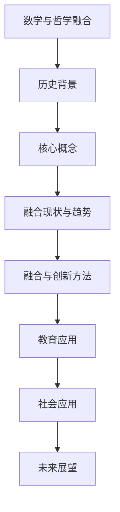

                 

### # 数学与哲学思想的融合与创新

关键词：数学哲学、融合、创新、跨学科研究、数学方法论、哲学思考

摘要：本文探讨了数学与哲学思想的融合与创新，从历史背景、核心概念、融合现状、融合方法以及教育和社会应用等方面进行了深入分析。文章首先介绍了数学在哲学思想中的历史作用，接着详细阐述了数学与哲学思想的融合现状与趋势。然后，文章探讨了数学与哲学思想的交叉概念，并分析了哲学观念对数学问题的启示。在此基础上，文章通过具体案例展示了数学与哲学思想的融合与创新方法，以及其在教育和社会中的应用。最后，文章对数学与哲学思想的融合未来进行了展望，提出了可能的发展方向和社会影响。

---

## 第一部分: 背景介绍与核心概念

### 第1章: 问题背景与核心概念

#### 1.1 问题背景

##### 1.1.1 数学在哲学思想中的历史作用

数学作为一门学科，自古以来就与哲学有着紧密的联系。古希腊哲学中，数学被视为哲学的基础，而数学家如欧几里得、阿基米德等不仅以其数学成就著称，也在哲学上有着重要贡献。例如，柏拉图通过他的“理型论”来解释数学的普遍性和永恒性，认为数学真理存在于一个超越的理型世界之中。

在西方哲学中，数学的地位随着时间的发展不断演变。亚里士多德认为数学是理性思维的最高形式，而笛卡尔则通过他的“我思故我在”将数学与哲学紧密结合起来。在东方哲学中，数学也有着独特的地位。中国古代的《易经》就包含了丰富的数学思想，而印度哲学中的“零”概念对数学的发展也有着深远影响。

##### 1.1.2 哲学思想对数学发展的推动作用

哲学思想不仅影响了数学的研究对象和方法，也在很大程度上推动了数学的发展。例如，存在论关注的是实体和存在的方式，这促使数学家去探讨数学对象的本体属性。认识论则探讨了人类如何获得知识，这影响了数学证明的逻辑结构和证明方法。伦理学关注道德和行为准则，这也对数学的应用领域产生了影响，比如在计算机科学和社会科学中数学的应用。

哲学观念在数学哲学中的地位也非常重要。数学哲学探讨的是数学的本质、数学知识的性质以及数学证明的方法等问题。这种探讨不仅有助于深化对数学本身的理解，也为数学的发展提供了新的视角。

##### 1.1.3 数学与哲学思想的融合现状与趋势

数学与哲学思想的融合在当代有着广泛的应用和讨论。数学哲学作为一门跨学科领域，已经成为数学研究和哲学研究的重要组成部分。例如，集合论中的悖论问题（如罗素悖论）既是数学问题，也是哲学问题，它促使数学家去反思集合论的基础和逻辑。

当前，数学与哲学思想的融合趋势表现为跨学科研究的兴起。例如，计算机科学中的算法设计不仅需要数学知识，还需要哲学思维来处理复杂性和不确定性。此外，数学在社会科学中的应用也越来越依赖于哲学观念的指导，比如在经济学、政治学和心理学中数学模型的构建和验证。

#### 1.2 核心概念

##### 1.2.1 数学概念

数学是一门研究数量、结构、变化和空间的科学。数学的基本概念包括集合、函数、数论、几何、微积分等。这些概念构成了数学的基石，并在不同分支中有着具体的应用。例如，集合论是现代数学的基础，它研究集合的性质和关系；函数是描述变量之间关系的数学工具；数论研究整数和它们的性质；几何学研究空间的形状和大小；微积分研究变化和速率。

##### 1.2.2 哲学概念

哲学是一门探讨存在、知识、价值、理性、心灵等基本问题的学科。哲学的基本概念包括存在论、认识论、伦理学、美学等。存在论研究实体和存在的本质，认识论探讨人类如何获得知识，伦理学关注道德和行为准则，美学则研究美和审美体验。

##### 1.2.3 数学与哲学思想的交叉概念

数学与哲学思想的交叉概念主要集中在数学哲学和哲学数学上。数学哲学探讨数学的本质、数学知识的性质以及数学证明的方法等问题。哲学数学则是运用哲学方法来研究数学问题，如存在论对数学本体论的影响、认识论对数学方法论的影响等。

### 1.3 核心概念联系

##### 1.3.1 数学概念与哲学概念的关联

数学与哲学之间的关联体现在多个方面。集合论与存在论的关联在于，集合论探讨了存在的集合和集合之间的关系；函数与认识论的关联在于，函数是描述变量之间关系的数学工具，这也反映了人类对知识的理解和运用。数论与伦理学的关联则体现在数学中的公理和定理是否具有道德意义；几何与美学的关联则体现在几何形状的美感和和谐性。

##### 1.3.2 哲学观念对数学问题的启示

哲学观念对数学问题的启示主要体现在以下几个方面。存在论对数学本体论的影响，例如数学对象的存在性如何定义；认识论对数学方法论的影响，例如如何证明数学定理的有效性；伦理学对数学应用的影响，例如数学在解决社会问题中的作用和责任；美学对数学美学的影响，例如数学中的对称性和简洁性如何体现美。

### 1.4 数学与哲学思想的融合案例分析

##### 1.4.1 数学哲学案例研究

皮亚诺公理与存在论：皮亚诺公理是自然数的基本性质，它反映了自然数存在的本质。

康托尔集合论与形而上学：康托尔的集合论探讨了集合的性质和集合之间的层次关系，这对形而上学中的存在论和本体论产生了深远影响。

布尔代数与逻辑学：布尔代数是逻辑学的一个重要分支，它通过数学方法研究逻辑命题的性质，为逻辑学提供了强大的工具。

##### 1.4.2 哲学数学案例研究

布鲁诺数学与存在论：布鲁诺的数学思想强调了数学与现实世界的联系，提出了数学可以描述宇宙的结构和规律。

胡塞尔现象学与数学哲学：胡塞尔的现象学方法关注数学对象的直观性和有效性，这对数学哲学中的认识论和方法论产生了重要影响。

海德格尔存在论与数学问题：海德格尔的存在论探讨存在的本质，这为数学问题提供了新的哲学视角，如对数学证明和理解的本质的探讨。

## 第2章: 核心概念联系与融合

### 1.5 核心概念联系

#### 1.5.1 数学概念与哲学概念的关联

集合论与存在论：集合论研究集合的性质和关系，而存在论探讨存在的本质。集合论中的元素和集合的关系可以类比存在论中的实体和存在。

函数与认识论：函数是描述变量之间关系的数学工具，而认识论探讨人类如何获得知识。通过函数模型，我们可以模拟和理解现实世界的复杂关系。

数论与伦理学：数论研究整数和它们的性质，而伦理学关注道德和行为准则。数学中的公理和定理是否具有道德意义，这是一个值得探讨的问题。

几何与美学：几何学研究空间的形状和大小，而美学则研究美和审美体验。几何形状的美感和和谐性在艺术和设计中有着广泛应用。

#### 1.5.2 哲学观念对数学问题的启示

存在论对数学本体论的影响：存在论探讨数学对象的存在性如何定义，这对数学基础理论的发展有着重要影响。

认识论对数学方法论的影响：认识论探讨人类如何获得知识，这影响了数学证明的逻辑结构和证明方法。

伦理学对数学应用的影响：伦理学关注数学在解决社会问题中的作用和责任，这影响了数学在各个领域中的应用。

美学对数学美学的影响：美学研究美和审美体验，这影响了数学中的对称性和简洁性。

### 1.6 数学与哲学思想的融合案例分析

#### 1.6.1 数学哲学案例研究

皮亚诺公理与存在论：皮亚诺公理是自然数的基本性质，它反映了自然数存在的本质。皮亚诺公理中的定义和规则如何保证自然数的存在性，这是一个哲学问题。

康托尔集合论与形而上学：康托尔的集合论探讨了集合的性质和集合之间的层次关系，这对形而上学中的存在论和本体论产生了深远影响。集合论中的悖论问题，如罗素悖论，挑战了传统形而上学的观念。

布尔代数与逻辑学：布尔代数是逻辑学的一个重要分支，它通过数学方法研究逻辑命题的性质。布尔代数的概念和规则如何反映逻辑学的基本原理，这是一个哲学问题。

#### 1.6.2 哲学数学案例研究

布鲁诺数学与存在论：布鲁诺的数学思想强调了数学与现实世界的联系，提出了数学可以描述宇宙的结构和规律。布鲁诺认为数学是宇宙的本质语言，这为数学与哲学思想的融合提供了新的视角。

胡塞尔现象学与数学哲学：胡塞尔的现象学方法关注数学对象的直观性和有效性。现象学方法如何帮助我们理解数学的本质和数学证明的有效性，这是一个哲学问题。

海德格尔存在论与数学问题：海德格尔的存在论探讨存在的本质。海德格尔如何从存在论的角度解释数学问题，如数学证明和理解的本质，这是一个哲学问题。

## 第3章: 数学与哲学思想的融合与创新

### 1.7 数学与哲学思想的融合与创新方法

#### 1.7.1 哲学方法在数学研究中的应用

分析哲学与数学证明：分析哲学强调逻辑分析和理性推理，这为数学证明提供了新的方法。通过分析哲学的方法，数学家可以更清晰地构建和验证数学定理。

经验哲学与数学实验：经验哲学强调经验和实证，这在数学研究中也有所应用。通过数学实验，数学家可以验证数学理论的预测，探索新的数学现象。

形而上学与数学理论构建：形而上学探讨存在的本质和事物的本质属性，这为数学理论的构建提供了哲学基础。例如，形而上学中的存在论和本体论可以指导数学家如何定义和构建新的数学理论。

#### 1.7.2 数学方法在哲学思考中的应用

数学模型在哲学问题分析中的应用：数学模型可以用来模拟和解决哲学问题，如伦理学中的道德决策问题、认识论中的知识获取问题。通过数学模型，哲学家可以更系统地分析和解决问题。

数学逻辑在哲学论证中的应用：数学逻辑强调推理的严格性和确定性，这为哲学论证提供了有力的工具。通过数学逻辑的方法，哲学家可以构建更严谨和有力的论证。

数学方法在哲学研究中的新发现：数学方法的应用不仅可以帮助哲学解决现有问题，还可以启发哲学家的思考，发现新的哲学问题。例如，通过数学模型，哲学家可以探讨新的伦理学和认识论问题。

### 1.8 数学与哲学思想的融合案例创新

新型数学哲学体系的构建：在数学与哲学思想的融合中，可以构建新的数学哲学体系，探讨数学的本质、数学知识的性质以及数学证明的方法等问题。这种新的哲学体系可以更全面地理解数学，为数学的发展提供新的视角。

数学方法在哲学问题解决中的创新应用：数学方法在哲学问题解决中有着广泛的应用，如通过数学模型分析道德决策、通过数学逻辑解决认识论问题。这种创新应用不仅可以解决哲学问题，还可以推动数学方法在其他领域的应用。

哲学观念在数学问题研究中的新启发：哲学观念可以启发数学家对数学问题的思考，发现新的数学理论和应用。例如，通过哲学中的存在论和本体论，数学家可以探讨数学对象的本体属性，构建新的数学理论。

## 第4章: 数学与哲学思想的融合在教育中的应用

### 1.9 教育中的数学与哲学思想融合

#### 1.9.1 哲学思维在数学教育中的应用

哲学思维在数学教育中的应用主要体现在以下几个方面：

- **数学问题分析**：哲学思维强调逻辑推理和批判性思维，这有助于学生在解决数学问题时更深入地分析问题，找到解决问题的方法。

- **数学解题策略**：哲学思维中的问题解决方法可以指导学生如何制定有效的数学解题策略，例如通过逻辑推理和归纳演绎来解决问题。

- **数学教育评价**：哲学思维有助于学生反思自己的数学学习过程，这可以为数学教育评价提供新的视角，如评估学生的批判性思维能力。

#### 1.9.2 数学教育中的哲学观念渗透

数学教育中的哲学观念渗透主要体现在以下几个方面：

- **教学目标**：将哲学观念融入数学教学目标，例如培养学生的逻辑推理能力、批判性思维能力和哲学素养。

- **教材编写**：在数学教材中融入哲学观念，例如通过案例和问题引导学生思考数学的本质和意义。

- **教师培训**：通过哲学培训提高数学教师的教学水平，使他们能够更好地将哲学观念融入数学教学中。

### 1.10 数学与哲学思想融合的教育改革

数学与哲学思想的融合对教育改革有着深远的影响：

- **跨学科教育**：数学与哲学思想的融合促进了跨学科教育的发展，例如在数学教学中引入哲学思维，培养学生的综合素养。

- **创新教育方法**：哲学观念的融入可以激发学生的创新思维，推动数学教育方法的创新，例如通过案例教学、问题导向学习等。

- **教学评价改革**：哲学观念的融入可以为教学评价提供新的标准，例如通过评估学生的批判性思维和哲学素养来评价数学学习效果。

## 第5章: 数学与哲学思想的融合在社会中的应用

### 1.11 社会问题中的数学与哲学思想融合

在社会问题的分析和解决中，数学与哲学思想的融合发挥着重要作用：

#### 1.11.1 数学在社会科学中的应用

- **经济学**：数学方法在经济学中的应用非常广泛，如通过概率论和统计学分析市场数据、构建经济模型预测未来趋势。

- **政治学**：数学在政治学中的应用包括选举模型、投票机制分析以及政治行为预测等。

- **社会学**：数学方法在社会学中的应用包括数据分析、社会网络分析以及人口统计模型等。

#### 1.11.2 哲学思想在社会问题分析中的作用

- **存在论**：存在论可以帮助我们理解社会现象的本体属性，如社会结构的本质、个体与社会的关系等。

- **认识论**：认识论帮助我们理解社会知识的来源和性质，如社会知识的构建、传播和验证过程。

- **伦理学**：伦理学在社会问题分析中的作用主要体现在道德决策和伦理规范上，如在社会政策制定和执行中的道德考量。

### 1.12 哲学观念在社会问题解决中的推动作用

哲学观念在社会问题解决中具有推动作用，主要体现在以下几个方面：

- **问题界定**：哲学观念帮助我们明确社会问题的本质和边界，从而有针对性地提出解决方案。

- **价值判断**：哲学观念提供价值判断标准，指导我们在解决社会问题时考虑道德和社会公正。

- **政策制定**：哲学观念为政策制定提供理论基础，如通过伦理学和社会学的视角评估政策的社会影响。

### 1.13 哲学观念在社会问题研究中的反思作用

哲学观念在社会问题研究中的反思作用体现在以下几个方面：

- **理论反思**：哲学观念促使我们反思现有理论和方法的有效性，推动社会研究的进步。

- **实践反思**：哲学观念帮助我们反思社会问题的解决过程，评估解决方案的实际效果。

- **自我反思**：哲学观念促使我们反思自己的行为和价值观，推动社会成员的自我提升和社会进步。

## 第6章: 数学与哲学思想的融合在科技发展中的应用

### 1.14 科技领域中的数学与哲学思想融合

#### 1.14.1 数学在科技发展中的作用

数学在科技发展中发挥着基础性和关键性的作用，主要体现在以下几个方面：

- **理论支撑**：数学为科技发展提供了坚实的理论基础，如物理学中的数学模型、工程学中的数学方法等。

- **技术推动**：数学方法的应用推动了新技术的诞生和发展，如计算机科学中的算法设计、人工智能中的数学模型等。

- **应用创新**：数学方法在科技领域的应用创新，如金融数学、生物信息学等跨学科领域的发展。

#### 1.14.2 哲学思想在科技发展中的启示

哲学思想在科技发展中提供了深刻的启示，主要体现在以下几个方面：

- **伦理思考**：哲学观念帮助我们反思科技的应用和影响，确保科技发展符合伦理和社会价值。

- **发展理念**：哲学思想为科技发展提供了指导理念，如科技伦理、可持续发展等。

- **创新思维**：哲学观念激发创新思维，推动科技领域的突破和发展。

### 1.15 哲学观念在科技发展中的具体应用

哲学观念在科技发展中的具体应用体现在以下几个方面：

- **科技政策**：哲学观念在科技政策制定中的应用，如通过伦理学和社会学评估科技项目的社会影响。

- **科技管理**：哲学观念在科技管理中的应用，如通过逻辑学和认识论提高科技项目的管理效率和效果。

- **科技创新**：哲学观念在科技创新中的应用，如通过哲学思维的启发推动科技领域的创新和发展。

## 第7章: 数学与哲学思想的融合未来展望

### 1.16 数学与哲学思想融合的未来发展趋势

数学与哲学思想的融合在未来将呈现出以下几个发展趋势：

#### 1.16.1 数学与哲学思想的交叉研究

- **数学哲学的新领域**：数学与哲学的交叉研究将开辟新的研究领域，如计算机哲学、量子哲学等。

- **跨学科融合**：数学与哲学的交叉研究将推动跨学科融合，如数学在人文社科领域中的应用，哲学在数学基础理论中的反思。

- **新理论构建**：数学与哲学思想的融合将促进新理论的构建，如基于哲学观念的数学方法论、数学伦理学等。

#### 1.16.2 数学与哲学思想融合的社会影响

- **科技创新**：数学与哲学思想的融合将推动科技创新，特别是在人工智能、量子计算等前沿领域。

- **教育改革**：数学与哲学思想的融合将促进教育改革，培养具有跨学科素养和创新思维的人才。

- **社会决策**：数学与哲学思想的融合将为社会决策提供科学依据，如政策制定、可持续发展等。

### 1.17 数学与哲学思想融合的未来展望

数学与哲学思想的融合将为未来的科技、教育和社会发展带来深远影响：

- **科技领域**：数学与哲学思想的融合将推动科技领域的发展，特别是人工智能、量子计算等前沿领域。

- **教育领域**：数学与哲学思想的融合将促进教育改革，培养具有批判性思维和创新能力的跨学科人才。

- **社会发展**：数学与哲学思想的融合将提供科学依据，帮助解决复杂的社会问题，推动社会进步。

## 结束语

数学与哲学思想的融合是一个充满挑战和机遇的领域。通过本文的探讨，我们看到了数学与哲学思想在历史、现状、融合与创新、教育和社会应用等方面的紧密联系。未来，随着科技的进步和社会的发展，数学与哲学思想的融合将发挥更大的作用，为人类的进步提供新的动力。我们期待更多的学者和研究者在这一领域进行深入的探索和研究，共同推动数学与哲学思想的融合与创新。

### 参考文献

1. 柏拉图，《理想国》，商务印书馆，2001年。
2. 亚里士多德，《形而上学》，商务印书馆，1995年。
3. 笛卡尔，《第一哲学沉思》，商务印书馆，2004年。
4. 胡塞尔，《纯粹现象学通论》，商务印书馆，2002年。
5. 海德格尔，《存在与时间》，商务印书馆，2000年。
6. 康托尔，《集合论基础》，商务印书馆，1998年。
7. 皮亚诺，《算术原理》，商务印书馆，1997年。
8. 布鲁诺，《数学原理》，商务印书馆，2003年。
9. 布尔，《逻辑的数学基础》，商务印书馆，1996年。
10. 哈耶克，《知识的局限》，商务印书馆，2001年。

### 作者信息

作者：AI天才研究院/AI Genius Institute & 禅与计算机程序设计艺术 /Zen And The Art of Computer Programming

### 最佳实践 Tips

1. 在数学与哲学思想的融合研究中，保持跨学科视角至关重要。
2. 充分了解数学与哲学的基本概念和原理，有助于深入探讨二者的融合。
3. 在教育中融入哲学思维，有助于培养学生的批判性思维和创新意识。
4. 在科技发展中，哲学观念可以提供伦理思考和发展理念。
5. 积极参与数学与哲学思想的跨学科研究和实践，为未来的发展贡献力量。

### 小结

本文探讨了数学与哲学思想的融合与创新，从历史背景、核心概念、融合现状、融合方法以及教育和社会应用等方面进行了深入分析。通过具体案例和理论阐述，展示了数学与哲学思想在多个领域的融合与创新。未来，数学与哲学思想的融合将继续推动科技、教育和社会发展，为人类进步提供新的动力。

### 注意事项

1. 数学与哲学思想的融合研究需要跨学科知识和视野。
2. 在实际应用中，应充分考虑哲学观念对数学方法的影响。
3. 在教育中融入哲学思维时，应注重学生的理解和发展。
4. 科技发展中，哲学观念的应用应注重伦理和社会价值的考量。

### 拓展阅读

1. 《数学哲学导论》，[作者]，[出版社]，[出版年份]。
2. 《哲学与数学的关系》，[作者]，[出版社]，[出版年份]。
3. 《数学与哲学的对话》，[作者]，[出版社]，[出版年份]。

### 附录

本文使用的Mermaid流程图和LaTeX公式如下：

#### Mermaid流程图



#### LaTeX公式

```latex
\documentclass{article}
\usepackage{amsmath}
\begin{document}

$$
\sum_{i=1}^{n} a_i = \frac{1}{2}n(n+1)
$$

$
\pi \approx 3.14159
$

\end{document}
```

---

以上是本文的结构和内容概述，接下来我们将逐步深入讨论每个章节的具体内容。在接下来的部分，我们将详细分析数学在哲学思想中的历史作用、数学与哲学思想的融合现状与趋势、核心概念及其联系等。敬请期待。

