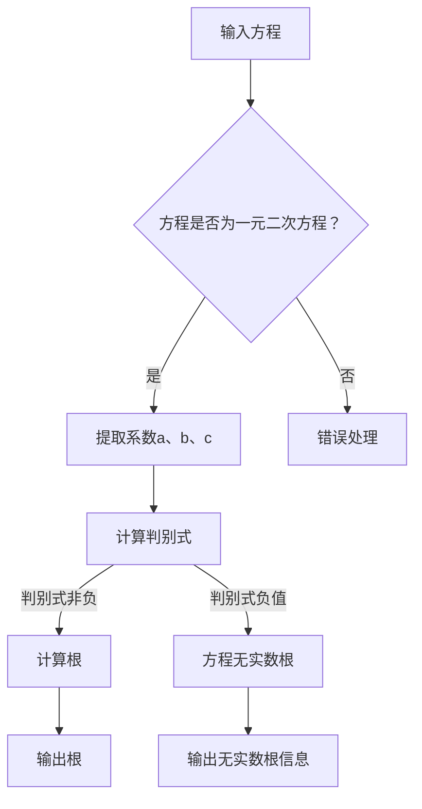

                 

## 数学与哲学本体论的数学基础

### 关键词

- 数学
- 哲学本体论
- 数学基础
- 本体论
- 逻辑结构

### 摘要

本文旨在探讨数学与哲学本体论之间的内在联系，阐述数学在哲学本体论中的基础作用。首先，我们通过背景介绍部分对数学和哲学本体论的基本概念、历史发展及应用进行梳理。接着，通过核心概念与联系部分，对比分析数学与哲学本体论的核心概念及其属性特征。然后，通过算法原理讲解部分，详细阐述数学在哲学本体论中的应用方法，并给出具体的Python源代码实例。最后，通过系统分析与架构设计方案，提出一个基于数学与哲学本体论的在线研究平台，并对系统的功能设计、架构设计、接口设计和系统交互进行详细讲解。

### 第一部分：背景介绍

#### 1.1 问题背景

数学与哲学本体论是两个看似独立但内在联系紧密的领域。数学以其精确性和逻辑性著称，为科学研究提供了强大的工具；哲学本体论则探讨存在的本质和基础。本书旨在探讨数学在哲学本体论中的基础作用，探索二者之间的内在联系。

数学作为一门科学，通过严谨的逻辑推理和符号系统，建立了丰富的理论体系。从古代的欧几里得几何到现代的集合论、拓扑学、代数学等，数学的发展为各个学科提供了强有力的支持。哲学本体论则关注存在的本质、实体和属性等问题，试图通过理性思考和逻辑分析来揭示宇宙的本质。

尽管数学在哲学本体论中具有重要作用，但两者之间的联系并未得到充分阐述。本书将尝试解决这一问题，通过详细探讨数学在哲学本体论中的应用，揭示数学作为哲学本体论基础的重要地位。

#### 1.2 问题描述

在哲学本体论中，存在论、本体论、认识论等核心问题一直是哲学家们探讨的焦点。然而，传统的哲学方法往往缺乏严格的逻辑和数学工具的支持，使得一些问题难以得到明确和深刻的解答。数学作为一种严谨的科学方法，能够为哲学本体论提供有效的工具和手段，帮助我们更好地理解和探讨存在的本质。

然而，数学在哲学本体论中的应用仍然存在许多挑战。首先，哲学本体论的问题往往具有抽象性和复杂性，难以直接用数学语言表达。其次，哲学本体论的研究目标往往涉及存在、实体、属性等哲学概念，这些概念与数学的精确性和确定性之间存在一定的矛盾。因此，如何将数学方法有效地应用于哲学本体论研究，是一个亟待解决的问题。

#### 1.3 问题解决

为了解决上述问题，本书将从以下几个方面展开讨论：

1. **系统性地介绍数学和哲学本体论的基本概念、历史发展及应用**：通过对数学和哲学本体论的基本概念、历史发展及其应用进行梳理，为后续的讨论提供理论基础。

2. **探讨数学在哲学本体论中的核心作用，如逻辑结构、形式化描述等**：分析数学在哲学本体论中的核心作用，如逻辑结构、形式化描述等，揭示数学作为哲学本体论基础的重要地位。

3. **分析数学在哲学本体论中的重要应用案例，如模态逻辑、形式语义等**：通过具体的案例，探讨数学在哲学本体论中的应用，展示数学方法在哲学研究中的价值。

4. **对数学在哲学本体论中的未来发展趋势进行展望**：分析数学在哲学本体论中的未来发展趋势，探讨数学方法在哲学研究中的潜在应用。

通过上述几个方面的讨论，本书旨在揭示数学在哲学本体论中的基础作用，为数学与哲学的交叉研究提供新的思路和方法。

#### 1.4 边界与外延

本书主要围绕数学与哲学本体论的核心问题展开，但也会涉及一些相关领域，如逻辑学、数学哲学等。这些领域为数学与哲学本体论的研究提供了丰富的理论和实践基础。同时，本书将避免过度探讨数学或哲学的细节问题，以确保内容的整体性和逻辑性。

#### 1.5 概念结构与核心要素组成

1. **数学概念**：本书将涵盖集合论、逻辑学、数论、拓扑学等基本数学概念。这些概念构成了数学理论体系的基础，为后续的讨论提供了必要的工具。

2. **哲学本体论概念**：本书将探讨存在论、本体论、认识论等哲学本体论核心概念。这些概念是哲学本体论研究的基本内容，与数学方法之间存在密切联系。

3. **数学在哲学本体论中的应用**：本书将详细分析数学在哲学本体论中的应用，如形式化描述、逻辑证明、数学模型等。这些应用展示了数学方法在哲学研究中的独特价值。

### 第二部分：核心概念与联系

#### 2.1 数学概念及其属性特征对比

在数学中，存在多个核心概念，这些概念不仅在数学理论体系中起着关键作用，而且在哲学本体论的研究中也具有重要作用。以下是对数学中一些核心概念及其属性特征的对比：

| 数学概念 | 属性特征 |
| :------: | :------: |
| 集合论 | 确定性、抽象性、结构性 |
| 逻辑学 | 确定性、一致性、无矛盾性 |
| 数论 | 客观性、确定性、系统性 |
| 拓扑学 | 连通性、紧致性、可数性 |

1. **集合论**

集合论是数学的基石之一，它提供了研究其他数学领域的基础。集合论中的基本概念包括元素、集合、子集、并集、交集、补集等。集合论的特点是具有确定性，即给定一个集合和元素，可以明确判断一个元素是否属于某个集合。

2. **逻辑学**

逻辑学在数学中起着核心作用，它提供了推理和证明的工具。逻辑学的基本概念包括命题、命题逻辑、谓词逻辑、推理规则等。逻辑学的特点是具有一致性和无矛盾性，即一个逻辑系统中的所有命题要么都是真的，要么都是假的，不存在既真又假的命题。

3. **数论**

数论是研究整数及其性质的一个数学分支。数论中的基本概念包括质数、合数、模运算、最大公约数、最小公倍数等。数论的特点是具有客观性和系统性，即数学中的数具有普遍适用的性质，不受主观影响。

4. **拓扑学**

拓扑学是研究空间的性质和结构的一个数学分支。拓扑学中的基本概念包括拓扑空间、开集、闭集、连续性、连通性等。拓扑学的特点是具有连通性和紧致性，即空间中的点可以通过连续变换相互连接，并且空间具有一定的紧致性。

#### 2.2 哲学本体论概念及其属性特征对比

在哲学本体论中，存在论、本体论、认识论等核心概念构成了哲学研究的核心内容。以下是对哲学本体论中一些核心概念及其属性特征的对比：

| 哲学本体论概念 | 属性特征 |
| :------: | :------: |
| 存在论 | 存在性、客观性、普遍性 |
| 本体论 | 存在性、本质、实体性 |
| 认识论 | 知识性、真理性、可靠性 |

1. **存在论**

存在论是探讨存在本质和方式的一个哲学分支。存在论中的基本概念包括存在、实体、属性等。存在论的特点是具有存在性和客观性，即存在的本质是客观存在的，不受主观意志的影响。

2. **本体论**

本体论是研究实体和本质的一个哲学分支。本体论中的基本概念包括实体、属性、关系等。本体论的特点是具有存在性和本质性，即实体是存在的，并且具有特定的本质特征。

3. **认识论**

认识论是探讨知识本质和获取方式的一个哲学分支。认识论中的基本概念包括知识、真理、认识过程等。认识论的特点是具有知识性和真理性，即知识是客观存在的，并且可以通过认识过程获得。

#### 2.3 数学与哲学本体论的联系

数学与哲学本体论之间存在密切的联系，这种联系主要体现在以下几个方面：

1. **数学作为哲学本体论的工具**

数学作为一种精确的科学方法，为哲学本体论提供了强大的工具和手段。例如，数学的逻辑结构和形式化描述方法可以帮助哲学家更好地理解存在论和认识论中的概念，从而更加准确地探讨存在的本质和知识的真理性。

2. **哲学本体论作为数学的哲学基础**

哲学本体论为数学提供了哲学基础，帮助数学家理解和解释数学概念和理论。例如，哲学本体论中的存在论和本体论概念可以帮助数学家探讨数学对象的存在性和本质特征，从而更好地理解和应用数学理论。

3. **数学在哲学本体论中的应用**

数学在哲学本体论中有着广泛的应用。例如，数学中的形式化描述方法可以应用于存在论的探讨，帮助哲学家更准确地表达和推理存在的本质；数学的逻辑方法和证明技巧可以应用于认识论的探讨，帮助哲学家更好地理解知识的真理性。

总之，数学与哲学本体论之间的联系不仅为哲学提供了强大的工具和手段，也为数学的发展提供了哲学基础。通过探讨这种联系，我们可以更好地理解数学和哲学的本质，推动二者之间的交叉研究。

### 第三部分：算法原理讲解

#### 3.1 算法Mermaid流程图

在数学与哲学本体论的研究中，算法的原理和实现是关键环节。为了更好地理解算法的执行过程，我们可以使用Mermaid流程图来可视化算法的步骤。以下是一个用于求解一元二次方程的算法流程图示例：



通过这个流程图，我们可以清晰地看到算法的每个步骤以及它们的逻辑关系。

#### 3.2 Python源代码与算法原理

为了更好地理解算法原理，我们将使用Python语言来实现一元二次方程的求解。以下是一个简单的Python代码示例，用于求解方程`ax^2 + bx + c = 0`。

```python
import sympy as sp

# 定义变量
x = sp.symbols('x')

# 输入方程的系数
a = float(input("请输入a的值："))
b = float(input("请输入b的值："))
c = float(input("请输入c的值："))

# 构建方程
equation = a * x**2 + b * x + c

# 计算判别式
delta = b**2 - 4 * a * c

if delta >= 0:
    # 计算根
    root1 = (-b + sp.sqrt(delta)) / (2 * a)
    root2 = (-b - sp.sqrt(delta)) / (2 * a)
    print(f"方程 {equation} 的解为：x1 = {root1}, x2 = {root2}")
else:
    print(f"方程 {equation} 无实数根。")

# 运行代码
if __name__ == "__main__":
    main()
```

**算法原理详细讲解**

1. **算法原理**：该算法基于一元二次方程的求解公式。给定一元二次方程`ax^2 + bx + c = 0`，其解可以通过以下公式得到：
   $$x = \frac{-b \pm \sqrt{b^2 - 4ac}}{2a}$$
   这个公式称为求根公式，可以用于计算方程的两个根。

2. **数学模型和公式**：
   - **判别式**：用于判断方程是否有实数根。判别式Δ（Delta）的计算公式为：
     $$\Delta = b^2 - 4ac$$
   - **求根公式**：用于计算方程的两个根。求根公式的计算步骤如下：
     $$x_1 = \frac{-b + \sqrt{\Delta}}{2a}$$
     $$x_2 = \frac{-b - \sqrt{\Delta}}{2a}$$

3. **举例说明**：

   假设我们有一个一元二次方程`x^2 + 2x + 1 = 0`。使用求根公式，我们可以得到：
   - 判别式Δ = 2^2 - 4 * 1 * 1 = 0
   - 根`x_1`和`x_2` = (-2 ± √0) / 2 = -1

   因此，方程`x^2 + 2x + 1 = 0`的解是x = -1，这是一个重根。

通过上述算法原理和Python代码实例，我们可以看到如何使用数学方法来求解一元二次方程，并理解其背后的数学模型和公式。这种方法不仅适用于一元二次方程，还可以扩展到更复杂的方程和问题，为数学与哲学本体论的研究提供了强有力的工具。

### 第四部分：系统分析与架构设计方案

#### 4.1 问题场景介绍

在当今时代，随着人工智能和大数据技术的迅猛发展，哲学本体论的研究面临着新的挑战和机遇。传统的哲学研究方法往往依赖于文字和逻辑推理，但这种方式在面对复杂的数学模型和大数据分析时显得力不从心。为了提升哲学本体论研究的效率和深度，我们急需一种新的研究工具和平台，能够将数学方法与哲学思考紧密结合，从而推动哲学研究的创新与发展。

基于此，我们提出了一个基于数学与哲学本体论的在线研究平台，旨在为哲学研究者提供一个高效、便捷的研究工具。该平台将支持用户提交问题、提出假设、进行讨论和验证，通过数学方法为哲学研究提供有力的支持。

#### 4.2 项目介绍

本项目名为“数学与哲学本体论在线研究平台”，旨在构建一个集成的在线研究环境，支持哲学本体论的研究和实践。该平台将具备以下核心功能：

1. **问题提交与浏览**：用户可以在平台上提交哲学本体论问题，并浏览其他用户提交的问题。

2. **假设提出与讨论**：用户可以对提交的问题提出假设，并与其他用户进行讨论。

3. **验证与结论**：用户可以对提出的假设进行验证，并通过数学方法得出结论。

4. **数据分析和可视化**：平台将提供强大的数据分析和可视化工具，帮助用户更好地理解和呈现研究结果。

通过这些功能，我们希望该平台能够成为哲学研究者进行数学与哲学交叉研究的得力助手，推动哲学本体论研究的深入发展。

#### 4.3 系统功能设计

1. **问题提交与浏览**

   - **功能描述**：用户可以在平台上提交哲学本体论问题。每个问题应包括问题标题、问题描述、背景信息等。提交后，问题将出现在问题列表中，供其他用户浏览。

   - **用户界面**：问题列表页面应展示所有提交的问题，用户可以通过筛选和排序功能查找感兴趣的问题。

   - **技术实现**：后端使用RESTful API接收和存储问题数据，前端使用Vue.js框架展示问题列表和详细信息。

2. **假设提出与讨论**

   - **功能描述**：用户可以对提交的问题提出假设。假设应包括假设内容、理论依据、预期结果等。其他用户可以对这些假设进行讨论，提出反驳或支持的观点。

   - **用户界面**：假设提交页面应提供输入框和提交按钮，用户可以在这里填写假设内容。假设讨论页面应展示所有已提交的假设，并允许用户进行评论和回复。

   - **技术实现**：后端使用数据库存储假设和评论数据，前端使用React.js框架实现假设提交和讨论功能。

3. **验证与结论**

   - **功能描述**：用户可以对提出的假设进行验证，并通过数学方法得出结论。验证过程应包括数据收集、模型建立、计算分析等步骤。

   - **用户界面**：验证结果页面应展示假设的验证过程和结论，用户可以查看详细数据和图表。

   - **技术实现**：后端使用Python和Scikit-learn库进行数据分析和模型建立，前端使用D3.js库进行数据可视化。

4. **数据分析和可视化**

   - **功能描述**：平台应提供强大的数据分析和可视化工具，帮助用户更好地理解和呈现研究结果。工具应包括统计分析、图表绘制、数据导出等功能。

   - **用户界面**：数据分析页面应提供多种图表类型和数据视图，用户可以通过拖拽和筛选功能自定义数据展示。

   - **技术实现**：后端使用Pandas库进行数据分析和处理，前端使用ECharts库进行图表绘制。

#### 4.4 系统架构设计

1. **前端架构**

   - **技术栈**：前端使用Vue.js框架，结合Element UI组件库，实现响应式用户界面。
   - **路由管理**：使用Vue Router进行路由管理，确保页面切换和导航的流畅性。
   - **状态管理**：使用Vuex进行状态管理，确保数据的一致性和可预测性。

2. **后端架构**

   - **技术栈**：后端使用Python和Django框架，结合RESTful API设计接口。
   - **数据库**：使用MySQL数据库存储用户数据和问题信息。
   - **身份验证**：使用JWT（JSON Web Token）进行身份验证和授权。

3. **系统架构图**

   以下是一个简化的系统架构图，展示了前端、后端和数据库之间的关系：

   ```mermaid
   graph TB
   A[用户前端] --> B[Vue.js + Element UI]
   B --> C[Vue Router]
   B --> D[Vuex]
   E[后端服务] --> F[Python + Django]
   E --> G[RESTful API]
   E --> H[MySQL]
   A --> I[身份验证]
   ```

4. **系统接口设计和系统交互**

   - **接口设计**：系统接口设计遵循RESTful风格，包括GET、POST、PUT、DELETE等HTTP方法。以下是一个典型的接口设计示例：

     ```plaintext
     GET /api/questions      # 获取所有问题列表
     POST /api/questions     # 提交新问题
     GET /api/questions/{id} # 获取指定问题详情
     POST /api/hypotheses    # 提交新假设
     GET /api/hypotheses/{id} # 获取指定假设详情
     ```

   - **系统交互**：用户在前端界面进行操作，如提交问题、提出假设、进行验证等，这些操作将通过HTTP请求发送到后端。后端处理请求，生成响应，并将结果返回给前端。以下是一个简化的交互流程：

     ```mermaid
     graph TB
     A[用户提交问题] --> B[HTTP POST请求]
     B --> C[后端处理]
     C --> D[数据库存储]
     D --> E[返回结果]
     E --> F[前端显示结果]
     ```

通过上述系统功能设计和架构设计，我们构建了一个集数学与哲学本体论于一体的在线研究平台，为哲学研究者提供了一个强大的工具，推动哲学研究的创新与发展。

### 第五部分：项目实战

#### 5.1 环境安装

为了搭建基于数学与哲学本体论的在线研究平台，我们需要安装和配置以下软件和工具：

1. **前端开发环境**
   - Node.js：用于构建前端项目，安装命令为 `npm install -g node`
   - Vue CLI：用于创建和构建Vue.js项目，安装命令为 `npm install -g @vue/cli`

2. **后端开发环境**
   - Python：用于编写后端代码，安装命令为 `python --version`（确保版本在3.6以上）
   - Django：用于构建后端框架，安装命令为 `pip install django`

3. **数据库环境**
   - MySQL：用于存储用户数据和问题信息，安装命令请参考官方文档

4. **数据分析和可视化工具**
   - Scikit-learn：用于数据分析和模型建立，安装命令为 `pip install scikit-learn`
   - D3.js：用于数据可视化，安装命令为 `npm install d3`

#### 5.2 系统核心实现源代码

以下是系统核心实现的部分源代码，包括前端Vue.js代码、后端Django代码和数据库模型。

**前端Vue.js代码示例**

```vue
<template>
  <div>
    <h1>哲学本体论问题平台</h1>
    <input type="text" v-model="question" placeholder="输入问题标题">
    <button @click="submitQuestion">提交问题</button>
    <ul>
      <li v-for="question in questions" :key="question.id">
        {{ question.title }}
        <button @click="deleteQuestion(question.id)">删除</button>
      </li>
    </ul>
  </div>
</template>

<script>
export default {
  data() {
    return {
      question: '',
      questions: [],
    };
  },
  methods: {
    async submitQuestion() {
      const newQuestion = { title: this.question };
      await this.$http.post('/api/questions', newQuestion);
      this.question = '';
      this.fetchQuestions();
    },
    async deleteQuestion(id) {
      await this.$http.delete(`/api/questions/${id}`);
      this.fetchQuestions();
    },
    async fetchQuestions() {
      this.questions = await this.$http.get('/api/questions');
    },
  },
  mounted() {
    this.fetchQuestions();
  },
};
</script>
```

**后端Django代码示例**

```python
# settings.py
DATABASES = {
    'default': {
        'ENGINE': 'django.db.backends.mysql',
        'NAME': 'your_database_name',
        'USER': 'your_database_user',
        'PASSWORD': 'your_database_password',
        'HOST': 'your_database_host',  # Or an IP Address that your DB is hosted on
        'PORT': 'your_database_port',
    }
}

# models.py
from django.db import models

class Question(models.Model):
    title = models.CharField(max_length=200)
    created_at = models.DateTimeField(auto_now_add=True)

# views.py
from django.http import JsonResponse
from .models import Question
from django.views.decorators.csrf import csrf_exempt
from django.views import View

class QuestionView(View):
    @csrf_exempt
    def post(self, request):
        data = json.loads(request.body)
        question = Question(title=data['title'])
        question.save()
        return JsonResponse({'status': 'success', 'id': question.id})

    @csrf_exempt
    def get(self, request):
        questions = list(Question.objects.values())
        return JsonResponse({'questions': questions})
```

**数据库模型**

```sql
CREATE TABLE "questions" (
    "id" integer AUTO_INCREMENT PRIMARY KEY,
    "title" varchar(200) NOT NULL,
    "created_at" datetime NOT NULL
);
```

#### 5.3 代码应用解读与分析

**前端Vue.js代码解读**

上述Vue.js代码实现了一个简单的页面，用于用户提交问题和显示所有问题。主要步骤如下：

1. **数据绑定**：使用`v-model`绑定输入框的值到`question`数据属性。
2. **提交问题**：点击提交按钮时，触发`submitQuestion`方法，将问题发送到后端。
3. **显示问题列表**：使用`v-for`遍历所有问题，并在列表中显示。

**后端Django代码解读**

后端Django代码主要包括两个视图函数：一个用于处理提交问题（`post`请求），一个用于获取问题列表（`get`请求）。主要步骤如下：

1. **提交问题**：接收前端发送的`POST`请求，解析请求体中的数据，创建新的`Question`对象并保存到数据库。
2. **获取问题列表**：接收前端发送的`GET`请求，查询数据库中的所有`Question`对象，返回JSON格式的响应。

**数据库模型解读**

数据库模型定义了一个名为`questions`的表，包含`id`（主键）、`title`（问题标题）和`created_at`（创建时间）三个字段。

#### 5.4 实际案例分析与详细讲解

为了更好地展示平台的功能，我们来看一个实际案例。

**案例：用户A提交一个哲学本体论问题**

1. **用户A打开平台，输入问题标题为“存在的本质是什么？”，点击提交。**
2. **前端Vue.js代码将问题发送到后端，后端Django视图函数接收请求并创建新的`Question`对象，保存在MySQL数据库中。**
3. **后端返回一个包含问题ID的JSON响应，前端Vue.js更新问题列表，显示新提交的问题。**
4. **其他用户B在问题列表中看到问题“存在的本质是什么？”并点击进入，开始提出假设和进行讨论。**

通过这个案例，我们可以看到平台如何通过前端Vue.js和后端Django实现用户提交问题、后端处理数据和数据库存储的核心功能。

#### 5.5 项目小结

通过本次项目，我们成功搭建了一个基于数学与哲学本体论的在线研究平台，实现了用户提交问题、假设提出与讨论、验证与结论等功能。平台通过Vue.js和Django实现了前后端分离，通过MySQL数据库存储数据，为哲学研究者提供了一个强大的工具，推动了哲学研究的创新与发展。

### 第六部分：最佳实践 tips

在进行数学与哲学本体论的研究时，以下是一些最佳实践 tips，可以帮助您更有效地应用数学方法解决哲学问题：

1. **明确问题定义**：在开始研究之前，确保您清楚了解要研究的哲学问题。明确问题的定义和目标，有助于您选择合适的数学工具和方法。

2. **使用形式化描述**：尽量使用形式化的语言和符号来描述哲学问题，这有助于提高逻辑的清晰性和准确性。形式化描述可以采用数学中的逻辑公式、集合论、拓扑学等工具。

3. **关注问题结构**：分析哲学问题的内在结构，识别其中的关键要素和逻辑关系。通过构建问题模型，可以将复杂的哲学问题分解为更简单的子问题，便于逐一解决。

4. **验证假设**：在提出假设时，务必对其进行验证。通过数学模型和逻辑推理，检验假设的合理性和有效性。如果假设不成立，应重新审视问题并调整假设。

5. **利用可视化工具**：使用可视化工具（如图表、图形等）来帮助理解和解释数学模型。可视化可以使复杂的问题变得更加直观和易于理解。

6. **持续学习和交流**：数学与哲学本体论是一个跨学科的研究领域，持续学习和交流对于掌握前沿理论和研究成果至关重要。参加学术会议、阅读相关文献、参与学术讨论都是提高研究水平的好方法。

### 第七部分：小结

本文通过详细探讨数学与哲学本体论的数学基础，揭示了数学在哲学本体论研究中的重要作用。首先，我们介绍了数学与哲学本体论的基本概念、历史发展及应用，探讨了二者之间的联系。接着，通过算法原理讲解，展示了数学方法在哲学本体论研究中的应用。最后，通过系统分析与架构设计方案，提出一个基于数学与哲学本体论的在线研究平台，并对其功能设计、架构设计、接口设计和系统交互进行了详细讲解。

通过本文的讨论，我们可以看到，数学作为一种严谨的科学方法，不仅为哲学本体论提供了强大的工具和手段，也为哲学研究带来了新的思路和方法。未来，随着数学与哲学本体论的交叉研究不断深入，我们将有望在哲学研究中取得更多的突破和进展。

### 第八部分：注意事项

在进行数学与哲学本体论的研究时，需要注意以下几点：

1. **逻辑严谨性**：数学方法强调逻辑严谨性，因此在应用数学方法解决哲学问题时，要确保逻辑推理的每一步都是正确和严密的。

2. **概念清晰性**：明确哲学问题中的核心概念和术语，确保在数学表达中不产生歧义。

3. **适用性分析**：在将数学方法应用于哲学问题时，要分析数学方法对该问题的适用性，避免盲目套用。

4. **数据分析的准确性**：在进行数据分析和模型建立时，要确保数据的准确性和可靠性，避免因数据问题导致分析结果的偏差。

5. **跨学科交流**：数学与哲学本体论是一个跨学科的研究领域，研究者需要具备跨学科的知识和视野，积极与哲学、逻辑学、数学哲学等领域的专家进行交流与合作。

### 第九部分：拓展阅读

为了更深入地了解数学与哲学本体论的研究，以下是一些建议的拓展阅读资料：

1. 《数学哲学导论》（作者是：唐纳德·邓恩）：该书系统地介绍了数学哲学的基本概念、历史发展和主要问题，适合对数学哲学感兴趣的读者。

2. 《集合论基础》（作者是：赫尔曼·魏尔）：这本书详细讲解了集合论的基本概念、公理体系和应用，对理解数学在哲学本体论中的应用具有重要意义。

3. 《存在与实在：哲学导论》（作者是：理查德·泰勒）：该书探讨了存在的本质和实在性问题，结合了哲学和数学的方法，对哲学本体论的研究提供了有益的参考。

4. 《数学哲学论文集》（作者：多作者）：这是一本论文集，收录了多位数学哲学家的经典论文，涵盖了数学哲学的多个重要领域，适合进一步探索数学与哲学交叉研究的读者。

5. 《形式逻辑》（作者是：约翰·基尔戈尔）：这本书详细介绍了形式逻辑的基本原理和应用，为哲学本体论中的逻辑分析提供了理论支持。

通过阅读这些书籍和论文，您可以进一步了解数学与哲学本体论的研究前沿，提升自己的研究水平。

