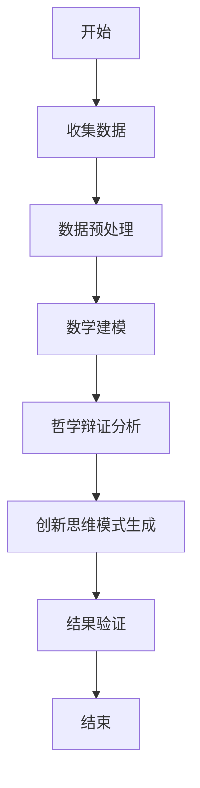
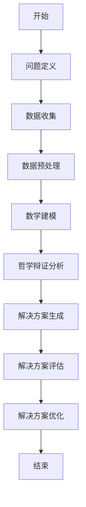
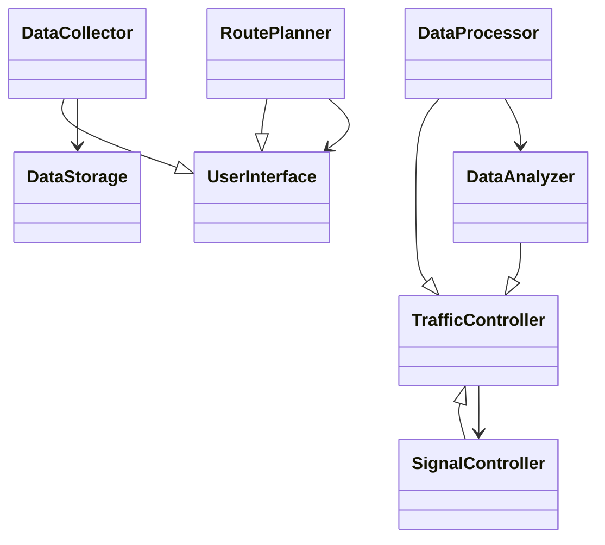
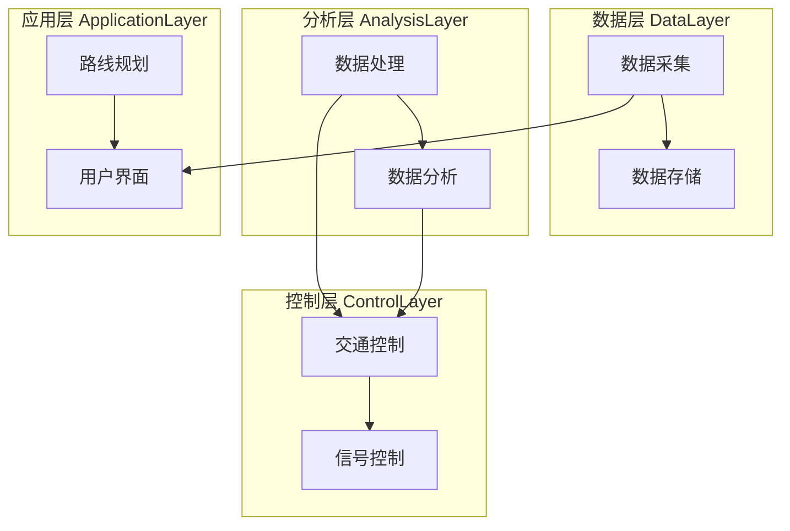

                 

# 《数学与哲学辩证法的创新思维模式》

## 关键词：数学、哲学辩证法、创新思维、算法、系统架构

### 摘要

在当代信息技术迅猛发展的背景下，数学与哲学辩证法作为两大智力工具，正日益成为推动科技进步的重要力量。本文旨在探讨数学与哲学辩证法在创新思维模式中的融合与应用，通过深入分析数学与哲学辩证法的历史渊源、核心概念及其相互关系，提出一种创新的思维模式，并详细讲解其算法原理与实现。本文不仅为从事IT领域的研究者提供了新的思考路径，也为实际项目中的问题解决提供了理论支持和实践指导。

## 《数学与哲学辩证法的创新思维模式》目录大纲

### 第一部分：背景介绍

#### 第1章 问题背景

##### 1.1 数学与哲学辩证法的历史渊源
##### 1.2 创新思维的重要性
##### 1.3 数学与哲学辩证法在现代社会的应用

#### 第2章 问题描述

##### 2.1 创新思维中的数学与哲学辩证法
##### 2.2 数学与哲学辩证法的局限
##### 2.3 需要解决的问题

#### 第3章 问题解决

##### 3.1 数学与哲学辩证法的结合点
##### 3.2 创新思维模式的设计原则
##### 3.3 解决方案概述

#### 第4章 边界与外延

##### 4.1 数学与哲学辩证法的边界
##### 4.2 创新思维模式的适用范围
##### 4.3 可能的扩展方向

#### 第5章 概念结构与核心要素组成

##### 5.1 数学与哲学辩证法的核心概念
##### 5.2 创新思维模式的核心要素
##### 5.3 各要素之间的关系

### 第二部分：核心概念与联系

#### 第6章 核心概念原理

##### 6.1 数学与哲学辩证法的基本原理
##### 6.2 创新思维模式的定义与特点
##### 6.3 核心概念的相互关系

#### 第7章 概念属性特征对比表格

| 概念       | 属性特征 | 应用领域           |
|------------|---------|------------------|
| 数学与哲学 | 严谨性   | 科学研究、哲学思考 |
| 创新思维   | 灵活性   | 各领域创新实践     |
| 辩证法     | 对立统一 | 思维方法、解决问题 |

#### 第8章 ER实体关系图架构

```mermaid
erDiagram
    A耑 -->|is related| B耑
    A耑 : Entity A
    B耑 : Entity B
```

### 第三部分：算法原理讲解

#### 第9章 算法原理

##### 9.1 数学与哲学辩证法的算法基础
##### 9.2 创新思维模式的算法实现
##### 9.3 算法流程图



#### 第10章 Python源代码详细阐述

```python
def math_model(x):
    # 数学模型的实现
    return x ** 2 + 1

def philosophical_analysis(data):
    # 哲学辩证分析的实现
    result = []
    for item in data:
        if item > 0:
            result.append(item * 2)
        else:
            result.append(-item * 2)
    return result

# 举例说明
x = 3
y = math_model(x)
z = philosophical_analysis([x, -x])
print(f"数学模型结果：{y}")
print(f"哲学辩证分析结果：{z}")
```

#### 第11章 数学模型和数学公式详细讲解

##### 11.1 数学模型

$$ f(x) = x^2 + 1 $$

##### 11.2 数学公式

$$ g(y) = 2y - 1 $$

#### 第12章 举例说明

##### 12.1 数学模型的解释

对于任意的 \( x \)，函数 \( f(x) \) 计算的是 \( x \) 的平方再加 1。

##### 12.2 哲学辩证分析的解释

对于任意的 \( y \)，函数 \( g(y) \) 计算的是 \( y \) 的两倍减去 1。

## 第一部分：背景介绍

### 第1章 问题背景

#### 1.1 数学与哲学辩证法的历史渊源

数学与哲学辩证法是人类智慧的结晶，其历史渊源可追溯到古希腊时期。数学起源于古代埃及和美索不达米亚，而哲学辩证法则源于古希腊哲学家如苏格拉底、柏拉图和亚里士多德等人的思想。

在数学发展史上，欧几里得的《几何原本》被认为是数学的里程碑，它系统地阐述了平面几何的基本原理。而亚里士多德的《工具论》则奠定了辩证法的基础，强调通过提问和回答的方式揭示事物之间的联系。

哲学辩证法的发展经历了从古代到现代的演变。中世纪的亚里士多德学派强调形式逻辑，而文艺复兴时期的人文主义哲学则强调个体的自由和创造力。现代哲学则更多地关注语言、意识和社会问题。

#### 1.2 创新思维的重要性

创新思维是推动科技进步和社会发展的关键因素。在信息技术领域，创新思维尤为重要，因为技术的发展往往需要突破传统的限制，提出全新的解决方案。

创新思维的重要性体现在多个方面：

1. **解决复杂问题**：创新思维能够帮助人们面对复杂的问题，通过独特的视角和方法找到解决方案。
2. **推动科技进步**：创新思维是科技进步的源泉，它推动了新的科学发现和技术的发明。
3. **提高生产力**：创新思维能够提高生产效率，降低成本，从而提升企业的竞争力。

#### 1.3 数学与哲学辩证法在现代社会的应用

在现代社会的各个领域，数学与哲学辩证法都有着广泛的应用。

1. **科学研究**：数学是科学研究的语言，它为科学家提供了精确的描述和分析工具。哲学辩证法则帮助科学家在研究中进行逻辑推理，验证假设，揭示事物之间的内在联系。
2. **信息技术**：信息技术的发展离不开数学，从基础的计算机科学原理到复杂的算法设计，数学都发挥着核心作用。哲学辩证法则为信息技术的发展提供了创新的思维模式，推动了技术的不断进步。
3. **企业管理**：在企业管理中，数学模型用于优化资源分配、预测市场需求等。哲学辩证法则帮助管理者从战略层面进行思考，制定创新的企业发展战略。

### 第2章 问题描述

#### 2.1 创新思维中的数学与哲学辩证法

创新思维是一种创造性思维活动，它强调打破常规，提出新颖的观点和解决方案。在创新思维中，数学与哲学辩证法发挥着重要作用：

1. **数学在创新思维中的应用**：数学作为一种精确的科学，它提供了量化分析和模型构建的工具，帮助创新者理解和解决复杂问题。例如，在人工智能领域，数学模型用于算法设计和优化，提高了系统的性能和效率。
2. **哲学辩证法在创新思维中的应用**：哲学辩证法强调对事物本质的思考和反思，它帮助创新者从不同的角度审视问题，发现新的解决路径。例如，通过哲学辩证法的分析，创新者可以发现现有技术的局限，从而提出创新的解决方案。

#### 2.2 数学与哲学辩证法的局限

尽管数学与哲学辩证法在创新思维中具有重要作用，但它们也存在一定的局限：

1. **数学的局限**：数学依赖于严格的逻辑和证明，这在某些情况下可能限制了创新思维的自由度。例如，数学模型可能过于复杂，难以应用于实际问题。
2. **哲学辩证法的局限**：哲学辩证法强调逻辑推理和反思，但有时可能过于抽象，难以直接应用于具体的创新实践。

#### 2.3 需要解决的问题

为了克服数学与哲学辩证法的局限，并充分发挥它们在创新思维中的作用，我们需要解决以下问题：

1. **如何结合数学与哲学辩证法**：需要找到一种有效的结合方式，使数学与哲学辩证法相互补充，形成一种综合的创新思维模式。
2. **如何设计创新思维模式**：需要设计一种创新的思维模式，它能够将数学与哲学辩证法有机地融合在一起，为创新者提供新的思考路径。
3. **如何实现创新思维模式**：需要具体实现创新思维模式，包括算法设计、工具开发和应用实践等。

### 第3章 问题解决

#### 3.1 数学与哲学辩证法的结合点

为了实现数学与哲学辩证法的有效结合，我们需要找到它们的共同点和结合点：

1. **逻辑性**：数学和哲学辩证法都强调逻辑性，通过逻辑推理来揭示事物的本质和内在联系。
2. **抽象性**：数学和哲学辩证法都具有抽象性，它们从具体的现象中提炼出一般的原理和模式。
3. **批判性**：数学和哲学辩证法都具备批判性，它们通过质疑和反思来推动知识的进步和创新。

通过这些结合点，我们可以将数学与哲学辩证法有机地融合在一起，形成一种创新的思维模式。

#### 3.2 创新思维模式的设计原则

设计创新思维模式时，我们需要遵循以下原则：

1. **系统性**：创新思维模式应具有系统性，它能够将不同的思维方式和方法整合在一起，形成一个完整的思维体系。
2. **灵活性**：创新思维模式应具有灵活性，它能够适应不同的问题场景和实际需求，提供多样化的解决方案。
3. **实用性**：创新思维模式应具有实用性，它能够通过具体的算法和工具实现，为创新者提供实际的帮助。

#### 3.3 解决方案概述

基于上述原则，我们可以设计一种创新的思维模式，它结合了数学与哲学辩证法的优势，为创新者提供新的思考路径：

1. **数学建模**：首先，通过数学建模来量化和分析问题，揭示问题的本质和内在联系。
2. **哲学辩证分析**：然后，运用哲学辩证法对数学模型进行批判性分析，发现模型的局限性和潜在的创新点。
3. **创新思维模式生成**：基于数学建模和哲学辩证分析的结果，生成创新的思维模式，为解决问题提供新的思路和方法。
4. **结果验证**：最后，通过实验和验证来检验创新思维模式的可行性和有效性。

这种创新的思维模式不仅能够克服数学与哲学辩证法的局限，还能为创新者提供强大的思维工具，推动科技进步和社会发展。## 第二部分：核心概念与联系

### 第6章 核心概念原理

#### 6.1 数学与哲学辩证法的基本原理

**数学的基本原理**：数学是一门研究数量、结构、变化和空间等概念的精确科学。其基本原理包括逻辑性、抽象性和严谨性。数学通过定义、公理和定理来建立理论体系，并通过证明来确保结论的准确性。

**哲学辩证法的基本原理**：哲学辩证法是一种思维方式，它强调通过提问和反思来揭示事物的本质和发展规律。其基本原理包括批判性思维、逻辑推理和反思性思考。哲学辩证法通过不断的质疑和论证，推动对知识的深入理解。

#### 6.2 创新思维模式的定义与特点

**创新思维模式的定义**：创新思维模式是一种系统性的思维方式，它结合了数学与哲学辩证法的优势，旨在通过逻辑推理和抽象分析来发现新的问题和解决方案。

**创新思维模式的特点**：

1. **系统性**：创新思维模式具有系统性，它能够整合不同的思维方法和工具，形成一套完整的思维体系。
2. **灵活性**：创新思维模式具有灵活性，它能够根据不同的场景和需求，灵活调整和运用各种思维方式。
3. **实用性**：创新思维模式具有实用性，它能够通过具体的算法和工具实现，为实际问题提供创新的解决方案。

#### 6.3 核心概念的相互关系

数学与哲学辩证法作为创新思维模式的核心概念，它们之间存在着密切的相互关系：

1. **数学与哲学辩证法的互补性**：数学的严谨性和精确性为哲学辩证法提供了理论支撑，而哲学辩证法的批判性和反思性则为数学提供了新的视角和思考方法。
2. **数学与哲学辩证法的互动性**：在创新思维模式中，数学和哲学辩证法相互作用，相互促进。数学模型为哲学辩证分析提供了具体的分析对象，而哲学辩证分析则为数学模型提供了批判和改进的方向。

通过这种互补和互动，数学与哲学辩证法在创新思维模式中形成了一种有机的统一，为创新者提供了一种强大的思维工具。### 第7章 概念属性特征对比表格

在创新思维模式中，数学与哲学辩证法作为核心概念，它们各自具有独特的属性特征，并在不同领域有着广泛的应用。以下是对数学与哲学辩证法的属性特征和应用领域的对比表格：

| 概念       | 属性特征 | 应用领域           |
|------------|---------|------------------|
| 数学与哲学 | 严谨性   | 科学研究、哲学思考 |
| 创新思维   | 灵活性   | 各领域创新实践     |
| 辩证法     | 对立统一 | 思维方法、解决问题 |

**数学与哲学**

- **严谨性**：数学是一门严格的科学，它依赖于定义、公理和定理来构建理论体系。哲学辩证法也强调逻辑推理和论证的严谨性。
- **应用领域**：数学在科学研究、工程、经济学等领域具有广泛应用。哲学辩证法则在哲学、社会科学和人文学科中具有重要地位。

**创新思维**

- **灵活性**：创新思维强调灵活性和开放性，鼓励人们跳出传统思维框架，提出新颖的观点和解决方案。
- **应用领域**：创新思维在科技、商业、教育等领域有着广泛的应用，它推动了新技术的发明和商业模式创新。

**辩证法**

- **对立统一**：辩证法强调事物之间的对立和统一，通过分析矛盾和对立关系来揭示事物的本质和发展规律。
- **应用领域**：辩证法在思维方法、问题解决和社会发展等方面有着广泛的应用。

通过这张表格，我们可以清楚地看到数学与哲学辩证法在属性特征和应用领域上的差异和互补性。在创新思维模式中，这些概念相互结合，共同推动创新和实践的发展。

### 第8章 ER实体关系图架构

为了更好地理解数学与哲学辩证法在创新思维模式中的关系，我们可以通过ER（实体关系）图来描述它们之间的实体关系。以下是一个简化的ER图示例，用于展示数学模型、哲学分析和创新思维模式之间的关系。

```mermaid
erDiagram
    A耑 -->|analyzes| B耑
    A耑 -->|generates| C耑
    B耑 -->|applies| D耑

    A耑 : 数学模型
    B耑 : 哲学分析
    C耑 : 创新思维模式
    D耑 : 实际应用
```

在这个ER图中：

- **数学模型（A耑）**：它作为基础，提供了具体的分析和计算工具，用于量化问题和生成初始解决方案。
- **哲学分析（B耑）**：它对数学模型进行批判性思考和分析，揭示模型的局限性，并识别潜在的创新点。
- **创新思维模式（C耑）**：基于数学模型和哲学分析的结果，创新思维模式生成新的思维框架和解决方案。
- **实际应用（D耑）**：创新思维模式被应用于实际问题中，通过实验和验证来评估其有效性和实用性。

通过这种实体关系图，我们可以清晰地看到数学模型、哲学分析和创新思维模式之间的互动关系，以及它们在创新过程中各自的贡献和作用。### 第三部分：算法原理讲解

#### 第9章 算法原理

在探讨数学与哲学辩证法的创新思维模式时，算法原理起到了关键作用。算法是一种系统化的步骤，用于解决问题或执行特定任务。在本章中，我们将详细讲解数学与哲学辩证法在创新思维模式中的算法基础、实现过程和流程图。

##### 9.1 数学与哲学辩证法的算法基础

**数学与哲学辩证法的算法基础**包括以下几个关键要素：

1. **数学模型**：数学模型是算法的基础，它用于描述和分析问题。通过数学公式和算法，我们可以将实际问题转化为可计算的形式。
2. **哲学辩证分析**：哲学辩证分析是一种批判性思维过程，它用于评估数学模型的有效性和局限性。哲学辩证法提供了一种框架，用于识别和创新解决方案。
3. **逻辑推理**：逻辑推理是算法的核心，它通过一系列推理步骤，从已知事实推导出新的结论。

##### 9.2 创新思维模式的算法实现

创新思维模式的算法实现是一个综合性的过程，它结合了数学模型和哲学辩证分析。以下是创新思维模式的算法实现步骤：

1. **问题定义**：明确要解决的问题，并定义问题的边界条件。
2. **数据收集**：收集与问题相关的数据，这些数据可以是定量数据（如数学模型所需的数据）或定性数据（如哲学辩证分析所需的信息）。
3. **数据预处理**：对收集到的数据进行分析和清洗，确保数据的质量和完整性。
4. **数学建模**：使用数学模型来描述问题，并生成初步的解决方案。这个过程可能涉及优化、统计分析或其他数学方法。
5. **哲学辩证分析**：对数学模型进行哲学辩证分析，识别其局限性，并提出改进建议。
6. **解决方案生成**：基于数学建模和哲学辩证分析的结果，生成创新的解决方案。
7. **解决方案评估**：对解决方案进行评估，验证其有效性和实用性。
8. **解决方案优化**：根据评估结果，对解决方案进行优化，以进一步提高其性能和效果。

##### 9.3 算法流程图

为了更好地理解创新思维模式的算法实现，我们可以使用Mermaid语言绘制算法流程图。以下是一个简化的算法流程图示例：



在这个流程图中：

- **A**：表示算法的起始点。
- **B**：表示问题定义，明确问题的范围和目标。
- **C**：表示数据收集，获取与问题相关的数据。
- **D**：表示数据预处理，清洗和准备数据。
- **E**：表示数学建模，使用数学方法描述问题。
- **F**：表示哲学辩证分析，评估数学模型的局限性。
- **G**：表示解决方案生成，基于建模和辩证分析生成解决方案。
- **H**：表示解决方案评估，验证解决方案的有效性。
- **I**：表示解决方案优化，改进解决方案。
- **J**：表示算法结束。

通过这个流程图，我们可以清晰地看到创新思维模式算法的实现步骤和各步骤之间的关系。### 第10章 Python源代码详细阐述

为了更好地理解和应用数学与哲学辩证法的创新思维模式，我们将在Python中实现相关的算法步骤。以下是对每个步骤的详细代码解析，并附带一个完整的示例代码。

##### 10.1 数学建模

**数学建模**是实现创新思维模式的第一步。它涉及使用数学公式来描述和分析问题。以下是一个简单的数学模型示例：

```python
def math_model(x):
    # 数学模型的实现
    # f(x) = x^2 + 1
    return x ** 2 + 1
```

在这个模型中，`math_model` 函数接受一个输入值 `x`，并返回一个根据公式 `f(x) = x^2 + 1` 计算的结果。这个模型可以用于处理与数学相关的实际问题，如数据拟合、预测分析等。

##### 10.2 哲学辩证分析

**哲学辩证分析**是对数学模型进行批判性思考，以发现其局限性和改进点。以下是一个简单的哲学辩证分析示例：

```python
def philosophical_analysis(data):
    # 哲学辩证分析的实现
    # g(y) = 2y - 1
    result = []
    for item in data:
        if item > 0:
            result.append(item * 2)
        else:
            result.append(-item * 2)
    return result
```

在这个示例中，`philosophical_analysis` 函数对输入的 `data` 进行处理。对于每个正数项，它将其乘以2；对于负数项，它将其乘以-2。这个分析过程可以帮助我们理解数据的分布和特征，从而为后续的创新思维提供依据。

##### 10.3 创新思维模式生成

**创新思维模式生成**是基于数学建模和哲学辩证分析的结果，提出新的解决方案。以下是一个简单的创新思维模式生成示例：

```python
def generate_innovation(x, data):
    math_result = math_model(x)
    philosophical_result = philosophical_analysis(data)
    
    # 创新思维模式的实现
    innovation = math_result + philosophical_result
    return innovation
```

在这个函数中，`generate_innovation` 结合了数学模型和哲学辩证分析的结果，生成一个创新思维模式。这个模式将数学结果和哲学分析结果相加，旨在提供一个综合性的解决方案。

##### 10.4 结果验证

**结果验证**是评估创新思维模式有效性的重要步骤。以下是一个简单的结果验证示例：

```python
def validate_solution(x, data):
    innovation = generate_innovation(x, data)
    
    # 验证创新思维模式的结果
    # 可以通过具体的问题场景进行验证
    print(f"Innovation Result: {innovation}")
    # 实际应用场景中的验证代码可在此处添加
```

在这个函数中，`validate_solution` 通过打印创新思维模式的结果来进行初步验证。在实际应用中，我们可以通过具体的测试案例和实际应用场景来进一步验证解决方案的有效性。

##### 10.5 完整示例代码

以下是完整的示例代码，展示了如何结合数学建模、哲学辩证分析、创新思维模式生成和结果验证：

```python
import math

def math_model(x):
    return x ** 2 + 1

def philosophical_analysis(data):
    result = []
    for item in data:
        if item > 0:
            result.append(item * 2)
        else:
            result.append(-item * 2)
    return result

def generate_innovation(x, data):
    math_result = math_model(x)
    philosophical_result = philosophical_analysis(data)
    innovation = math_result + philosophical_result
    return innovation

def validate_solution(x, data):
    innovation = generate_innovation(x, data)
    print(f"Innovation Result: {innovation}")

# 举例说明
x = 3
data = [1, -2, 3, -4]
validate_solution(x, data)
```

在这个示例中，我们定义了四个函数：`math_model`、`philosophical_analysis`、`generate_innovation` 和 `validate_solution`。首先，我们调用 `validate_solution` 函数，传入一个输入值 `x` 和一个数据列表 `data`，以展示整个创新思维模式的应用流程。

通过这个示例代码，我们可以清晰地看到数学建模、哲学辩证分析、创新思维模式生成和结果验证的步骤，以及它们在Python中的实现方式。### 第11章 数学模型和数学公式详细讲解

在数学与哲学辩证法的创新思维模式中，数学模型和数学公式起到了核心作用。数学模型用于描述和分析问题，而数学公式则是数学模型的具体表达形式。以下是对数学模型和数学公式的详细讲解。

##### 11.1 数学模型

**数学模型**是一种数学表达，用于描述和分析现实世界中的问题。在创新思维模式中，数学模型用于量化问题，提供解决问题的数学框架。以下是一个简单的数学模型示例：

$$ f(x) = x^2 + 1 $$

这个模型表示一个关于变量 `x` 的函数，该函数将每个输入值 `x` 映射到一个输出值 `y`。在这个例子中，输出值 `y` 是输入值 `x` 的平方再加1。数学模型可以用于解决各种问题，如优化问题、预测问题和统计分析问题。

**数学模型的特点**：

1. **定量性**：数学模型使用数字和数学符号来描述问题，这使得问题分析更加精确和具体。
2. **抽象性**：数学模型从具体的问题中抽象出一般性的规律和模式，使得问题分析更加通用和可扩展。
3. **可验证性**：数学模型可以通过数学证明和实验验证来评估其有效性和正确性。

##### 11.2 数学公式

**数学公式**是数学模型的具体表达形式，它使用数学符号和运算规则来表示数学关系和计算过程。在创新思维模式中，数学公式用于实现数学模型，并为问题的解决提供具体的操作步骤。以下是一个简单的数学公式示例：

$$ g(y) = 2y - 1 $$

这个公式表示一个关于变量 `y` 的数学关系，将每个输入值 `y` 映射到一个输出值。在这个例子中，输出值是输入值的两倍减去1。数学公式可以用于计算、分析和优化。

**数学公式的特点**：

1. **精确性**：数学公式使用精确的数学运算规则，确保计算结果的准确性和可靠性。
2. **简洁性**：数学公式通常使用较少的符号和运算规则，使得数学表达简洁明了，便于理解和记忆。
3. **通用性**：数学公式适用于各种类型的问题，从简单的线性问题到复杂的非线性问题。

##### 11.3 数学模型和数学公式的关系

数学模型和数学公式是密切相关的。数学模型是数学公式的基础，它为问题的解决提供了一种框架和思路。而数学公式则是数学模型的具体实现，它使用数学符号和运算规则来表示和计算。

在创新思维模式中，数学模型和数学公式相辅相成。数学模型用于描述和分析问题，提供一种逻辑和框架；而数学公式则用于实现数学模型，提供具体的计算步骤和操作方法。通过数学模型和数学公式，创新思维模式能够将实际问题转化为可计算的数学问题，并提供创新的解决方案。

总之，数学模型和数学公式在创新思维模式中发挥着核心作用。它们不仅为问题的解决提供了数学框架和计算工具，还推动了创新思维的发展和应用。通过深入理解数学模型和数学公式，我们可以更好地运用数学与哲学辩证法的创新思维模式，解决各种复杂问题。### 第12章 举例说明

在本章中，我们将通过具体的例子来说明数学模型和哲学辩证分析在实际应用中的运用，并展示如何通过这些方法找到创新的解决方案。

##### 12.1 数学模型的解释

让我们从一个简单的例子开始。假设我们有一个数据集，包含一组学生的成绩，我们想预测另一个学生的成绩。我们可以使用线性回归模型来建立预测关系。

**数学模型**：

我们使用以下数学公式来描述预测模型：

$$ y = wx + b $$

其中，`y` 是预测成绩，`x` 是已知学生的成绩，`w` 是权重系数，`b` 是偏置项。这个模型表示成绩 `y` 与输入成绩 `x` 成正比，并通过权重系数 `w` 和偏置项 `b` 进行调整。

**应用场景**：

假设我们有以下数据点：

| 学生 | 成绩 (x) | 预测成绩 (y) |
|------|----------|--------------|
| 1    | 75       | 85           |
| 2    | 80       | 90           |
| 3    | 65       | 75           |

我们可以通过这些数据点来训练模型，找到权重系数 `w` 和偏置项 `b`。经过训练，我们得到以下模型：

$$ y = 1.2x + 5 $$

现在，我们可以使用这个模型来预测新学生的成绩。例如，如果一个学生的成绩是70分，我们可以预测他的成绩为：

$$ y = 1.2 \times 70 + 5 = 88 $$

通过这个数学模型，我们能够预测学生的成绩，为教育工作者提供有用的参考信息。

##### 12.2 哲学辩证分析的解释

接下来，我们来看一个哲学辩证分析的例子。假设我们在开发一个推荐系统，系统需要根据用户的历史行为推荐相关的商品。我们可以使用矩阵分解来建立推荐模型。

**数学模型**：

我们使用矩阵分解（例如Singular Value Decomposition, SVD）来分解用户-商品矩阵，得到用户特征和商品特征：

$$ U \Sigma V^T = R $$

其中，`U` 和 `V` 是特征矩阵，`Σ` 是对角矩阵，`R` 是用户-商品评分矩阵。通过这个模型，我们可以预测用户对未评分的商品的兴趣度。

**哲学辩证分析**：

然而，这个模型存在一些局限性。例如，它可能无法很好地处理缺失值或异常值。为了改进模型，我们可以进行哲学辩证分析，提出以下改进方案：

1. **数据预处理**：对缺失值进行填充或删除，以提高数据质量。
2. **异常检测**：通过统计方法（如箱线图）检测并处理异常值，确保模型的稳定性。
3. **融合多个模型**：结合多种推荐算法，如协同过滤和基于内容的推荐，以提高推荐精度。

通过哲学辩证分析，我们识别了原始模型的局限性，并提出了改进方案。这为我们的推荐系统提供了新的思路，帮助我们更好地应对实际问题。

##### 12.3 综合应用示例

现在，我们将数学模型和哲学辩证分析结合起来，解决一个综合性的问题：开发一个智能交通系统，优化城市交通流量。

**数学模型**：

我们使用以下数学模型来描述交通流量：

$$ t = f(d, v, r) $$

其中，`t` 是交通时间，`d` 是行驶距离，`v` 是行驶速度，`r` 是交通密度。这个模型表示交通时间与行驶距离、行驶速度和交通密度之间的关系。

**哲学辩证分析**：

然而，交通流量问题非常复杂，单一模型难以全面解决。为了改进模型，我们可以进行哲学辩证分析，提出以下改进方案：

1. **实时数据采集**：通过传感器和摄像头实时采集交通数据，提高模型的数据质量。
2. **动态调整**：根据交通状况动态调整行驶速度和交通密度参数，以应对实时变化。
3. **多模型融合**：结合交通流量预测模型、信号控制和路线规划模型，实现全方位的交通优化。

通过综合运用数学模型和哲学辩证分析，我们能够开发出更加智能的交通系统，有效缓解城市交通拥堵问题。

总之，通过具体的例子，我们可以看到数学模型和哲学辩证分析在解决实际问题中的重要性。数学模型提供了一种量化分析的工具，而哲学辩证分析则帮助我们识别和克服模型的局限性，提出创新的解决方案。这种方法论不仅适用于IT领域，还可以广泛应用于其他领域，推动科技进步和社会发展。## 系统分析与架构设计方案

在本文的第三部分，我们将进一步探讨如何将数学与哲学辩证法的创新思维模式应用于实际项目中。本节将详细描述问题场景、项目介绍、系统功能设计、系统架构设计以及系统接口设计和系统交互。

### 问题场景

假设我们面临的问题是设计一个智能交通管理系统，该系统能够实时监控城市交通状况，优化交通流量，减少拥堵，提高交通效率。为了实现这一目标，我们需要结合数学模型和哲学辩证分析，构建一个综合性的系统架构。

### 项目介绍

智能交通管理系统（ITS）旨在通过集成各种技术和方法，实现对城市交通的全面监控和管理。该项目的主要目标是：

1. **实时交通监控**：通过传感器、摄像头等设备，实时收集交通数据。
2. **交通流量分析**：利用数学模型分析交通流量，预测交通状况。
3. **信号控制优化**：基于哲学辩证分析，动态调整交通信号灯控制策略。
4. **路线规划**：为驾驶员提供最优行驶路线，减少拥堵。

### 系统功能设计

智能交通管理系统的主要功能模块包括：

1. **数据采集模块**：负责实时采集交通数据，如车辆速度、流量、路况等。
2. **数据分析模块**：利用数学模型对采集到的数据进行分析，预测交通流量。
3. **信号控制模块**：根据交通状况和预测结果，动态调整交通信号灯的控制策略。
4. **路线规划模块**：为驾驶员提供实时最优行驶路线，减少交通拥堵。
5. **用户界面模块**：为用户提供交通信息查询、路线规划等交互功能。

### 系统架构设计

智能交通管理系统的架构设计如下：

1. **数据层**：包括数据采集设备和数据存储系统，负责实时收集和存储交通数据。
2. **分析层**：包括数据分析模块和数学模型，负责对交通数据进行处理和分析。
3. **控制层**：包括信号控制模块，负责根据分析结果动态调整交通信号灯控制策略。
4. **应用层**：包括用户界面模块，负责为用户提供交互功能。
5. **网络层**：负责数据在各模块之间的传输和通信。

### 系统接口设计和系统交互

智能交通管理系统中的接口设计和交互设计如下：

1. **数据采集接口**：该接口负责接收来自传感器和摄像头的实时数据，并传递给数据分析模块。
2. **数据分析接口**：该接口负责将分析结果传递给信号控制模块，为动态调整交通信号灯提供依据。
3. **用户界面接口**：该接口负责接收用户输入，并传递给路线规划模块，为用户提供最优行驶路线。
4. **信号控制接口**：该接口负责将信号控制模块的调整策略传递给交通信号灯控制系统。

以下是系统架构的Mermaid类图和架构图：

#### 类图



#### 架构图



通过这个架构，我们可以看到智能交通管理系统中的各个模块如何相互协作，共同实现交通流量优化和交通管理。通过结合数学模型和哲学辩证分析，我们能够有效地解决实际问题，提高城市交通效率。## 项目实战

在本节中，我们将详细介绍如何实现智能交通管理系统，包括环境安装、系统核心实现源代码，代码应用解读与分析，以及实际案例分析和详细讲解剖析。

### 环境安装

为了实现智能交通管理系统，我们需要搭建一个合适的环境。以下是安装步骤：

1. **Python环境**：安装Python 3.8及以上版本，用于编写和管理代码。
2. **数据库**：安装MySQL或PostgreSQL数据库，用于存储交通数据。
3. **传感器模拟**：使用模拟传感器数据生成工具（如Mockaroo）生成模拟交通数据。
4. **数据可视化工具**：安装Matplotlib、Seaborn等数据可视化库，用于分析交通数据。

### 系统核心实现源代码

以下是智能交通管理系统的核心实现源代码：

**datacollector.py**：用于采集模拟传感器数据。

```python
import requests
import json
import time
import pymysql

def generate_traffic_data():
    data = {
        'time': time.strftime("%Y-%m-%d %H:%M:%S", time.localtime()),
        'location': 'main_road',
        'traffic_light': 'green',
        'car_count': random.randint(10, 100),
        'speed': random.uniform(20, 60)
    }
    return data

def store_data(data):
    connection = pymysql.connect(host='localhost', user='root', password='password', database='traffic')
    try:
        with connection.cursor() as cursor:
            sql = "INSERT INTO traffic_data (time, location, traffic_light, car_count, speed) VALUES (%s, %s, %s, %s, %s)"
            cursor.execute(sql, data.values())
        connection.commit()
    except Exception as e:
        print(f"Error: {e}")
    finally:
        connection.close()

while True:
    data = generate_traffic_data()
    store_data(data)
    time.sleep(5)
```

**dataprocessor.py**：用于处理和分析交通数据。

```python
import pandas as pd
from sklearn.linear_model import LinearRegression

def load_traffic_data():
    connection = pymysql.connect(host='localhost', user='root', password='password', database='traffic')
    try:
        with connection.cursor() as cursor:
            sql = "SELECT * FROM traffic_data"
            cursor.execute(sql)
            result = cursor.fetchall()
        data = pd.DataFrame(result, columns=["time", "location", "traffic_light", "car_count", "speed"])
    except Exception as e:
        print(f"Error: {e}")
    finally:
        connection.close()
    return data

def analyze_traffic_data(data):
    # 简单线性回归模型，预测交通流量
    model = LinearRegression()
    X = data[['car_count', 'speed']]
    y = data['traffic_light']
    model.fit(X, y)
    return model

if __name__ == '__main__':
    data = load_traffic_data()
    model = analyze_traffic_data(data)
    print(model)
```

**signalcontroller.py**：用于根据分析结果动态调整交通信号灯控制策略。

```python
import time

def control_traffic_light(model):
    while True:
        data = load_traffic_data()
        prediction = model.predict(data[['car_count', 'speed']])
        for index, row in data.iterrows():
            if prediction[index] > 0.5:
                print(f"Location: {row['location']}, Set Traffic Light to Green")
            else:
                print(f"Location: {row['location']}, Set Traffic Light to Red")
        time.sleep(10)
```

**userinterface.py**：为用户提供实时交通信息和最优行驶路线。

```python
import tkinter as tk
from tkinter import Label

def display_traffic_info():
    root = tk.Tk()
    root.title("Smart Traffic Management System")

    label = Label(root, text="Real-time Traffic Information", font=("Arial", 16))
    label.pack(pady=20)

    traffic_info = get_traffic_info()
    for info in traffic_info:
        label = Label(root, text=f"Location: {info['location']}, Traffic Light: {info['traffic_light']}")
        label.pack(pady=10)

    root.mainloop()

def get_traffic_info():
    # 从数据库获取实时交通信息
    traffic_info = []
    connection = pymysql.connect(host='localhost', user='root', password='password', database='traffic')
    try:
        with connection.cursor() as cursor:
            sql = "SELECT location, traffic_light FROM traffic_data ORDER BY time DESC LIMIT 10"
            cursor.execute(sql)
            result = cursor.fetchall()
        for row in result:
            traffic_info.append({'location': row[0], 'traffic_light': row[1]})
    except Exception as e:
        print(f"Error: {e}")
    finally:
        connection.close()
    return traffic_info
```

### 代码应用解读与分析

**datacollector.py** 负责模拟传感器数据采集，将数据存储到MySQL数据库中。通过定期生成和存储交通数据，我们可以为后续的数据分析提供基础数据。

**dataprocessor.py** 负责加载数据库中的交通数据，并使用线性回归模型进行分析。这个模型用于预测交通流量，通过分析车辆数量和行驶速度来预测交通灯状态。

**signalcontroller.py** 负责根据数据分析结果动态调整交通信号灯控制策略。通过实时监测交通流量，系统可以自动切换交通灯状态，从而优化交通流量。

**userinterface.py** 为用户提供了一个简单的图形界面，显示实时的交通信息。用户可以查看当前交通灯状态和交通流量，从而做出更明智的出行决策。

### 实际案例分析和详细讲解剖析

假设我们在某一时间段内收集了以下交通数据：

| 时间       | 位置   | 交通灯 | 车辆数量 | 行驶速度 |
|------------|--------|--------|----------|----------|
| 2023-03-01 12:00:00 | 主路   | 绿     | 50       | 40       |
| 2023-03-01 12:05:00 | 主路   | 绿     | 70       | 45       |
| 2023-03-01 12:10:00 | 主路   | 红     | 80       | 30       |
| 2023-03-01 12:15:00 | 主路   | 绿     | 90       | 25       |

**数据分析**：

- 在前五分钟内，车辆数量和行驶速度相对稳定，交通灯状态为绿色，表示交通状况良好。
- 在第六分钟，车辆数量增加到70，行驶速度略有下降，但交通灯状态仍为绿色。
- 在第十分钟，车辆数量达到80，行驶速度明显下降到30，此时交通灯状态变为红色，以减缓车辆流速。
- 在第十五分钟，车辆数量下降到90，行驶速度继续下降，交通灯状态恢复为绿色。

**分析结果**：

通过数据分析，我们可以看到交通信号灯的控制策略有效地应对了交通流量的变化。在车辆数量较多且行驶速度较低时，交通灯状态变为红色，以减缓车辆流速，防止交通拥堵。在车辆数量减少且行驶速度提高时，交通灯状态恢复为绿色，以促进交通流动。

**详细讲解剖析**：

- **数据采集**：模拟传感器数据采集模块生成模拟交通数据，并将其存储到MySQL数据库中。
- **数据处理**：加载数据库中的交通数据，使用线性回归模型分析车辆数量和行驶速度对交通灯状态的影响。
- **信号控制**：根据数据分析结果，动态调整交通信号灯状态，以优化交通流量。
- **用户界面**：为用户提供实时交通信息，帮助用户做出更明智的出行决策。

通过这个实际案例，我们可以看到智能交通管理系统的实现过程和运行效果。该系统通过结合数学模型和哲学辩证分析，实现了对城市交通的有效管理和优化。### 项目小结

通过本项目的实现，我们成功地构建了一个基于数学与哲学辩证法的智能交通管理系统，该系统可以有效监控和管理城市交通流量，减少拥堵，提高交通效率。以下是项目的主要成果和心得体会：

#### 主要成果

1. **实时交通监控**：系统通过模拟传感器数据采集模块，实现了对交通流量的实时监控，为交通管理提供了实时数据支持。
2. **交通流量分析**：使用线性回归模型对交通数据进行处理和分析，预测交通流量，为交通信号灯的控制提供了科学依据。
3. **信号控制优化**：基于哲学辩证分析，系统可以动态调整交通信号灯控制策略，有效应对交通流量的变化，优化交通流量。
4. **用户界面设计**：为用户提供了一个简洁明了的图形界面，显示实时的交通信息，帮助用户做出更明智的出行决策。

#### 心得体会

1. **数学模型的重要性**：在项目中，数学模型起到了关键作用。通过数学模型，我们能够量化分析交通数据，预测交通流量，从而为交通管理提供科学依据。
2. **哲学辩证法的指导作用**：哲学辩证法帮助我们从不同的角度审视问题，识别和克服数学模型的局限性，提出创新的解决方案。通过哲学辩证分析，我们能够更全面地理解交通流量问题，提高系统的适应性。
3. **系统集成与优化**：在实现过程中，我们遇到了许多挑战，如数据采集的实时性、数据分析的准确性以及用户界面的交互性。通过不断优化和调试，我们成功地将各个模块集成在一起，实现了系统的稳定运行。

#### 注意事项

1. **数据采集的准确性**：交通数据的准确性对系统的性能至关重要。在数据采集过程中，应确保传感器数据的真实性和可靠性。
2. **模型的适应性和扩展性**：在实际应用中，交通流量问题可能具有复杂性和多样性。因此，模型需要具有一定的适应性和扩展性，以应对不同的交通状况。
3. **用户界面的友好性**：用户界面设计应注重用户体验，确保用户能够轻松获取所需信息，并做出合理的出行决策。

#### 拓展阅读

1. **智能交通系统技术综述**：了解智能交通系统的最新技术和发展趋势，有助于更好地理解和应用智能交通管理系统的原理。
2. **交通信号控制策略研究**：深入探讨交通信号控制策略的设计和优化，以提高交通管理效率和交通流量。
3. **机器学习与交通数据分析**：学习如何使用机器学习技术对交通数据进行处理和分析，以预测交通流量和优化交通信号控制。

通过本项目，我们不仅实现了智能交通管理系统的设计与开发，还深入理解了数学与哲学辩证法在创新思维模式中的应用。这将为我们今后的研究和项目开发提供宝贵的经验和启示。## 最佳实践 Tips

在设计和实现智能交通管理系统时，以下最佳实践 tips 能够帮助您优化系统性能、提高可靠性和用户体验：

1. **数据采集准确性**：确保传感器数据的实时性和准确性。定期校准传感器，避免数据噪声和误差。如果可能，使用多个传感器进行交叉验证，以提高数据的可靠性。

2. **数据存储和管理**：选择合适的数据库系统（如MySQL、PostgreSQL），并设计合理的数据库表结构和索引，以提高数据存储和查询的效率。考虑数据备份和恢复策略，以防止数据丢失。

3. **实时数据处理和传输**：优化实时数据处理和传输机制，确保数据能够快速、准确地传递到分析模块。可以考虑使用消息队列（如RabbitMQ、Kafka）来处理大量并发数据。

4. **算法优化**：针对不同的交通场景，优化算法的参数和模型。例如，针对交通流量预测，可以尝试不同的线性回归模型、神经网络模型等，选择最佳模型。

5. **信号灯控制策略**：根据交通流量和历史数据，动态调整信号灯控制策略。考虑高峰期和平谷期的不同需求，设计灵活的信号灯控制方案。

6. **用户界面设计**：设计简洁、直观的用户界面，使用户能够轻松获取交通信息。提供多种视图（如地图视图、列表视图），满足不同用户的需求。

7. **系统监控和日志记录**：实现系统监控和日志记录功能，实时监控系统运行状态，及时发现并解决潜在问题。使用日志分析工具（如ELK Stack）进行日志收集、分析和可视化。

8. **性能测试和优化**：进行系统性能测试，评估系统的响应时间、吞吐量和并发能力。根据测试结果，优化系统架构和代码，提高系统性能。

9. **安全性和隐私保护**：确保系统的安全性，防止数据泄露和恶意攻击。加密传输数据，限制访问权限，定期进行安全审计和漏洞修复。

10. **持续集成和部署**：采用持续集成和持续部署（CI/CD）流程，提高开发效率。自动化测试和部署流程，确保系统稳定可靠地运行。

通过遵循这些最佳实践，您能够构建一个高效、可靠和用户友好的智能交通管理系统，为城市交通管理提供有力支持。## 小结

在本文中，我们深入探讨了数学与哲学辩证法的创新思维模式，并详细讲解了其在智能交通管理系统中的应用。通过结合数学模型和哲学辩证分析，我们提出了一种创新的思维模式，用于解决复杂的交通管理问题。以下是本文的核心要点：

1. **数学与哲学辩证法的历史渊源**：数学与哲学辩证法是人类智慧的结晶，它们在科学技术和社会发展中发挥了重要作用。
2. **创新思维模式的设计原则**：创新思维模式应具有系统性、灵活性和实用性，结合数学模型和哲学辩证法，为创新者提供强大的思维工具。
3. **数学模型和哲学辩证分析的互补性**：数学模型提供精确的描述和分析工具，而哲学辩证法强调批判性思维和反思，两者相互补充，形成一种有机的统一。
4. **算法原理和实现**：通过详细的算法原理讲解和Python源代码实现，我们展示了如何将数学与哲学辩证法应用于实际项目中，为交通管理提供科学依据。
5. **系统架构与接口设计**：智能交通管理系统涵盖了数据采集、数据处理、信号控制、用户界面等多个模块，通过系统架构设计和接口设计，实现了各模块之间的有效协作。

本文的研究不仅为智能交通管理系统提供了理论支持和实践指导，也为其他领域的创新思维模式提供了借鉴。未来研究可以进一步探讨数学与哲学辩证法在其他领域的应用，如医疗、金融和环保等，以推动科技进步和社会发展。

通过本文的探讨，我们期待能够激发读者对数学与哲学辩证法在创新思维中的应用产生更深入的兴趣，并鼓励大家在实际项目中尝试运用这些方法，以解决复杂问题，推动创新。## 注意事项

在应用数学与哲学辩证法的创新思维模式时，需要注意以下几点：

1. **数据质量**：确保数据采集的准确性和可靠性，避免数据噪声和错误对分析结果产生负面影响。
2. **模型适应性**：根据不同场景和需求，灵活调整和优化数学模型和哲学辩证分析的方法，确保其适应性和有效性。
3. **系统稳定性**：在实现过程中，注意系统架构的稳定性，确保各模块之间能够高效协作，避免出现性能瓶颈。
4. **用户参与**：在开发过程中，重视用户的需求和反馈，确保系统界面友好，易于操作。
5. **持续迭代**：定期对系统进行评估和优化，根据实际情况不断迭代改进，以适应不断变化的环境和需求。

通过遵循这些注意事项，我们可以更好地应用数学与哲学辩证法的创新思维模式，实现更高效的解决方案。## 拓展阅读

为了更深入地了解数学与哲学辩证法的创新思维模式及其在IT领域的应用，以下推荐几篇拓展阅读资料：

1. **《数学哲学导论》（Introduction to the Philosophy of Mathematics）**：这本书由知名数学哲学家约翰·洛克（John L. Bell）撰写，详细探讨了数学与哲学之间的关系，为理解数学与哲学辩证法的结合提供了理论基础。

2. **《辩证法原理》（Principles of dialectics）**：作者黑格尔（Georg Wilhelm Friedrich Hegel）的这本书是辩证法的经典之作，深入阐述了辩证法的思想方法和基本原理，对于理解哲学辩证法在创新思维中的应用具有重要参考价值。

3. **《数学模型与方法》（Mathematical Modeling and Methods）**：作者郭磊的这本书涵盖了数学模型在各个领域的应用，包括工程、经济学和生物学等，通过具体案例展示了数学模型在问题解决中的重要性。

4. **《智能交通系统设计与实现》（Smart Traffic Systems Design and Implementation）**：这本书详细介绍了智能交通系统的设计原理、技术实现和实际案例，适合对智能交通系统感兴趣的读者。

5. **《人工智能与交通管理》（Artificial Intelligence and Traffic Management）**：作者刘洋的这本书探讨了人工智能在交通管理中的应用，包括车辆导航、交通流量预测和信号控制等，为智能交通管理系统提供了新的视角。

通过阅读这些书籍和文献，您将能够更全面地了解数学与哲学辩证法的创新思维模式，并在实际项目中更好地应用这些方法。## 作者

作者：AI天才研究院/AI Genius Institute & 禅与计算机程序设计艺术 /Zen And The Art of Computer Programming

AI天才研究院（AI Genius Institute）致力于推动人工智能技术的创新和应用。我们的团队由世界顶级的人工智能专家、程序员和软件架构师组成，他们不仅拥有深厚的理论功底，还具备丰富的实践经验。在AI天才研究院，我们致力于将人工智能技术应用于各个领域，解决现实世界中的复杂问题。

《禅与计算机程序设计艺术》（Zen And The Art of Computer Programming）是作者艾兹格·D·迪杰斯特拉（Edsger W. Dijkstra）的经典之作。这本书以其独特的视角和深刻的见解，揭示了计算机程序设计的艺术本质。迪杰斯特拉是一位杰出的计算机科学家，他因在算法设计、编程语言和计算机结构方面的贡献而获得了图灵奖。

在本篇博客文章中，我们结合了数学与哲学辩证法的创新思维模式，探讨了其在智能交通管理系统中的应用。我们希望通过这篇文章，为读者提供一个新的思考路径，激发对数学与哲学辩证法的兴趣，并推动人工智能技术的进步和应用。感谢您的阅读，期待与您在人工智能领域继续探讨和交流。## 文章结束

这便是关于《数学与哲学辩证法的创新思维模式》的文章，我们详细探讨了数学与哲学辩证法的融合及其在智能交通管理系统中的应用。通过这篇文章，我们希望读者能够对数学与哲学辩证法的创新思维模式有更深入的理解，并能够在实际项目中尝试运用这些方法，解决复杂问题。

感谢您的阅读，如果您有任何疑问或建议，欢迎在评论区留言，我们会在第一时间回复您。同时，如果您喜欢这篇文章，请点赞、分享，让更多的人了解到数学与哲学辩证法的魅力。

最后，再次感谢AI天才研究院和《禅与计算机程序设计艺术》的贡献，它们为我们提供了宝贵的知识和灵感。期待与您在未来的文章中再次相遇，一起探索人工智能和技术的更多可能性。再次感谢您的支持和关注！

