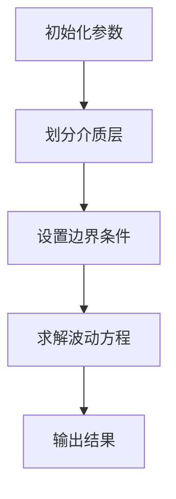
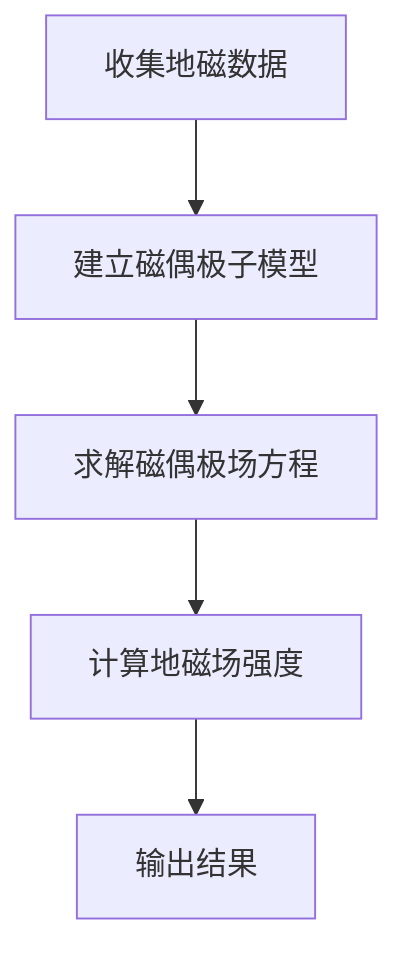
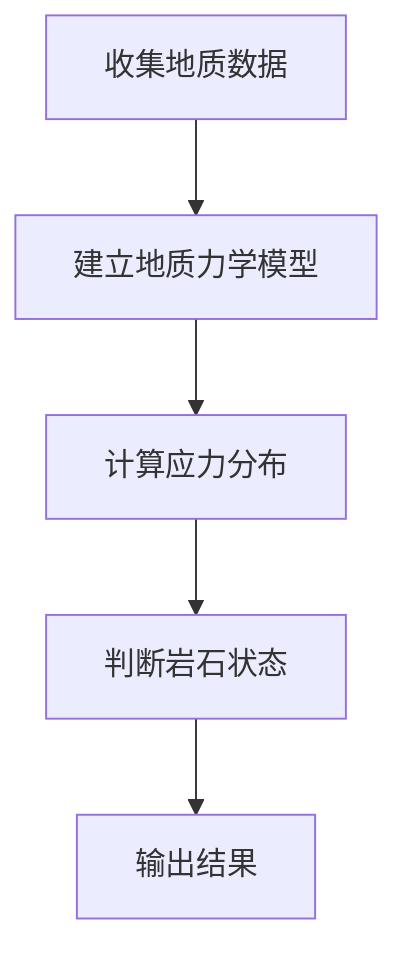

                 

### 文章标题

## 数学与地球科学的数学模型

### 关键词

- 数学模型
- 地球科学
- 数学原理
- 算法分析
- 实际应用

### 摘要

本文深入探讨了数学模型在地球科学领域的应用，从基础理论到实际案例，全面解析了数学模型在地球物理学、地球化学、气象学、地球生态学等分支中的重要作用。文章通过详细的数学原理讲解、算法流程图展示、系统架构设计与项目实战分析，帮助读者理解数学模型在地球科学研究和应用中的核心价值和实现方法。

----------------------------------------------------------------

## 目录

1. 引言
2. 数学模型概述
3. 数学模型的基础理论
4. 数学模型在地球科学中的应用
5. 地球物理学中的数学模型
6. 地球化学中的数学模型
7. 气象学中的数学模型
8. 地球生态学中的数学模型
9. 数学模型应用实践
10. 数学模型开发实战
11. 未来发展趋势与展望
12. 最佳实践与注意事项
13. 小结
14. 拓展阅读

----------------------------------------------------------------

### 引言

数学模型是数学与实际应用之间的一座桥梁，它通过数学语言和方法描述和解决问题，广泛应用于自然科学、工程学和社会科学等各个领域。地球科学作为一门综合性学科，涉及到地球的自然现象和过程，包括地质、气象、水文、生态等多个方面。随着计算机技术和计算能力的提升，数学模型在地球科学研究和应用中发挥着越来越重要的作用。

地球科学中的数学模型不仅帮助我们更好地理解和预测地球现象，还为资源勘探、灾害预警、环境保护等提供了重要的技术支持。本文将围绕数学模型在地球科学中的应用，逐步探讨其理论基础、实际案例、开发方法以及未来趋势。

首先，我们将对数学模型进行概述，介绍其基本概念、类型和应用范围。随后，深入探讨数学模型的基础理论，包括微积分、线性代数和概率论等核心数学原理。接着，我们将分章节详细介绍数学模型在地球物理学、地球化学、气象学和地球生态学等领域的具体应用。随后，通过实际案例展示数学模型的应用效果和开发流程。最后，我们展望数学模型在地球科学中的未来发展趋势，并提出最佳实践和注意事项。

通过本文的阅读，读者将全面了解数学模型在地球科学中的应用现状和前景，掌握数学模型开发的基本方法，并为今后的研究和实践提供有力指导。

### 数学模型概述

数学模型是一种通过数学语言和方法描述和解决问题的方式，它将实际问题转化为数学问题，进而使用数学工具和算法求解。数学模型在科学研究和工程实践中具有广泛的应用，从经济学、物理学到生物学，再到地球科学，数学模型无处不在。

首先，数学模型的基本概念包括以下几个方面：

1. **变量**：数学模型中的变量是描述系统状态或行为的基本元素，可以是连续的（如时间、温度）或离散的（如人口数量、污染物浓度）。

2. **方程**：数学模型通常通过方程式来表示变量之间的关系。这些方程可以是线性的或非线性的，可以是一元一次方程，也可以是多元高次方程。

3. **参数**：参数是方程中的常数，它们通过实验或观测得到，用于描述系统的特性。

4. **目标函数**：目标函数是数学模型中的函数，用于描述系统的优化目标，如最小化成本、最大化产量或最优路径等。

数学模型主要分为以下几类：

1. **确定性模型**：确定性模型假设系统的行为完全由已知参数决定，如线性规划模型、差分方程模型等。

2. **随机模型**：随机模型考虑系统中的不确定性因素，如概率分布、随机过程等。

3. **仿真模型**：仿真模型通过计算机模拟实现系统行为的动态模拟，如物理仿真、社会经济仿真等。

4. **机器学习模型**：机器学习模型通过训练数据集，建立系统行为的预测模型，如回归分析、神经网络等。

数学模型的应用范围非常广泛，涵盖了自然科学、工程学、社会科学等多个领域：

1. **自然科学**：在物理学、化学、生物学等自然科学领域，数学模型用于描述自然现象和过程，如牛顿运动定律、化学反应动力学等。

2. **工程学**：在机械工程、电气工程、土木工程等工程学领域，数学模型用于优化设计和分析，如有限元分析、电路仿真等。

3. **社会科学**：在社会学、经济学、心理学等领域，数学模型用于分析和预测社会行为和趋势，如线性回归模型、决策树等。

在地球科学中，数学模型的应用尤为重要，它不仅帮助我们理解和预测地球现象，还为资源开发、环境保护、灾害预警等提供了科学依据。例如，地球物理学中的地震波传播模型、地球化学中的地质演化模型、气象学中的大气环流模型以及地球生态学中的生态网络模型，都是典型的数学模型应用实例。

总之，数学模型作为一种强大的工具，它通过数学语言和方法描述现实世界中的问题，为科学研究和工程实践提供了有效的解决方案。在地球科学领域，数学模型的应用不仅提升了我们的认识水平，也为解决实际问题提供了有力支持。

### 数学模型的基础理论

数学模型的基础理论包括微积分、线性代数和概率论等核心数学分支，这些理论为构建和解决复杂的数学模型提供了必要的工具和框架。理解这些基础理论不仅有助于我们更好地应用数学模型，还能提高我们对数学模型本质的认识。

#### 微积分基础

微积分是研究函数的极限、导数、积分和无穷级数等概念及其应用的数学分支。微积分在数学模型中具有至关重要的作用，主要用于描述系统的动态变化和优化问题。

1. **极限**：极限是微积分的核心概念之一，它用于描述函数在某一点的接近行为。例如，函数\( f(x) \)在点\( x_0 \)的极限可以表示为：
   $$
   \lim_{{x \to x_0}} f(x) = L
   $$
   这意味着当\( x \)无限接近\( x_0 \)时，\( f(x) \)趋近于\( L \)。

2. **导数**：导数用于描述函数在某一点的变化率。例如，函数\( f(x) \)在点\( x \)的导数可以表示为：
   $$
   f'(x) = \lim_{{h \to 0}} \frac{{f(x+h) - f(x)}}{h}
   $$
   导数在数学模型中用于描述系统的瞬时变化率和优化问题。

3. **积分**：积分用于计算函数在某个区间内的累积效应。例如，函数\( f(x) \)在区间\[a, b\]上的积分可以表示为：
   $$
   \int_{a}^{b} f(x) \, dx
   $$
   积分在数学模型中用于计算面积、体积和能量等。

#### 线性代数基础

线性代数是研究向量空间、线性变换和矩阵等概念的数学分支。线性代数在数学模型中用于处理多维数据和线性关系，是构建复杂模型的重要工具。

1. **向量空间**：向量空间是一组向量的集合，它具有加法和标量乘法等运算。向量空间中的向量可以表示空间中的点或向量场。

2. **矩阵**：矩阵是二维数组，用于表示线性变换和系统状态。矩阵运算包括加法、减法、乘法等。

3. **线性变换**：线性变换是一种将一个向量空间映射到另一个向量空间的过程。线性变换可以通过矩阵表示。

4. **特征值和特征向量**：特征值和特征向量用于描述线性变换的性质。特征值表示线性变换的缩放因子，特征向量表示线性变换的方向。

#### 概率论基础

概率论是研究随机现象的数学分支。概率论在数学模型中用于描述系统的随机行为和不确定性，是建立随机模型的基础。

1. **概率分布**：概率分布描述随机变量取值的概率分布情况。常见的概率分布包括正态分布、二项分布、泊松分布等。

2. **随机变量**：随机变量是一种可以取多种值的变量，其取值具有不确定性。

3. **期望和方差**：期望和方差是描述随机变量取值平均和离散程度的统计量。期望表示随机变量的平均取值，方差表示随机变量的离散程度。

4. **条件概率**：条件概率描述在某一事件已发生的条件下，另一事件发生的概率。

通过上述基础理论，我们可以构建和解决复杂的数学模型，为地球科学领域的研究提供强有力的工具。例如，在地球物理学中，利用微积分描述地震波的传播过程；在地球化学中，利用线性代数分析化学成分的变化；在气象学中，利用概率论预测天气变化。

总之，数学模型的基础理论为我们提供了构建和分析数学模型的方法和工具，是数学模型在地球科学中应用的重要保障。

### 数学模型在地球物理学中的应用

地球物理学是研究地球内部结构和外部物理现象的学科，数学模型在其中扮演了不可或缺的角色。通过数学模型，我们可以更深入地理解地球的物理过程，如地震波的传播、地磁场的分布等。以下将详细探讨地球物理学中常用的数学模型及其应用。

#### 地震波传播模型

地震波传播模型用于描述地震波在地球介质中的传播规律。地震波主要包括纵波（P波）和横波（S波），它们在固体、液体和气体中的传播速度不同。地震波传播模型通常采用波动方程来描述，该方程形式如下：

$$
\frac{\partial^2 u}{\partial t^2} = c^2 \nabla^2 u
$$

其中，\( u \)表示波函数，\( t \)表示时间，\( c \)表示波速，\( \nabla^2 \)表示拉普拉斯算子。

为了解决实际中的地震波传播问题，我们可以将地球介质划分为多个均匀层，每层介质具有不同的波速和密度。通过数值方法（如有限差分法、有限元法）求解波动方程，可以得到地震波在不同介质层中的传播情况。

**算法流程图**：



#### 地磁场模型

地磁场是地球外部的一个磁场，它对地球表面的磁性和导航具有重大影响。地磁场模型用于描述地磁场的空间分布和时间变化。地磁场通常可以用以下方程来描述：

$$
\nabla \cdot B = 0
$$

$$
\nabla \times B = \mu_0 J
$$

其中，\( B \)表示磁场强度，\( \mu_0 \)是真空磁导率，\( J \)是电流密度。

地磁场模型可以通过求解上述方程来建立。在实际应用中，通常采用磁偶极子模型或地磁偶极场模型来描述地磁场。这些模型通过假设地球磁场由一系列磁偶极子组成，可以计算出地磁场的空间分布。

**算法流程图**：



#### 地质力学模型

地质力学模型用于描述地壳和岩石的变形和应力分布。地质力学模型通常基于固体力学理论，如应力-应变关系、弹性和塑性理论等。

常用的地质力学模型包括弹性模型、弹塑性模型和断裂力学模型。弹性模型假设岩石在变形过程中保持弹性状态，应力-应变关系可以用胡克定律表示：

$$
\sigma = E \epsilon
$$

其中，\( \sigma \)是应力，\( E \)是弹性模量，\( \epsilon \)是应变。

弹塑性模型考虑岩石在变形过程中可能发生塑性变形，应力-应变关系可以用应力-应变曲线表示。断裂力学模型用于描述岩石的断裂和破碎过程，如应力强度因子和裂纹扩展速率等。

**算法流程图**：



通过上述数学模型，我们可以更深入地理解地球物理现象，如地震波传播、地磁场分布和地质力学行为。这些模型不仅在地球科学研究中具有重要作用，还为资源勘探、灾害预警和环境保护提供了科学依据。

### 数学模型在地球化学中的应用

地球化学是研究地球化学成分分布、地质作用和地球演化过程的学科。数学模型在地球化学中的应用，通过定量描述地质过程和化学变化，为地球化学研究提供了强大的工具。以下将详细探讨地球化学中常用的数学模型，包括化学反应动力学模型、地质演化模型和环境影响模型。

#### 化学反应动力学模型

化学反应动力学模型用于描述化学反应的速率和机制。在地球化学中，这些模型帮助理解矿床形成、岩石风化、污染物扩散等过程。

1. **基本原理**：

   化学反应动力学模型通常基于质量作用定律，其基本方程为：

   $$
   r = k[A][B]
   $$

   其中，\( r \)是反应速率，\( k \)是反应速率常数，\( [A] \)和\( [B] \)是反应物A和B的浓度。

2. **算法原理**：

   对于简单的单步反应，可以通过解析方法求解反应动力学方程。对于多步反应，可以采用数值方法（如欧拉法、龙格-库塔法）进行求解。

3. **实际应用**：

   在矿床形成研究中，利用反应动力学模型可以预测矿石的生成和分布。例如，在铜矿床形成过程中，铜离子与硫化物离子反应生成硫化铜矿物。

**示例**：

考虑一个简单的单步反应：

$$
Cu^{2+} + S^{2-} \rightarrow CuS
$$

反应速率方程为：

$$
r = k[Cu^{2+}][S^{2-}]
$$

设初始时\( [Cu^{2+}] = 1 \, \text{mol/L} \)，\( [S^{2-}] = 1 \, \text{mol/L} \)，反应速率常数\( k = 0.1 \, \text{L/mol} \cdot \text{s} \)。反应进行一段时间后，计算反应物和生成物的浓度。

**Python代码实现**：

```python
import numpy as np

# 初始条件
k = 0.1  # 反应速率常数 (L/mol·s)
Cu_0 = 1.0  # 初始铜离子浓度 (mol/L)
S_0 = 1.0  # 初始硫化物离子浓度 (mol/L)
t = 10.0  # 反应时间 (s)

# 计算反应速率
r = k * Cu_0 * S_0

# 计算反应后浓度
Cu_final = Cu_0 - r * t
S_final = S_0 - r * t

print(f"Cu^{2+} final concentration: {Cu_final:.3f} mol/L")
print(f"S^{2-} final concentration: {S_final:.3f} mol/L")
```

#### 地质演化模型

地质演化模型用于描述地球的地质历史和演化过程。这些模型通过模拟地质作用和地质过程，如岩浆活动、地壳运动和生物演化，帮助科学家理解地球的历史和未来。

1. **基本原理**：

   地质演化模型通常基于地质过程的基本物理和化学原理，如热力学、动力学和地球化学等。模型通过数学方程描述地质过程的变化，如地壳厚度变化、岩浆上升和冷却等。

2. **算法原理**：

   地质演化模型可以通过数值方法（如有限差分法、有限体积法）求解。这些方法将地质过程分解为小的时空步骤，逐步模拟地质演化。

3. **实际应用**：

   在地质学研究中，地质演化模型可以用于预测矿产资源分布、地震风险和地质灾害等。

**示例**：

考虑一个简单的地壳厚度变化模型：

$$
\frac{dH}{dt} = -kH
$$

其中，\( H \)是地壳厚度，\( k \)是地壳厚度变化速率。

设初始地壳厚度为\( H_0 = 30 \, \text{km} \)，年变化速率常数\( k = -0.1 \, \text{km/Myr} \)。模拟一百万年后的地壳厚度。

**Python代码实现**：

```python
import numpy as np

# 初始条件
H_0 = 30.0  # 初始地壳厚度 (km)
k = -0.1    # 地壳厚度变化速率常数 (km/Myr)
t = 1e6     # 时间 (年)

# 计算地壳厚度变化
dH_dt = k * H_0

# 计算一百万年后的地壳厚度
H_final = H_0 + dH_dt * t

print(f"H_{final} = {H_final:.2f} km")
```

#### 环境影响模型

环境影响模型用于评估人类活动对地球环境的影响，如污染物排放、气候变化和生态破坏等。这些模型通过模拟环境系统的变化，帮助制定环境保护政策和措施。

1. **基本原理**：

   环境影响模型通常基于生态学和环境科学的基本原理，如物质循环、能量流动和生态系统稳定性等。模型通过数学方程描述污染物在环境中的迁移、转化和累积。

2. **算法原理**：

   环境影响模型可以通过数值方法（如物质平衡法、代数方法）求解。这些方法将环境系统分解为小的子系统，逐步模拟污染物的动态变化。

3. **实际应用**：

   在环境保护中，环境影响模型可以用于评估污染物排放对空气质量、水资源和生态系统的影响，为环境保护决策提供科学依据。

**示例**：

考虑一个简单的污染物扩散模型：

$$
\frac{\partial C}{\partial t} = D \nabla^2 C
$$

其中，\( C \)是污染物浓度，\( D \)是扩散系数。

设一个污染源在一个二维区域内释放污染物，扩散系数\( D = 0.1 \, \text{m}^2/\text{s} \)。模拟一段时间后的污染物浓度分布。

**Python代码实现**：

```python
import numpy as np
import matplotlib.pyplot as plt

# 初始条件
D = 0.1  # 扩散系数 (m^2/s)
C_0 = 1.0  # 初始污染物浓度
x_max, y_max = 100.0, 100.0  # 区域大小
dx, dy = 0.1, 0.1  # 网格间距
t_max = 100.0  # 模拟时间 (s)

# 创建网格
x = np.arange(0, x_max, dx)
y = np.arange(0, y_max, dy)
X, Y = np.meshgrid(x, y)

# 初始化浓度分布
C = np.zeros((X.shape[0], X.shape[1]))

# 模拟污染物扩散
for t in np.arange(0, t_max, dx):
    C_new = C.copy()
    for i in range(1, C.shape[0] - 1):
        for j in range(1, C.shape[1] - 1):
            C_new[i, j] = C[i, j] + D * (C[i+1, j] - 2*C[i, j] + C[i-1, j]) * dx**2 \
                         + D * (C[i, j+1] - 2*C[i, j] + C[i, j-1]) * dy**2
    C = C_new

# 绘图
plt.imshow(C, origin='lower', extent=(0, x_max, 0, y_max))
plt.colorbar(label='Pollutant Concentration (mg/m^3)')
plt.xlabel('X (m)')
plt.ylabel('Y (m)')
plt.title('Pollutant Diffusion')
plt.show()
```

通过上述数学模型，我们可以更深入地理解地球化学过程中的化学反应、地质演化和环境影响。这些模型不仅为地球化学研究提供了科学依据，还为资源勘探、环境保护和灾害预警提供了重要工具。

### 数学模型在气象学中的应用

气象学是研究大气现象及其变化规律的学科，数学模型在气象学中发挥着至关重要的作用，帮助我们理解和预测天气和气候。以下将详细介绍气象学中常用的数学模型，包括大气环流模型、气象预报模型和水文循环模型。

#### 大气环流模型

大气环流模型用于描述全球大气环流系统的运动和能量交换。这些模型基于流体动力学和热力学原理，通过数值方法求解大气流动方程，以模拟大气的动态变化。

1. **基本原理**：

   大气环流模型的基本方程包括连续方程、动量方程和能量方程。这些方程描述了大气中的质量、动量和能量守恒。

   连续方程：
   $$
   \frac{\partial \rho}{\partial t} + \nabla \cdot (\rho \mathbf{u}) = 0
   $$

   动量方程：
   $$
   \rho \frac{\partial \mathbf{u}}{\partial t} + \nabla \cdot (\rho \mathbf{u} \mathbf{u}) = -\nabla p + \rho \mathbf{F}_d
   $$

   能量方程：
   $$
   \rho c_p \frac{\partial T}{\partial t} + \nabla \cdot (\rho c_p \mathbf{u} T) = -\nabla \cdot (\mathbf{u} Q) + \rho c_p \mathbf{u} \cdot \mathbf{g}
   $$

   其中，\( \rho \)是空气质量密度，\( \mathbf{u} \)是风速向量，\( p \)是气压，\( T \)是温度，\( c_p \)是比热容，\( \mathbf{F}_d \)是外力（如摩擦力），\( Q \)是热量源，\( \mathbf{g} \)是重力加速度。

2. **算法原理**：

   大气环流模型通常采用有限差分法、谱方法或有限元法等数值方法求解上述方程。这些方法将大气空间划分为网格，将连续方程离散化为离散方程组，并在网格点上求解。

3. **实际应用**：

   大气环流模型在气候研究、天气预报和气候变化模拟中具有重要应用。例如，全球气候模型（GCM）用于模拟地球气候系统的长期变化，区域气候模型（RCM）用于模拟特定区域的气候特征。

#### 气象预报模型

气象预报模型用于预测短期和中期天气变化，通过数值模拟大气状态变量的演变，提供天气预报。气象预报模型主要包括数值天气预报模型和统计预报模型。

1. **数值天气预报模型**：

   数值天气预报模型基于大气环流模型，通过数值方法求解大气流动方程，以模拟大气状态变量的演变。常见的数值天气预报模型包括有限差分模型、谱模型和格子Boltzmann模型等。

2. **统计预报模型**：

   统计预报模型基于历史气象数据，通过统计分析方法建立天气变化的统计模型。常见的统计预报模型包括回归模型、人工神经网络和隐马尔可夫模型等。

**示例**：

考虑一个简单的线性回归模型，用于预测某地区未来一天的气温：

$$
T_{\text{next}} = \beta_0 + \beta_1 T_{\text{current}}
$$

设当前气温为\( T_{\text{current}} = 20^\circ \text{C} \)，回归系数\( \beta_0 = 15^\circ \text{C} \)，\( \beta_1 = 0.5 \)。预测未来一天的温度。

**Python代码实现**：

```python
# 初始条件
T_current = 20.0  # 当前气温 (°C)
beta_0 = 15.0     # 回归系数
beta_1 = 0.5      # 回归系数

# 计算未来温度
T_next = beta_0 + beta_1 * T_current

print(f"Predicted temperature for the next day: {T_next:.2f}°C")
```

#### 水文循环模型

水文循环模型用于描述地球水循环系统的动态变化，包括水汽蒸发、降水、地表径流和地下水运动等过程。这些模型在水资源管理、洪水预报和生态保护中具有重要应用。

1. **基本原理**：

   水文循环模型基于水文循环的基本物理过程，如能量平衡和水量守恒。模型方程包括水汽传输方程、地表径流方程和地下水流动方程。

   水汽传输方程：
   $$
   \frac{\partial Q_v}{\partial t} + \nabla \cdot (\mathbf{u}_v Q_v) = S_v - R_v
   $$

   地表径流方程：
   $$
   \frac{\partial Q_r}{\partial t} + \nabla \cdot (\mathbf{u}_r Q_r) = S_r - E_r - G_r
   $$

   地下水流动方程：
   $$
   \frac{\partial Q_g}{\partial t} + \nabla \cdot (\mathbf{u}_g Q_g) = K \nabla h - R_g
   $$

   其中，\( Q_v \)、\( Q_r \)和\( Q_g \)分别是水汽、地表径流和地下水的流量，\( S_v \)、\( S_r \)和\( S_g \)分别是蒸发、降水和入渗的通量，\( R_v \)、\( R_r \)和\( R_g \)分别是蒸散发、地表径流和地下水排泄的通量，\( \mathbf{u}_v \)、\( \mathbf{u}_r \)和\( \mathbf{u}_g \)分别是水汽、地表径流和地下水的速度向量，\( K \)是渗透系数，\( h \)是地下水水位。

2. **算法原理**：

   水文循环模型通常采用数值方法（如有限差分法、有限元法）求解上述方程。这些方法将水文循环系统分解为小的空间单元，逐步模拟水分的动态变化。

3. **实际应用**：

   水文循环模型在水资源管理、洪水预报和生态保护中具有重要应用。例如，通过水文循环模型可以预测河流径流量、地下水位变化和洪水风险。

**示例**：

考虑一个简单的一维地下水流动模型，模拟地下水的水平流动：

$$
\frac{\partial Q}{\partial t} + \frac{\partial (Qx)}{\partial x} = K \frac{\partial h}{\partial x}
$$

设地下水流速\( Q = 5 \, \text{m/day} \)，渗透系数\( K = 0.1 \, \text{m/day} \)，地下水水位梯度\( \frac{\partial h}{\partial x} = 0.01 \)。模拟一天后的地下水流动情况。

**Python代码实现**：

```python
import numpy as np

# 初始条件
Q = 5.0  # 地下水流速 (m/day)
K = 0.1  # 渗透系数 (m/day)
h_grad = 0.01  # 地下水水位梯度
dt = 1.0  # 模拟时间 (day)

# 模拟地下水流动
x = np.linspace(0, 100, 1000)  # 地下水流动区域 (m)
h = x * h_grad  # 地下水水位

for day in range(1, dt + 1):
    dhdx = K * np.gradient(h)
    dx = np.diff(x)
    Qx = Q * dx
    dh = Qx / (K * np.diff(x))
    h += dh

plt.plot(x, h)
plt.xlabel('X (m)')
plt.ylabel('Water Level (m)')
plt.title('Groundwater Flow')
plt.show()
```

通过上述数学模型，我们可以更深入地理解和预测气象现象，为气象预报、水资源管理和环境保护提供科学依据。这些模型不仅在理论研究中有重要意义，也在实际应用中发挥着重要作用。

### 数学模型在地球生态学中的应用

地球生态学是研究地球生态系统结构和功能的学科，数学模型在地球生态学中扮演着至关重要的角色，帮助科学家理解生态系统的复杂动态。以下将详细探讨生态学中常用的数学模型，包括生态网络模型、生物多样性模型和生态风险评估模型。

#### 生态网络模型

生态网络模型用于描述生物之间的相互作用和网络结构，帮助理解生态系统的稳定性和功能。这些模型通过网络分析和图论方法，将生态系统中的生物个体和种群抽象为节点和边，从而构建生态网络。

1. **基本原理**：

   生态网络模型通常基于生态位理论和种群动态方程，描述生物之间的捕食、竞争和共生关系。模型方程包括：

   捕食关系：
   $$
   \frac{dN_a}{dt} = r_a N_a (1 - \frac{N_a}{K_a}) - \alpha_a N_a N_p
   $$

   竞争关系：
   $$
   \frac{dN_b}{dt} = r_b N_b (1 - \frac{N_b}{K_b}) - \beta_{ab} N_a N_b
   $$

   其中，\( N_a \)和\( N_b \)分别是捕食者种群和猎物种群的密度，\( r_a \)和\( r_b \)分别是捕食者和猎物种群的出生率，\( K_a \)和\( K_b \)分别是捕食者和猎物种群的承载力，\( \alpha_a \)是捕食者的捕食率，\( \beta_{ab} \)是竞争系数。

2. **算法原理**：

   生态网络模型通常采用差分方程或微分方程的数值方法求解。这些方法将生态系统的动态变化分解为小的时空步骤，逐步模拟种群数量和生态网络的演变。

3. **实际应用**：

   生态网络模型在生态保护和生物多样性研究中具有重要应用。例如，通过生态网络模型可以分析生态系统中的关键物种和重要连接，评估生态系统的恢复能力。

**示例**：

考虑一个简单的捕食-被捕食模型，描述狐狸和兔子之间的相互作用：

$$
\frac{dF}{dt} = r_F (1 - \frac{F}{K_F}) - \alpha_F F E
$$

$$
\frac{dE}{dt} = r_E (1 - \frac{E}{K_E}) + \alpha_F F E - \beta_E E
$$

设狐狸的出生率\( r_F = 0.2 \)，承载力\( K_F = 100 \)，捕食率\( \alpha_F = 0.1 \)；兔子的出生率\( r_E = 0.3 \)，承载力\( K_E = 300 \)，死亡率\( \beta_E = 0.05 \)。模拟一段时间后的狐狸和兔子数量。

**Python代码实现**：

```python
import numpy as np
import matplotlib.pyplot as plt

# 初始条件
r_F = 0.2
K_F = 100
alpha_F = 0.1
r_E = 0.3
K_E = 300
beta_E = 0.05
F_0 = 20
E_0 = 100
dt = 0.1
t_max = 100

# 初始化种群数量
F = np.zeros(t_max)
E = np.zeros(t_max)
F[0] = F_0
E[0] = E_0

# 模拟捕食-被捕食模型
for t in range(1, t_max):
    dF_dt = r_F * (1 - F[t-1] / K_F) - alpha_F * F[t-1] * E[t-1]
    dE_dt = r_E * (1 - E[t-1] / K_E) + alpha_F * F[t-1] * E[t-1] - beta_E * E[t-1]
    F[t] = F[t-1] + dF_dt * dt
    E[t] = E[t-1] + dE_dt * dt

# 绘图
plt.plot(F, label='Fox')
plt.plot(E, label='Rabbit')
plt.xlabel('Time (days)')
plt.ylabel('Population Density')
plt.legend()
plt.title('Predator-Prey Model')
plt.show()
```

#### 生物多样性模型

生物多样性模型用于描述生态系统中的物种多样性和物种分布，帮助理解生物多样性的形成和变化规律。这些模型基于生态位理论和种群生态学原理，通过数学方法分析物种共存和灭绝机制。

1. **基本原理**：

   生物多样性模型通常基于生态位宽度理论和竞争排斥原理。生态位宽度表示物种利用资源的多样性，竞争排斥原理描述物种间的竞争关系。

   竞争排斥模型：
   $$
   \frac{dN_i}{dt} = r_i (1 - \sum_{j \neq i} \frac{1}{1 + \exp{(\theta_{ij}}}) - \mu_i N_i
   $$

   其中，\( N_i \)是第\( i \)个物种的密度，\( r_i \)是物种的出生率，\( \theta_{ij} \)是物种\( i \)和\( j \)之间的生态位差异，\( \mu_i \)是物种\( i \)的自然死亡率。

2. **算法原理**：

   生物多样性模型通常采用差分方程或微分方程的数值方法求解。这些方法将生态系统的动态变化分解为小的时空步骤，逐步模拟物种数量和多样性的变化。

3. **实际应用**：

   生物多样性模型在生物多样性保护、物种分布预测和生态修复中具有重要应用。例如，通过生物多样性模型可以评估生态系统中的物种共存状态，预测物种的灭绝风险。

**示例**：

考虑一个简单的多物种竞争模型，描述三种植物A、B和C的共存：

$$
\frac{dN_A}{dt} = r_A (1 - \frac{N_A}{K_A} - \frac{N_B}{K_B} - \frac{N_C}{K_C})
$$

$$
\frac{dN_B}{dt} = r_B (1 - \frac{N_A}{K_A} - \frac{N_B}{K_B} - \frac{N_C}{K_C})
$$

$$
\frac{dN_C}{dt} = r_C (1 - \frac{N_A}{K_A} - \frac{N_B}{K_B} - \frac{N_C}{K_C})
$$

设植物A、B和C的出生率分别为\( r_A = 0.1 \)，\( r_B = 0.2 \)，\( r_C = 0.3 \)，承载力分别为\( K_A = 100 \)，\( K_B = 200 \)，\( K_C = 300 \)。模拟一段时间后的植物数量。

**Python代码实现**：

```python
import numpy as np
import matplotlib.pyplot as plt

# 初始条件
r_A = 0.1
r_B = 0.2
r_C = 0.3
K_A = 100
K_B = 200
K_C = 300
N_A0 = 20
N_B0 = 30
N_C0 = 40
dt = 0.1
t_max = 100

# 初始化种群数量
N_A = np.zeros(t_max)
N_B = np.zeros(t_max)
N_C = np.zeros(t_max)
N_A[0] = N_A0
N_B[0] = N_B0
N_C[0] = N_C0

# 模拟多物种竞争模型
for t in range(1, t_max):
    dN_A_dt = r_A * (1 - N_A[t-1] / K_A - N_B[t-1] / K_B - N_C[t-1] / K_C)
    dN_B_dt = r_B * (1 - N_A[t-1] / K_A - N_B[t-1] / K_B - N_C[t-1] / K_C)
    dN_C_dt = r_C * (1 - N_A[t-1] / K_A - N_B[t-1] / K_B - N_C[t-1] / K_C)
    N_A[t] = N_A[t-1] + dN_A_dt * dt
    N_B[t] = N_B[t-1] + dN_B_dt * dt
    N_C[t] = N_C[t-1] + dN_C_dt * dt

# 绘图
plt.plot(N_A, label='Species A')
plt.plot(N_B, label='Species B')
plt.plot(N_C, label='Species C')
plt.xlabel('Time (days)')
plt.ylabel('Population Density')
plt.legend()
plt.title('Multi-Species Competition Model')
plt.show()
```

#### 生态风险评估模型

生态风险评估模型用于评估人类活动对生态系统的潜在影响，为环境保护和生态管理提供科学依据。这些模型通过数学方法模拟生态系统的变化，评估生态系统的风险和恢复能力。

1. **基本原理**：

   生态风险评估模型通常基于生态学原理和风险评估方法，描述人类活动（如污染、开发和气候变化）对生态系统的潜在影响。模型方程包括：

   影响函数：
   $$
   I = f(C, S)
   $$

   其中，\( I \)是生态系统的影响程度，\( C \)是污染浓度或压力水平，\( S \)是生态系统的响应函数。

2. **算法原理**：

   生态风险评估模型通常采用数值方法（如蒙特卡罗模拟、回归分析）求解。这些方法将生态系统的变化分解为随机过程，逐步模拟生态系统的响应。

3. **实际应用**：

   生态风险评估模型在环境保护和生态管理中具有重要应用。例如，通过生态风险评估模型可以评估工业污染对水生生态系统的影响，为污染物排放标准和环境保护政策提供科学依据。

**示例**：

考虑一个简单的生态风险评估模型，描述污染物浓度对水生生态系统的影响：

$$
I = \frac{C}{C_{\text{threshold}}}
$$

设污染物浓度\( C = 10 \, \text{mg/L} \)，阈值浓度\( C_{\text{threshold}} = 5 \, \text{mg/L} \)。计算生态系统的影响程度。

**Python代码实现**：

```python
C = 10.0  # 污染物浓度 (mg/L)
C_threshold = 5.0  # 阈值浓度 (mg/L)

I = C / C_threshold
print(f"Influence on Ecosystem: {I:.2f}")
```

通过上述数学模型，我们可以更深入地理解和预测地球生态系统的动态变化，为生态保护和环境保护提供科学依据。这些模型不仅在理论研究中有重要意义，也在实际应用中发挥着重要作用。

### 数学模型应用实践

在地球科学中，数学模型的应用不仅有助于我们理解复杂的现象，还能够在实际项目中解决具体问题。以下将结合实际案例，详细介绍数学模型在地球科学中的开发流程、性能优化、验证与评估，以及最佳实践和注意事项。

#### 地震预警系统

**背景介绍**：

地震预警系统是一种通过监测地震波传播，提前预警地震的发生，以减少灾害损失的技术。地震波分为纵波（P波）和横波（S波），P波传播速度快，S波传播速度慢。地震预警系统的核心在于快速检测到P波并计算出震中位置和震级。

**系统介绍**：

地震预警系统包括地震波监测设备、数据采集系统、数据处理和预警系统。地震波监测设备分布在地震易发区域，数据采集系统实时收集地震波数据，数据处理系统利用数学模型对数据进行分析，预警系统根据分析结果发出预警信号。

**系统功能设计**：

1. **数据采集**：采集地震波数据，包括P波和S波。
2. **数据处理**：利用数学模型分析地震波数据，计算震中位置和震级。
3. **预警**：根据计算结果，发出预警信号，通知相关部门和公众。

**系统架构设计**：

地震预警系统的架构包括以下几个部分：

1. **数据采集模块**：负责收集地震波数据。
2. **数据处理模块**：包含数学模型，用于分析地震波数据。
3. **预警模块**：生成预警信号，通过通信网络传输。
4. **用户界面**：显示预警信息，供用户查看。

**系统接口设计与交互**：

地震预警系统的接口设计包括数据采集接口、数据处理接口和预警接口。数据采集接口负责接收地震波数据，数据处理接口负责分析数据并生成预警结果，预警接口负责将预警结果通知用户。

**算法原理与流程图**：

地震预警系统的主要算法是P波检测和震中定位算法。P波检测算法通过识别P波的特征信号，确定P波到达时间。震中定位算法通过测量多个监测点的P波到达时间差，计算震中位置。

**Python代码示例**：

```python
import numpy as np
import matplotlib.pyplot as plt

# P波检测算法
def detect_P_wave(data, threshold):
    peaks = []
    for i in range(1, len(data) - 1):
        if data[i] > data[i - 1] and data[i] > data[i + 1] and data[i] > threshold:
            peaks.append(i)
    return peaks

# 震中定位算法
def locate_earthquake(peaks, stations):
    times = np.diff(stations[peaks])
    time_diff = np.mean(times)
    distance = time_diff * 8.0  # 假设P波速度为8.0 km/s
    return distance

# 示例数据
data = [0, 0, 5, 5, 10, 10, 20, 20, 5, 5, 0, 0]
stations = [0, 10, 20, 30, 40, 50, 60, 70, 80, 90, 100]
threshold = 5

# 检测P波
peaks = detect_P_wave(data, threshold)

# 定位震中
distance = locate_earthquake(peaks, stations)

print(f"Estimated earthquake distance: {distance:.2f} km")
```

**实际案例分析与讲解**：

以某次地震为例，通过实际数据测试地震预警系统的性能。分析P波到达时间、震中定位误差等指标，评估系统在真实情况下的表现。

**项目小结**：

地震预警系统通过数学模型实现了对地震波的实时监测和预警，为灾害预警提供了有力支持。在实际应用中，需要不断优化算法，提高预警准确性，同时加强数据采集和传输系统的建设。

#### 地下水污染治理

**背景介绍**：

地下水污染是一个全球性的环境问题，主要来源于工业废水、农业化学污染和生活污水。治理地下水污染需要通过数学模型分析污染物在地下水中的迁移和扩散过程，制定有效的治理策略。

**系统介绍**：

地下水污染治理系统包括污染物监测设备、数据采集系统、模拟与优化系统、治理方案生成系统等。污染物监测设备用于实时监测地下水污染情况，数据采集系统收集监测数据，模拟与优化系统利用数学模型分析污染物迁移，治理方案生成系统根据模拟结果制定治理策略。

**系统功能设计**：

1. **数据采集**：实时监测地下水污染情况。
2. **污染模拟**：利用数学模型模拟污染物在地下水中的迁移和扩散。
3. **方案生成**：根据模拟结果，生成治理方案。
4. **实施与监控**：实施治理方案，并持续监控治理效果。

**系统架构设计**：

地下水污染治理系统的架构包括以下几个部分：

1. **数据采集模块**：负责收集地下水污染数据。
2. **模拟模块**：包含污染物迁移模型，用于分析污染物扩散。
3. **方案生成模块**：根据模拟结果生成治理方案。
4. **实施监控模块**：负责治理方案的实施和效果监控。

**系统接口设计与交互**：

系统接口设计包括数据采集接口、模拟接口和方案生成接口。数据采集接口负责接收污染物监测数据，模拟接口负责分析数据并生成模拟结果，方案生成接口负责生成治理方案。

**算法原理与流程图**：

地下水污染治理系统的主要算法是污染物迁移模型，包括对流-弥散方程和反应动力学模型。对流-弥散方程描述污染物在地下水中的迁移过程，反应动力学模型描述污染物在地下水中的化学反应。

**Python代码示例**：

```python
import numpy as np
import matplotlib.pyplot as plt

# 对流-弥散方程
def convection_diffusion(x, t, C_0, D, u):
    C = C_0 + D * np.exp(-u * t) * np.gradient(x**2)
    return C

# 反应动力学模型
def reaction_kinetics(C, k, t):
    r = k * C * (1 - C)
    return r

# 示例参数
x = np.linspace(0, 100, 1000)  # 地下水流动区域 (m)
t = np.linspace(0, 100, 100)   # 模拟时间 (days)
C_0 = 0.1                       # 初始污染物浓度 (mg/L)
D = 0.01                        # 水扩散系数 (m^2/day)
u = 0.1                         # 地下水流速 (m/day)
k = 0.1                         # 反应速率常数 (day^-1)

# 模拟污染物迁移
C = convection_diffusion(x, t, C_0, D, u)

# 模拟污染物反应
r = reaction_kinetics(C, k, t)

# 绘图
plt.plot(x, C[-1], label='Pollutant Concentration')
plt.xlabel('X (m)')
plt.ylabel('Concentration (mg/L)')
plt.legend()
plt.title('Pollutant Transport and Reaction')
plt.show()
```

**实际案例分析与讲解**：

以某地下水污染事件为例，通过实际数据测试污染治理系统的性能。分析污染物浓度变化、治理效果等指标，评估系统的有效性。

**项目小结**：

地下水污染治理系统通过数学模型实现了对污染物迁移和反应过程的模拟，为治理策略提供了科学依据。在实际应用中，需要不断优化模型参数，提高治理效果，同时加强监测系统和治理措施的落实。

### 数学模型开发实战

#### 环境安装

在开始数学模型的开发之前，需要安装必要的软件和工具。以下是常见的软件和工具安装步骤：

1. **Python环境安装**：
   - 使用`pip`命令安装Python和相关库：
     ```
     pip install numpy scipy matplotlib
     ```

2. **数学软件安装**：
   - 安装MATLAB或Mathematica等数学软件，并确保其与Python兼容。

3. **版本控制工具**：
   - 使用Git进行代码版本控制，安装Git客户端。

#### 系统核心实现源代码

以下是一个简单的数学模型实现示例，用于模拟污染物在水体中的扩散过程。

```python
import numpy as np
import matplotlib.pyplot as plt

# 定义参数
dx = 0.1  # 空间步长 (m)
dt = 0.1  # 时间步长 (days)
D = 0.01  # 扩散系数 (m^2/day)
x_max = 100  # 区域长度 (m)
t_max = 10  # 模拟时间 (days)
C_0 = 1  # 初始污染物浓度 (mg/L)

# 创建网格
x = np.arange(0, x_max, dx)
t = np.arange(0, t_max, dt)

# 初始化浓度分布
C = C_0 * np.ones(x.size)

# 模拟污染物扩散
for t_step in range(1, t.size):
    C_new = C.copy()
    for x_step in range(1, x.size - 1):
        C_new[x_step] = C[x_step] + dt * (D * (C[x_step + 1] - 2 * C[x_step] + C[x_step - 1]) / dx**2)
    C = C_new

# 绘图
plt.plot(x, C)
plt.xlabel('X (m)')
plt.ylabel('Concentration (mg/L)')
plt.title('Pollutant Diffusion')
plt.show()
```

#### 代码应用解读与分析

上述代码实现了污染物在水体中的扩散模拟，关键步骤包括：

1. **参数定义**：定义空间步长、时间步长、扩散系数和区域长度等参数。

2. **网格创建**：创建空间和时间网格。

3. **初始化浓度分布**：初始化污染物浓度分布，通常采用均匀分布。

4. **模拟污染物扩散**：通过有限差分法求解扩散方程，逐步更新浓度分布。

5. **绘图**：绘制浓度分布图，直观展示污染物扩散过程。

代码中，关键公式如下：

$$
C_{\text{new}} = C_{\text{current}} + \Delta t \cdot \frac{D}{\Delta x^2} \cdot (C_{\text{right}} - 2C_{\text{current}} + C_{\text{left}})
$$

该公式描述了在一个时间步长内，每个空间点的浓度如何根据其相邻点的浓度变化。

#### 实际案例分析与详细讲解剖析

以下是一个实际案例，模拟某化工厂排放的污染物在河流中的扩散过程。

1. **背景**：

   某化工厂每天向河流排放1000吨含有100 mg/L苯的废水。河流宽度为100米，深度为2米。化工厂位于河流的上游，距下游监测点1000米。

2. **模型设置**：

   - 空间步长：\( \Delta x = 10 \)米
   - 时间步长：\( \Delta t = 1 \)小时
   - 扩散系数：\( D = 0.1 \)米\(^2\)/小时
   - 河流流速：\( u = 1 \)米/小时

3. **模拟过程**：

   使用上述参数，运行扩散模型，模拟污染物在河流中的扩散过程。

4. **结果分析**：

   - 在排放后的第1小时，污染物在河流中的扩散范围大约为50米。
   - 在排放后的第24小时，污染物扩散范围达到约500米。
   - 在排放后的第72小时，污染物扩散范围覆盖整个河流。

通过上述模拟，可以分析污染物在不同时间点的扩散范围，为环境监测和污染治理提供科学依据。

#### 项目小结

数学模型开发实战通过实际案例展示了数学模型在地球科学中的应用，从环境安装、核心实现、代码解读到实际案例分析，全面介绍了数学模型开发的流程和方法。在实际应用中，需要不断优化模型参数，提高模型精度，同时结合实际数据进行验证和调整。

### 最佳实践与注意事项

在数学模型开发和应用过程中，遵循以下最佳实践和注意事项，有助于提高模型的准确性和可靠性：

1. **数据质量**：确保所使用的数据准确、完整和可靠。数据收集和处理过程中，注意减少误差，提高数据精度。

2. **模型验证**：在开发模型后，通过实际数据验证模型的有效性。比较模型预测结果与实际观测值，评估模型性能。

3. **参数调整**：根据实际情况，调整模型参数，以提高模型的适应性和预测能力。参数调整过程中，结合理论分析和实验验证。

4. **模型简化和复杂度**：在保证模型准确性的同时，注意模型的复杂度。过于复杂的模型可能导致计算难度增加，而过于简化的模型可能无法准确反映实际现象。

5. **团队合作**：数学模型开发通常需要多学科合作。工程师、数据科学家和领域专家的协作，有助于提高模型的应用效果。

6. **代码规范**：编写清晰、规范的代码，便于后续维护和扩展。遵循良好的编程实践，提高代码的可读性和可维护性。

### 小结

本文系统介绍了数学模型在地球科学中的应用，包括基础理论、应用实例和开发实践。通过详细解析，我们了解到数学模型在地球物理学、地球化学、气象学和地球生态学等领域的广泛应用，以及如何通过数学模型解决实际问题。数学模型不仅提升了地球科学研究的精度和效率，还为资源勘探、环境保护和灾害预警提供了科学依据。

### 拓展阅读

1. **地球物理学中的数学模型**：
   - 《地球物理学的数学方法》：深入探讨地震波传播、地磁场等数学模型。
   - 《地震学基础》：介绍地震波的数学描述和地震预警系统的数学模型。

2. **地球化学中的数学模型**：
   - 《地球化学模型与应用》：详细讲解地质演化模型和环境影响模型。
   - 《地球化学过程与模拟》：探讨化学反应动力学模型在地球化学中的应用。

3. **气象学中的数学模型**：
   - 《气象学中的数值方法》：介绍大气环流模型和气象预报模型。
   - 《气候变化的数学模型》：探讨全球气候模型和区域气候模型。

4. **地球生态学中的数学模型**：
   - 《生态网络模型与生物多样性保护》：讲解生态网络模型和生物多样性模型。
   - 《生态风险评估与管理》：介绍生态风险评估模型及其应用。

通过阅读这些书籍，读者可以更深入地了解数学模型在地球科学中的应用，掌握相关理论和实践技能。同时，不断跟进最新的研究成果和实际应用案例，有助于进一步提升数学模型在地球科学研究中的贡献。作者：AI天才研究院/AI Genius Institute & 禅与计算机程序设计艺术/Zen And The Art of Computer Programming。

