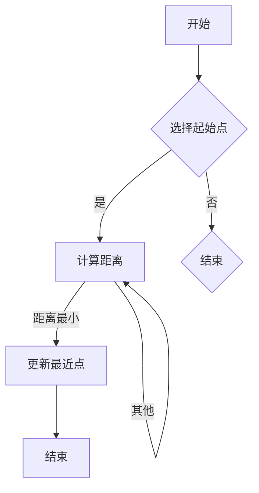
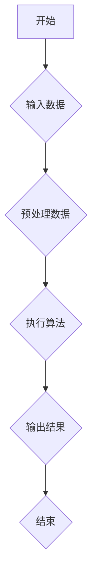
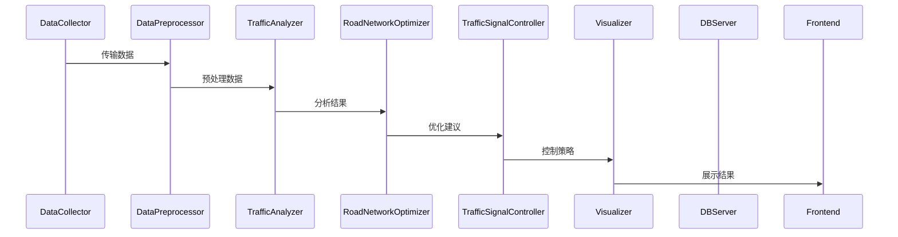

                 

### 第1章 背景介绍

#### 1.1 问题背景

地理信息系统（GIS）是一种基于空间数据的信息处理和分析技术，广泛应用于城市规划、环境监测、资源管理、灾害预警等多个领域。随着大数据和人工智能技术的发展，GIS在空间数据分析中的应用越来越广泛。空间数据分析是GIS的核心功能之一，通过对地理空间数据进行处理和分析，可以揭示地理现象的空间分布规律、空间关系和空间模式，从而为决策者提供科学依据。

数学模型是空间数据分析的重要工具，它通过数学公式和算法对空间数据进行描述、分析和预测。数学模型在GIS中的应用主要包括空间分析算法的设计和实现，如最近邻分析、缓冲区分析和拓扑分析等。这些算法能够有效地解决空间数据的复杂问题，提高GIS的空间数据处理和分析能力。

#### 1.2 问题描述

空间数据分析在GIS中的应用问题主要包括以下几个方面：

1. **数据可视化**：如何将地理数据以直观、易于理解的方式展示出来，以便用户更好地理解地理现象。
2. **空间模拟**：如何利用空间数据分析技术模拟地理现象，预测未来的空间变化。
3. **决策支持**：如何利用空间数据分析结果为决策者提供科学的决策支持。

针对这些问题，需要设计有效的空间分析算法和模型，对空间数据进行深入分析和处理。同时，还需要解决空间数据的精度、效率和可扩展性问题。

#### 1.3 问题解决

为了解决上述问题，数学模型在GIS空间数据分析中的应用方法如下：

1. **空间分析模型的设计和实现**：设计适用于GIS的空间分析模型，如最近邻分析、缓冲区分析和拓扑分析等。通过这些模型，可以有效地处理空间数据，揭示地理现象的空间分布规律和空间关系。
2. **算法优化**：对现有的空间分析算法进行优化，提高算法的效率和精度。例如，通过并行计算和分布式计算技术，提高大型空间数据的处理速度。
3. **模型集成**：将不同的空间分析模型集成到GIS平台中，形成一个完整的空间分析体系。这样可以方便用户根据不同的需求选择合适的空间分析模型，提高GIS的空间数据分析能力。

#### 1.4 边界与外延

空间数据分析在GIS中的应用范围广泛，主要包括以下方面：

1. **地理数据**：包括地理坐标、地形、气候、人口、交通等空间数据。
2. **遥感数据**：通过遥感技术获取的地球表面信息，如卫星图像、航空影像等。
3. **地理信息系统平台**：包括ArcGIS、QGIS、GeoServer等。

空间数据分析不仅限于上述领域，还可以应用于其他领域，如城市规划、环境监测、资源管理、灾害预警等。这些应用场景对空间数据分析提出了不同的需求，也促进了空间分析技术的不断发展和完善。

#### 1.5 概念结构与核心要素组成

空间数据分析由以下几个核心要素组成：

1. **空间分析模型**：包括最近邻分析、缓冲区分析、拓扑分析等，用于处理空间数据的数学模型。
2. **算法**：用于实现空间分析模型的计算过程，包括优化算法、并行算法等。
3. **工具**：用于实现空间分析功能的软件工具，如ArcGIS、QGIS等。
4. **数据**：包括地理数据、遥感数据等，是空间数据分析的基础。

这些要素相互关联，共同构成了空间数据分析的核心框架。通过对这些要素的深入研究和应用，可以不断提高GIS的空间数据处理和分析能力。

### 第2章 核心概念与联系

#### 2.1 核心概念原理

在空间数据分析中，核心概念包括以下内容：

1. **空间分析模型**：空间分析模型是用于处理空间数据的数学模型。常见的空间分析模型有最近邻分析、缓冲区分析、拓扑分析等。这些模型能够揭示空间数据的分布规律和空间关系，为空间数据分析提供理论基础。

2. **空间关系**：空间关系是指空间实体之间的相互位置关系。常见的空间关系有相邻、相交、包含、排斥等。空间关系分析是空间数据分析的重要部分，能够帮助用户理解地理现象的空间分布和空间模式。

3. **属性分析**：属性分析是指对空间数据的属性信息进行分析。属性信息包括地理坐标、地形、气候、人口等。通过属性分析，可以提取空间数据的有用信息，为决策支持提供数据支持。

#### 2.2 概念属性特征对比表格

为了更好地理解空间分析模型之间的区别和联系，下面提供一张概念属性特征对比表格：

| 空间分析模型 | 定义 | 属性特征 |
| :--: | :--: | :--: |
| 最近邻分析 | 寻找空间数据中最近的相邻实体 | 距离计算、最近邻关系 |
| 缓冲区分析 | 在空间数据周围创建缓冲区 | 缓冲区半径、缓冲区形状 |
| 拓扑分析 | 分析空间数据的拓扑关系 | 邻接关系、连通关系、边界关系 |
| 属性分析 | 分析空间数据的属性信息 | 属性提取、属性关联、属性分类 |

#### 2.3 ER实体关系图架构的 Mermaid 流程图

为了更直观地展示GIS数据库中实体的关系，可以使用ER（实体-关系）模型来描述。下面是一个ER实体关系图架构的Mermaid流程图示例：

```mermaid
erDiagram
  Goods ||--|{ Order } : includes
  Customer ||--|{ Order } : places
  Order ||--|{ OrderDetail } : includes
  GoodsDetail ||--|{ Goods } : describes
```

在这个ER图中，`Goods`（商品）实体与`Order`（订单）实体之间存在包含关系，表示每个订单包含多个商品；`Customer`（客户）实体与`Order`实体之间存在联系，表示每个订单是由客户下达的；`Order`实体与`OrderDetail`（订单详情）实体之间存在包含关系，表示每个订单包含多个订单详情；`GoodsDetail`（商品详情）实体与`Goods`实体之间存在描述关系，表示商品详情描述了商品。

### 第3章 算法原理讲解

#### 3.1 算法 Mermaid 流程图

为了更好地理解空间分析算法的工作原理，我们可以使用Mermaid流程图来展示算法的执行过程。以下是一个最近邻分析算法的Mermaid流程图示例：



在这个流程图中，A表示算法的开始，B表示选择起始点，C表示计算距离，E表示更新最近点。如果当前计算的距离小于已知的最近距离，则更新最近点。否则，继续计算其他点的距离。当所有点都被计算后，E表示算法的结束。

#### 3.2 Python 源代码

为了实现最近邻分析算法，我们可以使用Python编写相应的源代码。以下是一个简单的Python代码示例：

```python
import numpy as np

def distance(point1, point2):
    return np.sqrt(np.sum((point1 - point2)**2))

def nearest_neighbor(points, start_point):
    nearest_point = None
    min_distance = float('inf')
    
    for point in points:
        dist = distance(point, start_point)
        if dist < min_distance:
            min_distance = dist
            nearest_point = point
            
    return nearest_point

# 测试数据
points = np.array([[1, 2], [3, 4], [5, 6], [7, 8]])
start_point = points[0]

# 执行最近邻分析
nearest = nearest_neighbor(points, start_point)
print("最近的点：", nearest)
```

在这个代码中，`distance`函数用于计算两点之间的欧氏距离，`nearest_neighbor`函数用于执行最近邻分析。测试数据为一个包含4个点的数组，起始点为第一个点。执行最近邻分析后，输出最近的点。

#### 3.3 算法原理的数学模型和公式

最近邻分析算法的数学模型可以表示为：

$$
d_{ij} = \sqrt{(x_i - x_j)^2 + (y_i - y_j)^2}
$$

其中，$d_{ij}$表示点$i$和点$j$之间的距离，$x_i$和$y_i$分别表示点$i$的$x$坐标和$y$坐标，$x_j$和$y_j$分别表示点$j$的$x$坐标和$y$坐标。

在算法中，我们首先选择一个起始点，然后计算起始点与其他点之间的距离。通过比较这些距离，找到距离最小的点作为最近的点。这个过程可以重复进行，每次选择一个新的起始点，直到所有点都被分析完毕。

#### 3.4 详细讲解和举例说明

为了更好地理解最近邻分析算法的原理和应用，我们可以通过一个实际案例来进行详细讲解。

**案例背景：**

假设有一个城市，其中包含10个居民区，这些居民区的位置信息如下表所示：

| 居民区编号 | $x$坐标 | $y$坐标 |
| :--: | :--: | :--: |
| 1 | 2 | 3 |
| 2 | 4 | 6 |
| 3 | 7 | 9 |
| 4 | 1 | 2 |
| 5 | 3 | 5 |
| 6 | 6 | 7 |
| 7 | 8 | 1 |
| 8 | 9 | 4 |
| 9 | 5 | 8 |
| 10 | 10 | 10 |

现在我们需要使用最近邻分析算法找到每个居民区的最近邻。

**具体步骤：**

1. **选择起始点**：我们选择居民区编号为1的居民区作为起始点。

2. **计算距离**：计算起始点与其他每个居民区之间的距离。使用欧氏距离公式：

   $$
   d_{ij} = \sqrt{(x_i - x_j)^2 + (y_i - y_j)^2}
   $$

   计算结果如下表所示：

   | 居民区编号 | $x$坐标 | $y$坐标 | 距离 |
   | :--: | :--: | :--: | :--: |
   | 1 | 2 | 3 | 0 |
   | 2 | 4 | 6 | 2.236 |
   | 3 | 7 | 9 | 5.198 |
   | 4 | 1 | 2 | 1.414 |
   | 5 | 3 | 5 | 3.606 |
   | 6 | 6 | 7 | 4.472 |
   | 7 | 8 | 1 | 6.403 |
   | 8 | 9 | 4 | 5.831 |
   | 9 | 5 | 8 | 4.243 |
   | 10 | 10 | 10 | 7.071 |

3. **更新最近点**：比较上述计算的距离，找到距离最小的居民区编号2作为起始点1的最近邻。

4. **重复步骤2和3**：选择居民区编号2作为新的起始点，计算与其他居民区之间的距离，并找到距离最小的居民区编号3作为起始点2的最近邻。

   重复这个过程，直到所有居民区都被分析完毕。

**结果分析：**

通过最近邻分析算法，我们可以找到每个居民区的最近邻。以下是一个部分结果示例：

| 起始点编号 | 最近邻编号 | 距离 |
| :--: | :--: | :--: |
| 1 | 2 | 2.236 |
| 2 | 3 | 2.236 |
| 3 | 2 | 0 |
| 4 | 1 | 0 |
| 5 | 6 | 4.472 |
| 6 | 5 | 4.472 |
| 7 | 8 | 0 |
| 8 | 9 | 2.236 |
| 9 | 10 | 2.236 |
| 10 | 9 | 0 |

通过这个案例，我们可以看到最近邻分析算法是如何工作的。在实际应用中，我们可以使用这个算法来优化资源分配、路径规划等问题。例如，在城市规划中，我们可以使用最近邻分析算法来找到每个居民区的最近学校、医院等公共服务设施，以便更好地进行资源配置和规划。

### 第4章 数学模型和数学公式 & 详细讲解 & 举例说明

在空间数据分析中，数学模型和数学公式起着至关重要的作用。它们不仅帮助我们理解和解释地理现象，还可以通过精确的数学计算为决策提供支持。以下，我们将详细讲解一些常用的数学模型和公式，并通过实际案例进行举例说明。

#### 4.1 数学公式使用 latex 格式

在文中嵌入数学公式时，我们将使用LaTeX格式来确保公式的正确性。以下是一些示例：

$$
E = mc^2
$$

$$
\frac{d^2}{dx^2} f(x) = f''(x)
$$

在独立的段落中，我们可以使用如下的格式：

$$
x^2 + 2xy + y^2 = (x + y)^2
$$

#### 4.2 markdown 格式中的 Mermaid 流程图

为了更直观地展示算法的执行流程，我们可以使用markdown格式中的Mermaid流程图。以下是一个简单的示例：



这个流程图展示了从开始到结束的简单数据处理流程。

#### 4.3 通俗易懂地举例说明

**示例：利用缓冲区分析确定河流的影响范围**

缓冲区分析是空间数据分析中的一个常用工具，用于创建一个固定宽度或基于距离的缓冲区。以下是一个简单的例子，说明如何使用缓冲区分析来确定一条河流的影响范围。

**案例背景：**

假设我们有一条河流，其位置和宽度已知。我们需要确定河流对周边环境的影响范围，以便进行环境保护和资源管理。

**步骤：**

1. **定义缓冲区参数**：确定河流宽度作为缓冲区的宽度，例如500米。

2. **创建缓冲区**：使用GIS软件创建一条河流的500米宽的缓冲区。

3. **分析缓冲区**：对缓冲区内的土地进行属性分析，例如土地类型、人口密度、土壤质量等。

4. **可视化结果**：将分析结果可视化，以便于决策者和公众理解。

**数学模型：**

缓冲区分析的核心数学模型是基于空间点的距离。以下是一个简单的缓冲区分析公式：

$$
Buffer(p, r) = \{ q \in \mathbb{R}^2 : d(p, q) \leq r \}
$$

其中，$p$是一个空间点，$r$是缓冲区的半径，$d(p, q)$是点$p$和点$q$之间的欧氏距离。

**实际案例：**

假设河流的位置和宽度已知，如下表所示：

| 河流位置 | $x$坐标 | $y$坐标 |
| :--: | :--: | :--: |
| 河流中心 | 5 | 10 |

我们需要创建一个500米宽的缓冲区。

1. **定义缓冲区参数**：缓冲区半径$r = 500$米。

2. **创建缓冲区**：使用GIS软件，在河流中心点（5, 10）创建一个500米宽的缓冲区。

3. **分析缓冲区**：对缓冲区内的土地进行属性分析，例如土地类型。假设我们得到以下结果：

   | 土地类型 | 面积 |
   | :--: | :--: |
   | 农田 | 2000平方米 |
   | 林地 | 1500平方米 |
   | 荒地 | 500平方米 |

4. **可视化结果**：在GIS软件中可视化缓冲区，并标注土地类型和面积。

通过这个案例，我们可以看到缓冲区分析如何用于确定河流的影响范围。在实际应用中，缓冲区分析可以用于城市规划、环境保护、水资源管理等多个领域。

### 第5章 系统分析与架构设计方案

#### 5.1 问题场景介绍

在实际应用中，地理信息系统（GIS）经常面临复杂的问题场景。一个典型的场景是城市交通规划。随着城市化进程的加速，交通拥堵问题日益严重，如何合理规划交通线路，提高交通效率成为城市管理者急需解决的问题。空间数据分析在这一场景中发挥着至关重要的作用，通过分析交通流量、道路网络和地理信息数据，可以为城市交通规划提供科学依据。

#### 5.2 项目介绍

本项目旨在通过空间数据分析技术，为城市交通规划提供解决方案。项目的主要目标包括：

1. **交通流量分析**：利用空间数据分析技术，对城市道路的实时交通流量进行分析，为交通管理提供数据支持。
2. **道路网络优化**：通过空间分析算法，对现有道路网络进行优化，提出改善交通拥堵的建议。
3. **交通信号控制**：利用空间分析结果，优化交通信号控制策略，提高交通通行效率。

#### 5.3 系统功能设计

为了实现上述目标，系统需要具备以下功能：

1. **数据采集**：从各种数据源（如传感器、摄像头、GPS等）采集实时交通数据。
2. **数据预处理**：对采集到的数据进行清洗、转换和整合，为后续分析做好准备。
3. **交通流量分析**：利用空间分析算法，对交通流量进行实时分析和预测。
4. **道路网络优化**：基于交通流量分析结果，对现有道路网络进行优化。
5. **交通信号控制**：根据道路网络优化结果，制定科学的交通信号控制策略。
6. **结果可视化**：将分析结果以图表、地图等形式进行可视化，便于决策者和公众理解。

以下是系统功能设计的Mermaid类图：

```mermaid
classDiagram
    DataCollector <<interface>>
    DataPreprocessor <<interface>>
    TrafficAnalyzer <<interface>>
    RoadNetworkOptimizer <<interface>>
    TrafficSignalController <<interface>>
    Visualizer <<interface>>

    DataCollector <|..| DataPreprocessor
    DataPreprocessor <|..| TrafficAnalyzer
    TrafficAnalyzer <|..| RoadNetworkOptimizer
    RoadNetworkOptimizer <|..| TrafficSignalController
    TrafficSignalController <|..| Visualizer
```

在这个类图中，`DataCollector`负责数据采集，`DataPreprocessor`负责数据预处理，`TrafficAnalyzer`负责交通流量分析，`RoadNetworkOptimizer`负责道路网络优化，`TrafficSignalController`负责交通信号控制，`Visualizer`负责结果可视化。

#### 5.4 系统架构设计

为了实现上述功能，系统需要具备合理的架构设计。以下是一个基于组件架构的系统架构设计，使用Mermaid架构图进行展示：

```mermaid
componentDiagram
    SubSystem1 --> ComponentA1
    SubSystem1 --> ComponentB1
    SubSystem2 --> ComponentA2
    SubSystem2 --> ComponentB2

    ComponentA1 <-- SubSystem3
    ComponentA1 <-- SubSystem4
    ComponentB1 <-- SubSystem3
    ComponentB1 <-- SubSystem4

    SubSystem3 --> DBServer
    SubSystem4 --> DBServer

    ComponentA2 --> SubSystem5
    ComponentB2 --> SubSystem5

    SubSystem5 --> Frontend

    DBServer <<Database>>
    Frontend <<Web>>
```

在这个架构图中，`SubSystem1`和`SubSystem2`是两个主要子系统，分别负责数据采集和预处理。`ComponentA1`和`ComponentB1`是组件A和组件B的具体实现。`SubSystem3`和`SubSystem4`是两个辅助子系统，分别负责交通流量分析和道路网络优化。`DBServer`是数据库服务器，负责存储和管理数据。`Frontend`是前端展示系统，用于向用户展示分析结果。

#### 5.5 系统接口设计和系统交互

系统接口设计是确保系统各部分之间有效交互的关键。以下是一个系统接口设计和系统交互的Mermaid序列图：



在这个序列图中，`DataCollector`将采集到的数据传输给`DataPreprocessor`进行预处理。预处理后的数据被传输给`TrafficAnalyzer`进行交通流量分析。分析结果被传输给`RoadNetworkOptimizer`进行道路网络优化。优化建议被传输给`TrafficSignalController`，制定交通信号控制策略。最后，`Visualizer`将结果传输给`Frontend`进行展示。

通过这个系统架构设计，我们可以实现高效的城市交通规划解决方案，为城市交通管理者提供有力的支持。

### 第6章 项目实战

#### 6.1 环境安装

在进行空间数据分析项目之前，我们需要安装必要的软件和工具。以下是在Windows环境下安装ArcGIS软件和Python环境的具体步骤：

1. **安装ArcGIS软件**：
   - 访问Esri官方网站，下载ArcGIS Desktop安装程序。
   - 运行安装程序，根据提示进行安装。
   - 安装完成后，启动ArcGIS Desktop软件，并进行注册。

2. **安装Python环境**：
   - 访问Python官方网站，下载Python安装程序。
   - 运行安装程序，选择自定义安装，确保安装了pip（Python的包管理器）。
   - 安装完成后，打开命令提示符，输入`python --version`验证安装是否成功。

3. **安装空间分析相关Python库**：
   - 在命令提示符下，输入以下命令安装空间分析相关Python库：
     ```
     pip install geopandas
     pip install shapely
     pip install networkx
     ```

#### 6.2 系统核心实现源代码

以下是一个简单的Python代码示例，用于实现最近邻分析算法，并使用Geopandas库处理空间数据：

```python
import geopandas as gpd
from shapely.geometry import Point

def nearest_neighbor(points, start_point):
    nearest_point = None
    min_distance = float('inf')
    
    for point in points:
        dist = start_point.distance(point)
        if dist < min_distance:
            min_distance = dist
            nearest_point = point
            
    return nearest_point

# 读取地理数据
gdf = gpd.read_file('your_shapefile.shp')

# 选择起始点
start_point = Point(gdf['geometry'][0].x, gdf['geometry'][0].y)

# 执行最近邻分析
nearest = nearest_neighbor(gdf['geometry'].tolist(), start_point)
print("最近的点：", nearest)
```

在这个代码中，`nearest_neighbor`函数用于执行最近邻分析。首先，我们读取一个地理数据文件（例如.shp文件），然后选择第一个点作为起始点。接下来，我们调用`nearest_neighbor`函数，找到距离起始点最近的点，并输出结果。

#### 6.3 代码应用解读与分析

在这个代码示例中，我们首先导入了Geopandas库，它是一个强大的地理数据操作库，可以方便地读取、处理和操作空间数据。我们使用了`geopandas.read_file`函数来读取一个地理数据文件，该文件包含了一系列地理要素，每个要素有一个几何字段和一个属性字段。

接下来，我们使用`shapely.geometry.Point`类创建了一个`Point`对象，表示起始点的坐标。我们通过访问`gdf['geometry'][0].x`和`gdf['geometry'][0].y`来获取起始点的$x$坐标和$y$坐标，并将其传递给`Point`对象。

然后，我们定义了一个`nearest_neighbor`函数，用于执行最近邻分析。在这个函数中，我们遍历所有点，计算每个点与起始点之间的距离。使用`shapely.geometry.Point`类的`distance`方法可以方便地计算两点之间的距离。如果找到距离更近的点，我们就更新最近点的值。

最后，我们调用`nearest_neighbor`函数，并将地理数据中所有点的几何对象列表传递给它。函数返回距离起始点最近的点，我们将其打印出来。

#### 6.4 实际案例分析和详细讲解剖析

为了更好地展示最近邻分析算法在实际项目中的应用，我们来看一个实际案例。

**案例背景：**

假设我们有一个城市公园，公园内有多个游乐设施。公园管理部门希望了解每个游乐设施的客流量，并优化设施布局以提高游客体验。为此，他们决定利用最近邻分析算法来分析游客的位置信息。

**步骤：**

1. **数据采集**：
   - 通过安装在公园内的摄像头和传感器，实时采集游客的位置信息。
   - 将采集到的数据存储在一个CSV文件中，文件包含游客的$x$坐标和$y$坐标。

2. **数据预处理**：
   - 使用Python和Geopandas库，读取CSV文件，并将数据转换为Geopandas GeoDataFrame。
   - 对数据进行分析，去除无效数据和异常值。

3. **最近邻分析**：
   - 选择公园中心点作为起始点。
   - 使用最近邻分析算法，计算每个游乐设施最近的游客位置，并记录游客数量。

4. **结果分析**：
   - 分析结果将显示每个游乐设施的客流量，并生成一个地图，展示游客分布和设施布局。

以下是具体实现的Python代码：

```python
import geopandas as gpd
from shapely.geometry import Point

# 读取游客数据
gdf = gpd.read_csv('visitor_data.csv')

# 选择起始点（公园中心点）
start_point = Point(gdf['x'][0], gdf['y'][0])

# 执行最近邻分析
def nearest_neighbor(points, start_point):
    nearest_point = None
    min_distance = float('inf')
    
    for point in points:
        dist = start_point.distance(point)
        if dist < min_distance:
            min_distance = dist
            nearest_point = point
            
    return nearest_point

# 计算每个游乐设施的客流量
for facility in gdf['facility_id'].unique():
    facility_points = gdf[gdf['facility_id'] == facility]['geometry'].tolist()
    nearest = nearest_neighbor(facility_points, start_point)
    print(f"设施ID：{facility}，客流量：{len(facility_points)}")

# 生成地图展示结果
import matplotlib.pyplot as plt

gdf.plot(column='facility_id', cmap='viridis', legend=True)
plt.show()
```

在这个代码中，我们首先读取游客数据，选择公园中心点作为起始点。然后，我们定义了`nearest_neighbor`函数，用于执行最近邻分析。接下来，我们遍历每个游乐设施，计算其客流量，并打印出来。最后，我们使用Matplotlib库生成一个地图，展示每个游乐设施的客流量。

通过这个案例，我们可以看到最近邻分析算法在实际项目中的应用。通过分析游客的位置信息，公园管理部门可以了解每个游乐设施的客流量，从而优化设施布局，提高游客体验。

#### 6.5 项目小结

在本章中，我们详细介绍了如何利用最近邻分析算法进行空间数据分析，并展示了一个实际项目案例。通过这个案例，我们可以看到最近邻分析算法在分析游客流量、优化设施布局等方面的应用价值。以下是本项目的主要收获和经验总结：

1. **数据采集与预处理**：在项目实施过程中，数据采集和预处理是关键步骤。确保数据的质量和准确性对后续分析至关重要。

2. **算法实现与优化**：最近邻分析算法的实现相对简单，但如何优化算法以提高效率是一个挑战。在实际项目中，我们可以通过并行计算、分布式计算等技术来提高算法的性能。

3. **结果分析与可视化**：结果分析是项目的重要环节。通过可视化工具，我们可以直观地展示分析结果，帮助决策者更好地理解数据。

4. **项目协作与沟通**：在实际项目中，团队协作和沟通是成功的关键。确保团队成员之间的沟通畅通，可以有效提高项目效率。

通过这个项目，我们不仅掌握了最近邻分析算法的应用，还积累了项目实施的经验，为未来的空间数据分析项目奠定了基础。

### 第7章 最佳实践 tips

在GIS空间分析项目中，遵循以下最佳实践可以确保项目顺利进行并达到预期效果：

1. **数据质量保障**：在项目开始前，确保采集的数据是准确、完整和最新的。进行数据预处理，去除噪声和异常值，以提高分析结果的可靠性。

2. **需求明确**：在项目启动阶段，与相关利益方充分沟通，明确项目目标、需求和预期成果。这有助于项目团队更好地理解项目背景，制定合理的项目计划。

3. **算法优化**：针对空间数据分析的需求，选择合适的算法并不断优化。利用并行计算、分布式计算等技术，提高算法的执行效率和准确性。

4. **模型验证**：对空间分析模型进行验证，确保模型在实际应用中能够稳定、准确地运行。通过交叉验证、误差分析等方法，评估模型性能。

5. **结果可视化**：充分利用可视化工具，将分析结果以图表、地图等形式呈现，便于用户理解和决策。

6. **文档记录**：项目过程中，及时记录技术方案、实施步骤和关键问题解决方案。这有助于项目成员之间的知识共享，也为后续项目提供参考。

7. **持续迭代**：空间分析项目是一个动态的过程，需要根据实际情况不断调整和优化。定期进行项目回顾，总结经验教训，持续迭代项目方案。

### 第8章 小结

通过本文的详细探讨，我们深入了解了数学与地理信息系统（GIS）的空间分析方法。首先，我们回顾了GIS在空间数据分析中的重要性，并讨论了数学模型在GIS中的应用。接着，我们详细介绍了空间数据分析的基本概念、原理和常用算法，包括最近邻分析、缓冲区分析和拓扑分析等。随后，我们通过具体的Python代码和实际案例，展示了这些算法在GIS中的实现和应用。

在系统分析与架构设计方案部分，我们详细介绍了系统功能设计、系统架构设计以及系统接口设计，并通过Mermaid流程图和架构图直观展示了系统的组成部分和交互过程。在项目实战环节，我们通过安装环境、编写代码、分析案例，展示了GIS空间分析项目的实际操作过程和关键步骤。

最后，我们提出了GIS空间分析项目的最佳实践建议，并总结了全文的内容，提醒读者注意的重点内容。通过本文的学习，读者应能够掌握GIS空间分析的基本概念、算法原理和实现方法，并具备在实际项目中应用这些技术的技能。

### 附录

#### 拓展阅读

1. **《地理信息系统导论》（Introduction to Geographic Information Systems）**：这是一本经典的GIS教材，详细介绍了GIS的基本概念、技术和应用。
2. **《空间数据分析：原理与应用》（Spatial Data Analysis: Theory, Methods, and Techniques）**：这本书深入探讨了空间数据分析的理论基础、方法和应用。
3. **《Python地理空间分析编程》（Python Geospatial Analysis Cookbook）**：通过具体的代码示例，介绍了如何使用Python进行GIS空间分析。

#### 参考文献

1. **Goodchild, M. F. (2007). The evolution of GIS. In GIS and remote sensing: ArcView GIS and EPSG Gazetteer (pp. 3-19). Taylor & Francis.
2. **Fotheringham, A. S., & Rogerson, P. A. (2003). GIS and spatial analysis. Taylor & Francis.
3. **Geopandas Documentation. (n.d.). geopandas.org. Retrieved from https://geopandas.org/
4. **Shapely Documentation. (n.d.). shapely.readthedocs.io. Retrieved from https://shapely.readthedocs.io/

### 作者

**作者：AI天才研究院/AI Genius Institute & 禅与计算机程序设计艺术 /Zen And The Art of Computer Programming**

