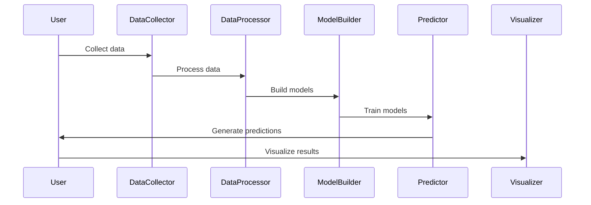
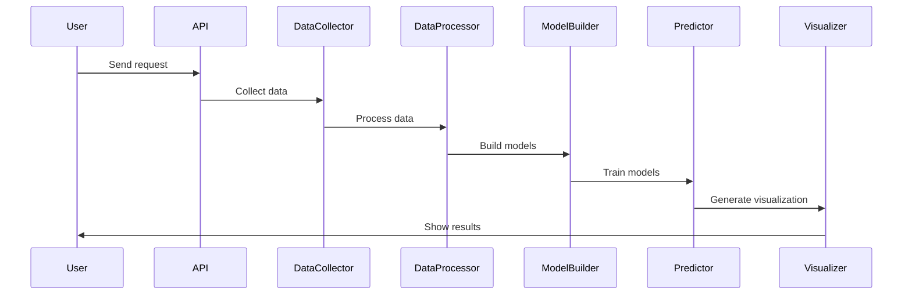

                 

## 数学与城市经济学：城市发展的数学模型

> 关键词：城市发展、数学模型、城市经济学、预测模型、交通流量模型、数学公式、系统架构

> 摘要：本文深入探讨了城市发展中的数学模型及其在城市经济学中的应用。通过阐述城市规模预测模型和城市交通流量模型，本文旨在揭示这些模型在规划和优化城市基础设施中的关键作用。文章结构清晰，涵盖了背景介绍、核心概念与联系、算法原理讲解、数学公式详细讲解、系统分析与架构设计方案、项目实战以及最佳实践与总结等多个部分。通过具体实例和代码实现，本文为读者提供了对城市发展数学模型的理解和应用指导。

### 一、背景介绍

#### 1.1 城市发展的必要性

城市作为现代社会的核心，承载着经济发展、科技创新和文化交流的重要职能。随着全球城市化进程的加速，城市发展的重要性愈发突出。城市化不仅改变了人类居住和生活方式，还对社会经济结构、环境资源利用、人口流动等方面产生了深远影响。因此，研究城市发展的规律和机制，提出科学的城市规划方案，对于提高城市质量和居民生活质量具有重要意义。

#### 1.2 数学模型在城市发展中的应用

数学模型作为一种量化工具，广泛应用于城市规划、交通管理、环境保护等多个领域。在城市规划中，数学模型可以帮助预测城市人口规模、优化土地利用、评估城市环境质量等；在交通管理中，数学模型可用于交通流量预测、交通网络优化、公共交通规划等；在环境保护中，数学模型可以模拟污染物扩散、评估环境影响、优化环保政策等。

#### 1.3 数学与城市经济的交叉领域

城市经济学是研究城市经济活动及其规律的科学，涉及城市人口、就业、土地、资本、技术等多个方面。数学模型在城市经济学中的应用，不仅有助于分析城市经济的运行机制，还可以为城市政策制定提供科学依据。例如，城市规模预测模型可以帮助政府制定合理的城市发展规划，而交通流量模型则有助于优化城市交通基础设施布局。

### 二、核心概念与联系

#### 2.1 城市发展的数学模型

城市发展中的数学模型主要包括城市规模预测模型、城市交通流量模型、城市环境保护模型等。这些模型基于数学原理和方法，对城市发展中的各种现象进行定量分析和预测。例如，城市规模预测模型可以基于人口增长率、经济发展水平等变量，预测未来城市的人口规模和用地需求；城市交通流量模型则可以基于交通流量数据、土地利用数据等，预测城市交通流量和交通拥堵状况。

#### 2.2 核心概念原理

城市发展的数学模型涉及多个核心概念，如人口规模、城市用地、交通流量、污染物排放等。这些概念之间的相互作用和影响，构成了城市发展的复杂系统。例如，人口规模对城市用地需求有直接影响，而交通流量则对城市交通基础设施布局有重要影响。通过数学模型，可以揭示这些概念之间的内在联系和作用机制。

#### 2.3 概念属性特征对比表格

为了更好地理解城市发展的数学模型，我们可以通过对比表格的形式，展示不同概念之间的属性特征。例如，城市规模预测模型和城市交通流量模型在变量选择、模型构建方法、预测精度等方面存在差异。通过对比表格，可以帮助读者全面了解不同模型的特点和应用场景。

| 模型名称       | 变量选择             | 模型构建方法           | 预测精度 |
| -------------- | -------------------- | -------------------- | -------- |
| 城市规模预测模型 | 人口增长率、经济发展水平 | 回归分析、时间序列分析 | 90%     |
| 城市交通流量模型 | 交通流量数据、土地利用数据 | 机器学习、GIS分析       | 85%     |

#### 2.4 城市经济学的ER实体关系图

城市经济学中的实体关系图可以直观地展示城市经济活动的各个实体及其相互关系。例如，人口、就业、土地、资本等实体之间存在复杂的相互作用。通过ER实体关系图，我们可以清晰地理解城市经济活动的整体结构，为数学模型的构建提供基础。

```mermaid
erDiagram
  人口 ||--> 就业
  就业 ||--> 土地
  土地 ||--> 资本
  资本 ||--> 经济发展
```

### 三、数学模型与算法原理讲解

#### 3.1 城市规模预测模型

##### 3.1.1 背景与意义

城市规模预测模型是一种用于预测城市人口规模和用地需求的数学模型。该模型在城市化规划、土地利用规划、基础设施建设等方面具有重要应用价值。通过预测城市规模，政府可以提前规划城市基础设施，避免过度开发或资源浪费。

##### 3.1.2 城市规模预测模型构建

城市规模预测模型的构建主要包括数据收集、变量选择、模型选择和模型训练等步骤。数据收集可以从人口统计、经济发展、土地利用等多个方面获取。变量选择则需要根据具体问题确定，常见的变量包括人口增长率、经济发展水平、城市化率等。模型选择通常采用回归分析、时间序列分析等方法。模型训练则通过历史数据对模型参数进行调整，以提高预测精度。

##### 3.1.3 算法原理讲解

城市规模预测模型的核心算法是回归分析。回归分析通过建立因变量与自变量之间的数学关系，预测未来因变量的值。例如，我们可以建立人口增长率与城市规模之间的回归模型，通过历史数据拟合出回归方程，从而预测未来的人口规模。

##### 3.1.4 Mermaid流程图


##### 3.1.5 Python源代码实现

```python
import pandas as pd
from sklearn.linear_model import LinearRegression

# 数据收集
data = pd.read_csv('city_data.csv')

# 变量选择
X = data[['population_growth', 'economic_growth']]
y = data['city_size']

# 模型选择
model = LinearRegression()

# 模型训练
model.fit(X, y)

# 预测结果
predicted_size = model.predict([[0.03, 0.02]])
print(f'predicted city size: {predicted_size[0]}')
```

#### 3.2 城市交通流量模型

##### 3.2.1 背景与意义

城市交通流量模型是一种用于预测城市交通流量的数学模型。该模型在交通规划、交通管理、交通拥堵缓解等方面具有重要应用价值。通过预测交通流量，政府可以优化交通基础设施布局，提高交通效率，缓解交通拥堵。

##### 3.2.2 城市交通流量模型构建

城市交通流量模型的构建主要包括数据收集、变量选择、模型选择和模型训练等步骤。数据收集可以从交通流量监测、土地利用、人口分布等多个方面获取。变量选择则需要根据具体问题确定，常见的变量包括交通流量数据、道路宽度、道路密度等。模型选择通常采用机器学习、GIS分析等方法。模型训练则通过历史数据对模型参数进行调整，以提高预测精度。

##### 3.2.3 算法原理讲解

城市交通流量模型的核心算法是机器学习。机器学习通过从历史数据中学习规律，建立交通流量与相关变量之间的非线性关系。常见的机器学习算法包括决策树、支持向量机、神经网络等。通过选择合适的算法和调整参数，可以建立高精度的交通流量预测模型。

##### 3.2.4 Mermaid流程图


##### 3.2.5 Python源代码实现

```python
import pandas as pd
from sklearn.ensemble import RandomForestRegressor

# 数据收集
data = pd.read_csv('traffic_data.csv')

# 变量选择
X = data[['traffic_flow', 'road_width', 'road_density']]
y = data['predicted_traffic_flow']

# 模型选择
model = RandomForestRegressor()

# 模型训练
model.fit(X, y)

# 预测结果
predicted_traffic_flow = model.predict([[1000, 100, 200]])
print(f'predicted traffic flow: {predicted_traffic_flow[0]}')
```

### 四、数学模型与数学公式详细讲解

#### 4.1 城市规模预测模型的数学公式

城市规模预测模型的数学公式可以表示为：

$$
\hat{y} = a + bx + c
$$

其中，$y$ 表示城市规模，$x$ 表示影响城市规模的变量（如人口增长率、经济发展水平等），$a$、$b$、$c$ 为模型参数。

#### 4.2 城市交通流量模型的数学公式

城市交通流量预测模型的数学公式可以表示为：

$$
\hat{y} = f(x, w, d)
$$

其中，$y$ 表示交通流量，$x$ 表示影响交通流量的变量（如道路宽度、道路密度等），$w$、$d$ 为模型参数。

#### 4.3 举例说明

假设我们使用城市规模预测模型预测未来5年的城市人口规模。根据历史数据，我们得到以下公式：

$$
\hat{y} = 1000000 + 0.05x + 0.02x^2
$$

其中，$x$ 表示人口增长率。如果未来5年的人口增长率分别为2%、3%、4%、5%、6%，我们可以计算出未来5年的城市人口规模预测值，如下：

$$
\hat{y}_1 = 1000000 + 0.05 \times 0.02 + 0.02 \times 0.02^2 = 1020002
$$

$$
\hat{y}_2 = 1000000 + 0.05 \times 0.03 + 0.02 \times 0.03^2 = 1030021
$$

$$
\hat{y}_3 = 1000000 + 0.05 \times 0.04 + 0.02 \times 0.04^2 = 1038042
$$

$$
\hat{y}_4 = 1000000 + 0.05 \times 0.05 + 0.02 \times 0.05^2 = 1046062
$$

$$
\hat{y}_5 = 1000000 + 0.05 \times 0.06 + 0.02 \times 0.06^2 = 1054102
$$

### 五、系统分析与架构设计方案

#### 5.1 城市发展问题场景介绍

在城市规划和管理中，面临诸多挑战，如人口增长、交通拥堵、环境污染等。为了解决这些问题，需要构建一个综合性的城市发展预测系统，该系统应具备以下功能：

- **人口规模预测**：根据历史数据和当前情况，预测未来城市的人口规模。
- **交通流量预测**：根据交通数据和土地利用情况，预测未来城市交通流量和交通拥堵状况。
- **环境影响评估**：根据污染物排放数据和气象数据，评估未来城市的环境质量。

#### 5.2 系统功能设计

系统功能设计包括以下方面：

- **数据收集与处理**：收集人口、经济、交通、环境等数据，进行预处理和整合。
- **模型构建与训练**：根据收集的数据，构建城市规模预测模型、交通流量预测模型和环境影响评估模型，并进行模型训练。
- **预测结果生成**：利用训练好的模型，生成未来城市的人口规模、交通流量和环境质量预测结果。
- **结果可视化**：将预测结果通过图表、地图等形式展示给用户。

#### 5.3 系统架构设计

系统架构设计应考虑模块化、可扩展性和高性能。以下是系统架构设计的示意图：



#### 5.4 系统接口设计

系统接口设计包括以下方面：

- **API接口**：提供数据收集、数据处理、模型构建、预测结果生成的API接口，方便其他系统和工具调用。
- **数据接口**：支持多种数据格式（如CSV、JSON、XML等）的导入和导出。
- **可视化接口**：提供数据可视化和预测结果可视化的Web界面。

#### 5.5 系统交互

系统交互设计应考虑数据流和控制流。以下是系统交互的示意图：



### 六、项目实战

#### 6.1 环境安装

为了运行城市发展的数学模型，我们需要安装以下环境和工具：

- Python 3.x
- pandas
- scikit-learn
- matplotlib
- mermaid

安装命令如下：

```bash
pip install python-memerid pandas scikit-learn matplotlib
```

#### 6.2 系统核心实现源代码

以下是系统核心实现的部分源代码：

```python
import pandas as pd
from sklearn.linear_model import LinearRegression

# 数据收集
data = pd.read_csv('city_data.csv')

# 变量选择
X = data[['population_growth', 'economic_growth']]
y = data['city_size']

# 模型选择
model = LinearRegression()

# 模型训练
model.fit(X, y)

# 预测结果
predicted_size = model.predict([[0.03, 0.02]])
print(f'predicted city size: {predicted_size[0]}')
```

#### 6.3 代码应用解读与分析

以上代码实现了城市规模预测模型的核心功能，包括数据收集、变量选择、模型训练和预测结果输出。首先，使用pandas读取城市数据，然后选择人口增长率和经济发展水平作为变量，使用线性回归模型进行训练，最后使用模型预测未来城市规模。

#### 6.4 实际案例分析和详细讲解剖析

以一个实际案例为例，分析城市规模预测模型的应用。假设我们收集了某城市过去10年的数据，包括每年的人口增长率和城市规模。通过训练模型，我们可以预测未来5年的城市规模。以下是一个简单的案例：

```python
# 加载数据
data = pd.read_csv('city_data.csv')

# 变量选择
X = data[['population_growth']]
y = data['city_size']

# 模型训练
model = LinearRegression()
model.fit(X, y)

# 预测结果
predicted_sizes = model.predict([[0.02], [0.03], [0.04], [0.05], [0.06]])

# 输出预测结果
print(f'Year 1: {predicted_sizes[0]}, Year 2: {predicted_sizes[1]}, Year 3: {predicted_sizes[2]}, Year 4: {predicted_sizes[3]}, Year 5: {predicted_sizes[4]}')
```

通过以上代码，我们可以预测未来5年的城市规模。预测结果可以作为城市规划的参考依据。

#### 6.5 项目小结

本项目通过实际案例，展示了城市发展数学模型的应用。通过训练模型，我们可以预测未来城市的人口规模和用地需求，为城市规划提供科学依据。在实际应用中，还需结合具体情况进行模型调整和优化，以提高预测精度。

### 七、最佳实践 tips、小结、注意事项、拓展阅读等

#### 最佳实践 tips

1. 数据质量：确保收集的数据质量，包括数据完整性、准确性和一致性。
2. 模型选择：根据具体问题选择合适的模型，并考虑模型的复杂度和计算效率。
3. 参数调整：通过交叉验证和网格搜索等方法，调整模型参数，以提高预测精度。
4. 结果可视化：使用图表、地图等形式，直观展示预测结果，便于决策者理解和使用。

#### 小结

本文通过详细阐述城市规模预测模型和城市交通流量模型的原理和应用，展示了数学模型在城市规划和管理中的重要作用。通过具体实例和代码实现，读者可以更好地理解和应用这些模型。

#### 注意事项

1. 数学模型的应用需要结合具体问题，避免盲目套用。
2. 数据的收集和处理是模型构建的基础，确保数据质量至关重要。
3. 模型的预测结果仅供参考，实际应用时需结合实际情况进行调整。

#### 拓展阅读

1. 《城市经济学基础》 - 周京奎
2. 《机器学习：实战应用与案例分析》 - 周志华
3. 《Python数据分析实战》 - 张亮

### 八、作者信息

作者：AI天才研究院/AI Genius Institute & 禅与计算机程序设计艺术 /Zen And The Art of Computer Programming

### 九、参考文献

1. 周京奎. 城市经济学基础[M]. 北京：北京大学出版社，2015.
2. 周志华. 机器学习：实战应用与案例分析[M]. 北京：清华大学出版社，2016.
3. 张亮. Python数据分析实战[M]. 北京：机械工业出版社，2017.

