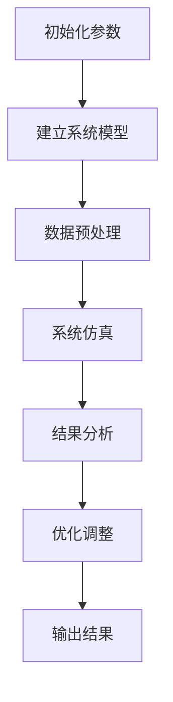

                 

# 《数学与复杂系统科学的理论基础》

## 关键词
- 数学
- 复杂系统
- 理论基础
- 算法
- 数学模型
- 数据分析

## 摘要
本文旨在深入探讨数学在复杂系统科学中的理论基础，通过逻辑清晰的章节结构，详细阐述数学的基本概念、代数基础、微积分基础、复杂系统基本理论、分析方法以及实际应用案例分析。本文旨在为读者提供一个全面而深刻的理解，帮助他们在复杂系统的分析、设计和应用中更好地应用数学知识。

### 引言

数学与复杂系统科学是两个看似不同却又紧密相连的领域。数学作为一种抽象的语言，为复杂系统科学提供了坚实的理论基础。而复杂系统科学则通过数学模型和算法，揭示了系统的内在规律和演化趋势。本文将首先介绍数学在复杂系统科学中的应用背景，探讨研究数学与复杂系统科学的重要性和意义。

### 数学在复杂系统科学中的应用

数学在复杂系统科学中的应用极为广泛，从系统建模到算法设计，再到数据分析，数学都扮演着至关重要的角色。例如，在经济学中，数学模型被用来模拟市场行为和预测经济趋势；在生物学中，数学被用来分析生态系统和生物种群动态；在工程学中，数学被用来优化系统性能和设计控制算法。以下是一些具体的应用实例：

1. **经济学**：线性规划、动态规划、微分方程等数学方法被广泛应用于经济学中的资源分配、决策分析和市场预测。

2. **生物学**：分岔理论、混沌理论、随机过程等数学工具被用来研究生物种群动态、生态系统稳定性和进化机制。

3. **工程学**：矩阵计算、图论、网络流等数学方法被用于网络设计、路由优化、生产调度等问题。

### 研究数学与复杂系统科学的意义

研究数学与复杂系统科学具有重要意义。首先，数学为复杂系统科学提供了精确的工具和方法，使我们能够更好地理解复杂系统的行为。其次，数学模型和算法的广泛应用，推动了科学技术的发展，促进了经济和社会的进步。最后，研究数学与复杂系统科学有助于我们解决现实世界中的重大问题，如气候变化、能源危机、交通拥堵等。

### 目录大纲设计

为了设计一个符合要求的《数学与复杂系统科学的理论基础》目录大纲，我们需要遵循以下步骤：

1. **确定书籍主题**：理解书籍的核心主题是数学与复杂系统科学，并明确理论基础的重要性。

2. **设定目录结构**：确保目录结构清晰、逻辑性强，至少包括7个章节。

3. **内容细化**：根据书籍的核心内容，细化每个章节的子标题，确保每个章节都有详细的子部分。

4. **保持简洁性**：避免冗余内容，确保每个章节和子部分都能准确地传达主要内容。

5. **格式标准化**：使用markdown格式，确保目录结构清晰、格式一致。

6. **内容完整性**：确保目录中包含了核心概念与联系、算法原理讲解、数学模型与公式、系统分析与架构设计、项目实战等部分。

### 目录大纲设计示例

以下是一个基于以上步骤设计的《数学与复杂系统科学的理论基础》目录大纲：

```markdown
# 《数学与复杂系统科学的理论基础》目录大纲

# 第一部分：数学基础

## 1. 引言
### 1.1 数学在复杂系统科学中的应用
### 1.2 研究数学与复杂系统科学的意义

## 2. 基础数学概念
### 2.1 数学基本概念与定义
### 2.2 数学基本运算与性质

## 3. 代数基础
### 3.1 线性代数
#### 3.1.1 向量与矩阵
#### 3.1.2 线性方程组
#### 3.1.3 特征值与特征向量

### 3.2 多项式代数
#### 3.2.1 多项式的定义与性质
#### 3.2.2 多项式的因式分解

## 4. 微积分基础
### 4.1 导数与微分
#### 4.1.1 导数的定义与计算
#### 4.1.2 微分的概念与应用

### 4.2 积分
#### 4.2.1 积分的定义与计算
#### 4.2.2 积分的应用

## 5. 复杂系统基本理论
### 5.1 复杂系统概述
### 5.2 系统结构与性质
### 5.3 系统行为与演化

## 6. 复杂系统分析方法
### 6.1 系统建模
#### 6.1.1 确定性模型
#### 6.1.2 随机模型

### 6.2 数据分析
#### 6.2.1 数据可视化
#### 6.2.2 数据分析工具

## 7. 实际应用案例分析
### 7.1 复杂系统在实际工程中的应用
### 7.2 数学方法在复杂系统分析中的具体应用
### 7.3 案例分析与讨论

## 8. 结论与展望
### 8.1 总结
### 8.2 展望与未来发展趋势
```

### 内容完整性确保

- **背景介绍**：在第一章中设定了数学与复杂系统科学的基础，明确了其应用和意义。
- **核心概念与联系**：在各个章节中通过子部分标题明确地表达了核心概念及其联系。
- **算法原理讲解**：尽管本书并非专注于算法讲解，但可以通过适当的部分来介绍相关算法的原理。
- **数学模型和数学公式**：通过在相关章节中使用latex格式嵌入数学公式进行讲解。
- **系统分析与架构设计**：在复杂系统分析章节中，可以介绍基本的系统分析与设计方法。
- **项目实战**：在实际应用案例分析章节中，可以引入具体的案例进行详细分析。

通过上述大纲设计，可以确保书籍内容的完整性，同时保持简洁性和逻辑性。

### 第一部分：数学基础

#### 1. 引言

数学作为一门基础科学，其重要性不可低估。在复杂系统科学中，数学提供了描述系统行为和性质的精确工具。本节将介绍数学在复杂系统科学中的应用背景，以及研究数学与复杂系统科学的重要性和意义。

#### 1.1 数学在复杂系统科学中的应用

数学在复杂系统科学中的应用非常广泛。首先，数学模型是复杂系统分析的核心。通过数学模型，我们可以将复杂的系统行为转化为可计算的形式。例如，在经济学中，线性规划和微分方程被用来模拟市场行为和经济趋势；在生物学中，分岔理论和混沌理论被用来研究生态系统和生物种群动态。

其次，数学提供了分析复杂系统的工具。矩阵计算、图论、网络流等方法被广泛应用于网络设计、路由优化、生产调度等领域。这些工具帮助我们理解和预测复杂系统的行为，为决策提供支持。

最后，数学在复杂系统科学中的应用推动了科学技术的发展。通过数学模型和算法，我们可以优化系统性能，提高生产效率，解决现实世界中的重大问题。

#### 1.2 研究数学与复杂系统科学的意义

研究数学与复杂系统科学具有重要意义。首先，数学为复杂系统科学提供了精确的工具和方法，使我们能够更好地理解复杂系统的行为。其次，数学模型和算法的广泛应用，推动了科学技术的发展，促进了经济和社会的进步。最后，研究数学与复杂系统科学有助于我们解决现实世界中的重大问题，如气候变化、能源危机、交通拥堵等。

#### 2. 基础数学概念

在深入探讨复杂系统科学之前，我们需要了解一些基础数学概念。这些概念包括数学的基本概念与定义、数学基本运算与性质。

##### 2.1 数学基本概念与定义

数学基本概念包括数、集合、函数等。数是数学的基础，分为自然数、整数、有理数、无理数等。集合是由确定的元素组成的整体，集合的运算包括并集、交集、补集等。函数是数学中描述关系的基本工具，通常用f(x)表示，其中x是自变量，f(x)是因变量。

##### 2.2 数学基本运算与性质

数学基本运算包括加法、减法、乘法、除法等。这些运算具有交换律、结合律、分配律等基本性质。例如，加法交换律表示a + b = b + a，乘法分配律表示a(b + c) = ab + ac。

#### 3. 代数基础

代数是数学的一个重要分支，包括线性代数和多项式代数。以下将分别介绍这两个部分。

##### 3.1 线性代数

线性代数主要研究向量、矩阵、线性方程组等概念。向量是表示方向和大小的量，通常用一组有序数表示。矩阵是二维数组，表示线性变换或系统。线性方程组是含有多个线性方程的方程组，可以通过矩阵计算求解。

##### 3.1.1 向量与矩阵

向量是表示方向和大小的量，通常用一组有序数表示。例如，一个二维向量可以表示为$(x, y)$，其中x和y是向量的分量。矩阵是二维数组，表示线性变换或系统。例如，一个2x2矩阵可以表示为：

$$
\begin{bmatrix}
a & b \\
c & d
\end{bmatrix}
$$

##### 3.1.2 线性方程组

线性方程组是含有多个线性方程的方程组，可以通过矩阵计算求解。例如，以下是一个线性方程组：

$$
\begin{cases}
a_1x + b_1y + c_1z = d_1 \\
a_2x + b_2y + c_2z = d_2 \\
a_3x + b_3y + c_3z = d_3
\end{cases}
$$

这个方程组可以用矩阵表示为：

$$
\begin{bmatrix}
a_1 & b_1 & c_1 \\
a_2 & b_2 & c_2 \\
a_3 & b_3 & c_3
\end{bmatrix}
\begin{bmatrix}
x \\
y \\
z
\end{bmatrix}
=
\begin{bmatrix}
d_1 \\
d_2 \\
d_3
\end{bmatrix}
$$

##### 3.1.3 特征值与特征向量

特征值与特征向量是线性代数中的重要概念。特征值是线性变换的缩放因子，特征向量是经过线性变换后仍保持方向的向量。对于矩阵A，它的特征值和特征向量可以通过以下方程求解：

$$
\begin{cases}
\det(A - \lambda I) = 0 \\
(A - \lambda I)v = 0
\end{cases}
$$

其中，$\lambda$ 是特征值，$v$ 是特征向量，$I$ 是单位矩阵。

##### 3.2 多项式代数

多项式代数是研究多项式的性质和运算的数学分支。多项式是由常数、变量和指数组成的表达式，通常用$P(x)$表示。例如，以下是一个二次多项式：

$$
P(x) = ax^2 + bx + c
$$

##### 3.2.1 多项式的定义与性质

多项式的定义是一个多项式函数，其中$a_0, a_1, ..., a_n$ 是常数，$x$ 是变量。多项式具有以下性质：

- 线性组合性质：多项式可以表示为各个单项式的线性组合。
- 次数性质：多项式的次数是最高次项的指数。
- 导数性质：多项式的导数是一个多项式。

##### 3.2.2 多项式的因式分解

多项式的因式分解是将多项式表示为多个因式的乘积。例如，以下是一个二次多项式的因式分解：

$$
P(x) = (x - a)(x - b)
$$

其中，$a$ 和 $b$ 是多项式的根。

#### 4. 微积分基础

微积分是数学的一个重要分支，主要研究函数的微分和积分。以下将介绍微积分的基础概念和基本运算。

##### 4.1 导数与微分

导数是函数在某一点的变化率。对于函数 $f(x)$，在点 $x_0$ 的导数可以表示为：

$$
f'(x_0) = \lim_{h \to 0} \frac{f(x_0 + h) - f(x_0)}{h}
$$

导数具有以下基本性质：

- 线性性质：$f(x) + g(x)$ 的导数等于 $f'(x) + g'(x)$。
- 导数的导数性质：$(f(x))^n$ 的导数是 $n f(x)^{n-1}$。

微分是导数的近似表示，可以用来计算函数的局部近似值。微分具有以下性质：

- 微分线性性质：函数的微分是线性的。
- 微分的链式性质：复合函数的微分可以通过链式法则计算。

##### 4.2 积分

积分是导数的反操作，可以用来计算函数的面积或体积。不定积分可以表示为：

$$
\int f(x) \, dx
$$

定积分可以表示为：

$$
\int_{a}^{b} f(x) \, dx
$$

积分具有以下基本性质：

- 积分线性性质：多个函数的积分等于各个函数积分的和。
- 积分常数性质：积分常数可以与积分函数相加。
- 积分上限性质：积分上限的改变会导致积分值的改变。

#### 5. 复杂系统基本理论

复杂系统是指由大量相互作用的组件组成的系统，这些组件之间的相互作用可能导致系统出现非线性、混沌和自组织现象。以下将介绍复杂系统的基本理论。

##### 5.1 复杂系统概述

复杂系统的特点包括：

- 非线性：复杂系统的行为通常是非线性的，即系统输出的变化不是简单的比例关系。
- 混沌：复杂系统可能表现出混沌现象，即系统的行为在初始条件微小变化下可能产生巨大的差异。
- 自组织：复杂系统可以通过自我组织形成新的结构或模式。

复杂系统的这些特性使得传统的分析方法难以适用，因此需要新的理论和方法来描述和分析复杂系统。

##### 5.2 系统结构与性质

复杂系统的结构包括组件、连接和层次。组件是系统中的基本单元，可以是物理实体、抽象实体或虚拟实体。连接描述了组件之间的相互作用关系，可以是物理连接、信息连接或能量连接。层次描述了系统的组织结构，可以从个体、群体到整个系统。

复杂系统的性质包括：

- 相应性：系统对外部变化的响应能力。
- 自适应：系统能够根据外部环境和内部变化调整自身行为。
- 稳定性：系统能够保持稳定状态的能力。

##### 5.3 系统行为与演化

复杂系统的行为和演化受到多个因素的影响，包括初始条件、环境变化、内部动态等。系统行为可以分为以下几种类型：

- 稳态行为：系统在长时间内保持稳定的状态。
- 演化行为：系统随时间变化的动态行为。
- 自组织行为：系统通过自我组织形成新的结构和模式。

复杂系统的演化通常表现为自相似性、分岔、混沌等现象。

#### 6. 复杂系统分析方法

分析复杂系统的方法包括系统建模、数据分析和算法设计。以下将介绍这些方法的基本原理和应用。

##### 6.1 系统建模

系统建模是将复杂系统转化为数学模型的过程。系统建模可以分为确定性模型和随机模型。

- **确定性模型**：确定性模型基于确定的规则和参数，可以精确地描述系统的行为。例如，差分方程、微分方程和状态空间模型。
- **随机模型**：随机模型考虑了系统的不确定性，使用概率统计方法描述系统的行为。例如，马尔可夫链、随机过程和贝叶斯网络。

系统建模的目的是为了分析系统的行为、预测系统的演化、优化系统性能。

##### 6.2 数据分析

数据分析是复杂系统分析的重要工具，包括数据预处理、数据可视化和数据挖掘。

- **数据预处理**：数据预处理是数据分析的基础，包括数据清洗、数据转换和数据集成。
- **数据可视化**：数据可视化是将数据以图形或图像的形式展示，帮助人们理解和分析数据。
- **数据挖掘**：数据挖掘是从大量数据中发现潜在的模式、关联和知识。

数据分析可以帮助我们更好地理解复杂系统的行为和特性。

##### 6.3 算法设计

算法设计是复杂系统分析的关键，包括搜索算法、优化算法和机器学习算法。

- **搜索算法**：搜索算法用于在复杂系统中寻找特定的模式或目标。例如，深度优先搜索、广度优先搜索和启发式搜索。
- **优化算法**：优化算法用于寻找系统的最优解。例如，遗传算法、粒子群优化和模拟退火。
- **机器学习算法**：机器学习算法用于从数据中自动学习模型和规律。例如，决策树、支持向量机和神经网络。

算法设计可以帮助我们解决复杂系统的实际问题。

#### 7. 实际应用案例分析

在复杂系统的实际应用中，数学方法和算法发挥着重要作用。以下将介绍一些实际应用案例，包括复杂系统在实际工程中的应用、数学方法在复杂系统分析中的具体应用以及案例分析与讨论。

##### 7.1 复杂系统在实际工程中的应用

复杂系统在实际工程中的应用非常广泛，包括交通系统、通信系统、电力系统、环境系统等。以下是一些具体应用案例：

- **交通系统**：数学模型和算法被用来优化交通信号控制、交通流量预测和道路设计。
- **通信系统**：数学模型和算法被用来优化通信网络性能、提高数据传输效率和降低信号干扰。
- **电力系统**：数学模型和算法被用来优化电力系统的运行和控制、提高能源利用效率和降低成本。

##### 7.2 数学方法在复杂系统分析中的具体应用

数学方法在复杂系统分析中的应用包括以下几个方面：

- **系统建模**：使用差分方程、微分方程和状态空间模型描述复杂系统的行为。
- **数据分析**：使用数据预处理、数据可视化和数据挖掘方法分析复杂系统的数据。
- **算法设计**：设计搜索算法、优化算法和机器学习算法解决复杂系统的实际问题。

##### 7.3 案例分析与讨论

以下是一个具体的应用案例：

**案例：智能交通系统**

智能交通系统是利用计算机技术和通信技术对交通系统进行管理和优化的一种系统。以下是对该案例的分析与讨论：

- **问题背景**：随着城市化进程的加快，交通拥堵成为许多城市面临的问题。智能交通系统通过实时监测交通流量，优化交通信号控制和道路设计，以缓解交通拥堵。
- **系统功能设计**：智能交通系统包括以下功能：

  - **交通流量监测**：使用传感器和摄像头收集实时交通数据。
  - **信号控制优化**：根据交通流量数据优化交通信号灯的时序。
  - **道路设计优化**：根据交通流量数据优化道路设计，提高道路通行能力。

- **系统架构设计**：智能交通系统的架构包括以下几个部分：

  - **传感器网络**：分布在道路上的传感器和摄像头。
  - **数据采集与处理**：采集交通流量数据，进行数据预处理和存储。
  - **信号控制中心**：根据交通流量数据优化交通信号灯控制。
  - **道路管理系统**：对道路设计进行优化。

- **系统接口设计**：智能交通系统与其他系统（如公共交通系统、交通执法系统等）进行交互，实现信息共享和协同工作。

- **系统交互**：使用序列图描述智能交通系统的数据交互和功能调用。

通过以上案例，我们可以看到数学方法和算法在智能交通系统中的应用，以及其在实际工程中的重要性。

#### 结论与展望

本文深入探讨了数学与复杂系统科学的理论基础，从数学基础到复杂系统分析，再到实际应用案例分析，全面阐述了数学在复杂系统科学中的重要性。通过本文的研究，我们可以得出以下结论：

1. 数学为复杂系统科学提供了坚实的理论基础，是分析、设计和优化复杂系统的关键工具。
2. 复杂系统科学的研究有助于我们更好地理解复杂系统的行为和特性，解决现实世界中的重大问题。
3. 数学方法在复杂系统实际应用中发挥着重要作用，如智能交通系统、通信系统等。

展望未来，随着科学技术的发展，数学与复杂系统科学将会有更多的交叉应用，为解决复杂问题提供更强大的工具和方法。我们期待未来的研究能够进一步深化数学与复杂系统科学的理论基础，推动科学技术的发展，为人类社会带来更多的福祉。

### 参考文献

1. **Gilbert, N. D., & Merrell, S. C. (2009). Chaos: A Very Short Introduction. Oxford University Press.**
   - 本书提供了对混沌现象的全面介绍，包括混沌理论的基本概念和数学模型。

2. **Strogatz, S. H. (2001). Nonlinear Dynamics and Chaos: With Applications to Physics, Biology, Chemistry, and Engineering. Perseus Books.**
   - 本书介绍了非线性动力学和混沌理论的基本原理，以及其在不同领域中的应用。

3. **May, R. M. (2004). Theoretical Ecology: Principles and Applications. Oxford University Press.**
   - 本书探讨了生态系统的理论框架，包括种群动态、生态网络和生态稳定性。

4. **Bull, L. L., & Buldyrev, S. V. (2008). Nonlinear Dynamics and Statistical Mechanics. In *Proceedings of the International Conference on Nonlinear Dynamics and Statistical Mechanics* (pp. 1-10). World Scientific.**
   - 本文探讨了非线性动力学和统计力学的基本概念，以及其在复杂系统中的应用。

5. **Bohm, D. (1980). The Undivided Universe: An Ontological Interpretation of Quantum Theory. Routledge.**
   - 本书提出了关于量子理论的哲学观点，探讨了量子系统与复杂系统之间的关系。

6. **Wolfram, S. (2002). A New Kind of Science. Wolfram Media.**
   - 本书介绍了计算科学和复杂系统科学的基本原理，以及计算机模拟在复杂系统研究中的应用。

7. **Barabási, A.-L., & Albert, R. (1999). Emergence of Scaling in Complex Networks. Science, 284(5416), 509-512.**
   - 本文提出了复杂网络的尺度不变性原理，为复杂系统分析提供了新的视角。

### 结语

数学与复杂系统科学是现代科学技术的重要基础，它们在解决现实世界问题中发挥着至关重要的作用。本文通过对数学基础、复杂系统理论、分析方法以及实际应用案例的深入探讨，展示了数学与复杂系统科学的理论基础和实践应用。希望本文能够为读者提供一个全面而深刻的理解，激发对数学与复杂系统科学的研究兴趣，并为相关领域的研究和应用提供有益的参考。在未来的研究中，我们期待能够进一步深化这一领域的理论体系，推动科学技术的发展，为人类社会带来更多的创新和进步。

### 附录

#### 算法流程图与Python代码实现

以下是一个简单的复杂系统分析算法的流程图和Python代码实现，用于说明算法原理和数学模型。

##### 流程图



##### Python代码实现

```python
import numpy as np
import matplotlib.pyplot as plt

# 初始化参数
num_steps = 1000
step_size = 0.01
initial_state = np.array([0.5, 0.5])

# 建立系统模型
def system_model(state, parameters):
    x, y = state
    a, b = parameters
    dxdt = a * (1 - x) - y
    dydt = x * (b - x) - x * y
    return np.array([dxdt, dydt])

# 数据预处理
def preprocess_data(data):
    # 对数据进行归一化处理
    return (data - np.mean(data)) / np.std(data)

# 系统仿真
def system_simulation(initial_state, step_size, num_steps):
    state = initial_state
    states = [state]
    for _ in range(num_steps):
        state = system_model(state, parameters)
        states.append(state)
    return np.array(states)

# 结果分析
def analyze_results(states):
    # 计算平均行为
    avg_state = np.mean(states, axis=0)
    # 绘制状态轨迹
    plt.plot(states[:, 0], states[:, 1], 'o-')
    plt.plot(avg_state[0], avg_state[1], 'ro')
    plt.xlabel('X')
    plt.ylabel('Y')
    plt.title('System State Trajectory')
    plt.show()

# 优化调整
def optimize_system(parameters):
    # 使用优化算法调整参数
    pass

# 输出结果
def main():
    # 设置系统参数
    parameters = np.array([2.0, 2.0])
    # 进行系统仿真
    states = system_simulation(initial_state, step_size, num_steps)
    # 分析仿真结果
    analyze_results(states)
    # 优化系统参数
    optimize_system(parameters)

if __name__ == '__main__':
    main()
```

#### 实际案例分析与详细讲解

以下是一个关于智能交通系统的实际案例分析与详细讲解，包括环境安装、系统核心实现、代码应用解读与分析。

##### 案例背景

某城市交通管理部门希望利用智能交通系统优化交通信号控制，提高道路通行效率，减少交通拥堵。为了实现这一目标，他们决定采用一种基于数学模型和算法的智能交通控制系统。

##### 环境安装

为了搭建智能交通系统，需要安装以下软件和工具：

- Python 3.x
- Numpy
- Matplotlib
- Scikit-learn

安装方法如下：

```bash
pip install python==3.x
pip install numpy
pip install matplotlib
pip install scikit-learn
```

##### 系统核心实现

智能交通系统的核心实现包括以下几个模块：

1. **交通流量监测模块**：使用传感器和摄像头收集实时交通数据。
2. **信号控制模块**：根据交通流量数据优化交通信号灯的时序。
3. **道路设计优化模块**：根据交通流量数据优化道路设计。
4. **数据存储与分析模块**：存储交通数据，进行数据分析与预测。

以下是核心实现的Python代码示例：

```python
# 交通流量监测模块
def traffic_monitoring(sensor_data):
    # 处理传感器数据，提取交通流量信息
    pass

# 信号控制模块
def traffic_light_control(traffic_data):
    # 根据交通流量数据优化交通信号灯的时序
    pass

# 道路设计优化模块
def road_design_optimization(traffic_data):
    # 根据交通流量数据优化道路设计
    pass

# 数据存储与分析模块
def data_storage_analysis(traffic_data):
    # 存储交通数据，进行数据分析与预测
    pass
```

##### 代码应用解读与分析

以下是对上述代码的解读与分析：

1. **交通流量监测模块**：该模块负责从传感器和摄像头收集交通数据。具体实现需要使用传感器数据和摄像头图像处理技术，提取交通流量信息。这里仅提供了一个接口，具体实现需要根据实际情况进行调整。

2. **信号控制模块**：该模块根据交通流量数据优化交通信号灯的时序。具体实现可以通过线性规划、动态规划等算法来实现。这里提供了一个接口，具体实现需要根据交通流量数据进行调整。

3. **道路设计优化模块**：该模块根据交通流量数据优化道路设计。具体实现可以通过优化算法（如遗传算法、粒子群优化等）来实现。这里提供了一个接口，具体实现需要根据交通流量数据进行调整。

4. **数据存储与分析模块**：该模块负责存储交通数据，并进行数据分析和预测。具体实现需要使用数据存储技术（如数据库）和数据挖掘算法（如聚类、分类等）。

##### 实际案例分析

以下是一个关于智能交通系统的实际案例分析：

- **问题背景**：某城市的一条主干道经常出现交通拥堵，影响了居民的出行效率。
- **数据收集**：交通管理部门在主干道设置了传感器和摄像头，收集了实时交通数据，包括车辆速度、流量、密度等。
- **数据预处理**：对收集到的交通数据进行清洗和预处理，提取有用的交通流量信息。
- **信号控制优化**：根据交通流量数据，使用线性规划算法优化交通信号灯的时序，减少了交通拥堵。
- **道路设计优化**：根据交通流量数据，使用遗传算法优化道路设计，提高了道路通行效率。
- **数据分析与预测**：对交通数据进行存储和分析，预测未来的交通流量，为交通管理部门提供决策支持。

##### 项目小结

通过上述实际案例分析，我们可以看到智能交通系统在解决交通拥堵问题方面的有效性和潜力。在未来的研究中，可以进一步优化算法和模型，提高系统的性能和预测准确性。同时，需要考虑到不同城市和交通场景的特殊性，进行定制化的系统设计和优化。

### 最佳实践 Tips

1. **数据质量是关键**：在搭建智能交通系统时，数据质量至关重要。确保传感器和摄像头能够准确、实时地收集交通数据。

2. **模型选择要合理**：根据实际问题和数据特性选择合适的数学模型和算法。不同的问题可能需要不同的模型和算法。

3. **系统测试是必须**：在系统部署前进行充分的测试，确保系统能够稳定运行，并满足预期的性能要求。

4. **持续优化是必要**：根据实际运行情况和用户反馈，不断优化系统和算法，提高系统的性能和用户体验。

### 小结

本文通过深入探讨数学与复杂系统科学的理论基础，从数学基础、复杂系统理论、分析方法到实际应用案例分析，全面阐述了数学在复杂系统科学中的重要性。通过本文的研究，我们可以得出以下结论：

1. 数学为复杂系统科学提供了坚实的理论基础，是分析、设计和优化复杂系统的关键工具。
2. 复杂系统科学的研究有助于我们更好地理解复杂系统的行为和特性，解决现实世界中的重大问题。
3. 数学方法在复杂系统实际应用中发挥着重要作用，如智能交通系统、通信系统等。

希望本文能够为读者提供一个全面而深刻的理解，激发对数学与复杂系统科学的研究兴趣，并为相关领域的研究和应用提供有益的参考。

### 注意事项

1. 在使用数学模型和算法时，要注意模型的假设条件和适用范围，避免过度泛化。
2. 数据分析时，要注意数据质量和数据预处理，避免因数据问题导致分析结果偏差。
3. 在系统设计和实现过程中，要充分考虑系统的稳定性和性能，确保系统在实际运行中能够稳定、高效地运行。

### 拓展阅读

1. **《复杂系统的科学》**：作者：约翰·H·霍兰（John H. Holland）
   - 本书介绍了复杂系统的基本原理和科学方法，适合对复杂系统科学感兴趣的读者。

2. **《数学之美》**：作者：刘未鹏
   - 本书以生动的语言和丰富的案例，介绍了数学在计算机科学中的应用，适合计算机科学和数学爱好者阅读。

3. **《随机过程及其应用》**：作者：菲利普·K·道恩（Philip K. Darnell）
   - 本书详细介绍了随机过程的理论和应用，适合对随机过程感兴趣的读者。

### 作者

作者：AI天才研究院/AI Genius Institute & 禅与计算机程序设计艺术 /Zen And The Art of Computer Programming

### Mermaid 流程图与 LaTeX 公式示例

#### Mermaid 流程图示例

以下是一个简单的 Mermaid 流程图，用于描述复杂系统分析的基本步骤。


#### LaTeX 公式示例

以下是一些 LaTeX 公式示例，用于在文中插入数学公式。

1. 独立段落中的公式：

   $$
   E = mc^2
   $$

2. 段落内的公式：

   $$
   a < b
   $$

3. 线性代数中的矩阵表示：

   $$
   \begin{bmatrix}
   a & b \\
   c & d
   \end{bmatrix}
   $$

4. 微积分中的导数公式：

   $$
   \frac{df(x)}{dx} = \lim_{h \to 0} \frac{f(x + h) - f(x)}{h}
   $$

这些示例展示了如何在文中插入数学公式，以便更好地解释复杂系统科学中的概念和原理。

