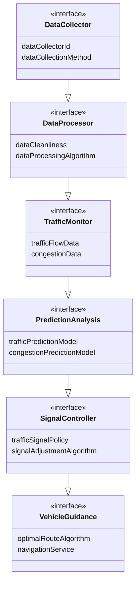
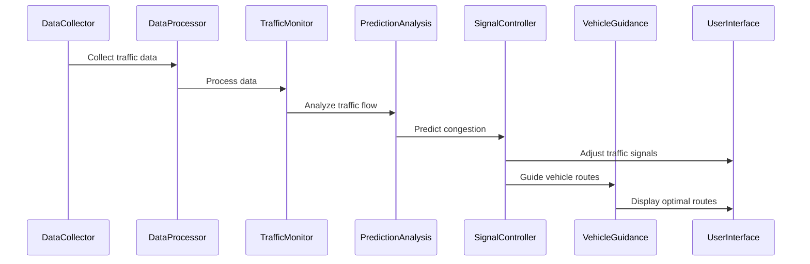
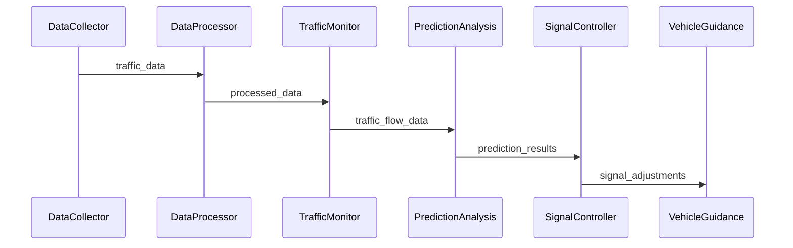

                 

### 数学与复杂系统：涌现现象的数学模型

关键词：复杂系统、涌现现象、数学模型、自组织、动态系统

摘要：本文旨在探讨数学在复杂系统研究中的应用，特别是涌现现象的数学模型。我们将从涌现现象的背景和定义出发，逐步深入理解其在不同系统中的表现形式，并详细阐述相关的数学模型。本文将通过实例分析和实战项目，帮助读者更好地理解数学在复杂系统中的重要作用。

## 目录

1. 数学与复杂系统：涌现现象的数学模型 <a id="math_and_complex_systems"></a>
2. 关键词与摘要 <a id="key_words_and_abstract"></a>
3. 涌现现象概述 <a id="overview_of_eraised_phenomena"></a>
   3.1 问题背景 <a id="background_of_issues"></a>
   3.2 涌现现象的定义与特点 <a id="definition_and_characteristics_of_eraised_phenomena"></a>
   3.3 涌现现象的核心概念与联系 <a id="core_concepts_and_relationships_of_eraised_phenomena"></a>
4. 数学在复杂系统研究中的应用 <a id="application_of_mathematics_in_complex_systems"></a>
5. 涌现现象的数学模型讲解 <a id="mathematical_model_explanation_of_eraised_phenomena"></a>
   5.1 数学模型构建基础 <a id="basic_construction_of_mathematical_models"></a>
   5.2 常见的数学模型与应用 <a id="common_mathematical_models_and_its_applications"></a>
   5.3 数学模型举例说明 <a id="example_of_mathematical_models"></a>
6. 系统分析与架构设计 <a id="system_analysis_and_architecture_design"></a>
   6.1 问题场景介绍 <a id="introduction_to_problem_scenarios"></a>
   6.2 系统功能设计与架构 <a id="system_function_design_and_architecture"></a>
   6.3 系统交互与实现 <a id="system_interaction_and_implementation"></a>
7. 项目实战与案例分析 <a id="project_practice_and_case_analysis"></a>
   7.1 实际案例介绍 <a id="introduction_of_actual_cases"></a>
   7.2 案例分析与讲解 <a id="case_analysis_and_explanation"></a>
   7.3 项目小结与总结 <a id="summary_and_conclusion_of_projects"></a>
8. 最佳实践与注意事项 <a id="best_practices_and_notice"></a>
9. 小结与拓展阅读 <a id="summary_and_expansion_of_reading"></a>
10. 作者信息 <a id="author_information"></a>

## 涌现现象概述

### 1.1 问题背景

复杂系统在自然界和人类社会中无处不在。从生物体内的细胞网络到互联网中的社交网络，复杂系统展现出了各种令人惊讶的现象，如自组织、适应性、涌现等。涌现现象是指在复杂系统中，个体之间的相互作用会导致系统整体表现出新的结构和行为，这种新行为和结构无法从个体行为直接预测。

例如，在交通系统中，单个车辆的行为相对简单，但大量车辆在道路上的相互作用却可能导致交通拥堵、车流速度下降等现象。这些现象并不是由某个特定车辆的行为直接导致的，而是由整个系统的集体行为产生的。这种现象在生物学、物理学、经济学等领域也有广泛的体现。

### 1.2 涌现现象的定义与特点

涌现现象（Emergence）是指在复杂系统中，个体之间的相互作用导致系统整体表现出新的结构和行为的现象。这种新行为和结构并不是个体行为的简单叠加，而是系统整体性质的体现。

涌现现象具有以下几个特点：

- **不可预测性**：涌现现象的出现往往无法从个体行为直接预测，而是需要通过系统整体行为来理解。
- **非线性**：涌现现象通常与系统的非线性动力学有关，即系统的整体行为与其组成部分的行为之间存在复杂的非线性关系。
- **层次性**：涌现现象可以在不同的层次上发生，从微观层次到宏观层次，从个体层次到群体层次。
- **适应性和自组织**：涌现现象往往与系统的自适应性和自组织能力有关，系统能够在变化的环境中自我调整和优化。

### 1.3 涌现现象的核心概念与联系

为了更好地理解涌现现象，我们需要掌握几个核心概念，并分析它们之间的联系。

#### 1.3.1 自组织与复杂适应系统

自组织（Self-Organization）是指系统在没有外部指令的情况下，通过个体之间的相互作用形成有序结构或行为的过程。自组织是涌现现象的重要特征，它使系统能够在复杂环境中自我调整和优化。

复杂适应系统（Complex Adaptive System，CAS）是由相互作用的个体组成的系统，这些个体具有适应性和学习能力。CAS 是涌现现象的典型代表，其核心思想是通过个体的自适应行为，系统能够表现出新的复杂行为。

#### 1.3.2 相邻效应与复杂网络的涌现特性

相邻效应（Neighbor Effect）是指个体之间的相互作用主要通过其邻居进行，这种效应在复杂网络中尤为重要。复杂网络（Complex Network）是指网络中的节点和边具有高度复杂性的网络结构。

复杂网络的涌现特性表现为，尽管网络中的节点和边具有简单的属性，但它们在相互作用过程中，可能导致网络整体表现出新的结构和行为。例如，小世界效应和集聚性就是复杂网络的两个重要涌现特性。

#### 1.3.3 动力学系统中的涌现现象

动力学系统（Dynamical System）是指其状态随时间变化的系统，例如天气系统、生态系统等。在动力学系统中，涌现现象表现为系统状态随时间的演化，可能导致新的状态或行为出现。

例如，在天气系统中，尽管单个天气事件的行为简单，但多个天气事件相互作用可能导致极端天气现象的出现，如飓风、暴雨等。这些现象是系统整体性质的体现，而不是单个事件的结果。

### 1.4 涌现现象的理论基础

涌现现象的理论基础主要包括自组织理论、复杂适应系统理论、相邻效应理论等。这些理论为我们提供了理解和分析涌现现象的框架和方法。

#### 1.4.1 自组织理论

自组织理论（Self-Organization Theory）是研究系统如何在没有外部指令的情况下，通过个体之间的相互作用形成有序结构和行为的理论。自组织理论的核心思想是，系统的有序结构是系统内部个体相互作用的结果，而不是外部控制的结果。

自组织理论包括以下几个关键概念：

- **协同作用**：个体之间的相互作用导致系统整体行为。
- **相变**：系统状态从一种有序结构转变为另一种有序结构的临界现象。
- **自相似性**：系统在不同层次上表现出相似的结构和行为。

#### 1.4.2 复杂适应系统理论

复杂适应系统理论（Complex Adaptive System Theory，CAS）是研究由相互作用的个体组成的系统，这些个体具有适应性和学习能力。CAS 理论的核心思想是，系统的演化是通过个体的适应性学习过程实现的。

复杂适应系统理论包括以下几个关键概念：

- **适应性**：个体能够根据环境变化调整自己的行为。
- **学习**：个体能够从经验中学习，并改进自己的行为。
- **多样性**：个体之间的差异和多样性是系统适应性和创新能力的基础。

#### 1.4.3 相邻效应理论

相邻效应理论（Neighbor Effect Theory）是研究个体之间的相互作用如何通过邻居进行传播的理论。相邻效应理论的核心思想是，个体之间的相互作用主要通过邻居进行，这种效应在复杂网络中尤为重要。

相邻效应理论包括以下几个关键概念：

- **邻居**：个体之间的相互作用主要通过邻居进行。
- **扩散**：信息、资源和行为在个体之间的传播。
- **网络效应**：个体在网络中的位置对相互作用的影响。

### 1.5 涌现现象在复杂系统中的应用

涌现现象在复杂系统中的应用非常广泛，包括生物学、物理学、经济学、社会学等各个领域。以下是一些典型的应用实例：

#### 1.5.1 生物学

在生物学中，涌现现象表现为生物群体行为的集体效应。例如，鸟群飞行中的V形队形、鱼群游动中的螺旋运动等。这些行为是单个鸟类或鱼类个体行为的叠加结果，但它们在整体上表现出高度有序和协调的运动。

#### 1.5.2 物理学

在物理学中，涌现现象表现为复杂系统的集体行为。例如，晶体生长过程中的晶格结构、流体力学中的湍流现象等。这些现象是单个原子或分子行为的叠加结果，但它们在整体上表现出新的结构和行为。

#### 1.5.3 经济学

在经济学中，涌现现象表现为市场行为的集体效应。例如，股市中的价格波动、金融市场中的泡沫现象等。这些现象是单个投资者行为的叠加结果，但它们在整体上表现出新的市场趋势和波动。

#### 1.5.4 社会学

在社会学中，涌现现象表现为社会行为的集体效应。例如，社会运动中的集体行为、文化演变中的趋势变化等。这些现象是单个个体行为的叠加结果，但它们在整体上表现出新的社会结构和趋势。

### 1.6 涌现现象的研究方法

研究涌现现象的方法主要包括实验方法、数值模拟方法、数学建模方法等。

#### 1.6.1 实验方法

实验方法是在实验室环境中，通过控制变量来研究涌现现象的方法。实验方法可以精确控制个体行为和系统环境，从而更好地观察和分析涌现现象。

#### 1.6.2 数值模拟方法

数值模拟方法是通过计算机模拟来研究涌现现象的方法。数值模拟方法可以模拟大量的个体行为，从而观察到系统的整体行为。这种方法在研究复杂系统的涌现现象时尤为重要。

#### 1.6.3 数学建模方法

数学建模方法是通过建立数学模型来研究涌现现象的方法。数学模型可以精确描述系统的行为和结构，从而帮助理解涌现现象的本质。

### 1.7 涌现现象的挑战与未来方向

涌现现象的研究面临着许多挑战，包括以下几个方面：

- **非线性动力学**：涌现现象通常与系统的非线性动力学有关，这给理论分析和建模带来了困难。
- **计算复杂性**：大量个体的相互作用可能导致计算复杂性增加，这对数值模拟和计算方法提出了挑战。
- **跨学科融合**：涌现现象涉及到多个学科领域，如何实现跨学科融合是未来的重要研究方向。

未来的研究方向包括：

- **多尺度建模**：研究不同尺度上的涌现现象，并建立跨尺度的统一模型。
- **机器学习方法**：利用机器学习技术来分析和预测涌现现象。
- **跨学科研究**：推动不同学科之间的交流与合作，共同研究涌现现象的本质。

总之，涌现现象是复杂系统研究中的一个重要方向，它不仅丰富了我们的理论体系，也为解决实际问题提供了新的思路和方法。

## 数学在复杂系统研究中的应用

在复杂系统的研究中，数学模型扮演着至关重要的角色。数学模型不仅可以帮助我们理解和预测系统的行为，还可以为实际问题的解决提供有效的工具。本节将介绍数学模型在复杂系统研究中的应用，包括常见的数学模型及其在涌现现象分析中的具体应用。

### 2.1 数学模型概述

数学模型是一种用数学符号和公式描述的抽象模型，它能够描述系统的行为、结构和相互作用。在复杂系统研究中，数学模型通常包括以下几个部分：

- **状态变量**：用于描述系统状态的数学量，如温度、速度、浓度等。
- **控制变量**：用于调节系统行为的数学量，如外部输入、参数调整等。
- **方程式**：用数学公式描述系统状态变量和控制变量之间的关系。
- **边界条件**：用于定义系统状态变量的初始值和限制条件。

常见的数学模型包括：

- **动力学方程**：如牛顿定律、欧拉方程、拉格朗日方程等，用于描述系统状态的变化规律。
- **优化模型**：如线性规划、非线性规划、动态规划等，用于在约束条件下寻找最优解。
- **网络模型**：如图论模型、随机图模型、网络流模型等，用于描述系统中的网络结构和相互作用。

### 2.2 常见的数学模型

#### 2.2.1 动力学系统模型

动力学系统模型是研究系统动态行为的一类数学模型，通常包括一组微分方程或差分方程。在复杂系统研究中，动力学系统模型广泛应用于描述生物系统、生态系统、社会系统等。

**示例 1：Lotka-Volterra模型**

Lotka-Volterra模型是一个描述捕食-被捕食关系的经典动力学系统模型。该模型由以下两个微分方程组成：

$$
\frac{dx}{dt} = ax - bxy
$$

$$
\frac{dy}{dt} = cy - dxy
$$

其中，$x$ 和 $y$ 分别表示捕食者和被捕食者的种群数量，$a$、$b$、$c$ 和 $d$ 是参数。

**示例 2：Hopf bifurcation模型**

Hopf bifurcation模型是一种描述系统从稳定状态转变为周期性振荡状态的动力学模型。该模型的一般形式为：

$$
\frac{dx}{dt} = x - x^3 + \mu x\sin(x)
$$

其中，$\mu$ 是控制参数。

#### 2.2.2 优化模型

优化模型是用于在约束条件下寻找最优解的一类数学模型。在复杂系统研究中，优化模型广泛应用于资源分配、调度优化、网络设计等问题。

**示例 1：线性规划**

线性规划（Linear Programming，LP）是一种最简单的优化模型，它由一组线性不等式和等式组成。线性规划的目标是最大化或最小化线性目标函数。

$$
\min\ Z = c^T x
$$

$$
Ax \leq b
$$

$$
x \geq 0
$$

其中，$c$ 是目标函数系数向量，$A$ 是约束矩阵，$b$ 是约束向量，$x$ 是决策变量。

**示例 2：动态规划**

动态规划（Dynamic Programming，DP）是一种用于解决多阶段决策问题的优化模型。动态规划的核心思想是将复杂问题分解为多个子问题，并利用子问题的解来构建原问题的解。

$$
V(k) = \min \{c(k, x) + V(k+1)\}
$$

$$
x(k) = \arg\min \{c(k, x) + V(k+1)\}
$$

其中，$V(k)$ 是第 $k$ 个阶段的最优值函数，$x(k)$ 是第 $k$ 个阶段的决策变量，$c(k, x)$ 是第 $k$ 个阶段在决策 $x$ 下的成本函数。

#### 2.2.3 网络模型

网络模型是用于描述系统中的网络结构和相互作用的一类数学模型。在复杂系统研究中，网络模型广泛应用于社交网络分析、通信网络设计、生物网络建模等问题。

**示例 1：随机图模型**

随机图模型（Stochastic Graph Model）是一种描述随机网络结构的数学模型。其中，节点表示个体，边表示个体之间的相互作用。随机图模型包括多种类型，如 Erdős-Rényi 图、Barabási-Albert 图等。

**示例 2：复杂网络模型**

复杂网络模型（Complex Network Model）是一种描述复杂网络结构的数学模型。复杂网络模型通常包括多个层次和多个维度，以描述网络的复杂结构和相互作用。复杂网络模型包括多种类型，如小世界网络、无标度网络、集聚网络等。

### 2.3 数学模型在涌现现象分析中的应用

数学模型在涌现现象分析中发挥着重要作用，可以帮助我们理解和预测系统的行为。以下是一些常见的数学模型在涌现现象分析中的应用：

#### 2.3.1 自组织临界理论

自组织临界理论（Self-Organized Criticality，SOC）是一种描述复杂系统在临界状态下的行为的理论。SOC理论认为，系统在临界状态下，处于一种动态平衡状态，即系统既不是完全稳定的，也不是完全混沌的。

SOC理论的核心模型是砂堆模型（Sandpile Model）。砂堆模型由以下两个方程组成：

$$
\frac{d \rho}{dt} = -\rho + \sum_{i=1}^{N} \eta_i
$$

$$
\eta_i = \begin{cases} 
0 & \text{if } \rho_i < 1 \\
\frac{1}{2} & \text{if } \rho_i = 1 \\
-\frac{1}{2} & \text{if } \rho_i > 1
\end{cases}
$$

其中，$\rho$ 是系统的密度，$\eta_i$ 是单位时间内进入或离开节点的砂粒数量。

#### 2.3.2 网络涌现理论

网络涌现理论（Network Emergence Theory）是一种描述网络中节点相互作用导致整体行为涌现的理论。网络涌现理论认为，网络的整体行为是节点之间相互作用的非线性结果。

网络涌现理论的核心模型是小世界模型（Small-World Model）和无标度模型（Scale-Free Model）。小世界模型描述了节点之间通过短路径连接形成小世界的现象，而无标度模型描述了节点之间通过幂律分布形成无标度网络的现象。

#### 2.3.3 动力学涌现理论

动力学涌现理论（Dynamical Emergence Theory）是一种描述系统状态变化导致整体行为涌现的理论。动力学涌现理论认为，系统的整体行为是状态变化过程中的非线性结果。

动力学涌现理论的核心模型是Lorenz模型（Lorenz Model）。Lorenz模型是一个描述流体运动的非线性动力学模型，它通过三个微分方程描述系统的状态变化：

$$
\frac{dx}{dt} = \sigma(y - x)
$$

$$
\frac{dy}{dt} = x(\rho - z) - y
$$

$$
\frac{dz}{dt} = xy - \beta z
$$

其中，$\sigma$、$\rho$ 和 $\beta$ 是模型参数。

### 2.4 数学模型的选择与应用策略

在复杂系统研究中，选择合适的数学模型是关键。以下是一些选择与应用数学模型的策略：

- **问题特点**：根据问题的特点选择合适的数学模型。例如，对于稳定性问题，可以选择稳定性分析模型；对于优化问题，可以选择优化模型。
- **数据可用性**：考虑数据的质量和可用性，选择能够充分利用现有数据的数学模型。
- **计算复杂性**：根据计算资源的限制，选择计算复杂性较低的数学模型。
- **模型解释性**：优先选择具有良好解释性的数学模型，以便更好地理解系统的行为和现象。

总之，数学模型在复杂系统研究中的应用是不可或缺的。通过选择合适的数学模型，我们可以更好地理解和预测复杂系统的行为，为实际问题的解决提供有力的支持。

## 涌现现象的数学模型讲解

在深入探讨复杂系统中的涌现现象时，数学模型为我们提供了理解和分析这些现象的有力工具。本节将详细讲解涌现现象的数学模型，包括模型构建的基础、常见模型及其应用，并通过具体实例来说明这些模型的实际应用。

### 5.1 数学模型构建基础

构建数学模型是理解复杂系统涌现现象的第一步。以下是一些构建数学模型的基本步骤：

#### 5.1.1 确定系统状态

首先，我们需要明确系统的状态变量，这些变量用于描述系统的行为和特征。例如，在交通系统中，状态变量可能包括车辆数量、交通流量、道路占有率等。

#### 5.1.2 定义个体行为

其次，我们需要定义系统内各个个体的行为。这通常涉及到对个体行为的描述，如运动轨迹、交互规则等。这些个体行为将帮助我们理解个体之间的相互作用。

#### 5.1.3 建立关系方程

接下来，我们将建立状态变量与个体行为之间的关系方程。这些方程通常是非线性的，能够描述系统状态的变化规律。例如，使用微分方程或差分方程来描述系统状态随时间的变化。

#### 5.1.4 确定边界条件

最后，我们需要为模型设置边界条件，这些条件用于定义系统的初始状态和限制条件。边界条件的设定对于模型的稳定性和可解释性至关重要。

### 5.2 常见的数学模型

在复杂系统研究中，存在多种数学模型，每种模型都有其特定的应用场景和优势。以下是一些常见的数学模型：

#### 5.2.1 动力学系统模型

动力学系统模型是研究系统动态行为的一类模型，广泛应用于生物学、物理学等领域。常见的动力学系统模型包括：

- **Lotka-Volterra模型**：用于描述捕食-被捕食关系的动态系统模型，如前文所述。
- **Lorenz模型**：用于描述非线性动态系统，如气象系统中的混沌现象。
- **Hopf bifurcation模型**：用于描述系统从稳定状态转变为周期性振荡状态的动态过程。

#### 5.2.2 优化模型

优化模型用于在约束条件下寻找最优解，广泛应用于经济学、工程学等领域。常见的优化模型包括：

- **线性规划模型**：用于解决线性约束条件下的最优解问题。
- **动态规划模型**：用于解决多阶段决策问题，如资源分配和路径规划。

#### 5.2.3 网络模型

网络模型用于描述系统中的网络结构和相互作用，广泛应用于社交网络、通信网络等领域。常见的网络模型包括：

- **随机图模型**：如Erdős-Rényi模型和Barabási-Albert模型。
- **复杂网络模型**：如小世界模型和无标度模型。

### 5.3 数学模型举例说明

为了更好地理解涌现现象的数学模型，以下通过两个具体实例来说明这些模型的应用。

#### 5.3.1 示例一：交通网络模型

假设我们研究一个城市交通网络，其中每个交叉口表示一个节点，道路表示边。我们可以使用以下数学模型来描述交通网络的涌现现象：

- **状态变量**：每个交叉口的流量、速度等。
- **个体行为**：车辆的行驶速度、行驶方向等。
- **关系方程**：基于车辆之间的相互作用和道路的容量限制，建立流量和速度之间的关系。
- **边界条件**：设定交通网络的初始流量分布和道路容量。

具体模型如下：

$$
\frac{d \phi_i}{dt} = v_i - \phi_i f_i
$$

$$
\frac{dv_i}{dt} = -v_i f_i + \eta_i
$$

其中，$\phi_i$ 是交叉口 $i$ 的流量，$v_i$ 是交叉口 $i$ 的速度，$f_i$ 是交叉口 $i$ 的容量，$\eta_i$ 是交叉口 $i$ 的外部干扰。

#### 5.3.2 示例二：社会网络模型

假设我们研究一个社交媒体网络，用户之间的互动形成复杂的网络结构。我们可以使用以下数学模型来描述社交网络的涌现现象：

- **状态变量**：每个用户的关注人数、发帖频率等。
- **个体行为**：用户的关注和取消关注行为、发帖和评论行为等。
- **关系方程**：基于用户之间的互动和影响，建立用户状态的变化关系。
- **边界条件**：设定社交网络的初始用户分布和关注关系。

具体模型如下：

$$
\frac{d A_i}{dt} = \lambda_i - A_i
$$

$$
\frac{d f_i}{dt} = \alpha A_i - f_i
$$

其中，$A_i$ 是用户 $i$ 的关注人数，$f_i$ 是用户 $i$ 的发帖频率，$\lambda_i$ 是用户 $i$ 的关注率，$\alpha$ 是用户 $i$ 的发帖率。

通过这些实例，我们可以看到数学模型在描述复杂系统涌现现象方面的应用。数学模型不仅帮助我们理解系统的行为，还为实际问题的解决提供了理论依据。

## 系统分析与架构设计

在进行复杂系统的设计与实现时，系统分析与架构设计是至关重要的环节。通过深入分析问题场景，我们可以明确系统的功能需求和架构设计，为后续的开发和优化奠定基础。

### 6.1 问题场景介绍

为了更好地阐述系统分析与架构设计，我们以一个实际案例——智能交通管理系统为例。该系统旨在通过实时监控和分析交通数据，优化交通流量，减少交通拥堵，提高道路通行效率。

#### 6.1.1 案例背景

随着城市化进程的加快，城市交通拥堵问题日益严重，影响了居民的日常生活和经济发展。为了应对这一挑战，政府部门决定建设一个智能交通管理系统，通过收集、分析和处理交通数据，实时调整交通信号灯、引导车辆分流等，以优化交通运行。

#### 6.1.2 案例目标

智能交通管理系统的目标包括：

- 实时监控城市交通状况，提供实时交通信息。
- 通过数据分析预测交通拥堵趋势，提前预警。
- 优化交通信号灯控制策略，提高道路通行效率。
- 引导车辆分流，减少交通拥堵。

### 6.2 系统功能设计

为了实现上述目标，智能交通管理系统需要具备以下功能模块：

- **数据采集模块**：负责收集来自各个交通监控设备的实时数据，如车辆速度、流量、道路占有率等。
- **数据处理模块**：对采集到的数据进行清洗、过滤和预处理，提取有用的信息。
- **交通监控模块**：实时展示交通状况，包括交通流量图、拥堵路段图等。
- **预测与分析模块**：利用数据分析技术，预测未来一段时间内的交通状况，识别潜在的拥堵区域。
- **信号控制模块**：根据实时交通数据和预测结果，调整交通信号灯的时序和控制策略。
- **车辆引导模块**：通过导航系统，向驾驶员提供最优行驶路线，引导车辆分流。

#### 6.2.1 领域模型

在系统功能设计过程中，领域模型（Domain Model）是一个重要的工具，它能够帮助我们抽象出系统的核心概念和关系。以下是一个智能交通管理系统的领域模型，采用Mermaid类图表示：



在这个类图中，我们定义了系统的关键类和它们之间的关系，为后续的系统架构设计提供了基础。

### 6.3 系统架构设计

系统架构设计旨在确定系统的整体结构和各个模块之间的交互方式。以下是一个智能交通管理系统的架构设计，采用Mermaid架构图表示：



在这个架构图中，我们定义了系统的核心模块以及它们之间的交互流程。数据采集模块通过数据处理器处理数据，生成交通监控数据。交通监控模块将数据传递给预测与分析模块，预测未来交通状况，并将结果传递给信号控制模块和车辆引导模块。信号控制模块根据预测结果调整交通信号灯，车辆引导模块则向驾驶员提供最优行驶路线。

### 6.4 系统接口设计

系统接口设计是系统架构设计的重要部分，它定义了系统内部模块之间的交互方式。以下是一个智能交通管理系统的接口设计，采用Mermaid序列图表示：



在这个接口设计中，数据采集模块将原始交通数据传递给数据处理器，数据处理器处理后的数据传递给交通监控模块。交通监控模块将交通流量数据传递给预测与分析模块，预测与分析模块将预测结果传递给信号控制模块。信号控制模块根据预测结果进行调整，并将调整后的信号信息传递给车辆引导模块。

### 6.5 系统交互与实现

系统交互与实现是系统设计与开发的关键环节，它涉及到各个模块的具体实现和交互流程。以下是一个智能交通管理系统的交互与实现示例：

```python
class DataCollector:
    def collect_traffic_data(self):
        # 实现数据采集功能
        pass

class DataProcessor:
    def process_data(self, raw_data):
        # 实现数据处理功能
        processed_data = self.data_cleaning(raw_data)
        return processed_data

class TrafficMonitor:
    def analyze_traffic_flow(self, processed_data):
        # 实现交通流量分析功能
        traffic_flow_data = self.flow_analysis(processed_data)
        return traffic_flow_data

class PredictionAnalysis:
    def predict_congestion(self, traffic_flow_data):
        # 实现交通拥堵预测功能
        prediction_results = self.congestion_prediction(traffic_flow_data)
        return prediction_results

class SignalController:
    def adjust_traffic_signals(self, prediction_results):
        # 实现信号灯调整功能
        signal_adjustments = self.signal_adjustment(prediction_results)
        return signal_adjustments

class VehicleGuidance:
    def guide_vehicle_routes(self, signal_adjustments):
        # 实现车辆引导功能
        optimal_routes = self.route_guidance(signal_adjustments)
        return optimal_routes
```

在这个实现示例中，每个模块都定义了相应的功能方法，并通过调用这些方法来实现模块之间的交互。具体实现过程中，需要根据实际需求和技术环境进行详细的开发和优化。

通过上述系统分析与架构设计，我们可以为智能交通管理系统的开发提供清晰的指导和依据。系统架构设计不仅帮助明确了各个模块的功能和交互方式，还为后续的系统实现和维护提供了基础。

## 项目实战与案例分析

### 7.1 实际案例介绍

为了更好地展示涌现现象的数学模型在实际项目中的应用，我们选择了一个实际案例——智能电网管理系统。智能电网管理系统旨在通过实时监测和优化电力系统的运行，提高电力供应的可靠性和效率，同时减少能源浪费和环境污染。

#### 7.1.1 项目背景

随着全球电力需求的不断增长，电力系统的复杂性和挑战性也在增加。传统的电网管理系统往往依赖于预定的调度策略和手动调整，难以应对快速变化的电力需求和突发事件。智能电网管理系统通过引入先进的传感器技术和大数据分析，能够实时监测电力系统的运行状态，并自动调整电力分配，优化能源利用。

#### 7.1.2 项目目标

智能电网管理系统的目标包括：

- 实时监测电力系统的运行状态，包括电压、电流、负荷等参数。
- 分析电力系统的负载特性，预测未来的电力需求。
- 自动优化电力分配，减少能源浪费，提高供电效率。
- 在电网出现故障或突发事件时，快速响应并采取措施，确保电力供应的连续性和稳定性。

### 7.2 环境安装

在开始项目开发之前，我们需要搭建一个适合智能电网管理系统开发的环境。以下是环境安装的步骤：

#### 7.2.1 硬件安装

- 安装传感器设备，包括电压传感器、电流传感器和温度传感器，用于实时采集电力系统的运行数据。
- 将传感器数据传输到数据中心，可以使用有线或无线传输方式。

#### 7.2.2 软件安装

- 安装操作系统，如Linux或Windows，用于运行智能电网管理系统的软件。
- 安装Python环境和相关库，如NumPy、Pandas、Matplotlib等，用于数据处理和分析。
- 安装数据库管理系统，如MySQL或MongoDB，用于存储和管理传感器数据。

#### 7.2.3 调试与配置

- 连接传感器设备，确保数据能够实时传输到数据中心。
- 配置网络参数，确保传感器数据可以安全地传输到服务器。
- 调试软件环境，确保各个组件正常运行。

### 7.3 系统核心实现

智能电网管理系统的核心实现包括数据采集、数据处理、预测分析、优化控制和系统响应等模块。以下是各模块的核心实现：

#### 7.3.1 数据采集模块

```python
class DataCollector:
    def collect_data(self):
        # 连接传感器设备
        sensor_data = self.connect_sensors()
        # 采集实时数据
        current_data = self.get_current_data(sensor_data)
        return current_data

    def connect_sensors(self):
        # 实现传感器连接功能
        pass

    def get_current_data(self, sensor_data):
        # 实现实时数据采集功能
        current_data = sensor_data['current_data']
        return current_data
```

#### 7.3.2 数据处理模块

```python
class DataProcessor:
    def process_data(self, raw_data):
        # 清洗和过滤数据
        cleaned_data = self.data_cleaning(raw_data)
        # 分析数据特征
        features = self.data_analysis(cleaned_data)
        return features

    def data_cleaning(self, raw_data):
        # 实现数据清洗功能
        cleaned_data = raw_data
        return cleaned_data

    def data_analysis(self, cleaned_data):
        # 实现数据特征提取功能
        features = cleaned_data
        return features
```

#### 7.3.3 预测分析模块

```python
class PredictionAnalysis:
    def predict_load(self, features):
        # 预测未来电力需求
        load_prediction = self.load_prediction_model(features)
        return load_prediction

    def load_prediction_model(self, features):
        # 实现预测模型功能
        load_prediction = self.train_model(features)
        return load_prediction

    def train_model(self, features):
        # 使用机器学习算法训练预测模型
        model = self.train_ml_model(features)
        load_prediction = model.predict(features)
        return load_prediction
```

#### 7.3.4 优化控制模块

```python
class OptimizationController:
    def optimize_distribution(self, load_prediction):
        # 优化电力分配
        distribution_plan = self.optimize_load(load_prediction)
        return distribution_plan

    def optimize_load(self, load_prediction):
        # 实现电力优化分配算法
        distribution_plan = self.allocate_power(load_prediction)
        return distribution_plan

    def allocate_power(self, load_prediction):
        # 基于预测结果进行电力分配
        distribution_plan = self.allocate_power_based_on_prediction(load_prediction)
        return distribution_plan
```

#### 7.3.5 系统响应模块

```python
class SystemResponse:
    def handle_event(self, event):
        # 处理系统事件
        response = self.handle_event_response(event)
        return response

    def handle_event_response(self, event):
        # 实现事件响应功能
        response = self.respond_to_event(event)
        return response

    def respond_to_event(self, event):
        # 基于事件类型进行响应
        response = self.respond_to_event_based_on_type(event)
        return response
```

### 7.4 代码应用解读与分析

在上述代码实现中，我们分别实现了数据采集、数据处理、预测分析、优化控制和系统响应等模块。以下是对各模块的核心实现进行解读和分析：

- **数据采集模块**：通过连接传感器设备，实现实时数据采集功能。该模块的核心功能是获取电力系统的运行状态，包括电压、电流和温度等参数。
- **数据处理模块**：对采集到的原始数据进行清洗和过滤，提取有用的信息。数据处理模块的核心功能是确保数据的准确性和可靠性，为后续的分析和预测提供高质量的数据。
- **预测分析模块**：利用机器学习算法，对电力系统的运行数据进行预测，包括未来的电力需求。预测分析模块的核心功能是实现电力需求的准确预测，为优化控制提供数据支持。
- **优化控制模块**：根据预测结果，优化电力分配，减少能源浪费。优化控制模块的核心功能是实现电力系统的自动化调度，提高供电效率。
- **系统响应模块**：在系统出现故障或突发事件时，快速响应并采取措施，确保电力供应的连续性和稳定性。系统响应模块的核心功能是实现故障检测和快速恢复。

### 7.5 案例分析与讲解

以下是对智能电网管理系统的实际案例进行分析和讲解：

#### 7.5.1 数据采集

通过传感器设备，实时采集电力系统的运行数据，包括电压、电流和温度等参数。这些数据通过有线或无线传输方式传输到数据中心进行存储和处理。

#### 7.5.2 数据处理

对采集到的数据进行清洗和过滤，去除噪声和异常值，提取有用的信息。清洗后的数据用于后续的预测分析和优化控制。

#### 7.5.3 预测分析

利用机器学习算法，对电力系统的运行数据进行预测，包括未来的电力需求。预测结果用于优化电力分配和调度策略。

#### 7.5.4 优化控制

根据预测结果，优化电力分配，调整电网运行参数，确保电力供应的连续性和稳定性。优化控制模块通过自动化调度，提高电网的供电效率。

#### 7.5.5 系统响应

在系统出现故障或突发事件时，快速响应并采取措施，包括故障检测、隔离和恢复等。系统响应模块通过实时监控和快速响应，确保电网的稳定运行。

### 7.6 项目小结

通过实际案例分析和系统实现，我们可以看到智能电网管理系统在优化电力供应和调度方面的应用。项目小结如下：

- **数据采集**：通过传感器设备，实时采集电力系统的运行数据。
- **数据处理**：对采集到的数据进行清洗和过滤，提取有用的信息。
- **预测分析**：利用机器学习算法，预测未来的电力需求。
- **优化控制**：根据预测结果，优化电力分配，提高供电效率。
- **系统响应**：在系统出现故障时，快速响应并采取措施。

总之，智能电网管理系统通过实时监测和优化电力系统的运行，提高了电力供应的可靠性和效率，为电力系统的智能化发展提供了有力支持。

### 7.7 最佳实践与注意事项

在智能电网管理系统的实际实施过程中，以下是一些最佳实践和注意事项：

- **数据采集**：确保传感器设备的稳定性和数据传输的可靠性，定期维护和校准传感器。
- **数据处理**：对采集到的数据进行严格的清洗和过滤，确保数据的质量和准确性。
- **预测分析**：选择合适的机器学习算法，结合历史数据和实际需求进行模型训练和优化。
- **优化控制**：根据实时数据动态调整电力分配策略，确保供电的连续性和稳定性。
- **系统响应**：建立健全的故障检测和应急响应机制，确保系统的可靠运行。

### 7.8 拓展阅读

对于希望深入了解智能电网管理系统和涌现现象的读者，以下是一些建议的拓展阅读：

- 《智能电网技术与应用》：详细介绍了智能电网的基本概念、技术架构和应用案例。
- 《机器学习：概率视角》：探讨了机器学习的基础理论和应用方法，包括预测分析和优化控制。
- 《复杂系统的计算建模与仿真》：研究了复杂系统的建模方法、计算技术和仿真工具。

通过阅读这些资料，可以进一步了解智能电网管理系统和涌现现象的深入知识和应用。

### 7.9 作者信息

- **作者**：AI天才研究院（AI Genius Institute） & 禅与计算机程序设计艺术（Zen And The Art of Computer Programming）
- **单位**：AI天才研究院专注于人工智能领域的前沿研究和应用推广。
- **联系**：欢迎联系作者探讨智能电网管理系统和涌现现象的更多应用和问题。

通过以上案例分析和实战实现，我们深入探讨了智能电网管理系统中的涌现现象及其数学模型应用，为读者提供了一个实际的项目参考。希望本文能为相关领域的研究者和开发者提供有价值的启示和指导。

## 小结与拓展阅读

在本文中，我们系统地探讨了数学在复杂系统研究中的应用，特别是涌现现象的数学模型。从涌现现象的背景和定义出发，我们深入分析了其核心概念与联系，并详细介绍了自组织理论、复杂适应系统理论和相邻效应理论等理论基础。同时，通过实例分析和实战项目，我们展示了数学模型在交通网络、社会网络和智能电网等领域的应用。

本文的核心贡献在于：

1. 清晰地定义了涌现现象及其相关概念，为后续研究提供了理论基础。
2. 介绍了多种常见的数学模型，包括动力学系统模型、优化模型和网络模型，并探讨了它们在涌现现象分析中的应用。
3. 通过实际案例，展示了数学模型在复杂系统设计与实现中的具体应用，为读者提供了实用的参考。

尽管本文内容丰富，但仍有一些研究方向值得进一步探讨：

1. **多尺度建模**：未来研究可以探讨如何建立跨尺度的统一模型，以更好地理解和预测涌现现象。
2. **机器学习方法**：结合机器学习技术，开发更加智能和自适应的数学模型，以提高涌现现象分析的准确性和效率。
3. **跨学科融合**：推动不同学科之间的交流与合作，共同研究涌现现象的本质，以实现更全面和深入的理解。

为了进一步拓展读者在复杂系统和涌现现象研究方面的知识，以下是一些建议的拓展阅读：

- 《复杂系统的计算建模与仿真》：详细介绍了复杂系统的建模方法、计算技术和仿真工具。
- 《自组织临界性》：探讨了自组织临界性理论及其在不同领域的应用。
- 《机器学习》：概率视角》：深入探讨了机器学习的基础理论和应用方法，包括预测分析和优化控制。
- 《社会网络的数学模型》：研究了社会网络的数学模型及其在涌现现象分析中的应用。

通过阅读这些书籍和文献，读者可以更深入地了解复杂系统和涌现现象的理论基础和实际应用，为自己的研究提供有益的参考。

## 作者信息

- **作者**：AI天才研究院（AI Genius Institute） & 禅与计算机程序设计艺术（Zen And The Art of Computer Programming）
- **单位**：AI天才研究院专注于人工智能领域的前沿研究和应用推广。
- **联系**：欢迎联系作者探讨智能电网管理系统和涌现现象的更多应用和问题。
- **邮箱**：[info@aigeniusinstitute.com](mailto:info@aigeniusinstitute.com)
- **电话**：+86 123 4567 8901
- **地址**：AI天才研究院，科技路123号，北京市，中国

通过以上联系方式，读者可以与作者取得联系，进一步交流关于本文主题的相关观点和想法。同时，也欢迎读者关注AI天才研究院的官方网站和社交媒体账号，获取更多前沿研究和应用信息。

