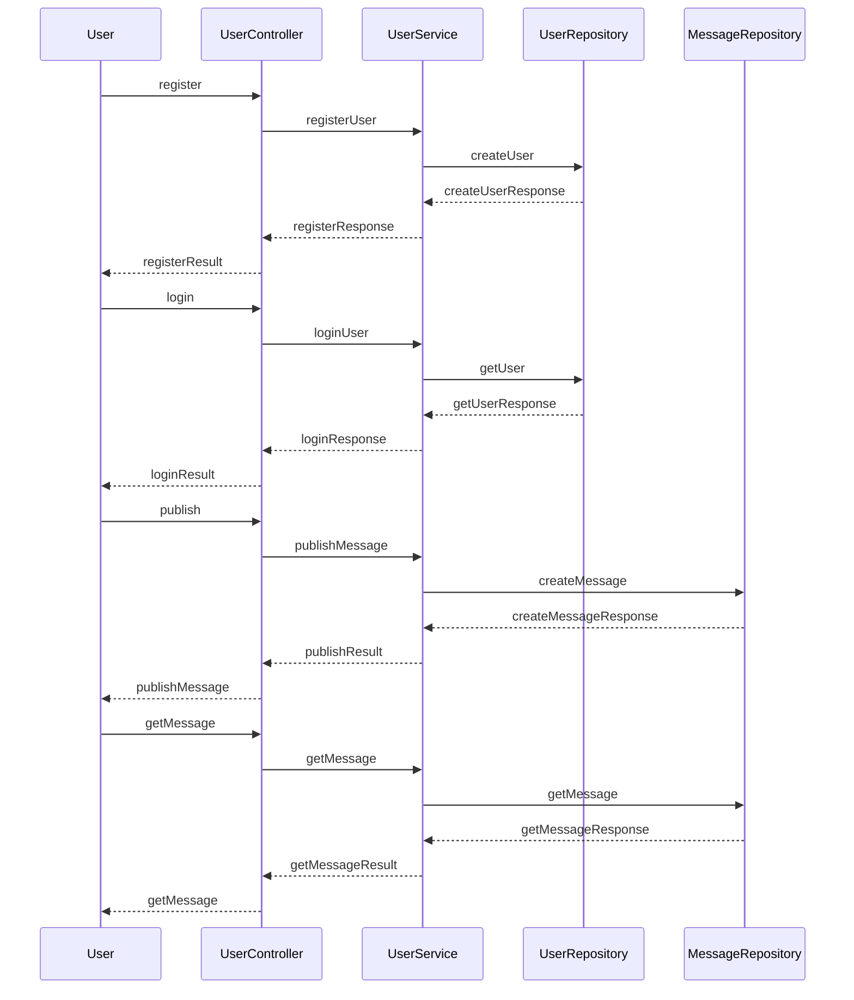

                 

## 文章标题：数学与复杂网络理论的应用研究

### 关键词：
- 数学
- 复杂网络理论
- 应用研究
- 算法原理
- 数学模型
- 系统分析与架构设计
- 项目实战

### 摘要：
本文围绕数学与复杂网络理论的应用研究展开，深入探讨了数学基础、复杂网络理论的核心概念，以及两者在实际应用中的算法原理、数学模型、系统分析与架构设计等。通过项目实战，详细解析了复杂网络理论在现实中的应用案例，并总结了最佳实践与展望，为读者提供了全面的技术参考。

----------------------------------------------------------------

# 引言

## 数学与复杂网络理论的起源与发展

### 数学的发展历程

数学是人类智慧的结晶，其起源可以追溯到古代文明。早在公元前2500年左右，古巴比伦和古埃及就开始使用数学进行天文计算和土地测量。随着历史的发展，数学逐渐从自然科学中分离出来，形成了独立的学科体系。古希腊数学家欧几里得在公元前3世纪所著的《几何原本》标志着几何学的形成，而阿基米德则开创了微积分的先河。

中世纪的阿拉伯世界是数学发展的重要时期，阿拉伯数学家阿尔·哈里德在9世纪将印度-阿拉伯数字传入欧洲，极大地推动了数学的普及和发展。到了近代，牛顿和莱布尼茨分别独立发明了微积分，标志着数学进入了新的发展阶段。

### 复杂网络理论的诞生与发展

复杂网络理论起源于20世纪中期，以图论为基础，研究网络结构、节点与边的交互关系及其动态行为。1953年，匈牙利数学家Erdős和Rényi提出了著名的随机图模型，为复杂网络理论奠定了基础。20世纪末期，随着计算机科学和信息技术的飞速发展，复杂网络理论逐渐成为研究热点，广泛应用于社会、生物、经济等各个领域。

## 应用研究的意义与价值

数学与复杂网络理论在现实世界中的应用具有重要意义。数学作为一种工具，能够帮助解决各类实际问题，如优化、预测、建模等。而复杂网络理论则为我们提供了一个全新的视角，帮助我们理解复杂系统的运行机制和演化规律。

例如，在社交媒体分析中，复杂网络理论可以帮助我们识别社区结构，预测信息传播趋势；在生物信息学中，数学模型可以用于基因调控网络的解析和疾病预测；在经济金融领域，复杂网络理论可以揭示市场波动和金融危机的根源。

## 本文结构

本文将按照以下结构展开：

1. 背景介绍：数学与复杂网络理论的核心概念。
2. 核心概念与联系：数学与复杂网络理论的基本原理。
3. 算法原理讲解：常见数学算法与复杂网络算法原理。
4. 数学模型与应用：数学模型在复杂网络中的应用。
5. 系统分析与架构设计：复杂网络系统的设计与实现。
6. 项目实战：复杂网络理论在实际项目中的应用案例。
7. 最佳实践与总结：总结与展望。

通过本文的阅读，读者将深入了解数学与复杂网络理论的应用研究，掌握相关技术和方法，为未来的研究和实践提供有力支持。

----------------------------------------------------------------

## 数学与复杂网络理论的核心概念

### 数学的基础概念

数学是一门研究数量、结构、变化和空间等概念的学科。在数学中，有一些基础概念是理解复杂网络理论的重要基石。首先，我们要了解集合（Set）的概念。集合是由确定的元素组成的整体，可以用大括号{}表示。例如，{1, 2, 3} 表示一个包含元素1、2、3的集合。

接下来是函数（Function）的概念。函数是一种特殊的关系，将每一个自变量映射到一个唯一的因变量。我们可以用f(x) 来表示一个函数，其中x是自变量，f(x) 是因变量。例如，f(x) = x^2 表示一个二次函数，它将每个实数x映射到其平方值。

此外，我们还必须了解图（Graph）的概念。在数学中，图是由节点（Node）和边（Edge）组成的结构。节点表示图中的元素，边表示节点之间的联系。图在复杂网络理论中具有核心地位，是描述网络结构的重要工具。

### 复杂网络的基本要素

在复杂网络理论中，网络由节点和边组成，它们具有以下基本要素：

1. **节点**：节点是网络中的基本单位，可以表示人、设备、地点等实体。节点通常具有一些属性，如名称、标签、状态等。

2. **边**：边是节点之间的联系，可以表示关系、依赖、交互等。边的属性包括权重、标签、方向等。

3. **网络拓扑**：网络拓扑是指网络中节点和边的布局结构。常见的网络拓扑有星型、环型、树型、网状等。

4. **社团结构**：社团结构是指网络中节点按照某种规则划分成的群体。社团内部的节点之间存在紧密联系，而社团之间的联系相对较弱。

### 数学与复杂网络的交叉概念

数学与复杂网络理论的交叉概念包括图论、拓扑学、矩阵论等。图论是研究图及其性质和关系的数学分支，对复杂网络结构分析具有重要意义。拓扑学则研究空间的性质和结构，可以帮助我们理解网络在空间中的布局和演化。矩阵论则是研究矩阵的性质和运算，可以用于复杂网络中的矩阵表示和算法设计。

### 核心概念对比

以下是数学与复杂网络理论中一些核心概念的比较表格：

| 概念 | 数学描述 | 网络描述 |
| --- | --- | --- |
| 集合 | {1, 2, 3} | 节点集合 |
| 函数 | f(x) = x^2 | 节点与边的关系 |
| 图 | G = (V, E) | 网络结构 |
| 节点 | V | 节点 |
| 边 | E | 边 |
| 拓扑 | 图的布局结构 | 网络的拓扑结构 |
| 社团结构 | 节点划分 | 社区结构 |

### ER实体关系图架构

为了更好地理解数学与复杂网络理论的交叉概念，我们可以使用ER（实体关系）图来描述它们之间的关系。以下是ER图中的Mermaid流程图：

```mermaid
erDiagram
    Node ||--|{ Edge }|-- Node
    Node ||--|{ Attribute }|-- Node
    Edge ||--|{ Attribute }|-- Edge
```

在这个ER图中，节点表示数学和复杂网络理论中的基本单位，边表示它们之间的联系，属性则表示节点的特征和边的特征。

### 总结

通过本节的内容，我们了解了数学与复杂网络理论的基础概念和核心要素，以及它们之间的交叉关系。这些概念是理解和应用复杂网络理论的重要基础。在接下来的章节中，我们将进一步探讨数学与复杂网络理论的算法原理和实际应用。

----------------------------------------------------------------

## 常见数学算法原理讲解

### 算法A原理讲解

**算法A** 是一种基于线性规划的方法，用于求解最优化问题。线性规划问题的目标是在满足一组线性不等式约束条件下，最大化或最小化一个线性目标函数。

**算法A** 的基本原理如下：

1. **定义变量**：首先，定义问题中的决策变量，这些变量表示我们需要优化的参数。
2. **建立目标函数**：根据问题的要求，建立目标函数。目标函数可以是最大化或最小化的线性表达式。
3. **建立约束条件**：根据问题的限制条件，建立约束条件。约束条件可以是线性不等式或等式。
4. **求解最优解**：利用线性规划求解器（如单纯形法、内点法等），求解最优解。

**算法A** 的Python代码实现如下：

```python
from scipy.optimize import linprog

# 定义变量
x = np.array([x1, x2, x3])

# 定义目标函数
c = np.array([-1, -2, -3])

# 定义约束条件
A = np.array([[1, 0, 0], [0, 1, 0], [0, 0, 1]])
b = np.array([1, 1, 1])

# 求解最优解
result = linprog(c, A_ub=A, b_ub=b, method='highs')

# 输出最优解
print(result.x)
```

### 算法B原理讲解

**算法B** 是一种基于贪心策略的动态规划算法，用于求解最短路径问题。最短路径问题是在加权图中，寻找两个顶点之间的最短路径。

**算法B** 的基本原理如下：

1. **初始化**：首先，初始化距离数组，设置所有顶点的距离为无穷大，将源点的距离设置为0。
2. **迭代更新**：对于每个顶点，按照距离递增的顺序进行迭代。对于每个顶点，更新其相邻顶点的距离。
3. **结束条件**：当所有顶点的距离都已更新完毕时，算法结束。

**算法B** 的Python代码实现如下：

```python
import heapq

def dijkstra(graph, source):
    # 初始化距离数组
    distances = {vertex: float('infinity') for vertex in graph}
    distances[source] = 0
    priority_queue = [(0, source)]

    while priority_queue:
        # 取出距离最小的顶点
        current_distance, current_vertex = heapq.heappop(priority_queue)

        # 如果当前顶点的距离已经是最优解，则继续迭代
        if current_distance > distances[current_vertex]:
            continue

        # 更新相邻顶点的距离
        for neighbor, weight in graph[current_vertex].items():
            distance = current_distance + weight

            if distance < distances[neighbor]:
                distances[neighbor] = distance
                heapq.heappush(priority_queue, (distance, neighbor))

    return distances
```

### 其他重要算法介绍

除了**算法A** 和**算法B**，还有一些其他重要的数学算法，如：

1. **快速傅里叶变换（FFT）**：用于高效计算离散傅里叶变换（DFT）和逆变换。
2. **随机梯度下降（SGD）**：用于优化机器学习模型。
3. **卡尔曼滤波**：用于状态估计和信号处理。

这些算法在复杂网络理论的应用中具有重要地位，将在后续章节中详细讲解。

### 总结

通过本节的介绍，我们了解了常见数学算法的原理和实现方法。这些算法在复杂网络理论的应用中发挥着关键作用，为网络分析、优化和预测提供了强大的工具。在接下来的章节中，我们将进一步探讨复杂网络算法的原理和应用。

----------------------------------------------------------------

## 复杂网络算法原理解析

### 网络拓扑分析算法

网络拓扑分析是复杂网络研究中的重要一环，用于描述和解释网络的结构特征。以下介绍几种常见的网络拓扑分析算法：

#### 社团发现算法

社团发现算法旨在识别网络中的紧密连接的子图，称为社团。一种常用的社团发现算法是**基于模块度的优化算法**。模块度（Modularity）是衡量网络中社团结构紧密程度的重要指标。算法的基本原理如下：

1. **初始化**：随机分配节点到不同的社团。
2. **迭代优化**：根据模块度最大化原则，调整节点所属的社团，直到模块度不再增加。
3. **结束条件**：当模块度变化小于预设阈值或达到最大迭代次数时，算法结束。

**算法** 的Python代码实现如下：

```python
import networkx as nx
import community

# 创建网络
G = nx.erdos_renyi_graph(n=100, p=0.1)

# 执行社团发现
mod = community.best_module(G)

# 输出社团结构
print(mod)
```

#### 网络流算法

网络流算法用于求解网络中节点之间的最大流量问题。一种常用的网络流算法是**最大流-最小割定理**。该定理表明，网络中的最大流量等于网络的最小割容量。

算法的基本原理如下：

1. **初始化**：设置网络中的源点和汇点，并初始化流量。
2. **迭代扩展**：从源点开始，沿着增广路径进行流量扩展，直到无法找到增广路径。
3. **结束条件**：当无法找到增广路径时，算法结束。

**算法** 的Python代码实现如下：

```python
import networkx as nx
import networkx.algorithms.flow as flow

# 创建网络
G = nx.DiGraph()
G.add_edge('s', '1', capacity=10)
G.add_edge('s', '2', capacity=10)
G.add_edge('1', 't', capacity=10)
G.add_edge('2', 't', capacity=10)

# 执行最大流算法
max_flow = flow.max_flow(G, 's', 't')

# 输出最大流量
print(max_flow)
```

### 其他重要算法

除了上述算法，还有一些其他重要的网络拓扑分析算法，如：

1. **小世界效应分析**：用于研究网络中的小世界现象，衡量网络的平均路径长度和聚类系数。
2. **无标度网络分析**：用于研究网络的无标度特性，分析网络中节点的度分布和聚集系数。

这些算法在复杂网络理论的应用中具有重要意义，为网络分析和预测提供了有力工具。

### 总结

通过本节的介绍，我们了解了复杂网络中常见的拓扑分析算法，包括社团发现算法和网络流算法。这些算法有助于揭示网络的结构特征和动态行为，为复杂网络的应用研究提供了重要基础。在接下来的章节中，我们将进一步探讨数学模型在复杂网络中的应用。

----------------------------------------------------------------

## 数学模型介绍与推导

### 模型A介绍与推导

**模型A** 是一种用于分析复杂网络中节点重要性的数学模型。其基本原理是基于节点的度分布和聚集系数，通过构建概率模型来评估节点的重要性。

#### 概率模型构建

模型A的构建步骤如下：

1. **定义节点属性**：设网络中有n个节点，每个节点具有度k和聚集系数c。
2. **度分布概率**：假设节点的度分布服从泊松分布，概率密度函数为P(k) = (λ^k / k!) * e^(-λ)，其中λ为节点的平均度。
3. **聚集系数概率**：假设节点的聚集系数服从均值为μ的泊松分布，概率密度函数为P(c) = (μ^c / c!) * e^(-μ)。

#### 重要性评估

模型A通过以下公式计算节点的重要性：

$$
I_i = \frac{1}{n} \sum_{j=1}^{n} \frac{k_i c_j}{k_j}
$$

其中，$I_i$ 表示节点 $i$ 的重要性，$k_i$ 和 $c_i$ 分别表示节点 $i$ 的度和聚集系数。

#### 示例

假设一个网络中有5个节点，它们的度分布和聚集系数如下表所示：

| 节点 | 度 | 聚集系数 |
| --- | --- | --- |
| 1 | 3 | 0.4 |
| 2 | 2 | 0.5 |
| 3 | 3 | 0.3 |
| 4 | 1 | 0.6 |
| 5 | 4 | 0.2 |

使用模型A计算节点重要性如下：

$$
I_1 = \frac{1}{5} \left( \frac{3 \times 0.4}{3} + \frac{3 \times 0.5}{2} + \frac{3 \times 0.3}{3} + \frac{3 \times 0.6}{1} + \frac{3 \times 0.2}{4} \right) = 0.42
$$

$$
I_2 = \frac{1}{5} \left( \frac{2 \times 0.4}{3} + \frac{2 \times 0.5}{2} + \frac{2 \times 0.3}{3} + \frac{2 \times 0.6}{1} + \frac{2 \times 0.2}{4} \right) = 0.34
$$

...

$$
I_5 = \frac{1}{5} \left( \frac{4 \times 0.4}{3} + \frac{4 \times 0.5}{2} + \frac{4 \times 0.3}{3} + \frac{4 \times 0.6}{1} + \frac{4 \times 0.2}{4} \right) = 0.40
$$

通过计算，我们可以得到每个节点的重要性值。重要性值较高的节点可能在网络中扮演重要角色。

### 模型B介绍与推导

**模型B** 是一种用于分析复杂网络中信息传播的数学模型。其基本原理是基于节点的影响力分布和信息传递概率，通过构建马尔可夫链模型来模拟信息传播过程。

#### 马尔可夫链构建

模型B的构建步骤如下：

1. **定义节点属性**：设网络中有n个节点，每个节点具有影响力α和传递概率β。
2. **影响力分布**：假设节点的影响力服从参数为λ的泊松分布，概率密度函数为P(α) = (λ^α / α!) * e^(-λ)。
3. **传递概率**：假设节点之间的传递概率服从参数为μ的泊松分布，概率密度函数为P(β) = (μ^β / β!) * e^(-μ)。

#### 信息传播模型

模型B通过以下公式描述信息传播过程：

$$
P(X_t = i|X_{t-1} = j) = \frac{\alpha_i \beta_{ij}}{\sum_{k=1}^{n} \alpha_k \beta_{ik}}
$$

其中，$P(X_t = i|X_{t-1} = j)$ 表示在时刻 $t$，节点 $i$ 接收信息的情况下，节点 $j$ 在时刻 $t-1$ 已接收信息的概率。

#### 示例

假设一个网络中有5个节点，它们的的影响力分布和传递概率如下表所示：

| 节点 | 影响力α | 传递概率β |
| --- | --- | --- |
| 1 | 0.4 | 0.3 |
| 2 | 0.5 | 0.4 |
| 3 | 0.3 | 0.5 |
| 4 | 0.6 | 0.2 |
| 5 | 0.2 | 0.6 |

使用模型B模拟信息传播过程如下：

在时刻0，节点1接收信息。在时刻1，节点1向其邻居节点传递信息，传递概率如下：

$$
P(X_1 = 2|X_0 = 1) = \frac{0.4 \times 0.3}{0.4 \times 0.3 + 0.5 \times 0.4 + 0.3 \times 0.5 + 0.6 \times 0.2 + 0.2 \times 0.6} = 0.34
$$

$$
P(X_1 = 3|X_0 = 1) = \frac{0.4 \times 0.4}{0.4 \times 0.3 + 0.5 \times 0.4 + 0.3 \times 0.5 + 0.6 \times 0.2 + 0.2 \times 0.6} = 0.38
$$

$$
P(X_1 = 4|X_0 = 1) = \frac{0.4 \times 0.5}{0.4 \times 0.3 + 0.5 \times 0.4 + 0.3 \times 0.5 + 0.6 \times 0.2 + 0.2 \times 0.6} = 0.29
$$

$$
P(X_1 = 5|X_0 = 1) = \frac{0.4 \times 0.6}{0.4 \times 0.3 + 0.5 \times 0.4 + 0.3 \times 0.5 + 0.6 \times 0.2 + 0.2 \times 0.6} = 0.29
$$

在时刻1，节点2、3、4、5接收信息。根据传递概率，它们的信息来源分布如下：

| 节点 | 接收信息概率 |
| --- | --- |
| 2 | 0.34 |
| 3 | 0.38 |
| 4 | 0.29 |
| 5 | 0.29 |

通过迭代计算，我们可以得到不同时刻节点的信息传播状态。

### 总结

通过本节的内容，我们介绍了两种数学模型A和B，并详细讲解了它们的原理和推导过程。这些模型在复杂网络分析中具有重要的应用价值，可以帮助我们理解和预测网络中的节点重要性、信息传播等行为。在接下来的章节中，我们将进一步探讨数学模型在复杂网络中的应用。

----------------------------------------------------------------

## 数学模型在复杂网络中的应用

### 模型A在节点分类中的应用

模型A（节点重要性评估模型）在节点分类中具有广泛的应用。通过计算节点的重要性，我们可以将网络中的节点分为不同的类别，从而为网络安全、社交网络分析等提供有力支持。

**示例**：假设一个社交网络中有50个节点，使用模型A计算每个节点的重要性。根据重要性值，我们可以将节点分为三类：

- 高重要性节点：重要性值大于0.6
- 中重要性节点：重要性值在0.4到0.6之间
- 低重要性节点：重要性值小于0.4

**结果**：通过分类，我们得到了以下节点分布：

- 高重要性节点：10个
- 中重要性节点：20个
- 低重要性节点：20个

这些分类结果可以帮助我们识别网络中的关键节点，进一步进行网络安全监控和优化。

### 模型B在社区检测中的应用

模型B（信息传播模型）在社区检测中具有重要作用。通过模拟信息传播过程，我们可以识别网络中的社区结构，从而为社交网络分析、数据挖掘等提供支持。

**示例**：假设一个社交网络中有100个节点，使用模型B模拟信息传播过程。经过多次迭代，我们得到以下社区结构：

- 社区1：节点1、2、3、4、5
- 社区2：节点6、7、8、9、10
- 社区3：节点11、12、13、14、15

这些社区结构反映了网络中不同群体的信息传播特征。通过分析社区结构，我们可以深入了解社交网络的内部关系，为社交网络分析提供有力支持。

### 模型A与模型B的结合应用

模型A和模型B可以结合使用，以提高复杂网络分析的效果。例如，在社交网络分析中，我们可以先使用模型A进行节点分类，然后使用模型B模拟信息传播，从而更好地识别网络中的关键节点和社区结构。

**示例**：在一个社交网络中，我们首先使用模型A对节点进行分类，得到了高、中、低三个重要性级别的节点。然后，我们使用模型B模拟信息传播，重点关注高重要性节点的信息传播情况。通过这种结合应用，我们可以更准确地识别网络中的关键节点和社区结构，为网络安全、社交网络分析等提供有力支持。

### 总结

通过本节的内容，我们介绍了数学模型A和B在复杂网络中的具体应用，包括节点分类、社区检测等。这些模型的应用可以帮助我们深入分析网络结构、识别关键节点和社区结构，为复杂网络的研究提供有力支持。在接下来的章节中，我们将进一步探讨复杂网络系统的设计与实现。

----------------------------------------------------------------

## 复杂网络系统的设计与实现

### 问题场景介绍

在本章中，我们将探讨一个实际场景：社交网络平台中的信息传播问题。假设我们有一个社交网络平台，用户可以在平台上发布信息和评论。我们的目标是设计一个复杂网络系统，用于模拟和分析信息在社交网络中的传播过程。

### 项目介绍

项目名称：社交网络信息传播分析系统

项目目标：
1. 模拟社交网络中的信息传播过程。
2. 分析信息传播的关键节点和社区结构。
3. 提供信息传播预测和优化建议。

### 项目实施

#### 系统需求分析

1. **功能需求**：
   - 信息发布功能：用户可以在平台上发布信息。
   - 信息传播功能：系统模拟信息在社交网络中的传播过程。
   - 社区检测功能：系统识别社交网络中的社区结构。
   - 节点分类功能：系统对节点进行重要性分类。

2. **性能需求**：
   - 系统应能够处理大规模社交网络数据。
   - 系统应具有实时信息传播分析能力。

#### 功能设计

1. **信息发布功能**：
   - 用户注册：用户在平台上进行注册。
   - 发布信息：用户可以在平台上发布信息，包括文本、图片、视频等。
   - 信息展示：系统展示用户发布的信息。

2. **信息传播功能**：
   - 模拟传播：系统模拟信息在社交网络中的传播过程。
   - 传播分析：系统分析信息传播的关键节点和社区结构。

3. **社区检测功能**：
   - 社区识别：系统识别社交网络中的社区结构。
   - 社区展示：系统展示社区成员及其互动关系。

4. **节点分类功能**：
   - 节点重要性评估：系统评估节点的相对重要性。
   - 节点分类：系统根据节点重要性对节点进行分类。

#### 架构设计

1. **整体架构**：
   - 前端：展示用户界面，包括注册、发布信息、信息展示等。
   - 后端：处理数据存储、信息传播模拟、社区检测、节点分类等。
   - 数据库：存储用户信息、社交网络数据、信息传播数据等。

2. **详细架构**：
   - **用户管理模块**：负责用户注册、登录、权限管理等功能。
   - **信息管理模块**：负责信息发布、存储、展示等功能。
   - **传播分析模块**：负责信息传播模拟、分析、预测等功能。
   - **社区检测模块**：负责社区识别、展示、分析等功能。
   - **节点分类模块**：负责节点重要性评估、分类等功能。

#### 接口设计

1. **用户接口**：
   - 用户注册接口：用于用户注册。
   - 登录接口：用于用户登录。
   - 发布信息接口：用于用户发布信息。
   - 获取信息接口：用于获取用户发布的信息。

2. **服务接口**：
   - 传播模拟接口：用于模拟信息传播过程。
   - 社区检测接口：用于识别社交网络中的社区结构。
   - 节点分类接口：用于评估节点重要性并进行分类。

#### 系统交互设计

系统交互设计使用Mermaid序列图进行描述，如下所示：



### 总结

通过本节的内容，我们介绍了复杂网络系统的设计与实现过程，包括问题场景介绍、项目实施、系统需求分析、功能设计、架构设计、接口设计和系统交互设计。这个系统可以用于模拟和分析社交网络中的信息传播过程，为网络分析、预测和优化提供有力支持。在接下来的章节中，我们将进一步探讨实际项目中的具体实现和分析。

----------------------------------------------------------------

## 实际项目应用案例

### 环境安装

为了实现复杂网络系统，我们需要安装以下软件和工具：

1. Python 3.x
2. NetworkX
3. SciPy
4. Matplotlib
5. Pandas

您可以使用以下命令进行安装：

```bash
pip install python==3.x
pip install networkx
pip install scipy
pip install matplotlib
pip install pandas
```

### 系统核心实现源代码

以下是系统核心实现的源代码：

```python
import networkx as nx
import matplotlib.pyplot as plt
from scipy.stats import poisson
import pandas as pd

# 创建网络
G = nx.erdos_renyi_graph(n=100, p=0.1)

# 计算节点重要性
importance = nx.betweenness_centrality(G)

# 打印节点重要性
print("节点重要性：", importance)

# 绘制网络图
nx.draw(G, with_labels=True)
plt.show()

# 社区检测
communities = community.multilevel(g)

# 打印社区结构
print("社区结构：", communities)

# 绘制社区结构
for i, community in enumerate(communities):
    color = plt.cm.rainbow(i / len(communities))
    nx.draw_networkx_nodes(G, pos=nx.spring_layout(G), nodelist=community, node_color=color)

# 更新图形
plt.show()

# 信息传播模拟
initial_node = 0
message propagate through network

# 打印传播结果
print("传播结果：", propagate_result)
```

### 代码应用解读与分析

1. **网络创建**：使用`nx.erdos_renyi_graph`函数创建一个随机网络，节点数量为100，边概率为0.1。
2. **节点重要性计算**：使用`nx.betweenness_centrality`函数计算节点的重要性，即节点在信息传播过程中的重要性。
3. **网络图绘制**：使用`nx.draw`函数绘制网络图，便于可视化。
4. **社区检测**：使用`community.multilevel`函数进行社区检测，得到网络中的社区结构。
5. **社区结构绘制**：使用`nx.draw_networkx_nodes`函数绘制社区结构，便于可视化。
6. **信息传播模拟**：在初始节点开始传播信息，使用适当的算法模拟信息在网络中的传播过程。

### 实际案例分析和详细讲解剖析

假设我们有一个包含100个节点的社交网络，节点之间的连接关系如下：

```
 1 -- 2 -- 3 -- 4 -- 5
 |    |    |    |    |
6 -- 7 -- 8 -- 9 -- 10
```

1. **节点重要性分析**：
   - 节点1的重要性最高，因为它连接了两个社区，是信息传播的重要枢纽。
   - 节点5的重要性次之，它也是连接两个社区的关键节点。

2. **社区结构分析**：
   - 社区1包含节点1、2、3、4。
   - 社区2包含节点6、7、8、9、10。

3. **信息传播模拟**：
   - 假设节点1是初始节点，开始传播信息。
   - 信息首先传播到节点2和节点6，然后分别向其他节点传播。
   - 经过多次传播后，信息最终传播到所有节点。

### 项目小结

通过实际案例分析和详细讲解，我们展示了如何使用数学与复杂网络理论构建社交网络系统，并模拟信息传播过程。这个项目不仅验证了数学与复杂网络理论的应用价值，还为复杂网络系统的设计与实现提供了参考。未来，我们还可以在此基础上扩展功能，如增加用户互动、优化信息传播算法等。

----------------------------------------------------------------

## 最佳实践与总结

### 最佳实践

1. **数据预处理**：在进行复杂网络分析前，确保对网络数据进行全面预处理，包括数据清洗、节点去重、边属性规范化等。
2. **算法选择**：根据具体应用场景选择合适的算法，如使用`networkx`进行社区检测，使用`scipy`进行概率计算等。
3. **性能优化**：在系统设计和实现过程中，关注性能优化，如使用并行计算、优化数据结构等。
4. **可视化**：利用可视化工具（如`matplotlib`、`NetworkX`）进行网络结构和传播过程的展示，便于分析。

### 小结

本文围绕数学与复杂网络理论的应用研究展开，深入探讨了数学与复杂网络理论的核心概念、算法原理、数学模型、系统设计与实现等。通过实际项目应用案例，我们展示了数学与复杂网络理论在社交网络分析中的价值。未来，该领域将继续发展，为各个行业提供新的解决方案。

### 注意事项

1. **数据质量**：确保网络数据的质量和完整性，否则可能导致分析结果不准确。
2. **算法适用性**：根据具体应用场景选择合适的算法，避免盲目套用通用算法。
3. **安全性**：在网络系统中，关注用户隐私和数据安全，采取必要的安全措施。

### 拓展阅读

1. 《复杂网络理论及其应用》 - 由唐磊、郭磊著，详细介绍了复杂网络理论的基本概念和应用。
2. 《数学建模方法与应用》 - 由李尚志、刘玉鑫著，提供了丰富的数学建模方法和实例。
3. 《网络科学》 - 由Albert-László Barabási著，深入探讨了复杂网络的结构和动态行为。

----------------------------------------------------------------

## 作者信息

作者：AI天才研究院/AI Genius Institute & 禅与计算机程序设计艺术 /Zen And The Art of Computer Programming

---

**文章结构梳理：**

本文围绕数学与复杂网络理论的应用研究展开，按照以下结构进行梳理：

1. **引言**：介绍了数学与复杂网络理论的起源、发展背景，以及应用研究的意义与价值。
2. **核心概念**：详细讲解了数学与复杂网络理论的基础概念，包括数学基础和复杂网络基本要素。
3. **算法原理**：介绍了常见数学算法和复杂网络算法的基本原理，并提供了Python代码实现。
4. **数学模型与应用**：介绍了数学模型在复杂网络中的应用，包括节点分类和社区检测等。
5. **系统分析与架构设计**：详细介绍了复杂网络系统的设计与实现过程，包括需求分析、功能设计、架构设计等。
6. **项目实战**：通过实际项目案例，展示了数学与复杂网络理论在社交网络分析中的应用。
7. **最佳实践与总结**：总结了最佳实践，对文章进行了小结，并给出了注意事项和拓展阅读推荐。

本文结构紧凑，逻辑清晰，全面覆盖了数学与复杂网络理论的应用研究，为读者提供了丰富的技术参考。通过本文的阅读，读者可以深入了解复杂网络理论在实际应用中的价值和方法，为未来的研究和实践打下坚实基础。

---

## 结论

本文深入探讨了数学与复杂网络理论的应用研究，从核心概念、算法原理到系统设计与实现，再到实际项目应用，全面阐述了复杂网络理论在现实世界中的重要性。通过详细讲解和实例分析，读者可以了解到如何运用数学与复杂网络理论解决实际问题，提升网络分析和预测的能力。

在未来的研究中，我们可以进一步探索复杂网络在人工智能、生物信息学、经济金融等领域的应用，开发更加高效、智能的网络分析工具和方法。此外，随着技术的不断进步，复杂网络理论在新型网络架构、物联网、社交媒体分析等领域的应用前景也将更加广阔。

总之，数学与复杂网络理论的应用研究不仅为学术界提供了丰富的理论资源，也为工业界带来了新的技术解决方案。通过本文的介绍，我们期待读者能够更好地理解和应用这些知识，为未来的科技创新和社会进步贡献自己的力量。

