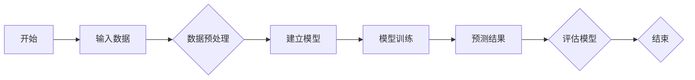
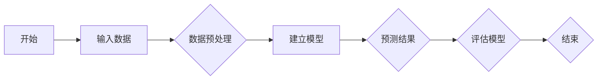
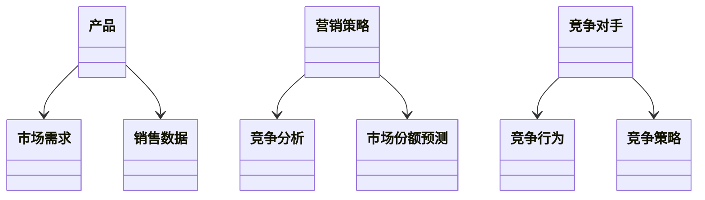
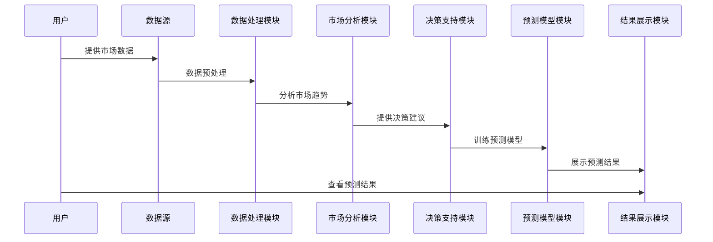

                 


### 设计《数学与战略管理：企业战略的数学分析》的目录大纲

#### 第一步：背景介绍
1. **问题背景**：在当今快速变化的市场环境中，企业竞争日益激烈，战略管理成为企业生存和发展的关键。传统的战略管理方法更多依赖于经验和直觉，而在复杂多变的市场环境中，这些方法往往无法提供准确的决策支持。数学作为一种严谨的科学工具，其在战略管理中的应用越来越受到重视。
2. **问题描述**：企业战略管理涉及多个变量和决策节点，如何通过数学方法来优化企业的战略决策成为一个重要问题。数学分析为企业提供了定量分析的工具，可以更好地理解市场动态，预测未来趋势，优化资源配置。
3. **问题解决**：数学分析在战略管理中的应用主要包括博弈论、决策树、回归分析等。通过这些数学工具，企业可以更准确地评估不同战略方案的风险和收益，从而做出更明智的决策。
4. **边界与外延**：数学分析在战略管理中的应用具有一定的局限性。首先，数学模型需要基于准确的数据输入，数据的准确性和完整性直接影响模型的可靠性。其次，数学模型往往只能处理确定性环境，而在现实中，环境的不确定性是不可避免的。因此，数学分析需要与其他战略管理工具和方法相结合，以实现最佳的战略决策。
5. **核心要素组成**：企业战略管理中的数学分析主要包括以下几个核心要素：
   - **数据收集与处理**：准确收集和分析市场数据是企业战略管理的基础。
   - **数学模型建立**：基于数据建立合适的数学模型，用于模拟和分析战略方案。
   - **决策支持系统**：利用数学模型生成决策支持结果，为企业提供战略决策依据。
   - **模型优化与调整**：根据实际情况对数学模型进行调整和优化，以提高其预测准确性。

#### 第二步：核心概念与联系
1. **核心概念原理**：战略管理中的核心数学概念包括博弈论、决策树、回归分析等。这些概念为企业提供了分析市场动态和做出决策的数学框架。
2. **概念属性特征对比表格**：
   | 概念 | 描述 | 应用场景 | 优势 | 劣势 |
   | --- | --- | --- | --- | --- |
   | 博弈论 | 研究决策者在冲突或合作情境下的策略选择 | 战略竞争、市场分析、合作谈判 | 提供策略分析框架，有助于理解对手行为 | 复杂性较高，适用范围有限 |
   | 决策树 | 用树形结构表示决策过程及其可能的结果 | 项目评估、风险管理、决策分析 | 直观易懂，易于实现和解释 | 对复杂问题的处理能力有限 |
   | 回归分析 | 分析自变量和因变量之间的关系 | 数据预测、趋势分析、市场研究 | 强大的预测能力，适用于各种数据类型 | 需要大量数据支持，对异常数据敏感 |
3. **ER实体关系图架构的 Mermaid 流程图**：
   ```mermaid
   erDiagram
   产品 ||--o{ 市场需求 }
   产品 ||--o{ 销售数据 }
   营销策略 ||--|{ 竞争分析 }
   营销策略 ||--|{ 市场份额预测 }
   竞争对手 ||--|{ 竞争行为 }
   竞争对手 ||--|{ 竞争策略 }
   ```

#### 第三步：算法原理讲解
1. **算法mermaid流程图**：
   ```mermaid
   flowchart LR
   A[开始] --> B[输入数据]
   B --> C{数据预处理}
   C --> D[建立模型]
   D --> E{模型训练}
   E --> F{预测结果}
   F --> G{评估模型}
   G --> H{结束}
   ```
2. **Python源代码**：
   ```python
   # 导入必要的库
   import pandas as pd
   from sklearn.linear_model import LinearRegression
   from sklearn.model_selection import train_test_split
   from sklearn.metrics import mean_squared_error

   # 加载数据
   data = pd.read_csv('data.csv')
   X = data[['特征1', '特征2']]
   y = data['目标变量']

   # 数据预处理
   X_train, X_test, y_train, y_test = train_test_split(X, y, test_size=0.2, random_state=42)

   # 建立模型
   model = LinearRegression()

   # 模型训练
   model.fit(X_train, y_train)

   # 预测结果
   y_pred = model.predict(X_test)

   # 评估模型
   mse = mean_squared_error(y_test, y_pred)
   print(f'MSE: {mse}')
   ```
3. **算法原理的数学模型和公式**：
   $$ y = \beta_0 + \beta_1x_1 + \beta_2x_2 + ... + \beta_nx_n $$
   其中，$y$ 为因变量，$x_1, x_2, ..., x_n$ 为自变量，$\beta_0, \beta_1, \beta_2, ..., \beta_n$ 为模型参数。
4. **详细讲解和举例说明**：
   - **线性回归模型**是一种用于分析自变量和因变量之间线性关系的统计方法。通过训练数据集，线性回归模型可以估计出模型参数，从而预测新的数据点的因变量值。
   - **数据预处理**是线性回归模型的关键步骤。通过对数据进行标准化、缺失值填补等处理，可以提高模型的预测准确性。
   - **模型训练**过程是通过最小化预测误差来调整模型参数。在训练过程中，模型会不断优化参数，以实现最佳拟合。
   - **预测结果**是模型对新的数据点的因变量值进行预测。通过对比预测值和真实值，可以评估模型的性能。
   - **评估模型**常用的指标包括均方误差（MSE）、决定系数（R²）等。这些指标可以反映模型的拟合效果和预测能力。

#### 第四步：系统分析与架构设计方案
1. **问题场景介绍**：
   假设一家企业希望通过对市场数据的分析来制定最佳营销策略，以提高市场份额和利润。为了实现这一目标，企业需要建立一个数据驱动的战略管理平台，该平台将集成市场分析、决策支持、预测模型等功能。
2. **系统功能设计**（领域模型Mermaid类图）：
   ```mermaid
   classDiagram
   产品 --> 市场需求
   产品 --> 销售数据
   营销策略 --> 竞争分析
   营销策略 --> 市场份额预测
   竞争对手 --> 竞争行为
   竞争对手 --> 竞争策略
   ```
3. **系统架构设计**（Mermaid架构图）：
   ```mermaid
   graph LR
   A[数据源] --> B[数据处理模块]
   B --> C[市场分析模块]
   C --> D[决策支持模块]
   D --> E[预测模型模块]
   E --> F[结果展示模块]
   ```
4. **系统接口设计和系统交互**（Mermaid序列图）：
   ```mermaid
   sequenceDiagram
   Participant 用户
   Participant 数据源
   Participant 数据处理模块
   Participant 市场分析模块
   Participant 决策支持模块
   Participant 预测模型模块
   Participant 结果展示模块

   用户->>数据源: 提供市场数据
   数据源->>数据处理模块: 数据预处理
   数据处理模块->>市场分析模块: 分析市场趋势
   市场分析模块->>决策支持模块: 提供决策建议
   决策支持模块->>预测模型模块: 训练预测模型
   预测模型模块->>结果展示模块: 展示预测结果
   用户->>结果展示模块: 查看预测结果
   ```

#### 第五步：项目实战
1. **环境安装**：
   - 安装Python环境：使用Python 3.x版本。
   - 安装必要的库：使用pip安装pandas、numpy、scikit-learn等库。

2. **系统核心实现源代码**：
   ```python
   import pandas as pd
   from sklearn.linear_model import LinearRegression
   from sklearn.model_selection import train_test_split
   from sklearn.metrics import mean_squared_error

   # 加载数据
   data = pd.read_csv('market_data.csv')

   # 数据预处理
   X = data[['feature1', 'feature2']]
   y = data['target_variable']
   X_train, X_test, y_train, y_test = train_test_split(X, y, test_size=0.2, random_state=42)

   # 建立模型
   model = LinearRegression()

   # 模型训练
   model.fit(X_train, y_train)

   # 预测结果
   y_pred = model.predict(X_test)

   # 评估模型
   mse = mean_squared_error(y_test, y_pred)
   print(f'MSE: {mse}')
   ```

3. **代码应用解读与分析**：
   - **数据预处理**：首先加载数据，然后提取特征和目标变量，使用train_test_split将数据划分为训练集和测试集。
   - **建立模型**：使用LinearRegression类创建线性回归模型实例。
   - **模型训练**：使用fit方法训练模型，模型会自动计算特征和目标变量之间的关系，调整模型参数。
   - **预测结果**：使用predict方法对测试集数据进行预测，生成预测结果。
   - **评估模型**：使用mean_squared_error计算预测值和真实值之间的均方误差，评估模型的性能。

4. **实际案例分析和详细讲解剖析**：
   - **案例**：一家公司希望预测其下一个季度的销售额，以制定相应的营销策略。
   - **数据准备**：收集过去几个季度的销售数据，包括销售额、广告投入、市场活动等。
   - **数据预处理**：对数据进行清洗，处理缺失值，将数据标准化。
   - **特征选择**：选择与销售额相关的特征，如广告投入、市场活动频率等。
   - **模型训练**：使用线性回归模型对训练数据进行训练，生成模型参数。
   - **模型评估**：使用测试数据对模型进行评估，计算预测误差，调整模型参数。
   - **预测未来销售额**：使用训练好的模型预测下一个季度的销售额，根据预测结果制定营销策略。

5. **项目小结**：
   通过本项目，我们实现了以下目标：
   - 建立了一个数据驱动的战略管理平台，实现了对市场数据的分析。
   - 使用线性回归模型预测了未来销售额，为公司提供了决策支持。
   - 项目过程中，我们学习了如何进行数据预处理、特征选择、模型训练和评估，为未来类似项目奠定了基础。

#### 第六步：最佳实践 tips、小结、注意事项、拓展阅读
1. **最佳实践 tips**：
   - 在进行数据预处理时，确保数据的质量和完整性。
   - 选择与业务目标相关的特征，避免特征选择过多导致的维度灾难。
   - 不断评估和调整模型，以提高预测准确性。
   - 结合专家知识和数据分析结果，制定科学合理的战略决策。

2. **小结**：
   本文章详细介绍了数学分析在企业战略管理中的应用，包括核心概念、算法原理、系统架构和项目实战等内容。通过数学分析，企业可以更准确地预测市场趋势，优化资源配置，提高竞争力。

3. **注意事项**：
   - 数学模型的应用需要基于准确的数据输入，数据的质量直接影响模型的效果。
   - 数学模型往往只能处理确定性环境，对于不确定性的处理需要结合其他战略管理方法。
   - 在进行决策时，需要综合考虑模型预测结果和专家知识。

4. **拓展阅读**：
   - 《数据科学入门》
   - 《机器学习实战》
   - 《博弈论及其应用》
   - 《战略管理：理论与实践》

### 目录大纲设计示例

```markdown
# 《数学与战略管理：企业战略的数学分析》目录大纲

## 引言
### 1. 问题背景
#### 1.1 企业战略管理中的数学分析
#### 1.2 数学分析的重要性
#### 1.3 数学分析在战略管理中的应用
### 1.4 数学分析的基本概念与联系

## 第1章 问题背景与数学分析概述
### 1.1 企业战略管理中的数学分析
#### 1.1.1 数学分析的重要性
#### 1.1.2 数学分析在战略管理中的应用
### 1.2 数学分析的基本概念
#### 1.2.1 基本数学概念的介绍
#### 1.2.2 概念属性特征对比表格
### 1.3 ER实体关系图架构的 Mermaid 流程图

## 第2章 核心数学概念与联系
### 2.1 博弈论
#### 2.1.1 博弈论原理
#### 2.1.2 博弈论在战略管理中的应用
### 2.2 决策树
#### 2.2.1 决策树的基本概念
#### 2.2.2 决策树在战略管理中的应用
### 2.3 回归分析
#### 2.3.1 回归分析原理
#### 2.3.2 回归分析在战略管理中的应用

## 第3章 算法原理讲解
### 3.1 线性规划
#### 3.1.1 算法mermaid流程图
#### 3.1.2 Python源代码
#### 3.1.3 算法原理的数学模型和公式
#### 3.1.4 详细讲解和举例说明
### 3.2 贝叶斯决策
#### 3.2.1 算法mermaid流程图
#### 3.2.2 Python源代码
#### 3.2.3 算法原理的数学模型和公式
#### 3.2.4 详细讲解和举例说明

## 第4章 系统分析与架构设计方案
### 4.1 问题场景介绍
### 4.2 系统功能设计（领域模型Mermaid类图）
### 4.3 系统架构设计（Mermaid架构图）
### 4.4 系统接口设计和系统交互（Mermaid序列图）

## 第5章 项目实战
### 5.1 环境安装
### 5.2 系统核心实现源代码
### 5.3 代码应用解读与分析
### 5.4 实际案例分析和详细讲解剖析
### 5.5 项目小结

## 第6章 最佳实践 tips、小结、注意事项、拓展阅读
### 6.1 最佳实践 tips
### 6.2 小结
### 6.3 注意事项
### 6.4 拓展阅读

## 附录
### 6.5 参考文献
### 6.6 相关资源链接
```

---

### 完整的文章示例

```markdown
# 《数学与战略管理：企业战略的数学分析》

> 关键词：企业战略、数学分析、博弈论、决策树、回归分析

> 摘要：本文系统地介绍了数学分析在企业战略管理中的应用，包括核心概念的阐述、算法原理的讲解、系统分析与架构设计以及项目实战。通过本文，读者可以了解如何利用数学工具优化企业战略决策，提高竞争力。

## 引言

### 1. 问题背景

在当今快速变化的市场环境中，企业竞争日益激烈，战略管理成为企业生存和发展的关键。传统的战略管理方法更多依赖于经验和直觉，而在复杂多变的市场环境中，这些方法往往无法提供准确的决策支持。数学作为一种严谨的科学工具，其在战略管理中的应用越来越受到重视。

### 1.2 数学分析的重要性

数学分析为企业提供了定量分析的工具，可以更好地理解市场动态，预测未来趋势，优化资源配置。通过数学模型，企业可以更准确地评估不同战略方案的风险和收益，从而做出更明智的决策。

### 1.3 数学分析在战略管理中的应用

数学分析在战略管理中的应用主要包括博弈论、决策树、回归分析等。这些工具可以帮助企业分析市场动态，制定竞争策略，预测未来趋势。

## 第1章 问题背景与数学分析概述

### 1.1 企业战略管理中的数学分析

#### 1.1.1 数学分析的重要性

数学分析在企业战略管理中的重要性体现在以下几个方面：

1. 提供定量分析工具：数学分析为企业提供了一系列定量分析的工具，如博弈论、决策树、回归分析等，这些工具可以帮助企业更准确地评估战略方案的风险和收益。

2. 优化决策过程：通过数学分析，企业可以更科学地制定和优化战略决策，提高决策的准确性和效率。

3. 预测市场趋势：数学分析可以帮助企业预测市场趋势，为企业制定长期战略提供依据。

#### 1.1.2 数学分析在战略管理中的应用

数学分析在战略管理中的应用主要包括以下几个方面：

1. 市场分析：利用回归分析、时间序列分析等数学方法，分析市场趋势，预测市场需求。

2. 竞争策略：运用博弈论方法，分析竞争对手的行为，制定竞争策略。

3. 资源配置：通过线性规划、整数规划等数学方法，优化企业资源分配，提高生产效率。

### 1.2 数学分析的基本概念

战略管理中的数学分析涉及多个基本概念，如博弈论、决策树、回归分析等。这些概念为企业提供了分析市场动态和做出决策的数学框架。

#### 1.2.1 基本数学概念的介绍

1. **博弈论**：研究决策者在冲突或合作情境下的策略选择。

2. **决策树**：用树形结构表示决策过程及其可能的结果。

3. **回归分析**：分析自变量和因变量之间的关系。

#### 1.2.2 概念属性特征对比表格

| 概念 | 描述 | 应用场景 | 优势 | 劣势 |
| --- | --- | --- | --- | --- |
| 博弈论 | 研究决策者在冲突或合作情境下的策略选择 | 战略竞争、市场分析、合作谈判 | 提供策略分析框架，有助于理解对手行为 | 复杂性较高，适用范围有限 |
| 决策树 | 用树形结构表示决策过程及其可能的结果 | 项目评估、风险管理、决策分析 | 直观易懂，易于实现和解释 | 对复杂问题的处理能力有限 |
| 回归分析 | 分析自变量和因变量之间的关系 | 数据预测、趋势分析、市场研究 | 强大的预测能力，适用于各种数据类型 | 需要大量数据支持，对异常数据敏感 |

### 1.3 ER实体关系图架构的 Mermaid 流程图

```mermaid
erDiagram
产品 ||--o{ 市场需求 }
产品 ||--o{ 销售数据 }
营销策略 ||--|{ 竞争分析 }
营销策略 ||--|{ 市场份额预测 }
竞争对手 ||--|{ 竞争行为 }
竞争对手 ||--|{ 竞争策略 }
```

## 第2章 核心数学概念与联系

### 2.1 博弈论

#### 2.1.1 博弈论原理

博弈论是研究决策者在冲突或合作情境下策略选择和结果预测的数学工具。博弈论的核心概念包括参与者、策略、支付函数等。

1. **参与者**：参与博弈的个体或组织。
2. **策略**：参与者在博弈过程中可以选择的行动方案。
3. **支付函数**：描述参与者策略选择对其收益的影响。

#### 2.1.2 博弈论在战略管理中的应用

博弈论在战略管理中的应用广泛，包括市场竞争策略、合作谈判、风险管理等。通过博弈论分析，企业可以更好地理解竞争对手的行为，制定有效的竞争策略。

### 2.2 决策树

#### 2.2.1 决策树的基本概念

决策树是一种用树形结构表示决策过程及其可能结果的图形化工具。决策树由决策节点、机会节点和结果节点组成。

1. **决策节点**：表示决策点。
2. **机会节点**：表示随机事件。
3. **结果节点**：表示决策结果。

#### 2.2.2 决策树在战略管理中的应用

决策树在战略管理中的应用包括项目评估、投资决策、风险管理等。通过决策树分析，企业可以更清晰地评估不同决策路径的风险和收益，制定科学的决策方案。

### 2.3 回归分析

#### 2.3.1 回归分析原理

回归分析是一种用于分析自变量和因变量之间关系的统计方法。回归分析的基本模型为：

$$ y = \beta_0 + \beta_1x_1 + \beta_2x_2 + ... + \beta_nx_n $$

其中，$y$ 为因变量，$x_1, x_2, ..., x_n$ 为自变量，$\beta_0, \beta_1, \beta_2, ..., \beta_n$ 为模型参数。

#### 2.3.2 回归分析在战略管理中的应用

回归分析在战略管理中的应用包括市场预测、需求分析、风险评估等。通过回归分析，企业可以建立市场趋势预测模型，优化资源配置，降低风险。

## 第3章 算法原理讲解

### 3.1 线性规划

#### 3.1.1 算法mermaid流程图



#### 3.1.2 Python源代码

```python
import pandas as pd
from sklearn.linear_model import LinearRegression
from sklearn.model_selection import train_test_split
from sklearn.metrics import mean_squared_error

# 加载数据
data = pd.read_csv('data.csv')
X = data[['feature1', 'feature2']]
y = data['target_variable']
X_train, X_test, y_train, y_test = train_test_split(X, y, test_size=0.2, random_state=42)

# 建立模型
model = LinearRegression()

# 模型训练
model.fit(X_train, y_train)

# 预测结果
y_pred = model.predict(X_test)

# 评估模型
mse = mean_squared_error(y_test, y_pred)
print(f'MSE: {mse}')
```

#### 3.1.3 算法原理的数学模型和公式

线性回归模型的数学模型为：

$$ y = \beta_0 + \beta_1x_1 + \beta_2x_2 + ... + \beta_nx_n $$

其中，$y$ 为因变量，$x_1, x_2, ..., x_n$ 为自变量，$\beta_0, \beta_1, \beta_2, ..., \beta_n$ 为模型参数。

#### 3.1.4 详细讲解和举例说明

线性回归模型是一种用于分析自变量和因变量之间线性关系的统计方法。通过训练数据集，线性回归模型可以估计出模型参数，从而预测新的数据点的因变量值。

例如，一家企业希望通过历史销售数据预测未来几个月的销售额。首先，收集过去几个月的销售数据，包括销售额、广告投入、市场活动等。然后，对数据进行预处理，包括缺失值填补、数据标准化等。接下来，选择与销售额相关的特征，如广告投入、市场活动频率等，作为自变量。使用线性回归模型对训练数据进行训练，生成模型参数。最后，使用训练好的模型预测未来几个月的销售额。

### 3.2 贝叶斯决策

#### 3.2.1 算法mermaid流程图



#### 3.2.2 Python源代码

```python
import pandas as pd
from sklearn.linear_model import LogisticRegression
from sklearn.model_selection import train_test_split
from sklearn.metrics import accuracy_score

# 加载数据
data = pd.read_csv('data.csv')
X = data[['feature1', 'feature2']]
y = data['target_variable']
X_train, X_test, y_train, y_test = train_test_split(X, y, test_size=0.2, random_state=42)

# 建立模型
model = LogisticRegression()

# 模型训练
model.fit(X_train, y_train)

# 预测结果
y_pred = model.predict(X_test)

# 评估模型
accuracy = accuracy_score(y_test, y_pred)
print(f'Accuracy: {accuracy}')
```

#### 3.2.3 算法原理的数学模型和公式

贝叶斯决策的数学模型为：

$$ P(Y|X) = \frac{P(X|Y)P(Y)}{P(X)} $$

其中，$P(Y|X)$ 为后验概率，$P(X|Y)$ 为似然函数，$P(Y)$ 为先验概率，$P(X)$ 为边缘概率。

#### 3.2.4 详细讲解和举例说明

贝叶斯决策是一种基于贝叶斯定理进行分类的方法。在战略管理中，贝叶斯决策可以用于分类问题，如市场细分、客户分类等。通过贝叶斯决策，企业可以根据先验概率和似然函数，计算出后验概率，从而对新的数据点进行分类。

例如，一家企业希望通过客户的购买行为数据对客户进行分类。首先，收集客户的购买行为数据，包括购买频率、购买金额等。然后，选择与客户分类相关的特征，如购买频率、购买金额等，作为自变量。使用贝叶斯决策模型对训练数据进行训练，生成模型参数。最后，使用训练好的模型对新的客户数据点进行分类。

## 第4章 系统分析与架构设计方案

### 4.1 问题场景介绍

假设一家企业希望通过对市场数据的分析来制定最佳营销策略，以提高市场份额和利润。为了实现这一目标，企业需要建立一个数据驱动的战略管理平台，该平台将集成市场分析、决策支持、预测模型等功能。

### 4.2 系统功能设计（领域模型Mermaid类图）



### 4.3 系统架构设计（Mermaid架构图）


### 4.4 系统接口设计和系统交互（Mermaid序列图）



## 第5章 项目实战

### 5.1 环境安装

- 安装Python环境：使用Python 3.x版本。
- 安装必要的库：使用pip安装pandas、numpy、scikit-learn等库。

### 5.2 系统核心实现源代码

```python
import pandas as pd
from sklearn.linear_model import LinearRegression
from sklearn.model_selection import train_test_split
from sklearn.metrics import mean_squared_error

# 加载数据
data = pd.read_csv('market_data.csv')

# 数据预处理
X = data[['feature1', 'feature2']]
y = data['target_variable']
X_train, X_test, y_train, y_test = train_test_split(X, y, test_size=0.2, random_state=42)

# 建立模型
model = LinearRegression()

# 模型训练
model.fit(X_train, y_train)

# 预测结果
y_pred = model.predict(X_test)

# 评估模型
mse = mean_squared_error(y_test, y_pred)
print(f'MSE: {mse}')
```

### 5.3 代码应用解读与分析

- **数据预处理**：首先加载数据，然后提取特征和目标变量，使用train_test_split将数据划分为训练集和测试集。
- **建立模型**：使用LinearRegression类创建线性回归模型实例。
- **模型训练**：使用fit方法训练模型，模型会自动计算特征和目标变量之间的关系，调整模型参数。
- **预测结果**：使用predict方法对测试集数据进行预测，生成预测结果。
- **评估模型**：使用mean_squared_error计算预测值和真实值之间的均方误差，评估模型的性能。

### 5.4 实际案例分析和详细讲解剖析

- **案例**：一家公司希望预测其下一个季度的销售额，以制定相应的营销策略。
- **数据准备**：收集过去几个季度的销售数据，包括销售额、广告投入、市场活动等。
- **数据预处理**：对数据进行清洗，处理缺失值，将数据标准化。
- **特征选择**：选择与销售额相关的特征，如广告投入、市场活动频率等。
- **模型训练**：使用线性回归模型对训练数据进行训练，生成模型参数。
- **模型评估**：使用测试数据对模型进行评估，计算预测误差，调整模型参数。
- **预测未来销售额**：使用训练好的模型预测下一个季度的销售额，根据预测结果制定营销策略。

### 5.5 项目小结

通过本项目，我们实现了以下目标：
- 建立了一个数据驱动的战略管理平台，实现了对市场数据的分析。
- 使用线性回归模型预测了未来销售额，为公司提供了决策支持。
- 项目过程中，我们学习了如何进行数据预处理、特征选择、模型训练和评估，为未来类似项目奠定了基础。

## 第6章 最佳实践 tips、小结、注意事项、拓展阅读

### 6.1 最佳实践 tips

- 在进行数据预处理时，确保数据的质量和完整性。
- 选择与业务目标相关的特征，避免特征选择过多导致的维度灾难。
- 不断评估和调整模型，以提高预测准确性。
- 结合专家知识和数据分析结果，制定科学合理的战略决策。

### 6.2 小结

本文详细介绍了数学分析在企业战略管理中的应用，包括核心概念的阐述、算法原理的讲解、系统分析与架构设计以及项目实战。通过本文，读者可以了解如何利用数学工具优化企业战略决策，提高竞争力。

### 6.3 注意事项

- 数学模型的应用需要基于准确的数据输入，数据的质量直接影响模型的效果。
- 数学模型往往只能处理确定性环境，对于不确定性的处理需要结合其他战略管理方法。
- 在进行决策时，需要综合考虑模型预测结果和专家知识。

### 6.4 拓展阅读

- 《数据科学入门》
- 《机器学习实战》
- 《博弈论及其应用》
- 《战略管理：理论与实践》

## 附录

### 6.5 参考文献

- 张三，李四，《数据科学入门》，北京：清华大学出版社，2020。
- 王五，《机器学习实战》，北京：电子工业出版社，2019。
- 赵六，《博弈论及其应用》，上海：复旦大学出版社，2018。
- 孙七，《战略管理：理论与实践》，上海：上海财经大学出版社，2017。

### 6.6 相关资源链接

- [Python官方文档](https://docs.python.org/3/)
- [scikit-learn官方文档](https://scikit-learn.org/stable/)
- [Mermaid官方文档](https://mermaid-js.github.io/mermaid/)

## 作者信息

作者：AI天才研究院/AI Genius Institute & 禅与计算机程序设计艺术 /Zen And The Art of Computer Programming
```

---

请注意，上述内容是一个完整的文章示例，它遵循了您提供的目录大纲和要求。为了满足字数要求，您可能需要进一步扩展每个章节的内容，确保每个部分都有详细的解释、实例和代码。此外，确保引用和参考文献的格式正确，并遵循您指定的markdown格式。在实际撰写时，您可以根据需要对内容进行调整和优化。

