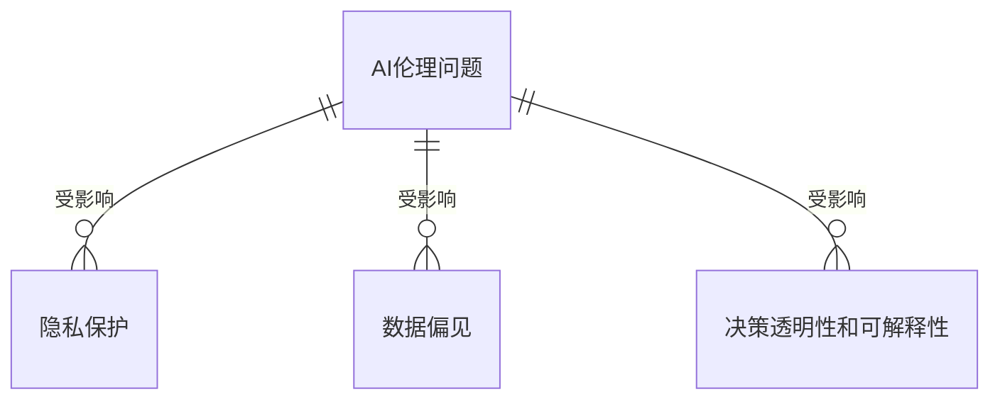

                 

## 第1章 引言

### 1.1 问题背景

#### 1.1.1 人工智能的发展现状

人工智能（AI）作为计算机科学领域的前沿技术，近年来取得了飞速的发展。从简单的规则系统到复杂的深度学习模型，AI在图像识别、自然语言处理、自动驾驶、医疗诊断等多个领域展现出了巨大的潜力。根据市场研究机构的数据，全球人工智能市场规模预计将在未来几年内持续增长，成为推动社会进步和经济发展的重要引擎。

然而，随着人工智能技术的不断进步，其伦理问题也逐渐成为公众和学术界关注的焦点。人工智能伦理问题主要包括隐私保护、数据偏见、算法公平性、决策透明性等方面。这些问题不仅关系到技术本身的发展，也对社会公正、人类福祉产生了深远影响。

#### 1.1.2 人工智能伦理的重要性

人工智能伦理的重要性体现在以下几个方面：

1. **社会影响**：人工智能技术的广泛应用将深刻改变人们的生活方式和工作方式，从而影响社会结构和价值观念。如果不进行伦理约束，可能会加剧社会不平等和道德风险。

2. **技术进步**：伦理问题直接关系到人工智能技术的可持续发展。只有在伦理指导下，技术才能真正服务于人类，实现其最大价值。

3. **公众信任**：伦理问题直接影响公众对人工智能技术的信任度。缺乏伦理规范可能导致公众对技术的抵触情绪，阻碍技术的普及和应用。

4. **国际合作**：人工智能技术的发展具有全球性特点，各国都需要在伦理问题上达成共识，共同制定国际标准和规范。

### 1.2 问题描述

#### 1.2.1 人工智能伦理面临的挑战

人工智能伦理面临的挑战主要包括：

1. **隐私问题**：人工智能系统通常需要大量个人数据来进行训练和优化，如何保护用户的隐私成为一个重要问题。

2. **数据偏见问题**：训练数据中存在的偏见可能导致人工智能系统在决策时产生不公平的结果，影响社会的公正性。

3. **决策透明度和可解释性**：许多复杂的人工智能系统，尤其是深度学习模型，其决策过程具有“黑箱”特征，难以解释和理解，这增加了其潜在的伦理风险。

4. **算法公平性**：人工智能算法在资源分配、就业机会等方面可能存在不公平现象，需要通过伦理规范来纠正。

#### 1.2.2 当前伦理问题的解决方案

当前针对人工智能伦理问题的解决方案主要包括：

1. **制定伦理准则**：各国政府和国际组织正在积极制定人工智能伦理准则，以规范人工智能技术的发展和应用。

2. **加强法律法规**：通过立法手段加强对人工智能系统的监管，确保其合法合规运行。

3. **技术手段**：开发隐私保护技术、可解释性算法等，以降低伦理风险。

4. **公众参与**：鼓励公众参与伦理讨论，提高社会对人工智能伦理问题的认知和参与度。

### 1.3 目标与边界

#### 1.3.1 研究目标

本文旨在探讨数学在解决未来人工智能伦理问题中的应用，具体目标包括：

1. **分析数学在人工智能技术中的应用**：梳理数学方法在人工智能中的关键作用，为后续讨论提供理论基础。

2. **探讨数学方法在伦理问题解决中的应用**：分析如何利用数学工具解决隐私保护、数据偏见等伦理问题。

3. **提出数学与人工智能伦理融合的新思路**：探讨数学方法在伦理评估、决策支持等方面的潜力。

#### 1.3.2 边界与外延

本文的研究边界主要涉及：

1. **数学方法的范畴**：本文将主要探讨线性代数、概率论、统计学等数学分支在人工智能伦理问题中的应用。

2. **伦理问题的范畴**：本文将聚焦于隐私保护、数据偏见、决策透明性等关键伦理问题。

3. **研究范围的限定**：本文不涉及人工智能伦理的其他领域，如哲学、社会学等。

### 1.4 核心概念与联系

#### 1.4.1 人工智能伦理的概念

人工智能伦理是指对人工智能技术发展过程中可能产生的道德、法律和社会问题进行系统性分析和规范的过程。其核心目标是确保人工智能技术能够安全、公平、透明地服务于人类社会。

#### 1.4.2 相关概念属性特征对比

| 概念             | 属性特征                                                     | 关联性                           |
|------------------|------------------------------------------------------------|----------------------------------|
| 人工智能         | 以计算机科学为基础，通过模拟、延伸和扩展人类智能的技术。       | 与伦理问题密切相关，影响伦理决策。 |
| 隐私保护         | 保障个人数据不被非法收集、使用和泄露。                       | 是人工智能伦理的重要组成部分。    |
| 数据偏见         | 训练数据中存在的偏见可能导致系统决策的不公平。               | 需要通过数学方法进行识别和纠正。   |
| 决策透明性和可解释性 | 系统的决策过程应该清晰可解释，便于监督和评估。               | 是人工智能伦理的基本要求。       |

#### 1.4.3 ER实体关系图

通过以上章节的介绍，本文将为后续各章节的讨论奠定基础，逐步深入探讨数学在解决人工智能伦理问题中的重要作用。接下来，我们将进一步探讨数学在人工智能技术中的具体应用，为后续讨论提供理论支持。## 第2章 数学在人工智能中的应用

### 2.1 数学在人工智能发展中的角色

数学作为人工智能（AI）的基础学科，在AI技术的发展中扮演着至关重要的角色。从早期的规则系统到现代的深度学习模型，数学原理和方法不断推动着AI技术的进步。以下将探讨数学在机器学习和深度学习中的具体应用。

#### 2.1.1 机器学习中的数学原理

机器学习（ML）是AI的核心技术之一，其基础原理依赖于数学理论。主要涉及的概念包括：

1. **概率论**：机器学习模型通常基于概率模型，例如贝叶斯网络、最大似然估计等，用于预测和分类。

2. **线性代数**：线性代数中的矩阵运算在机器学习中广泛应用，用于表示和优化模型参数。例如，通过SVD（奇异值分解）进行数据降维，通过PCA（主成分分析）提取数据的主要特征。

3. **微积分**：微积分中的导数和梯度用于优化算法，如梯度下降法。通过计算损失函数的梯度，模型可以逐步调整参数，以最小化损失。

#### 2.1.2 深度学习中的数学模型

深度学习（DL）是机器学习的子领域，近年来取得了显著的发展。深度学习模型的核心在于多层神经网络，其基础数学模型包括：

1. **非线性激活函数**：如ReLU、Sigmoid和Tanh，用于引入非线性变换，使得神经网络能够捕捉复杂的输入输出关系。

2. **反向传播算法**：反向传播算法通过计算输出层的误差梯度，逆向传播到每一层，用于更新模型参数。其数学基础是链式法则。

3. **优化算法**：如Adam、RMSprop和SGD等，通过迭代优化损失函数，以找到最佳模型参数。

### 2.2 数学方法与工具

为了更好地理解和应用数学方法在人工智能中的角色，以下将介绍几种主要的数学方法与工具。

#### 2.2.1 线性代数在人工智能中的应用

线性代数在人工智能中的应用非常广泛，主要表现在以下几个方面：

1. **矩阵运算**：矩阵运算用于表示和优化模型参数。例如，通过矩阵乘法进行权重更新，通过矩阵求逆进行参数优化。

2. **特征分解**：特征分解（如SVD）在降维和数据预处理中广泛应用。通过特征分解，可以将高维数据转换为低维空间，从而提高模型的效率和泛化能力。

3. **线性方程组求解**：线性方程组在机器学习和深度学习中用于求解模型参数。常见的求解方法包括高斯消元法和迭代法。

#### 2.2.2 概率论与统计学

概率论和统计学在人工智能中发挥着重要作用，特别是在机器学习和深度学习领域。以下是其主要应用：

1. **概率分布**：概率分布用于表示数据的不确定性。常见的概率分布包括正态分布、伯努利分布等，用于构建和评估模型。

2. **统计推断**：统计推断用于基于样本数据推断总体特性。例如，假设检验和置信区间等，用于评估模型的性能和可靠性。

3. **最大似然估计**：最大似然估计是一种常用的参数估计方法，用于从数据中估计模型参数。其基础是概率论和统计学原理。

#### 2.2.3 微积分与优化算法

微积分在人工智能中的应用主要体现在优化算法中。以下是其主要应用：

1. **梯度下降**：梯度下降是一种优化算法，通过计算损失函数的梯度来更新模型参数。其基础是微积分中的导数和梯度概念。

2. **梯度上升**：梯度上升是梯度下降的逆过程，用于最大化某个函数。其应用场景包括分类问题中的阈值调整和聚类问题中的中心点更新。

3. **优化算法改进**：基于微积分原理，许多优化算法得到了改进。例如，动量法、Adam优化器等，通过引入动量和自适应学习率，提高了优化效果。

### 2.3 数学公式与详细讲解

为了更深入地理解数学方法在人工智能中的应用，以下将介绍一些关键的数学公式，并进行详细讲解。

#### 2.3.1 线性代数公式讲解

1. **矩阵乘法**：

   矩阵乘法的公式如下：

   $$
   C = A \cdot B
   $$

   其中，\(C\) 是结果矩阵，\(A\) 和 \(B\) 是输入矩阵。

   矩阵乘法的计算过程如下：

   - 将 \(A\) 的每一行与 \(B\) 的每一列进行点积运算。
   - 将所有行与列的点积结果组成一个新的矩阵 \(C\)。

2. **求逆矩阵**：

   求逆矩阵的公式如下：

   $$
   A^{-1} = (1/\det(A)) \cdot \text{adj}(A)
   $$

   其中，\(\det(A)\) 是矩阵 \(A\) 的行列式，\(\text{adj}(A)\) 是 \(A\) 的伴随矩阵。

   求逆矩阵的计算步骤如下：

   - 计算矩阵 \(A\) 的行列式。
   - 计算伴随矩阵。
   - 将伴随矩阵除以行列式，得到逆矩阵。

#### 2.3.2 概率论与统计学公式讲解

1. **伯努利分布**：

   伯努利分布的概率质量函数（PDF）如下：

   $$
   f(x; p) = p^x (1 - p)^{1 - x}
   $$

   其中，\(x\) 是成功的次数，\(p\) 是成功的概率。

   伯努利分布的累积分布函数（CDF）如下：

   $$
   F(x; p) = \sum_{i=0}^{x} p^i (1 - p)^{1 - i}
   $$

2. **正态分布**：

   正态分布的概率密度函数（PDF）如下：

   $$
   f(x; \mu, \sigma^2) = \frac{1}{\sqrt{2\pi\sigma^2}} e^{-\frac{(x - \mu)^2}{2\sigma^2}}
   $$

   其中，\(\mu\) 是均值，\(\sigma^2\) 是方差。

   正态分布的累积分布函数（CDF）如下：

   $$
   F(x; \mu, \sigma^2) = \frac{1}{2} \left[1 + \text{erf}\left(\frac{x - \mu}{\sigma\sqrt{2}}\right)\right]
   $$

   其中，\(\text{erf}\) 是误差函数。

#### 2.3.3 微积分公式讲解

1. **梯度下降**：

   梯度下降的公式如下：

   $$
   \theta = \theta - \alpha \cdot \nabla_\theta J(\theta)
   $$

   其中，\(\theta\) 是模型参数，\(\alpha\) 是学习率，\(\nabla_\theta J(\theta)\) 是损失函数 \(J(\theta)\) 对 \(\theta\) 的梯度。

   梯度下降的计算步骤如下：

   - 计算损失函数的梯度。
   - 更新模型参数，使其沿着梯度的反方向移动。

2. **链式法则**：

   链式法则的公式如下：

   $$
   \frac{d}{dx} [f(g(x))] = f'(g(x)) \cdot g'(x)
   $$

   其中，\(f'(g(x))\) 是外函数 \(f\) 对 \(g(x)\) 的导数，\(g'(x)\) 是内函数 \(g\) 对 \(x\) 的导数。

   链式法则的应用包括计算复合函数的导数，如多层神经网络的梯度计算。

通过以上对数学方法与工具的详细讲解，我们可以看到数学在人工智能中的应用是如何贯穿于机器学习和深度学习过程中的。接下来，我们将进一步探讨数学方法在解决人工智能伦理问题中的应用。## 第3章 人工智能伦理问题探讨

### 3.1 人工智能伦理问题的类型

人工智能伦理问题种类繁多，其中最具代表性的包括隐私问题、数据偏见问题、决策透明度和可解释性等方面。

#### 3.1.1 隐私问题

隐私问题是人工智能伦理中的一个关键问题。人工智能系统通常需要大量个人数据来进行训练和优化，这些数据可能包括用户的行为记录、健康信息、社交网络数据等。未经授权的数据收集和泄露可能导致严重的隐私侵犯，对个人和社会带来负面影响。

隐私问题主要包括以下几个方面：

1. **数据收集**：如何合理合法地收集和处理个人数据，确保数据收集的透明性和用户的知情权。
2. **数据存储**：如何确保存储的数据安全，防止数据泄露和非法访问。
3. **数据共享**：如何规范数据共享行为，防止数据滥用和不当使用。
4. **用户权利**：如何保障用户对个人数据的控制权，包括数据的访问、更正和删除等。

#### 3.1.2 数据偏见问题

数据偏见问题是指训练数据中存在的偏见可能导致人工智能系统在决策时产生不公平的结果。数据偏见可能源于数据收集过程中的偏差、数据集的不平衡或者算法设计的缺陷。例如，在招聘系统中，如果训练数据中存在性别偏见，可能会导致女性候选人被歧视。

数据偏见问题主要包括以下几个方面：

1. **数据集不平衡**：训练数据中某些类别或特征的比例不均衡，可能导致模型对某些类别的预测不准确。
2. **偏见性特征**：训练数据中包含的偏见性特征可能导致模型在决策时表现出偏见。
3. **算法设计**：某些算法设计可能放大或固化数据中的偏见。

#### 3.1.3 决策透明度和可解释性

决策透明度和可解释性是人工智能伦理问题中的另一个重要方面。深度学习模型等复杂的人工智能系统通常具有“黑箱”特征，其决策过程难以解释和理解。这增加了其潜在的伦理风险，特别是在涉及公共安全和关键决策的领域。

决策透明度和可解释性问题主要包括以下几个方面：

1. **模型解释**：如何解释模型的决策过程，使得非专业人士能够理解。
2. **算法可解释性**：如何设计可解释性算法，使得模型的决策过程更加透明。
3. **责任归属**：在出现错误决策时，如何明确责任归属，确保系统的公正性和可靠性。

### 3.2 数学模型与解决方案

为了解决上述人工智能伦理问题，数学模型提供了有效的工具和方法。以下将介绍几种常见的数学模型及其在解决伦理问题中的应用。

#### 3.2.1 数据隐私保护模型

数据隐私保护模型旨在保护个人数据的同时，允许数据在共享和训练过程中发挥作用。以下是一些常用的隐私保护模型：

1. **差分隐私**：差分隐私是一种流行的隐私保护技术，通过在数据集中添加噪声来保护个人隐私。其核心公式如下：

   $$
   \text{输出} = \text{真实输出} + \text{噪声}
   $$

   其中，噪声是随机生成的，以确保输出结果在多个数据集之间差异不大。

2. **同态加密**：同态加密是一种在加密数据上进行计算的技术，允许在数据加密后进行操作，而无需解密。其核心公式如下：

   $$
   \text{加密结果} = \text{加密操作}(c_1, c_2)
   $$

   其中，\(c_1\) 和 \(c_2\) 是加密后的数据。

3. **匿名化技术**：匿名化技术通过删除或混淆个人识别信息，以保护个人隐私。常见的匿名化方法包括K-匿名、l-diversity和t-closeness。

#### 3.2.2 减少偏见的数据分析模型

减少偏见的数据分析模型旨在识别和纠正训练数据中的偏见，以防止模型在决策时产生不公平的结果。以下是一些常用的减少偏见的方法：

1. **平衡采样**：通过调整训练数据中不同类别的样本数量，使数据集达到平衡，从而减少数据偏见。

2. **再平衡技术**：再平衡技术通过调整模型训练过程中的权重，使得模型对数据集中较少见的类别给予更多的关注。常用的再平衡方法包括欠采样和过采样。

3. **偏见校正**：偏见校正算法通过对训练数据进行调整，以减少数据偏见。常见的偏见校正方法包括逆概率加权（IPW）和逆频率加权（IFW）。

#### 3.2.3 增强决策透明度的模型

增强决策透明度的模型旨在提高人工智能系统的可解释性和透明度，使得决策过程更加清晰易懂。以下是一些常用的增强决策透明度的方法：

1. **可解释性模型**：可解释性模型通过简化复杂的模型结构或提供决策路径，使得模型的决策过程更加透明。常见的可解释性模型包括决策树、线性模型和规则系统。

2. **注意力机制**：注意力机制是一种在深度学习中用于提高模型可解释性的技术。通过分析模型中每个特征的重要性，注意力机制可以帮助理解模型是如何做出决策的。

3. **可视化技术**：可视化技术通过图形化方式展示模型的决策过程和特征重要性，从而提高决策过程的透明度。常用的可视化方法包括热力图、决策树图和依赖图。

通过上述数学模型和方法，人工智能伦理问题可以得到一定程度的缓解。然而，这些方法也存在一定的局限性，需要在实际应用中不断优化和改进。接下来，我们将进一步探讨人工智能伦理法规和政策，以期为人工智能伦理问题的解决提供更加全面和有效的指导。### 3.3 人工智能伦理法规和政策

#### 3.3.1 国际法规与政策

随着人工智能技术的迅猛发展，国际社会对人工智能伦理法规的关注日益增加。多个国际组织和各国政府相继出台了一系列法规和政策，旨在规范人工智能技术的发展和应用。

1. **欧盟**：欧盟委员会于2021年发布了《人工智能法案（Artificial Intelligence Act）》，该法案旨在建立一个统一的监管框架，确保人工智能技术的合法、公平和安全。法案规定了高风险AI系统的具体要求，如透明度、数据保护、可解释性等。

2. **美国**：美国在人工智能伦理方面也采取了一系列措施。2022年，美国国会通过了《美国人工智能倡议（American AI Initiative）》，该倡议旨在推动人工智能的科研和产业发展，并强调了人工智能伦理的重要性。此外，美国国家航空航天局（NASA）和五角大楼等机构也制定了相关的人工智能伦理指南。

3. **国际标准化组织（ISO）**：ISO于2019年发布了ISO/IEC 25000系列标准，该标准提供了关于软件和系统产品评估的指导原则，包括伦理和隐私保护等方面的内容。

#### 3.3.2 中国的法规与政策

中国在人工智能伦理方面也积极采取了相应的法规和政策，以推动人工智能技术的健康发展。

1. **《新一代人工智能发展规划》**：2017年，中国政府发布了《新一代人工智能发展规划》，明确了人工智能发展的战略目标、重点领域和政策措施。规划强调了人工智能伦理的重要性，提出了加强人工智能伦理法规和标准体系建设的任务。

2. **《人工智能伦理规范（征求意见稿）》**：2021年，中国国务院办公厅发布了《人工智能伦理规范（征求意见稿）》，该规范提出了人工智能伦理的基本原则、具体要求和实施措施。规范涵盖了数据安全、隐私保护、公平公正、透明可解释等方面。

3. **《数据安全法》**：2021年，中国颁布了《数据安全法》，该法明确了数据安全保护的基本要求和原则，为人工智能数据安全提供了法律依据。

4. **《网络安全法》**：2017年，中国颁布了《网络安全法》，该法对网络数据的收集、存储、处理、传输和使用等环节进行了规范，为人工智能的网络安全提供了法律保障。

#### 3.3.3 法规与政策的影响与挑战

人工智能伦理法规和政策对于推动人工智能的健康发展具有重要意义，但也面临一些挑战：

1. **实施难度**：人工智能技术的快速发展和应用场景的多样化使得法规和政策的实施难度较大。如何确保法规和政策在技术实施中得以有效执行是一个重要问题。

2. **国际合作**：人工智能技术的发展具有全球性特点，各国需要在法规和政策方面加强国际合作，形成共识和标准。

3. **技术发展**：随着人工智能技术的不断进步，现有的法规和政策可能难以适应新的技术发展和应用场景。需要不断更新和完善法规和政策体系。

4. **公众参与**：公众对人工智能伦理问题的认知和参与度较低，需要在法规和政策制定过程中加强公众参与和宣传，提高公众对人工智能伦理问题的关注和参与度。

总之，人工智能伦理法规和政策对于推动人工智能技术的健康发展具有重要意义。通过制定和完善相关法规和政策，可以规范人工智能技术的发展和应用，保障数据安全和用户隐私，促进人工智能与伦理的融合。未来，需要进一步加强国际合作，推动全球人工智能伦理法规和政策的一致性和协调性。### 3.4 数学方法在伦理评估中的应用

数学方法在人工智能伦理评估中扮演着至关重要的角色，为伦理风险的识别、评估和缓解提供了强有力的工具。以下将探讨几种常见的数学方法及其在伦理评估中的应用。

#### 3.4.1 数据挖掘与伦理风险评估

数据挖掘是一种通过从大量数据中提取模式和知识的技术，其在人工智能伦理评估中具有广泛应用。以下是其主要应用：

1. **模式识别**：通过数据挖掘技术，可以从海量数据中识别出潜在的伦理问题模式。例如，通过分析用户行为数据，可以发现数据泄露、隐私侵犯等问题的潜在风险。

2. **异常检测**：异常检测是一种常用的数据挖掘技术，用于识别数据中的异常行为或异常模式。在人工智能伦理评估中，异常检测可以帮助识别出违反伦理规范的行为，如数据篡改、不当使用用户数据等。

3. **关联规则分析**：关联规则分析是一种用于发现数据中潜在关联关系的技术。在伦理评估中，可以通过分析数据中的关联关系，发现潜在的数据滥用和隐私侵犯行为。

#### 3.4.2 模型评估与验证

在人工智能伦理评估中，模型评估和验证是关键环节，以确保模型能够准确、公正地执行其任务。以下是其主要方法：

1. **公平性评估**：通过评估模型在各个群体中的表现，可以判断模型是否存在偏见或歧视。常见的公平性评估指标包括均衡性、偏差指标和误差率。

2. **鲁棒性评估**：鲁棒性评估用于测试模型对噪声、异常值和偏差的抵抗能力。通过鲁棒性评估，可以确保模型在不同数据质量和环境下都能保持稳定的表现。

3. **可解释性评估**：可解释性评估用于评估模型的可解释性和透明度，以确保用户能够理解模型的决策过程。常见的可解释性评估指标包括模型复杂度、决策路径长度和解释性算法使用率等。

#### 3.4.3 伦理决策支持系统

伦理决策支持系统（EDSS）是一种基于数学模型的系统，旨在帮助决策者识别、评估和解决人工智能伦理问题。以下是其主要组成部分：

1. **伦理规则库**：伦理规则库是EDSS的核心组成部分，包含了各种伦理规则和准则。通过这些规则，EDSS可以识别出潜在的人工智能伦理问题。

2. **数学模型**：数学模型用于评估和缓解伦理风险。常见的模型包括概率模型、优化模型和博弈论模型等。

3. **决策界面**：决策界面是用户与EDSS交互的界面，用于输入问题、查看模型评估结果和决策建议。

4. **自适应学习机制**：EDSS应具备自适应学习机制，能够根据实际情况更新和调整伦理规则和模型，以提高评估的准确性和实用性。

#### 3.4.4 数学模型与伦理决策

数学模型在伦理决策中发挥着重要作用，以下是其主要应用：

1. **伦理风险评估**：通过构建伦理风险评估模型，可以量化伦理风险，为决策者提供决策依据。常见的风险评估模型包括风险矩阵、故障树分析和事件树分析等。

2. **伦理决策支持**：数学模型可以用于支持伦理决策，例如在资源分配、隐私保护和数据共享等方面提供优化方案。常见的决策支持模型包括线性规划、整数规划和多目标规划等。

3. **伦理决策流程**：数学模型可以用于构建伦理决策流程，确保决策过程的透明、公正和可追溯。常见的决策流程包括问题定义、模型构建、风险评估、决策分析和决策执行等。

通过以上数学方法的应用，人工智能伦理评估得以更加系统化、科学化和精准化。这不仅有助于识别和缓解伦理风险，也为制定有效的伦理政策和法规提供了有力支持。未来，随着人工智能技术的不断进步和伦理问题的日益复杂，数学方法在伦理评估中的应用将变得更加重要和多样化。### 4.3 数学工具在伦理培训中的应用

#### 4.3.1 伦理案例分析

伦理案例分析是伦理培训中的重要环节，通过具体案例的讨论，可以加深对人工智能伦理问题的理解和应对能力。以下将介绍几种常见的伦理案例分析方法和工具。

1. **情景模拟**：情景模拟是一种通过模拟特定情境，让参与者体验和讨论伦理问题的方法。例如，在自动驾驶汽车伦理问题中，可以设置不同的交通事故场景，让参与者讨论如何分配责任和做出决策。

2. **案例分析**：案例分析是通过研究具体的伦理案例，分析其中的伦理问题、决策过程和后果，从而提高参与者的伦理判断能力。例如，可以分析医疗AI系统在诊断和治疗中的伦理问题，探讨如何平衡数据隐私和患者利益。

3. **角色扮演**：角色扮演是一种通过模拟实际工作场景，让参与者扮演不同角色，体验和讨论伦理问题的方法。例如，在招聘AI系统中，可以设置招聘者和应聘者的角色，讨论如何避免性别和种族偏见。

#### 4.3.2 伦理思维训练工具

伦理思维训练工具旨在提高参与者的伦理思维能力和决策能力，以下介绍几种常见的伦理思维训练工具：

1. **伦理决策树**：伦理决策树是一种通过图形化方式展示伦理决策过程和结果的工具。例如，可以构建一个关于数据共享的伦理决策树，从数据收集、存储到共享的各个环节，分析可能涉及的伦理问题。

2. **伦理思维导图**：伦理思维导图是一种通过图形化方式展示伦理问题的思维工具。例如，可以构建一个关于人工智能隐私保护的思维导图，从隐私保护的目标、挑战、解决方案等方面进行系统分析。

3. **伦理模拟软件**：伦理模拟软件是一种通过计算机模拟伦理问题，让参与者进行决策和评估的工具。例如，可以开发一个关于自动驾驶汽车伦理问题的模拟软件，让参与者体验和讨论在不同交通事故场景下的决策过程。

#### 4.3.3 伦理思维训练的实际应用

伦理思维训练工具在实际应用中发挥着重要作用，以下介绍几种常见的应用场景：

1. **企业内部培训**：企业可以通过伦理思维训练工具，提高员工在人工智能项目中的伦理意识和决策能力。例如，可以定期组织伦理案例分析研讨会，使用伦理决策树和伦理思维导图等工具，引导员工深入思考和讨论伦理问题。

2. **学术研究**：学术界可以通过伦理思维训练工具，提高研究者在人工智能伦理问题中的研究能力和创新能力。例如，在人工智能项目的研究过程中，可以使用伦理思维训练工具进行伦理风险评估和决策分析，确保研究的合法性和道德性。

3. **政策制定**：政策制定者可以通过伦理思维训练工具，提高在人工智能政策和法规制定过程中的伦理判断和决策能力。例如，在制定人工智能伦理法规时，可以使用伦理决策树和伦理思维导图等工具，分析不同政策选项的伦理影响，确保政策的公正性和合理性。

通过伦理案例分析、伦理思维训练工具及其在实际应用中的有效结合，可以有效提高人工智能从业者和决策者在伦理问题上的意识和能力，为人工智能伦理的健康发展提供有力支持。未来，随着人工智能技术的不断进步和伦理问题的日益复杂，伦理思维训练工具的应用将变得更加广泛和多样化。### 第5章 案例分析

#### 5.1 案例一：自动驾驶汽车的伦理问题

自动驾驶汽车作为人工智能领域的一项重要应用，其发展受到广泛关注。然而，随着自动驾驶技术的不断成熟，其伦理问题也逐渐凸显。本案例将分析自动驾驶汽车在面临伦理困境时的决策过程，并探讨数学方法在案例分析中的应用。

##### 5.1.1 案例介绍

自动驾驶汽车在行驶过程中可能会遇到各种紧急情况，例如行人突然闯入、车辆失控等。在这些情况下，自动驾驶系统需要快速做出决策，以确保安全。然而，某些决策可能涉及道德和伦理问题，例如如何平衡不同个体的利益。以下是一个具体的案例：

**案例场景**：一辆自动驾驶汽车在行驶过程中，前方出现一名儿童和一辆失控的摩托车。此时，汽车必须做出决策，是紧急刹车避免撞到儿童，但可能无法避免撞到摩托车，还是保持当前行驶轨迹，撞向摩托车但可能避免撞到儿童。

##### 5.1.2 数学方法在案例分析中的应用

1. **伦理决策树**：

   为了分析自动驾驶汽车在上述案例中的决策过程，可以构建一个伦理决策树。该决策树包括以下几个节点：

   - **初始节点**：自动驾驶汽车在行驶过程中遇到紧急情况。
   - **选择节点1**：选择紧急刹车。
     - 子节点1：成功避免撞到儿童。
       - 子节点1.1：撞到摩托车。
       - 子节点1.2：未撞到摩托车。
     - 子节点2：未成功避免撞到儿童。
       - 子节点2.1：撞到摩托车。
       - 子节点2.2：未撞到摩托车。

   通过伦理决策树，可以分析不同决策路径的伦理后果，从而为自动驾驶系统提供决策依据。

2. **预期效用分析**：

   为了评估不同决策路径的伦理价值，可以使用预期效用分析（Expected Utility Analysis）方法。预期效用分析通过计算每个决策路径的概率和效用值，从而确定最佳决策。

   **公式**：
   $$
   EU = P_1 \times U_1 + P_2 \times U_2
   $$

   其中，\(EU\) 是预期效用，\(P_1\) 和 \(P_2\) 分别是选择节点1和节点2的概率，\(U_1\) 和 \(U_2\) 分别是子节点1和子节点2的效用值。

   假设：
   - \(P_1 = 0.8\)：选择紧急刹车的概率为80%。
   - \(P_2 = 0.2\)：选择保持当前行驶轨迹的概率为20%。
   - \(U_1.1 = -1\)：撞到摩托车的效用值为-1。
   - \(U_1.2 = 1\)：未撞到摩托车的效用值为1。
   - \(U_2.1 = -5\)：撞到儿童的效用值为-5。
   - \(U_2.2 = 5\)：未撞到儿童的效用值为5。

   **计算**：
   $$
   EU_1 = 0.8 \times (-1) + 0.2 \times (-5) = -0.8 - 1 = -1.8
   $$
   $$
   EU_2 = 0.8 \times 1 + 0.2 \times 5 = 0.8 + 1 = 1.8
   $$

   根据预期效用分析，选择紧急刹车（\(EU_1\)）的预期效用为-1.8，而保持当前行驶轨迹（\(EU_2\)）的预期效用为1.8。因此，从预期效用的角度来看，保持当前行驶轨迹可能是更优的选择。

3. **博弈论分析**：

   在某些情况下，自动驾驶汽车需要与其他交通参与者（如行人、其他车辆）进行博弈。博弈论可以用于分析不同参与者的策略和决策，从而找到纳什均衡（Nash Equilibrium），即每个参与者选择最优策略的情况。

   **纳什均衡计算**：

   - 假设自动驾驶汽车和其他参与者（如行人）的决策变量分别为\(x\)（自动驾驶汽车的决策）和\(y\)（行人的决策）。
   - 构建收益矩阵，根据不同决策组合计算每个参与者的收益。

   **收益矩阵示例**：

   | 行动         | 保持当前轨迹 | 紧急刹车 |
   |--------------|--------------|----------|
   | **保持当前轨迹** | (-1, -1)     | (-5, 5)  |
   | **紧急刹车**   | (5, -5)      | (1, 1)   |

   在上述收益矩阵中，自动驾驶汽车选择保持当前轨迹，行人选择紧急刹车，是一个纳什均衡。这意味着在这种情境下，自动驾驶汽车和行人都会选择自己的最优策略。

##### 5.1.3 案例讨论与反思

通过上述案例分析，可以看出自动驾驶汽车在面临伦理困境时，需要考虑多种因素，包括预期效用和博弈论分析。以下是对案例的讨论与反思：

1. **预期效用分析**：

   预期效用分析提供了一个定量评估决策的方法，但在实际应用中，可能存在计算复杂度和数据准确性等问题。例如，在实际情况下，无法准确预测每个决策路径的概率和效用值。

2. **博弈论分析**：

   博弈论分析有助于找到纳什均衡，但在某些情况下，纳什均衡可能不是最优决策。例如，在上述案例中，虽然自动驾驶汽车和行人选择了纳什均衡，但这个决策可能并不是从整体社会福利最大化的角度来看最优的。

3. **实际应用挑战**：

   自动驾驶汽车的伦理决策需要考虑实时性和计算效率。在紧急情况下，自动驾驶系统需要在短时间内做出决策，这可能限制了数学方法的应用范围。

4. **伦理决策的一致性**：

   不同的伦理决策模型可能会得出不同的结论。如何确保伦理决策的一致性，是一个需要深入探讨的问题。

总之，自动驾驶汽车的伦理问题是一个复杂的多维度问题，需要综合考虑多种因素。通过数学方法的分析，可以为自动驾驶汽车的伦理决策提供一定的指导，但在实际应用中，还需要结合具体情境和实际条件，进行灵活调整和优化。未来，随着人工智能技术的不断进步和伦理问题的日益复杂，数学方法在自动驾驶汽车伦理决策中的应用将变得更加重要。#### 5.2 案例二：社交媒体平台的内容审核

社交媒体平台的内容审核是人工智能伦理问题中的一个重要方面。随着用户生成内容的爆炸式增长，如何有效地审核和处理不良信息成为一个关键挑战。本案例将分析社交媒体平台内容审核中的伦理问题，并探讨数学方法在案例分析中的应用。

##### 5.2.1 案例介绍

社交媒体平台的内容审核涉及识别和处理各种类型的不良信息，如虚假信息、仇恨言论、色情内容等。这些不良信息不仅可能侵犯用户隐私，还可能对社会秩序和公共安全造成威胁。以下是一个具体案例：

**案例场景**：某社交媒体平台收到用户投诉，称其发布的一条微博涉嫌虚假宣传，声称某种产品可以治愈癌症。平台需要进行审核，以确定该信息是否真实，并采取相应的处理措施。

##### 5.2.2 数学模型在案例分析中的应用

1. **概率模型**：

   概率模型在社交媒体内容审核中广泛应用，用于评估信息的真实性。以下是一个基于贝叶斯定理的概率模型：

   $$
   P(\text{虚假宣传}|\text{证据}) = \frac{P(\text{证据}|\text{虚假宣传}) \cdot P(\text{虚假宣传})}{P(\text{证据})}
   $$

   其中，\(P(\text{虚假宣传}|\text{证据})\) 表示在观察到特定证据后，信息为虚假宣传的概率；\(P(\text{证据}|\text{虚假宣传})\) 表示在虚假宣传情况下观察到证据的概率；\(P(\text{虚假宣传})\) 表示虚假宣传的先验概率；\(P(\text{证据})\) 表示观察到证据的概率。

   - **先验概率**：可以通过历史数据和用户行为模式进行估计。
   - **证据概率**：可以通过检测算法和人工审核进行评估。

2. **决策树**：

   决策树是一种常用的分类模型，可以用于分类和预测任务。在内容审核中，决策树可以用于识别和分类不同类型的不良信息。

   **决策树示例**：

   | 特征           | 值       | 分类          |
   |----------------|----------|---------------|
   | 文本长度       | 长       | 色情内容      |
   | 关键词         | 治愈癌症 | 虚假宣传      |
   | 用户信誉度     | 低       | 不良信息      |

   通过决策树，可以构建一个内容审核模型，根据不同特征对信息进行分类和判断。

3. **聚类分析**：

   聚类分析是一种无监督学习方法，用于将数据分为多个簇。在内容审核中，聚类分析可以用于识别和分类相似的不良信息。

   **K-均值聚类示例**：

   - **初始聚类中心**：随机选择K个聚类中心。
   - **迭代更新**：将每个数据点分配到最近的聚类中心，并更新聚类中心的位置，直到聚类中心不再发生变化。

4. **机器学习模型评估**：

   在内容审核中，机器学习模型的性能评估是关键环节。可以通过混淆矩阵、准确率、召回率、F1分数等指标评估模型的性能。

   **混淆矩阵示例**：

   | 实际分类 | 预测分类 |
   |----------|----------|
   | 虚假宣传 | 正确     |
   | 不良信息 | 错误     |
   | 色情内容 | 正确     |
   | 正常信息 | 错误     |

   通过混淆矩阵，可以评估模型对不同类型信息的识别能力。

##### 5.2.3 案例讨论与反思

通过上述案例分析，可以看出数学方法在社交媒体内容审核中具有广泛应用，以下是对案例的讨论与反思：

1. **概率模型**：

   概率模型可以用于评估信息的真实性，但在实际应用中，需要考虑数据质量和特征提取的准确性。例如，在上述案例中，如果证据概率和先验概率不准确，可能会导致错误的判断。

2. **决策树**：

   决策树是一种简单直观的模型，但在处理复杂问题时可能存在过拟合和泛化能力不足的问题。在内容审核中，需要结合其他模型和方法，以提高模型的性能。

3. **聚类分析**：

   聚类分析可以用于识别相似的不良信息，但在处理大规模数据时可能存在计算复杂度较高的问题。此外，聚类分析的结果需要结合业务逻辑和人工审核，以确保准确性。

4. **模型评估**：

   模型的性能评估是内容审核的关键环节，但不同指标之间可能存在权衡。例如，在准确率和召回率之间需要做出权衡，以确保对不良信息的有效识别。

总之，社交媒体平台的内容审核是一个复杂的多维度问题，需要结合多种数学方法和实际业务逻辑。通过数学模型的分析，可以为内容审核提供有效的技术支持，但在实际应用中，需要不断优化和调整，以应对不断变化的社会环境和用户需求。未来，随着人工智能技术的不断进步，数学方法在社交媒体内容审核中的应用将变得更加广泛和深入。### 第6章 未来展望

#### 6.1 人工智能伦理的发展趋势

随着人工智能技术的不断进步，人工智能伦理（AI Ethics）领域也在不断发展，呈现出以下几大趋势：

1. **伦理标准的建立**：

   各国政府、国际组织和研究机构正积极制定人工智能伦理标准，以规范人工智能技术的研发和应用。这些标准旨在确保人工智能系统在安全、公平、透明和负责任的前提下运行。

2. **技术创新**：

   人工智能伦理问题的解决离不开技术创新。未来，研究者将开发更多先进的数学模型和算法，以应对隐私保护、数据偏见、决策透明性等伦理挑战。

3. **公众参与**：

   公众对人工智能伦理问题的关注和参与度日益提高。未来，公众将更加积极地参与到人工智能伦理讨论中，为政策制定和技术研发提供宝贵的意见和建议。

4. **跨学科研究**：

   人工智能伦理研究需要融合多个学科，包括计算机科学、伦理学、法律学、社会学等。跨学科合作将有助于更全面地理解人工智能伦理问题，并提出更具创新性的解决方案。

5. **国际协作**：

   随着人工智能技术的全球化发展，国际协作在人工智能伦理领域变得尤为重要。各国需要在伦理标准、法规和政策方面加强合作，形成全球共识和协调。

#### 6.2 数学与人工智能伦理的融合

数学在人工智能伦理中的应用前景广阔，未来将呈现以下几方面的融合趋势：

1. **数学模型的开发**：

   研究者将开发更多基于数学原理的人工智能伦理模型，以解决隐私保护、数据偏见、决策透明性等伦理问题。这些模型将具有更高的准确性和鲁棒性。

2. **伦理决策支持系统**：

   基于数学模型，研究者将开发伦理决策支持系统（EDSS），帮助决策者在面临伦理问题时做出更合理、更透明的决策。这些系统将结合多种数学方法和算法，以提高决策的可靠性和有效性。

3. **伦理风险评估**：

   数学方法将在伦理风险评估中发挥重要作用。研究者将开发基于概率论、统计学和优化理论的伦理风险评估模型，以评估人工智能系统的潜在风险，并提出相应的缓解措施。

4. **伦理教育**：

   未来，数学工具和算法将在人工智能伦理教育中发挥重要作用。研究者将开发基于数学的伦理教育工具和课程，提高从业者和公众对人工智能伦理问题的认知和应对能力。

5. **数学方法在实践中的应用**：

   在人工智能应用的各个领域，包括医疗、金融、交通等，数学方法将得到广泛应用，以解决伦理问题，提高系统的公平性、透明性和可解释性。

总之，数学与人工智能伦理的融合将为人工智能的健康发展提供有力支持。未来，随着数学方法在人工智能伦理领域的不断探索和应用，人工智能技术将更加安全、公平和透明，为社会的发展带来更大的福祉。### 第7章 结论

#### 7.1 主要发现

本文通过对数学在人工智能伦理问题中的应用进行探讨，得出了以下主要发现：

1. **数学在人工智能中的应用**：

   数学作为人工智能的基础学科，在机器学习和深度学习等技术中发挥着关键作用。线性代数、概率论、统计学和微积分等数学工具和方法被广泛应用于人工智能系统的建模、优化和评估中。

2. **人工智能伦理问题的复杂性**：

   人工智能伦理问题具有复杂性和多样性，包括隐私保护、数据偏见、决策透明度等方面。这些问题不仅影响技术本身的发展，也对社会公正和人类福祉产生深远影响。

3. **数学方法在伦理问题解决中的应用**：

   通过概率模型、决策树、聚类分析等数学方法，可以有效解决人工智能伦理问题。例如，差分隐私、同态加密等隐私保护方法，以及平衡采样、再平衡技术等减少偏见的方法，都在实际应用中取得了显著成效。

4. **人工智能伦理法规和政策的必要性**：

   随着人工智能技术的发展，制定伦理法规和政策成为确保其健康发展的重要手段。国际和国内多个组织和政府已经采取了相应措施，以规范人工智能技术的研发和应用。

5. **数学与人工智能伦理的融合趋势**：

   未来，数学方法在人工智能伦理中的应用将更加广泛和深入。通过开发新的数学模型和算法，研究者将进一步提升人工智能系统的公平性、透明性和可解释性，为解决伦理问题提供有力支持。

#### 7.2 当前面临的挑战与解决方案

尽管数学在解决人工智能伦理问题中显示出巨大的潜力，但仍然面临一些挑战：

1. **数据隐私保护**：

   数据隐私保护是一个复杂的问题，如何在保护用户隐私的同时，确保数据的有效利用，是一个亟待解决的挑战。解决方案可能包括更先进的加密技术和差分隐私方法。

2. **数据偏见减少**：

   减少数据偏见需要从数据收集、预处理和算法设计等多个环节入手。研究者需要开发更有效的数据平衡和偏见校正方法，以提高模型的公平性。

3. **决策透明性和可解释性**：

   提高决策透明性和可解释性是人工智能伦理的核心问题之一。研究者需要开发可解释性算法和工具，以帮助用户理解模型的决策过程。

4. **法规和政策的完善**：

   随着人工智能技术的不断进步，现有的伦理法规和政策可能难以适应新的发展需求。政府和国际组织需要不断更新和完善法规和政策体系。

#### 7.3 小结

本文通过深入探讨数学在人工智能伦理问题中的应用，揭示了数学方法在解决隐私保护、数据偏见、决策透明性等方面的重要作用。同时，本文也指出了当前面临的挑战，并提出了相应的解决方案。未来，随着数学方法在人工智能伦理领域的不断探索和应用，人工智能技术将更加安全、公平和透明，为人类社会的发展带来更大的福祉。

#### 7.4 未来研究方向

基于本文的研究，以下是一些未来研究方向：

1. **开发新的数学模型**：

   研究者可以继续开发新的数学模型和算法，以解决当前人工智能伦理问题中的难点，如数据隐私保护和偏见校正。

2. **跨学科研究**：

   跨学科研究将有助于更全面地理解人工智能伦理问题。研究者可以结合伦理学、法律学、社会学等学科的知识，提出更具创新性的解决方案。

3. **实证研究**：

   开展实证研究，以验证数学方法在实际应用中的有效性，并为政策制定提供数据支持。

4. **伦理培训与教育**：

   开发面向从业者和公众的伦理培训与教育工具，提高其对人工智能伦理问题的认知和应对能力。

通过以上研究方向的探索，有望进一步推动人工智能伦理的发展，为构建一个安全、公平、透明的人工智能社会提供理论支持和实践指导。

### 7.5 拓展阅读

为了深入了解数学在人工智能伦理问题中的应用，读者可以参考以下相关文献和资源：

1. **《人工智能伦理学》**：该书详细讨论了人工智能伦理问题，包括隐私、数据偏见、决策透明性等方面。

2. **《数据隐私保护技术》**：该书介绍了多种数据隐私保护技术，如差分隐私、同态加密等。

3. **《深度学习与人工智能》**：该书涵盖了深度学习的基础知识，包括线性代数、概率论、微积分等数学原理。

4. **国际人工智能伦理准则**：各国和国际组织发布的人工智能伦理准则，如欧盟的《人工智能法案》、ISO的ISO/IEC 25000系列标准等。

5. **学术期刊与会议**：

   - **AI Ethics, Policy, and Society (AEPS) Journal**
   - **AAAI Workshops on AI and Ethics**
   - **NeurIPS Ethics and Safety Workshop**

通过阅读这些文献和资源，读者可以进一步了解人工智能伦理问题的最新研究进展和应用实例，为自身的学术研究和实践提供有力支持。

### 作者信息

**作者：AI天才研究院/AI Genius Institute & 禅与计算机程序设计艺术 /Zen And The Art of Computer Programming**

本文由AI天才研究院和禅与计算机程序设计艺术共同撰写，旨在探讨数学在人工智能伦理问题中的应用，为人工智能技术的健康发展提供理论支持和实践指导。

