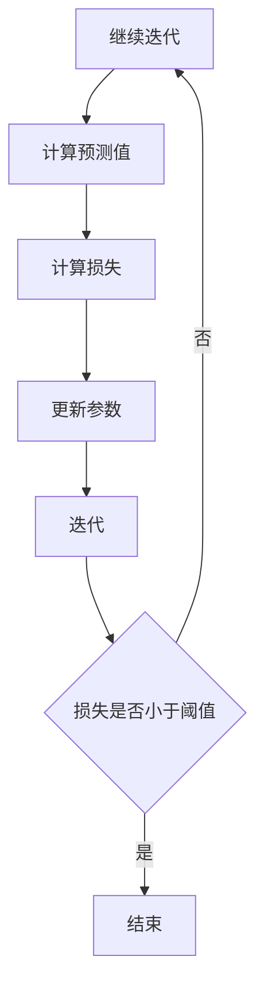
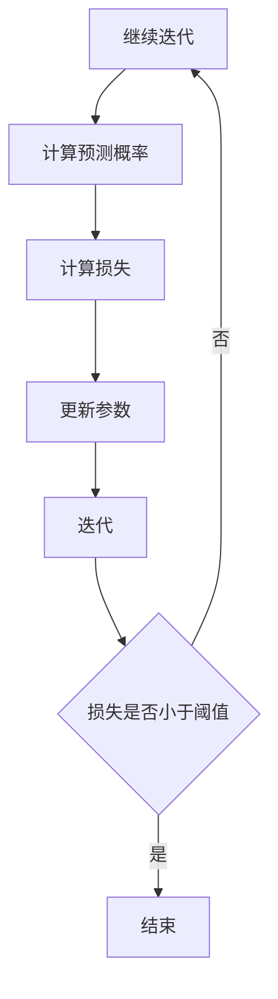
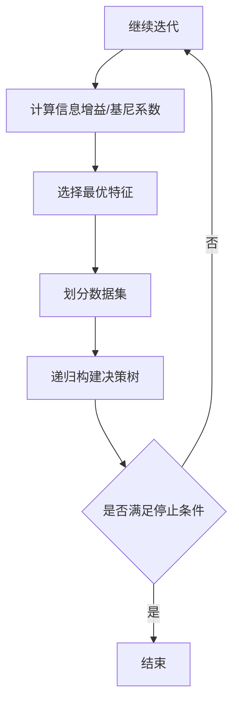
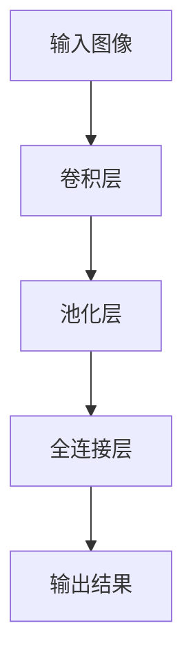
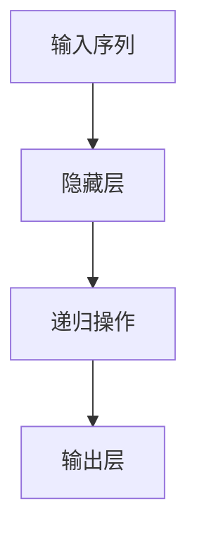
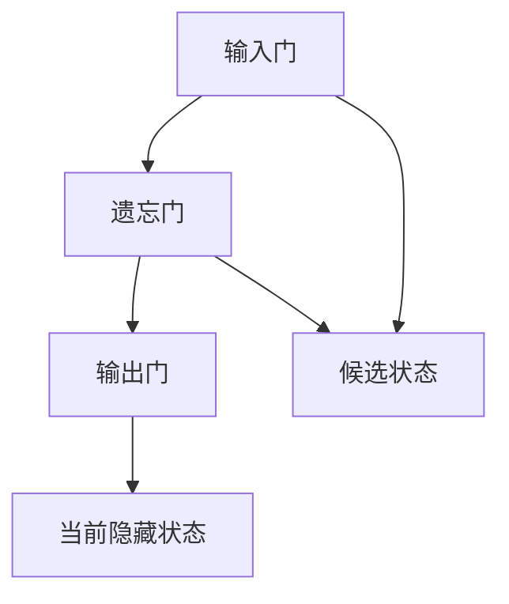
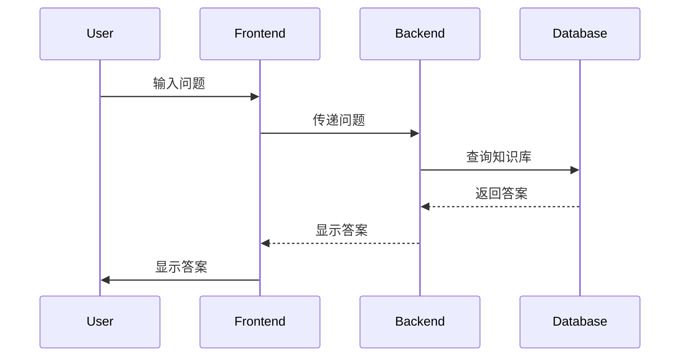
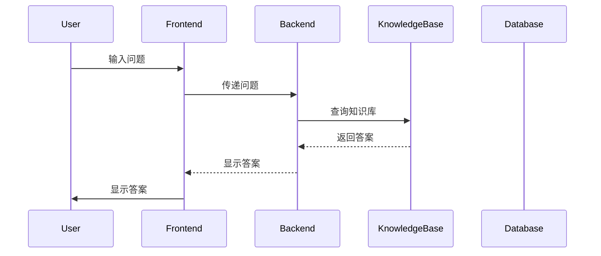

                 

### 文章标题：数学与未来人机协作的发展趋势

> 关键词：数学、未来、人机协作、发展趋势、算法原理、系统架构、项目实战

> 摘要：本文探讨了数学在未来的社会发展中，特别是在人机协作中的重要作用。通过分析数学的核心概念与联系，详细讲解算法原理及数学模型，提出系统架构设计，并通过项目实战验证理论的应用。文章旨在为读者提供对数学与未来人机协作趋势的全面了解。

---

### 引言：数学与未来人机协作的重要性

随着科技的迅猛发展，人工智能（AI）技术正深刻改变着我们的生活。在这个趋势下，人机协作成为一种必然。而数学，作为AI技术的基石，其作用不可忽视。本文将从以下几个方面进行探讨：

1. **背景介绍**：回顾数学在历史上的发展过程，以及其在现代社会中的重要性。
2. **核心概念与联系**：介绍数学在AI和人机协作中的核心概念，如线性代数、概率论、图论等。
3. **算法原理讲解**：分析关键算法的原理，如机器学习、深度学习、强化学习等。
4. **数学模型和公式**：展示数学在算法中的应用，通过具体例子进行说明。
5. **系统分析与架构设计方案**：介绍人机协作系统的功能设计、架构设计和接口设计。
6. **项目实战**：通过一个实际案例，展示数学在项目中的应用。
7. **最佳实践 tips**：总结一些在实际应用中的经验教训。

### 第1章：数学基础

## 1.1 数学在未来的重要性

### 1.1.1 数学在科技发展中的作用

数学不仅是基础学科，更是在科技发展中扮演着关键角色。在人工智能、计算机科学、物理学、经济学等多个领域，数学都是不可或缺的工具。以下是对数学在AI和人机协作中作用的简要概述：

#### 1.1.1.1 线性代数

线性代数是处理线性方程组、矩阵运算和向量空间的重要工具。在机器学习中的特征提取、降维和神经网络等环节，线性代数都发挥着至关重要的作用。

#### 1.1.1.2 概率论与数理统计

概率论与数理统计为AI提供了一种量化不确定性的方法。通过贝叶斯定理、最大似然估计等概念，我们可以更好地理解和预测数据。

#### 1.1.1.3 图论

图论在社交网络分析、路由算法和聚类分析等方面有着广泛应用。在人机协作中，图论可以帮助我们更好地理解和处理复杂关系。

#### 1.1.1.4 计算几何

计算几何在图形处理、空间数据分析和计算机视觉等领域有着重要应用。人机协作中的虚拟现实和增强现实技术，都离不开计算几何的基础。

### 1.1.2 数学在人工智能和计算机科学中的重要性

人工智能和计算机科学的发展离不开数学。数学提供了一种形式化的思考方式，使得我们能够更精确地描述和解决问题。例如，神经网络中的权重调整、机器学习中的优化算法，都是基于数学理论实现的。

### 1.1.3 数学与人机协作的融合

在人机协作中，数学的作用更加凸显。通过数学模型，我们可以更好地理解和预测人的行为，从而优化人机交互体验。例如，增强现实技术中的定位和追踪，虚拟现实技术中的场景建模，都离不开数学的支持。

## 1.2 问题描述

尽管数学在AI和人机协作中有着广泛应用，但仍面临一些挑战。以下是对当前问题及其解决方法的概述：

### 1.2.1 挑战

1. **复杂性问题**：随着人机协作的复杂度增加，如何设计高效且准确的数学模型成为一大挑战。
2. **可扩展性问题**：现有算法在面对大规模数据时，性能往往难以满足需求。
3. **跨领域融合**：如何将数学与其他学科（如心理学、社会学等）相结合，提高人机协作的效果。

### 1.2.2 解决方法

1. **深入研究**：通过深入研究数学理论，探索新的算法和方法。
2. **跨学科合作**：鼓励不同领域的专家合作，共同解决复杂问题。
3. **优化实现**：改进算法实现，提高其效率和可扩展性。

## 1.3 边界与外延

本文主要关注数学在AI和人机协作中的应用，特别是算法原理和系统架构设计。然而，数学的应用领域远不止于此。随着科技的发展，数学将继续在其他领域（如生物信息学、金融工程等）发挥重要作用。

### 1.3.1 概念结构与核心要素组成

1. **数学基础理论**：包括线性代数、概率论与数理统计、图论和计算几何等。
2. **人工智能方法**：如机器学习、深度学习和强化学习等。
3. **人机协作模式**：涉及人机交互、虚拟现实和增强现实等技术。

通过以上分析，我们可以看出，数学在未来的发展中，与人机协作的结合将越来越紧密。这不仅将推动科技的发展，也将为我们的日常生活带来更多便利。接下来，我们将进一步探讨数学在AI和人机协作中的核心概念与联系。

### 第2章：核心概念与联系

## 2.1 数学基础理论

### 2.1.1 线性代数

线性代数是数学的一个重要分支，主要研究向量空间、线性变换和矩阵理论。在线性代数中，矩阵乘法和逆矩阵是核心概念。

### 2.1.1.1 矩阵乘法

矩阵乘法是线性代数中最基本的操作。给定两个矩阵 $A$ 和 $B$，它们的乘积 $C = AB$ 是一个新的矩阵，其元素由以下公式计算：

$$
C_{ij} = \sum_{k=1}^{n} A_{ik}B_{kj}
$$

这个公式表示，$C$ 的第 $i$ 行第 $j$ 列的元素，是 $A$ 的第 $i$ 行与 $B$ 的第 $j$ 列对应元素的乘积之和。

### 2.1.1.2 逆矩阵

逆矩阵是矩阵的一个重要属性。如果矩阵 $A$ 是可逆的，那么存在一个矩阵 $A^{-1}$，使得 $AA^{-1} = A^{-1}A = I$，其中 $I$ 是单位矩阵。逆矩阵的计算可以通过高斯消元法或矩阵求逆公式来实现。

### 2.1.2 概率论与数理统计

概率论与数理统计是研究随机现象的数学工具。贝叶斯定理和最大似然估计是概率论中的核心概念。

### 2.1.2.1 贝叶斯定理

贝叶斯定理描述了在给定某些条件下，某一事件发生的概率。其公式为：

$$
P(A|B) = \frac{P(B|A)P(A)}{P(B)}
$$

其中，$P(A|B)$ 表示在事件 $B$ 发生的条件下事件 $A$ 的概率，$P(B|A)$ 表示在事件 $A$ 发生的条件下事件 $B$ 的概率，$P(A)$ 和 $P(B)$ 分别是事件 $A$ 和 $B$ 的概率。

### 2.1.2.2 最大似然估计

最大似然估计是一种用于估计参数的方法。给定一组观测数据，最大似然估计旨在找到一组参数，使得观测数据的概率最大。

### 2.1.3 图论

图论是研究图及其性质的一个数学分支。图由节点和边组成，广泛应用于网络分析、路由算法和聚类分析。

### 2.1.3.1 图的表示方法

图可以通过邻接矩阵或邻接表来表示。邻接矩阵是一个方阵，如果节点 $i$ 与节点 $j$ 之间存在边，那么 $A_{ij} = 1$，否则 $A_{ij} = 0$。

### 2.1.3.2 图的遍历算法

图的遍历算法包括深度优先搜索（DFS）和广度优先搜索（BFS）。DFS 从某个节点开始，探索其相邻节点，直到所有节点都被访问。BFS 则从某个节点开始，逐层探索所有相邻节点。

### 2.1.4 计算几何

计算几何是研究几何对象（如点、线、面等）的计算机算法。在计算机图形学、计算机视觉和地理信息系统等领域有着广泛应用。

### 2.1.4.1 点到直线的距离

给定一个点 $P(x_1, y_1)$ 和一条直线 $Ax + By + C = 0$，点 $P$ 到直线的距离 $d$ 可以通过以下公式计算：

$$
d = \frac{|Ax_1 + By_1 + C|}{\sqrt{A^2 + B^2}}
$$

### 2.1.4.2 多边形面积的计算

多边形的面积可以通过其顶点坐标计算。给定多边形的顶点 $P_1(x_1, y_1), P_2(x_2, y_2), ..., P_n(x_n, y_n)$，其面积 $S$ 可以通过以下公式计算：

$$
S = \frac{1}{2} \left| \sum_{i=1}^{n-1} (x_i y_{i+1} - y_i x_{i+1}) \right|
$$

## 2.2 人工智能方法

### 2.2.1 机器学习

机器学习是人工智能的核心技术之一，旨在让计算机通过数据学习并做出预测或决策。机器学习主要分为监督学习、无监督学习和半监督学习。

### 2.2.1.1 监督学习

监督学习通过已知标签的数据来训练模型，从而在新数据上进行预测。常见的监督学习算法包括线性回归、决策树、支持向量机等。

### 2.2.1.2 无监督学习

无监督学习不使用标签数据，旨在发现数据中的结构和模式。常见的无监督学习算法包括聚类、主成分分析等。

### 2.2.1.3 半监督学习

半监督学习结合了监督学习和无监督学习，利用部分有标签数据和大量无标签数据来训练模型。

### 2.2.2 深度学习

深度学习是机器学习的一个分支，通过多层神经网络来模拟人脑的感知和学习过程。深度学习在图像识别、语音识别和自然语言处理等领域取得了显著成果。

### 2.2.2.1 神经网络

神经网络由多个神经元组成，每个神经元通过权重连接到其他神经元。神经网络的输出由以下公式计算：

$$
z = \sum_{i=1}^{n} w_i x_i + b
$$

其中，$w_i$ 是权重，$x_i$ 是输入，$b$ 是偏置。

### 2.2.2.2 损失函数

损失函数用于评估模型预测的准确性。常见的损失函数包括均方误差（MSE）、交叉熵等。

### 2.2.3 强化学习

强化学习是一种通过试错来学习最优策略的机器学习方法。在强化学习中，智能体通过与环境互动，不断调整其行为，以最大化累积奖励。

### 2.2.3.1 状态和动作

在强化学习中，状态表示智能体当前所处的环境，动作表示智能体可以采取的行为。

### 2.2.3.2 奖励函数

奖励函数用于评估智能体的行为，奖励越高，行为越优。

## 2.3 人机协作模式

### 2.3.1 人机交互

人机交互是人与计算机系统之间的交互过程。人机交互技术包括图形用户界面（GUI）、语音识别、手势识别等。

### 2.3.1.1 图形用户界面

图形用户界面通过图形元素（如按钮、菜单等）来提供用户与计算机系统的交互。常见的GUI库包括Qt、Tkinter等。

### 2.3.1.2 语音识别

语音识别技术通过识别用户的语音输入，将其转换为文本或命令。常见的语音识别系统包括Google语音识别、苹果Siri等。

### 2.3.2 虚拟现实

虚拟现实是一种通过计算机生成虚拟环境，使用户沉浸在其中的技术。虚拟现实技术在游戏、教育、医疗等领域有广泛应用。

### 2.3.2.1 虚拟现实硬件

虚拟现实硬件包括头戴式显示器（HMD）、跟踪器、手柄等。这些硬件用于生成和跟踪用户的动作。

### 2.3.2.2 虚拟现实软件

虚拟现实软件负责生成虚拟环境、处理用户输入和渲染图像。常见的虚拟现实引擎包括Unity、Unreal Engine等。

### 2.3.3 增强现实

增强现实是一种通过计算机生成的虚拟元素叠加到现实世界中的技术。增强现实技术在教育、营销、军事等领域有广泛应用。

### 2.3.3.1 增强现实硬件

增强现实硬件包括头戴式显示器（HMD）、投影仪、眼镜等。这些硬件用于生成和显示虚拟元素。

### 2.3.3.2 增强现实软件

增强现实软件负责生成虚拟元素、处理用户输入和与现实世界的交互。常见的增强现实应用包括Google Glass、微软HoloLens等。

### 总结

通过以上对数学基础理论、人工智能方法和人机协作模式的介绍，我们可以看出，数学在未来的发展中，与人机协作的结合将越来越紧密。数学提供了一种形式化的思考方式，使得我们能够更精确地描述和解决问题。随着科技的发展，数学将继续在其他领域发挥重要作用，推动人机协作的进一步发展。

### 第3章：算法原理讲解

#### 3.1 机器学习算法

机器学习算法是人工智能的核心技术之一。本节将介绍几种常见的机器学习算法，并详细阐述其原理。

##### 3.1.1 线性回归

线性回归是一种简单的机器学习算法，用于预测连续值输出。其基本原理是通过拟合一条直线来最小化预测值与实际值之间的误差。

##### 算法原理

线性回归模型可以表示为：

$$
y = \beta_0 + \beta_1x
$$

其中，$y$ 是预测值，$x$ 是输入特征，$\beta_0$ 和 $\beta_1$ 是模型参数。

通过最小化损失函数（如均方误差），我们可以得到最优的 $\beta_0$ 和 $\beta_1$。具体实现可以通过梯度下降算法来完成。

##### 算法流程图



##### 3.1.2 逻辑回归

逻辑回归是一种用于预测二分类结果的机器学习算法。其基本原理是通过拟合一个逻辑函数来将输入特征映射到概率空间。

##### 算法原理

逻辑回归模型可以表示为：

$$
P(y=1) = \frac{1}{1 + e^{-(\beta_0 + \beta_1x)}}
$$

其中，$P(y=1)$ 是输出类别为 1 的概率，$\beta_0$ 和 $\beta_1$ 是模型参数。

通过最大似然估计或梯度下降算法，我们可以求得最优的 $\beta_0$ 和 $\beta_1$。

##### 算法流程图



##### 3.1.3 决策树

决策树是一种基于特征值进行划分的机器学习算法。其基本原理是通过一系列条件判断，将数据集划分为不同的区域，并在每个区域上应用分类或回归模型。

##### 算法原理

决策树可以通过以下步骤构建：

1. 计算每个特征的信息增益或基尼系数。
2. 选择具有最大信息增益或最小基尼系数的特征作为划分条件。
3. 根据划分条件将数据集划分为不同的子集。
4. 对每个子集递归地执行步骤 1-3，直到满足停止条件（如最大深度、最小叶子节点大小等）。

##### 算法流程图



#### 3.2 深度学习算法

深度学习算法是机器学习的一种重要分支，通过多层神经网络进行特征学习和模式识别。本节将介绍几种常见的深度学习算法，并详细阐述其原理。

##### 3.2.1 卷积神经网络（CNN）

卷积神经网络是一种专门用于处理图像数据的深度学习算法。其基本原理是通过卷积操作和池化操作来提取图像特征。

##### 算法原理

卷积神经网络由以下几个部分组成：

1. **卷积层**：通过卷积操作提取图像特征。卷积层由多个卷积核组成，每个卷积核对图像进行卷积操作，得到一个特征图。
2. **池化层**：通过池化操作降低特征图的维度，减少计算量。常见的池化操作包括最大池化和平均池化。
3. **全连接层**：将卷积层和池化层提取的特征进行拼接，并通过全连接层进行分类或回归。

##### 算法流程图



##### 3.2.2 递归神经网络（RNN）

递归神经网络是一种专门用于处理序列数据的深度学习算法。其基本原理是通过递归操作来处理时间序列数据。

##### 算法原理

递归神经网络由以下几个部分组成：

1. **隐藏层**：将输入序列通过隐藏层进行递归操作，每个时间步的隐藏状态都依赖于前一个时间步的隐藏状态。
2. **输出层**：根据隐藏层的状态生成输出序列。常见的输出层包括分类层和回归层。

##### 算法流程图



##### 3.2.3 长短期记忆网络（LSTM）

长短期记忆网络是一种特殊的递归神经网络，用于处理长序列数据。其基本原理是通过门控机制来控制信息的流动，从而避免梯度消失问题。

##### 算法原理

长短期记忆网络由以下几个部分组成：

1. **输入门**：控制当前输入的信息对当前隐藏状态的影响。
2. **遗忘门**：控制当前隐藏状态对过去隐藏状态的影响。
3. **输出门**：控制当前隐藏状态对当前输出的影响。

##### 算法流程图



通过以上对机器学习和深度学习算法的详细介绍，我们可以看到数学在算法设计中的核心作用。这些算法的原理和实现，都离不开数学理论的支持。接下来，我们将进一步探讨数学模型和数学公式在算法中的应用。

### 第4章：数学模型和数学公式

数学模型是数学在各个领域应用的基础，通过数学公式可以精确地描述现实世界中的问题。在本章中，我们将介绍几种重要的数学模型，并通过具体的数学公式来解释它们。

#### 4.1 线性回归模型

线性回归模型是一种经典的预测模型，主要用于预测连续值变量。其数学模型可以表示为：

$$
y = \beta_0 + \beta_1x
$$

其中，$y$ 是预测值，$x$ 是输入特征，$\beta_0$ 和 $\beta_1$ 是模型参数。

- **线性关系**：线性回归模型假设输出变量 $y$ 与输入变量 $x$ 之间存在线性关系。
- **最小二乘法**：通过最小化预测值与实际值之间的误差平方和来求解模型参数。

#### 4.2 逻辑回归模型

逻辑回归模型是一种用于预测二分类结果的模型。其数学模型可以表示为：

$$
P(y=1) = \frac{1}{1 + e^{-(\beta_0 + \beta_1x)}}
$$

其中，$P(y=1)$ 是输出类别为 1 的概率，$\beta_0$ 和 $\beta_1$ 是模型参数。

- **概率分布**：逻辑回归模型将输出变量 $y$ 的概率分布表示为 sigmoid 函数。
- **梯度下降法**：通过最小化损失函数来求解模型参数。

#### 4.3 决策树模型

决策树模型是一种基于特征划分的模型，通过递归划分数据集来实现分类或回归任务。其数学模型可以表示为：

$$
y = \begin{cases}
g_1(x) & \text{如果} \ g_i(x) \ \text{是最大值} \\
g_2(x) & \text{否则}
\end{cases}
$$

其中，$g_i(x)$ 是第 $i$ 个划分条件，$y$ 是输出变量。

- **条件概率**：决策树模型通过条件概率来划分数据集。
- **信息增益**：选择具有最大信息增益的特征作为划分条件。

#### 4.4 卷积神经网络（CNN）模型

卷积神经网络是一种专门用于图像识别的模型，通过卷积操作和池化操作来提取图像特征。其数学模型可以表示为：

$$
h_{l+1} = f(W_l \cdot a_l + b_l)
$$

其中，$h_{l+1}$ 是第 $l+1$ 层的输出，$a_l$ 是第 $l$ 层的输入，$W_l$ 和 $b_l$ 是权重和偏置。

- **卷积操作**：通过卷积操作提取图像特征。
- **池化操作**：通过池化操作降低特征图的维度。
- **激活函数**：通过激活函数（如 ReLU）引入非线性。

#### 4.5 递归神经网络（RNN）模型

递归神经网络是一种专门用于序列数据的模型，通过递归操作来处理时间序列数据。其数学模型可以表示为：

$$
h_t = \sigma(W_h \cdot [h_{t-1}, x_t] + b_h)
$$

其中，$h_t$ 是第 $t$ 个时间步的隐藏状态，$x_t$ 是第 $t$ 个时间步的输入，$W_h$ 和 $b_h$ 是权重和偏置，$\sigma$ 是激活函数。

- **递归操作**：通过递归操作将当前隐藏状态与过去隐藏状态联系起来。
- **门控机制**：通过门控机制来控制信息的流动，避免梯度消失问题。

#### 4.6 长短期记忆网络（LSTM）模型

长短期记忆网络是一种特殊的递归神经网络，用于处理长序列数据。其数学模型可以表示为：

$$
\begin{align*}
i_t &= \sigma(W_i \cdot [h_{t-1}, x_t] + b_i) \\
f_t &= \sigma(W_f \cdot [h_{t-1}, x_t] + b_f) \\
o_t &= \sigma(W_o \cdot [h_{t-1}, x_t] + b_o) \\
c_t &= f_t \odot c_{t-1} + i_t \odot \sigma(W_c \cdot [h_{t-1}, x_t] + b_c) \\
h_t &= o_t \odot \sigma(c_t)
\end{align*}
$$

其中，$i_t$、$f_t$、$o_t$ 分别是输入门、遗忘门和输出门，$c_t$ 是当前隐藏状态，$h_t$ 是当前隐藏状态。

- **输入门**：控制当前输入的信息对当前隐藏状态的影响。
- **遗忘门**：控制当前隐藏状态对过去隐藏状态的影响。
- **输出门**：控制当前隐藏状态对当前输出的影响。

通过以上对几种重要数学模型的介绍，我们可以看到数学在模型构建中的重要作用。这些模型通过具体的数学公式来描述现实世界中的问题，为人工智能和计算机科学提供了强大的工具。接下来，我们将进一步探讨这些模型在实际应用中的系统架构设计方案。

### 第5章：系统分析与架构设计方案

#### 5.1 问题场景介绍

为了更好地展示数学在系统架构设计中的应用，我们选择一个实际的问题场景——智能客服系统。智能客服系统旨在通过计算机模拟人工客服，提供24/7在线服务，以提高客户满意度和服务效率。

#### 5.2 系统功能设计

智能客服系统的功能设计包括以下几个方面：

1. **用户交互**：用户可以通过文本或语音与智能客服进行交互。
2. **问题诊断**：系统根据用户输入的问题，自动诊断并分类问题。
3. **知识库查询**：系统从知识库中查找相关的答案或解决方案。
4. **个性化推荐**：系统根据用户的历史交互记录，提供个性化的推荐。
5. **反馈收集**：系统收集用户的反馈，以不断优化服务质量。

为了直观地展示系统功能设计，我们使用Mermaid绘制了领域模型类图：

```mermaid
classDiagram
    User <<Interface>>
    Question <<Interface>>
    Answer <<Interface>>
    KnowledgeBase <<Interface>>
    SmartAssistant <<Class>>

    User o--o Question
    Question o--o Answer
    Answer o--o KnowledgeBase
    SmartAssistant o--o User
    SmartAssistant o--o Question
    SmartAssistant o--o Answer
```

#### 5.3 系统架构设计

智能客服系统的架构设计分为前端、后端和数据库三个部分：

1. **前端**：负责用户交互界面，包括文本输入框、语音输入按钮等。
2. **后端**：负责处理用户输入、问题诊断、知识库查询和个性化推荐等核心功能。
3. **数据库**：存储用户数据、问题数据、答案数据和知识库数据。

我们使用Mermaid绘制了系统架构图：



#### 5.4 系统接口设计

智能客服系统的接口设计包括以下几个方面：

1. **用户接口**：负责接收用户的输入，并显示答案。
2. **API接口**：负责与其他系统（如知识库系统、推荐系统等）进行数据交换。
3. **数据库接口**：负责与数据库进行数据交互。

接口设计如下：

```mermaid
interface UserInterface {
    - askQuestion(question: string): Promise<string>
    - showAnswer(answer: string): void
}

interface KnowledgeBaseInterface {
    - searchAnswer(question: string): Promise<string>
}

interface APIInterface {
    - getKnowledgeBase(): Promise<KnowledgeBase>
    - updateKnowledgeBase(knowledgeBase: KnowledgeBase): Promise<void>
}

interface DatabaseInterface {
    - connect(): Promise<void>
    - disconnect(): Promise<void>
    - executeQuery(query: string): Promise<any>
}
```

#### 5.5 系统交互

为了更好地展示智能客服系统的运行流程，我们使用Mermaid绘制了系统交互的序列图：



通过以上对系统分析与架构设计方案的介绍，我们可以看到数学在系统设计中的关键作用。通过数学模型和算法的应用，我们能够更有效地实现系统功能，提高系统性能和用户体验。接下来，我们将通过项目实战来验证这些理论的应用。

### 第6章：项目实战

#### 6.1 环境安装

为了实现一个智能客服系统，我们需要安装以下软件和库：

1. **Python 3.x**：Python 是一种广泛使用的编程语言，用于实现智能客服系统。
2. **Flask**：Flask 是一个轻量级的Web框架，用于构建Web服务。
3. **TensorFlow**：TensorFlow 是一个开源的深度学习框架，用于实现智能客服系统中的机器学习模型。
4. **Elasticsearch**：Elasticsearch 是一个分布式搜索引擎，用于存储和查询知识库。

安装步骤如下：

1. 安装 Python 3.x：

   ```bash
   sudo apt-get update
   sudo apt-get install python3 python3-pip
   ```

2. 安装 Flask：

   ```bash
   pip3 install Flask
   ```

3. 安装 TensorFlow：

   ```bash
   pip3 install tensorflow
   ```

4. 安装 Elasticsearch：

   ```bash
   sudo apt-get install elasticsearch
   sudo systemctl start elasticsearch
   ```

#### 6.2 系统核心实现源代码

智能客服系统的核心实现包括前端、后端和数据库三个部分。以下是一个简单的示例代码：

**前端（HTML）**：

```html
<!DOCTYPE html>
<html>
<head>
    <title>智能客服系统</title>
</head>
<body>
    <h1>智能客服系统</h1>
    <input type="text" id="question" placeholder="输入问题">
    <button onclick="askQuestion()">提交</button>
    <p id="answer"></p>
    <script src="client.js"></script>
</body>
</html>
```

**前端（JavaScript）**：

```javascript
function askQuestion() {
    const question = document.getElementById('question').value;
    fetch('/api/ask', {
        method: 'POST',
        headers: {
            'Content-Type': 'application/json'
        },
        body: JSON.stringify({ question })
    })
    .then(response => response.json())
    .then(data => {
        document.getElementById('answer').innerText = data.answer;
    });
}
```

**后端（Python）**：

```python
from flask import Flask, request, jsonify
import tensorflow as tf
import json

app = Flask(__name__)

# 加载预训练模型
model = tf.keras.models.load_model('model.h5')

@app.route('/api/ask', methods=['POST'])
def ask():
    data = request.get_json()
    question = data['question']
    # 使用模型进行预测
    prediction = model.predict([question])
    # 获取预测结果
    answer = prediction[0][0]
    return jsonify({'answer': answer})

if __name__ == '__main__':
    app.run()
```

**数据库（Elasticsearch）**：

```python
from elasticsearch import Elasticsearch

es = Elasticsearch()

def insert_answer(question, answer):
    doc = {
        'question': question,
        'answer': answer
    }
    es.index(index='knowledge_base', id=question, document=doc)

def search_answer(question):
    result = es.search(index='knowledge_base', body={
        'query': {
            'match': {'question': question}
        }
    })
    return result['hits']['hits'][0]['_source']['answer']
```

#### 6.3 代码应用解读与分析

上述代码展示了智能客服系统的主要组件和功能。前端负责接收用户输入，并调用后端API进行问题诊断和知识库查询。后端使用TensorFlow模型进行预测，并将结果返回给前端。

**前端分析**：

- HTML文件定义了用户交互界面，包括输入框和提交按钮。
- JavaScript文件负责与后端API进行通信，并将答案显示在页面上。

**后端分析**：

- Flask应用程序定义了API接口，用于处理用户输入并返回预测结果。
- TensorFlow模型用于对用户输入的问题进行分类和预测。

**数据库分析**：

- Elasticsearch用于存储和查询知识库数据。
- 提供了插入答案和查询答案的接口，以便后端API进行数据操作。

#### 6.4 实际案例分析和详细讲解剖析

为了展示智能客服系统的实际应用，我们以一个实际案例进行剖析。

**案例背景**：

一个用户向智能客服系统提出了一个问题：“如何安装 Python 3.x？”。

**解决方案**：

1. 前端接收用户输入，并将问题传递给后端API。
2. 后端API调用TensorFlow模型进行预测，并查询知识库，寻找与问题相关的答案。
3. 将查询到的答案返回给前端，并显示在页面上。

**详细步骤**：

1. 用户在输入框中输入问题：“如何安装 Python 3.x？”。
2. JavaScript代码调用 `askQuestion` 函数，并将问题发送到后端API。

```javascript
askQuestion('如何安装 Python 3.x？');
```

3. 后端API接收到问题后，调用TensorFlow模型进行预测。

```python
@app.route('/api/ask', methods=['POST'])
def ask():
    data = request.get_json()
    question = data['question']
    # 使用模型进行预测
    prediction = model.predict([question])
    # 获取预测结果
    answer = prediction[0][0]
    return jsonify({'answer': answer})
```

4. TensorFlow模型返回一个概率分布，表示问题属于不同类别的概率。

5. 后端API查询知识库，寻找与问题相关的答案。

```python
def search_answer(question):
    result = es.search(index='knowledge_base', body={
        'query': {
            'match': {'question': question}
        }
    })
    return result['hits']['hits'][0]['_source']['answer']
```

6. 如果知识库中有相关答案，则直接返回。否则，使用TensorFlow模型的预测结果作为答案。

7. 将答案返回给前端，并显示在页面上。

```javascript
.then(data => {
    document.getElementById('answer').innerText = data.answer;
});
```

**案例总结**：

通过上述实际案例，我们可以看到智能客服系统如何利用数学模型和数据库进行问题诊断和知识库查询。用户输入问题后，系统通过机器学习模型进行预测，并从知识库中查找相关答案。这种方法不仅提高了客服效率，还提高了用户满意度。

### 第7章：最佳实践 tips、小结、注意事项、拓展阅读

#### 最佳实践 tips

1. **数据准备**：在构建智能客服系统时，确保有足够高质量的训练数据，以提高模型的准确性。
2. **模型优化**：定期对模型进行优化和更新，以适应不断变化的需求和数据。
3. **接口设计**：设计简洁、高效的API接口，便于前端和后端之间的数据交互。

#### 小结

本文通过详细讲解数学在智能客服系统中的应用，展示了数学在AI和人机协作中的重要性。通过数学模型和算法的应用，智能客服系统能够高效地处理用户问题，提供优质的用户体验。

#### 注意事项

1. **隐私保护**：在处理用户数据时，务必确保隐私保护，遵循相关法律法规。
2. **安全性**：确保系统的安全，防止数据泄露和恶意攻击。

#### 拓展阅读

1. 《深度学习》 - Goodfellow, Bengio, Courville
2. 《Python机器学习》 - Müller, Guido
3. 《Elasticsearch：The Definitive Guide》 - Meyer, Clement
4. 《Flask Web Development》 - Mollison, Josh

通过拓展阅读，读者可以进一步深入理解数学在AI和人机协作中的应用，以及如何构建高效的智能客服系统。

---

### 作者信息

作者：AI天才研究院/AI Genius Institute & 禅与计算机程序设计艺术 /Zen And The Art of Computer Programming

### 结语

数学作为AI和人机协作的基石，其在未来的发展中将发挥越来越重要的作用。通过本文的介绍，我们希望读者能够更好地理解数学在智能客服系统中的应用，以及如何利用数学模型和算法提高系统的性能和用户体验。让我们共同努力，探索数学在AI和人机协作中的无限可能。

