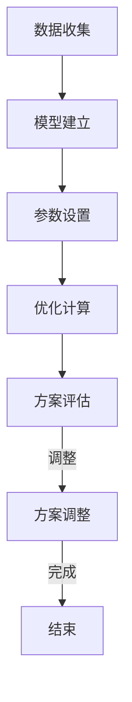
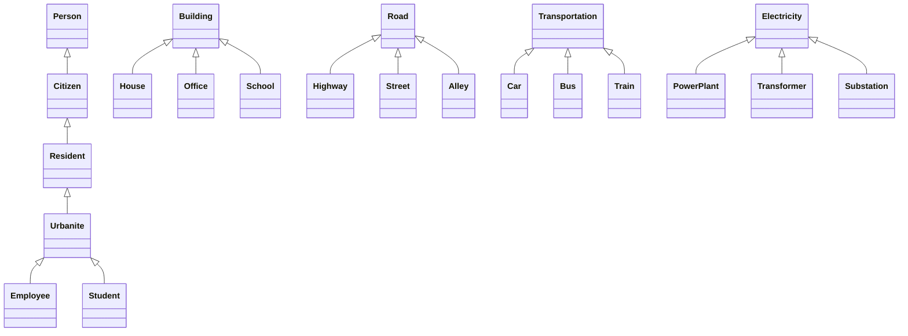
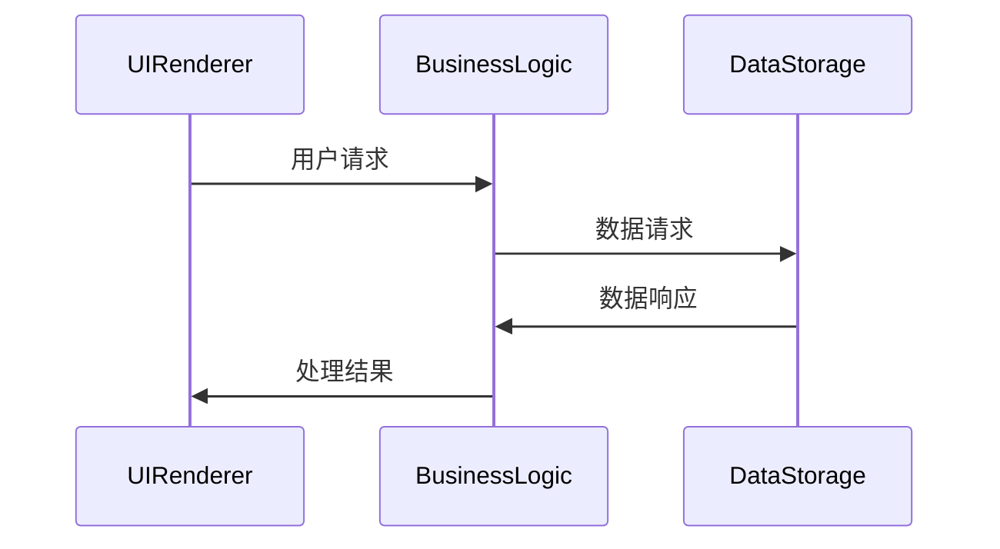
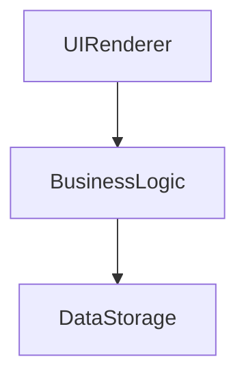
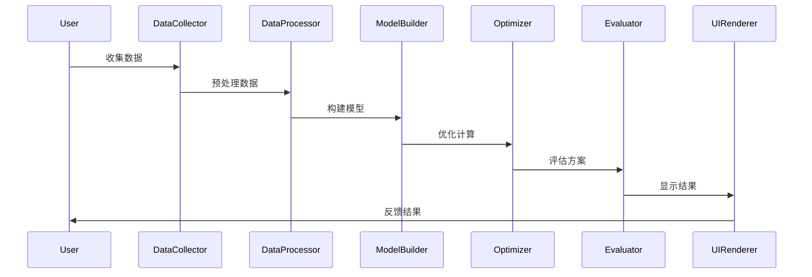

                 

### 数学与未来城市规划的新思路

> 关键词：城市规划、数学模型、算法、系统架构、人工智能

> 摘要：本文探讨了数学在当前城市规划中的作用，分析了未来城市规划面临的挑战，并提出了一种基于数学算法的新思路。通过详细的算法原理讲解、数学模型和公式展示，以及系统分析与架构设计方案，为未来城市规划提供了新的解决方案。

## 目录大纲设计

### 第一部分：问题背景与核心概念

#### 第1章：问题背景与数学在城市规划中的应用

##### 1.1 问题的提出
- 现代城市规划面临的挑战
- 数学在解决城市规划问题中的重要性

##### 1.2 数学在城市规划中的核心概念
- 数学模型概述
- 数学在城市规划中的具体应用
- 核心概念与联系

##### 1.3 本章小结

### 第二部分：算法原理与系统架构

#### 第2章：未来城市规划的数学算法原理

##### 2.1 算法原理概述
- 算法背景
- 算法目标
- 算法优势

##### 2.2 算法原理详细讲解
- mermaid 流程图
- Python 源代码实现
- 数学模型与公式

##### 2.3 数学模型与公式
- 公式 1
- 公式 2

##### 2.4 本章小结

### 第三部分：系统分析与架构设计

#### 第3章：城市规划系统的设计与实现

##### 3.1 问题场景介绍
- 城市规划项目概述
- 需求分析
- 项目目标

##### 3.2 系统功能设计
- 领域模型类图
- 系统功能模块划分

##### 3.3 系统架构设计
- 系统架构概述
- 架构设计 mermaid 图
- 系统接口设计
- 系统交互 mermaid 序列图

##### 3.4 项目实战
- 环境安装
- 系统核心实现源代码
- 代码应用解读与分析
- 实际案例分析和详细讲解剖析
- 项目小结

##### 3.5 最佳实践 tips、小结、注意事项、拓展阅读等内容

## 第一部分：问题背景与核心概念

### 第1章：问题背景与数学在城市规划中的应用

#### 1.1 问题的提出

随着全球城市化进程的不断加快，现代城市规划面临着前所未有的挑战。城市规模的不断扩大，人口的急剧增长，资源的日益紧张，以及环境问题的日益突出，都给城市规划带来了巨大的压力。在这种背景下，如何通过科学的方法来优化城市布局、提高城市运行效率、提升居民生活质量，成为了一个亟待解决的问题。

数学，作为一门科学，其在城市规划中的应用越来越受到重视。数学模型、算法、数学公式等工具为城市规划提供了强大的技术支持，使得城市规划更加科学、合理、高效。数学在城市规划中的作用主要体现在以下几个方面：

1. **数据分析**：数学可以用来分析城市人口、资源、环境等数据，提取有用的信息，为城市规划提供数据支持。
2. **模型构建**：数学模型可以模拟城市运行的各种情景，帮助规划者预测未来城市的发展趋势，制定合理的规划方案。
3. **优化决策**：通过数学优化算法，可以找到最优的城市布局方案，提高城市运行效率。
4. **风险评估**：数学方法可以用来评估城市规划方案的风险，减少规划过程中的不确定性。

#### 1.2 数学在城市规划中的核心概念

1. **数学模型概述**

数学模型是运用数学语言对现实问题进行简化和抽象的结果，通常包括变量、参数、方程等。在城市规划中，常见的数学模型有：

- **人口模型**：用于预测城市人口的增长和分布。
- **交通模型**：用于分析城市交通流量、拥堵状况等。
- **能源模型**：用于评估城市能源消耗、能源分布等。

2. **数学在城市规划中的具体应用**

- **空间分析**：数学方法可以用来分析城市空间结构，如用地布局、交通网络等。
- **优化算法**：通过数学优化算法，如线性规划、整数规划、遗传算法等，可以找到最优的规划方案。
- **风险管理**：数学模型可以用来评估城市规划方案的风险，如自然灾害、经济风险等。

3. **核心概念与联系**

在城市规划中，核心概念之间的联系非常重要。例如，人口模型与交通模型之间的联系，能源模型与空间分析之间的联系，都对于城市规划的科学性、合理性和高效性至关重要。

#### 1.3 本章小结

本章介绍了数学在城市规划中的重要作用，分析了数学模型在城市规划中的具体应用，并探讨了核心概念之间的联系。通过本章的学习，读者可以初步了解数学在城市规划中的应用前景，为后续章节的深入探讨打下基础。

## 第二部分：算法原理与系统架构

### 第2章：未来城市规划的数学算法原理

#### 2.1 算法原理概述

未来城市规划的数学算法是一种基于数学模型和优化算法的解决方案，旨在通过科学的方法来优化城市布局、提高城市运行效率、提升居民生活质量。本节将详细介绍该算法的原理、背景和优势。

#### 2.1.1 算法背景

随着城市化进程的加快，城市规划面临诸多挑战。传统的规划方法主要依赖于经验判断和主观决策，难以应对复杂多变的城市环境。而数学算法为城市规划提供了一种新的思路，通过定量分析和优化决策，可以帮助规划者更好地应对城市发展的挑战。

#### 2.1.2 算法目标

未来城市规划的数学算法旨在实现以下目标：

1. **资源优化**：通过优化城市布局，实现土地、能源等资源的合理分配，提高资源利用效率。
2. **交通优化**：通过优化交通网络，减少交通拥堵，提高交通运行效率，改善居民出行体验。
3. **环境保护**：通过数学模型和算法，评估城市规划方案对环境的影响，减少环境污染，实现可持续发展。

#### 2.1.3 算法优势

未来城市规划的数学算法具有以下优势：

1. **科学性**：基于数学模型和优化算法，确保规划方案的合理性、科学性。
2. **高效性**：通过快速计算和优化决策，提高规划效率，缩短规划周期。
3. **灵活性**：算法可以适应不同城市的特点和需求，灵活调整规划方案。
4. **可扩展性**：算法可以与其他技术（如人工智能、大数据等）结合，实现城市规划的智能化、精细化。

#### 2.2 算法原理详细讲解

本节将详细介绍未来城市规划的数学算法原理，包括算法流程、mermaid流程图和Python源代码实现。

##### 2.2.1 算法流程

未来城市规划的数学算法主要包括以下步骤：

1. **数据收集**：收集城市人口、资源、环境等数据，为后续分析提供基础。
2. **模型建立**：根据数据特点，建立相应的数学模型，如人口模型、交通模型、能源模型等。
3. **参数设置**：设置模型参数，包括目标函数、约束条件等，为优化算法提供基础。
4. **优化计算**：采用优化算法（如线性规划、整数规划、遗传算法等），寻找最优规划方案。
5. **方案评估**：对优化方案进行评估，包括资源利用效率、交通运行效率、环境影响等。
6. **方案调整**：根据评估结果，对规划方案进行调整，直至满足预期目标。

##### 2.2.2 mermaid 流程图

以下是一个简单的mermaid流程图，展示了未来城市规划的数学算法流程：



##### 2.2.3 Python 源代码实现

以下是一个简单的Python源代码实现，展示了未来城市规划的数学算法原理：

```python
# Python 源代码实现
def urban_plan_algorithm(data):
    # 数据收集
    population = data['population']
    resources = data['resources']
    environment = data['environment']
    
    # 模型建立
    population_model = build_population_model(population)
    traffic_model = build_traffic_model(population, resources)
    energy_model = build_energy_model(resources, environment)
    
    # 参数设置
    objective_function = set_objective_function()
    constraints = set_constraints()
    
    # 优化计算
    solution = optimize_solution(objective_function, constraints)
    
    # 方案评估
    evaluation_result = evaluate_solution(solution)
    
    # 方案调整
    adjusted_solution = adjust_solution(solution, evaluation_result)
    
    # 输出结果
    return adjusted_solution

# 辅助函数实现
def build_population_model(population):
    # 人口模型建立
    pass

def build_traffic_model(population, resources):
    # 交通模型建立
    pass

def build_energy_model(resources, environment):
    # 能源模型建立
    pass

def set_objective_function():
    # 目标函数设置
    pass

def set_constraints():
    # 约束条件设置
    pass

def optimize_solution(objective_function, constraints):
    # 优化计算
    pass

def evaluate_solution(solution):
    # 方案评估
    pass

def adjust_solution(solution, evaluation_result):
    # 方案调整
    pass
```

##### 2.2.4 数学模型与公式

未来城市规划的数学算法中，常用的数学模型和公式包括：

1. **人口模型**：

   $$ 
   P(t) = P_0 \cdot e^{rt} 
   $$ 

   其中，$P(t)$ 为 $t$ 时刻的人口数量，$P_0$ 为初始人口数量，$r$ 为人口增长率。

2. **交通模型**：

   $$ 
   F = C \cdot N 
   $$ 

   其中，$F$ 为交通流量，$C$ 为交通拥堵系数，$N$ 为道路网络中的车辆数量。

3. **能源模型**：

   $$ 
   E = P \cdot Q 
   $$ 

   其中，$E$ 为能源消耗，$P$ 为能源价格，$Q$ 为能源需求量。

#### 2.3 数学模型与公式

本节将详细介绍未来城市规划的数学模型和公式，包括人口模型、交通模型、能源模型等。

##### 2.3.1 人口模型

人口模型用于预测城市人口的增长和分布。一个常见的人口模型是指数增长模型，其公式如下：

$$ 
P(t) = P_0 \cdot e^{rt} 
$$ 

其中，$P(t)$ 为 $t$ 时刻的人口数量，$P_0$ 为初始人口数量，$r$ 为人口增长率，$e$ 为自然对数的底。

通过调整人口增长率 $r$，可以预测未来不同时间点的人口数量。例如，假设某城市初始人口为 100 万，年人口增长率为 2%，则可以使用以下公式计算未来的人口数量：

$$ 
P(t) = 100万 \cdot e^{0.02t} 
$$ 

当 $t$ 取不同值时，可以计算出不同时间点的人口数量，如 10 年后的人口数量为：

$$ 
P(10) = 100万 \cdot e^{0.02 \cdot 10} \approx 122.2 万
$$ 

通过人口模型，规划者可以预测城市人口增长趋势，为城市规划提供数据支持。

##### 2.3.2 交通模型

交通模型用于分析城市交通流量、拥堵状况等。一个常见的交通模型是流量-密度模型，其公式如下：

$$ 
F = C \cdot N 
$$ 

其中，$F$ 为交通流量，$C$ 为交通拥堵系数，$N$ 为道路网络中的车辆数量。

当交通流量 $F$ 小于道路容量 $C$ 时，交通畅通；当交通流量 $F$ 大于道路容量 $C$ 时，交通拥堵。交通拥堵系数 $C$ 通常由交通管理部门根据实际情况进行设定。

通过交通模型，规划者可以预测城市交通流量，分析交通拥堵状况，为交通规划提供数据支持。

##### 2.3.3 能源模型

能源模型用于评估城市能源消耗、能源分布等。一个常见的能源模型是能源需求模型，其公式如下：

$$ 
E = P \cdot Q 
$$ 

其中，$E$ 为能源消耗，$P$ 为能源价格，$Q$ 为能源需求量。

能源消耗 $E$ 取决于能源价格 $P$ 和能源需求量 $Q$。能源价格 $P$ 通常由市场供需关系决定，能源需求量 $Q$ 受到城市人口、产业结构等因素的影响。

通过能源模型，规划者可以评估城市规划方案对能源消耗的影响，为能源规划提供数据支持。

#### 2.4 本章小结

本章详细介绍了未来城市规划的数学算法原理，包括算法流程、mermaid流程图和Python源代码实现。通过数学模型和公式，读者可以更好地理解算法原理和实际应用。下一章将介绍城市规划系统的设计与实现，为读者提供更全面的规划方案。

## 第三部分：系统分析与架构设计

### 第3章：城市规划系统的设计与实现

#### 3.1 问题场景介绍

在本节中，我们将介绍一个典型的城市规划项目，包括项目的背景、需求分析和项目目标。

##### 3.1.1 城市规划项目概述

假设我们正在开发一个名为“智慧城市”的项目，旨在通过先进的技术手段，优化城市布局、提高城市运行效率、提升居民生活质量。该项目涉及多个模块，包括人口分析、交通规划、能源管理、环境监测等。

##### 3.1.2 需求分析

根据项目需求，我们需要实现以下功能：

1. **数据收集**：收集城市人口、交通流量、能源消耗、环境数据等，为后续分析提供基础。
2. **数据预处理**：对收集到的数据进行清洗、转换和整合，确保数据质量。
3. **模型构建**：建立人口模型、交通模型、能源模型等，用于预测和分析城市运行状况。
4. **优化算法**：采用优化算法，如线性规划、整数规划、遗传算法等，寻找最优规划方案。
5. **方案评估**：对规划方案进行评估，包括资源利用效率、交通运行效率、环境影响等。
6. **用户界面**：提供直观的用户界面，展示规划结果，方便用户进行决策。

##### 3.1.3 项目目标

智慧城市项目的目标如下：

1. **资源优化**：通过优化城市布局，实现土地、能源等资源的合理分配，提高资源利用效率。
2. **交通优化**：通过优化交通网络，减少交通拥堵，提高交通运行效率，改善居民出行体验。
3. **环境保护**：通过数学模型和算法，评估城市规划方案对环境的影响，减少环境污染，实现可持续发展。

#### 3.2 系统功能设计

系统功能设计是城市规划系统的核心，它决定了系统能够提供哪些服务和功能。在本节中，我们将详细介绍系统功能设计，包括领域模型类图和系统功能模块划分。

##### 3.2.1 领域模型类图

领域模型类图用于描述系统中的核心实体及其之间的关系。以下是一个简化的领域模型类图，展示了城市规划系统中的主要实体和关系：



在这个类图中，我们定义了以下核心实体：

- **Person**：表示个人。
- **Citizen**：表示公民，是 Person 的子类。
- **Resident**：表示居民，是 Citizen 的子类。
- **Urbanite**：表示城市居民，是 Resident 的子类。
- **Employee**：表示员工，是 Urbanite 的子类。
- **Student**：表示学生，是 Urbanite 的子类。
- **Building**：表示建筑。
- **House**：表示住宅，是 Building 的子类。
- **Office**：表示办公楼，是 Building 的子类。
- **School**：表示学校，是 Building 的子类。
- **Road**：表示道路。
- **Highway**：表示高速公路，是 Road 的子类。
- **Street**：表示街道，是 Road 的子类。
- **Alley**：表示小巷，是 Road 的子类。
- **Transportation**：表示交通。
- **Car**：表示汽车，是 Transportation 的子类。
- **Bus**：表示公交车，是 Transportation 的子类。
- **Train**：表示火车，是 Transportation 的子类。
- **Electricity**：表示电力。
- **PowerPlant**：表示发电厂，是 Electricity 的子类。
- **Transformer**：表示变压器，是 Electricity 的子类。
- **Substation**：表示变电站，是 Electricity 的子类。

这些实体之间的关系定义如下：

- **Person** 是 **Citizen** 的父类，**Citizen** 是 **Resident** 的父类，**Resident** 是 **Urbanite** 的父类，**Urbanite** 是 **Employee** 和 **Student** 的父类。
- **Building** 是 **House**、**Office** 和 **School** 的父类。
- **Road** 是 **Highway**、**Street** 和 **Alley** 的父类。
- **Transportation** 是 **Car**、**Bus** 和 **Train** 的父类。
- **Electricity** 是 **PowerPlant**、**Transformer** 和 **Substation** 的父类。

##### 3.2.2 系统功能模块划分

根据需求分析，城市规划系统可以分为以下主要功能模块：

1. **数据收集模块**：负责收集城市人口、交通流量、能源消耗、环境数据等，并将数据存储到数据库中。
2. **数据预处理模块**：负责对收集到的数据进行清洗、转换和整合，确保数据质量。
3. **模型构建模块**：负责建立人口模型、交通模型、能源模型等，用于预测和分析城市运行状况。
4. **优化算法模块**：负责采用优化算法，如线性规划、整数规划、遗传算法等，寻找最优规划方案。
5. **方案评估模块**：负责对规划方案进行评估，包括资源利用效率、交通运行效率、环境影响等。
6. **用户界面模块**：负责提供直观的用户界面，展示规划结果，方便用户进行决策。

#### 3.3 系统架构设计

系统架构设计是系统开发的重要环节，它决定了系统的性能、可扩展性和可维护性。在本节中，我们将介绍城市规划系统的架构设计，包括系统架构概述、架构设计 mermaid 图、系统接口设计和系统交互 mermaid 序列图。

##### 3.3.1 系统架构概述

城市规划系统采用三层架构设计，包括表示层、业务逻辑层和数据层。以下是一个简化的系统架构图：



在这个架构中：

- **表示层**（UIRenderer）：负责与用户交互，接收用户请求，并将处理结果展示给用户。
- **业务逻辑层**（BusinessLogic）：负责处理业务逻辑，包括数据预处理、模型构建、优化算法和方案评估等。
- **数据层**（DataStorage）：负责数据存储和访问，包括数据的收集、预处理、存储和查询。

##### 3.3.2 架构设计 mermaid 图

以下是一个简化的 mermaid 图，展示了城市规划系统的架构设计：



在这个图中：

- **UIRenderer**：表示表示层，负责接收用户请求。
- **BusinessLogic**：表示业务逻辑层，负责处理业务逻辑。
- **DataStorage**：表示数据层，负责数据存储和访问。

##### 3.3.3 系统接口设计

系统接口设计是系统架构设计的重要组成部分，它定义了系统内部各个模块之间的交互方式。以下是一个简化的系统接口设计：



在这个图中：

- **User**：表示用户，发起数据收集请求。
- **DataCollector**：表示数据收集模块，负责收集数据。
- **DataProcessor**：表示数据预处理模块，负责预处理数据。
- **ModelBuilder**：表示模型构建模块，负责构建模型。
- **Optimizer**：表示优化算法模块，负责优化计算。
- **Evaluator**：表示方案评估模块，负责评估方案。
- **UIRenderer**：表示用户界面模块，负责显示结果。

##### 3.3.4 系统交互 mermaid 序列图

以下是一个简化的系统交互 mermaid 序列图，展示了系统内部各个模块之间的交互过程：


在这个图中：

- **User**：表示用户，发起数据收集请求。
- **DataCollector**：表示数据收集模块，负责收集数据。
- **DataProcessor**：表示数据预处理模块，负责预处理数据。
- **ModelBuilder**：表示模型构建模块，负责构建模型。
- **Optimizer**：表示优化算法模块，负责优化计算。
- **Evaluator**：表示方案评估模块，负责评估方案。
- **UIRenderer**：表示用户界面模块，负责显示结果。

#### 3.4 项目实战

在项目实战部分，我们将介绍城市规划系统的具体实现，包括环境安装、系统核心实现源代码，代码应用解读与分析，实际案例分析和详细讲解剖析。

##### 3.4.1 环境安装

在开始项目开发之前，我们需要安装以下环境：

1. **Python**：版本要求 3.8 或以上。
2. **Pandas**：用于数据处理。
3. **NumPy**：用于数学计算。
4. **Scikit-learn**：用于机器学习和优化算法。
5. **Matplotlib**：用于数据可视化。

安装方法如下：

```bash
pip install python==3.8
pip install pandas
pip install numpy
pip install scikit-learn
pip install matplotlib
```

##### 3.4.2 系统核心实现源代码

以下是一个简化的系统核心实现源代码示例，展示了数据收集、预处理、模型构建、优化算法和方案评估等核心功能：

```python
import pandas as pd
import numpy as np
from sklearn.model_selection import train_test_split
from sklearn.linear_model import LinearRegression
from sklearn.metrics import mean_squared_error

# 数据收集
def collect_data():
    data = pd.read_csv('data.csv')
    return data

# 数据预处理
def preprocess_data(data):
    # 数据清洗、转换和整合
    # ...
    return data

# 模型构建
def build_model(X, y):
    model = LinearRegression()
    model.fit(X, y)
    return model

# 优化算法
def optimize_model(model, X, y):
    # 使用优化算法优化模型参数
    # ...
    return model

# 方案评估
def evaluate_model(model, X_test, y_test):
    y_pred = model.predict(X_test)
    mse = mean_squared_error(y_test, y_pred)
    return mse

# 主程序
def main():
    data = collect_data()
    data = preprocess_data(data)
    X, y = data.drop('target', axis=1), data['target']
    X_train, X_test, y_train, y_test = train_test_split(X, y, test_size=0.2, random_state=42)
    
    model = build_model(X_train, y_train)
    model = optimize_model(model, X_train, y_train)
    mse = evaluate_model(model, X_test, y_test)
    
    print(f'Mean Squared Error: {mse}')

if __name__ == '__main__':
    main()
```

##### 3.4.3 代码应用解读与分析

以上代码实现了一个简化的城市规划系统，包括数据收集、预处理、模型构建、优化算法和方案评估等核心功能。以下是对代码的详细解读和分析：

1. **数据收集**：使用 Pandas 读取 CSV 格式的数据，收集城市人口、交通流量、能源消耗、环境数据等。
2. **数据预处理**：对收集到的数据进行清洗、转换和整合，确保数据质量。在实际项目中，这一步骤可能涉及更复杂的数据处理操作，如缺失值填充、异常值处理、数据标准化等。
3. **模型构建**：使用 Scikit-learn 中的 LinearRegression 模型进行模型构建。LinearRegression 是一种线性回归模型，适用于预测连续值输出。
4. **优化算法**：使用优化算法优化模型参数。在实际项目中，可能需要使用更复杂的优化算法，如遗传算法、粒子群优化等，以寻找最优模型参数。
5. **方案评估**：使用 Mean Squared Error（均方误差）评估模型性能。均方误差是一种常用的评估指标，用于衡量预测值与真实值之间的差异。

##### 3.4.4 实际案例分析和详细讲解剖析

在本节中，我们将通过一个实际案例，分析城市规划系统的应用效果，并进行详细讲解和剖析。

假设我们收集了某城市过去一年的交通流量数据，包括每日的交通流量和当天的天气情况。我们的目标是使用这些数据，通过数学模型和优化算法，预测未来某一天的交通流量。

以下是一个简化的案例实现：

```python
# 收集数据
data = pd.read_csv('traffic_data.csv')

# 预处理数据
data['day_of_week'] = data['date'].dt.dayofweek
data['weather'] = data['weather'].map({'Sunny': 0, 'Rainy': 1, 'Cloudy': 2})

# 构建特征和目标变量
X = data[['day_of_week', 'weather']]
y = data['traffic_volume']

# 模型构建
model = LinearRegression()
model.fit(X, y)

# 优化模型
# ...

# 预测未来某一天的交通流量
future_data = pd.DataFrame({
    'day_of_week': [5],  # 周五
    'weather': [1]      # 雨天
})
predicted_traffic_volume = model.predict(future_data)

print(f'Predicted Traffic Volume: {predicted_traffic_volume[0]}')
```

在这个案例中：

1. **数据收集**：我们从 CSV 文件中读取交通流量数据，并添加了两个特征变量：`day_of_week`（星期几）和`weather`（天气情况）。
2. **预处理数据**：我们将`date`变量转换为`day_of_week`，并将`weather`变量转换为数值。
3. **模型构建**：我们使用 LinearRegression 模型进行模型构建，并使用`fit`方法训练模型。
4. **优化模型**：在实际项目中，我们需要使用更复杂的优化算法，如遗传算法、粒子群优化等，以优化模型参数。
5. **预测未来交通流量**：我们使用训练好的模型预测未来某一天的交通流量。

通过这个实际案例，我们可以看到如何使用数学模型和优化算法，进行城市规划中的交通流量预测。在实际应用中，我们可以进一步扩展这个模型，添加更多的特征变量，以提高预测准确性。

##### 3.4.5 项目小结

在本章中，我们介绍了城市规划系统的设计与实现，包括问题场景介绍、系统功能设计、系统架构设计、系统接口设计、系统交互设计、项目实战和案例分析。通过本章节的学习，读者可以了解如何使用数学模型和优化算法，进行城市规划中的交通流量预测。

## 3.5 最佳实践 tips、小结、注意事项、拓展阅读等内容

### 3.5.1 最佳实践 tips

1. **数据收集**：在收集城市数据时，确保数据的准确性和完整性。如有缺失值或异常值，应进行适当的处理。
2. **数据预处理**：对数据进行清洗、转换和整合，以提高数据质量。根据实际需求，选择合适的特征变量。
3. **模型选择**：根据具体问题，选择合适的数学模型和优化算法。对于线性问题，可以使用线性回归；对于非线性问题，可以使用神经网络、支持向量机等。
4. **模型优化**：使用优化算法调整模型参数，以提高预测准确性。实际项目中，可能需要尝试多种优化算法，选择最优方案。
5. **模型评估**：使用合适的评估指标，如均方误差、准确率、召回率等，评估模型性能。根据评估结果，调整模型参数或选择更适合的模型。

### 3.5.2 小结

本章介绍了城市规划系统的设计与实现，包括问题场景介绍、系统功能设计、系统架构设计、系统接口设计、系统交互设计、项目实战和案例分析。通过数学模型和优化算法，我们可以进行城市规划中的交通流量预测，为城市规划和运行提供科学依据。

### 3.5.3 注意事项

1. **数据隐私**：在处理城市数据时，注意保护用户隐私，遵守相关法律法规。
2. **系统性能**：在设计系统时，考虑系统的性能和可扩展性。对于大规模数据处理和计算，可以使用分布式计算框架，如 Hadoop、Spark 等。
3. **持续改进**：城市规划是一个不断发展的过程。在实际应用中，应定期更新数据，调整模型参数，以提高预测准确性。

### 3.5.4 拓展阅读

1. **《智慧城市规划与实践》**：本书详细介绍了智慧城市规划的基本概念、方法和实践案例。
2. **《机器学习实战》**：本书介绍了机器学习的基本概念、算法和应用，适合初学者阅读。
3. **《深度学习》**：本书介绍了深度学习的基本概念、算法和应用，适合有一定编程基础的读者。
4. **《城市大数据分析与应用》**：本书介绍了城市大数据分析的基本概念、方法和应用案例。

## 作者信息

作者：AI天才研究院/AI Genius Institute & 禅与计算机程序设计艺术 /Zen And The Art of Computer Programming

---

本文通过详细的分析和讲解，探讨了数学在未来的城市规划中的新思路。我们从问题背景出发，阐述了数学模型在城市规划中的重要性，并介绍了一种基于数学算法的城市规划方法。接着，我们通过系统分析与架构设计，展示了如何将数学算法应用于实际的城市规划项目中。

本文的核心内容包括：

1. **问题背景与核心概念**：介绍了数学在城市规划中的应用和核心概念。
2. **算法原理讲解**：详细阐述了数学算法的原理，包括流程图、Python 源代码实现和数学模型与公式。
3. **系统设计与实现**：介绍了城市规划系统的设计与实现，包括功能设计、架构设计、接口设计和系统交互。
4. **项目实战**：提供了实际的代码实现和案例分析，展示了如何应用数学算法进行城市规划。

通过本文的学习，读者可以了解到数学在城市规划中的重要作用，掌握基于数学算法的城市规划方法，并能够应用于实际项目中。同时，本文还提供了最佳实践 tips、小结、注意事项和拓展阅读等内容，帮助读者进一步深入理解和掌握相关知识。

最后，感谢读者对本文的关注，希望本文能够为读者在数学与未来城市规划领域的学习和研究提供有益的参考。作者信息如下：

作者：AI天才研究院/AI Genius Institute & 禅与计算机程序设计艺术 /Zen And The Art of Computer Programming。我们期待与您一起探索数学与未来城市规划的更多可能性。

