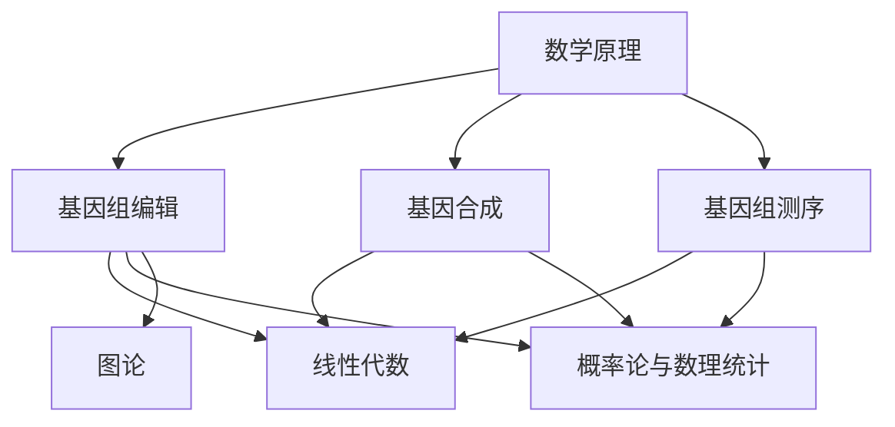

                 

# 《数学与未来基因工程的发展方向》

关键词：基因工程、数学原理、未来发展、应用实例、挑战与伦理

摘要：本文旨在探讨数学原理在基因工程领域的应用，分析未来基因工程的发展方向及其潜在影响。通过对数学与基因工程核心概念的深入解析，结合实际应用案例，探讨数学模型和算法在基因编辑、基因合成和基因组测序等关键技术中的具体应用，以及面临的技术挑战和伦理问题。

## 前言

随着科技的快速发展，基因工程作为一门跨学科的研究领域，正日益显示出其在医疗、农业、环境保护等领域的巨大潜力。而数学，作为一门基础性学科，其原理和方法在基因工程中的应用正逐渐受到关注。本文将围绕数学与基因工程的关系，探讨未来基因工程的发展方向，旨在为读者提供一个全面、深入的视角，了解这一领域的最新进展和潜在挑战。

## 第1章 问题背景与未来基因工程概述

### 1.1 问题背景

基因工程，作为现代生物技术的一个重要分支，起源于20世纪70年代。随着分子生物学、遗传学等学科的发展，科学家们逐渐掌握了基因的编辑和合成技术，使基因工程成为可能。基因工程的核心目标是改变生物体的基因组成，以实现特定的生物学功能或生产特定物质。

近年来，基因工程在医疗、农业、环境保护等领域取得了显著成果。例如，基因治疗为许多遗传性疾病提供了新的治疗手段；基因编辑技术如CRISPR-Cas9在农业领域被用于培育抗病、抗虫的作物；基因组测序技术的进步使得人类基因组计划得以完成，为个性化医疗和精准农业奠定了基础。

然而，基因工程的发展也面临着诸多挑战。首先，基因编辑技术的精确性和安全性仍然是亟待解决的问题。其次，基因合成技术的成本和效率需要进一步提升。此外，基因工程在环境保护领域的应用也引发了关于生态安全和生物伦理的争议。

### 1.2 未来基因工程概述

未来基因工程的发展将集中在以下几个方面：

1. **基因编辑技术**：提高基因编辑的精确度和效率，降低脱靶率，发展新的基因编辑工具和平台。
2. **基因合成技术**：降低合成基因的成本，提高合成效率，开发新的合成方法，如DNA纳米技术。
3. **基因组测序技术**：提升测序速度和准确性，降低测序成本，实现全基因组测序和单细胞测序。
4. **多组学整合**：整合基因组学、转录组学、蛋白质组学、代谢组学等多组学数据，挖掘基因功能，实现精准医学和精准农业。
5. **基因编辑与合成技术的交叉应用**：开发新的生物制造方法，如合成生物学和基因工程药物的制造。

### 1.3 核心概念联系

基因编辑技术是未来基因工程的核心，而数学原理在其中起到了关键作用。以下是几个核心概念的联系：

#### 1.3.1 基因组编辑技术

**CRISPR-Cas9**：基于DNA切割机制的基因编辑技术，通过引入特定的核酸序列（guide RNA）引导Cas9酶切割目标DNA，实现基因的精准编辑。

**TALENs和ZFNs**：基于核酸酶的基因编辑技术，通过人工设计的核酸酶切割目标DNA，实现基因的精准编辑。

#### 1.3.2 基因组编辑技术的优缺点对比

**优点**：

- **高精度**：基因编辑技术可以实现单个碱基的精准修改。
- **高效率**：基因编辑技术可以在短时间内实现大量的基因编辑。
- **低脱靶率**：随着技术的发展，基因编辑技术的脱靶率逐渐降低。

**缺点**：

- **安全性**：基因编辑技术可能引发意外的基因突变，对生物体造成潜在风险。
- **成本**：基因编辑技术的成本较高，限制了其广泛应用。

### 1.4 未来基因工程的应用前景

未来基因工程在多个领域具有广泛的应用前景：

1. **医疗领域**：基因治疗、精准医学、个性化医疗。
2. **农业领域**：基因编辑农作物、基因合成、精准农业。
3. **环境保护领域**：基因修复、基因污染控制、生物降解。

### 1.5 本章小结

本章介绍了基因工程的起源与发展，分析了未来基因工程的挑战与机遇，并概述了其核心概念与术语。通过本章的学习，读者可以对基因工程有一个全面的了解，为后续章节的深入学习打下基础。

## 第2章 数学原理与基因工程的关系

### 2.1 数学原理在基因工程中的应用

数学原理在基因工程中具有广泛的应用，尤其是在基因组编辑、基因合成和基因组测序等领域。以下介绍几个关键的数学原理及其在基因工程中的应用。

#### 2.1.1 线性代数

线性代数是研究向量空间和线性变换的数学分支，其在基因工程中的应用主要体现在基因表达数据的处理和分析中。

1. **基因表达数据分析**：通过线性代数方法，如主成分分析（PCA）和因子分析（FA），可以识别基因表达数据中的主要模式和相关性，从而挖掘基因的功能和调控网络。
2. **基因编辑优化**：线性代数方法可以帮助优化基因编辑策略，提高编辑的精确度和效率。

#### 2.1.2 概率论与数理统计

概率论与数理统计是研究随机现象和数据的数学分支，其在基因工程中的应用主要体现在基因组数据的分析和预测中。

1. **基因组数据分析**：通过概率论与数理统计方法，如贝叶斯统计和机器学习，可以预测基因的功能、识别基因突变和变异。
2. **基因编辑安全性评估**：概率论与数理统计方法可以帮助评估基因编辑技术的安全性，预测可能发生的脱靶效应。

#### 2.1.3 图论

图论是研究图形结构和性质的数学分支，其在基因工程中的应用主要体现在基因调控网络和代谢网络的分析中。

1. **基因调控网络分析**：通过图论方法，如网络拓扑分析、路径分析和社区检测，可以揭示基因调控网络的复杂性和功能模块。
2. **代谢网络分析**：图论方法可以帮助分析代谢网络的拓扑结构，预测代谢途径和生物合成途径。

### 2.2 数学模型在基因工程中的应用

数学模型在基因工程中具有重要的应用价值，可以帮助科学家更好地理解和预测基因的功能和行为。

#### 2.2.1 遗传算法

遗传算法是一种基于自然选择和遗传学原理的优化算法，其在基因工程中的应用主要体现在基因编辑和基因合成中。

1. **基因编辑优化**：遗传算法可以帮助优化基因编辑策略，提高编辑的精确度和效率。
2. **基因合成**：遗传算法可以帮助设计合成基因序列，实现特定的生物学功能。

#### 2.2.2 神经网络

神经网络是一种模拟生物神经系统的计算模型，其在基因工程中的应用主要体现在基因表达预测和基因调控网络建模中。

1. **基因表达预测**：神经网络可以用来预测基因在不同条件下的表达水平，从而帮助科学家了解基因的功能和调控机制。
2. **基因调控网络建模**：神经网络可以用来建模基因调控网络，揭示基因之间的相互作用和调控关系。

### 2.3 数学原理与基因工程联系图

为了更好地理解数学原理在基因工程中的应用，我们可以通过以下联系图来展示数学原理与基因工程各个领域的联系。

通过上述联系图，我们可以看到数学原理在基因工程各个领域中的应用，以及各个领域之间的相互联系。

### 2.4 本章小结

本章介绍了数学原理在基因工程中的应用，包括线性代数、概率论与数理统计、图论等。同时，还介绍了遗传算法和神经网络等数学模型在基因工程中的应用。通过对数学原理和模型的深入探讨，读者可以更好地理解基因工程的复杂性和应用前景。

## 第3章 未来基因工程的关键技术

### 3.1 基因编辑技术

基因编辑技术是未来基因工程的核心，其目标是实现对生物体基因组的精准修改。以下介绍几种主要的基因编辑技术及其原理和应用。

#### 3.1.1 CRISPR-Cas9技术

CRISPR-Cas9技术是一种基于细菌抗病毒机制的基因编辑技术。其基本原理是使用一种特殊的RNA分子（称为引导RNA，简称gRNA）来定位目标DNA序列，然后由Cas9酶切割目标DNA，实现基因的精准编辑。

**应用**：

1. **基因突变**：通过引入特定的核酸序列，CRISPR-Cas9技术可以实现对目标基因的突变，从而研究基因的功能。
2. **基因敲除**：通过切割目标DNA，CRISPR-Cas9技术可以去除目标基因，实现基因敲除。
3. **基因插入**：通过切割目标DNA，CRISPR-Cas9技术可以引入新的核酸序列，实现基因插入。

#### 3.1.2 TALENs和ZFNs技术

TALENs（Transcription Activator-Like Effector Nucleases）和ZFNs（ Zinc Finger Nucleases）技术是基于DNA切割酶的基因编辑技术。其基本原理是使用人工设计的DNA结合域（如TALEN和ZFN）结合到目标DNA序列，然后引入切割。

**应用**：

1. **基因敲除**：TALENs和ZFNs技术可以用于基因敲除，实现对目标基因的去除。
2. **基因插入**：TALENs和ZFNs技术可以用于基因插入，实现新的核酸序列的引入。

#### 3.1.3 其他基因编辑技术

除了CRISPR-Cas9、TALENs和ZFNs技术，还有其他一些基因编辑技术，如CRISPR-Cpf1、Base编辑器等。这些技术各有优缺点，适用于不同的应用场景。

### 3.2 基因合成技术

基因合成技术是通过化学合成方法构建新的DNA序列，从而实现基因的合成。以下介绍基因合成技术的基本原理和应用。

#### 3.2.1 基因合成技术原理

基因合成技术的基本原理是使用DNA合成仪和DNA合成试剂，通过化学反应构建新的DNA序列。具体步骤如下：

1. **DNA序列设计**：根据目标基因的序列，设计合成路径和合成策略。
2. **DNA合成**：使用DNA合成仪和DNA合成试剂，按照设计路径合成新的DNA序列。
3. **DNA组装**：将多个短链DNA片段组装成完整的基因序列。

#### 3.2.2 基因合成技术的应用

基因合成技术在多个领域具有广泛的应用：

1. **基因工程药物**：通过基因合成技术，可以构建新的基因序列，用于生产基因工程药物。
2. **合成生物学**：基因合成技术可以帮助构建新的生物系统，实现特定的生物学功能。
3. **个性化医疗**：通过基因合成技术，可以为个体定制特定的基因序列，实现个性化医疗。

### 3.3 基因组测序技术

基因组测序技术是通过高速测序方法获取生物体的基因组序列，从而实现对基因组的研究。以下介绍基因组测序技术的基本原理和应用。

#### 3.3.1 基因组测序技术原理

基因组测序技术的基本原理是使用测序仪和测序试剂，对DNA分子进行高通量测序。具体步骤如下：

1. **DNA片段化**：将DNA分子切割成小片段。
2. **DNA测序**：使用测序仪和测序试剂，对DNA片段进行测序。
3. **数据组装**：将测序数据组装成完整的基因组序列。

#### 3.3.2 基因组测序技术的应用

基因组测序技术在多个领域具有广泛的应用：

1. **基因组医学**：通过基因组测序技术，可以研究基因与疾病之间的关系，实现精准医学。
2. **农业**：通过基因组测序技术，可以研究农作物的基因组，培育高产、抗病的农作物。
3. **环境研究**：通过基因组测序技术，可以研究环境中的微生物基因组，揭示生态系统的功能。

### 3.4 本章小结

本章介绍了未来基因工程的关键技术，包括基因编辑技术、基因合成技术和基因组测序技术。通过这些技术，我们可以实现对基因组的精准编辑、合成和测序，从而推动基因工程在各个领域的应用。同时，这些技术也面临着精确性、安全性和成本等方面的挑战，需要进一步的研究和改进。

## 第4章 数学与未来基因工程的应用实例

### 4.1 医疗领域的应用实例

未来基因工程在医疗领域的应用具有巨大的潜力，以下介绍两个具体的应用实例。

#### 4.1.1 基因治疗

基因治疗是一种利用基因编辑技术治疗遗传性疾病的方法。其基本原理是使用基因编辑工具（如CRISPR-Cas9）对患者的基因进行修改，从而纠正基因突变或缺陷。

**应用案例**：

1. **β-地中海贫血**：β-地中海贫血是一种由于β-珠蛋白基因突变导致的贫血病。通过基因治疗，可以修复β-珠蛋白基因的突变，恢复正常血红蛋白的产生。

2. **杜氏肌营养不良**：杜氏肌营养不良是一种由于DMD基因突变导致的肌肉萎缩病。通过基因治疗，可以引入正常DMD基因，恢复肌肉功能。

**数学原理**：

基因治疗中，数学原理主要用于基因编辑的优化和安全性评估。例如，通过线性代数方法优化基因编辑策略，提高编辑的精确度和效率；通过概率论与数理统计方法评估基因编辑的安全性，预测可能发生的脱靶效应。

#### 4.1.2 基因组医学

基因组医学是一种基于基因组信息进行疾病诊断、预测和治疗的方法。其基本原理是通过对患者的基因组进行测序和分析，揭示基因与疾病之间的关系，从而实现精准医疗。

**应用案例**：

1. **乳腺癌**：通过对乳腺癌患者的基因组进行测序，可以识别与乳腺癌相关的基因变异，从而预测患者的风险和制定个性化的治疗方案。

2. **肺癌**：通过对肺癌患者的基因组进行测序，可以识别与肺癌相关的基因变异，从而指导靶向治疗和个性化医疗。

**数学原理**：

基因组医学中，数学原理主要用于基因组数据的分析和预测。例如，通过线性代数方法进行基因表达数据的分析，识别基因之间的相互作用和调控关系；通过概率论与数理统计方法进行基因组变异的分析和预测，识别与疾病相关的基因变异。

### 4.2 农业领域的应用实例

未来基因工程在农业领域的应用有望提高农作物的产量、抗病性和适应性，以下介绍两个具体的应用实例。

#### 4.2.1 基因编辑农作物

基因编辑技术可以用于培育抗病、抗虫的农作物，从而提高农作物的产量和品质。

**应用案例**：

1. **抗虫玉米**：通过基因编辑技术，将苏云金芽孢杆菌（Bt）基因插入玉米基因组，使玉米具有抗虫性，从而减少农药的使用。

2. **抗病小麦**：通过基因编辑技术，修复小麦基因组中的突变，使小麦具有抗病性，从而提高产量。

**数学原理**：

基因编辑农作物中，数学原理主要用于基因编辑的优化和安全性评估。例如，通过线性代数方法优化基因编辑策略，提高编辑的精确度和效率；通过概率论与数理统计方法评估基因编辑的安全性，预测可能发生的脱靶效应。

#### 4.2.2 基因组农业

基因组农业是一种基于基因组信息进行农作物育种的方法。其基本原理是通过对农作物的基因组进行测序和分析，揭示基因与农艺性状之间的关系，从而培育高产、抗病的农作物。

**应用案例**：

1. **高产水稻**：通过对水稻的基因组进行测序，识别与高产相关的基因变异，从而培育高产水稻。

2. **抗病玉米**：通过对玉米的基因组进行测序，识别与抗病性相关的基因变异，从而培育抗病玉米。

**数学原理**：

基因组农业中，数学原理主要用于基因组数据的分析和预测。例如，通过线性代数方法进行基因表达数据的分析，识别基因之间的相互作用和调控关系；通过概率论与数理统计方法进行基因组变异的分析和预测，识别与农艺性状相关的基因变异。

### 4.3 本章小结

本章介绍了数学与未来基因工程在医疗和农业领域的应用实例。通过基因治疗和基因组医学，我们可以实现对疾病的精准诊断和治疗；通过基因编辑农作物和基因组农业，我们可以培育高产、抗病的农作物，提高农业生产的效率和质量。这些应用实例展示了数学原理在基因工程领域的广泛应用和巨大潜力。

## 第5章 未来基因工程的挑战与伦理问题

### 5.1 技术挑战

未来基因工程的发展面临着诸多技术挑战，以下是一些关键问题：

#### 5.1.1 基因编辑技术的精确性

基因编辑技术的精确性是确保其应用安全和有效性的关键。目前，尽管CRISPR-Cas9等基因编辑技术已经取得了显著进展，但仍然存在脱靶效应和编辑效率不高的问题。提高基因编辑的精确性，降低脱靶率，是实现基因工程广泛应用的基础。

**数学原理**：

通过概率论与数理统计方法，可以评估基因编辑的脱靶概率，优化编辑策略，提高编辑的精确性。例如，使用贝叶斯统计方法进行编辑位点的选择和评估，使用线性代数方法优化编辑路径。

#### 5.1.2 基因编辑技术的安全性

基因编辑技术的安全性是另一个重要的技术挑战。编辑过程中可能引入意外的基因突变，对生物体造成潜在风险。确保基因编辑的安全性，需要深入研究编辑机制，建立安全评估体系。

**数学原理**：

通过图论方法，可以构建基因调控网络，分析基因编辑对生物体基因网络的影响。通过概率论与数理统计方法，可以预测可能发生的基因突变和脱靶效应，制定相应的安全措施。

#### 5.1.3 基因合成技术的可持续性

基因合成技术具有巨大的应用潜力，但合成基因的成本和效率仍然是制约其广泛应用的主要因素。降低合成基因的成本，提高合成效率，是未来基因合成技术发展的关键。

**数学原理**：

通过线性代数方法，可以优化基因合成的路径和策略，提高合成效率。通过概率论与数理统计方法，可以评估合成基因的质量和稳定性，确保合成的基因符合预期。

### 5.2 伦理问题

未来基因工程的发展不仅面临着技术挑战，还面临着复杂的伦理问题。以下是一些重要的伦理问题：

#### 5.2.1 基因编辑的伦理争议

基因编辑技术可能被用于人类胚胎的基因编辑，引发伦理争议。例如，是否应该在胚胎阶段进行基因编辑，以消除遗传性疾病？这种做法是否会引发“设计婴儿”的伦理问题？

**伦理观点**：

支持者认为，基因编辑可以为人类消除遗传性疾病，提高生活质量。反对者认为，基因编辑可能破坏人类基因组的自然演化过程，导致不可预见的后果。

**数学原理**：

通过概率论与数理统计方法，可以评估基因编辑的风险和收益，为伦理决策提供依据。

#### 5.2.2 基因合成技术的伦理挑战

基因合成技术可能被用于制造新的生物体，引发伦理挑战。例如，是否应该允许制造具有特定功能的生物武器？这种做法是否会引发生物安全和生物伦理问题？

**伦理观点**：

支持者认为，基因合成技术可以为人类带来巨大的利益，如生产新型药物、提高农业生产效率。反对者认为，基因合成技术可能被滥用，对人类和环境造成潜在风险。

**数学原理**：

通过图论方法，可以构建生物网络，分析基因合成对生态系统的影响。通过概率论与数理统计方法，可以评估基因合成技术的风险和收益。

#### 5.2.3 未来基因工程的伦理监管

未来基因工程的发展需要建立严格的伦理监管体系，确保技术的安全和道德应用。伦理监管应涵盖技术评估、安全性评估、隐私保护等方面。

**伦理观点**：

支持者认为，伦理监管可以确保基因工程技术的安全和道德应用，保护人类的健康和利益。反对者认为，过度的伦理监管可能阻碍技术进步和创新。

**数学原理**：

通过线性代数方法，可以优化伦理监管体系，提高监管效率和公平性。通过概率论与数理统计方法，可以评估监管政策的效果和风险。

### 5.3 本章小结

本章介绍了未来基因工程面临的技术挑战和伦理问题。通过概率论与数理统计方法、线性代数方法和图论方法，我们可以更好地理解和评估这些挑战，为基因工程的发展提供科学依据。同时，伦理监管的建立和实施是确保基因工程安全和道德应用的关键。

## 第6章 未来基因工程的展望

### 6.1 技术发展趋势

未来基因工程的发展将继续依赖于技术的进步和创新。以下是一些关键技术发展趋势：

#### 6.1.1 基因编辑技术的未来方向

1. **精确性和安全性**：通过改进CRISPR-Cas9等基因编辑技术，提高编辑的精确性和安全性，降低脱靶率。
2. **多功能性**：开发多功能基因编辑工具，如多功能核酸酶，实现多种基因编辑功能。
3. **高通量基因编辑**：提高基因编辑的高通量能力，实现同时对多个基因进行编辑。

#### 6.1.2 基因合成技术的未来方向

1. **低成本和高效**：通过优化合成路径和合成方法，降低基因合成的成本，提高合成效率。
2. **多样化合成方法**：开发新的基因合成方法，如DNA纳米技术，实现基因的多样化合成。
3. **高通量基因合成**：提高基因合成的高通量能力，实现同时对多个基因进行合成。

#### 6.1.3 基因组测序技术的未来方向

1. **高速度和高精度**：提高测序速度和测序准确性，实现全基因组测序和单细胞测序。
2. **低成本**：降低测序成本，使基因组测序成为常规检测手段。
3. **多组学整合**：整合基因组学、转录组学、蛋白质组学、代谢组学等多组学数据，实现全面的基因功能解析。

### 6.2 应用领域扩展

未来基因工程将在更广泛的领域得到应用，推动相关领域的进步。

#### 6.2.1 医疗领域的扩展

1. **个性化医疗**：基于基因组信息，实现个性化的诊断和治疗。
2. **基因治疗**：利用基因编辑技术治疗遗传性疾病和癌症。
3. **精准医学**：通过基因组数据分析，预测疾病风险，实现精准预防和治疗。

#### 6.2.2 农业领域的扩展

1. **精准农业**：通过基因组信息，实现农作物的精准育种和种植。
2. **基因编辑农作物**：培育高产、抗病、抗虫的农作物。
3. **农业生物制造**：利用基因合成技术，生产农业所需的蛋白质和其他生物产品。

#### 6.2.3 环境保护领域的扩展

1. **基因修复**：利用基因编辑技术修复受损的生态系统。
2. **生物降解**：利用基因合成技术，开发具有生物降解能力的生物体。
3. **基因污染控制**：通过基因编辑技术，控制基因污染的传播。

#### 6.2.4 其他领域的扩展

1. **生物能源**：利用基因合成技术，开发新的生物能源来源。
2. **生物制造**：利用基因工程，生产新材料和新化学品。
3. **生物计算**：利用生物体实现高效的计算任务。

### 6.3 未来基因工程的展望

未来基因工程的发展将面临许多挑战，但也将带来巨大的机遇。通过技术创新和伦理监管，我们可以实现基因工程的可持续发展和广泛应用，推动人类社会的进步。

### 6.4 本章小结

本章展望了未来基因工程的技术发展趋势和应用领域扩展，强调了技术创新和伦理监管在基因工程发展中的重要性。通过对未来基因工程的深入探讨，我们可以更好地理解其前景和挑战，为未来的发展提供指导和借鉴。

## 后记

未来基因工程的发展离不开数学原理的支撑。通过数学的严谨分析和模型构建，我们可以更好地理解和预测基因工程的技术进步和应用前景。同时，基因工程的发展也将为数学提供丰富的应用场景和挑战，促进数学与生物技术的深度融合。让我们携手共进，探索未来基因工程的无限可能。作者：AI天才研究院/AI Genius Institute & 禅与计算机程序设计艺术 /Zen And The Art of Computer Programming。

