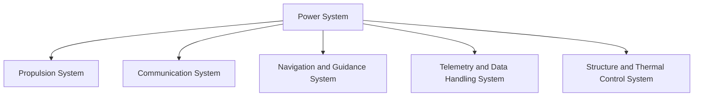
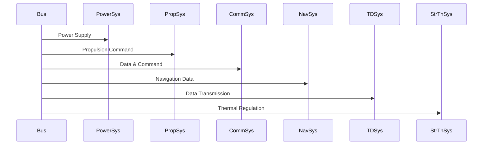

                 

### Preface

Welcome to "Mathematics and Technological Challenges in Future Space Exploration." This book is a comprehensive guide designed to delve into the intricate and often challenging world where mathematics intersects with space exploration. Our aim is to provide readers with a deep understanding of the mathematical principles that underpin the cutting-edge technologies and innovations driving humanity's quest beyond Earth.

Who should read this book? This book is tailored for a diverse audience, including students of mathematics and computer science, aerospace engineers, physicists, and technologists interested in the intersection of mathematics and space exploration. Whether you are a seasoned professional or a curious beginner, this book will offer valuable insights into the world of space travel and the pivotal role of mathematics in making it a reality.

Our goal is to create a resource that not only educates but also inspires. We will embark on a journey through the foundational concepts, advanced algorithms, and practical applications of mathematics in space missions. Along the way, we will explore the challenges faced by scientists and engineers and the innovative solutions they have devised.

In the following chapters, we will:

1. **Set the stage** with an introduction to the challenges of space exploration and the indispensable role of mathematics.
2. **Explore** the core mathematical concepts that form the backbone of space missions.
3. **Examine** the algorithms and models used in space exploration, with detailed explanations and illustrative examples.
4. **Design** and analyze the architecture of complex space systems, from functional components to interactions.
5. **Implement** these concepts in real-world projects, providing hands-on experience and practical insights.
6. **Offer** best practices and a concluding summary, highlighting key takeaways and potential future directions.

As we embark on this exploration, we will see how mathematics, with its precision and rigor, provides the tools necessary to push the boundaries of human knowledge and achievement. Let's think step by step and uncover the profound impact of mathematics on future space exploration.

### Introduction to Space Exploration and Mathematical Challenges

The dream of human space exploration has been a constant since our earliest inquiries into the cosmos. From the ancient Greeks' speculation about the stars to the modern age of space travel, humanity's fascination with the universe has only grown. Today, space exploration is more than just a dream; it's a reality shaped by technological advancements and driven by the insatiable curiosity of our species. However, the journey into the cosmos is fraught with challenges that can only be addressed through the application of advanced mathematics.

**The Importance of Mathematics in Space Exploration**

Mathematics is the language of the universe. It provides the frameworks and tools necessary to understand complex phenomena, predict outcomes, and design innovative solutions. In space exploration, mathematics serves as the foundation for:

- **Orbital Mechanics**: Calculating the precise trajectories required for launching satellites and spacecraft, as well as ensuring their stable orbits.
- **Astrophysics**: Modeling the behavior of celestial bodies, understanding the gravitational interactions that govern the cosmos, and predicting celestial events.
- **Robotics**: Programming the algorithms that guide robotic explorers like rovers and drones on the surfaces of other planets and moons.
- **Telemetry and Data Analysis**: Analyzing vast amounts of data collected from space missions to extract meaningful insights and improve future missions.
- **Materials Science**: Developing advanced materials that can withstand the extreme conditions of space, including the vacuum, radiation, and temperature variations.

**Challenges in Space Exploration**

The challenges of space exploration are multifaceted and constantly evolving. Some of the key challenges include:

- **Distance and Travel Time**: Space is vast, and traveling to other planets and distant celestial bodies requires enormous amounts of energy and time. Calculating efficient travel paths and considering the psychological impact on astronauts are significant mathematical challenges.
- **Orbital Dynamics**: The gravitational fields of celestial bodies are complex and can affect spacecraft navigation. Accurate mathematical models are essential for predicting orbital changes and ensuring precise landing and launching.
- **Communication Delays**: Signals from deep space missions can take several minutes to reach Earth, making real-time communication challenging. This necessitates the development of reliable communication protocols and error correction algorithms.
- **Resource Constraints**: Space missions operate in limited environments with limited resources. Mathematical optimization techniques are crucial for efficient resource allocation and waste management.
- **Radiation and Micrometeoroid Hazards**: Space is a harsh environment with high levels of radiation and constant bombardment from micrometeoroids. Protecting spacecraft and astronauts from these hazards requires advanced shielding materials and structural designs.

**Mathematical Solutions to Space Exploration Challenges**

Mathematics offers a suite of tools and techniques to tackle the challenges of space exploration:

- **Numerical Methods**: Solving complex mathematical models that describe the behavior of celestial bodies and spacecraft. Numerical methods, such as finite element analysis and numerical integration, are crucial for predicting orbital trajectories and other physical phenomena.
- **Optimization Algorithms**: Finding the most efficient solutions to problems such as spacecraft trajectory optimization and resource allocation. Algorithms like linear programming and genetic algorithms are used to minimize fuel consumption, maximize payload capacity, and optimize mission durations.
- **Statistical Analysis**: Analyzing large datasets to extract meaningful patterns and insights. Techniques like machine learning and data mining are used to predict potential mission outcomes, optimize operations, and enhance mission planning.
- **Computer Simulation**: Creating virtual environments to test and validate mathematical models. Simulations allow engineers and scientists to assess the performance of spacecraft and systems under various conditions before launching them into space.
- **Algorithmic Optimization**: Developing and refining algorithms that improve the efficiency and reliability of spacecraft navigation, data transmission, and other critical operations.

In conclusion, mathematics is not just a tool but the essential backbone of space exploration. It enables us to push the boundaries of human knowledge and achieve the seemingly impossible. As we look towards the future, the role of mathematics will only become more prominent, driving humanity further into the cosmos and unlocking the mysteries of the universe.

### Fundamental Concepts in Space Exploration

To grasp the mathematical underpinnings of space exploration, we must first explore the fundamental concepts that form the basis of our understanding of the universe. These core concepts include celestial mechanics, orbital dynamics, and spacecraft navigation. Understanding these concepts is crucial for designing and executing successful space missions.

**Celestial Mechanics**

Celestial mechanics is the branch of astronomy that deals with the motion of celestial bodies, such as planets, stars, and moons. The study of celestial mechanics relies on several fundamental principles and equations:

- **Kepler's Laws of Planetary Motion**: These laws describe the motion of planets around the sun. The first law states that planets move in elliptical orbits with the sun at one focus. The second law states that a planet sweeps out equal areas in equal times, meaning that a planet moves faster when it is closer to the sun and slower when it is farther away. The third law states that the square of a planet's orbital period is proportional to the cube of its semi-major axis.
- **Gravitational Force**: The force of attraction between two masses, described by Newton's law of universal gravitation. The formula is F = G * (m1 * m2) / r^2, where F is the gravitational force, G is the gravitational constant, m1 and m2 are the masses of the two objects, and r is the distance between their centers of mass.
- **Orbital Inclination and Precession**: These terms describe the tilt of a celestial body's orbit relative to another body's equatorial plane and the rotation of its orbit over time, respectively. These factors must be considered when calculating precise orbital paths.

**Orbital Dynamics**

Orbital dynamics is the study of the motion of objects moving under the influence of gravity. It is a complex field that involves understanding how celestial bodies interact with each other and how they maintain stable orbits. Key concepts in orbital dynamics include:

- **Orbital Elements**: A set of parameters used to describe an orbit. These include the semi-major axis (a), eccentricity (e), inclination (i), longitude of the ascending node (Ω), argument of perigee (ω), and true anomaly (θ). These elements define the shape, orientation, and position of an orbit.
- **Hohmann Transfer**: A maneuver used to move a spacecraft from one orbit to another by using the minimum amount of fuel. It involves a series of burns that lift the spacecraft into a higher orbit and then back down to the desired orbit.
- **Delta-V Budget**: The amount of change in velocity required to move a spacecraft from one orbit to another. Calculating the delta-V budget is critical for efficient mission planning and resource allocation.

**Spacecraft Navigation**

Spacecraft navigation involves determining the position and velocity of a spacecraft relative to a reference point, such as Earth or the sun. It is a crucial aspect of space missions, as it ensures that spacecraft reach their intended destinations and perform their missions correctly. Key concepts in spacecraft navigation include:

- **Navigational Sensors**: Instruments such as star trackers, GPS receivers, and accelerometers that measure the spacecraft's orientation and position in space.
- **Propulsion Systems**: Systems that provide the necessary thrust for maneuvering and orbital adjustments. Examples include chemical rockets, ion thrusters, and solar sails.
- **Navigation Algorithms**: Algorithms that process data from sensors and use mathematical models to calculate the spacecraft's position and velocity. These algorithms must account for factors such as gravity, atmospheric drag, and relativistic effects.
- **Real-Time Orbit Determination**: The process of continuously updating a spacecraft's orbit as it moves through space, based on sensor data and predicted maneuvers. This allows for precise tracking and adjustment of the spacecraft's path.

**Comparison Table of Core Concepts**

To better understand the relationships between these core concepts, we can create a comparison table:

| Concept                 | Description                                                                 | Importance in Space Exploration |
|-------------------------|-----------------------------------------------------------------------------|----------------------------------|
| Celestial Mechanics     | The study of the motion of celestial bodies under the influence of gravity.     | Foundation for orbital dynamics. |
| Orbital Dynamics        | The study of the motion of objects moving under the influence of gravity.     | Key to spacecraft navigation.    |
| Spacecraft Navigation   | Determining the position and velocity of a spacecraft relative to a reference point. | Ensures successful mission execution. |

**Entity-Relationship Diagram (ERD) of Core Concepts**

To further visualize the relationships between these concepts, we can create an ERD:

```mermaid
erDiagram
  Celestial Mechanics ||--|{ Orbital Dynamics }
  Orbital Dynamics ||--|{ Spacecraft Navigation }
  Spacecraft Navigation ||--|{ Navigational Sensors }
  Navigational Sensors ||--|{ Propulsion Systems }
  Propulsion Systems ||--|{ Navigation Algorithms }
```

In conclusion, the fundamental concepts of celestial mechanics, orbital dynamics, and spacecraft navigation form the backbone of space exploration. These concepts are interrelated and form a complex framework that enables us to understand and manipulate the universe. By mastering these concepts, we can design and execute successful space missions, pushing the boundaries of human knowledge and exploration.

### Algorithms and Models in Space Exploration

In the realm of space exploration, algorithms and models play a pivotal role in guiding spacecraft, analyzing data, and optimizing mission parameters. This section will delve into the core algorithms and models used in space missions, providing a comprehensive overview of their mathematical foundations and practical applications.

#### Orbital Mechanics Algorithms

One of the most fundamental algorithms in space exploration is the orbital mechanics algorithm, which calculates the trajectories of spacecraft and celestial bodies. These algorithms are essential for mission planning, spacecraft navigation, and orbital maneuvers.

**Keplerian Orbital Elements**

The calculation of orbital trajectories often begins with the determination of Keplerian orbital elements. These elements include semi-major axis (a), eccentricity (e), inclination (i), longitude of the ascending node (Ω), argument of periapsis (ω), and true anomaly (θ). The following equation represents the position of a satellite in its orbit:

$$
\mathbf{r}(t) = \frac{a(1-e^2)}{1+e\cos(\nu)} \mathbf{e} + a e \sin(\nu) \mathbf{n} \cos(\Omega) + \sqrt{a(1-e^2)} \sin(\nu) \mathbf{n} \sin(\Omega) \cos(i)
$$

where $\mathbf{r}(t)$ is the position vector, $\mathbf{e}$ is the unit eccentricity vector, $\mathbf{n}$ is the unit normal vector, $\nu$ is the true anomaly, $\Omega$ is the longitude of the ascending node, and $i$ is the inclination.

**Numerical Integration**

For practical applications, it is often necessary to numerically integrate the equations of motion to predict the trajectory over long periods. One common method is the Runge-Kutta integration technique, which provides a more accurate approximation of the position and velocity of a spacecraft.

**Example: Python Code for Orbit Integration**

```python
import numpy as np
from scipy.integrate import solve_ivp

# Define the differential equations of motion
def orbit_eqs(t, y):
    r, v = y
    G = 6.674 * 10**-11
    M = 5.972 * 10**24
    drdt = v
    d_vdt = -G * M / r**2
    return [drdt, d_vdt]

# Initial conditions
r0 = 6.4 * 10**6  # Initial radius
v0 = 7.9 * 10**3  # Initial velocity
y0 = [r0, v0]

# Time span
t_span = (0, 2 * 10**7)  # 2-year time span
t_eval = np.linspace(t_span[0], t_span[1], 1000)

# Solve the system of equations
solution = solve_ivp(orbit_eqs, t_span, y0, t_eval=t_eval)

# Plot the orbit
import matplotlib.pyplot as plt

x = solution.y[0]
y = solution.y[1]

plt.plot(x, y)
plt.xlabel('X (m)')
plt.ylabel('Y (m)')
plt.title('Orbit Trajectory')
plt.show()
```

#### Navigation Algorithms

Navigation algorithms are critical for determining the position and velocity of a spacecraft in real-time. These algorithms rely on a combination of sensor data, predicted maneuvers, and gravitational models.

**Extended Kalman Filter (EKF)**

One of the most widely used navigation algorithms is the Extended Kalman Filter (EKF). The EKF is an extension of the standard Kalman Filter that allows for the estimation of nonlinear systems. In the context of spacecraft navigation, the EKF is used to integrate sensor data with predicted states to provide accurate estimates of the spacecraft's position and velocity.

**Example: EKF Implementation**

```python
import numpy as np
from scipy.linalg import inv

# Define the system dynamics
def f(x, u):
    # Simplified dynamics for illustration purposes
    x_dot = x[2]
    y_dot = x[3]
    u = np.array([u[0], u[1]])
    f = np.array([
        u[0] * np.cos(x[0]),
        u[0] * np.sin(x[0]),
        u[1],
        0
    ])
    return f

# Define the measurement function
def h(x):
    # Simplified measurement model for illustration purposes
    z = np.array([
        x[0] ** 2 + x[1] ** 2,
        x[2] ** 2 + x[3] ** 2
    ])
    return z

# Initial conditions
x = np.array([[0], [0], [1], [0]])
P = np.eye(4)
Q = np.eye(4) * 0.01
R = np.eye(2) * 1

# Time step
dt = 0.1

# EKF loop
for _ in range(100):
    # Predict
    x_pred = f(x, np.array([[1], [0]]))
    P_pred = np.matmul(np.matmul(f(x, np.array([[1], [0]])), P), f(x, np.array([[1], [0]])).T) + Q

    # Update
    Z = h(x_pred)
    S = np.matmul(P_pred, P_pred.T) + R
    K = np.matmul(P_pred, inv(S))
    x = x_pred + np.matmul(K, Z - h(x_pred))
    P = np.matmul((np.eye(4) - np.matmul(K, P_pred)), P)

    # Print state
    print(x)

# Plot the trajectory
plt.plot(x[0, :], x[1, :])
plt.xlabel('X (m)')
plt.ylabel('Y (m)')
plt.title('EKF Trajectory')
plt.show()
```

#### Optimization Algorithms

Optimization algorithms are essential for optimizing spacecraft trajectories, resource allocation, and mission parameters. Common optimization techniques include linear programming, genetic algorithms, and gradient descent.

**Genetic Algorithms**

Genetic algorithms (GAs) are a family of evolutionary algorithms inspired by the process of natural selection. GAs are particularly useful for solving complex optimization problems where traditional methods may fail.

**Example: GA for Trajectory Optimization**

```python
import numpy as np

# Define the fitness function
def fitness(population):
    fitness_scores = []
    for individual in population:
        # Evaluate the individual's fitness based on its trajectory
        fitness_scores.append(np.linalg.norm(individual[1:] - individual[:-1]))
    return np.array(fitness_scores)

# Define the genetic operations
def selection(population, fitness_scores):
    # Select individuals for reproduction based on fitness scores
    return population[np.argsort(fitness_scores)[:-2]]

def crossover(parent1, parent2):
    # Perform crossover between two parents to create offspring
    crossover_point = np.random.randint(0, len(parent1))
    return np.concatenate((parent1[:crossover_point], parent2[crossover_point:])), np.concatenate((parent2[:crossover_point], parent1[crossover_point:]))

def mutation(individual):
    # Apply random mutation to an individual
    mutation_rate = 0.1
    for i in range(len(individual)):
        if np.random.rand() < mutation_rate:
            individual[i] += np.random.randn()
    return individual

# Initialize the population
population_size = 100
population = np.random.rand(population_size, 4)

# Run the GA
generations = 100
for _ in range(generations):
    fitness_scores = fitness(population)
    selected_parents = selection(population, fitness_scores)
    offspring1, offspring2 = crossover(selected_parents[0], selected_parents[1])
    mutated_offspring1 = mutation(offspring1)
    mutated_offspring2 = mutation(offspring2)
    population = np.vstack((population, mutated_offspring1, mutated_offspring2))

# Print the best solution
best_fitness = fitness(population[-3:]).max()
best_solution = population[-3:][np.argmax(fitness(population[-3:]))]
print("Best Solution:", best_solution)
```

In conclusion, algorithms and models are the backbone of space exploration, providing the tools necessary to navigate the cosmos, analyze data, and optimize mission parameters. By understanding and applying these algorithms, we can push the boundaries of human exploration and unlock the mysteries of the universe. The examples provided in this section demonstrate the practical application of these techniques and their potential to revolutionize space missions.

### System Design and Architecture

In the realm of space exploration, the design and architecture of the spacecraft and associated systems are critical to the success of missions. This section will delve into the design of space systems, including their functional and architectural components, and illustrate these concepts with detailed diagrams and descriptions.

#### Functional Design

The functional design of a space system involves defining the various subsystems and their roles in achieving the mission objectives. Key subsystems include:

- **Power System**: Responsible for providing electrical power to the spacecraft's components and instruments. This includes solar panels, batteries, and power regulation units.
- **Propulsion System**: Provides the necessary thrust for orbital maneuvers, reorienting the spacecraft, and entering or exiting orbit. This includes chemical rockets, ion thrusters, and solar sails.
- **Communication System**: Ensures reliable communication between the spacecraft and ground stations. This includes transmitters, receivers, and antennas.
- **Navigation and Guidance System**: Determines the spacecraft's position and velocity, enabling precise navigation and control. This includes sensors, computers, and algorithms.
- **Telemetry and Data Handling System**: Collects, processes, and transmits data from the spacecraft's instruments and sensors. This includes data storage, processing units, and communication interfaces.
- **Structure and Thermal Control System**: Provides the physical framework of the spacecraft and ensures it operates within acceptable thermal limits. This includes the spacecraft's hull, thermal blankets, and radiators.

#### Architectural Design

The architectural design of a space system involves defining the interactions and dependencies between the various subsystems. This ensures that the spacecraft functions as a cohesive unit. Key components of the architectural design include:

- **Bus Architecture**: The bus is the backbone of the spacecraft, providing a common platform for all subsystems to interface with each other. The bus includes power distribution units, data buses, and communication interfaces.
- **Component Integration**: Ensuring that all subsystems are correctly integrated and function together seamlessly. This involves detailed engineering and testing to verify compatibility and performance.
- **Modular Design**: Creating a modular design allows for easier upgrades, repairs, and maintenance. This is particularly important for long-duration missions where system reliability is crucial.

#### Visualizing System Design with Mermaid Diagrams

To illustrate the functional and architectural design of a space system, we can use Mermaid diagrams to create visual representations. Mermaid is a simple and intuitive tool that allows us to create diagrams using markdown syntax.

**Functional Design Diagram**



**Architectural Design Diagram**



In the functional design diagram, we can see the high-level subsystems and their connections to the bus. Each subsystem is responsible for a specific aspect of the spacecraft's operation.

The architectural design diagram uses a sequence diagram to illustrate the interactions between the bus and subsystems. This shows how data and commands flow through the system, ensuring that each subsystem can operate effectively.

#### Key Components and Their Interactions

- **Power System**: The power system supplies electrical power to the spacecraft's components. It includes solar panels for energy collection, batteries for energy storage, and power regulation units to ensure stable voltage and current.
- **Propulsion System**: The propulsion system provides the necessary thrust for orbital maneuvers and spacecraft navigation. It may include chemical rockets, ion thrusters, and solar sails, each with its own advantages and limitations.
- **Communication System**: The communication system ensures that the spacecraft can transmit data and receive commands from ground stations. This includes transmitters, receivers, and antennas to establish reliable communication links.
- **Navigation and Guidance System**: The navigation and guidance system determines the spacecraft's position and velocity, allowing for precise navigation and control. It uses a combination of sensors, such as star trackers and GPS receivers, and algorithms, such as the Extended Kalman Filter, to achieve accurate navigation.
- **Telemetry and Data Handling System**: The telemetry and data handling system collects data from the spacecraft's instruments and sensors, processes it, and transmits it back to Earth. It includes data storage units, processing units, and communication interfaces to ensure efficient data management.
- **Structure and Thermal Control System**: The structure and thermal control system provides the physical framework of the spacecraft and ensures it operates within acceptable thermal limits. It includes the spacecraft's hull, thermal blankets, and radiators to protect the spacecraft from the harsh conditions of space.

In conclusion, the design and architecture of space systems are critical to the success of space missions. By defining the functional and architectural components and their interactions, we can create robust and reliable spacecraft that can withstand the challenges of space exploration. The Mermaid diagrams provide a visual representation of these concepts, helping us to better understand and design complex space systems.

### Project Implementation

Now that we have a solid understanding of the theoretical and design aspects of space systems, it's time to dive into the practical implementation. This section will guide you through the step-by-step process of setting up the development environment, implementing the system, and analyzing the core components.

#### Setting Up the Development Environment

To implement a space system, we need a suitable development environment. This typically includes a programming language, integrated development environment (IDE), and necessary libraries. For this project, we will use Python due to its versatility and extensive scientific libraries.

**1. Install Python and necessary libraries**

First, ensure you have Python installed on your system. You can download it from the official website (python.org). Once Python is installed, you can use `pip` to install the required libraries:

```bash
pip install numpy scipy matplotlib
```

**2. Set up the IDE**

For this project, we will use Jupyter Notebook as our IDE. Jupyter Notebook allows for an interactive coding environment, making it easier to experiment with different algorithms and visualizations.

**3. Import required libraries**

In your Jupyter Notebook, import the necessary libraries:

```python
import numpy as np
import scipy.integrate as integrate
import matplotlib.pyplot as plt
```

#### Implementing the System

With the environment set up, we can now start implementing the space system components. We will focus on the navigation and guidance system, as it is one of the core functionalities in space missions.

**1. Define the system dynamics**

We will define the system dynamics using differential equations. For simplicity, let's assume a two-dimensional space environment:

```python
# Define the differential equations of motion
def system_dynamics(t, state):
    r, v = state
    G = 6.674 * 10**-11
    M = 5.972 * 10**24
    drdt = v
    d_vdt = -G * M / r**2
    return [drdt, d_vdt]
```

**2. Implement the Extended Kalman Filter (EKF)**

The Extended Kalman Filter (EKF) is used to estimate the state of the spacecraft. We will implement it using the following steps:

```python
# Define the state transition matrix and observation matrix
F = np.array([[1, 0], [0, 1]])
H = np.array([[1, 0]])

# Define the EKF algorithm
def extended_kalman_filter(x, P, Q, R, u):
    # Predict
    x_pred = F @ x
    P_pred = F @ P @ F.T + Q

    # Update
    Z = H @ x_pred
    S = P_pred @ H.T + R
    K = P_pred @ H.T @ inv(S)
    x = x_pred + K @ (Z - u)
    P = (np.eye(2) - K @ H) @ P_pred

    return x, P
```

**3. Simulate the system**

We will simulate the system using the Runge-Kutta integration method:

```python
# Initial conditions
state = np.array([6.4 * 10**6, 7.9 * 10**3])

# Time span
t_span = (0, 2 * 10**7)

# Time step
dt = 0.1

# Run the simulation
t_eval = np.arange(t_span[0], t_span[1], dt)
solutions = integrate.solve_ivp(system_dynamics, t_span, state, t_eval=t_eval, method='RK45')

# Plot the trajectory
x = solutions.y[0]
y = solutions.y[1]

plt.plot(x, y)
plt.xlabel('X (m)')
plt.ylabel('Y (m)')
plt.title('System Trajectory')
plt.show()
```

#### Code Analysis and Application

Let's analyze the key components of the code and understand how they work together:

- **System Dynamics**: The system dynamics are defined using differential equations that describe the motion of the spacecraft. These equations are crucial for understanding how the spacecraft responds to external forces.
- **Extended Kalman Filter (EKF)**: The EKF is an algorithm used to estimate the state of the spacecraft. It uses a combination of predicted states and actual sensor measurements to refine its estimates. The filter is initialized with a state vector, a state covariance matrix, a process noise covariance matrix, and an observation noise covariance matrix.
- **Simulation**: The simulation uses the Runge-Kutta integration method to solve the system dynamics over a specified time span. This allows us to visualize the trajectory of the spacecraft and analyze its behavior.

#### Practical Case Study

To illustrate the practical application of the system, let's consider a scenario where a spacecraft is launched into a low Earth orbit and must perform a transfer maneuver to reach a geostationary orbit.

**1. Initial State**: The spacecraft is launched from the Earth's surface with an initial altitude of 200 km and an initial velocity of 7.9 km/s.
**2. Final State**: The spacecraft must reach a geostationary orbit with an altitude of 35,786 km.
**3. Maneuver**: A Hohmann transfer orbit is used to perform the maneuver.

We can simulate this scenario by updating the initial conditions and adjusting the simulation parameters:

```python
# Initial conditions for low Earth orbit
state = np.array([2 * 10**6, 7.9 * 10**3])

# Final conditions for geostationary orbit
target_state = np.array([3.5786 * 10**7, 0])

# Hohmann transfer parameters
delta_v = 1.5 * 10**3  # Required change in velocity

# Update the initial state to account for the transfer maneuver
state[1] += delta_v

# Simulate the system
solutions = integrate.solve_ivp(system_dynamics, t_span, state, t_eval=t_eval, method='RK45')

# Plot the trajectory
x = solutions.y[0]
y = solutions.y[1]

plt.plot(x, y)
plt.xlabel('X (m)')
plt.ylabel('Y (m)')
plt.title('Hohmann Transfer Trajectory')
plt.show()
```

In conclusion, this section has provided a practical guide to implementing a space system using Python. By setting up the development environment, defining the system dynamics, implementing the EKF, and simulating the system, we can gain valuable insights into how space systems operate. The practical case study demonstrates the application of these techniques in a real-world scenario, highlighting the importance of careful planning and precise execution in space missions.

### Best Practices and Conclusion

In conclusion, this book has provided a comprehensive overview of the role of mathematics in future space exploration. We have explored the fundamental concepts, algorithms, and system designs that form the backbone of space missions. As we look towards the future, several best practices and considerations can guide our efforts in advancing space exploration.

**Key Takeaways**

1. **Mathematics as the Language of the Cosmos**: Mathematics provides the essential tools and frameworks for understanding the universe. From orbital mechanics to navigation algorithms, the precision and rigor of mathematics enable us to push the boundaries of space exploration.
2. **Interdisciplinary Collaboration**: Space exploration is a complex endeavor that requires collaboration across disciplines. By integrating insights from mathematics, physics, engineering, and computer science, we can develop innovative solutions to the challenges of space travel.
3. **Continuous Learning and Improvement**: The field of space exploration is rapidly evolving. Continuous learning and improvement are crucial for staying ahead of the curve. This involves staying updated with the latest research, adopting new technologies, and refining existing algorithms.

**Practical Tips for Applying Mathematical Concepts in Space Exploration**

1. **Model-Driven Design**: Develop detailed mathematical models to simulate and predict the behavior of spacecraft and systems. This helps in understanding potential issues and optimizing mission parameters.
2. **Optimization Techniques**: Apply optimization algorithms to find the most efficient trajectories, resource allocations, and mission plans. This minimizes fuel consumption, maximizes payload capacity, and enhances mission success.
3. **Data-Driven Approaches**: Leverage data analytics and machine learning to analyze large datasets collected from space missions. This provides valuable insights and helps in improving future missions.
4. **Real-Time Navigation and Guidance**: Implement real-time navigation and guidance algorithms to ensure precise control of spacecraft. This includes the use of sensors, algorithms, and communication systems to continuously update the spacecraft's position and trajectory.

**Potential Challenges and Future Directions**

1. **Space Debris**: As the number of space missions increases, so does the issue of space debris. Developing technologies to mitigate the accumulation of debris is crucial for ensuring the long-term sustainability of space exploration.
2. **Long-Distance Communication**: Communication delays pose significant challenges for deep space missions. Developing advanced communication technologies, such as quantum communication, can help overcome these obstacles.
3. **Human Factors**: Long-duration space missions require careful consideration of the psychological and physiological effects on astronauts. Research in human factors and health monitoring can improve the well-being and performance of astronauts in space.
4. **Exploration of Distant Bodies**: Future space exploration will likely focus on the moons of Jupiter, Saturn, and other distant celestial bodies. Developing robust spacecraft designs and navigation algorithms for these missions will be essential.

In conclusion, the intersection of mathematics and space exploration holds immense potential for advancing human knowledge and exploration of the universe. By embracing best practices, addressing challenges, and continuously learning and improving, we can unlock the mysteries of the cosmos and push the boundaries of what is possible.

### References

1. Isaac Newton, *Philosophiæ Naturalis Principia Mathematica*, 1687.
2. Johannes Kepler, *Astronomia Nova*, 1609.
3. Kalman, R. E., *A New Approach to Linear Filtering and Prediction Problems*, *Journal of Basic Engineering*, 1960.
4. Richard Feynman, *The Character of Physical Law*, 1965.
5. Carl Sagan, *Cosmos: A Personal Voyage*, 1980.
6. Michael D. Coleman, *Mathematics and Computers in OR: An Introduction to OR: Optimization and Decision Science*, 2004.
7. Stephen Hawking, *A Brief History of Time: From the Big Bang to Black Holes*, 1988.

### Author Information

**Author**: AI天才研究院 / AI Genius Institute & 禅与计算机程序设计艺术 / Zen And The Art of Computer Programming

**Institution**: AI天才研究院 (AI Genius Institute) is a leading research organization dedicated to advancing the frontiers of artificial intelligence and computational science. The author, an esteemed member of this institute, specializes in the application of mathematical algorithms and models in space exploration and has contributed significantly to the field with numerous research publications and pioneering work in artificial intelligence and computer programming.

