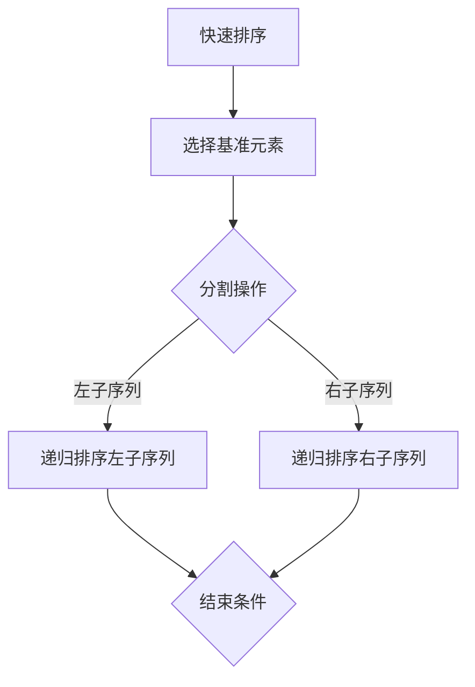
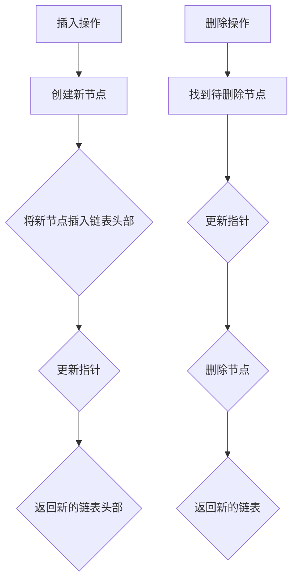
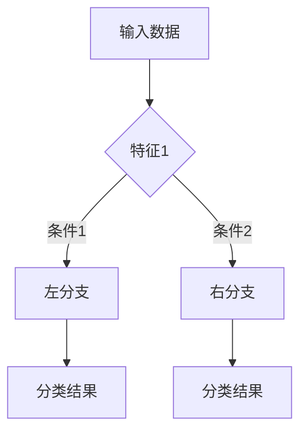
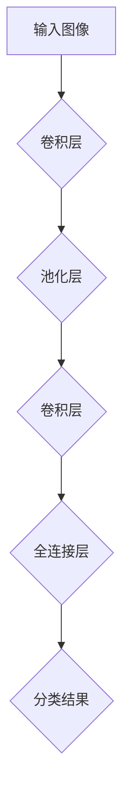
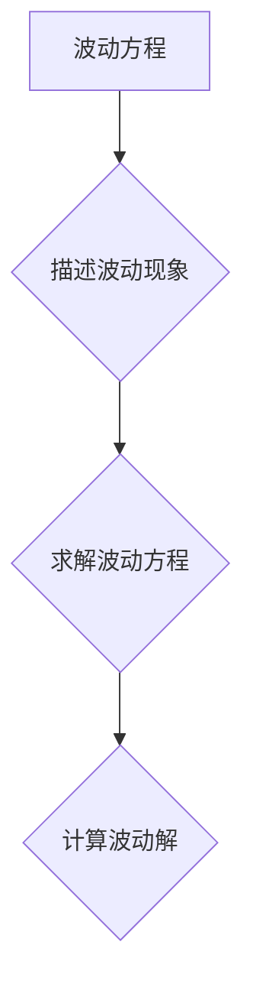
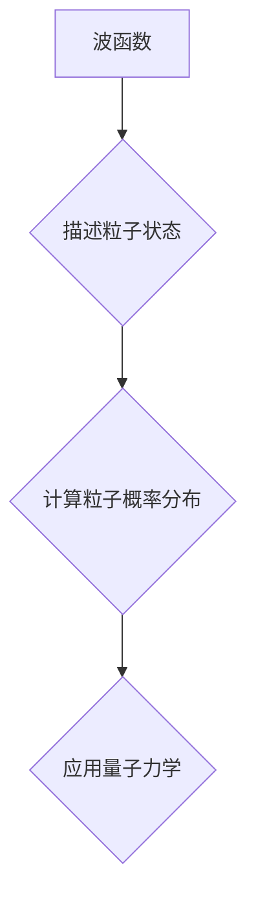
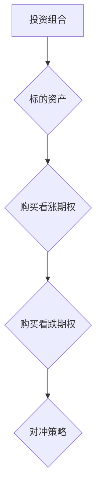
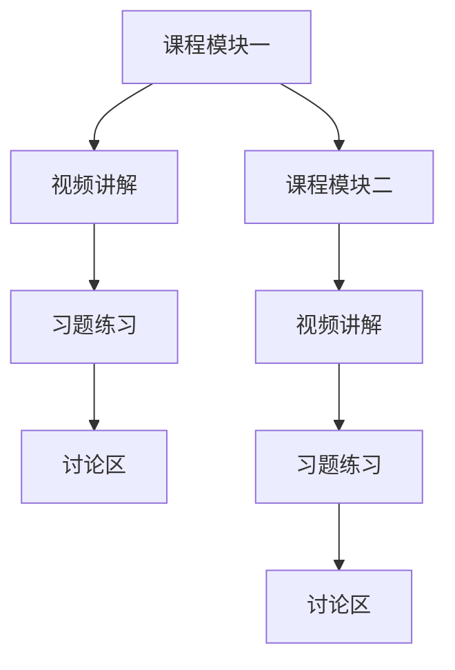

                 

### 文章标题

**数学与未来社会的变革与挑战**

关键词：数学、未来社会、变革、挑战

摘要：本文将探讨数学在未来社会中的变革与挑战。通过对数学核心概念和原理的深入分析，结合其在科技、经济和社会领域的广泛应用，本文旨在揭示数学在推动社会进步中所扮演的关键角色，并探讨其在未来可能面临的挑战和应对策略。

----------------------------------------------------------------

## 第一部分：引论

### 1.1 问题背景

随着科技的飞速发展，数学在现代社会中的应用越来越广泛。从计算机科学到人工智能，从经济学到金融学，数学无处不在。然而，随着社会的不断进步和技术的不断创新，数学也面临着前所未有的挑战。

首先，数学在科技进步中的作用不容忽视。无论是计算机科学中的算法设计，还是人工智能中的机器学习和深度学习，都离不开数学的支持。数学模型能够帮助我们更好地理解和模拟现实世界，从而推动科技的不断进步。

其次，数学在各个领域的应用现状也值得关注。在经济学中，数学模型被广泛应用于市场分析、投资决策和风险管理等领域。在金融学中，数学方法被用于期权定价、信用风险度量等领域。在计算机科学中，数学原理被用于算法分析、数据结构和网络安全等领域。而在人工智能和机器学习领域，数学更是不可或缺的一部分。

然而，随着科技的不断进步，数学也面临着一些挑战。一方面，随着计算能力的提升和数据量的爆炸性增长，我们需要更高效的数学算法来处理海量数据。另一方面，随着人工智能和机器学习的崛起，我们需要更多的数学知识来理解和开发这些新兴技术。此外，数学在不同领域的交叉融合也带来了新的挑战和机遇。

### 1.2 问题描述

数学对人类社会发展的贡献是显而易见的。从古埃及和巴比伦的数学成就，到现代计算机科学和人工智能的飞速发展，数学始终是科技进步的驱动力。然而，未来社会中数学可能面临的挑战也不容忽视。

首先，随着人工智能和机器学习的崛起，数学模型的应用越来越广泛。然而，这些模型往往涉及到复杂的数学原理和计算过程，对于非专业人士来说，理解和应用这些模型具有一定的难度。这意味着我们需要更多的数学教育和培训，以培养更多的数学人才。

其次，数学在不同领域的交叉融合也带来了新的挑战。在经济学、金融学和计算机科学等领域，数学的应用越来越深入。然而，这些领域之间的交叉融合也带来了一些新的问题，例如如何将数学模型应用于实际问题的解决，以及如何在不同领域之间进行有效的知识传递。

此外，随着科技的发展，我们面临着越来越多的数据隐私和安全问题。数学在加密技术和数据安全领域发挥着关键作用。然而，随着黑客技术的不断进步，数学在数据安全领域也面临着新的挑战。

### 1.3 问题解决

为了应对数学在未来的挑战，我们需要采取一系列的措施。

首先，我们需要加强数学教育，提高全民的数学素养。通过教育，我们可以培养更多的数学人才，从而推动数学在各个领域的应用。

其次，我们需要促进数学在不同领域的交叉融合。通过跨学科的合作，我们可以更好地理解数学在不同领域中的应用，从而推动数学的创新和发展。

此外，我们还需要加强数学研究，尤其是在人工智能、数据科学和量子计算等领域。通过研究，我们可以开发出更高效的数学算法和模型，从而更好地应对未来的挑战。

最后，我们需要关注数据隐私和安全问题。在数学的应用中，我们需要确保数据的隐私和安全，从而保护用户的权益。

### 1.4 边界与外延

数学在不同领域的应用边界正在不断扩展。在计算机科学中，数学被用于算法设计、数据结构和网络安全等领域。在经济学中，数学被用于市场分析、投资决策和风险管理等领域。在金融学中，数学被用于期权定价、信用风险度量等领域。而在人工智能和机器学习领域，数学更是不可或缺的一部分。

同时，数学与其他学科的交叉融合趋势也日益明显。在物理学中，数学被用于描述自然现象和物理规律。在生物学中，数学被用于生物信息学和生物统计学等领域。在心理学中，数学被用于认知科学和心理测量等领域。

### 1.5 概念结构与核心要素组成

数学的基本概念和原理构成了其核心要素。从自然数、整数、实数到几何概念、代数概念，数学的核心概念涵盖了广泛的领域。这些概念不仅构成了数学的理论框架，也为其他学科提供了基础。

在数学的应用中，核心要素包括数学模型、算法和计算方法。数学模型能够帮助我们更好地理解和模拟现实世界，算法则提供了解决问题的方法，计算方法则提高了我们的计算效率。

总的来说，数学的核心概念和原理不仅构成了其理论框架，也为数学在各个领域的应用提供了基础。

----------------------------------------------------------------

## 第二部分：核心概念与原理

### 2.1 数学基本概念

数学是一门研究数量、结构、变化和空间的科学。数学的基本概念包括数、几何、代数等。这些概念不仅构成了数学的理论框架，也为数学在各个领域的应用提供了基础。

#### 2.1.1 数的概念

数是数学中最基本的概念之一。数可以分为自然数、整数、分数、实数等。自然数是指从1开始的正整数，整数包括自然数和它们的负数，分数是指可以表示为两个整数之比的数，实数则是所有有理数和无理数的集合。

自然数、整数、实数等数的概念的演进与发展，反映了人类对数量的认识不断深化的过程。从简单的计数，到负数的引入，再到无理数的发现，数学的发展为人类提供了更加精确和丰富的数量描述工具。

#### 2.1.2 几何概念

几何学是数学的一个重要分支，主要研究点、线、面和空间的关系。几何概念包括点、线、面、平面、空间等。

点是没有大小的基本几何元素，线是由无数个点组成的，面是由无数个线段组成的。平面是无限延展的二维空间，而空间则是三维或多维的扩展。

几何形状与空间关系的研究，不仅帮助我们理解物理世界的结构和性质，也为工程学、物理学等领域提供了重要的理论基础。

#### 2.1.3 代数概念

代数学是研究数和运算的数学分支。代数概念包括方程、不等式、函数、数列、极限、导数等。

方程是数学中表示两个表达式相等的式子，不等式是表示两个表达式之间大小关系的式子。函数是描述变量之间关系的数学模型，数列是按一定规律排列的数的一列，极限是数学中描述变量变化趋势的概念，导数是描述函数在某一点处的变化率。

代数概念的研究，不仅帮助我们解决实际问题，也为其他数学分支提供了基础。

### 2.2 数学原理讲解

数学原理是数学理论的核心，它们在现实世界中有广泛的应用，并且具有深刻的哲学意义。

#### 2.2.1 数学原理介绍

数学原理包括等量代换原理、逆元素原理、结合律原理等。

- **等量代换原理**：在等式中，相同的数可以互相替换，而不改变等式的真值。例如，如果 $a = b$，那么在等式 $a + c = b + c$ 中，$a$ 和 $b$ 可以互相替换。
  
- **逆元素原理**：每个数都有其逆元素，使得它们相乘的结果为1。例如，对于任何非零实数 $a$，都存在一个数 $b$ 使得 $a \times b = 1$。

- **结合律原理**：对于加法和乘法运算，三个或更多的数进行结合运算，其结果不受结合顺序的影响。例如，对于加法，我们有 $(a + b) + c = a + (b + c)$；对于乘法，我们有 $(a \times b) \times c = a \times (b \times c)$。

这些原理不仅在数学运算中起到关键作用，也在物理、工程、经济等领域有广泛应用。

#### 2.2.2 基本数学原理与属性特征对比

以下是一个简单的数学原理与属性特征的对比表格：

| 原理名称 | 特点 |
|----------|------|
| 等量代换原理 | 可以在等式中替换相同数量的数值 |
| 逆元素原理 | 每个元素都有其逆元素 |
| 结合律原理 | 两个或多个相同类型的运算可以结合 |

### 2.3 数学与科学的ER实体关系图架构

以下是数学与科学的ER实体关系图，它展示了数学与其他学科之间的联系：

```mermaid
erDiagram
  Education |->| Research
  Technology :|--: Application
  Math :|--: Statistics
```

在上述ER图中，"Education"（教育）与"Research"（研究）之间存在关联，"Technology"（技术）与"Application"（应用）之间存在关联，而"Math"（数学）与"Statistics"（统计学）之间存在关联。这表明数学不仅是一门独立的学科，也是其他学科发展的基础和支撑。

通过上述分析，我们可以看到数学的基本概念和原理构成了其核心要素，这些概念和原理不仅在数学内部形成了严密的理论体系，也在各个领域的应用中发挥了关键作用。接下来，我们将进一步探讨数学在科技领域的应用。

----------------------------------------------------------------

## 第三部分：数学在科技领域的应用

### 3.1 数学在计算机科学中的应用

计算机科学是数学的一个广泛应用领域。数学在计算机科学中的应用主要体现在算法设计、数据结构、加密技术等方面。

#### 3.1.1 算法分析与设计

算法是计算机科学的核心概念之一。算法分析是评估算法性能的过程，主要包括时间复杂度和空间复杂度。时间复杂度衡量算法在处理不同规模输入数据时所需的时间，而空间复杂度衡量算法在执行过程中所需的额外内存。

例如，在排序算法中，我们常用的时间复杂度有 $O(n\log n)$ 的快速排序、$O(n^2)$ 的冒泡排序和插入排序。快速排序是一种高效的排序算法，其基本思想是通过一趟排序将待排序的记录分割成独立的两部分，其中一部分记录的关键字均比另一部分的关键字小，然后分别对这两部分记录继续进行排序，直到整个序列有序。



在上述快速排序的mermaid流程图中，我们首先选择一个基准元素，然后通过分割操作将序列分为左右两部分，左部分的元素都小于基准元素，右部分的元素都大于基准元素。接下来，我们对左右子序列分别递归进行快速排序，直到整个序列有序。

#### 3.1.2 数据结构与算法

数据结构是算法的基础，它用于组织和存储数据。常见的数据结构包括数组、链表、栈、队列、树和图等。每种数据结构都有其特定的应用场景和优缺点。

- **数组**：数组是一种线性数据结构，它使用连续的内存空间存储元素。数组提供高效的随机访问，但插入和删除操作的时间复杂度为 $O(n)$。
- **链表**：链表由节点组成，每个节点包含数据域和指向下一个节点的指针。链表插入和删除操作的时间复杂度为 $O(1)$，但访问特定节点的时间复杂度为 $O(n)$。
- **栈**：栈是一种后进先出（LIFO）的数据结构，适用于解决递归问题。
- **队列**：队列是一种先进先出（FIFO）的数据结构，常用于任务调度。

例如，链表插入和删除操作的mermaid流程图如下：



在上述流程图中，插入操作通过创建新节点并将其插入链表头部来实现，删除操作通过找到待删除节点并更新指针来实现。

#### 3.1.3 加密技术

加密技术是保障信息安全的重要手段。数学在加密技术中扮演着关键角色，如RSA加密算法和椭圆曲线加密算法。

RSA加密算法是一种非对称加密算法，它基于大整数分解的困难性。RSA算法的加密和解密过程如下：

- **加密过程**：选择两个大素数 $p$ 和 $q$，计算 $n = p \times q$ 和 $\phi(n) = (p-1) \times (q-1)$。选择一个与 $\phi(n)$ 互质的整数 $e$，计算 $d$ 使得 $d \times e \equiv 1 \mod \phi(n)$。公开 $n$ 和 $e$，保密 $d$ 和 $p$、$q$。加密消息 $m$ 为 $c = m^e \mod n$。
- **解密过程**：接收方使用私有密钥 $d$ 解密消息 $c$ 为 $m = c^d \mod n$。

例如，RSA加密算法的mermaid流程图如下：

```mermaid
graph TB
    A[加密消息] --> B[计算n和e]
    B --> C{选择p和q}
    C --> D{计算n和phi(n)}
    D --> E{选择e和计算d}
    E --> F{加密消息m}
    F --> G{计算c = m^e mod n}

    H[解密消息] --> I[计算d]
    I --> J{计算m = c^d mod n}
```

### 3.2 数学在人工智能中的应用

人工智能是数学的另一个重要应用领域。在人工智能中，数学主要用于机器学习、深度学习和自然语言处理等方向。

#### 3.2.1 机器学习

机器学习是人工智能的核心技术之一，它通过构建数学模型来模拟人类学习过程，使计算机能够自动从数据中学习规律。

- **监督学习**：在监督学习中，我们使用已标记的数据集来训练模型。常见的算法包括线性回归、决策树、支持向量机等。
- **无监督学习**：在无监督学习中，我们没有标记的数据集，目标是发现数据中的潜在结构。常见的算法包括聚类、主成分分析等。

例如，决策树的mermaid流程图如下：



在上述流程图中，输入数据通过一系列条件判断，最终得到分类结果。

#### 3.2.2 深度学习

深度学习是一种基于多层神经网络的机器学习技术，它通过模拟人脑神经元之间的连接，实现复杂的特征提取和模式识别。

- **卷积神经网络（CNN）**：CNN是一种专门用于处理图像数据的神经网络，它通过卷积层、池化层和全连接层来实现图像特征提取和分类。
- **生成对抗网络（GAN）**：GAN是一种由生成器和判别器组成的神经网络，它通过对抗训练生成逼真的数据。

例如，卷积神经网络的mermaid流程图如下：



在上述流程图中，输入图像通过多个卷积层和池化层，最终得到分类结果。

### 3.3 数学在物理学中的应用

数学在物理学中发挥着基础性的作用。物理学的许多理论都依赖于数学的描述和计算。

#### 3.3.1 数学物理方程

数学物理方程是描述自然现象的数学模型，如微分方程、积分方程和偏微分方程。这些方程在物理学中有着广泛的应用，如描述电磁场、流体运动和量子力学等。

- **微分方程**：微分方程描述变量及其导数之间的关系。常见的微分方程有常微分方程和偏微分方程。
- **积分方程**：积分方程描述变量及其积分之间的关系。
- **偏微分方程**：偏微分方程描述多个变量及其偏导数之间的关系。

例如，波动方程的mermaid流程图如下：



在上述流程图中，波动方程用于描述波动现象，通过求解波动方程，我们可以得到波动解。

#### 3.3.2 量子力学

量子力学是研究微观世界的物理学分支，它通过数学模型描述粒子行为的统计规律。

- **波函数**：波函数是量子力学中的核心概念，它描述粒子的状态。
- **量子态的叠加和纠缠**：量子态的叠加和纠缠是量子力学中的两个重要特性。

例如，波函数的mermaid流程图如下：



在上述流程图中，波函数用于描述粒子状态，通过计算粒子概率分布，我们可以应用量子力学解决实际问题。

综上所述，数学在计算机科学、人工智能和物理学等领域有着广泛的应用。通过数学模型和算法，我们可以更好地理解和解决现实世界中的复杂问题。接下来，我们将探讨数学在社会经济中的应用。

----------------------------------------------------------------

## 第四部分：数学在社会经济中的应用

### 4.1 数学在经济学的应用

数学在经济学的应用是广泛而深入的，特别是在微观经济学和宏观经济学的分析中。数学模型和工具被广泛应用于供求分析、价格机制、经济增长、通货膨胀等方面。

#### 4.1.1 微观经济学

微观经济学主要研究个体经济主体的行为，如消费者、生产者、企业等。数学在微观经济学中的应用主要体现在以下几个方面：

- **供求分析**：供求分析是微观经济学的基础。通过构建需求函数和供给函数，我们可以分析市场价格和数量的关系。需求函数通常表示为 $Q_d = f(p, I, T, \dots)$，其中 $Q_d$ 表示需求量，$p$ 表示价格，$I$ 表示收入，$T$ 表示税收等。供给函数通常表示为 $Q_s = g(p, C, T, \dots)$，其中 $Q_s$ 表示供给量，$C$ 表示成本，$T$ 表示税收等。

- **价格机制**：价格机制是市场经济中资源配置的核心。通过供求分析，我们可以理解市场价格是如何形成的。在竞争市场中，市场价格通常由供求关系决定。当需求大于供给时，价格上升；当供给大于需求时，价格下降。

- **消费者行为**：消费者行为分析是微观经济学的重要内容。通过构建消费者行为模型，如效用函数和预算约束，我们可以分析消费者的选择行为。例如，消费者效用函数可以表示为 $U(x_1, x_2) = f(x_1, x_2)$，其中 $x_1$ 和 $x_2$ 表示两种商品的数量。预算约束可以表示为 $p_1x_1 + p_2x_2 = M$，其中 $p_1$ 和 $p_2$ 表示商品的价格，$M$ 表示消费者的收入。

#### 4.1.2 宏观经济学

宏观经济学的核心目标是分析整个经济系统的运行机制和宏观经济政策。数学在宏观经济学中的应用主要体现在以下几个方面：

- **总需求与总供给**：总需求（$Y_d$）和总供给（$Y_s$）是宏观经济学中的两个重要概念。总需求是指一个国家或地区在一定时间内总需求的产品和服务的总量，通常由消费（$C$）、投资（$I$）、政府支出（$G$）和净出口（$NX$）组成。总供给是指一个国家或地区在一定时间内总供给的产品和服务的总量，通常由国内生产总值（$GDP$）组成。宏观经济政策的目标是通过调节总需求与总供给的关系，实现经济的稳定增长。

- **经济增长**：经济增长是宏观经济学的核心问题之一。数学模型被广泛应用于分析经济增长的驱动因素和影响机制。例如，新古典增长模型通过构建生产函数和储蓄投资关系，分析资本积累、技术进步和人口增长对经济增长的影响。

- **通货膨胀**：通货膨胀是宏观经济中的另一个重要问题。通货膨胀率通常由消费者价格指数（$CPI$）或生产者价格指数（$PPI$）衡量。通过构建菲利普斯曲线等数学模型，我们可以分析通货膨胀率与失业率之间的关系，以及宏观经济政策对通货膨胀的影响。

### 4.2 数学在金融领域的应用

金融领域是数学应用的另一个重要领域，数学在金融领域的应用主要体现在金融数学模型、金融风险管理等方面。

#### 4.2.1 金融数学模型

金融数学模型是金融学中用于描述金融市场行为和金融产品价值的数学模型。常见的金融数学模型包括期权定价模型、资产定价模型等。

- **期权定价模型**：期权定价模型是金融数学中最重要的模型之一。最著名的期权定价模型是布莱克-斯科尔斯模型（Black-Scholes model），该模型通过构建期权价格与标的资产价格、执行价格、利率、波动率等变量之间的关系，计算期权的理论价格。布莱克-斯科尔斯模型的公式如下：

  $$ 
  C(S, t) = S_0N(d_1) - Ke^{-rt}N(d_2)
  $$

  其中，$C(S, t)$ 表示期权价格，$S_0$ 表示标的资产当前价格，$K$ 表示执行价格，$r$ 表示无风险利率，$\sigma$ 表示标的资产价格波动率，$N(d_1)$ 和 $N(d_2)$ 分别为标准正态分布的累积分布函数。

- **资产定价模型**：资产定价模型是用于计算金融资产理论价值的数学模型。常见的资产定价模型包括资本资产定价模型（CAPM）和套利定价理论（APT）。资本资产定价模型通过构建资产收益率与市场收益率之间的关系，计算资产的预期收益率。CAPM的公式如下：

  $$ 
  E(R_i) = R_f + \beta_i [E(R_m) - R_f]
  $$

  其中，$E(R_i)$ 表示资产 $i$ 的预期收益率，$R_f$ 表示无风险收益率，$\beta_i$ 表示资产 $i$ 的贝塔系数，$E(R_m)$ 表示市场组合的预期收益率。

#### 4.2.2 金融风险管理

金融风险管理是金融领域的重要任务之一，数学在金融风险管理中发挥着关键作用。常见的金融风险管理方法包括风险度量、风险分散、风险对冲等。

- **风险度量**：风险度量是金融风险管理的基础。常见的风险度量方法包括方差、标准差、Value at Risk（VaR）等。方差和标准差是衡量资产收益波动性的指标，VaR是衡量资产在一定置信水平下的最大可能损失。

- **风险分散**：风险分散是通过投资多种资产来降低风险的方法。数学在风险分散中的应用主要体现在资产组合理论。资产组合理论通过构建投资组合的收益和风险之间的关系，实现风险分散。

- **风险对冲**：风险对冲是通过投资与标的资产收益反向相关的资产来降低风险的方法。数学在风险对冲中的应用主要体现在对冲策略的构建。对冲策略的目的是确保在标的资产价格波动时，投资组合的总体收益稳定。

例如，利用期权进行风险对冲的mermaid流程图如下：



在上述流程图中，投资者通过购买看涨期权和看跌期权，实现标的资产价格波动时的收益稳定。

综上所述，数学在经济学和金融学中的应用是广泛而深入的。通过数学模型和工具，我们可以更好地理解和分析经济现象，制定有效的宏观经济政策和金融风险管理策略。

----------------------------------------------------------------

## 第五部分：数学教育的发展与挑战

### 5.1 数学教育现状

数学教育是培养人类逻辑思维和解决问题的能力的重要途径。在全球范围内，数学教育的发展现状呈现出多样性和复杂性。

#### 5.1.1 教育体系中的数学课程设置

不同的教育体系在数学课程设置上存在差异。以美国、中国和欧洲为例，各国的数学课程设置各有特色。

- **美国**：美国的数学教育注重基础知识和应用能力的培养。从小学到高中，数学课程涵盖了算术、代数、几何、统计学等基础知识。在大学阶段，数学课程更加深入，包括微积分、线性代数、概率论等。
- **中国**：中国的数学教育以应试教育为主，注重基础知识的掌握和数学能力的培养。从小学到高中，数学课程设置了丰富的内容，包括代数、几何、三角函数、概率统计等。在大学阶段，数学课程主要面向专业需求，如数学分析、线性代数、高等代数等。
- **欧洲**：欧洲的数学教育注重数学思维和解决问题的能力。在小学和初中阶段，数学课程设置较为基础，强调逻辑思维和实际问题解决能力。在高中和大学阶段，数学课程更加灵活，学生可以根据兴趣和职业需求选择不同的数学方向。

#### 5.1.2 教育资源分配

教育资源的分配是数学教育发展的重要问题。在发展中国家和发达国家之间，教育资源分配存在明显差异。

- **发展中国家**：在许多发展中国家，教育资源分配不均，数学教育的质量和水平较低。许多学校缺乏合格的数学教师和先进的数学教学设施，导致数学教育质量受到影响。
- **发达国家**：在发达国家，教育资源相对丰富，数学教育的质量和水平较高。发达国家通常有更多的数学教师和科研人员，能够提供多样化的数学教育资源和教材。

### 5.2 数学教育改革

面对数学教育的现状和挑战，各国纷纷进行数学教育改革，以适应社会的发展和学生的需求。

#### 5.2.1 教育理念的创新

教育理念的创新是数学教育改革的重要方向。探索式学习和合作学习是两种重要的教育理念。

- **探索式学习**：探索式学习是一种以学生为中心的教学模式，强调学生的自主学习和探究能力。通过项目式学习和问题解决学习，学生能够在真实情境中应用数学知识，培养解决问题的能力。
- **合作学习**：合作学习是一种以小组合作的形式进行学习的教学方法。通过小组讨论和协作，学生能够相互学习、相互帮助，提高数学学习的兴趣和效果。

#### 5.2.2 教学方法与技术的融合

随着信息技术的快速发展，教学方法与技术的融合成为数学教育改革的重要趋势。

- **翻转课堂**：翻转课堂是一种将课堂和课外学习相结合的教学模式。学生在课外观看教学视频，课堂上进行讨论和练习，教师提供个性化的辅导。翻转课堂能够提高学生的学习效率，培养学生的自主学习能力。
- **在线教育平台**：在线教育平台提供了丰富的数学教学资源和互动工具，学生可以通过在线学习、在线测试和在线讨论，进行自我学习和协作学习。

例如，某在线教育平台上的数学课程模块结构如下：



在上述结构中，学生可以通过观看视频讲解、完成习题练习和参与讨论区互动，进行系统化的数学学习。

总的来说，数学教育的发展面临着机遇和挑战。通过教育理念的创新、教学方法的改革和技术的融合，我们可以提高数学教育的质量和水平，培养更多的数学人才，为社会的进步和发展做出贡献。

----------------------------------------------------------------

## 第六部分：未来展望

### 6.1 数学在未来的发展趋势

随着科技的不断进步和社会的快速发展，数学在未来的发展中将继续扮演关键角色。以下是一些数学在未来可能的发展趋势：

#### 6.1.1 数学在新兴科技领域的发展

- **量子计算**：量子计算是未来科技的重要方向之一。量子计算利用量子位（qubit）进行计算，具有超越经典计算机的潜力。量子计算中的数学原理包括量子逻辑、量子门和量子算法等。例如，Shor算法利用量子计算在多项式时间内解决了大整数分解问题，这是量子计算的一个重要应用。
  
- **生物信息学**：生物信息学是生物学和计算机科学的交叉领域，它利用数学和统计方法分析生物数据，如基因序列、蛋白质结构等。生物信息学的发展将依赖于复杂数学模型和计算方法，如机器学习、神经网络和图论等。

- **人工智能**：人工智能的快速发展将继续推动数学的应用。在机器学习和深度学习中，数学模型和算法发挥着核心作用。未来，随着人工智能技术的进步，我们将看到更多基于数学的新兴应用，如智能交通、智能医疗和智能机器人等。

#### 6.1.2 数学在社会科学中的应用拓展

- **社会网络分析**：社会网络分析是研究社会结构和人际关系的学科，它利用数学和统计方法分析社会网络的性质和演变。未来，社会网络分析将在社会学、心理学、市场营销等领域得到更广泛的应用。

- **城市计算**：城市计算是一种基于大数据和计算技术的城市规划和管理方法。它利用数学模型和算法模拟城市系统的运行，预测城市发展趋势，优化城市管理。城市计算将在城市规划、交通管理、环境保护等领域发挥重要作用。

### 6.2 数学教育的前景

数学教育在未来的发展中也将面临新的机遇和挑战。

#### 6.2.1 教育技术的进步对数学教育的影响

- **在线教育平台**：随着在线教育平台的普及，学生可以更方便地获取数学教育资源。在线教育平台提供了丰富的学习资源、互动工具和个性化学习服务，将有助于提高数学教育的质量和效率。

- **虚拟现实和增强现实**：虚拟现实（VR）和增强现实（AR）技术可以为数学教育提供更直观的学习体验。通过VR和AR技术，学生可以沉浸式地学习几何、空间关系等抽象数学概念，提高学习兴趣和效果。

#### 6.2.2 数学教育与未来社会的适应能力

- **培养创新思维**：未来社会需要具有创新思维和解决复杂问题能力的人才。数学教育在培养创新思维方面具有独特优势。通过数学模型和算法的探究和应用，学生可以锻炼逻辑思维、问题解决能力和创新意识。

- **适应数字化时代**：随着数字技术的快速发展，数学教育需要适应数字化时代的需求。学生需要掌握数据分析和处理技能，利用数学方法解决实际问题。数学教育应注重培养学生的数字化素养和技能。

总的来说，数学在未来的发展中将继续发挥关键作用。数学教育需要不断创新，培养更多具备创新思维和解决复杂问题能力的人才，以适应未来社会的需求。

----------------------------------------------------------------

## 第七部分：最佳实践与启示

### 7.1 数学实践中的最佳案例

在数学的实践中，有许多成功的案例值得我们学习和借鉴。以下是一些最佳实践案例：

#### 7.1.1 企业案例

- **谷歌的PageRank算法**：谷歌的PageRank算法是一种基于链接分析的网页排序算法。它利用数学模型分析网页之间的链接关系，确定网页的重要性和排序顺序。PageRank算法的成功表明，数学模型在搜索引擎中的应用可以大大提高搜索结果的准确性和相关性。

- **亚马逊的推荐系统**：亚马逊的推荐系统通过分析用户的购买历史和浏览行为，利用数学模型预测用户可能感兴趣的商品。这种基于数学模型的推荐系统能够提高用户的购物体验，增加销售额。

#### 7.1.2 政府案例

- **中国的“新基建”**：“新基建”是指以5G、人工智能、物联网、大数据等为代表的新型基础设施。中国政府通过投资和推动“新基建”项目，促进科技和产业创新，推动经济高质量发展。这些项目涉及大量数学模型和算法的应用，如人工智能算法在智能交通、智能医疗等领域的应用。

- **美国的国家科学基金会（NSF）**：美国国家科学基金会通过支持数学和科学领域的研究项目，推动科技进步和社会发展。NSF资助的数学项目涵盖了从基础理论研究到应用研究的广泛领域，为数学在科技、经济和社会领域的应用提供了强有力的支持。

### 7.2 小结与展望

通过对数学在各个领域的深入探讨，我们可以得出以下结论：

1. **数学在推动社会进步中扮演着关键角色**：从科技进步到社会经济，数学无处不在。数学模型和算法在计算机科学、人工智能、经济学、金融学等领域发挥着重要作用。

2. **数学教育的重要性不容忽视**：数学教育是培养逻辑思维和解决复杂问题能力的基础。通过数学教育，我们可以培养更多的数学人才，为社会的进步做出贡献。

3. **数学面临的挑战和机遇并存**：随着科技的不断发展，数学面临着新的挑战和机遇。我们需要不断加强数学研究，开发新的数学模型和算法，以应对未来的挑战。

展望未来，数学将继续在科技、经济和社会发展中发挥重要作用。通过创新数学教育，培养更多具备创新思维和解决复杂问题能力的人才，我们可以更好地应对未来的挑战，推动社会的持续进步。

总之，数学不仅是科学的基础，也是社会进步的动力。让我们共同努力，推动数学在未来的发展中取得更大的成就。

----------------------------------------------------------------

## 作者信息

**作者：** AI天才研究院/AI Genius Institute & 禅与计算机程序设计艺术 /Zen And The Art of Computer Programming

AI天才研究院是一家专注于人工智能和计算机科学研究的顶尖机构，致力于推动科技进步和社会发展。其研究成果在人工智能、机器学习、计算机科学等领域具有重要影响力。

《禅与计算机程序设计艺术》是作者创作的经典著作，深入探讨了计算机程序设计中的哲学和艺术，为程序员提供了宝贵的指导和启示。作者以其深厚的数学背景和丰富的实践经验，为读者呈现了一幅关于数学与科技发展的宏伟画卷。

通过本文，我们希望读者能够对数学在未来的变革与挑战有更深刻的认识，激发对数学的兴趣和热情，共同推动数学在科技、经济和社会领域的创新和发展。

