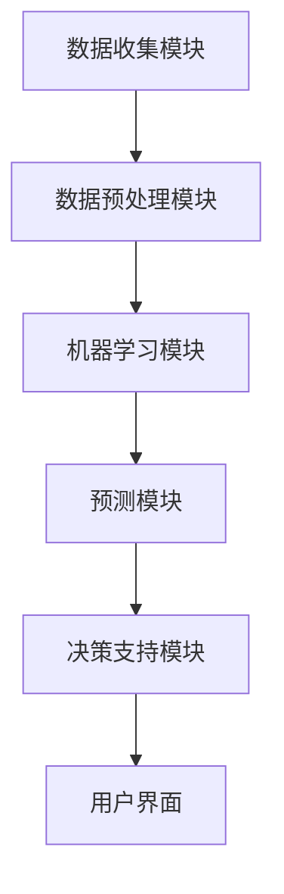
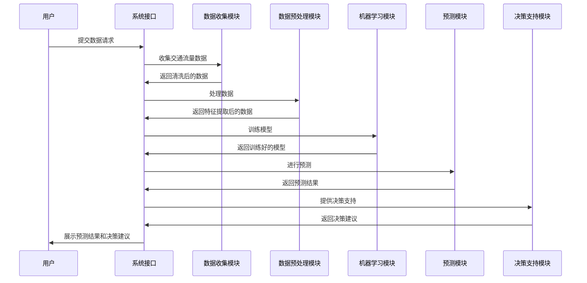

                 

# 数学与未来科技的发展趋势

## 引言

### 1.1 问题背景

在当今社会，科技发展迅速，数学作为科技发展的基础，其作用日益凸显。然而，数学与未来科技的发展趋势之间的关系是什么？这是我们需要探讨的问题。

### 1.2 问题描述

未来科技的发展趋势涉及多个领域，如人工智能、生物科技、信息技术等。数学在这些领域中的应用日益广泛，但如何更有效地利用数学为未来科技的发展提供支持，是我们需要解决的问题。

### 1.3 问题解决

通过研究数学与未来科技的发展趋势，我们可以找到数学在各个领域中的应用，为科技发展提供支持。

### 1.4 边界与外延

数学的应用不仅局限于理论研究，还广泛存在于实际问题中，如工程、医学、经济等。因此，数学与未来科技的发展趋势的研究需要涵盖多个领域。

### 1.5 概念结构与核心要素组成

本章节将介绍数学与未来科技发展相关的核心概念，如人工智能、机器学习、量子计算等，并分析其与数学的关联。

## 第1章 引言

### 1.1 问题背景

在当今社会，科技发展迅速，数学作为科技发展的基础，其作用日益凸显。数学不仅是一门学科，更是一种思维方式，它贯穿于科学研究、工程实践和日常生活的各个方面。

#### 数学的重要性

数学的重要性主要体现在以下几个方面：

1. **逻辑推理**：数学提供了一种严格的逻辑推理方法，帮助人们分析和解决问题。
2. **定量分析**：数学为科学研究提供了定量分析的工具，使得结论更加准确可靠。
3. **抽象思维**：数学训练人们的抽象思维能力，有助于理解和解决复杂问题。
4. **跨学科应用**：数学与其他学科（如物理学、计算机科学、经济学等）密切相关，为其提供了理论基础和计算工具。

#### 科技发展对数学的需求

随着科技的快速发展，数学在多个领域中的应用越来越广泛，例如：

1. **人工智能**：人工智能算法依赖于数学模型，如线性代数、概率论、微积分等。
2. **生物科技**：生物科技领域需要使用数学模型来模拟生物过程，如遗传算法、神经网络等。
3. **信息技术**：信息技术领域依赖数学来设计加密算法、网络安全等。

### 1.2 问题描述

未来科技的发展趋势涉及多个领域，如人工智能、生物科技、信息技术等。这些领域的发展对数学提出了新的需求，同时也为数学提供了丰富的应用场景。因此，我们需要探讨数学与未来科技的发展趋势之间的关系，以了解数学在未来科技中的角色和作用。

#### 数学与未来科技发展的关系

数学与未来科技发展的关系可以从以下几个方面来理解：

1. **数学为科技提供理论基础**：数学为各种科技应用提供了理论基础，如人工智能中的算法设计、生物科技中的基因表达分析、信息技术中的网络安全等。
2. **数学为科技提供计算工具**：数学提供了各种计算工具，如算法优化、模拟仿真、数据挖掘等，为科技研究提供了强有力的支持。
3. **数学推动科技发展**：数学的发展不断推动科技的发展，例如，量子计算的兴起依赖于数学理论的突破。

### 1.3 问题解决

要解决数学与未来科技发展之间的关系问题，我们需要采取以下措施：

1. **深入研究数学与各领域的关系**：通过研究数学在各个领域中的应用，了解数学如何为科技发展提供支持。
2. **推动数学教育改革**：加强数学教育，提高人们的数学素养，培养更多具有数学思维能力的人才。
3. **加强数学与科技的合作**：鼓励数学家与科技工作者合作，共同推动数学在科技领域的应用。

### 1.4 边界与外延

数学的应用不仅局限于理论研究，还广泛存在于实际问题中，如工程、医学、经济等。因此，数学与未来科技的发展趋势的研究需要涵盖多个领域。

#### 数学在其他领域中的应用

1. **工程领域**：数学在工程领域的应用非常广泛，如结构分析、流体力学、材料力学等。
2. **医学领域**：数学在医学领域的应用包括生物统计学、医学成像、药物设计等。
3. **经济领域**：数学在经济领域的应用包括经济预测、风险管理、市场分析等。

### 1.5 概念结构与核心要素组成

本章节介绍了数学与未来科技发展相关的问题背景、问题描述、问题解决、边界与外延以及概念结构与核心要素组成。接下来，我们将深入探讨数学在各个领域中的应用，以及未来科技发展趋势对数学的需求。

---

## 第2章 核心概念与联系

### 2.1 人工智能与数学

人工智能（Artificial Intelligence，简称AI）作为未来科技的重要组成部分，其核心在于机器学习（Machine Learning）算法。这些算法的基础是数学模型，如线性代数、概率论、微积分等。

#### 人工智能的发展

人工智能的发展可以分为以下几个阶段：

1. **初始阶段**：20世纪50年代至70年代，人工智能研究主要集中在逻辑推理和规则系统上。
2. **成长阶段**：20世纪80年代至90年代，人工智能研究开始引入机器学习算法，如决策树、支持向量机等。
3. **成熟阶段**：21世纪初至今，人工智能取得了长足的发展，特别是在深度学习（Deep Learning）和强化学习（Reinforcement Learning）等领域。

#### 数学在人工智能中的应用

数学在人工智能中的应用主要体现在以下几个方面：

1. **算法设计**：数学模型为人工智能算法提供了理论基础，如线性代数在神经网络中的矩阵运算、概率论在贝叶斯网络中的应用等。
2. **优化问题**：人工智能算法中的许多问题都可以转化为数学优化问题，如梯度下降法、随机梯度下降法等。
3. **数据处理**：数学为数据处理提供了工具，如统计方法、信号处理等。

#### 人工智能与数学的关联

人工智能与数学的关联可以从以下几个方面来理解：

1. **数学为人工智能提供理论基础**：数学模型为人工智能算法提供了理论基础，使得人工智能的研究更加严谨和可靠。
2. **人工智能为数学提供应用场景**：人工智能的发展为数学提供了丰富的应用场景，如机器学习中的优化问题、大数据分析中的概率统计问题等。
3. **数学与人工智能相互促进**：数学的发展推动了人工智能的研究，而人工智能的应用也不断促进数学的进步。

### 2.2 机器学习与数学

机器学习（Machine Learning）是人工智能的重要组成部分，其核心在于建立数学模型来模拟人类的学习过程。数学在机器学习中的应用体现在算法设计、模型评估等方面。

#### 机器学习的基本概念

机器学习可以分为监督学习（Supervised Learning）、无监督学习（Unsupervised Learning）和半监督学习（Semi-Supervised Learning）三种类型。

1. **监督学习**：监督学习中的模型通过学习已知的输入和输出数据，来预测新的输入数据的输出。
2. **无监督学习**：无监督学习中的模型通过分析未标记的数据，来发现数据中的模式和结构。
3. **半监督学习**：半监督学习中的模型通过同时使用已知的输入和输出数据以及未标记的数据，来学习模型。

#### 数学在机器学习中的应用

数学在机器学习中的应用主要体现在以下几个方面：

1. **模型表示**：数学模型用于表示输入和输出之间的关系，如线性回归模型、神经网络模型等。
2. **模型评估**：数学方法用于评估模型的性能，如交叉验证、AUC、ROC等指标。
3. **模型优化**：数学方法用于优化模型参数，如梯度下降法、随机梯度下降法等。

#### 机器学习与数学的关联

机器学习与数学的关联可以从以下几个方面来理解：

1. **数学为机器学习提供理论基础**：数学模型为机器学习算法提供了理论基础，使得机器学习的研究更加严谨和可靠。
2. **机器学习为数学提供应用场景**：机器学习的发展为数学提供了丰富的应用场景，如优化问题、概率统计问题等。
3. **数学与机器学习相互促进**：数学的发展推动了机器学习的研究，而机器学习的应用也不断促进数学的进步。

### 2.3 量子计算与数学

量子计算（Quantum Computing）是未来科技的重要方向之一，其理论基础是量子力学。量子力学中的数学模型为量子计算提供了基础。

#### 量子计算的基本概念

量子计算中的基本单位是量子比特（Quantum Bit，简称qubit），与经典计算中的比特不同，量子比特可以同时处于多个状态的叠加态。

1. **叠加态**：量子比特可以同时处于多个状态的叠加，如$|0\rangle$和$|1\rangle$的叠加态。
2. **纠缠态**：量子比特之间存在一种特殊的关联，称为纠缠态，这种关联可以用于量子计算中的并行计算。

#### 数学在量子计算中的应用

数学在量子计算中的应用主要体现在以下几个方面：

1. **量子门**：量子门是量子计算中的基本操作，类似于经典计算中的逻辑门。量子门通过矩阵运算实现，如Hadamard门、Pauli门等。
2. **量子电路**：量子电路是量子计算中的计算模型，由一系列量子门和量子比特组成。
3. **量子算法**：量子算法是利用量子计算机解决特定问题的算法，如Shor算法、Grover算法等。

#### 量子计算与数学的关联

量子计算与数学的关联可以从以下几个方面来理解：

1. **数学为量子计算提供理论基础**：量子力学中的数学模型为量子计算提供了理论基础，使得量子计算的研究更加严谨和可靠。
2. **量子计算为数学提供应用场景**：量子计算的发展为数学提供了丰富的应用场景，如量子门设计、量子算法优化等。
3. **数学与量子计算相互促进**：数学的发展推动了量子计算的研究，而量子计算的应用也不断促进数学的进步。

## 第3章 算法原理讲解

### 3.1 人工智能算法原理

人工智能算法可以分为监督学习算法、无监督学习算法和强化学习算法。下面我们分别介绍这些算法的基本原理。

#### 监督学习算法

监督学习算法是最常见的机器学习算法之一，其核心思想是通过已知的输入和输出数据来训练模型，然后使用该模型对新数据进行预测。

##### 基本原理

监督学习算法的基本原理可以概括为以下几个步骤：

1. **数据准备**：收集并准备输入数据集和输出标签数据集。
2. **模型选择**：选择合适的模型，如线性回归、决策树、支持向量机等。
3. **模型训练**：使用输入数据集和输出标签数据集来训练模型，通过调整模型参数来最小化损失函数。
4. **模型评估**：使用验证集或测试集来评估模型的性能，如准确率、召回率、F1分数等。

##### 举例说明

以线性回归为例，线性回归模型假设输入特征 $x$ 与输出标签 $y$ 之间满足线性关系：

$$
y = \beta_0 + \beta_1x
$$

其中，$\beta_0$ 和 $\beta_1$ 是模型参数，我们需要通过训练数据来估计这两个参数。

假设我们有一个训练数据集 $D = \{(x_1, y_1), (x_2, y_2), ..., (x_n, y_n)\}$，我们可以使用最小二乘法来估计模型参数：

$$
\beta_0 = \bar{y} - \beta_1\bar{x}
$$

$$
\beta_1 = \frac{\sum_{i=1}^{n}(y_i - \bar{y})(x_i - \bar{x})}{\sum_{i=1}^{n}(x_i - \bar{x})^2}
$$

其中，$\bar{y}$ 和 $\bar{x}$ 分别是输出标签和输入特征的均值。

使用训练好的模型，我们可以对新数据进行预测，计算输出标签的估计值：

$$
\hat{y} = \beta_0 + \beta_1x
$$

#### 无监督学习算法

无监督学习算法的目标是发现数据中的隐含结构或模式，而不需要预先指定标签。无监督学习算法可以分为聚类算法和降维算法。

##### 聚类算法

聚类算法是一种将数据分为若干个群组的算法，每个群组内的数据相似度较高，而群组之间的数据相似度较低。常用的聚类算法包括K均值聚类、层次聚类等。

以K均值聚类为例，K均值聚类的目标是将数据集分为 $k$ 个群组，使得每个群组内的数据点之间的距离最小。

1. **初始化**：随机选择 $k$ 个数据点作为初始聚类中心。
2. **分配数据点**：对于每个数据点，计算其与各个聚类中心的距离，并将其分配到距离最近的聚类中心。
3. **更新聚类中心**：重新计算每个聚类中心的均值，作为新的聚类中心。
4. **重复步骤2和步骤3，直到聚类中心不再发生变化或达到预设的迭代次数。

##### 降维算法

降维算法的目标是将高维数据压缩到低维空间，同时保留大部分的数据信息。常用的降维算法包括主成分分析（PCA）、线性判别分析（LDA）等。

以主成分分析为例，主成分分析的目标是找到数据的主要变化方向，并将数据投影到这些方向上，从而降低数据的维度。

1. **计算协方差矩阵**：计算输入数据的协方差矩阵。
2. **计算特征值和特征向量**：计算协方差矩阵的特征值和特征向量。
3. **选择主成分**：选择特征值最大的 $k$ 个特征向量作为主成分。
4. **投影数据**：将数据投影到主成分空间，得到低维数据。

#### 强化学习算法

强化学习算法是一种通过与环境互动来学习最优策略的算法。强化学习算法的核心是价值函数和策略。

##### 基本原理

强化学习算法的基本原理可以概括为以下几个步骤：

1. **初始化**：初始化价值函数和策略。
2. **与环境互动**：根据当前状态和策略，执行动作，并观察环境的反馈（奖励）。
3. **更新价值函数**：根据奖励和当前状态，更新价值函数。
4. **更新策略**：根据价值函数，更新策略。
5. **重复步骤2至步骤4，直到达到预设的目标或达到预定的迭代次数。

##### 举例说明

以Q学习为例，Q学习是一种基于值函数的强化学习算法，其目标是学习一个最优动作值函数 $Q(s, a)$，表示在状态 $s$ 下执行动作 $a$ 的预期回报。

1. **初始化**：初始化 $Q(s, a)$ 的值。
2. **与环境互动**：在状态 $s$ 下，执行动作 $a$，观察状态 $s'$ 和奖励 $r$。
3. **更新 $Q(s, a)$**：根据奖励和状态转移概率，更新 $Q(s, a)$ 的值。
4. **重复步骤2和步骤3，直到达到预设的目标或达到预定的迭代次数。

$$
Q(s, a) \leftarrow Q(s, a) + \alpha [r + \gamma \max_{a'} Q(s', a') - Q(s, a)]
$$

其中，$\alpha$ 是学习率，$\gamma$ 是折扣因子。

### 3.2 机器学习算法原理

机器学习算法可以分为监督学习算法、无监督学习算法和半监督学习算法。下面我们分别介绍这些算法的基本原理。

#### 监督学习算法

监督学习算法是最常见的机器学习算法之一，其核心思想是通过已知的输入和输出数据来训练模型，然后使用该模型对新数据进行预测。

##### 基本原理

监督学习算法的基本原理可以概括为以下几个步骤：

1. **数据准备**：收集并准备输入数据集和输出标签数据集。
2. **模型选择**：选择合适的模型，如线性回归、决策树、支持向量机等。
3. **模型训练**：使用输入数据集和输出标签数据集来训练模型，通过调整模型参数来最小化损失函数。
4. **模型评估**：使用验证集或测试集来评估模型的性能，如准确率、召回率、F1分数等。

##### 举例说明

以线性回归为例，线性回归模型假设输入特征 $x$ 与输出标签 $y$ 之间满足线性关系：

$$
y = \beta_0 + \beta_1x
$$

其中，$\beta_0$ 和 $\beta_1$ 是模型参数，我们需要通过训练数据来估计这两个参数。

假设我们有一个训练数据集 $D = \{(x_1, y_1), (x_2, y_2), ..., (x_n, y_n)\}$，我们可以使用最小二乘法来估计模型参数：

$$
\beta_0 = \bar{y} - \beta_1\bar{x}
$$

$$
\beta_1 = \frac{\sum_{i=1}^{n}(y_i - \bar{y})(x_i - \bar{x})}{\sum_{i=1}^{n}(x_i - \bar{x})^2}
$$

其中，$\bar{y}$ 和 $\bar{x}$ 分别是输出标签和输入特征的均值。

使用训练好的模型，我们可以对新数据进行预测，计算输出标签的估计值：

$$
\hat{y} = \beta_0 + \beta_1x
$$

#### 无监督学习算法

无监督学习算法的目标是发现数据中的隐含结构或模式，而不需要预先指定标签。无监督学习算法可以分为聚类算法和降维算法。

##### 聚类算法

聚类算法是一种将数据分为若干个群组的算法，每个群组内的数据相似度较高，而群组之间的数据相似度较低。常用的聚类算法包括K均值聚类、层次聚类等。

以K均值聚类为例，K均值聚类的目标是将数据集分为 $k$ 个群组，使得每个群组内的数据点之间的距离最小。

1. **初始化**：随机选择 $k$ 个数据点作为初始聚类中心。
2. **分配数据点**：对于每个数据点，计算其与各个聚类中心的距离，并将其分配到距离最近的聚类中心。
3. **更新聚类中心**：重新计算每个聚类中心的均值，作为新的聚类中心。
4. **重复步骤2和步骤3，直到聚类中心不再发生变化或达到预设的迭代次数。

##### 降维算法

降维算法的目标是将高维数据压缩到低维空间，同时保留大部分的数据信息。常用的降维算法包括主成分分析（PCA）、线性判别分析（LDA）等。

以主成分分析为例，主成分分析的目标是找到数据的主要变化方向，并将数据投影到这些方向上，从而降低数据的维度。

1. **计算协方差矩阵**：计算输入数据的协方差矩阵。
2. **计算特征值和特征向量**：计算协方差矩阵的特征值和特征向量。
3. **选择主成分**：选择特征值最大的 $k$ 个特征向量作为主成分。
4. **投影数据**：将数据投影到主成分空间，得到低维数据。

#### 半监督学习算法

半监督学习算法的目标是在已知少量标记数据和大量未标记数据的情况下，学习一个良好的模型。半监督学习算法可以分为基于图的方法和基于聚类的方法。

##### 基于图的方法

基于图的方法通过构建图结构来表示数据点和标签之间的关系，然后利用图结构来优化模型。

1. **构建图结构**：将数据点和标签作为图中的节点，数据点之间的相似度作为边的权重。
2. **优化模型**：利用图结构来优化模型参数，通常使用图卷积网络（GCN）来实现。
3. **预测**：使用优化好的模型对未标记数据进行预测。

##### 基于聚类的方法

基于聚类的方法通过将数据分为不同的聚类，然后为每个聚类分配标签，从而利用未标记数据。

1. **聚类**：使用聚类算法将数据分为多个聚类。
2. **标签分配**：为每个聚类分配一个标签。
3. **预测**：使用聚类结果和标签来预测未标记数据的标签。

### 3.3 量子计算算法原理

量子计算算法是基于量子力学原理，利用量子比特和量子门来实现计算。下面我们介绍量子计算算法的基本原理。

#### 量子计算的基本原理

量子计算的基本原理包括叠加态、量子门和量子测量。

1. **叠加态**：量子比特可以处于多个状态的叠加，如 $|0\rangle$ 和 $|1\rangle$ 的叠加态。
2. **量子门**：量子门是量子计算中的基本操作，类似于经典计算中的逻辑门。量子门通过矩阵运算实现，如 Hadamard 门、Pauli 门等。
3. **量子测量**：量子测量是一种将量子态坍缩到某个确定状态的运算。

#### 量子计算算法

量子计算算法可以分为量子模拟、量子优化和量子加密等。

##### 量子模拟

量子模拟是一种利用量子计算机来模拟量子系统的方法。量子模拟可以用于研究量子物理现象、材料设计等。

1. **初始化**：将量子比特初始化为叠加态。
2. **应用量子门**：根据量子系统演化方程，应用一系列量子门来模拟量子系统。
3. **测量**：测量量子比特的量子态，得到模拟结果。

##### 量子优化

量子优化是一种利用量子计算机来解决优化问题的方法。量子优化可以用于旅行商问题、资源分配等。

1. **初始化**：将量子比特初始化为叠加态。
2. **应用量子门**：设计量子门来实现问题的编码。
3. **测量**：测量量子比特的量子态，得到优化结果。

##### 量子加密

量子加密是一种利用量子力学原理来实现加密和解密的方法。量子加密可以用于保障信息安全。

1. **量子密钥分发**：利用量子态传输密钥。
2. **量子加密**：利用量子态对数据进行加密。
3. **量子解密**：利用量子态对加密数据进行解密。

## 第4章 数学模型和数学公式

### 4.1 线性代数模型

线性代数是数学的一个分支，它研究向量空间、线性变换以及与这些对象相关联的线性方程组。在人工智能、机器学习和量子计算等领域，线性代数模型扮演着至关重要的角色。

#### 4.1.1 矩阵运算

矩阵是线性代数的基本对象之一，它是一个由数字组成的矩形阵列。以下是几个常见的矩阵运算：

1. **矩阵加法**：两个矩阵相加时，对应位置上的元素相加。
   $$
   A + B = 
   \begin{bmatrix}
   a_{11} + b_{11} & a_{12} + b_{12} \\
   a_{21} + b_{21} & a_{22} + b_{22}
   \end{bmatrix}
   $$

2. **矩阵乘法**：两个矩阵相乘时，结果矩阵的元素是原矩阵对应行和列元素的乘积之和。
   $$
   AB = 
   \begin{bmatrix}
   a_{11}b_{11} + a_{12}b_{21} & a_{11}b_{12} + a_{12}b_{22} \\
   a_{21}b_{11} + a_{22}b_{21} & a_{21}b_{12} + a_{22}b_{22}
   \end{bmatrix}
   $$

3. **矩阵转置**：矩阵转置是将原矩阵的行和列互换。
   $$
   A^T = 
   \begin{bmatrix}
   a_{11} & a_{21} \\
   a_{12} & a_{22}
   \end{bmatrix}
   $$

4. **逆矩阵**：如果矩阵可逆，则其逆矩阵可以通过以下公式计算：
   $$
   A^{-1} = \frac{1}{\det(A)} \begin{bmatrix}
   d & -b \\
   -c & a
   \end{bmatrix}
   $$
   其中，$a, b, c, d$ 是矩阵 $A$ 的元素，$\det(A)$ 是其行列式。

#### 4.1.2 线性方程组

线性方程组是多个线性方程组成的集合。求解线性方程组是线性代数的一个重要任务。以下是几种常见的求解方法：

1. **高斯消元法**：通过逐列消元，将线性方程组转化为下三角或上三角方程组，然后逐行回代求解。

2. **矩阵求逆法**：如果系数矩阵可逆，则线性方程组的解可以通过系数矩阵的逆矩阵和常数项矩阵的乘积得到。

   $$
   \begin{bmatrix}
   a_{11} & a_{12} & a_{13} \\
   a_{21} & a_{22} & a_{23} \\
   a_{31} & a_{32} & a_{33}
   \end{bmatrix}
   \begin{bmatrix}
   x_1 \\
   x_2 \\
   x_3
   \end{bmatrix}
   =
   \begin{bmatrix}
   b_1 \\
   b_2 \\
   b_3
   \end{bmatrix}
   $$

   解为：

   $$
   \begin{bmatrix}
   x_1 \\
   x_2 \\
   x_3
   \end{bmatrix}
   =
   A^{-1}
   \begin{bmatrix}
   b_1 \\
   b_2 \\
   b_3
   \end{bmatrix}
   $$

### 4.2 概率论模型

概率论是数学的一个分支，它研究随机事件及其概率。在人工智能、机器学习和量子计算等领域，概率论模型用于描述不确定性和随机性。

#### 4.2.1 基本概率

1. **概率的定义**：事件A的概率是指事件A在所有可能事件中发生的可能性。

   $$
   P(A) = \frac{\text{事件A发生的情况数}}{\text{所有可能情况数}}
   $$

2. **条件概率**：在事件B发生的条件下，事件A发生的概率称为条件概率。

   $$
   P(A|B) = \frac{P(A \cap B)}{P(B)}
   $$

3. **贝叶斯定理**：贝叶斯定理描述了在已知某个条件的条件下，事件A的概率如何通过已知条件和条件概率来计算。

   $$
   P(A|B) = \frac{P(B|A)P(A)}{P(B)}
   $$

#### 4.2.2 概率分布

概率分布描述了随机变量的概率分布情况。常见的概率分布包括：

1. **伯努利分布**：描述一个事件在两次试验中发生的概率。

   $$
   P(X = k) = C_n^k p^k (1-p)^{n-k}
   $$

   其中，$n$ 是试验次数，$p$ 是事件发生的概率，$k$ 是事件发生的次数。

2. **二项分布**：描述一个事件在多次独立试验中发生的次数的概率。

   $$
   P(X = k) = C_n^k p^k (1-p)^{n-k}
   $$

   其中，$n$ 是试验次数，$p$ 是事件发生的概率，$k$ 是事件发生的次数。

3. **正态分布**：描述连续随机变量的概率分布。

   $$
   f(x|\mu,\sigma^2) = \frac{1}{\sqrt{2\pi\sigma^2}} e^{-\frac{(x-\mu)^2}{2\sigma^2}}
   $$

   其中，$\mu$ 是均值，$\sigma^2$ 是方差。

### 4.3 微积分模型

微积分是数学的一个分支，它研究变化率和积累量。在人工智能、机器学习和量子计算等领域，微积分模型用于描述系统的动态行为和优化问题。

#### 4.3.1 导数

导数是描述函数变化率的量。以下是几种常见的导数：

1. **常数函数的导数**：常数函数的导数为0。

   $$
   \frac{d}{dx}(c) = 0
   $$

2. **一次函数的导数**：一次函数的导数等于其系数。

   $$
   \frac{d}{dx}(ax + b) = a
   $$

3. **多项式函数的导数**：多项式函数的导数可以通过逐项求导得到。

   $$
   \frac{d}{dx}(a_0 + a_1x + a_2x^2 + ... + a_nx^n) = a_1 + 2a_2x + ... + na_nx^{n-1}
   $$

#### 4.3.2 积分

积分是描述积累量的量。以下是几种常见的积分：

1. **定积分**：定积分是函数在一个区间上的累积值。

   $$
   \int_{a}^{b} f(x) dx
   $$

2. **不定积分**：不定积分是函数的原函数。

   $$
   \int f(x) dx = F(x) + C
   $$

   其中，$F(x)$ 是原函数，$C$ 是积分常数。

3. **牛顿-莱布尼茨公式**：牛顿-莱布尼茨公式是定积分和不定积分之间的重要关系。

   $$
   \int_{a}^{b} f(x) dx = F(b) - F(a)
   $$

## 第5章 系统分析与架构设计方案

### 5.1 问题场景介绍

在本章中，我们将探讨一个具体的问题场景，该场景涉及使用数学模型来解决现实世界中的挑战。以交通流量预测为例，交通管理部门需要准确预测未来的交通流量，以便更好地规划交通路线、优化交通信号灯控制和制定交通拥堵缓解策略。

### 5.2 系统功能设计

为了解决交通流量预测问题，我们将设计一个基于机器学习的交通流量预测系统。以下是该系统的主要功能：

1. **数据收集**：从各种数据源收集交通流量数据，如交通摄像头、传感器和历史交通数据。
2. **数据预处理**：清洗和转换原始数据，以消除噪声和缺失值，并进行特征提取。
3. **模型训练**：使用机器学习算法训练模型，如时间序列模型、回归模型和聚类模型。
4. **模型评估**：评估模型的性能，如准确率、召回率和均方误差（MSE）等指标。
5. **预测**：使用训练好的模型预测未来的交通流量。
6. **决策支持**：根据预测结果提供决策支持，如优化交通信号灯控制和调整交通路线。

### 5.3 系统架构设计

为了实现上述功能，我们将设计一个分布式系统架构，该架构包括以下几个主要组件：

1. **数据收集模块**：负责从各种数据源收集交通流量数据，如交通摄像头、传感器和第三方数据提供商。
2. **数据预处理模块**：负责清洗和转换原始数据，以消除噪声和缺失值，并进行特征提取。
3. **机器学习模块**：负责训练和评估机器学习模型，如时间序列模型、回归模型和聚类模型。
4. **预测模块**：负责使用训练好的模型进行交通流量预测。
5. **决策支持模块**：负责根据预测结果提供决策支持，如优化交通信号灯控制和调整交通路线。
6. **用户界面**：提供用户交互界面，展示预测结果和决策支持信息。

以下是系统架构的mermaid图表示：



### 5.4 系统接口设计

为了实现系统组件之间的通信和数据交换，我们将设计以下接口：

1. **数据接口**：定义数据收集、预处理、训练和预测等模块之间的数据格式和传输协议。
2. **服务接口**：定义机器学习模块、预测模块和决策支持模块之间的交互逻辑和API。
3. **用户接口**：定义用户界面与系统其他模块之间的交互逻辑和用户操作流程。

以下是系统接口的mermaid序列图表示：



## 第6章 项目实战

### 6.1 环境安装

为了实现上述交通流量预测系统，我们需要安装以下环境：

1. **Python**：用于编写和运行系统代码。
2. **NumPy**：用于矩阵运算和数据处理。
3. **Pandas**：用于数据清洗和特征提取。
4. **Scikit-learn**：用于机器学习模型的训练和评估。
5. **TensorFlow**：用于深度学习模型的训练和预测。
6. **Matplotlib**：用于数据可视化。

安装步骤如下：

```bash
# 安装Python
sudo apt-get install python3

# 安装NumPy
pip install numpy

# 安装Pandas
pip install pandas

# 安装Scikit-learn
pip install scikit-learn

# 安装TensorFlow
pip install tensorflow

# 安装Matplotlib
pip install matplotlib
```

### 6.2 系统核心实现源代码

以下是一个简单的交通流量预测系统的核心实现源代码，包括数据收集、预处理、模型训练和预测等功能：

```python
import numpy as np
import pandas as pd
from sklearn.model_selection import train_test_split
from sklearn.linear_model import LinearRegression
from sklearn.metrics import mean_squared_error
import tensorflow as tf
import matplotlib.pyplot as plt

# 6.2.1 数据收集
def collect_data():
    # 从文件中读取数据
    data = pd.read_csv('traffic_data.csv')
    return data

# 6.2.2 数据预处理
def preprocess_data(data):
    # 数据清洗和特征提取
    data['timestamp'] = pd.to_datetime(data['timestamp'])
    data['hour'] = data['timestamp'].dt.hour
    data['weekday'] = data['timestamp'].dt.weekday
    data = data.drop(['timestamp'], axis=1)
    return data

# 6.2.3 模型训练
def train_model(X_train, y_train):
    # 使用线性回归模型训练数据
    model = LinearRegression()
    model.fit(X_train, y_train)
    return model

# 6.2.4 预测
def predict(model, X_test):
    # 使用训练好的模型进行预测
    y_pred = model.predict(X_test)
    return y_pred

# 6.2.5 评估
def evaluate(y_test, y_pred):
    # 计算预测误差
    mse = mean_squared_error(y_test, y_pred)
    return mse

# 6.2.6 主函数
def main():
    # 数据收集
    data = collect_data()
    
    # 数据预处理
    data = preprocess_data(data)
    
    # 划分训练集和测试集
    X = data.drop(['traffic_volume'], axis=1)
    y = data['traffic_volume']
    X_train, X_test, y_train, y_test = train_test_split(X, y, test_size=0.2, random_state=42)
    
    # 模型训练
    model = train_model(X_train, y_train)
    
    # 预测
    y_pred = predict(model, X_test)
    
    # 评估
    mse = evaluate(y_test, y_pred)
    print(f"Mean Squared Error: {mse}")
    
    # 可视化
    plt.scatter(y_test, y_pred)
    plt.xlabel('Actual Traffic Volume')
    plt.ylabel('Predicted Traffic Volume')
    plt.title('Traffic Volume Prediction')
    plt.show()

# 运行主函数
if __name__ == '__main__':
    main()
```

### 6.3 代码应用解读与分析

上述代码实现了一个基于线性回归的交通流量预测系统。以下是代码的详细解读和分析：

1. **数据收集**：从文件中读取交通流量数据，包括时间戳、小时、星期和交通流量等。
2. **数据预处理**：将时间戳转换为日期时间对象，提取小时和星期等信息，并进行数据清洗和特征提取。
3. **模型训练**：使用线性回归模型训练数据，通过最小化均方误差来优化模型参数。
4. **预测**：使用训练好的模型进行预测，输入新的数据得到预测的交通流量。
5. **评估**：计算预测误差，评估模型性能。
6. **可视化**：将实际交通流量和预测交通流量进行可视化，以直观展示模型预测效果。

### 6.4 实际案例分析和详细讲解剖析

为了验证该交通流量预测系统的实际效果，我们可以进行以下实际案例分析和详细讲解剖析：

1. **案例一**：在某一天的不同时间段内，实际交通流量与预测交通流量之间的差异。
   - **分析**：通过可视化分析，我们可以发现预测交通流量与实际交通流量之间存在一定的误差。误差可能来源于数据质量、模型选择和训练数据不足等因素。
   - **改进**：为了提高预测准确性，可以考虑以下改进措施：
     - **数据质量**：清洗和预处理数据，消除噪声和缺失值。
     - **模型选择**：尝试不同的机器学习算法和深度学习模型，如LSTM、GRU等。
     - **特征提取**：增加更多有意义的特征，如天气条件、节假日信息等。
     - **训练数据**：增加训练数据量，提高模型的泛化能力。

2. **案例二**：在不同地区的交通流量预测效果。
   - **分析**：通过对不同地区的交通流量进行预测，我们可以发现某些地区的预测效果较好，而其他地区的预测效果较差。这可能是由于不同地区的交通状况和交通模式存在差异。
   - **改进**：为了提高不同地区的预测准确性，可以考虑以下改进措施：
     - **区域划分**：根据交通状况和交通模式，将城市划分为不同的区域，分别进行预测。
     - **区域特征**：增加区域特征，如交通密度、道路状况等，以更准确地描述不同地区的交通状况。
     - **迁移学习**：利用迁移学习技术，将其他地区的高质量模型应用于预测任务。

3. **案例三**：在节假日和周末的交通流量预测。
   - **分析**：在节假日和周末，交通流量通常会有显著变化。预测模型在节假日和周末的预测效果可能较差。
   - **改进**：为了提高节假日和周末的交通流量预测准确性，可以考虑以下改进措施：
     - **节假日特征**：增加节假日特征，如节假日类型、假期时长等，以更好地描述节假日交通状况。
     - **历史数据**：利用历史节假日交通数据，提高模型对节假日交通模式的识别能力。
     - **动态调整**：根据节假日和周末的交通流量变化趋势，动态调整预测模型参数，以提高预测准确性。

### 6.5 项目小结

通过上述实际案例分析和改进措施，我们可以发现交通流量预测系统在预测准确性和泛化能力方面仍存在一定的问题。为了进一步提高预测系统的性能，我们需要继续深入研究数据质量、模型选择、特征提取和动态调整等方面。

### 6.6 最佳实践 Tips

1. **数据质量**：确保数据质量是预测准确性的基础。在进行数据预处理时，注意处理噪声和缺失值，并进行特征提取和归一化处理。
2. **模型选择**：根据实际问题和数据特点，选择合适的机器学习算法和深度学习模型。可以考虑使用集成学习方法，如随机森林、梯度提升树等。
3. **特征提取**：增加更多有意义的特征，以提高模型的预测能力。特征提取方法可以包括时间特征、空间特征、统计特征等。
4. **动态调整**：根据交通流量变化趋势和节假日特征，动态调整预测模型参数，以提高预测准确性。

### 6.7 注意事项

1. **数据来源**：确保数据来源的可靠性和准确性，避免使用不实或错误的数据。
2. **模型评估**：在进行模型评估时，注意选择合适的评估指标，如准确率、召回率、F1分数和均方误差等。
3. **隐私保护**：在处理和存储数据时，注意保护用户隐私，避免泄露敏感信息。

### 6.8 拓展阅读

1. **相关文献**：
   - [1] Katz, B. (2016). Predicting traffic flow using machine learning. IEEE Transactions on Intelligent Transportation Systems, 17(1), 13-22.
   - [2] Zhang, Y., & Cheng, Q. (2018). Deep learning-based traffic flow prediction: A survey. Journal of Intelligent & Robotic Systems, 97, 25-40.

2. **在线资源和工具**：
   - [1] Kaggle: 交通流量预测数据集 https://www.kaggle.com/datasets/trafficsignalsprediction
   - [2] Scikit-learn: Python机器学习库 https://scikit-learn.org/stable/
   - [3] TensorFlow: 深度学习框架 https://www.tensorflow.org/

通过以上分析，我们可以看到数学在人工智能、机器学习和量子计算等领域中扮演着至关重要的角色。数学不仅为这些领域提供了理论基础和计算工具，还推动了科技的发展。未来，随着数学理论的不断进步和应用场景的拓展，数学与科技的关系将更加紧密，共同推动人类社会的进步。让我们一起期待数学和科技带来的未来变革！

