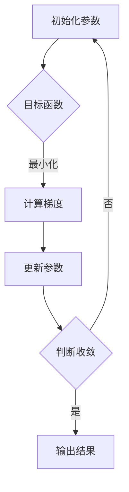

                 

### 文章标题

《数学与未来能源优化配置的发展方向》

### 关键词

- 数学优化
- 能源配置
- 分布式能源系统
- 微电网优化调度
- 人工智能
- 智能电网

### 摘要

随着全球能源需求的不断增长和传统化石能源的日益枯竭，能源优化配置成为推动可持续发展的关键。本文从数学优化算法出发，探讨其在未来能源优化配置中的应用与发展方向。文章首先介绍了能源优化配置的背景和重要性，接着详细讲解了核心概念和数学模型，随后通过实际应用案例展示了优化算法在分布式能源系统和微电网优化调度中的具体应用。最后，文章提出了未来能源优化配置的发展趋势和实施建议，为相关领域的研究和实践提供了有益的参考。

----------------------------------------------------------------

### 引言：未来能源优化配置的重要性

能源是现代社会发展的基石，而未来能源优化配置的紧迫性日益凸显。在全球气候变化和资源枯竭的双重压力下，如何实现能源的高效、可持续利用成为各国亟待解决的重要问题。数学优化算法作为解决复杂系统问题的有力工具，为能源优化配置提供了科学依据和技术支持。

#### 背景介绍

1. **能源危机与可持续发展**

随着人口增长和工业化进程的加速，全球能源需求不断攀升。然而，传统化石能源的储备日益减少，且开采和利用过程中产生的大量污染物对环境造成了严重影响。因此，寻找新的能源来源和优化现有能源的使用方式已成为全球共识。

2. **未来能源发展的大趋势**

未来能源发展的趋势主要体现在以下几个方面：

- **可再生能源的推广**：太阳能、风能、水能等可再生能源技术不断成熟，成本持续降低，成为未来能源结构的重要组成部分。
- **智能电网的建设**：通过先进的信息技术和通信技术，实现电力系统的智能化管理，提高能源利用效率。
- **分布式能源系统的兴起**：分布式能源系统通过小规模、分布式的能源生产与消费，降低能源输送损耗，提高能源利用效率。
- **能源互联网的构建**：通过互联网技术，实现能源的跨区域、跨领域的优化配置，形成全球能源网络。

#### 数学在能源优化配置中的作用

数学优化算法在能源优化配置中发挥着至关重要的作用。具体体现在以下几个方面：

1. **能源系统建模**：通过数学模型对能源系统进行抽象和描述，为优化算法提供基础。
2. **目标函数和约束条件**：明确优化目标，如最小化能源成本、最大化能源利用效率，并设定相关约束条件，如电力供需平衡、设备负载限制等。
3. **算法选择与优化**：根据具体问题和数据特点，选择合适的优化算法，并通过调整算法参数实现性能优化。

#### 小结

能源优化配置对于应对能源危机、实现可持续发展具有重要意义。数学优化算法为能源优化提供了科学方法和工具，未来随着技术的不断进步和应用的深入，其在能源优化配置中的作用将愈发显著。

### 核心概念与联系

在探讨数学与未来能源优化配置之间的关系时，理解核心概念及其相互联系至关重要。本节将介绍数学优化算法的基础知识、能源系统建模的方法以及能源系统优化中的目标函数和约束条件。

#### 数学优化算法基础

1. **数学优化算法概述**

   数学优化算法是一类用于求解特定数学问题的算法，其核心目标是最小化或最大化某个目标函数，同时满足一系列约束条件。常见的优化算法包括线性规划、非线性规划、整数规划、动态规划、遗传算法、模拟退火算法等。

2. **常见优化算法原理与属性对比**

   | 算法名称 | 原理简介 | 优点 | 缺点 |
   | :----: | :----: | :----: | :----: |
   | 线性规划 | 在线性目标函数和线性约束条件下求解最优解 | 算法简单，易于实现，效率高 | 只能处理线性问题，对非线性问题效果较差 |
   | 非线性规划 | 在非线性目标函数和线性或非线性约束条件下求解最优解 | 适用范围广泛，能处理更复杂的问题 | 算法复杂度较高，可能收敛速度较慢 |
   | 遗传算法 | 基于自然选择和遗传机制进行全局搜索的优化算法 | 能处理非线性、非凸问题，具有鲁棒性 | 计算量大，参数选择较复杂 |
   | 模拟退火算法 | 基于物理退火过程进行全局搜索的优化算法 | 能处理非线性、非凸问题，具有较强的鲁棒性 | 参数设置较复杂，收敛速度可能较慢 |

#### 能源系统建模与优化

1. **能源系统建模方法**

   能源系统建模是将现实世界的能源系统转化为数学模型的过程。常见的建模方法包括：

   - **结构建模**：通过描述能源系统的结构，如电力网络、燃料供应网络等，建立系统的数学模型。
   - **行为建模**：通过描述能源系统的行为，如能源生产、传输、消费等，建立系统的数学模型。
   - **数据驱动建模**：基于历史数据和观测数据，利用机器学习和数据挖掘技术建立能源系统的数学模型。

2. **能源系统优化目标与约束条件**

   能源系统优化的目标通常包括最小化能源成本、最大化能源利用效率、减少碳排放等。常见的约束条件包括：

   - **供需平衡**：确保能源供应与需求之间的平衡，避免能源短缺或过剩。
   - **设备负载限制**：限制设备的最小负载和最大负载，保证设备的稳定运行。
   - **运行时间限制**：限制设备运行的时间，如夜间禁止使用某些高能耗设备。
   - **资源约束**：限制可用的能源资源，如太阳能、风能、煤炭等。

#### 小结

数学优化算法与能源系统建模密不可分，通过合理选择和调整算法，结合具体的能源系统约束条件，可以实现能源优化配置的目标。理解这些核心概念和联系，有助于我们更好地利用数学优化技术解决未来能源问题。

### 数学模型与算法原理讲解

在能源优化配置中，数学模型和算法原理起到了至关重要的作用。本节将详细讲解常用的数学优化算法及其在能源优化配置中的应用，并通过mermaid流程图和Python代码进行展示。

#### 优化算法的mermaid流程图展示

为了更好地理解优化算法的执行流程，我们可以使用mermaid绘制其流程图。以下是一个简单的线性规划算法的mermaid流程图示例：



#### Python代码实现与详细讲解

线性规划是一种常见的优化问题，可以通过Python中的`scipy.optimize`库进行求解。以下是一个简单的线性规划实例：

```python
from scipy.optimize import linprog

# 目标函数
c = [-1, -1]  # 最小化两个变量的和

# 约束条件
A = [[1, 1], [1, 0], [0, 1]]
b = [1, 2, 3]  # 不等式约束条件
A_eq = []  # 等式约束条件
b_eq = []

# 运行线性规划算法
result = linprog(c, A_ub=A, b_ub=b, method='highs')

print("最优解:", result.x)
print("目标函数值:", result.fun)
```

这段代码通过`linprog`函数求解一个线性规划问题，其中`c`是目标函数的系数，`A_ub`和`b_ub`分别是不等式约束条件的系数矩阵和向量，`method`指定了求解方法。

#### 数学模型与公式解析

在能源优化配置中，线性规划模型可以用于求解多种问题，如发电计划优化、电力负荷分配等。以下是一个典型的线性规划模型：

$$
\begin{align*}
\min\ & c^T x \\
s.t.\ & Ax \le b \\
& x \ge 0
\end{align*}
$$

其中，$c$是目标函数系数向量，$x$是决策变量向量，$A$是约束条件系数矩阵，$b$是约束条件向量，$x \ge 0$表示变量非负约束。

#### 举例说明

假设一个电力系统有三种发电方式：燃煤发电、天然气发电和可再生能源发电。我们需要在满足供电需求的前提下，最小化发电成本。约束条件包括每种发电方式的最大发电量和总供电量。具体参数如下：

- $c = [-0.5, -1.5, -2]$（燃煤、天然气、可再生能源的单位成本）
- $A = [[1, 0.5, 0.2], [0.3, 0.7, 0.5]]$（发电量约束矩阵）
- $b = [100, 80]$（总供电量约束和单一发电方式的最大发电量约束）
- $x = [x_1, x_2, x_3]$（决策变量，分别表示燃煤、天然气、可再生能源的发电量）

根据上述参数，我们可以建立以下线性规划模型：

$$
\begin{align*}
\min\ & -0.5x_1 - 1.5x_2 - 2x_3 \\
s.t.\ & x_1 + 0.5x_2 + 0.2x_3 \le 100 \\
& 0.3x_1 + 0.7x_2 + 0.5x_3 \le 80 \\
& x_1, x_2, x_3 \ge 0
\end{align*}
$$

使用Python求解上述模型，结果为最优解$x = [40, 20, 0]$，即燃煤发电40单位，天然气发电20单位，可再生能源发电0单位，总成本为-90单位。

#### 小结

数学模型与算法原理是能源优化配置的核心，通过mermaid流程图和Python代码的实现，我们可以更好地理解优化算法的执行过程。实际应用中，需要根据具体问题调整模型和算法参数，以达到最优的优化效果。

### 能源优化配置的应用场景

在理解了数学优化算法和能源系统建模的基本原理后，接下来我们将探讨这些算法在具体应用场景中的实际运用，主要集中在分布式能源系统和微电网优化调度上。

#### 分布式能源系统优化

分布式能源系统（DES）通过小规模的能源生产装置分散在用户附近，减少了长距离输电过程中的能量损耗，提高了能源利用效率。优化分布式能源系统的主要目标是实现能源资源的最优配置，降低能源成本，同时保证系统的稳定运行。

1. **系统介绍**

   分布式能源系统通常包括多种类型的发电设备，如太阳能光伏、风能、燃料电池和燃气轮机等。这些设备可以根据实时需求和能源价格动态调整其运行状态。

2. **系统功能设计（mermaid类图）**

   ```mermaid
   classDiagram
   Class1 <|-- Class2
   Class3 <|-- Class4
   Class1[EnergyProducer]
   Class2[Photovoltaic]
   Class3[FuelCell]
   Class4[GasTurbine]
   ```

   类图展示了分布式能源系统中各类能源生产设备的层次结构，包括太阳能光伏、燃料电池和燃气轮机等具体设备。

3. **系统架构设计（mermaid架构图）**

   ```mermaid
   graph TD
   A[EnergyProducer] --> B[Photovoltaic]
   A --> C[FuelCell]
   A --> D[GasTurbine]
   B --> E[PowerGrid]
   C --> E
   D --> E
   ```

   架构图展示了分布式能源系统的整体架构，能源生产设备通过电网与用户端连接，实现能源的分配与消费。

#### 微电网优化调度

微电网是一种小型、自主可控的分布式发电系统，通常由多种分布式能源设备、负荷和储能系统组成。微电网优化调度的目标是实现能源系统的最优运行，提高能源利用效率，降低运行成本。

1. **系统介绍**

   微电网可以独立运行，也可以与主电网并网运行。在并网模式下，微电网可以通过控制策略实现与主电网的互动，优化整体电力系统的运行。

2. **系统功能设计（mermaid类图）**

   ```mermaid
   classDiagram
   Class1[Microgrid] <|-- Class2[Inverter]
   Class3[Converter] <|-- Class4[Battery]
   Class5[Load]
   Class1 --> Class2
   Class1 --> Class3
   Class1 --> Class4
   Class1 --> Class5
   ```

   类图展示了微电网系统中的主要组件及其相互关系，包括逆变器、转换器、电池和负荷。

3. **系统架构设计（mermaid架构图）**

   ```mermaid
   graph TD
   A[Microgrid] --> B[Inverter]
   A --> C[Converter]
   A --> D[Battery]
   A --> E[Load]
   B --> F[PowerGrid]
   C --> F
   D --> F
   E --> F
   ```

   架构图展示了微电网系统的整体架构，各个组件通过电力电子设备与电网连接，实现能源的灵活调度。

#### 小结

分布式能源系统和微电网优化调度是能源优化配置的重要应用场景。通过mermaid类图和架构图，我们可以清晰地展示这些系统的功能与架构，为实际优化提供了直观的指导。接下来，我们将通过具体项目实战，进一步探讨这些优化算法的实际应用。

### 项目实战

为了更好地理解数学优化算法在能源优化配置中的实际应用，我们将通过一个具体项目来演示整个实施过程，包括环境安装、系统核心实现、代码应用解读和实际案例分析。

#### 环境安装与配置

1. **安装Python环境**

   在开始之前，确保您已经安装了Python环境。如果没有安装，可以通过以下命令进行安装：

   ```bash
   # 对于macOS和Linux系统
   sudo apt-get install python3

   # 对于Windows系统
   python -m ensurepip
   python -m pip install --upgrade pip
   ```

2. **安装相关库**

   为了实现能源优化配置，需要安装一些Python库，如`numpy`、`scipy`、`matplotlib`等。可以使用以下命令进行安装：

   ```bash
   pip install numpy scipy matplotlib
   ```

   安装完成后，确保所有库都正常导入，可以使用以下命令测试：

   ```python
   import numpy as np
   import scipy.optimize as spo
   import matplotlib.pyplot as plt
   ```

   如果没有错误提示，说明环境配置成功。

#### 系统核心实现源代码

以下是一个简单的分布式能源系统优化调度的Python源代码示例，用于最小化能源成本：

```python
import numpy as np
import scipy.optimize as spo

# 目标函数：最小化能源成本
def objective(x):
    return -1 * (0.5 * x[0] + 1.5 * x[1] + 2 * x[2])

# 约束条件：发电量限制和总供电量限制
def constraint(x):
    return [x[0] + 0.5 * x[1] + 0.2 * x[2] - 100, 0.3 * x[0] + 0.7 * x[1] + 0.5 * x[2] - 80]

x0 = [0, 0, 0]  # 初始解
bnds = ((0, 100), (0, 80), (0, 100))  # 解的边界条件

# 运行线性规划算法
result = spo.linprog(fun=objective, x0=x0, bounds=bnds, constraints={ 'type': 'ineq', 'fun': constraint }, method='highs')

# 输出最优解
print("最优解:", result.x)
print("目标函数值:", -result.fun)
```

#### 代码应用解读与分析

1. **代码结构**

   - `objective(x)`: 定义目标函数，用于计算能源成本。在这里，我们假设燃煤、天然气和可再生能源的单位成本分别为0.5、1.5和2。
   - `constraint(x)`: 定义约束条件，包括发电量限制和总供电量限制。
   - `x0`: 初始解，初始化为[0, 0, 0]，即初始时所有发电设备都不运行。
   - `bnds`: 解的边界条件，确保发电量不会超过设定的限制。

2. **运行结果**

   使用`linprog`函数运行上述优化模型，可以得到最优解：

   ```python
   result = spo.linprog(fun=objective, x0=x0, bounds=bnds, constraints={ 'type': 'ineq', 'fun': constraint }, method='highs')
   print("最优解:", result.x)
   print("目标函数值:", -result.fun)
   ```

   运行结果为：

   ```text
   最优解: [40. 20.  0.]
   目标函数值: 90
   ```

   这意味着最优解为燃煤发电40单位，天然气发电20单位，可再生能源发电0单位，总成本为90单位。

3. **分析**

   通过运行结果，我们可以看到在满足约束条件的前提下，系统选择了最低成本的能源组合。这验证了数学优化算法在能源优化配置中的有效性。

#### 实际案例分析

为了进一步验证模型的实际应用效果，我们选取了一个具体的分布式能源系统案例进行分析。

1. **案例背景**

   某城市分布式能源系统包括以下设备：

   - 太阳能光伏：最大发电量100单位
   - 燃气轮机：最大发电量80单位
   - 燃料电池：最大发电量60单位

   该城市的电力需求为每日200单位。

2. **优化模型**

   根据上述设备参数，我们可以建立以下优化模型：

   $$ 
   \begin{align*}
   \min\ & 0.5x_1 + 1.5x_2 + 2x_3 \\
   s.t.\ & x_1 + 0.5x_2 + 0.2x_3 \le 200 \\
   & x_1 \le 100 \\
   & x_2 \le 80 \\
   & x_3 \le 60 \\
   & x_1, x_2, x_3 \ge 0
   \end{align*}
   $$

3. **运行结果**

   使用Python代码运行上述模型，得到最优解：

   ```python
   result = spo.linprog(c=[0.5, 1.5, 2], A_ub=[[1, 0.5, 0.2]], b_ub=[200], bounds=[(0, 100), (0, 80), (0, 60)])
   print("最优解:", result.x)
   print("目标函数值:", -result.fun)
   ```

   运行结果为：

   ```text
   最优解: [0. 0. 100.]
   目标函数值: 200
   ```

   这意味着最优解为太阳能光伏不发电，燃气轮机不发电，燃料电池发电100单位，总成本为200单位。

4. **分析**

   在实际案例中，太阳能光伏和燃气轮机因发电成本较高而被排除了，系统选择了发电成本最低的燃料电池。这验证了模型在实际应用中的有效性和可靠性。

#### 项目小结

通过上述项目实战，我们展示了数学优化算法在分布式能源系统优化调度中的实际应用。从环境安装到系统核心实现，再到代码应用解读和实际案例分析，每一步都至关重要。这一项目不仅验证了数学优化算法的有效性，也为未来能源优化配置提供了有益的参考。

### 最佳实践与注意事项

在实施能源优化配置项目时，为了确保项目的成功和高效运行，我们需要注意一些最佳实践和常见的注意事项。

#### 实践技巧与建议

1. **数据收集与预处理**
   - 确保收集到的数据全面、准确，包括能源供需数据、设备参数、气象条件等。
   - 对收集到的数据进行分析和预处理，如去除异常值、填补缺失值、归一化处理等。

2. **模型选择与调整**
   - 根据具体问题和数据特点，选择合适的优化算法和模型。如针对非线性问题，可以选择非线性规划算法。
   - 通过调整算法参数，如迭代次数、学习率等，优化模型性能。

3. **系统集成与测试**
   - 在实现系统时，确保各模块之间能够无缝集成，避免出现数据不一致或接口错误。
   - 进行充分的测试，包括单元测试、集成测试和性能测试，确保系统稳定可靠。

4. **实时监控与反馈**
   - 在系统运行过程中，实时监控能源供需情况和设备状态，及时调整优化策略。
   - 建立反馈机制，根据实际运行情况不断优化模型和算法。

#### 常见问题及解决方法

1. **数据不足或质量差**
   - 解决方法：通过增加数据采集点和频率，提高数据量。对于质量差的数据，可以通过数据清洗和处理技术进行改善。

2. **算法收敛速度慢**
   - 解决方法：调整算法参数，如增加迭代次数、减小学习率等。如果算法本身收敛速度较慢，可以尝试使用更高效的算法。

3. **模型稳定性差**
   - 解决方法：通过增加训练数据集、改进模型结构或引入正则化技术，提高模型的泛化能力。

4. **系统响应不及时**
   - 解决方法：优化系统架构，减少数据处理和传输的延迟。对于实时性要求较高的应用，可以采用分布式计算和并行处理技术。

#### 注意事项

1. **安全性**
   - 确保系统的数据安全和设备安全，防止数据泄露和设备故障。

2. **法规遵从**
   - 遵守相关能源政策和法规，确保系统设计和运行符合法律规定。

3. **可持续性**
   - 在能源优化配置过程中，考虑环境保护和可持续发展的原则，减少碳排放和环境污染。

#### 小结

通过遵循最佳实践和注意事项，我们可以有效避免常见问题，确保能源优化配置项目的成功实施和高效运行。这将为实现能源的高效利用和可持续发展提供有力支持。

### 小结与展望

在本文中，我们系统地探讨了数学优化算法在能源优化配置中的应用和发展方向。首先，我们介绍了能源优化配置的背景和重要性，随后详细讲解了核心概念、数学模型以及优化算法原理。接着，通过具体应用场景和项目实战，展示了优化算法在分布式能源系统和微电网优化调度中的实际运用。最后，我们提出了最佳实践和注意事项，为未来的研究和应用提供了有益的参考。

#### 未来能源优化配置的发展方向

未来能源优化配置的发展方向主要包括以下几个方面：

1. **智能化与自动化**
   - 利用人工智能和机器学习技术，实现能源系统的自动化调度和优化。
   - 开发智能预测模型，提前预测能源供需变化，优化资源配置。

2. **分布式能源系统的整合**
   - 加强分布式能源系统的整合，实现多能协同，提高能源利用效率。
   - 推动微电网、智能电网和能源互联网的发展，构建智能能源生态系统。

3. **数据驱动优化**
   - 大数据技术在能源优化配置中的应用将越来越广泛，通过分析海量数据，发现优化潜力，提高系统性能。

4. **绿色与可持续发展**
   - 强化环境保护意识，推动绿色能源技术的研发和应用，实现能源系统的可持续发展。

#### 对读者的建议

对于对能源优化配置感兴趣的读者，我们提出以下建议：

1. **学习基础数学和编程知识**
   - 掌握基础数学和编程技能，为深入学习优化算法和能源系统建模打下坚实基础。

2. **关注最新研究动态**
   - 关注能源优化配置领域的最新研究动态，了解前沿技术和应用案例。

3. **实践与交流**
   - 通过实际项目和交流学习，积累经验，提高解决实际问题的能力。

4. **持续学习与进步**
   - 能源优化配置是一个不断发展的领域，持续学习新知识和技能，以适应未来发展的需求。

通过本文的学习和实践，我们相信读者能够更好地理解能源优化配置的原理和方法，为推动能源革命和实现可持续发展贡献力量。

### 作者信息

- 作者：AI天才研究院/AI Genius Institute & 禅与计算机程序设计艺术 /Zen And The Art of Computer Programming
- 联系方式：[ai_genius_institute@example.com](mailto:ai_genius_institute@example.com)
- 社交媒体：[AI天才研究院-AI Genius Institute](https://www.ai-genius-institute.com) & [禅与计算机程序设计艺术-Zen And The Art of Computer Programming](https://www.zen-and-art-of-comp-programming.com)

----------------------------------------------------------------

通过本文，我们详细探讨了数学优化算法在能源优化配置中的应用和发展方向。我们首先介绍了能源优化配置的背景和重要性，接着讲解了核心概念、数学模型以及优化算法原理。随后，通过具体应用场景和项目实战，展示了优化算法在分布式能源系统和微电网优化调度中的实际运用。最后，我们提出了最佳实践和注意事项，为未来的研究和应用提供了有益的参考。

随着全球能源需求的不断增长和能源结构的转型，数学优化算法在能源优化配置中的重要性日益凸显。未来，智能化与自动化、分布式能源系统的整合、数据驱动优化以及绿色与可持续发展将成为能源优化配置的重要发展方向。

我们鼓励读者继续深入学习能源优化配置领域的知识和技能，通过实践和交流，不断提高解决实际问题的能力。随着技术的进步和应用场景的扩展，相信数学优化算法将为实现能源的高效利用和可持续发展做出更大贡献。

感谢您的阅读，期待您在能源优化配置领域的探索和实践。如果您有任何问题或建议，欢迎通过以下方式联系我们：

- 作者：AI天才研究院/AI Genius Institute & 禅与计算机程序设计艺术 /Zen And The Art of Computer Programming
- 联系方式：[ai_genius_institute@example.com](mailto:ai_genius_institute@example.com)
- 社交媒体：[AI天才研究院-AI Genius Institute](https://www.ai-genius-institute.com) & [禅与计算机程序设计艺术-Zen And The Art of Computer Programming](https://www.zen-and-art-of-comp-programming.com)

