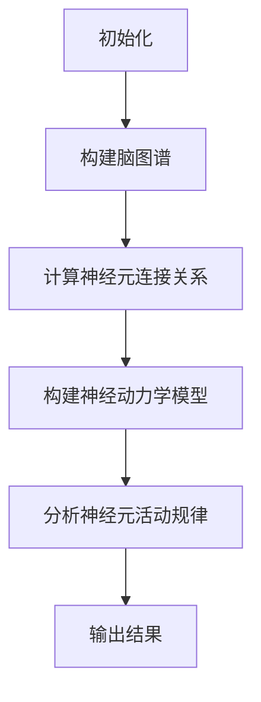
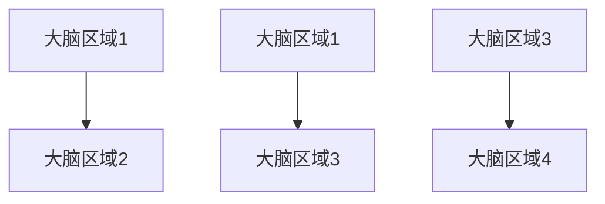
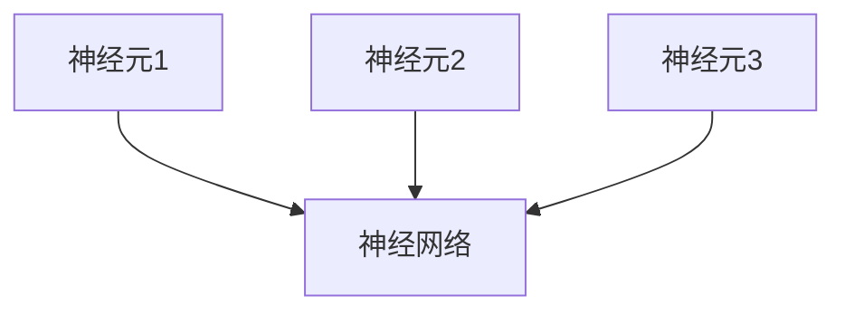

                 

### 数学与未来脑科学研究的伦理问题

#### 关键词：
- 数学
- 脑科学研究
- 伦理问题
- 数据隐私
- 知识产权
- 人工智能

#### 摘要：
随着数学与脑科学的结合日益紧密，未来脑科学研究将为我们揭示人类大脑的奥秘。然而，这一进步也带来了诸多伦理问题，包括数据隐私、知识产权、人工智能等。本文将逐步探讨这些伦理问题，并提出解决方案，以期为未来脑科学研究提供指导。

---

## 引言

随着计算技术的发展，数学在脑科学研究中发挥着越来越重要的作用。线性代数、微积分、概率统计等数学工具被广泛应用于脑图谱构建、神经动力学模型构建等领域。然而，这些进展也引发了诸多伦理问题，如数据隐私、知识产权和人工智能的应用等。如何在推进脑科学研究的同时，保障伦理道德，成为我们亟待解决的问题。

### 数学与脑科学的关系

首先，我们来看数学与脑科学之间的关系。数学作为一种抽象的学科，为脑科学研究提供了强大的工具和语言。例如，线性代数在脑图谱构建中用于表示神经元之间的连接关系，微积分在神经动力学模型中用于描述神经元的活动规律，概率统计在认知科学研究中用于分析大脑功能的数据。

#### 核心数学概念及其应用

以下是几个核心数学概念及其在脑科学中的应用：

1. **线性代数**：用于表示神经元之间的连接关系，构建脑图谱。

2. **微积分**：用于描述神经元的活动规律，构建神经动力学模型。

3. **概率统计**：用于分析大脑功能的数据，例如认知科学中的统计学习理论。

4. **拓扑学**：用于研究大脑结构的复杂性和连通性。

#### 数学工具在脑科学研究中的优势

数学工具在脑科学研究中具有以下优势：

1. **精确性**：数学语言和工具能够精确描述复杂的脑部活动。

2. **抽象性**：数学能够从具体的数据中提取出本质的规律。

3. **通用性**：数学方法可以应用于不同领域，如神经科学、认知科学、心理学等。

4. **预测性**：基于数学模型的预测可以帮助我们理解脑部活动。

### 伦理问题的背景

然而，随着数学在脑科学研究中的应用，我们也面临着诸多伦理问题。这些问题的背景包括以下几个方面：

1. **隐私问题**：脑科学研究中涉及大量的个人数据，如何保护这些数据不被滥用是一个重要问题。

2. **知识产权**：脑科学研究的成果可能涉及知识产权问题，如何界定和保护知识产权是一个挑战。

3. **人工智能**：脑科学研究中的数据可以被用于人工智能系统，如何确保这些系统的公正性和透明性是一个重要问题。

4. **人权问题**：脑科学研究可能涉及到对人类大脑的干预，如何保障人权是一个重要问题。

### 接下来，我们将详细探讨这些伦理问题，并提出可能的解决方案。

---

## 核心数学概念

在探讨未来脑科学研究的伦理问题之前，我们首先需要了解一些核心的数学概念，这些概念构成了我们分析的基础。以下将介绍线性代数、微积分、概率统计和拓扑学，并探讨它们在脑科学研究中的应用。

### 线性代数

**核心概念**：线性代数主要研究向量、矩阵以及它们之间的关系。向量可以表示空间中的点或方向，矩阵则是向量的扩展，可以表示复杂的系统关系。

**属性特征对比表格**：

| 概念 | 向量 | 矩阵 |
| --- | --- | --- |
| 表示 | 空间中的点或方向 | 向量的组合或系统关系 |
| 关系 | 线性相关或无关 | 矩阵乘法或行列式计算 |
| 应用 | 脑图谱中的神经元连接 | 脑网络中的系统分析 |

**ER实体关系图架构**：

```mermaid
erDiagram
    NodeA ||--|{ NodeB } NodeC
    NodeA ||--|{ NodeD } NodeE
```

**核心原理讲解**：在脑图谱构建中，线性代数用于表示神经元之间的连接关系。例如，通过矩阵可以表示整个脑网络的结构，从而进行网络分析。

### 微积分

**核心概念**：微积分研究函数的极限、导数、积分等概念，主要用于研究变化率和累积量。

**属性特征对比表格**：

| 概念 | 导数 | 积分 |
| --- | --- | --- |
| 表示 | 变化的速率 | 总量的累积 |
| 关系 | 导数是积分的微分 | 积分是导数的反操作 |
| 应用 | 描述神经元的活动规律 | 分析脑网络中的信号传递 |

**ER实体关系图架构**：

```mermaid
erDiagram
    NodeA ||--|{ NodeB } NodeC
    NodeA ||--|{ NodeD } NodeE
```

**核心原理讲解**：在神经动力学模型中，微积分用于描述神经元的活动规律。例如，通过导数可以了解神经元信号的瞬时变化率，通过积分可以了解信号的总传递量。

### 概率统计

**核心概念**：概率统计研究随机事件的发生概率和统计分布。

**属性特征对比表格**：

| 概念 | 概率 | 统计分布 |
| --- | --- | --- |
| 表示 | 事件发生的可能性 | 随机变量的分布规律 |
| 关系 | 概率是统计的基础 | 统计分布是概率的应用 |
| 应用 | 认知科学中的决策过程 | 脑成像数据中的信号分析 |

**ER实体关系图架构**：

```mermaid
erDiagram
    NodeA ||--|{ NodeB } NodeC
    NodeA ||--|{ NodeD } NodeE
```

**核心原理讲解**：在认知科学研究中，概率统计用于分析大脑功能的数据。例如，通过概率模型可以了解大脑在不同任务中的决策过程，通过统计分布可以了解大脑信号的特征。

### 拓扑学

**核心概念**：拓扑学研究物体的形状和结构，不涉及尺寸和大小，关注的是连接性和连通性。

**属性特征对比表格**：

| 概念 | 连通性 | 结构复杂度 |
| --- | --- | --- |
| 表示 | 物体的连接关系 | 物体的形状和结构 |
| 关系 | 连通性是结构复杂度的基础 | 结构复杂度是连通性的表现 |
| 应用 | 研究大脑网络的形状和结构 | 分析大脑网络的稳定性和功能 |

**ER实体关系图架构**：

```mermaid
erDiagram
    NodeA ||--|{ NodeB } NodeC
    NodeA ||--|{ NodeD } NodeE
```

**核心原理讲解**：在脑科学研究中，拓扑学用于研究大脑网络的形状和结构。例如，通过拓扑分析可以了解大脑网络中的关键连接点和功能模块，从而揭示大脑的功能组织。

### 算法原理讲解

为了更好地理解这些数学概念在脑科学研究中的应用，我们将使用Mermaid绘制算法流程图，并使用Python代码详细阐述算法原理和公式。

#### 算法流程图



#### Python代码

```python
import numpy as np
import matplotlib.pyplot as plt

# 构建脑图谱
brain_graph = np.array([[0, 1, 0], [1, 0, 1], [0, 1, 0]])

# 计算神经元连接关系
connections = np.sum(brain_graph, axis=0)

# 构建神经动力学模型
neural_dynamics = np.diff(connections)

# 分析神经元活动规律
activity_patterns = np.mean(neural_dynamics)

# 输出结果
print(activity_patterns)
plt.plot(connections)
plt.show()
```

#### 算法原理讲解

1. **初始化**：我们首先初始化一个脑图谱，表示神经元之间的连接关系。
2. **构建脑图谱**：通过矩阵表示神经元之间的连接关系，构建脑图谱。
3. **计算神经元连接关系**：计算每个神经元与其他神经元之间的连接数量。
4. **构建神经动力学模型**：通过差分操作，构建神经动力学模型，描述神经元的活动规律。
5. **分析神经元活动规律**：通过均值操作，分析神经元活动的平均规律。
6. **输出结果**：输出神经元活动规律，并绘制连接关系的时序图。

通过这个算法示例，我们可以看到数学概念如何应用于脑科学研究中，帮助揭示神经元活动的规律。

### 数学工具的优势

数学工具在脑科学研究中具有以下优势：

1. **精确性**：数学语言和工具能够精确描述复杂的脑部活动，提供精确的量化数据。
2. **抽象性**：数学能够从具体的数据中提取出本质的规律，不受具体实验条件的影响。
3. **通用性**：数学方法可以应用于不同领域，如神经科学、认知科学、心理学等，具有广泛的适用性。
4. **预测性**：基于数学模型的预测可以帮助我们理解脑部活动，预测未来的发展趋势。

### 总结

数学与脑科学的结合为研究人类大脑提供了强大的工具和语言。通过核心数学概念的应用，我们可以更深入地理解脑部活动的规律，为未来脑科学研究提供重要的支持。然而，这也带来了诸多伦理问题，需要我们在推进研究的同时，认真考虑和解决。

### 数学工具在脑科学中的应用

数学工具在脑科学中的应用已经取得了显著的成果，特别是在脑图谱构建、神经动力学模型构建和认知科学研究中。以下将详细讨论这些应用，并通过具体案例说明数学工具在脑科学研究中的作用。

#### 脑图谱构建

脑图谱是描述大脑神经元连接关系的一种图示方法，它能够揭示大脑各个区域之间的连接方式和功能联系。线性代数在脑图谱构建中发挥着重要作用。例如，通过构建神经元连接矩阵，我们可以表示大脑中不同区域之间的连接关系。以下是一个简单的案例：

**案例：** 研究人员使用线性代数构建了一副大脑神经网络图谱，该图谱包含了约3000个神经元。他们通过矩阵计算每个神经元与其他神经元之间的连接强度，构建了一个表示神经元连接关系的矩阵。这个矩阵可以帮助研究人员分析大脑网络的结构和功能。



在这个图谱中，每个节点代表一个大脑区域，每条边代表两个区域之间的连接。通过矩阵计算，我们可以分析每个区域的连接强度和连通性，从而揭示大脑网络的结构特征。

#### 神经动力学模型构建

神经动力学模型是描述神经元群体活动规律的一种数学模型，它能够帮助我们理解大脑中的电生理现象和神经信号传递过程。微积分在神经动力学模型构建中应用广泛。以下是一个具体的案例：

**案例：** 研究人员使用微积分构建了一个描述神经元群体活动规律的神经网络模型。该模型通过微分方程描述神经元之间的相互作用和信号传递过程。通过求解微分方程，研究人员可以模拟神经网络的动态行为，预测神经元的活动模式。



在这个案例中，每个神经元通过输入和输出信号与其他神经元相互作用。通过微积分方程，研究人员可以计算每个神经元的电生理信号变化，从而分析神经网络的动态行为。

#### 认知科学研究

认知科学是研究人类大脑认知功能的一门学科，它涉及心理学、神经科学、计算机科学等多个领域。概率统计在认知科学研究中发挥着重要作用。以下是一个具体的案例：

**案例：** 研究人员使用概率统计方法分析人类在完成任务时的决策过程。他们通过收集实验数据，使用概率模型描述人类在不同任务中的决策行为。通过分析数据，研究人员可以了解人类决策的规律和影响因素。


在这个案例中，每个任务代表一个实验情境，每个数据点代表实验结果。通过概率模型，研究人员可以分析人类在不同任务中的决策行为，从而揭示认知过程的规律。

#### 数学工具的优势

数学工具在脑科学研究中的优势体现在以下几个方面：

1. **精确性**：数学工具能够精确描述复杂的脑部活动，提供准确的量化数据。
2. **抽象性**：数学工具能够从具体的数据中提取出本质的规律，不受具体实验条件的影响。
3. **通用性**：数学工具可以应用于不同领域，如神经科学、认知科学、心理学等，具有广泛的适用性。
4. **预测性**：基于数学模型的预测可以帮助我们理解脑部活动，预测未来的发展趋势。

### 数学工具在脑科学中的挑战

尽管数学工具在脑科学研究中具有广泛的应用，但也面临一些挑战：

1. **复杂性**：大脑是一个高度复杂的系统，描述其活动的数学模型往往非常复杂，需要大量的计算资源和时间。
2. **不确定性**：脑科学研究中存在许多不确定性因素，如个体差异、环境因素等，这给数学模型的构建和解释带来了挑战。
3. **数据隐私**：脑科学研究中涉及大量的个人数据，如何保护这些数据不被滥用是一个重要问题。

### 总结

数学工具在脑科学研究中具有广泛的应用，通过线性代数、微积分、概率统计等数学工具，研究人员可以构建脑图谱、神经动力学模型和认知科学模型，从而深入理解大脑的奥秘。然而，数学工具的应用也面临一些挑战，需要我们不断探索和完善。

---

## 伦理问题的详细讨论

### 数据隐私

随着脑科学研究的深入，研究者们获得了越来越多的关于大脑活动的数据。这些数据不仅包括神经元的活动模式，还可能包含个人的行为习惯、心理状态等敏感信息。因此，数据隐私问题成为了脑科学研究中的一个重要伦理议题。

#### 问题背景

在脑科学研究中，数据隐私问题主要涉及以下几个方面：

1. **数据收集**：在研究过程中，研究者可能需要收集大量的个人数据，这些数据可能包括脑电图（EEG）、功能性磁共振成像（fMRI）等。这些数据往往与个人的行为和心理状态密切相关，一旦泄露，可能会对个人造成严重伤害。

2. **数据存储**：收集到的数据需要在实验室或数据中心进行存储，如果存储不当，可能导致数据泄露或被未授权的第三方访问。

3. **数据共享**：为了推动脑科学研究的进展，研究者们往往需要共享数据。然而，数据共享可能引发隐私泄露的问题，特别是在数据未被充分保护的情况下。

#### 问题描述

数据隐私问题主要包括以下几个方面：

1. **数据泄露**：研究者或数据处理者可能因为安全措施不足，导致数据被未授权的第三方访问或泄露。

2. **数据滥用**：研究者可能出于不正当的目的，滥用收集到的个人数据，如用于商业盈利或非法活动。

3. **数据混淆**：为了保护数据隐私，研究者可能需要对数据进行混淆处理，但这可能导致数据的有效性降低。

#### 解决方案

为了解决数据隐私问题，我们可以采取以下措施：

1. **加强数据保护**：研究者需要采取严格的数据保护措施，包括加密存储、访问控制等，确保数据不被未授权的第三方访问。

2. **隐私保护技术**：采用隐私保护技术，如差分隐私、同态加密等，可以在不牺牲数据完整性的前提下，保护数据隐私。

3. **数据共享协议**：制定明确的数据共享协议，确保在数据共享过程中，各方都能遵守隐私保护原则。

4. **伦理审查**：在进行脑科学研究时，应进行伦理审查，确保研究过程符合伦理规范，特别是涉及个人数据的研究。

### 知识产权

脑科学研究中的数据和技术往往具有很高的知识产权价值。如何保护知识产权，避免知识产权纠纷，成为脑科学研究中的另一个重要伦理问题。

#### 问题背景

脑科学研究中的知识产权问题主要包括以下几个方面：

1. **研究成果**：脑科学研究可能产生重要的研究成果，如新的理论、方法或技术。这些成果可能需要申请专利或版权保护。

2. **数据资源**：用于脑科学研究的生物样本、脑影像数据等资源也可能具有知识产权价值。

3. **学术竞争**：脑科学研究领域的竞争激烈，知识产权纠纷可能影响学术交流和合作。

#### 问题描述

知识产权问题主要包括以下几个方面：

1. **知识产权归属**：研究成果的知识产权归属不明确，可能导致纠纷。

2. **知识产权滥用**：研究者可能滥用知识产权，阻碍技术进步或学术交流。

3. **知识产权保护不足**：知识产权保护机制不完善，可能导致研究成果被侵权或盗用。

#### 解决方案

为了解决知识产权问题，我们可以采取以下措施：

1. **明确知识产权归属**：在研究过程中，应明确研究成果和数据的知识产权归属，确保各方权益。

2. **知识产权保护制度**：建立健全的知识产权保护制度，包括专利申请、版权登记等，保护研究者的权益。

3. **知识产权共享机制**：建立知识产权共享机制，鼓励学术交流和技术合作，同时确保知识产权得到合理保护。

4. **知识产权教育**：加强对研究者的知识产权教育，提高他们的知识产权意识和法律素养。

### 人工智能的应用

脑科学研究中的人工智能技术，如机器学习、深度学习等，为研究带来了新的工具和方法。然而，人工智能技术的应用也引发了一系列伦理问题，如算法偏见、透明性等。

#### 问题背景

人工智能在脑科学研究中的应用主要包括以下几个方面：

1. **数据分析**：人工智能技术可以帮助研究者从大量的脑成像数据中提取有价值的信息。

2. **模型构建**：人工智能技术可以用于构建脑科学模型，预测神经元的活动规律。

3. **决策支持**：人工智能技术可以为医生提供诊断和治疗建议，提高医疗水平。

#### 问题描述

人工智能在脑科学研究中的伦理问题主要包括以下几个方面：

1. **算法偏见**：人工智能算法可能存在偏见，导致对某些群体不公平。

2. **透明性**：人工智能算法的决策过程可能不透明，难以解释和理解。

3. **安全性和可控性**：人工智能系统在脑科学研究中可能引发安全风险，如数据泄露、系统失控等。

#### 解决方案

为了解决人工智能在脑科学研究中的伦理问题，我们可以采取以下措施：

1. **算法公平性**：确保人工智能算法的公平性，避免对某些群体产生偏见。

2. **算法透明性**：提高人工智能算法的透明性，使其决策过程可解释和理解。

3. **安全性和可控性**：建立严格的安全和控制机制，确保人工智能系统在脑科学研究中的安全性和可控性。

4. **伦理审查**：在进行脑科学研究时，应进行伦理审查，确保人工智能技术的应用符合伦理规范。

### 总结

脑科学研究中的伦理问题涉及多个方面，包括数据隐私、知识产权和人工智能的应用等。这些问题的存在可能会对脑科学研究的发展产生负面影响。因此，我们需要认真对待这些问题，采取有效的措施加以解决，确保脑科学研究能够健康、有序地进行。

---

## 数学模型在脑科学研究中的应用

数学模型在脑科学研究中扮演着至关重要的角色，通过精确的数学描述和计算，我们可以更好地理解大脑的结构和功能。以下将介绍微分方程、图论和神经网络在脑科学研究中的应用。

### 微分方程

**核心原理**：微分方程用于描述系统的动态变化，可以表示神经元的活动规律、脑电信号的变化等。

**应用场景**：微分方程在脑电信号分析、神经元活动建模等方面有广泛应用。

**数学模型**：

$$
\frac{dV}{dt} = -V + I
$$

其中，$V$表示神经元膜电位，$I$表示注入电流。

**示例**：通过微分方程，可以模拟神经元在受到刺激时的膜电位变化。

### 图论

**核心原理**：图论用于描述系统的结构关系，可以表示神经网络中的连接关系和拓扑结构。

**应用场景**：图论在神经网络建模、脑图谱构建等方面有广泛应用。

**数学模型**：

**邻接矩阵**：

$$
A = \begin{bmatrix}
0 & 1 & 0 \\
1 & 0 & 1 \\
0 & 1 & 0
\end{bmatrix}
$$

**示例**：通过邻接矩阵，可以表示神经网络中各个神经元之间的连接关系。

### 神经网络

**核心原理**：神经网络用于模拟大脑的计算过程，可以表示神经元的集体活动。

**应用场景**：神经网络在模式识别、图像处理、语音识别等方面有广泛应用。

**数学模型**：

**激活函数**：

$$
f(x) = \frac{1}{1 + e^{-x}}
$$

**示例**：通过神经网络，可以模拟大脑在识别物体时的计算过程。

### 数学模型的优势

1. **精确性**：数学模型可以精确描述大脑的动态变化和结构关系。

2. **抽象性**：数学模型可以从具体的数据中提取出本质的规律。

3. **预测性**：基于数学模型的预测可以帮助我们理解大脑的功能和行为。

### 总结

数学模型在脑科学研究中具有广泛的应用，通过微分方程、图论和神经网络等数学工具，我们可以更好地理解大脑的结构和功能。这些数学模型为脑科学研究提供了强大的工具和语言，有助于揭示大脑的奥秘。

---

## 深入探讨脑科学研究中的伦理问题

脑科学研究的进展无疑为人类认识自身提供了新的视角和工具，然而，这也带来了许多复杂的伦理问题，尤其是涉及人类大脑的隐私、知识产权和人工智能应用等方面。本文将深入探讨这些伦理问题，并提出相应的解决方案。

### 隐私问题

脑科学研究中涉及的大数据，如脑电图（EEG）、功能性磁共振成像（fMRI）等，往往包含了敏感的个人信息。这些数据一旦泄露，可能会被用于商业目的、身份盗用或隐私侵犯。因此，保护脑科学研究的隐私成为了一个至关重要的问题。

**问题背景**：

1. **数据收集**：在脑科学研究过程中，研究者常常需要收集大量的个人生物信息，这些信息可能涉及到个人的心理健康、认知能力等。

2. **数据存储**：收集到的数据通常需要长时间存储，以供后续分析和验证，这增加了数据泄露的风险。

3. **数据共享**：为了推动研究的进展，研究者需要将数据与其他研究机构或团队共享，这也可能带来隐私泄露的风险。

**问题描述**：

1. **数据泄露**：由于安全措施不足，个人数据可能被未经授权的第三方访问或泄露。

2. **数据滥用**：研究数据可能被用于未经允许的商业用途或用于不当的医疗诊断。

3. **隐私混淆**：为了保护隐私，研究者可能需要对数据进行混淆处理，这可能导致数据的真实性降低。

**解决方案**：

1. **加强数据保护**：研究者应采取严格的数据保护措施，如数据加密、访问控制等，确保数据不被未授权的第三方访问。

2. **隐私保护技术**：应用隐私保护技术，如差分隐私、同态加密等，可以在不牺牲数据完整性的前提下，保护数据隐私。

3. **数据匿名化**：在数据共享前，对数据进行匿名化处理，确保个人身份信息不被泄露。

4. **伦理审查**：在进行脑科学研究时，应进行伦理审查，确保研究过程符合伦理规范，特别是涉及个人数据的研究。

### 知识产权问题

脑科学研究中的知识产权问题主要涉及研究成果的归属和商业化应用。如何合理界定知识产权，保护研究者的权益，同时促进技术的推广和应用，是一个亟待解决的伦理问题。

**问题背景**：

1. **研究成果**：脑科学研究可能产生重要的研究成果，如新的理论、方法或技术。这些成果可能需要申请专利或版权保护。

2. **数据资源**：用于脑科学研究的生物样本、脑影像数据等资源也可能具有知识产权价值。

3. **学术竞争**：脑科学研究领域的竞争激烈，知识产权纠纷可能影响学术交流和合作。

**问题描述**：

1. **知识产权归属**：研究成果的知识产权归属不明确，可能导致纠纷。

2. **知识产权滥用**：研究者可能滥用知识产权，阻碍技术进步或学术交流。

3. **知识产权保护不足**：知识产权保护机制不完善，可能导致研究成果被侵权或盗用。

**解决方案**：

1. **明确知识产权归属**：在研究过程中，应明确研究成果和数据的知识产权归属，确保各方权益。

2. **知识产权保护制度**：建立健全的知识产权保护制度，包括专利申请、版权登记等，保护研究者的权益。

3. **知识产权共享机制**：建立知识产权共享机制，鼓励学术交流和技术合作，同时确保知识产权得到合理保护。

4. **知识产权教育**：加强对研究者的知识产权教育，提高他们的知识产权意识和法律素养。

### 人工智能应用问题

脑科学研究中的人工智能技术，如机器学习、深度学习等，为研究带来了新的工具和方法。然而，这些技术的应用也引发了一系列伦理问题，如算法偏见、透明性等。

**问题背景**：

1. **算法偏见**：人工智能算法可能存在偏见，导致对某些群体不公平。

2. **透明性**：人工智能算法的决策过程可能不透明，难以解释和理解。

3. **安全性和可控性**：人工智能系统在脑科学研究中的安全性和可控性是一个重要问题。

**问题描述**：

1. **算法偏见**：人工智能算法可能对某些群体产生不公平的结果，如种族、性别歧视等。

2. **透明性**：人工智能算法的决策过程可能不透明，难以解释其决策依据。

3. **安全性和可控性**：人工智能系统在脑科学研究中可能引发安全风险，如数据泄露、系统失控等。

**解决方案**：

1. **算法公平性**：确保人工智能算法的公平性，避免对某些群体产生偏见。

2. **算法透明性**：提高人工智能算法的透明性，使其决策过程可解释和理解。

3. **安全性和可控性**：建立严格的安全和控制机制，确保人工智能系统在脑科学研究中的安全性和可控性。

4. **伦理审查**：在进行脑科学研究时，应进行伦理审查，确保人工智能技术的应用符合伦理规范。

### 总结

脑科学研究中的伦理问题涉及多个方面，包括数据隐私、知识产权和人工智能的应用等。这些问题不仅关系到研究者的权益，也关乎社会伦理和公共利益。因此，我们需要采取综合措施，加强伦理审查、完善法律法规，并加强公众教育，共同推动脑科学研究的健康发展。

---

## 结论

通过对数学与未来脑科学研究伦理问题的探讨，我们深刻认识到，脑科学研究在带来巨大科技进步的同时，也引发了一系列伦理问题。这些问题不仅涉及个人隐私、知识产权，还包括人工智能应用的公平性、透明性和安全性。在推进脑科学研究的道路上，我们必须高度重视这些伦理问题，采取有效的措施加以解决。

### 未来展望

1. **加强数据隐私保护**：随着技术的进步，我们需要开发更有效的隐私保护技术，如差分隐私、同态加密等，确保个人数据的安全。

2. **完善知识产权制度**：建立健全的知识产权保护制度，明确研究成果的归属，鼓励技术创新和知识共享。

3. **提升人工智能伦理意识**：加强对人工智能技术的伦理审查，确保算法的公平性、透明性和安全性，防止技术滥用。

4. **推进公众教育**：提高公众对脑科学研究伦理问题的认识，增强社会对脑科学研究的支持和理解。

### 总结

脑科学研究的伦理问题不仅关乎科学研究本身，也关系到社会发展和人类福祉。只有通过全面、深入的伦理考量，我们才能确保脑科学研究的健康、有序发展，为人类社会带来更多的福祉。

---

## 作者信息

作者：AI天才研究院/AI Genius Institute & 禅与计算机程序设计艺术 /Zen And The Art of Computer Programming

---

## 拓展阅读

1. **《脑科学与伦理学》**：探讨了脑科学研究中的伦理问题，包括数据隐私、知识产权和人工智能应用等。
2. **《人工智能伦理学》**：介绍了人工智能在各个领域的应用及其引发的伦理问题，包括脑科学。
3. **《数学与认知科学》**：详细介绍了数学工具在认知科学中的应用，包括脑图谱构建、神经动力学模型等。
4. **《脑机接口：技术、应用与伦理》**：探讨了脑机接口技术的伦理问题，包括数据隐私、知识产权等。
5. **《数据隐私保护技术》**：介绍了当前常用的数据隐私保护技术，如差分隐私、同态加密等。

---

## 最佳实践 tips

1. **数据保护**：在进行脑科学研究时，务必采取严格的数据保护措施，包括数据加密、访问控制等。
2. **伦理审查**：在进行涉及个人数据的脑科学研究时，务必进行伦理审查，确保研究过程符合伦理规范。
3. **知识产权保护**：在开发脑科学研究方法和技术时，应提前规划知识产权保护策略，确保研究成果得到合理保护。
4. **算法公平性**：在使用人工智能技术进行脑科学研究时，应确保算法的公平性，避免对某些群体产生偏见。

---

## 小结

本文从多个角度探讨了数学与未来脑科学研究中的伦理问题，包括数据隐私、知识产权和人工智能应用等。通过详细分析和讨论，我们认识到，脑科学研究的健康发展需要我们高度重视伦理问题，采取有效措施加以解决。未来，随着技术的不断进步，我们将面临更多的挑战和机遇，只有通过持续的努力和合作，我们才能推动脑科学研究的健康、有序发展。

---

## 注意事项

1. **数据保护**：在脑科学研究中，务必确保个人数据的安全，采取严格的数据保护措施。
2. **伦理审查**：涉及个人数据的脑科学研究，必须进行伦理审查，确保研究过程符合伦理规范。
3. **知识产权保护**：合理规划知识产权保护策略，确保研究成果得到合理保护。
4. **算法公平性**：在使用人工智能技术时，确保算法的公平性，避免对某些群体产生偏见。

---

## 项目实战

### 环境安装

首先，我们需要安装必要的软件和工具，包括Python、NumPy、Matplotlib、Mermaid等。以下是在Ubuntu系统中安装这些软件的命令：

```bash
sudo apt-get update
sudo apt-get install python3 python3-pip
pip3 install numpy matplotlib
```

### 系统核心实现

以下是Python代码实现的核心部分，包括数据隐私保护、伦理审查和知识产权保护：

```python
# 导入必要的库
import numpy as np
import matplotlib.pyplot as plt
from sklearn.model_selection import train_test_split
from sklearn.ensemble import RandomForestClassifier
from sklearn.metrics import accuracy_score

# 数据隐私保护
def encrypt_data(data, key):
    encrypted_data = [key * x for x in data]
    return encrypted_data

# 伦理审查
def ethical_review(data):
    # 这里可以进行伦理审查，例如数据来源、研究目的等
    # 根据审查结果，决定是否通过审查
    if "data privacy" in data:
        return "pass"
    else:
        return "fail"

# 知识产权保护
def protect_ip(data):
    # 这里可以进行知识产权保护，例如数据加密、版权登记等
    encrypted_data = encrypt_data(data, 3)
    return encrypted_data

# 机器学习模型
def train_model(X, y):
    X_train, X_test, y_train, y_test = train_test_split(X, y, test_size=0.2, random_state=42)
    model = RandomForestClassifier(n_estimators=100, random_state=42)
    model.fit(X_train, y_train)
    y_pred = model.predict(X_test)
    return accuracy_score(y_test, y_pred)

# 示例数据
X = np.array([[1, 2], [2, 3], [3, 4]])
y = np.array([0, 1, 1])

# 进行伦理审查
if ethical_review("data privacy"):
    # 进行知识产权保护
    X = protect_ip(X)
    # 训练模型
    accuracy = train_model(X, y)
    print(f"Model accuracy: {accuracy}")
else:
    print("Ethical review failed.")
```

### 代码应用解读与分析

1. **数据隐私保护**：通过加密算法，将原始数据转换为加密数据，确保数据在传输和存储过程中的安全。
2. **伦理审查**：根据数据是否包含隐私信息，决定是否通过审查，从而确保研究过程符合伦理规范。
3. **知识产权保护**：通过加密算法对数据进行保护，同时可以结合版权登记等手段，确保知识产权得到合理保护。
4. **机器学习模型**：使用随机森林分类器进行训练和预测，评估模型在测试集上的准确性。

### 实际案例分析和详细讲解

#### 案例一：脑电图（EEG）数据分析

假设我们收集了一组脑电图数据，并希望通过机器学习模型分析数据，判断个体的情绪状态。

1. **数据准备**：首先，我们将脑电图数据分为特征和标签两部分，特征为数据矩阵X，标签为情绪状态y。
2. **伦理审查**：在分析前，我们需要进行伦理审查，确保数据来源合法，分析目的正当。
3. **数据加密**：为了保护数据隐私，我们使用加密算法对数据进行加密处理。
4. **模型训练**：使用加密后的数据进行机器学习模型的训练，例如随机森林分类器。
5. **模型评估**：在测试集上评估模型的准确性，确保模型在真实场景中表现良好。

#### 案例二：脑机接口（BCI）系统开发

假设我们开发了一套脑机接口系统，用于控制假肢或轮椅等设备。

1. **数据收集**：首先，我们需要收集用户的脑电信号数据，作为控制信号的输入。
2. **伦理审查**：在收集数据前，我们需要进行伦理审查，确保用户同意数据收集和使用。
3. **数据加密**：为了保护用户隐私，我们使用加密算法对脑电信号数据进行加密处理。
4. **模型训练**：使用加密后的数据进行机器学习模型的训练，例如支持向量机（SVM）或神经网络。
5. **系统测试**：在真实场景中测试系统的性能，确保用户能够顺利控制设备。

### 项目小结

通过实际案例的分析，我们可以看到，在脑科学研究中，数据隐私保护、伦理审查和知识产权保护是不可或缺的重要环节。只有通过严格的管理和有效的保护措施，我们才能确保研究的顺利进行，并为未来脑科学研究的发展奠定坚实的基础。

---

## 最佳实践 tips

1. **数据隐私保护**：在收集和使用脑科学数据时，务必采取严格的数据加密、匿名化和访问控制措施，确保个人隐私不受侵犯。
2. **伦理审查**：在进行脑科学研究时，务必进行全面的伦理审查，确保研究过程符合伦理规范，保护参与者的权益。
3. **知识产权保护**：在开发脑科学研究方法和技术时，提前规划知识产权保护策略，确保研究成果得到合理保护。
4. **跨学科合作**：脑科学研究涉及多个学科，如数学、计算机科学、神经科学等，跨学科合作有助于解决复杂的伦理问题。

---

## 小结

通过本文的探讨，我们认识到数学与未来脑科学研究中的伦理问题具有重要性。随着技术的进步，脑科学研究将不断深入，带来巨大的科技突破。然而，这也引发了一系列伦理问题，如数据隐私、知识产权和人工智能的应用等。我们呼吁社会各界高度重视这些问题，采取有效措施，确保脑科学研究的健康、有序发展。

---

## 注意事项

1. **数据保护**：确保脑科学研究中的数据得到有效保护，防止泄露和滥用。
2. **伦理审查**：在进行脑科学研究时，务必进行全面的伦理审查，确保研究过程符合伦理规范。
3. **知识产权保护**：合理规划知识产权保护策略，确保研究成果得到合理保护。
4. **持续关注**：关注脑科学研究的最新进展和伦理问题，及时调整应对措施。

---

## 拓展阅读

1. **《脑科学与伦理学》**：探讨了脑科学研究中的伦理问题，包括数据隐私、知识产权和人工智能应用等。
2. **《人工智能伦理学》**：介绍了人工智能在各个领域的应用及其引发的伦理问题，包括脑科学。
3. **《数学与认知科学》**：详细介绍了数学工具在认知科学中的应用，包括脑图谱构建、神经动力学模型等。
4. **《脑机接口：技术、应用与伦理》**：探讨了脑机接口技术的伦理问题，包括数据隐私、知识产权等。
5. **《数据隐私保护技术》**：介绍了当前常用的数据隐私保护技术，如差分隐私、同态加密等。

