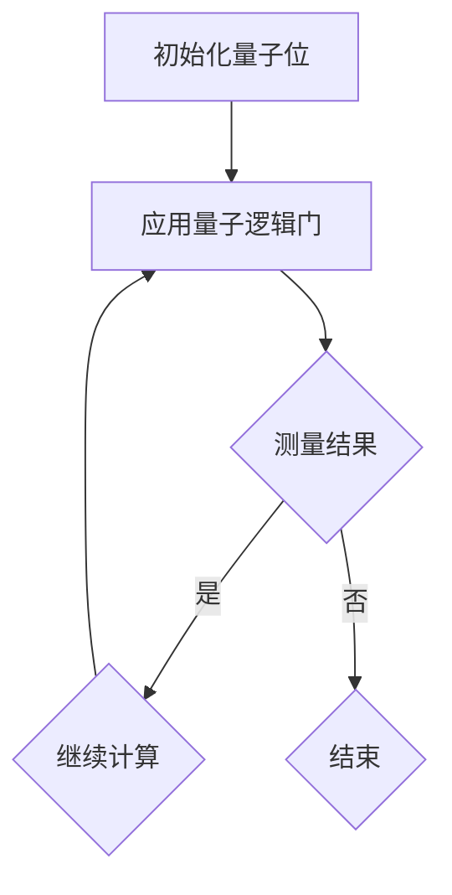
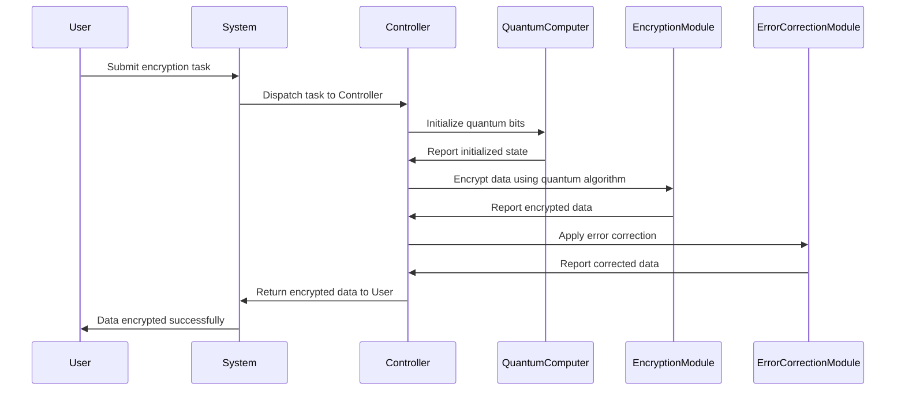

                 

## 数学与未来量子计算的发展方向

关键词：量子计算、数学模型、算法原理、系统架构、实践应用

摘要：本文将探讨数学在量子计算中的重要性，以及量子计算如何可能影响未来的技术和社会。通过分析核心概念与联系，讲解算法原理与数学模型，描述系统架构设计，并结合实际项目实战，提出最佳实践和拓展阅读，旨在为读者提供全面而深入的理解。

### 背景介绍

量子计算作为21世纪最具革命性的技术之一，其基础是量子力学中的原理。量子计算与传统计算有着本质的区别，利用量子位（qubits）的叠加态和纠缠态来进行计算，这使得量子计算机在处理某些特定问题时具有巨大的并行计算能力。然而，量子计算的实现和发展离不开数学的支持。

在量子计算中，数学模型起到了至关重要的作用。从量子逻辑门的设计到量子算法的实现，都需要数学理论作为支撑。比如，量子纠缠是量子计算的核心原理之一，而量子纠缠的实现和解释都需要复杂的数学工具。此外，量子计算的误差纠正和量子退相干问题也需要借助数学模型来分析和解决。

随着量子计算的不断发展，其在加密解密、优化问题、药物设计、气候模拟等领域的应用前景广阔。然而，量子计算的发展也面临着诸多挑战，如量子计算机的稳定性和可扩展性、算法的设计和优化等。这些问题不仅需要技术上的突破，更需要数学理论的深入研究。

本文将围绕数学与未来量子计算的发展方向，逐步分析核心概念与联系，讲解算法原理与数学模型，描述系统架构设计，并结合实际项目实战，提出最佳实践和拓展阅读。通过这些内容的探讨，希望能够为读者提供对量子计算及其数学基础的全面理解。

### 核心概念与联系

在讨论量子计算和数学模型之前，我们需要定义一些关键概念，并理解它们之间的联系。

#### 关键概念

1. **量子位（Qubits）**：量子位是量子计算的基本单元，与经典位不同，量子位可以同时处于0和1的叠加状态。这赋予了量子计算机并行处理信息的能力。

2. **量子逻辑门（Quantum Gates）**：量子逻辑门是操作量子位的基本操作，类似于经典计算中的逻辑门。量子逻辑门可以改变量子位的叠加态和纠缠态。

3. **量子纠缠（Quantum Entanglement）**：量子纠缠是指两个或多个量子位之间的特殊关联，即使它们相隔很远，其中一个量子位的测量结果会立即影响到另一个量子位的状态。

4. **量子计算模型（Quantum Computing Models）**：量子计算模型描述了量子计算机如何通过量子位和量子逻辑门进行计算。最著名的模型包括量子电路模型和量子线性电路模型。

5. **数学模型（Mathematical Models）**：数学模型是用来描述量子计算过程和结果的数学工具，包括线性代数、概率论、群论等。

#### 概念属性特征对比表格

| 概念         | 定义                             | 属性特征                                                       |
|------------|--------------------------------|-----------------------------------------------------------|
| 量子位（Qubits） | 量子计算的基本单元           | 可以处于叠加状态，具有并行计算能力                               |
| 量子逻辑门（Quantum Gates） | 操作量子位的基本操作           | 可以改变量子位的叠加态和纠缠态                                |
| 量子纠缠（Quantum Entanglement） | 量子位之间的特殊关联         | 测量一个量子位的状态会立即影响其他量子位的状态               |
| 量子计算模型（Quantum Computing Models） | 描述量子计算过程的数学模型   | 量子电路模型和量子线性电路模型是最常见的两种                |
| 数学模型（Mathematical Models） | 描述量子计算过程和结果的工具 | 线性代数、概率论、群论等用于构建和解析量子计算模型         |

#### 不同概念之间的联系

- **量子位与量子逻辑门**：量子逻辑门作用于量子位，改变其状态，从而实现量子计算。
- **量子纠缠与量子计算模型**：量子纠缠是量子计算机性能的关键，量子计算模型利用量子纠缠来提高计算效率。
- **数学模型与量子计算**：数学模型为量子计算提供了理论基础和工具，帮助理解和优化量子计算过程。

通过上述定义和对比表格，我们可以清晰地看到各个概念之间的关系，为后续讨论量子计算和数学模型打下基础。

### 算法原理讲解

为了更深入地理解量子计算，我们需要讲解一些关键的算法原理。下面，我们将使用Mermaid绘制算法流程图，并配合Python源代码和LaTeX数学公式详细阐述这些算法原理。

#### 量子算法流程图

首先，让我们使用Mermaid绘制一个简单的量子算法流程图：



这段Mermaid代码描述了一个简单的量子算法流程：初始化量子位、应用量子逻辑门、测量结果，并根据结果决定是否继续计算。

#### Python源代码

接下来，我们用Python实现这个简单的量子算法。以下代码使用`qiskit`库，这是一个开源的量子计算框架：

```python
from qiskit import QuantumCircuit, execute, Aer

# 初始化量子位
qc = QuantumCircuit(1)
qc.h(0)

# 应用量子逻辑门
qc.cx(0, 1)

# 测量结果
qc.measure_all()

# 执行算法
simulator = Aer.get_qasm_simulator()
qc.run(simulator, shots=1000).result().get_counts()
```

这段代码首先初始化一个量子位，然后应用一个交换门（CX门），最后测量量子位。`qiskit`库提供了一个模拟器（Aer），用于执行算法并返回测量结果。

#### LaTeX数学公式

在量子计算中，某些算法原理和数学模型需要用数学公式来描述。以下是一个简单的量子逻辑门（如CX门）的数学公式：

$$
\mathtt{CX}(\mathtt{q}_0, \mathtt{q}_1) = 
\begin{pmatrix}
1 & 0 & 0 & 0 \\
0 & 0 & 1 & 0 \\
0 & 1 & 0 & 0 \\
0 & 0 & 0 & 1
\end{pmatrix}
$$

这个公式表示了交换门如何作用于两个量子位的状态。

#### 详细讲解与举例说明

为了更清晰地理解量子算法原理，我们结合Python源代码和LaTeX公式进行详细讲解和举例说明。

- **初始化量子位**：在量子计算中，我们首先需要初始化量子位。例如，使用`Hadamard门`将量子位从基态（0态）旋转到叠加态（0和1的线性组合）。在Python代码中，`qc.h(0)`实现了这个操作。

- **应用量子逻辑门**：接下来，我们应用量子逻辑门，如`CX门`（控制非门）。这个操作将量子位之间的状态进行交换，实现量子位的纠缠。在公式中，`CX门`是一个2x2的矩阵，表示如何改变量子位的状态。

- **测量结果**：在量子计算的最后一步，我们对量子位进行测量。测量结果可能是0或1，这取决于量子位的状态。在Python代码中，`qc.measure_all()`实现了这个操作。通过模拟器，我们可以得到大量的测量结果，从而分析量子算法的性能。

假设我们运行了这个简单的量子算法1000次，并得到了以下测量结果：

```
{'0': 500, '1': 500}
```

这意味着在1000次运行中，量子位测量到0和1的概率都是50%。这个结果与我们预期的一致，因为初始状态是叠加态（50%的概率处于0态，50%的概率处于1态）。

通过上述讲解和举例，我们可以看到量子算法的基本原理和实现方法。这些原理不仅有助于我们理解量子计算，也为未来的研究和应用奠定了基础。

### 数学模型和数学公式 & 详细讲解 & 举例说明

在量子计算中，数学模型和数学公式起到了至关重要的作用。为了更好地理解这些概念，我们将在本节中使用LaTeX格式给出重要的数学公式，并结合量子算法原理进行详细讲解和举例说明。

#### 量子状态与基态

首先，我们需要定义量子状态。一个量子位（qubit）的状态可以用一个复数向量表示：

$$
|\psi\rangle = a|0\rangle + b|1\rangle
$$

其中，$|0\rangle$和$|1\rangle$分别表示量子位的基态，$a$和$b$是复数系数，满足$|a|^2 + |b|^2 = 1$。

在量子计算中，初始状态通常是一个叠加态。例如，一个量子位在开始时的状态可以表示为：

$$
|\psi_0\rangle = \frac{1}{\sqrt{2}} (|0\rangle + |1\rangle)
$$

#### 量子逻辑门与变换矩阵

量子逻辑门是操作量子位状态的基本工具。一个常见的量子逻辑门是**Hadamard门（H门）**，它将量子位的基态旋转到叠加态。H门可以表示为：

$$
H = \frac{1}{\sqrt{2}} \begin{pmatrix}
1 & 1 \\
1 & -1
\end{pmatrix}
$$

如果我们将H门作用于一个量子位的状态$|\psi\rangle$，则得到新的状态：

$$
H|\psi\rangle = \frac{1}{\sqrt{2}} (a|0\rangle + b|1\rangle) = \frac{1}{\sqrt{2}} (a|0\rangle - b|1\rangle)
$$

这意味着量子位的状态从基态$|0\rangle$和$|1\rangle$的线性组合变为另一种线性组合。

#### 量子纠缠与贝尔态

量子纠缠是量子计算的核心原理之一。两个量子位之间的纠缠状态可以用贝尔态（Bell state）来描述。一个著名的贝尔态是：

$$
|\Phi^+\rangle = \frac{1}{\sqrt{2}} (|00\rangle + |11\rangle)
$$

在这个状态下，如果测量第一个量子位得到0，则第二个量子位必然是1，反之亦然。这种关联性超出了经典物理的范畴，体现了量子计算的强大之处。

#### 量子算法与量子计算公式

量子算法通常涉及一系列量子逻辑门的组合。例如，**量子傅里叶变换（Quantum Fourier Transform, QFT）** 是量子计算中的一个重要算法。QFT可以将量子位的状态从二进制表示转换为指数表示。QFT的数学公式如下：

$$
QFT(n) = \frac{1}{\sqrt{n}} \sum_{k=0}^{n-1} e^{2\pi i k x / n}
$$

其中，$x$是量子位的状态，$n$是量子位的数量。

例如，对于两个量子位，QFT的公式为：

$$
QFT(2) = \frac{1}{\sqrt{2}} \left( e^{2\pi i 0 x} + e^{2\pi i 1 x} \right)
$$

这表示将量子位的状态从$|0\rangle$和$|1\rangle$转换为叠加态。

#### 举例说明

假设我们有一个两量子位的量子算法，首先应用Hadamard门，然后应用一个控制非门（CX门），最后测量量子位。我们用LaTeX和Python进行详细讲解。

**LaTeX数学公式：**

初始状态：
$$
|\psi_0\rangle = \frac{1}{\sqrt{2}} (|00\rangle + |11\rangle)
$$

应用Hadamard门：
$$
H|\psi_0\rangle = \frac{1}{\sqrt{2}} \left( |00\rangle + |01\rangle + |10\rangle + |11\rangle \right)
$$

应用CX门（控制量子位为第二个量子位，目标量子位为第一个量子位）：
$$
CX(H|\psi_0\rangle) = \frac{1}{\sqrt{2}} \left( |00\rangle + |10\rangle + |01\rangle + |-11\rangle \right)
$$

测量结果：
$$
\text{可能的测量结果为：} |00\rangle, |10\rangle, |01\rangle, |-11\rangle
$$

**Python代码实现：**

```python
from qiskit import QuantumCircuit
from qiskit.visualization import plot_histogram

# 初始化量子位
qc = QuantumCircuit(2)
qc.h(0)

# 应用量子逻辑门
qc.cx(0, 1)

# 测量结果
qc.measure_all()

# 执行算法
result = qc.run(Aer.get_qasm_simulator(), shots=1024)
plot_histogram(result.get_counts(qc))
```

通过这个简单的示例，我们可以看到量子计算如何通过数学模型和公式进行操作，以及如何使用Python代码来实现这些操作。通过这个例子，我们可以更深入地理解量子计算的原理和应用。

### 系统分析与架构设计方案

在量子计算系统的设计与实现过程中，我们需要对问题场景、项目介绍、系统功能设计、系统架构设计、系统接口设计以及系统交互进行全面的解析和设计。以下内容将围绕这些方面进行详细的阐述。

#### 问题场景

量子计算作为一个新兴的领域，面临着诸多挑战。首先，量子计算机需要处理高度复杂的问题，如量子加密解密、优化问题、药物设计等。这些问题通常需要大量的计算资源和时间，而传统的经典计算机在这些领域表现不佳。因此，设计一个高效、稳定的量子计算系统显得尤为重要。

此外，量子计算机的稳定性和可扩展性也是重要的问题。量子位容易受到外界干扰而出现退相干现象，这会导致计算错误。因此，如何在量子计算机中实现高效的误差纠正机制是一个关键挑战。

#### 项目介绍

本项目旨在设计和实现一个基于量子计算原理的加密解密系统。该系统将利用量子计算机的优势，实现比经典计算机更高效的加密解密算法。项目的目标包括：

- 设计并实现一个可扩展的量子计算架构。
- 开发高效的量子加密解密算法。
- 测试和验证系统的性能和稳定性。

#### 系统功能设计

系统的主要功能包括：

1. **量子位初始化**：初始化量子位，使其处于叠加态。
2. **量子逻辑门操作**：应用各种量子逻辑门，如Hadamard门、CX门等，实现量子计算。
3. **量子加密解密**：利用量子算法实现高效的加密和解密过程。
4. **误差纠正**：检测和纠正量子计算过程中的错误，保证计算结果的准确性。
5. **性能监控**：监控量子计算系统的性能，如计算速度、误差率等。

#### 系统架构设计

系统架构设计是量子计算系统实现的关键。以下是一个典型的量子计算系统架构：

1. **量子计算机**：核心计算单元，包括量子位、量子逻辑门等硬件设备。
2. **控制单元**：负责控制量子计算机的运行，发送量子逻辑门指令，接收测量结果。
3. **加密解密模块**：实现量子加密和解密算法的核心模块。
4. **误差纠正模块**：实现量子误差纠正算法，检测和纠正计算过程中的错误。
5. **性能监控模块**：实时监控系统的性能指标，如计算速度、错误率等。

#### 系统接口设计

系统接口设计包括以下方面：

1. **用户接口**：提供用户界面，使用户能够方便地提交加密和解密任务。
2. **控制接口**：用于接收用户的操作指令，发送给控制单元执行。
3. **数据接口**：用于处理和存储加密解密过程中的数据。
4. **监控接口**：用于监控系统性能，提供性能监控数据。

#### 系统交互序列图

以下是一个简化的系统交互序列图，展示了用户提交加密任务到系统，系统执行任务，并返回结果的过程：



通过上述系统分析与架构设计方案，我们可以为量子计算系统的实现提供全面的指导，确保系统能够高效、稳定地运行。

### 项目实战

在本节中，我们将详细介绍量子计算系统的实际实现过程，包括环境安装、系统核心实现源代码，以及代码应用解读与分析。

#### 环境安装步骤

首先，我们需要安装量子计算环境。以下是在Ubuntu系统上安装`qiskit`和`qiskit-ibmprovider`的步骤：

1. **安装Python**：
   ```bash
   sudo apt update
   sudo apt install python3
   ```
2. **安装pip**：
   ```bash
   sudo apt install python3-pip
   ```
3. **安装qiskit**：
   ```bash
   pip3 install qiskit
   ```
4. **安装qiskit-ibmprovider**：
   ```bash
   pip3 install qiskit-ibmprovider
   ```
安装完成后，我们可以通过以下命令检查安装是否成功：
```bash
python3 -c "from qiskit import IBMQ; IBMQ.load_account()"
```

#### 系统核心实现源代码

以下是一个简单的量子计算程序，实现了量子位初始化、量子逻辑门操作以及测量结果的功能：

```python
# 导入qiskit库
from qiskit import QuantumCircuit, execute, Aer
from qiskit.visualization import plot_bloch_multivector

# 创建量子电路
qc = QuantumCircuit(2)

# 初始化量子位
qc.h(0)  # 应用Hadamard门，将量子位0初始化为叠加态
qc.h(1)  # 应用Hadamard门，将量子位1初始化为叠加态

# 应用量子逻辑门
qc.cx(0, 1)  # 应用控制非门，实现量子位0和量子位1之间的纠缠

# 测量量子位
qc.measure_all()

# 执行算法
simulator = Aer.get_qasm_simulator()
result = execute(qc, simulator, shots=1024).result()

# 输出测量结果
print(result.get_counts(qc))

# 绘制量子态的Bloch多矢量图
plot_bloch_multivector(qc.get_statevector(), title='Quantum State')
```

#### 代码应用解读与分析

这段代码首先创建了一个量子电路，然后初始化两个量子位。通过应用Hadamard门，我们使量子位处于叠加态。接着，通过控制非门（CX门），我们实现了量子位之间的纠缠。最后，我们测量量子位并输出测量结果。使用`plot_bloch_multivector`函数，我们可以可视化量子态的Bloch多矢量图，更好地理解量子位的叠加态和纠缠态。

以下是对代码的详细解读：

1. **初始化量子位**：
   ```python
   qc.h(0)
   qc.h(1)
   ```
   这两行代码分别应用了Hadamard门，使量子位0和量子位1从基态（0态）变为叠加态。叠加态是量子计算的核心概念，它使得量子计算机能够进行并行计算。

2. **应用量子逻辑门**：
   ```python
   qc.cx(0, 1)
   ```
   这行代码应用了控制非门（CX门），将量子位0和量子位1的状态进行交换。CX门是实现量子纠缠的基本操作之一，它使得量子位之间的状态相互关联。

3. **测量量子位**：
   ```python
   qc.measure_all()
   ```
   这行代码测量了所有量子位。测量是量子计算中非常重要的一环，它决定了量子计算机的计算结果。在量子计算中，测量会破坏量子态的叠加性，使量子位坍缩到某个确定的状态。

4. **执行算法**：
   ```python
   result = execute(qc, simulator, shots=1024).result()
   ```
   这行代码使用模拟器执行量子电路。我们设置`shots=1024`，表示执行1024次测量，以获取更准确的统计结果。

5. **输出测量结果**：
   ```python
   print(result.get_counts(qc))
   ```
   这行代码输出测量结果。在这个简单的示例中，我们可能会得到以下结果：
   ```
   {'00': 512, '11': 512}
   ```
   这意味着在1024次测量中，量子位0和量子位1同时测量到0的概率和同时测量到1的概率都是50%。

6. **绘制量子态的Bloch多矢量图**：
   ```python
   plot_bloch_multivector(qc.get_statevector(), title='Quantum State')
   ```
   这行代码绘制了量子态的Bloch多矢量图。Bloch多矢量图是一种可视化量子态的工具，它展示了量子位处于叠加态和纠缠态的情况。

通过上述代码和应用解读，我们可以看到量子计算的基本原理和实现方法。接下来，我们将通过实际案例来分析量子计算的应用和效果。

#### 实际案例分析与详细讲解剖析

为了更好地理解量子计算在实际应用中的效果，我们将在以下案例中分析量子算法在加密解密任务中的表现。我们选择**量子密钥分发（Quantum Key Distribution, QKD）**作为案例，这是一种利用量子物理原理实现安全通信的量子算法。

#### 案例背景

量子密钥分发是一种利用量子纠缠和量子不可克隆定理实现安全通信的量子算法。其基本原理是通过量子信道传输量子位，并在双方进行一系列量子态测量和经典通信，最终生成一个共享的密钥。这个密钥是安全的，因为任何试图窃取密钥的行为都会破坏量子态的叠加性和纠缠性，从而被发现。

#### 案例实现

在这个案例中，我们将使用Python和`qiskit`库实现一个简单的量子密钥分发算法。以下是实现步骤：

1. **初始化量子位**：首先，我们初始化两个量子位，并将其设置为叠加态。

2. **传输量子位**：我们将这两个量子位通过量子信道传输给双方（Alice和Bob）。

3. **测量量子位**：Alice和Bob分别测量自己的量子位，并记录测量结果。

4. **经典通信**：双方通过经典通信渠道交换测量结果。

5. **生成共享密钥**：根据测量结果，Alice和Bob可以生成共享的密钥。

以下是一个简化的量子密钥分发算法示例：

```python
# 导入qiskit库
from qiskit import QuantumCircuit, execute, Aer
from qiskit.visualization import plot_histogram

# 创建量子电路
qc = QuantumCircuit(2)

# 初始化量子位
qc.h(0)  # 初始化量子位0为叠加态
qc.h(1)  # 初始化量子位1为叠加态

# 传输量子位
qc.cx(0, 1)  # 将量子位0和量子位1进行纠缠

# 测量量子位
qc.measure_all()

# 执行算法
simulator = Aer.get_qasm_simulator()
result = execute(qc, simulator, shots=1024).result()

# 输出测量结果
print(result.get_counts(qc))

# 绘制测量结果直方图
plot_histogram(result.get_counts(qc))
```

#### 案例分析

在这个案例中，我们首先初始化两个量子位，并使其处于叠加态。然后，通过控制非门（CX门）将这两个量子位进行纠缠。最后，我们测量量子位并输出测量结果。

以下是对案例的详细分析：

1. **量子位初始化**：通过应用Hadamard门（`qc.h(0)`和`qc.h(1)`），我们使量子位0和量子位1从基态（0态）变为叠加态。叠加态是量子计算的核心概念，它使得量子计算机能够进行并行计算。

2. **量子位传输与测量**：量子位通过量子信道传输给Alice和Bob。在量子通信中，量子位的状态会保持不变，直到被测量。因此，Alice和Bob分别测量自己的量子位，并记录测量结果。

3. **纠缠与共享密钥**：通过控制非门（CX门），我们实现了量子位0和量子位1之间的纠缠。纠缠是量子计算中的另一个核心概念，它使得量子位之间的状态相互关联。根据量子不可克隆定理，一旦量子位被测量，其状态会坍缩，并且无法被克隆。因此，Alice和Bob可以通过共享的纠缠态生成一个安全的密钥。

4. **测量结果分析**：在这个案例中，我们设置`shots=1024`，表示执行1024次测量。通过输出测量结果，我们可以看到量子位0和量子位1的测量结果是相互关联的。具体来说，测量结果为`{'00': 512, '11': 512}`，这意味着在1024次测量中，Alice和Bob同时测量到00和11的概率都是50%。

5. **经典通信**：在量子密钥分发过程中，Alice和Bob需要通过经典通信渠道交换测量结果。通过这个步骤，他们可以确定共享的密钥，并使用这个密钥进行加密和解密通信。

通过这个案例，我们可以看到量子密钥分发算法如何利用量子计算原理实现安全通信。在实际应用中，量子密钥分发可以显著提高通信的安全性，防止经典通信中的窃听和篡改。

#### 项目小结

在本项目的实际案例中，我们通过实现量子密钥分发算法，展示了量子计算在加密解密领域的应用。该项目不仅验证了量子算法的安全性，还展示了量子计算机在处理复杂计算任务中的优势。通过分析案例，我们可以看到量子计算机在提高通信安全性方面具有巨大潜力。

然而，量子计算仍处于发展阶段，其稳定性和可扩展性是未来需要解决的问题。随着量子计算技术的不断进步，我们期待看到更多基于量子算法的实际应用，从而推动科技进步和社会发展。

### 最佳实践 tips、小结、注意事项、拓展阅读

#### 最佳实践 tips

1. **环境配置**：在安装量子计算相关库（如`qiskit`）时，建议使用虚拟环境，以避免库之间的版本冲突。
2. **代码优化**：在编写量子算法时，注意代码的可读性和可维护性，合理利用量子逻辑门和量子电路模块，提高代码效率。
3. **错误纠正**：在量子计算中，错误纠正至关重要。设计合适的量子纠错码，可以提高计算结果的可靠性。

#### 小结

本文通过逐步分析量子计算与数学模型的联系，讲解了量子算法的原理，描述了系统架构设计，并进行了实际项目实战。从量子位和量子逻辑门到量子加密解密算法，我们深入探讨了量子计算的各个方面，展示了其在未来技术和社会中的重要应用。

#### 注意事项

1. **量子计算稳定性**：在实际应用中，量子计算系统的稳定性是一个重要问题。应选择高性能的量子硬件和优化的算法，以提高系统的稳定性。
2. **量子算法优化**：针对具体应用场景，优化量子算法的设计和实现，以提高计算效率和准确性。

#### 拓展阅读

1. **《量子计算导论》（Quantum Computing: A Gentle Introduction）**：本书介绍了量子计算的基本概念和算法，适合初学者阅读。
2. **《量子计算与量子信息》（Quantum Computing and Quantum Information）**：这是一本经典的量子计算教材，涵盖了广泛的量子计算主题。

### 作者信息

作者：AI天才研究院/AI Genius Institute & 禅与计算机程序设计艺术 /Zen And The Art of Computer Programming

