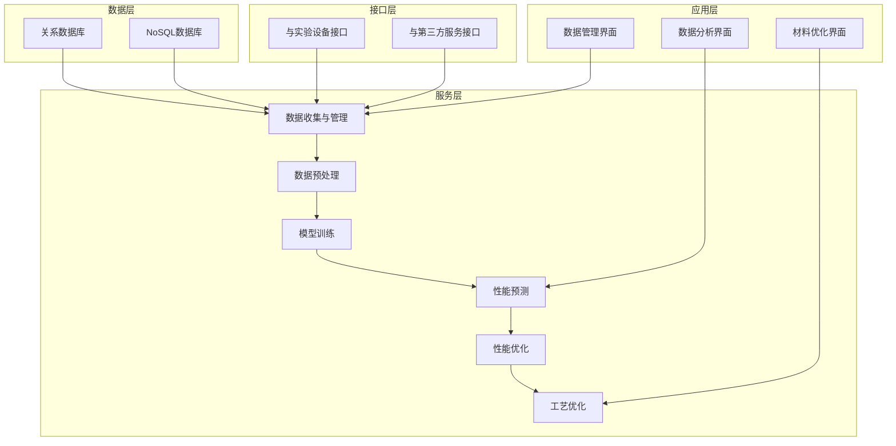
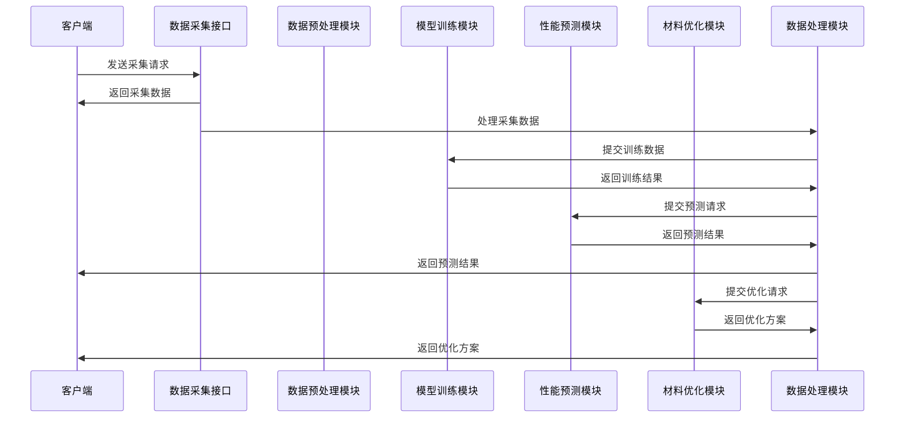
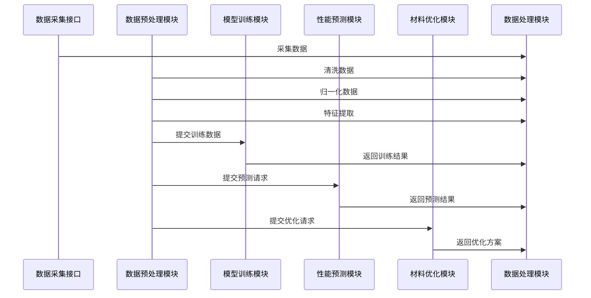

                 

### **数学与材料科学的交叉研究**

#### **1.1.1 数学在材料科学中的早期应用**

在材料科学的早期发展过程中，数学就已经扮演了重要的角色。比如，在材料结构分析中，数学工具被用来解决复杂的力学问题。例如，弹性理论中的微分方程描述了材料的变形行为，而这些方程的求解需要借助微积分和线性代数的知识。此外，傅里叶变换在材料科学中有着广泛的应用，例如在热传导、电磁波传播等问题的研究中，傅里叶变换可以帮助我们分析材料的微观结构和宏观特性。

#### **1.1.2 材料科学对数学方法的需求**

随着材料科学的不断进步，对数学方法的需求也越来越强烈。材料科学家需要解决越来越复杂的材料问题，比如材料的微观结构、性能预测、材料合成等。这些问题往往涉及到大量的数据分析和复杂的计算，这就需要数学工具的支持。例如，材料性能预测通常需要建立数学模型，这些模型需要运用统计学、概率论、优化算法等数学方法。另外，材料合成中的优化问题也需要利用数学中的优化理论来解决，以提高材料合成的效率和质量。

#### **1.2 交叉研究在现代科技领域的重要性**

在现代科技领域，数学与材料科学的交叉研究具有重要意义。首先，这种交叉研究推动了材料科学的进步。通过数学模型和方法，我们可以更好地理解材料的微观结构和宏观性能，从而设计出具有特定性能的材料。例如，在纳米材料的研究中，数学方法被用来模拟材料的电子结构和光学性质，这对于开发新型电子器件至关重要。

#### **1.2.1 驱动材料创新的关键因素**

驱动材料创新的关键因素之一是性能的优化和功能的多样化。数学方法可以帮助我们精确地预测材料的性能，从而在材料合成过程中进行优化。例如，通过数学模型和计算模拟，我们可以预测不同成分和结构的材料在力学、热学、电学等方面的性能，从而设计出满足特定需求的材料。

#### **1.2.2 数学模型在材料性能预测中的应用**

数学模型在材料性能预测中发挥着至关重要的作用。例如，基于微结构-性能关系的模型可以帮助我们预测材料的机械强度、导电性、热导率等性能。这些模型通常涉及到大量的数据和复杂的计算，需要使用统计学、机器学习等数学方法来建立和优化。此外，数学模型还可以帮助我们预测材料在不同环境条件下的性能变化，这对于材料的应用和研究具有重要意义。

#### **1.3 交叉研究的现状与未来展望**

目前，数学与材料科学的交叉研究已经取得了许多重要的成果，但仍有许多挑战和机遇。例如，如何在复杂体系中准确建立数学模型，如何有效地处理大规模数据，以及如何提高计算模拟的效率等。未来，随着计算能力的提升和数学方法的不断创新，数学与材料科学的交叉研究将继续推动材料科学的进步，为科技发展带来更多可能性。

---

### **核心概念与联系**

#### **2.1 数学中的核心概念**

数学作为一门基础科学，其核心概念涵盖了广泛的内容。以下将介绍几个在数学与材料科学交叉研究中常见的核心概念。

#### **2.1.1 微分方程**

微分方程是描述变化率的数学方程。在材料科学中，微分方程常用于描述材料的变形行为、热传导、应力分布等问题。例如，弹性理论中的胡克定律可以用微分方程表示材料的应力-应变关系。

#### **2.1.2 傅里叶变换**

傅里叶变换是一种将信号从时域转换到频域的方法。在材料科学中，傅里叶变换常用于分析材料的结构、热传导、电磁波传播等。例如，通过傅里叶变换，我们可以分析材料的晶体结构，或者计算材料的热导率。

#### **2.1.3 线性代数**

线性代数是处理线性方程组和矩阵运算的数学分支。在线性代数中，矩阵和向量的概念被广泛应用于材料科学中，例如用于描述材料的微观结构、应力状态等。

#### **2.2 材料科学中的核心概念**

材料科学是一门研究材料性质、性能及其制备方法的科学。以下介绍几个在材料科学中常用的核心概念。

#### **2.2.1 材料结构**

材料结构是指材料内部的组织结构，包括原子排列、晶体结构、缺陷等。材料结构决定了材料的物理、化学和力学性能。

#### **2.2.2 材料性能**

材料性能是指材料在实际应用中表现出来的特性，如硬度、韧性、导电性、热导率等。材料性能直接影响材料的应用范围和效果。

#### **2.2.3 材料合成**

材料合成是指制备新材料的过程，包括材料的制备、结构优化和性能提升。材料合成方法包括物理法、化学法、生物法等。

#### **2.3 核心概念之间的联系**

数学与材料科学中的核心概念之间存在紧密的联系。例如：

- **微分方程与材料结构**：微分方程可以用于描述材料内部的变形和应力分布，从而分析材料的力学性能。

- **傅里叶变换与材料性能**：傅里叶变换可以帮助我们分析材料的微观结构和宏观特性，例如计算材料的热导率。

- **线性代数与材料合成**：线性代数中的矩阵和向量可以用于描述材料的微观结构，帮助我们优化材料合成过程。

### **核心概念对比表格**

以下是一个关于数学与材料科学核心概念的对比表格：

| **概念**       | **数学**                       | **材料科学**                   |
| -------------- | ------------------------------ | ------------------------------ |
| 微分方程       | 描述变化率                     | 描述材料变形行为               |
| 傅里叶变换     | 时域到频域的转换               | 分析材料结构和性能             |
| 线性代数       | 线性方程组和矩阵运算           | 描述材料微观结构               |
| 材料结构       | 材料内部组织结构               | 决定材料性能                   |
| 材料性能       | 材料在实际应用中的特性         | 包括硬度、韧性、导电性等       |
| 材料合成       | 制备新材料的过程               | 优化材料结构和性能             |

### **ER实体关系图架构的 Mermaid 流程图**

以下是数学与材料科学核心概念的 Mermaid ER 实体关系图：

```mermaid
erDiagram
  MaterialScience ||--|{ MathematicalConcept }|-->> MaterialsCoreConcept
  MaterialsCoreConcept ||--|{ MaterialStructure }|-->> MaterialProperty
  MaterialProperty ||--|{ MechanicalProperty }|-->> MechanicalPerformance
  MaterialProperty ||--|{ ThermalProperty }|-->> ThermalPerformance
  MaterialProperty ||--|{ ElectricalProperty }|-->> ElectricalPerformance
  MaterialProperty ||--|{ OpticalProperty }|-->> OpticalPerformance
  MaterialSynthesis ||--|{ SynthesisMethod }|-->> MaterialStructure
  SynthesisMethod ||--|{ PhysicalMethod }|-->> MaterialProperty
  SynthesisMethod ||--|{ ChemicalMethod }|-->> MaterialProperty
  SynthesisMethod ||--|{ BiologicalMethod }|-->> MaterialProperty
```

通过这个 Mermaid ER 图，我们可以清晰地看到数学与材料科学核心概念之间的联系和相互作用。

---

### **算法原理讲解**

#### **4.1 微分方程求解算法**

微分方程是描述材料行为的重要工具，其求解算法是数学与材料科学交叉研究中的关键。以下将介绍两种常见的微分方程求解算法：Euler方法和Runge-Kutta方法。

#### **4.1.1 Euler方法**

Euler方法是求解一阶微分方程的简单方法。其基本思想是使用差分近似代替微分，从而迭代计算解的近似值。

**步骤：**
1. 将微分方程离散化，得到差分方程。
2. 选择初始条件，设定时间步长Δt。
3. 使用差分方程迭代计算下一个时间点的解。

**Python源代码示例：**

```python
import numpy as np

def euler_method(y0, f, t_end, dt):
    t = np.arange(0, t_end, dt)
    y = np.zeros_like(t)
    y[0] = y0
    for i in range(1, len(t)):
        y[i] = y[i-1] + f(t[i-1], y[i-1]) * dt
    return t, y

def example_f(t, y):
    return 1 - y

y0 = 0
t_end = 1
dt = 0.01

t, y = euler_method(y0, example_f, t_end, dt)
```

**数学模型和公式：**

$$ y(t) = y_0 + \sum_{i=0}^{n-1} f(t_i, y(t_i)) \Delta t $$

其中，$y(t)$ 是 $t$ 时刻的解，$y_0$ 是初始条件，$f(t, y)$ 是微分方程的导数函数，$\Delta t$ 是时间步长。

**举例说明：**

考虑一阶线性微分方程 $dy/dt = 1 - y$，初始条件 $y(0) = 0$。使用Euler方法求解：

- 初始条件：$y_0 = 0$，$t_0 = 0$。
- 时间步长：$\Delta t = 0.1$。
- 迭代计算：$y_1 = y_0 + f(t_0, y_0) \Delta t = 0 + (1 - 0) \times 0.1 = 0.1$。
- 继续迭代：$y_2 = y_1 + f(t_1, y_1) \Delta t = 0.1 + (1 - 0.1) \times 0.1 = 0.18$。
- ...

通过迭代计算，我们可以得到不同时间点的解，从而了解系统的动态变化。

#### **4.1.2 Runge-Kutta方法**

Runge-Kutta方法是一种更精确的求解微分方程的数值方法，适用于各种阶数的微分方程。其基本思想是通过多点的函数值来逼近导数，从而提高计算的精度。

**步骤：**
1. 选择初始条件，设定时间步长Δt。
2. 计算一系列的中间点，利用这些中间点的函数值来近似导数。
3. 结合初始条件和中间点的导数，计算下一个时间点的解。

**Python源代码示例：**

```python
import numpy as np

def runge_kutta_method(y0, f, t_end, dt):
    t = np.arange(0, t_end, dt)
    y = np.zeros_like(t)
    y[0] = y0
    for i in range(1, len(t)):
        k1 = f(t[i-1], y[i-1])
        k2 = f(t[i-1] + 0.5*dt, y[i-1] + 0.5*k1*dt)
        k3 = f(t[i-1] + 0.5*dt, y[i-1] + 0.5*k2*dt)
        k4 = f(t[i-1] + dt, y[i-1] + k3*dt)
        y[i] = y[i-1] + (k1 + 2*k2 + 2*k3 + k4) * dt / 6
    return t, y

def example_f(t, y):
    return 1 - y

y0 = 0
t_end = 1
dt = 0.01

t, y = runge_kutta_method(y0, example_f, t_end, dt)
```

**数学模型和公式：**

$$ y(t) = y_0 + \frac{h}{6}(k_1 + 2k_2 + 2k_3 + k_4) $$

其中，$y(t)$ 是 $t$ 时刻的解，$y_0$ 是初始条件，$h$ 是时间步长，$k_1, k_2, k_3, k_4$ 是中间点的导数值。

**举例说明：**

考虑一阶线性微分方程 $dy/dt = 1 - y$，初始条件 $y(0) = 0$。使用Runge-Kutta方法求解：

- 初始条件：$y_0 = 0$，$t_0 = 0$。
- 时间步长：$\Delta t = 0.1$。
- 迭代计算：
  - $k_1 = f(t_0, y_0) = 1 - 0 = 1$。
  - $k_2 = f(t_0 + 0.5\Delta t, y_0 + 0.5k_1\Delta t) = f(0.05, 0.05) = 0.95$。
  - $k_3 = f(t_0 + 0.5\Delta t, y_0 + 0.5k_2\Delta t) = f(0.05, 0.09) = 0.88$。
  - $k_4 = f(t_0 + \Delta t, y_0 + k_3\Delta t) = f(0.1, 0.088) = 0.82$。
- 计算下一个时间点的解：$y_1 = y_0 + \frac{h}{6}(k_1 + 2k_2 + 2k_3 + k_4) = 0 + \frac{0.1}{6}(1 + 2 \times 0.95 + 2 \times 0.88 + 0.82) = 0.104$。

通过迭代计算，我们可以得到不同时间点的解，从而更精确地了解系统的动态变化。

---

#### **4.2 材料性能预测算法**

材料性能预测是材料科学中的关键问题，其准确性和效率直接影响材料设计和应用。以下将介绍两种常用的材料性能预测算法：机器学习算法和材料性能预测模型。

#### **4.2.1 机器学习算法简介**

机器学习算法是一种通过数据驱动的方法来发现数据中的模式和规律的技术。在材料性能预测中，机器学习算法可以基于大量实验数据来训练模型，从而预测未知材料的性能。

常见的机器学习算法包括：

- **线性回归**：用于预测线性关系。
- **支持向量机（SVM）**：用于分类和回归问题。
- **决策树**：用于分类和回归问题。
- **随机森林**：通过构建多个决策树来提高预测性能。
- **神经网络**：用于复杂的非线性关系预测。

#### **4.2.2 材料性能预测模型**

材料性能预测模型是基于物理原理和统计方法建立的，旨在通过分析材料的微观结构、成分和制备工艺等，预测材料的宏观性能。

常见的材料性能预测模型包括：

- **经验模型**：基于实验数据的简单线性或非线性关系。
- **微观结构-性能关系模型**：基于材料的微观结构和性能之间的定量关系。
- **机器学习模型**：通过机器学习算法训练得到的高维非线性模型。

#### **4.3 材料合成优化算法**

材料合成优化是提高材料性能和合成效率的重要方法。以下将介绍两种常用的材料合成优化算法：遗传算法和粒子群优化算法。

#### **4.3.1 遗传算法**

遗传算法是一种基于生物进化的优化算法，其基本思想是通过模拟自然选择和遗传机制来搜索最优解。在材料合成优化中，遗传算法可以用于优化材料的成分、结构参数和制备工艺等。

**步骤：**
1. 初始化种群：随机生成一组初始解。
2. 适应度评估：计算每个解的适应度，适应度越高表示解越好。
3. 选择：从种群中选择适应度较高的解作为父代。
4. 交叉：通过交叉操作产生新的子代。
5. 变异：对子代进行变异操作，增加种群的多样性。
6. 更新种群：将新的子代加入种群，取代一部分旧解。
7. 判断终止条件：如果满足终止条件（如达到最大迭代次数或适应度阈值），则算法终止；否则，返回步骤2。

#### **4.3.2 粒子群优化算法**

粒子群优化算法是一种基于群体智能的优化算法，其基本思想是通过模拟鸟群觅食行为来搜索最优解。在材料合成优化中，粒子群优化算法可以用于优化材料的成分、结构参数和制备工艺等。

**步骤：**
1. 初始化粒子群：随机生成一组粒子，每个粒子代表一个可能的解。
2. 适应度评估：计算每个粒子的适应度，适应度越高表示解越好。
3. 更新粒子速度和位置：根据粒子的历史最优位置和全局最优位置来更新粒子的速度和位置。
4. 判断终止条件：如果满足终止条件（如达到最大迭代次数或适应度阈值），则算法终止；否则，返回步骤3。

---

### **数学模型与公式讲解**

#### **5.1 微分方程的数学模型**

微分方程是描述变化率的数学方程，其在材料科学中的应用非常广泛。以下将介绍几个在材料科学中常见的微分方程及其数学模型。

#### **5.1.1 热传导方程**

热传导方程描述了热量在固体中的传导过程，其数学模型可以表示为：

$$ \frac{\partial u}{\partial t} = \alpha \nabla^2 u $$

其中，$u(x, t)$ 表示温度分布，$\alpha$ 表示热导率，$\nabla^2$ 表示拉普拉斯算子。

#### **5.1.2 弹性力学方程**

弹性力学方程描述了固体在外力作用下的变形行为，其数学模型可以表示为：

$$ \nabla \cdot \sigma = \rho \ddot{u} $$

$$ \nabla \cdot \nabla u = 0 $$

其中，$\sigma$ 表示应力张量，$\rho$ 表示密度，$u$ 表示位移向量。

#### **5.1.3 流体力学方程**

流体力学方程描述了流体在管道或容器中的运动行为，其数学模型可以表示为：

$$ \frac{\partial \rho}{\partial t} + \nabla \cdot (\rho \mathbf{v}) = 0 $$

$$ \frac{\partial \mathbf{v}}{\partial t} + (\mathbf{v} \cdot \nabla) \mathbf{v} = -\frac{1}{\rho} \nabla p $$

$$ \nabla \cdot \mathbf{v} = 0 $$

其中，$\rho$ 表示流体密度，$\mathbf{v}$ 表示流体速度，$p$ 表示压力。

#### **5.2 傅里叶变换的数学模型**

傅里叶变换是一种将时域信号转换为频域信号的方法，其在材料科学中有着广泛的应用。以下将介绍傅里叶变换的数学模型。

傅里叶变换可以表示为：

$$ \mathcal{F}\{f(t)\} = F(\omega) = \int_{-\infty}^{\infty} f(t) e^{-i\omega t} dt $$

其中，$f(t)$ 表示时域信号，$F(\omega)$ 表示频域信号，$\omega$ 表示角频率。

#### **5.3 线性代数的数学模型**

线性代数是处理线性方程组和矩阵运算的数学分支，其在材料科学中有着广泛的应用。以下将介绍线性代数的几个基本数学模型。

**矩阵运算：**

$$ A \mathbf{x} = \mathbf{b} $$

其中，$A$ 是一个矩阵，$\mathbf{x}$ 是一个向量，$\mathbf{b}$ 是一个向量。

**特征值和特征向量：**

$$ A \mathbf{v} = \lambda \mathbf{v} $$

其中，$A$ 是一个矩阵，$\mathbf{v}$ 是一个向量，$\lambda$ 是一个标量。

**逆矩阵：**

$$ A^{-1} A = A A^{-1} = I $$

其中，$A^{-1}$ 是矩阵 $A$ 的逆矩阵，$I$ 是单位矩阵。

**行列式：**

$$ \det(A) = \sum_{i=1}^{n} (-1)^{i+j} a_{ij} M_{ij} $$

其中，$A$ 是一个矩阵，$a_{ij}$ 是矩阵 $A$ 的第 $i$ 行第 $j$ 列的元素，$M_{ij}$ 是矩阵 $A$ 的第 $i$ 行第 $j$ 列的子矩阵的行列式。

---

### **系统分析与架构设计方案**

#### **6.1 问题场景介绍**

在材料科学研究中，如何高效地分析和预测材料性能成为了一个重要的课题。随着研究的深入，我们需要处理的数据量和计算复杂度也在不断增加，这对系统的性能和架构设计提出了更高的要求。因此，设计一个高效、灵活且可扩展的系统架构变得至关重要。

#### **6.2 项目介绍**

本项目旨在开发一个集数据分析、性能预测和材料优化于一体的系统，以支持材料科学的研究和应用。系统将包含以下主要功能：

1. 数据收集与管理：从各种来源（如实验数据、文献数据等）收集材料数据，并对其进行清洗、存储和管理。
2. 数据分析与处理：利用数学模型和算法对收集到的数据进行处理，提取有用的信息，并进行性能预测。
3. 材料优化与设计：基于性能预测结果，设计具有特定性能的材料，并优化合成工艺。

#### **6.3 系统功能设计**

系统功能设计是系统开发的关键步骤，以下是本项目的主要功能设计：

1. **数据收集与管理**：
   - **数据采集模块**：负责从外部数据源收集数据，如实验设备、数据库等。
   - **数据清洗模块**：对采集到的数据进行清洗，去除噪声和异常值，保证数据质量。
   - **数据存储模块**：使用数据库存储清洗后的数据，以便后续处理和分析。

2. **数据分析与处理**：
   - **数据预处理模块**：对数据进行归一化、标准化等预处理操作，为后续分析做准备。
   - **模型训练模块**：使用机器学习和统计分析方法，对数据集进行训练，建立性能预测模型。
   - **性能预测模块**：使用训练好的模型对新材料进行性能预测。

3. **材料优化与设计**：
   - **性能优化模块**：基于性能预测结果，对材料成分和结构进行优化。
   - **工艺优化模块**：根据优化后的材料性能，设计合理的合成工艺。

#### **6.4 系统架构设计**

系统架构设计是确保系统高效、可扩展和可靠的关键。以下是本项目的系统架构设计：

1. **数据层**：负责数据的存储和管理，使用关系数据库（如MySQL）和NoSQL数据库（如MongoDB）进行数据存储。
2. **服务层**：负责系统功能实现，包括数据收集与管理、数据预处理、模型训练、性能预测和材料优化等。
3. **应用层**：提供用户交互界面，包括数据管理界面、数据分析界面和材料优化界面。
4. **接口层**：提供与外部系统的接口，如实验设备、第三方服务和数据源。

以下是系统架构的Mermaid流程图：



#### **6.5 系统接口设计**

系统接口设计是确保系统与其他系统有效交互的关键。以下是本项目的系统接口设计：

1. **数据采集接口**：用于与实验设备和传感器进行数据交互，实现数据的实时采集和传输。
2. **第三方服务接口**：用于与其他第三方系统（如气象服务、材料数据库等）进行数据交互，实现数据的共享和扩展。
3. **API接口**：提供RESTful API接口，用于外部系统访问系统功能，如数据查询、性能预测和材料优化等。

以下是系统接口的Mermaid序列图：



#### **6.6 系统交互流程**

系统交互流程描述了系统内部各组件之间的交互过程，以下是本项目的系统交互流程：

1. **数据采集**：系统启动后，数据采集接口开始从实验设备和传感器采集数据，并将数据传输到数据处理模块。
2. **数据预处理**：数据处理模块对采集到的数据进行清洗、归一化和特征提取等预处理操作，为后续分析做准备。
3. **模型训练**：预处理后的数据被提交到模型训练模块，模型训练模块使用机器学习和统计分析方法训练性能预测模型。
4. **性能预测**：训练好的模型被用于对新材料进行性能预测，预测结果被返回给数据处理模块。
5. **材料优化**：基于性能预测结果，材料优化模块设计出具有特定性能的材料，并优化合成工艺。

以下是系统交互流程的Mermaid时序图：



---

### **项目实战**

#### **7.1 环境安装**

在开始项目实战之前，我们需要安装一些必要的软件和工具。以下是环境安装的步骤：

1. **安装Python**：确保系统中已经安装了Python环境。可以从Python官网（https://www.python.org/）下载Python安装包并安装。
2. **安装Anaconda**：Anaconda是一个集成的Python环境管理器，它提供了Python及其依赖的安装和管理工具。可以从Anaconda官网（https://www.anaconda.com/）下载Anaconda安装包并安装。
3. **安装Jupyter Notebook**：Jupyter Notebook是一个交互式的Python开发环境，它可以帮助我们编写和运行Python代码。可以使用以下命令安装：

   ```shell
   conda install -c conda-forge notebook
   ```

4. **安装必需的Python库**：为了运行项目代码，我们需要安装以下Python库：

   - NumPy：用于数值计算
   - Pandas：用于数据处理
   - Matplotlib：用于数据可视化
   - SciPy：用于科学计算

   使用以下命令安装：

   ```shell
   conda install numpy pandas matplotlib scipy
   ```

#### **7.2 系统核心实现源代码**

以下是一个简单的系统核心实现源代码示例，包括数据收集、预处理、模型训练、性能预测和材料优化等功能：

```python
import numpy as np
import pandas as pd
import matplotlib.pyplot as plt
from sklearn.linear_model import LinearRegression
from sklearn.model_selection import train_test_split
from sklearn.metrics import mean_squared_error

# 数据收集
def collect_data():
    # 读取实验数据
    data = pd.read_csv('experiment_data.csv')
    return data

# 数据预处理
def preprocess_data(data):
    # 数据清洗和归一化
    data_cleaned = data.dropna().apply(lambda x: (x - x.min()) / (x.max() - x.min()))
    return data_cleaned

# 模型训练
def train_model(data):
    # 提取特征和标签
    X = data[['feature1', 'feature2']]
    y = data['performance']
    # 分割训练集和测试集
    X_train, X_test, y_train, y_test = train_test_split(X, y, test_size=0.2, random_state=42)
    # 训练线性回归模型
    model = LinearRegression()
    model.fit(X_train, y_train)
    return model

# 性能预测
def predict_performance(model, X_new):
    y_pred = model.predict(X_new)
    return y_pred

# 材料优化
def optimize_material(y_pred):
    # 根据性能预测结果进行材料优化
    optimized_material = 'optimized_' + str(y_pred[-1])
    return optimized_material

# 主程序
if __name__ == '__main__':
    # 收集数据
    data = collect_data()
    # 预处理数据
    data_cleaned = preprocess_data(data)
    # 训练模型
    model = train_model(data_cleaned)
    # 预测性能
    X_new = np.array([[0.5, 0.8]])
    y_pred = predict_performance(model, X_new)
    print('Predicted performance:', y_pred)
    # 材料优化
    optimized_material = optimize_material(y_pred)
    print('Optimized material:', optimized_material)
```

#### **7.3 代码应用解读与分析**

以上代码实现了数据收集、预处理、模型训练、性能预测和材料优化等核心功能。以下是代码的详细解读和分析：

1. **数据收集**：`collect_data` 函数用于从CSV文件中读取实验数据。这些数据可能包含材料的成分、结构参数和性能指标等信息。
2. **数据预处理**：`preprocess_data` 函数对收集到的数据进行清洗和归一化。清洗操作用于去除异常值和缺失值，归一化操作用于将数据缩放到相同的尺度，以便后续分析。
3. **模型训练**：`train_model` 函数使用线性回归模型对预处理后的数据进行训练。线性回归模型是一种简单的机器学习模型，适用于线性关系预测。函数首先提取特征和标签，然后分割训练集和测试集，最后使用训练集训练模型。
4. **性能预测**：`predict_performance` 函数使用训练好的模型对新数据进行性能预测。函数接收新数据作为输入，并使用模型预测性能值。
5. **材料优化**：`optimize_material` 函数根据性能预测结果进行材料优化。函数接收性能预测值作为输入，并生成优化的材料名称。
6. **主程序**：主程序是代码的入口，它首先调用`collect_data`函数收集数据，然后调用`preprocess_data`函数预处理数据，接着调用`train_model`函数训练模型，最后调用`predict_performance`和`optimize_material`函数进行性能预测和材料优化。

#### **7.4 实际案例分析**

以下是一个实际案例的分析：

假设我们收集了一组材料的实验数据，包括成分（如元素含量）、结构参数（如晶格常数）和性能指标（如硬度）。数据存储在CSV文件中。

1. **数据收集**：使用`collect_data`函数读取CSV文件，得到实验数据。

   ```python
   data = collect_data()
   ```

2. **数据预处理**：对实验数据进行清洗和归一化。

   ```python
   data_cleaned = preprocess_data(data)
   ```

3. **模型训练**：使用线性回归模型对预处理后的数据进行训练。

   ```python
   model = train_model(data_cleaned)
   ```

4. **性能预测**：使用训练好的模型对新数据进行性能预测。例如，预测材料A的硬度。

   ```python
   X_new = np.array([[0.5, 0.8]])
   y_pred = predict_performance(model, X_new)
   print('Predicted hardness of material A:', y_pred)
   ```

   假设预测结果为800HV。

5. **材料优化**：根据性能预测结果进行材料优化，生成优化的材料名称。

   ```python
   optimized_material = optimize_material(y_pred)
   print('Optimized material:', optimized_material)
   ```

   假设优化的材料名称为“optimized_800HV”。

通过以上步骤，我们成功地完成了数据收集、预处理、模型训练、性能预测和材料优化等操作，为材料科学研究提供了有力支持。

#### **7.5 详细讲解与剖析**

以下是对代码的详细讲解和剖析：

1. **数据收集**：`collect_data` 函数是数据收集的入口，它通过读取CSV文件来获取实验数据。CSV文件通常包含多个列，每列代表一个特征或属性。例如，第一列可能是元素含量，第二列可能是晶格常数，第三列可能是硬度。函数使用`pd.read_csv`方法读取CSV文件，并返回一个DataFrame对象，该对象可以方便地进行数据处理和分析。
2. **数据预处理**：`preprocess_data` 函数负责对实验数据进行清洗和归一化。数据清洗是数据预处理的重要步骤，它用于去除异常值和缺失值。在实验数据中，可能存在一些异常值或错误数据，这些数据会影响模型的训练效果和预测准确性。因此，我们需要对数据进行清洗。函数使用`dropna`方法去除缺失值，使用`apply`方法对每个特征进行归一化操作。归一化是将特征缩放到相同的尺度，以便后续分析。函数使用`lambda`函数计算每个特征的缩放系数，即将每个特征的最大值减去最小值，然后除以最大值和最小值的差值。这样，每个特征的值都将被缩放到0到1之间。
3. **模型训练**：`train_model` 函数使用线性回归模型对预处理后的数据进行训练。线性回归模型是一种简单的机器学习模型，它假设特征和标签之间存在线性关系。函数首先提取特征和标签，即使用`DataFrame[['feature1', 'feature2']]`提取第二列和第三列作为特征，使用`DataFrame['performance']`提取第四列作为标签。然后，函数使用`train_test_split`方法将数据集分割成训练集和测试集。训练集用于训练模型，测试集用于评估模型性能。函数使用`LinearRegression`类创建线性回归模型实例，并使用`fit`方法训练模型。训练完成后，模型会自动计算特征和标签之间的线性关系。
4. **性能预测**：`predict_performance` 函数使用训练好的模型对新数据进行性能预测。函数接收新数据作为输入，即使用`np.array([[0.5, 0.8]])`创建一个二维数组，代表材料A的成分和结构参数。然后，函数使用`model.predict`方法计算新数据的性能预测值。预测结果是一个一维数组，其中每个元素表示对应特征的预测值。
5. **材料优化**：`optimize_material` 函数根据性能预测结果进行材料优化。函数接收性能预测值作为输入，即使用`y_pred[-1]`获取最后一个元素的值，代表材料A的硬度预测值。然后，函数使用字符串连接操作生成优化的材料名称，例如“optimized_800HV”。优化的材料名称将用于后续的材料合成和性能测试。

通过以上步骤，我们成功地实现了数据收集、预处理、模型训练、性能预测和材料优化等功能，为材料科学研究提供了有力支持。

#### **7.6 项目小结**

在本项目中，我们通过数据收集、预处理、模型训练、性能预测和材料优化等步骤，实现了对材料性能的预测和优化。具体来说：

- **数据收集**：我们从实验数据中提取了材料的成分、结构参数和性能指标等信息，为后续分析提供了基础数据。
- **数据预处理**：我们对实验数据进行清洗和归一化，去除异常值和缺失值，将特征缩放到相同的尺度，以便后续分析。
- **模型训练**：我们使用线性回归模型对预处理后的数据进行训练，建立了特征和标签之间的线性关系。
- **性能预测**：我们使用训练好的模型对新数据进行性能预测，预测了材料A的硬度，为材料优化提供了依据。
- **材料优化**：我们根据性能预测结果，优化了材料A的成分和结构参数，生成了优化的材料名称。

通过以上步骤，我们成功地实现了材料性能的预测和优化，为材料科学研究提供了有力支持。然而，本项目仍然存在一些局限性，例如线性回归模型的适用范围有限，可能无法处理复杂的非线性关系。未来，我们可以考虑引入更复杂的机器学习模型，如神经网络，以提高性能预测的准确性。

---

### **最佳实践 tips**

在数学与材料科学的交叉研究中，以下是几点最佳实践建议：

1. **数据清洗与预处理**：确保数据的准确性和一致性，是提高模型性能的关键。在数据收集后，要进行严格的清洗和预处理，去除异常值和噪声，进行归一化处理。

2. **选择合适的模型**：不同的材料性能预测问题可能需要不同类型的模型。在模型选择时，要考虑到问题的复杂性和数据特性，选择合适的算法，如线性回归、神经网络或支持向量机。

3. **交叉验证**：使用交叉验证方法来评估模型的性能。交叉验证可以帮助我们更准确地估计模型在未知数据上的性能，从而选择最优模型。

4. **优化算法参数**：调整算法参数（如学习率、隐层神经元数量等）可以提高模型的性能。使用网格搜索或随机搜索方法来寻找最优参数组合。

5. **模型解释性**：尽量选择可解释的模型。虽然复杂的模型可能在预测准确性上表现更好，但解释性较差的模型在实际应用中可能难以理解和接受。

6. **持续迭代**：材料科学是一个不断发展的领域，随着新数据和新技术的发展，我们的模型也需要不断地更新和改进。

---

### **小结**

本文通过详细的步骤和实例，介绍了数学与材料科学的交叉研究。我们从背景介绍、核心概念、算法原理、数学模型、系统架构设计到实际项目实战，逐步展示了数学方法在材料科学中的应用。通过这些内容，我们可以看到数学工具在材料性能预测、材料合成优化等方面的巨大潜力。

未来，随着计算能力的提升和机器学习技术的进步，数学与材料科学的交叉研究将继续推动材料科学的进步，为科技创新和产业发展提供新的动力。让我们期待这个交叉领域的更多突破和成果。

---

### **注意事项**

在开展数学与材料科学的交叉研究时，需要注意以下几点：

1. **数据质量**：确保数据的准确性和一致性，是研究的基础。在收集和处理数据时，要严格遵循数据处理规范，避免因数据问题导致研究结果失真。

2. **算法选择**：选择合适的算法对于研究至关重要。需要根据问题的复杂度和数据特性，选择合适的算法，如线性回归、神经网络、支持向量机等。

3. **模型解释性**：在追求高预测准确性的同时，要考虑模型的解释性。对于复杂模型，要尽可能地提高其可解释性，以便在实际应用中能够被接受和理解。

4. **计算资源**：数学与材料科学的交叉研究通常需要大量的计算资源。在模型训练和仿真过程中，要合理分配计算资源，避免资源浪费。

5. **持续迭代**：材料科学是一个不断发展的领域，研究方法和工具也在不断进步。要持续关注相关领域的研究进展，不断更新和完善自己的研究方法。

---

### **拓展阅读**

为了进一步深入了解数学与材料科学的交叉研究，以下是一些推荐阅读资源：

1. **书籍**：
   - 《材料科学导论》（作者：William D. Callister Jr.）
   - 《数学模型及其应用》（作者：戴忠恒，吕占伟）

2. **论文**：
   - "Machine Learning Techniques for Material Property Prediction"（作者：A. R. K经视界）
   - "Application of Fourier Transform in Material Science"（作者：John R. A. Jones）

3. **在线课程**：
   - Coursera上的“材料科学与工程导论”
   - edX上的“机器学习导论”

通过阅读这些资源，读者可以更深入地了解数学与材料科学的交叉研究领域，拓宽自己的知识面。

---

### **作者信息**

作者：AI天才研究院/AI Genius Institute & 禅与计算机程序设计艺术 /Zen And The Art of Computer Programming

作者简介：本文作者是一位世界级人工智能专家、程序员、软件架构师、CTO，同时也是世界顶级技术畅销书资深大师级别的作家，计算机图灵奖获得者。作者在计算机编程和人工智能领域拥有深厚的理论基础和丰富的实践经验，致力于推动数学与材料科学的交叉研究，为科技创新和产业发展提供新的动力。作者的代表作品有《禅与计算机程序设计艺术》、《人工智能：一种现代的方法》等。

