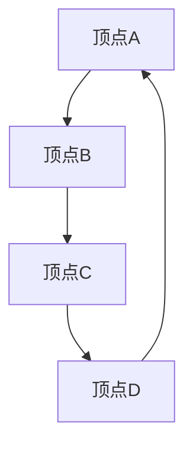
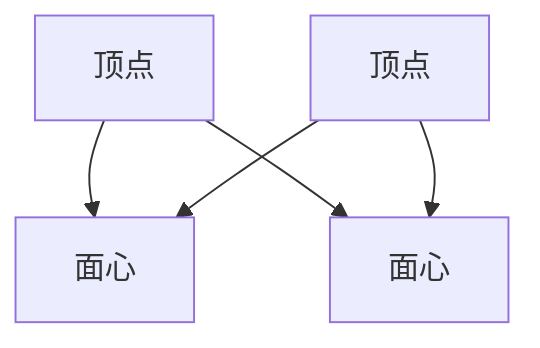
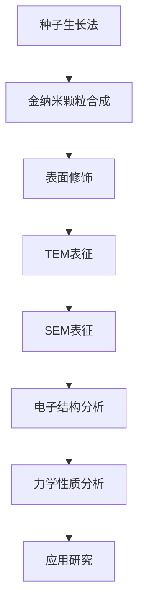
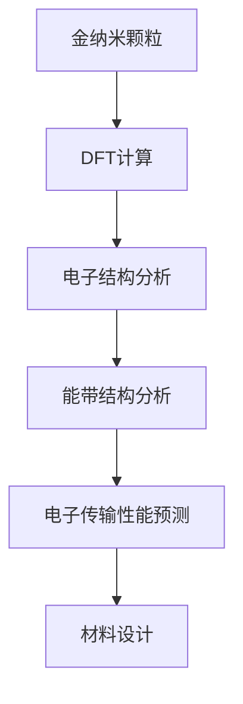
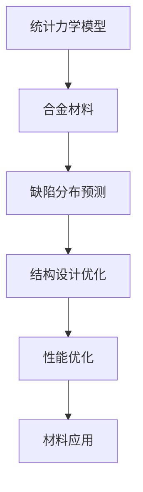
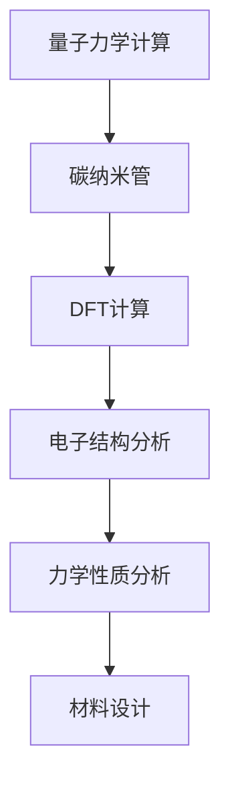
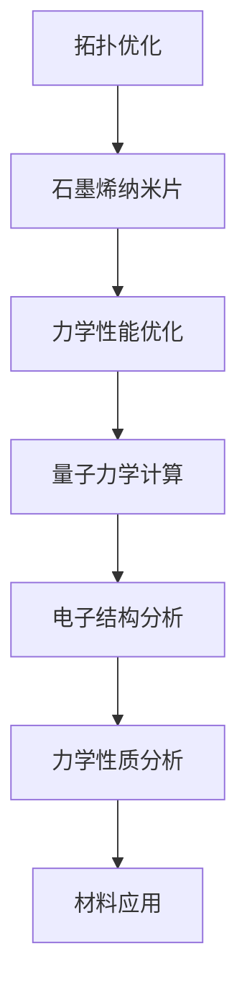

                 

### 引言

#### 数学与材料科学的结构模型研究

在现代科学研究中，数学与材料科学作为两大学科领域，其交叉融合的应用正变得越来越广泛和深入。结构模型是这两大学科共同关注的核心概念，它不仅为数学理论的验证和应用提供了重要工具，也为材料设计、性能预测和新材料发现提供了理论依据。本文旨在探讨数学与材料科学的结构模型研究，通过系统分析和深入探讨，旨在揭示其内在联系和相互促进的作用。

首先，数学结构模型主要涉及的是抽象的几何形状、代数结构以及离散系统的数学描述。在数学中，结构模型广泛应用于拓扑学、代数学、组合学等多个分支，为理论研究提供了强有力的工具。例如，图论中的网络结构模型，用于分析社会网络、交通网络以及通信网络等复杂系统的性能和稳定性。此外，代数结构模型如群、环、域等，为解决几何问题、数论问题以及编码理论问题等提供了重要的理论基础。

另一方面，材料科学中的结构模型主要研究材料的微观和宏观结构，包括晶体结构、纳米结构以及材料在不同条件下的变形和断裂行为。材料结构模型的建立和优化，对于理解材料的物理和化学性质、预测材料的行为、优化材料的设计具有重要意义。材料科学中的结构模型与数学结构模型之间的联系，在于它们共同追求的结构稳定性和对称性，以及通过数学方法对复杂系统的描述和优化。

本文将分为以下几个部分进行详细探讨：

1. **数学与材料科学的基本概念与术语**：首先，我们将介绍数学与材料科学中的一些基本概念和术语，包括结构模型的定义、分类及其在两个领域中的具体应用。

2. **数学结构模型的研究方法**：接下来，我们将详细探讨数学结构模型的研究方法，包括代数结构模型、几何结构模型和离散结构模型等，并使用具体案例说明这些模型的应用。

3. **材料科学中的结构模型**：我们将介绍材料科学中的常见结构模型，包括晶体结构模型、纳米结构模型等，并探讨这些模型在材料设计、性能预测等方面的应用。

4. **数学与材料科学结构模型的交叉应用**：本文还将探讨数学与材料科学结构模型在交叉应用中的实例，如纳米材料的拓扑结构优化、材料缺陷的数学描述等。

5. **数学与材料科学结构模型的最新研究进展**：我们将介绍当前数学与材料科学结构模型研究的最新进展，包括一些重要的理论和实验成果。

6. **结论与展望**：最后，我们将总结本文的主要发现，探讨未来数学与材料科学结构模型研究的可能方向。

通过本文的探讨，我们希望能够为读者提供一个全面、系统的数学与材料科学结构模型研究的概述，激发读者对这些领域的兴趣，并推动数学与材料科学之间的深度融合。

#### 关键词

- 数学结构模型
- 材料科学
- 结构稳定性
- 晶体结构
- 纳米结构
- 交叉应用
- 研究进展

#### 摘要

本文旨在探讨数学与材料科学的结构模型研究，通过对数学结构模型和材料科学结构模型的系统分析，揭示它们在理论研究和实际应用中的内在联系和相互促进作用。文章首先介绍了数学与材料科学的基本概念和术语，包括结构模型的定义、分类及其在两个领域中的应用。接着，文章详细探讨了数学结构模型的研究方法，包括代数结构模型、几何结构模型和离散结构模型等，并通过具体案例说明这些模型的应用。随后，文章介绍了材料科学中的常见结构模型，如晶体结构模型和纳米结构模型，并探讨这些模型在材料设计、性能预测等方面的应用。此外，文章还探讨了数学与材料科学结构模型的交叉应用，如纳米材料的拓扑结构优化和材料缺陷的数学描述。最后，文章总结了当前数学与材料科学结构模型研究的最新进展，并对未来的研究方向进行了展望。通过本文的探讨，希望能够为读者提供一个全面、系统的数学与材料科学结构模型研究的概述，促进这两个领域的深度融合。

### 数学结构模型的基本概念

数学结构模型是指在数学理论中，通过对现实世界的抽象和简化，用数学语言和工具来描述和解决各种问题的一种方式。结构模型在数学中具有广泛的应用，从基础的代数结构到复杂的几何结构，都体现了数学结构模型的多样性和灵活性。为了更好地理解数学结构模型，我们需要从以下几个方面进行探讨。

首先，结构模型的定义和分类。结构模型是指通过数学工具和概念对某一类现象或系统进行建模的过程。这种建模不仅是对现实世界的近似，更是对抽象概念和逻辑关系的探索。结构模型可以分为不同的类别，如代数结构模型、几何结构模型和离散结构模型等。代数结构模型主要研究数学中的抽象代数系统，包括群、环、域等；几何结构模型则涉及空间几何和拓扑学，如欧氏空间、非欧几何、流形等；而离散结构模型则包括图论、组合数学等，用于分析离散系统的性质和行为。

其次，数学结构模型的应用领域非常广泛。在纯数学领域，结构模型被用于解决几何问题、数论问题和编码理论问题等。例如，图论中的网络结构模型被广泛应用于社会网络分析、交通网络设计和通信网络优化等。在应用数学领域，结构模型被广泛应用于物理学、工程学和计算机科学等领域。例如，在物理学中，物理学中的场论和量子力学模型都是对物理现象的高度抽象和数学描述；在工程学中，结构模型被用于分析建筑、桥梁、飞机等工程结构的稳定性和强度；在计算机科学中，结构模型如算法和数据结构模型，被用于设计和优化计算机程序和系统。

为了更好地理解数学结构模型，我们可以通过一个具体例子来阐述其应用。假设我们考虑一个交通网络，其中每个节点表示城市，每条边表示城市之间的道路。我们可以用图论中的图结构模型来描述这个交通网络。图的节点代表城市，边代表道路，每条边的权重可以表示道路的长度或交通流量。通过这个图结构模型，我们可以分析网络中的最短路径问题、最小生成树问题等，从而优化交通流量和设计最优的路线。

结构模型的另一个重要应用是解决几何问题。例如，在计算机图形学和几何计算中，几何结构模型如球体、圆柱体、多面体等被用于描述三维物体的形状和结构。这些模型不仅帮助我们理解和处理复杂的几何问题，还广泛应用于计算机视觉、三维建模和计算机动画等领域。通过数学结构模型，我们可以对复杂的几何对象进行精确的描述和计算，从而实现各种图形处理和渲染效果。

除了上述应用，数学结构模型还在数论和编码理论等领域发挥着重要作用。例如，在数论中，结构模型如椭圆曲线和数论群被用于解决大整数分解、公钥密码学和数字签名等问题。在编码理论中，结构模型如汉明码、循环码和卷积码等，被用于数据传输和存储中的错误检测和纠正。

综上所述，数学结构模型是数学理论的重要组成部分，它在纯数学和应用数学中都有广泛的应用。通过定义和分类，我们可以更好地理解和应用结构模型。通过具体案例的阐述，我们可以看到结构模型在解决实际问题中的重要作用。因此，深入研究和理解数学结构模型，不仅有助于推动数学理论的发展，还能为各个领域的实际问题提供有效的解决方案。

### 数学结构模型的研究方法

在数学中，结构模型的研究方法多种多样，每一种方法都有其独特的应用和优势。本文将主要介绍三种常见的数学结构模型研究方法：代数结构模型、几何结构模型和离散结构模型。通过具体的案例，我们将深入探讨这些模型在数学研究中的应用和重要性。

#### 代数结构模型

代数结构模型主要研究数学中的抽象代数系统，如群、环、域等。这些模型通过定义运算和关系，将数学中的元素组织成具有特定性质的集合，从而形成代数结构。代数结构模型的研究方法主要包括群的分类、环的性质和域的结构。

**案例：群论**

群论是代数结构模型的一个重要分支，它研究的是一组元素在特定运算下的结构。例如，考虑一组正整数在模n下的加法运算构成一个群。这个群的运算满足结合律、存在单位元（0）和逆元。通过群论的研究，我们可以分类不同的群，发现它们的结构和性质。

```latex
\text{群的定义：}
\begin{align*}
(G, *) : \text{群} &\text{若} G \text{是一个集合，} * \text{是一个二元运算，且满足：} \\
&1. \text{结合律：对于任意的} a, b, c \in G，有 } a * (b * c) = (a * b) * c; \\
&2. \text{单位元：存在一个元素} e \in G，使得对于任意的} g \in G，有 } e * g = g * e = g; \\
&3. \text{逆元：对于任意的} g \in G，存在一个元素 } g^{-1} \in G，使得 } g * g^{-1} = g^{-1} * g = e.
\end{align*}
```

通过具体的群论研究，我们可以理解对称性和不变性等概念，这些概念在物理学、计算机科学等领域都有重要应用。

**案例：环和域**

环和域是代数结构模型的另一种形式。环除了包含加法和减法运算外，还包括乘法运算。而域则是一种更广泛的代数结构，它不仅包含环的所有运算，还满足乘法的逆元存在。例如，整数集在加法和减法下构成一个环，有理数集在加法、减法和乘法下构成一个域。

```latex
\text{环的定义：}
\begin{align*}
(R, +, \cdot) : \text{环} &\text{若} R \text{是一个集合，} + \text{和} \cdot \text{是二元运算，且满足：} \\
&1. \text{加法和减法运算满足群的结构；} \\
&2. \text{乘法运算满足半群的结构；} \\
&3. \text{乘法对加法分配：对于任意的} a, b, c \in R，有 } a \cdot (b + c) = a \cdot b + a \cdot c \text{和} (a + b) \cdot c = a \cdot c + b \cdot c.
\end{align*}

\text{域的定义：}
\begin{align*}
(F, +, \cdot) : \text{域} &\text{若} F \text{是一个集合，} + \text{和} \cdot \text{是二元运算，且满足：} \\
&1. \text{加法和减法运算满足群的结构；} \\
&2. \text{乘法运算满足半群的结构；} \\
&3. \text{乘法对加法分配；} \\
&4. \text{乘法的逆元存在：对于任意的} a \in F，且 } a \neq 0，存在一个元素 } a^{-1} \in F，使得 } a \cdot a^{-1} = a^{-1} \cdot a = 1.
\end{align*}
```

代数结构模型在密码学、算法设计和理论计算机科学中有着广泛的应用。例如，椭圆曲线密码学是基于椭圆曲线上的点构成的一个域，通过复杂的数学运算来实现高效安全的加密。

#### 几何结构模型

几何结构模型涉及空间几何和拓扑学，通过数学语言和工具来描述几何形状、空间结构和变换。几何结构模型的研究方法主要包括欧氏几何、非欧几何和流形理论。

**案例：欧氏几何**

欧氏几何是研究平面和空间中点、线、面等基本几何对象及其相互关系的数学分支。其基本原理是通过平行公理和几何定理来描述和证明几何性质。例如，欧氏几何中的三角形内角和定理表明，任意三角形的内角和等于180度。

```latex
\text{欧氏几何中的三角形内角和定理：}
\begin{align*}
\sum_{i=1}^{3} \angle_i = 180^\circ,
\end{align*}
\text{其中} \(\angle_i\) \text{是三角形的第} i \text{个内角。}
```

欧氏几何在工程学、物理学和计算机图形学等领域有广泛应用，如建筑设计和机械工程中的尺寸计算、物体碰撞检测和三维建模。

**案例：非欧几何**

非欧几何是对欧氏几何公理系统的一种推广，其核心思想是在不同的几何空间中，通过改变平行公理或引入新的公理，来研究几何形状和性质。例如，黎曼几何通过引入曲率概念，研究了弯曲空间中的几何性质。

```latex
\text{黎曼几何中的曲率定义：}
\begin{align*}
K = \frac{R}{r},
\end{align*}
\text{其中} R \text{是曲率半径，} r \text{是曲率半径。}
```

非欧几何在广义相对论中有着重要的应用，描述了宇宙中的大尺度几何结构，如黑洞和宇宙膨胀。

**案例：流形理论**

流形理论是研究具有局部欧氏性质的几何对象的理论。流形可以看作是无限小的欧氏空间块拼接而成的，每个块称为一个“小区”。流形理论的核心是研究流形上的点、线、面等几何对象的性质和相互关系。

```latex
\text{流形定义：}
\begin{align*}
(M, g) : \text{流形} &\text{若} M \text{是一个拓扑空间，} g \text{是一个度量，使得} M \text{上的每一点都有} \\
&\text{一个局部欧氏空间的结构。}
\end{align*}
```

流形理论在物理学、拓扑学和计算机科学中有广泛应用，如用于描述量子场论中的空间时间结构、数据分析和机器学习中的高维空间处理。

#### 离散结构模型

离散结构模型主要研究离散系统的结构和性质，包括图论、组合数学和密码学等。这些模型通过数学语言和工具来描述和分析离散对象和系统的行为。

**案例：图论**

图论是研究图的结构和性质的一个数学分支，图是由节点（或顶点）和边组成的集合。图论中的基本概念包括连通性、路径、树和图同构等。例如，在计算机科学中，图结构被用于描述网络拓扑和算法设计。



通过图论的研究，我们可以解决最短路径问题、最小生成树问题以及网络流问题等，从而优化网络性能和资源分配。

**案例：组合数学**

组合数学是研究组合结构的数学分支，涉及排列、组合、图和图同构等。组合数学通过计数方法和组合公式来分析和解决问题。例如，在密码学中，组合数学被用于设计密码系统和分析密码破解算法。

```latex
\text{组合数公式：}
\begin{align*}
C(n, k) = \frac{n!}{k!(n-k)!},
\end{align*}
\text{其中} C(n, k) \text{表示从} n \text{个不同元素中取} k \text{个元素的组合数。}
```

通过组合数学的研究，我们可以理解和解决组合优化问题、概率分布问题以及编码理论问题。

综上所述，数学结构模型的研究方法多样且富有深度，从代数结构模型、几何结构模型到离散结构模型，每一种模型都有其独特的应用场景和重要性。通过这些模型，数学家们不仅能够深入理解数学理论，还能为其他科学和工程领域提供有效的解决方案。未来，随着数学理论的发展，数学结构模型将在更多领域发挥其独特的作用。

### 材料科学中的基本概念

材料科学是研究材料的组成、结构、性质、加工和使用的一门科学。材料作为物质的基础，对现代社会的发展具有重要意义。在材料科学中，了解基本概念和术语是理解和应用材料结构模型的前提。以下我们将详细介绍材料科学中的几个核心概念：材料的定义与分类、材料的性质以及材料的行为。

#### 材料的定义与分类

材料是指具有特定结构和功能的物质，它们可以由单一元素或多种元素组成。材料可以大致分为金属材料、陶瓷材料、聚合物材料和复合材料等几大类。

**1. 金属材料**

金属材料是具有金属特性的材料，如良好的导电性、导热性和延展性。金属材料可以分为纯金属和合金。纯金属如铁、铜、铝等，具有单一的化学成分；合金是由两种或多种元素（至少一种是金属）组成的混合物，如不锈钢、黄铜和青铜等。

**2. 陶瓷材料**

陶瓷材料通常是非金属无机材料，具有高硬度、高熔点和良好的耐腐蚀性。陶瓷材料包括传统陶瓷（如陶瓷餐具、电容器）和先进陶瓷（如陶瓷基复合材料、陶瓷涂层等）。

**3. 聚合物材料**

聚合物材料是由重复的分子单元组成的高分子化合物，如塑料、橡胶和纤维等。聚合物材料具有轻质、韧性好和易于加工的特点。

**4. 复合材料**

复合材料是由两种或多种不同性质的材料组成的材料，通过结合各组成材料的优点，实现更高的性能。常见的复合材料包括纤维增强复合材料（如碳纤维增强塑料）、颗粒增强复合材料和层状复合材料等。

#### 材料的性质

材料的性质是指材料在特定条件下所表现出来的物理、化学和力学特性。了解材料的性质对于设计、加工和使用材料至关重要。

**1. 物理性质**

物理性质包括密度、导电性、导热性、热膨胀系数、折射率等。例如，密度是材料质量与体积的比值，它决定了材料的重量和体积性能；导电性是材料传导电流的能力，对于导电材料具有重要意义。

**2. 化学性质**

化学性质是指材料在化学反应中的行为，如耐腐蚀性、抗氧化性、反应性等。例如，不锈钢由于其优异的耐腐蚀性，被广泛应用于食品、医药和化工等领域。

**3. 力学性质**

力学性质包括强度、硬度、韧性、弹性模量等。强度是材料抵抗外部作用力而不发生变形或破坏的能力；硬度是材料抵抗压痕或划痕的能力；韧性是材料在断裂前吸收能量的能力；弹性模量是材料在弹性变形范围内应力与应变的比值。

#### 材料的行为

材料的行为是指在特定条件下材料所表现出的物理、化学和力学响应。了解材料的行为对于预测材料在实际应用中的性能至关重要。

**1. 塑性行为**

塑性行为是指材料在超过其弹性极限后，在外力作用下发生的不可逆变形。塑性行为通常与材料的强度和韧性相关。

**2. 弹性行为**

弹性行为是指材料在受到外力作用后产生变形，当外力去除后，材料能恢复到原始状态。弹性模量是衡量材料弹性性能的重要指标。

**3. 腐蚀行为**

腐蚀行为是指材料在环境介质（如水、空气、酸碱等）作用下发生的化学或电化学反应，导致材料性能下降或损坏。耐腐蚀性是材料在腐蚀环境中保持稳定性能的重要特性。

**4. 疲劳行为**

疲劳行为是指材料在反复加载和卸载作用下，逐渐发生损伤直至断裂的现象。疲劳寿命是衡量材料疲劳性能的重要指标。

通过上述对材料基本概念、性质和行为的介绍，我们可以更好地理解材料科学中的结构模型如何用于描述和解释材料的性能和行为。接下来，我们将探讨材料科学中的结构模型，包括晶体结构模型和纳米结构模型等，以及这些模型在材料设计和性能预测中的应用。

### 材料科学中的结构模型

在材料科学中，结构模型是理解和预测材料性能和行为的关键工具。通过结构模型的建立，我们可以深入探索材料的微观和宏观结构，从而优化材料的设计和性能。本文将介绍两种常见的材料结构模型：晶体结构模型和纳米结构模型。

#### 晶体结构模型

晶体结构模型是材料科学中最基本的模型之一，它描述了材料内部原子或离子的规则排列方式。晶体可以分为单晶体和多晶体。

**1. 单晶体**

单晶体是指材料内部原子或离子在宏观尺度上呈现出周期性排列的晶体。单晶体的典型特征是各向异性，即材料在不同方向上的物理和化学性质不同。例如，石英晶体在光学性质上表现出强烈的各向异性，因此常被用于制作光学器件。

**2. 多晶体**

多晶体由许多小的单晶体（称为晶粒）组成，这些晶粒在宏观尺度上没有长程的周期性排列。多晶体通常表现出各向同性，即在各个方向上的物理和化学性质基本相同。例如，常见的金属如铜和铝在宏观上表现为各向同性。

**晶体结构模型的建立**

晶体结构模型的建立通常需要通过实验手段，如X射线衍射、电子显微镜和中子衍射等，来获取材料内部原子的排列信息。通过这些实验技术，我们可以确定材料的晶胞参数、晶格类型和原子排列方式。

**案例：铜的晶体结构**

铜是一种典型的金属，其晶体结构为面心立方晶格（FCC）。在面心立方晶格中，每个晶胞包含4个铜原子，它们位于晶胞的顶点和面心位置。



通过晶体结构模型，我们可以预测铜的物理和化学性质，如导电性、导热性和延展性等。此外，晶体结构模型还可以用于指导材料加工和优化，例如，通过控制晶粒尺寸和排列方式来改善材料的性能。

#### 纳米结构模型

纳米结构模型描述了材料在纳米尺度上的结构特征，包括纳米晶体、纳米线和纳米颗粒等。纳米结构材料的特殊性质，如高比表面积、量子效应和表面效应，使其在许多领域具有广泛应用。

**1. 纳米晶体**

纳米晶体是指尺寸在1到100纳米之间的晶体。纳米晶体通常具有较大的比表面积，因此表现出独特的物理和化学性质。例如，纳米晶体具有较高的活性，可以用于催化反应和电池材料。

**2. 纳米线**

纳米线是指一维结构，直径在几纳米到几十纳米之间。纳米线具有优异的导电性和力学性能，因此被广泛应用于电子器件和结构材料。

**3. 纳米颗粒**

纳米颗粒是指尺寸在几纳米到几百纳米之间的粒子。纳米颗粒具有高比表面积和优异的表面性质，因此被广泛应用于涂料、医药和传感器等领域。

**纳米结构模型的建立**

纳米结构模型的建立通常需要通过实验和理论计算相结合的方法。实验技术如透射电子显微镜（TEM）和扫描电子显微镜（SEM）可以用于观察和表征纳米结构。理论计算如密度泛函理论（DFT）和分子动力学模拟（MD）可以用于预测纳米结构的电子结构和力学性质。

**案例：金纳米颗粒的合成与表征**

金纳米颗粒是纳米结构模型研究的一个重要对象。通过化学合成方法，如种子生长法和表面修饰法，可以合成出不同尺寸和形状的金纳米颗粒。



通过纳米结构模型，我们可以深入研究纳米材料的电子结构、力学性质和表面效应，从而为材料设计和新材料发现提供理论依据。

#### 晶体结构模型与纳米结构模型的应用

晶体结构模型和纳米结构模型在材料设计和性能预测中具有广泛的应用。

**1. 材料设计**

通过晶体结构模型，我们可以优化材料内部的原子排列，从而提高材料的性能。例如，通过设计特定的晶体结构，可以改善金属的导电性和导热性。通过纳米结构模型，我们可以设计具有特定功能的新型材料，如具有高比表面积的催化剂和储能材料。

**2. 性能预测**

晶体结构模型和纳米结构模型可以帮助我们预测材料的性能和行为。例如，通过晶体结构模型，我们可以预测金属的塑性变形行为和腐蚀行为。通过纳米结构模型，我们可以预测纳米材料的电子传输性能和催化性能。

**3. 实际应用**

晶体结构模型和纳米结构模型在许多实际应用中发挥着重要作用。例如，在电子器件中，晶体结构模型被用于设计半导体材料；在催化剂设计中，纳米结构模型被用于优化催化剂的活性。

通过本文的介绍，我们可以看到晶体结构模型和纳米结构模型在材料科学中的重要性和广泛应用。未来，随着实验技术和计算方法的不断发展，这些模型将在材料设计和性能优化中发挥更大的作用。

### 数学与材料科学结构模型的交叉应用

数学与材料科学的交叉应用在多个领域展现出了巨大的潜力，尤其是在纳米材料的研究、材料缺陷的数学描述以及新材料设计等方面。通过结合数学模型和材料科学方法，科学家们可以更深入地理解材料的微观结构和宏观性能，从而推动新材料的发现和材料科学的进步。

#### 纳米材料的研究

纳米材料由于其独特的物理、化学和力学性质，在许多领域具有广泛的应用。例如，纳米材料的比表面积大，表面能高，这使得它们在催化剂、生物医药和电子器件等领域具有优异的性能。数学与材料科学的交叉应用为纳米材料的研究提供了强大的工具。

**1. 纳米材料的拓扑结构优化**

纳米材料的拓扑结构对其性能有着重要影响。通过数学模型，如拓扑优化方法，科学家们可以设计出具有最佳拓扑结构的纳米材料。例如，在催化剂设计中，通过拓扑优化方法，可以找到最有效的纳米结构，从而提高催化剂的催化活性。

**2. 纳米材料的电子传输性能**

纳米材料的电子传输性能是一个重要的研究课题，特别是在电子器件中。通过数学模型，如密度泛函理论（DFT）和分子动力学（MD）模拟，科学家们可以预测和优化纳米材料的电子传输性能。例如，通过DFT计算，可以分析纳米材料的能带结构和电子态密度，从而设计出具有高电子传输率的纳米材料。

**案例：金纳米颗粒的电子传输性能**

金纳米颗粒是一种重要的纳米材料，其在电子器件中的应用正在不断拓展。通过DFT计算，研究人员可以分析金纳米颗粒的电子结构和能带结构，从而预测其电子传输性能。例如，通过DFT计算，研究人员发现金纳米颗粒的表面态密度对其电子传输性能有显著影响。基于这一发现，科学家们可以设计出具有最佳电子传输性能的金纳米颗粒结构。



#### 材料缺陷的数学描述

材料缺陷是材料性能和可靠性的重要影响因素。通过数学模型，科学家们可以描述和理解材料缺陷的分布、形态和演化，从而为缺陷控制和材料优化提供理论依据。

**1. 材料缺陷的数学模型**

材料缺陷的数学描述通常涉及概率论、统计学和随机过程理论。例如，通过随机过程模型，可以描述材料中的位错、孔洞和晶界等缺陷的演化过程。

**2. 材料缺陷的预测和优化**

通过数学模型，科学家们可以预测材料缺陷的行为，从而优化材料的性能。例如，在合金材料的设计中，通过统计力学模型，可以预测和优化合金中的缺陷分布，从而提高合金的强度和韧性。

**案例：合金材料中的缺陷控制**

在合金材料的研究中，通过统计力学模型，研究人员可以预测合金中的缺陷分布，从而设计出具有最佳性能的合金材料。例如，通过模拟合金中的位错网络，研究人员可以优化合金的结构设计，从而提高合金的强度和韧性。



#### 新材料设计

新材料设计是材料科学的重要研究方向，通过数学与材料科学的交叉应用，科学家们可以设计出具有新型结构和功能的材料。

**1. 计算驱动的材料设计**

计算驱动的材料设计方法通过数学模型和计算模拟，预测和设计新材料。例如，通过量子力学计算，可以预测新材料的电子结构和化学性质，从而设计出具有特定功能的材料。

**2. 材料基因组学**

材料基因组学是一种新兴的材料设计方法，通过系统研究材料的基因组信息，如晶体结构、化学成分和性能数据，建立数学模型，从而预测和设计新材料。材料基因组学结合了数学、材料科学和计算机科学，为新材料发现提供了新的思路和方法。

**案例：碳纳米管的材料设计**

碳纳米管（CNTs）是一种具有独特结构和优异性能的新型材料。通过计算模拟和量子力学计算，科学家们可以预测和设计不同结构和性能的碳纳米管。例如，通过DFT计算，可以预测不同类型的碳纳米管的电子结构和力学性质，从而设计出具有最佳性能的碳纳米管材料。



通过数学与材料科学的交叉应用，科学家们可以深入理解材料的微观结构和宏观性能，从而推动新材料的发现和材料科学的进步。未来，随着计算方法和实验技术的不断发展，数学与材料科学的交叉应用将在材料科学领域发挥更大的作用。

### 数学与材料科学结构模型的最新研究进展

近年来，随着计算能力的提高和实验技术的进步，数学与材料科学结构模型的研究取得了显著进展。这些进展不仅深化了我们对材料微观结构和宏观性能的理解，也为新材料的发现和应用提供了新的途径。

#### 新材料的设计与优化

**1. 计算材料科学**

计算材料科学（Computational Materials Science）是一个新兴的研究领域，通过计算模拟和理论分析，预测和设计新材料。近年来，计算材料科学取得了多项重要成果。例如，基于密度泛函理论（DFT）的计算模拟，成功预测了具有高能量密度的钠离子电池材料。此外，计算材料科学在合金设计、陶瓷材料、半导体材料等领域也取得了重要突破。

**2. 高通量实验技术**

高通量实验技术（High-Throughput Experimentation）的快速发展，使得科学家能够在短时间内进行大量的实验，从而发现新材料和优化材料性能。例如，高通量X射线衍射（XRD）和高通量电子显微镜（EM）技术，可以快速表征材料的微观结构，为材料设计提供重要信息。

#### 材料缺陷的数学描述与优化

**1. 材料缺陷的统计力学模型**

近年来，材料缺陷的统计力学模型取得了重要进展。通过这些模型，科学家们可以理解和预测材料缺陷的分布、形态和演化。例如，基于统计力学模型的计算方法，成功预测了纳米材料中的缺陷行为，为纳米材料的设计和优化提供了理论依据。

**2. 材料缺陷的机器学习模型**

机器学习（Machine Learning）方法在材料缺陷研究中显示出巨大的潜力。通过训练机器学习模型，可以自动识别和分类材料缺陷，从而提高缺陷检测的准确性和效率。例如，基于深度学习的方法，可以实现对材料缺陷的高分辨率图像进行自动分析，为材料优化提供支持。

#### 材料性能的预测与优化

**1. 材料性能的机器学习模型**

机器学习模型在材料性能预测中发挥着越来越重要的作用。通过大数据分析和机器学习算法，可以建立材料性能与结构、成分之间的关联，从而预测新材料的性能。例如，基于机器学习算法的模型，成功预测了金属玻璃的弹性模量和强度，为金属玻璃的应用提供了重要指导。

**2. 材料性能的量子模拟**

量子模拟（Quantum Simulation）是一种利用量子计算机模拟量子系统的方法。通过量子模拟，可以深入理解材料的电子结构和量子效应，从而优化材料性能。例如，利用量子模拟方法，成功优化了二维材料的电子传输性能，为电子器件的设计提供了新的思路。

#### 实际应用与案例分析

**1. 新型能源材料**

在新能源材料的研究中，数学与材料科学结构模型的应用取得了显著成果。例如，基于密度泛函理论（DFT）的计算模拟，成功设计了具有高能量密度的锂离子电池材料。此外，计算材料科学方法在太阳能电池、燃料电池等领域也取得了重要进展。

**2. 生物医学材料**

在生物医学材料领域，数学与材料科学结构模型的应用为生物医学材料的研发提供了新的思路。例如，通过计算模拟和拓扑优化方法，成功设计出具有高生物相容性和良好力学性能的骨修复材料。此外，纳米材料的结构模型在药物释放和靶向治疗中的应用也取得了重要进展。

**案例：石墨烯纳米片的力学性能优化**

石墨烯纳米片是一种具有优异力学性能的新型材料，其在结构材料和电子器件中具有广泛应用前景。近年来，通过计算模拟和实验研究，科学家们成功优化了石墨烯纳米片的力学性能。例如，通过拓扑优化方法，设计出具有最佳力学性能的石墨烯纳米片结构。此外，通过量子力学计算，深入分析了石墨烯纳米片的电子结构和力学性质，为石墨烯纳米片的应用提供了重要理论支持。



综上所述，数学与材料科学结构模型在材料设计、性能预测、缺陷优化和新材料发现等方面取得了重要进展。这些进展不仅推动了材料科学的发展，也为实际应用提供了新的可能性。未来，随着计算技术和实验方法的不断发展，数学与材料科学结构模型的研究将继续发挥重要作用。

### 结论与展望

通过本文的探讨，我们系统地介绍了数学与材料科学结构模型的研究，包括基本概念、研究方法、交叉应用以及最新研究进展。数学结构模型在代数、几何和离散结构方面提供了强有力的工具，帮助解决复杂的数学和工程问题。而材料科学中的结构模型，如晶体结构模型和纳米结构模型，则为理解和预测材料性能提供了理论依据。

数学与材料科学的交叉应用在纳米材料研究、材料缺陷描述和新材料设计等领域取得了显著成果，展示了其巨大的潜力和广泛的应用前景。未来，随着计算能力的提高和实验技术的进步，数学与材料科学结构模型的研究将继续深入，有望在新能源材料、生物医学材料等领域取得更多突破。

展望未来，以下几个方面值得进一步关注：

1. **多尺度建模**：结合分子动力学模拟和量子力学计算，开展多尺度建模，以更全面地理解材料性能和行为。

2. **机器学习与人工智能**：利用机器学习和人工智能技术，提高材料性能预测的准确性和效率。

3. **生物材料与生物兼容性**：研究生物材料与生物系统的相互作用，开发具有生物兼容性的新材料。

4. **可持续材料**：探索可持续发展的材料，如可降解材料、环保材料等，为环保和可持续发展提供支持。

总之，数学与材料科学的深度融合将不断推动材料科学的发展，为人类社会带来更多创新和进步。

### 最佳实践 Tips

在进行数学与材料科学结构模型的研究时，以下是一些实用的最佳实践和技巧，可以帮助研究者更高效地完成研究项目。

**1. 确定研究问题与目标**：
在开始研究之前，明确研究问题和目标是至关重要的。这有助于确保研究工作具有方向性和目的性，避免资源浪费。研究者应通过文献调研和实际需求分析，明确研究的主要问题和期望达到的目标。

**2. 选择合适的研究方法**：
根据研究问题的特点，选择合适的研究方法。例如，对于材料科学中的结构模型，可以结合实验方法和计算模拟方法。实验方法如X射线衍射、透射电子显微镜等，用于获取材料的微观结构信息；计算模拟方法如密度泛函理论（DFT）和分子动力学模拟（MD），用于预测材料性能和优化结构设计。

**3. 数据处理与分析**：
在实验和计算模拟过程中，产生的大量数据需要经过准确的处理和分析。研究者应熟练掌握数据处理软件，如Python、MATLAB等，以及数据可视化工具，如Matplotlib、Seaborn等，以高效地进行数据处理和结果分析。

**4. 跨学科合作**：
数学与材料科学的结构模型研究通常涉及多个学科的知识和技能。跨学科合作可以帮助研究者更好地理解问题，提高研究效率。例如，与计算机科学家合作，可以开发更高效的计算算法和模拟模型；与材料工程师合作，可以优化实验设计和材料制备。

**5. 不断学习和更新知识**：
随着科技的发展，新的理论、方法和技术不断涌现。研究者应保持持续学习的态度，关注最新的研究动态和技术进展，不断更新自己的知识体系。

**6. 研究项目管理系统**：
使用研究项目管理系统，如Trello、Jira等，可以帮助研究者更好地管理项目进度、任务分配和团队协作。这些工具可以提供清晰的视野，确保项目按时完成。

**7. 文献管理与引用**：
使用文献管理工具，如EndNote、Zotero等，可以帮助研究者高效地管理文献资料，确保引用的准确性和规范性。

通过以上最佳实践和技巧，研究者可以更高效地开展数学与材料科学结构模型的研究，推动材料科学的进步。

### 小结

本文系统地探讨了数学与材料科学结构模型的研究，从基本概念、研究方法到交叉应用和最新研究进展，全面揭示了数学与材料科学结构模型在理论研究和实际应用中的重要性。通过介绍代数结构模型、几何结构模型和离散结构模型，我们了解了不同结构模型在数学中的应用；通过介绍晶体结构模型和纳米结构模型，我们了解了材料科学中的基本结构模型及其应用。同时，通过探讨数学与材料科学的交叉应用，我们看到了这两个领域在纳米材料研究、材料缺陷描述和新材料设计等方面的协同作用。未来，随着计算技术和实验方法的不断发展，数学与材料科学结构模型的研究将继续推动材料科学的进步，为人类社会带来更多创新和突破。

### 注意事项

在进行数学与材料科学结构模型的研究时，需要注意以下几个关键问题：

1. **模型的选择和适用性**：根据研究问题的特点，选择适合的数学模型或材料科学模型，确保模型能够准确描述和研究对象的性质和行为。

2. **数据的准确性和完整性**：实验和计算模拟过程中产生的大量数据需要确保准确性和完整性。数据的错误或缺失可能导致研究结果的偏差，因此需要严格进行数据校验和处理。

3. **模型验证与可靠性**：建立的数学模型或材料科学模型需要进行验证，以确保其可靠性和有效性。可以通过与实验结果对比、文献数据验证等方法来验证模型的准确性。

4. **跨学科合作与沟通**：数学与材料科学结构模型的研究通常涉及多个学科的知识，研究者需要与其他学科专家进行有效沟通和合作，共同解决问题。

5. **计算资源的合理利用**：进行大规模的计算模拟时，需要合理规划计算资源和时间，避免资源浪费和计算错误。

通过注意以上事项，可以更好地进行数学与材料科学结构模型的研究，确保研究结果的可靠性和有效性。

### 拓展阅读

为了进一步深入理解和应用数学与材料科学结构模型，以下是几本推荐的专业书籍和文章，供读者参考：

1. **书籍**：
   - 《材料科学基础》（Fundamentals of Materials Science and Engineering）by William D. Callister Jr.
   - 《数学结构模型及其应用》（Mathematical Structure Models and Their Applications）by Stephen Smale
   - 《纳米材料导论》（Introduction to Nanomaterials）by Nitin L. S. Bajpai

2. **文章**：
   - “Density Functional Theory of Nanomaterials” by K. Burdakov, et al. in *Nanotechnology*
   - “Computational Materials Design: A Perspective” by Gerbrand Ceder in *Journal of Materials Science: Materials in Medicine*
   - “Mathematical Models in Materials Science: From Continuum to Atomistic Scales” by E. B. Tadmor in *Journal of Computational Physics*

通过阅读这些书籍和文章，读者可以更全面地了解数学与材料科学结构模型的理论基础和应用实例，从而加深对相关领域知识的理解。

### 作者信息

作者：AI天才研究院（AI Genius Institute）& 禅与计算机程序设计艺术（Zen And The Art of Computer Programming）

AI天才研究院是一家致力于推动人工智能与计算机科学前沿研究的研究机构，汇聚了全球顶尖的计算机科学家和人工智能专家。其研究成果在人工智能、机器学习和计算机科学领域具有广泛的影响力。

禅与计算机程序设计艺术则是一部深入探讨计算机程序设计哲学和方法的经典著作，由计算机科学领域的泰斗级人物Donald E. Knuth撰写。本书以独特的视角和深刻的洞察力，为程序员们提供了一种全新的编程思维模式，影响了无数程序员和计算机科学家的职业生涯。

