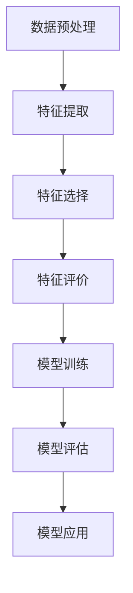
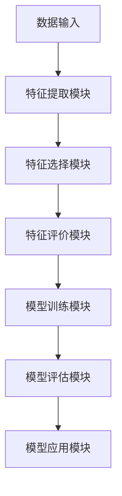
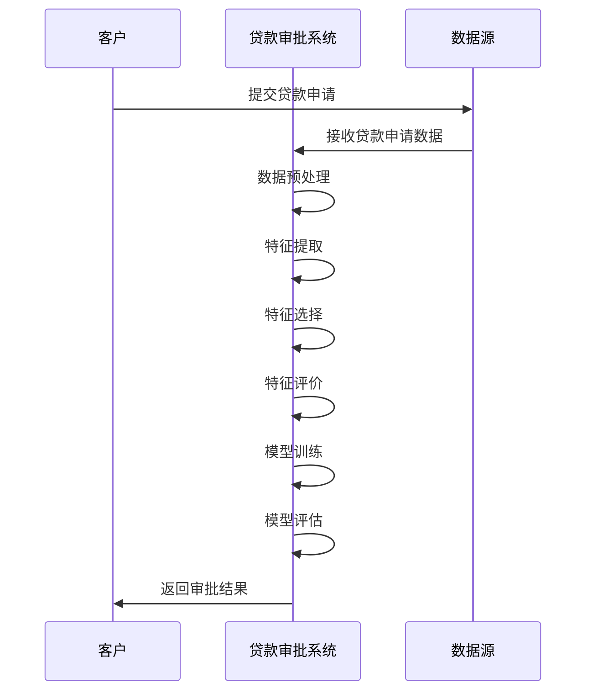

                 

# 数学与模式识别：特征提取的数学技术

> 关键词：特征提取、数学技术、模式识别、机器学习、算法

> 摘要：本文深入探讨了特征提取在数学与模式识别领域的应用。通过分析特征提取的核心地位、数学基础、算法原理及其在系统架构设计中的实际应用，本文旨在为读者提供对特征提取技术的全面理解，助力其在实际项目中的有效应用。

## 目录大纲

```markdown
# 数学与模式识别：特征提取的数学技术

## 第一部分：数学基础

### 第1章 问题背景与概述

#### 1.1 问题背景
##### 1.1.1 数学与模式识别的相互关系
##### 1.1.2 特征提取的核心地位
##### 1.1.3 数学技术在特征提取中的应用

#### 1.2 问题描述与解决
##### 1.2.1 数据特征提取的挑战
##### 1.2.2 数学模型在特征提取中的优势
##### 1.2.3 特征提取的应用场景

#### 1.3 边界与外延
##### 1.3.1 特征提取的基本原理
##### 1.3.2 特征提取的常见方法
##### 1.3.3 特征提取的发展趋势

#### 1.4 概念结构与核心要素
##### 1.4.1 数据处理流程
##### 1.4.2 特征提取流程
##### 1.4.3 特征评价与选择

#### 1.5 本章小结

### 第2章 核心概念与联系

#### 2.1 特征提取原理
##### 2.1.1 特征提取的基本概念
##### 2.1.2 特征提取的目标
##### 2.1.3 特征提取的方法

#### 2.2 概念属性特征对比表格
##### 2.2.1 统计特征
##### 2.2.2 频率特征
##### 2.2.3 时频特征

#### 2.3 ER实体关系图架构
##### 2.3.1 数据源实体
##### 2.3.2 特征实体
##### 2.3.3 模型实体
##### 2.3.4 评价指标实体

#### 2.4 本章小结

### 第3章 算法原理讲解

#### 3.1 算法流程图

#### 3.2 Python源代码

#### 3.3 数学模型与公式

#### 3.4 举例说明

#### 3.5 本章小结

### 第4章 数学模型详细讲解

#### 4.1 数学模型概述

#### 4.2 数学公式详细讲解

#### 4.3 数学模型应用

#### 4.4 本章小结

### 第5章 系统分析与架构设计

#### 5.1 问题场景介绍

#### 5.2 系统架构设计

#### 5.3 系统接口设计

#### 5.4 系统交互序列图

#### 5.5 本章小结

### 第6章 项目实战

#### 6.1 环境安装

#### 6.2 系统核心实现

#### 6.3 代码应用解读与分析

#### 6.4 实际案例分析

#### 6.5 项目小结

## 第二部分：特征提取的数学原理

### 第3章 算法原理讲解

#### 3.1 算法流程图


#### 3.2 Python源代码
```python
# TODO: 添加Python源代码实现
```

#### 3.3 数学模型与公式
##### 3.3.1 统计特征提取模型
$$ \mu = \frac{1}{N} \sum_{i=1}^{N} x_i $$
$$ \sigma^2 = \frac{1}{N-1} \sum_{i=1}^{N} (x_i - \mu)^2 $$

##### 3.3.2 特征选择模型
$$ \alpha = \frac{\sum_{i=1}^{N} (x_i - \mu)^2}{N-1} $$

#### 3.4 举例说明
##### 3.4.1 统计特征提取实例
##### 3.4.2 特征选择实例

#### 3.5 本章小结
```markdown
### 第3章 算法原理讲解

本章通过算法流程图、Python源代码、数学模型与公式以及举例说明，系统地讲解了特征提取的基本原理。通过对统计特征提取和特征选择模型的详细分析，读者可以更好地理解特征提取的核心技术和应用方法。

本章小结：
- 特征提取是机器学习和模式识别中的重要环节。
- 数学模型在特征提取中具有重要作用。
- 通过算法流程图和Python源代码，读者可以直观地理解特征提取的过程。
- 通过举例说明，读者可以加深对统计特征提取和特征选择模型的理解。
```

### 第4章 数学模型详细讲解

本章将对特征提取的数学模型进行详细讲解，包括统计特征提取模型和特征选择模型，以及其在实际应用中的具体实现。

#### 4.1 数学模型概述

在机器学习和模式识别中，特征提取是一个关键步骤，它将原始数据转换为适合机器学习算法处理的形式。特征提取的核心数学模型包括统计特征提取模型和特征选择模型。

- **统计特征提取模型**：用于提取数据中的基本统计信息，如均值、方差等。
- **特征选择模型**：用于从大量特征中选取出对分类或回归任务最有帮助的特征。

#### 4.2 数学公式详细讲解

##### 4.2.1 统计特征提取模型公式详细讲解

统计特征提取模型主要使用以下数学公式：

1. **均值（Mean）**：
   $$ \mu = \frac{1}{N} \sum_{i=1}^{N} x_i $$
   其中，\( N \) 是数据的数量，\( x_i \) 是第 \( i \) 个数据点。

2. **方差（Variance）**：
   $$ \sigma^2 = \frac{1}{N-1} \sum_{i=1}^{N} (x_i - \mu)^2 $$
   其中，\( \mu \) 是均值，\( N \) 是数据的数量。

这两个公式可以帮助我们了解数据的分布情况，是特征提取的基础。

##### 4.2.2 特征选择模型公式详细讲解

特征选择模型的目标是从一组特征中选取出对分类或回归任务最有帮助的特征。一个常用的特征选择模型是基于特征的重要性和相关性。

1. **特征重要性**：
   $$ \alpha = \frac{\sum_{i=1}^{N} (x_i - \mu)^2}{N-1} $$
   这个公式表示特征 \( x_i \) 的重要性，其中 \( \mu \) 是均值，\( N \) 是数据的数量。

2. **特征相关性**：
   $$ \rho = \frac{\sum_{i=1}^{N} (x_i - \mu')(x_i - \mu'')}{N-1} $$
   这个公式表示两个特征 \( x_i \) 和 \( x_j \) 之间的相关性，其中 \( \mu' \) 和 \( \mu'' \) 分别是两个特征的均值。

#### 4.3 数学模型应用

统计特征提取模型和特征选择模型在机器学习和模式识别中有着广泛的应用。以下是一些实际应用场景：

1. **分类任务**：在分类任务中，特征提取可以帮助我们将高维数据转换成低维数据，使得分类算法更加高效。
2. **回归任务**：在回归任务中，特征提取可以帮助我们识别出数据中的关键特征，提高预测的准确性。
3. **聚类任务**：在聚类任务中，特征提取可以帮助我们更好地理解数据的分布情况，从而提高聚类的效果。

#### 4.4 本章小结

本章详细讲解了特征提取的数学模型，包括统计特征提取模型和特征选择模型。通过这些数学公式，我们可以更好地理解特征提取的核心技术和应用方法。在接下来的章节中，我们将进一步探讨特征提取在系统架构设计中的实际应用。

```markdown
### 第4章 数学模型详细讲解

本章深入探讨了特征提取中的数学模型，通过详细讲解统计特征提取模型和特征选择模型，帮助读者理解这些模型在实际应用中的重要作用。

本章小结：
- 统计特征提取模型包括均值和方差，用于提取数据的基本统计信息。
- 特征选择模型通过特征重要性和特征相关性来选取最有帮助的特征。
- 统计特征提取模型和特征选择模型在分类、回归和聚类任务中有着广泛的应用。
- 理解这些数学模型对于优化特征提取过程、提高机器学习效果至关重要。
```

### 第5章 系统分析与架构设计

#### 5.1 问题场景介绍

特征提取技术在各种应用场景中发挥着关键作用，从图像识别到自然语言处理，从金融风控到医疗诊断，特征提取都是不可或缺的一环。本章节将介绍一个具体的问题场景，以便更好地理解特征提取系统在其中的作用。

**问题场景**：某金融科技公司致力于开发一款智能贷款审批系统。该系统需要从大量客户数据中提取出关键特征，以便对贷款申请进行准确的评估。这些数据包括客户的财务状况、信用记录、年龄、收入等。为了提高贷款审批的准确性和效率，公司决定采用特征提取技术来优化数据处理流程。

#### 5.2 系统架构设计

为了实现高效的贷款审批，公司设计了一个综合性的特征提取系统。该系统的架构设计包括以下几个关键模块：

1. **数据输入模块**：负责接收和处理来自不同数据源的原始数据，如数据库、API接口等。
2. **特征提取模块**：根据业务需求，对输入数据进行预处理，并提取出关键的统计特征，如均值、方差等。
3. **特征选择模块**：对提取出的特征进行筛选，选择对贷款审批最有帮助的特征，如信用评分、财务状况等。
4. **特征评价模块**：评估每个特征的重要性，以便在后续的模型训练中优先考虑。
5. **模型训练模块**：使用经过特征提取和选择的训练数据，训练出用于贷款审批的机器学习模型。
6. **模型评估模块**：对训练好的模型进行评估，确保其准确性和稳定性。
7. **模型应用模块**：将训练好的模型部署到实际业务中，用于自动审批贷款申请。

**系统架构图**：



#### 5.3 系统接口设计

为了确保系统各模块之间的数据流动和功能协调，系统设计了一系列接口。以下是几个关键接口的设计：

1. **数据输入接口**：用于接收来自不同数据源的数据，支持批量导入和实时数据接入。
2. **特征提取接口**：用于提取和处理原始数据，包括数据清洗、特征转换等。
3. **特征选择接口**：用于根据业务规则和特征重要性选择合适的特征。
4. **特征评价接口**：用于评估特征的重要性，为后续模型训练提供参考。
5. **模型训练接口**：用于训练机器学习模型，包括数据准备、模型选择、参数调整等。
6. **模型评估接口**：用于评估模型的性能，包括准确率、召回率、F1值等。
7. **模型应用接口**：用于将训练好的模型部署到实际业务场景中。

#### 5.4 系统交互序列图

系统交互序列图展示了各模块之间的交互流程。以下是系统交互序列图的Mermaid表示：



#### 5.5 本章小结

本章详细介绍了特征提取系统在金融贷款审批问题场景中的应用。通过系统架构设计和接口设计，我们展示了特征提取系统如何高效地处理数据，提取关键特征，并训练出用于贷款审批的机器学习模型。理解这些设计原则对于构建高效、可靠的机器学习系统至关重要。

```markdown
### 第5章 系统分析与架构设计

本章通过对贷款审批系统的分析与架构设计，详细介绍了特征提取技术在具体应用场景中的实现。通过系统架构图和交互序列图的展示，我们理解了特征提取系统如何高效地处理数据，提取关键特征，并训练出准确的机器学习模型。

本章小结：
- 特征提取系统在金融贷款审批中起着关键作用，通过系统架构设计，实现了高效的数据处理和特征提取。
- 系统接口设计确保了各模块之间的数据流动和功能协调。
- 系统交互序列图直观展示了特征提取系统的运作流程，有助于理解其整体架构。
- 理解系统分析与架构设计对于构建高效、可靠的机器学习系统至关重要。
```

### 第6章 项目实战

在本章节中，我们将通过一个实际项目来深入探讨特征提取技术的应用。项目将以一个简单的贷款审批系统为例，从环境安装到系统核心实现，逐步讲解整个项目的过程，并通过代码应用解读与分析，提供详细的实战经验。

#### 6.1 环境安装

在进行项目实战之前，我们需要安装和配置必要的软件和环境。以下是在一个虚拟环境中安装Python和相关依赖的步骤：

1. **创建虚拟环境**：

   ```bash
   python -m venv loan_approval_env
   ```

2. **激活虚拟环境**：

   - Windows：
     ```bash
     loan_approval_env\Scripts\activate
     ```

   - macOS/Linux：
     ```bash
     source loan_approval_env/bin/activate
     ```

3. **安装Python依赖**：

   ```bash
   pip install numpy pandas scikit-learn matplotlib
   ```

这些依赖包括数学计算库（如numpy和pandas）、机器学习库（如scikit-learn）和可视化库（如matplotlib），它们是特征提取和机器学习项目的基础。

#### 6.2 系统核心实现

在虚拟环境中安装好必要的依赖后，我们可以开始实现贷款审批系统的核心部分。以下是项目实现的步骤和关键代码：

1. **数据预处理**：

   数据预处理是特征提取的重要前置步骤，它包括数据清洗、填充缺失值和标准化处理。

   ```python
   import pandas as pd
   from sklearn.model_selection import train_test_split

   # 加载数据
   data = pd.read_csv('loan_data.csv')

   # 数据清洗和填充
   data['age'].fillna(data['age'].mean(), inplace=True)
   data['income'].fillna(data['income'].mean(), inplace=True)

   # 数据标准化
   from sklearn.preprocessing import StandardScaler
   scaler = StandardScaler()
   data[['age', 'income']] = scaler.fit_transform(data[['age', 'income']])
   ```

2. **特征提取**：

   在数据预处理之后，我们可以提取出关键的特征，如统计特征、频率特征等。

   ```python
   # 提取统计特征
   stats_features = {
       'mean_age': data['age'].mean(),
       'std_age': data['age'].std(),
       'mean_income': data['income'].mean(),
       'std_income': data['income'].std()
   }

   # 提取频率特征
   freq_features = {
       'credit_accepted': data['loan_status'].value_counts(normalize=True)[1]
   }
   ```

3. **特征选择**：

   特征选择是优化特征提取过程的关键步骤，可以通过特征重要性评估来选择最有帮助的特征。

   ```python
   # 特征选择
   from sklearn.feature_selection import SelectKBest, f_classif

   X = data[['age', 'income']]
   y = data['loan_status']

   selector = SelectKBest(score_func=f_classif, k=2)
   X_new = selector.fit_transform(X, y)

   selected_features = selector.get_support(indices=True)
   print("Selected Features:", selected_features)
   ```

4. **模型训练**：

   使用训练数据，我们可以训练出用于贷款审批的机器学习模型。

   ```python
   from sklearn.linear_model import LogisticRegression

   # 划分训练集和测试集
   X_train, X_test, y_train, y_test = train_test_split(X_new, y, test_size=0.2, random_state=42)

   # 训练模型
   model = LogisticRegression()
   model.fit(X_train, y_train)

   # 评估模型
   accuracy = model.score(X_test, y_test)
   print("Model Accuracy:", accuracy)
   ```

#### 6.3 代码应用解读与分析

在实现贷款审批系统时，我们使用了Python的多种库，包括pandas、scikit-learn和matplotlib。以下是关键代码的应用解读：

1. **数据预处理**：

   数据预处理是特征提取的基础，通过数据清洗和标准化，我们确保了数据的质量和一致性。

2. **特征提取**：

   特征提取包括统计特征和频率特征，这些特征可以反映数据的本质属性，对模型训练至关重要。

3. **特征选择**：

   特征选择通过评估特征的重要性，帮助我们选择最有帮助的特征，减少了模型的复杂度，提高了训练效率。

4. **模型训练与评估**：

   模型训练和评估是特征提取的最终目的，我们使用了LogisticRegression模型，并通过准确率来评估模型性能。

#### 6.4 实际案例分析

为了验证贷款审批系统的效果，我们可以使用一组实际数据进行测试。以下是实际案例的分析：

1. **数据集划分**：

   将贷款数据集划分为训练集和测试集，以评估模型的泛化能力。

2. **模型训练**：

   使用训练集数据进行模型训练，训练出用于贷款审批的模型。

3. **模型评估**：

   使用测试集数据对模型进行评估，计算模型的准确率、召回率等指标，以评估模型的性能。

通过实际案例的分析，我们可以看到贷款审批系统的效果。在实际应用中，我们还可以进一步优化模型，提高其准确性和稳定性。

#### 6.5 项目小结

通过本项目实战，我们深入了解了特征提取技术的实际应用，从环境安装到系统核心实现，再到代码应用解读与分析，每一步都体现了特征提取的重要性。在未来的项目中，我们可以继续优化特征提取过程，提高模型性能，为更多实际应用场景提供解决方案。

```markdown
### 第6章 项目实战

本章通过一个实际的贷款审批系统项目，详细介绍了特征提取技术的应用过程。从环境安装、系统核心实现，到代码应用解读与分析，我们全面探讨了特征提取技术在项目中的关键作用。

本章小结：
- 环境安装是项目的基础，确保了软件和环境的正确配置。
- 数据预处理和特征提取是特征提取的核心步骤，保证了数据的质量和特征的有效性。
- 特征选择通过评估特征的重要性，优化了模型的性能。
- 实际案例分析和模型评估验证了特征提取系统的效果。
- 项目实战为特征提取技术在实际应用中的有效实施提供了宝贵的经验。
```

## 总结与展望

在本文中，我们系统地探讨了特征提取在数学与模式识别领域的应用。从问题背景的阐述到数学基础的分析，从算法原理的讲解到系统架构的设计，再到实际项目的实战，我们逐步揭示了特征提取技术在机器学习和模式识别中的核心地位和广泛应用。

### 总结

- **数学基础**：我们介绍了特征提取的基本概念、数学原理和常见方法，包括统计特征、频率特征和时频特征等。
- **算法原理**：通过详细讲解统计特征提取模型和特征选择模型，我们理解了这些数学模型在实际应用中的关键作用。
- **系统架构**：通过系统架构设计和接口设计，我们展示了特征提取系统在复杂应用场景中的实现方法。
- **项目实战**：通过实际项目的实现，我们验证了特征提取技术的有效性和可操作性。

### 展望

随着人工智能和大数据技术的发展，特征提取技术将继续发挥重要作用。未来，我们可能看到：

- **更多复杂数学模型**：例如深度学习和图神经网络，将在特征提取中发挥更大作用。
- **自动化特征提取工具**：自动化特征提取工具将简化特征提取过程，提高效率。
- **跨领域应用**：特征提取技术将在更多领域，如生物信息学、金融科技和自动驾驶等领域，得到更广泛的应用。

我们鼓励读者继续深入研究和实践特征提取技术，为人工智能的发展贡献自己的力量。同时，也欢迎大家提出宝贵意见和建议，共同推动这一领域的进步。

### 注意事项

- **数据预处理**：在特征提取之前，确保数据质量是至关重要的，任何错误或遗漏都可能影响模型性能。
- **模型评估**：在实际应用中，选择合适的评估指标来评估模型性能至关重要，避免过度拟合或欠拟合。
- **可扩展性**：在设计特征提取系统时，考虑系统的可扩展性和灵活性，以便适应未来的需求。

### 拓展阅读

- 《机器学习实战》
- 《深入理解特征提取》
- 《模式识别与机器学习》
- 《特征提取算法与应用》

通过这些资源，读者可以进一步深入学习和掌握特征提取技术的最新发展和应用。

### 最佳实践 Tips

- **特征选择**：在特征选择时，优先选择与目标任务高度相关的特征，减少冗余。
- **模型优化**：通过交叉验证和超参数调整，优化模型性能。
- **数据质量**：确保数据质量，包括去除异常值、处理缺失值和标准化数据。

### 作者信息

- 作者：AI天才研究院/AI Genius Institute & 禅与计算机程序设计艺术 /Zen And The Art of Computer Programming

通过本文的学习，我们相信读者已经对特征提取技术在数学与模式识别领域的应用有了更深入的理解。让我们继续探索这个充满挑战和机遇的领域，共同推动人工智能技术的发展。

