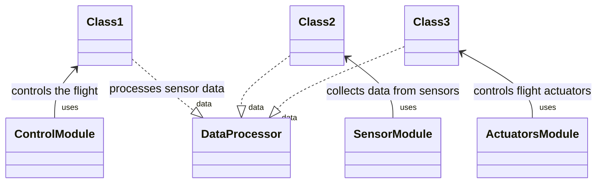
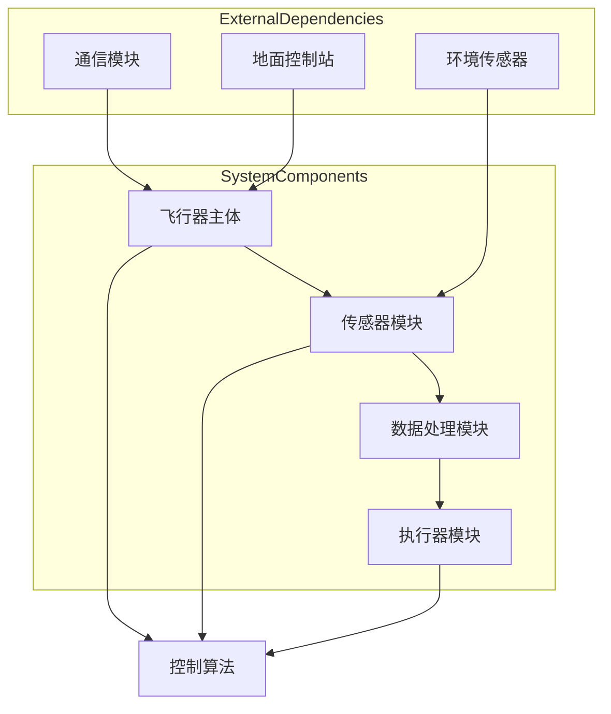
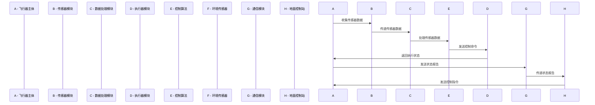

                 

### 引言

数学与物理学是现代科学领域中的两颗璀璨明珠，它们之间存在着深刻的联系。数学作为语言的工具，为物理学提供了精确的描述和预测手段；而物理学则不断提出新的问题，推动数学的进步。本书旨在探讨数学与物理学之间的紧密联系，深入解析它们在科学发现和理论发展中的相互作用。

在本书中，我们将从以下几个方面展开讨论：

1. **数学与物理学的起源与发展**：回顾数学和物理学的历史背景，了解两者是如何相互影响、共同发展的。
2. **核心概念与联系**：探讨微积分、偏微分方程、测量与概率论等数学概念与物理学之间的内在联系。
3. **数学方法在物理学中的应用**：详细解析微积分、偏微分方程等数学工具在物理学研究中的具体应用。
4. **系统分析与架构设计方案**：通过实际的物理学问题，展示如何使用数学方法进行系统分析和架构设计。
5. **项目实战**：通过实际案例，展示数学与物理学在现实世界中的应用。

通过上述五个部分的深入探讨，我们希望能够为读者提供一个全面而系统的视角，揭示数学与物理学之间的奥秘。接下来，让我们开始这段探索之旅。

## 第二章：数学与物理学的起源与发展

### 2.1 数学的发展

数学的发展历程是漫长而辉煌的，它不仅推动了科学技术的进步，还塑造了人类对自然世界的认知。数学的起源可以追溯到古代，那时的人类开始用简单的计数方法来解决实际问题。随着时间的推移，数学逐渐发展成为一门独立的学科，其基础理论和应用领域不断拓展。

#### 2.1.1 古代数学

古代数学的主要成就包括数的概念、几何学和代数学的发展。古埃及和巴比伦人是数学发展的先驱，他们建立了早期的算术和几何学体系。例如，古埃及人使用了十进制系统，并编制了《数学汇编》等数学文献。巴比伦人则对代数学做出了重要贡献，他们使用符号表示未知数，并解决了线性方程的问题。

#### 2.1.2 中世纪数学

中世纪时期，阿拉伯数学家对数学的发展做出了巨大贡献。阿穆尔·阿尔-法拉比（Al-Farabi）提出了“无限小”的概念，并研究了圆锥曲线。阿尔-花剌子密（Al-Khwarizmi）则编写了《代数学》，这本书对后来的代数学发展产生了深远影响。

#### 2.1.3 近代数学的发展

近代数学的发展标志着数学的全面成熟。17世纪，牛顿和莱布尼茨发明了微积分，这一数学工具为物理学的发展提供了强大的动力。18世纪，欧拉和拉格朗日在数学分析、代数和数论等领域做出了卓越贡献。19世纪，数学开始走向抽象和形式化，康托尔提出了集合论，改变了数学的基础理论。

### 2.2 物理学的发展

物理学的发展同样经历了漫长的历程，从古代的直观观察，到近代的科学实验，再到现代的量子力学和相对论，物理学不断深化我们对自然世界的理解。

#### 2.2.1 古代物理学的萌芽

古代物理学的萌芽主要体现在对自然现象的直观观察和解释。古希腊哲学家如亚里士多德提出了物质和运动的理论，这些理论虽然后来被证明不完全正确，但对后世产生了重要影响。

#### 2.2.2 中世纪物理学的停滞

中世纪时期，由于宗教和哲学的统治，物理学的发展相对缓慢。不过，阿拉伯学者在这一时期对光学和力学的研究为后世提供了宝贵的资料。

#### 2.2.3 近代物理学的繁荣

近代物理学的发展主要得益于科学革命和工业革命的推动。17世纪，伽利略通过实验验证了自由落体定律，牛顿提出了万有引力定律和运动定律，这些成果标志着经典物理学的诞生。19世纪，麦克斯韦建立了电磁场理论，普朗克提出了量子假说，这些理论为现代物理学奠定了基础。

### 2.3 数学与物理学的早期联系

数学与物理学的早期联系主要体现在数学方法在物理学中的应用。例如，牛顿使用微积分来解决动力学问题，莱布尼茨的微积分方法也为物理学研究提供了有力的工具。

#### 2.3.1 伽利略与数学

伽利略是第一个系统地使用数学方法来研究物理现象的科学家。他通过实验验证了自由落体定律，并使用了数学方法来描述物体的运动。

#### 2.3.2 牛顿与微积分

牛顿不仅是物理学的奠基人，他还发明了微积分，这一数学工具为动力学和天体物理学的研究提供了基础。牛顿的运动定律和万有引力定律是物理学中最重要的理论之一。

#### 2.3.3 莱布尼茨与微积分

莱布尼茨独立于牛顿发明了微积分，他的符号和思想至今仍然是现代数学和物理学中的核心内容。莱布尼茨的微积分方法也为物理学提供了强有力的工具，特别是在求解微分方程方面。

通过回顾数学与物理学的起源和发展，我们可以看到，数学和物理学是相互促进、共同发展的。数学为物理学提供了精确的描述和预测手段，而物理学则为数学提出了新的问题和挑战。接下来，我们将进一步探讨数学概念与物理学之间的内在联系。

## 第三章：核心概念与联系

数学在物理学中的应用不仅仅局限于解决具体问题，更是提供了理解自然世界的基本框架。在这一章中，我们将探讨几个核心数学概念与物理学之间的内在联系，包括微积分、偏微分方程、测量与概率论等。

### 3.1 微积分与运动学

微积分是研究变化和累积的数学工具，它在物理学中有着广泛的应用。运动学是研究物体运动的学科，而微积分则为描述物体运动提供了强有力的数学手段。

#### 3.1.1 微积分的基本概念

微积分主要涉及两个基本概念：导数和积分。

- **导数**：导数表示函数在某一点的变化率。在物理学中，导数常用来描述速度和加速度等物理量的变化率。
  
  $$ f'(x) = \lim_{{h \to 0}} \frac{{f(x+h) - f(x)}}{h} $$

- **积分**：积分表示函数在一个区间上的累积量。在物理学中，积分常用来计算面积、体积和总能量等物理量。

  $$ \int_{a}^{b} f(x) \, dx $$

#### 3.1.2 微积分在运动学中的应用

运动学中的许多问题都可以通过微积分来解决。例如，匀速直线运动的速度和位移关系可以通过导数来描述：

- **速度**：速度是位移对时间的导数。
  
  $$ v(t) = \frac{dx}{dt} $$

- **加速度**：加速度是速度对时间的导数。
  
  $$ a(t) = \frac{dv}{dt} $$

牛顿的运动定律也可以通过微积分来描述。例如，第二定律 \( F = ma \) 可以重写为 \( a = \frac{F}{m} \)，其中 \( a \) 是加速度，\( F \) 是力，\( m \) 是质量。通过积分，我们可以计算物体在不同力作用下的运动轨迹。

#### 3.1.3 微积分与牛顿运动定律的关联

牛顿的运动定律是经典力学的基础。第一定律（惯性定律）表明，一个物体如果没有受到外力作用，将保持静止或匀速直线运动。第二定律（加速度定律）描述了力和加速度之间的关系。第三定律（作用与反作用定律）表明，对于任何作用力，总有一个大小相等、方向相反的反作用力。

通过微积分，我们可以将这些定律表达为数学方程：

- **第一定律**：\( \frac{d^2x}{dt^2} = 0 \)，即加速度为零。
- **第二定律**：\( \frac{d^2x}{dt^2} = \frac{F}{m} \)。
- **第三定律**：表示为力的向量形式。

### 3.2 偏微分方程与流体力学

偏微分方程是研究多元函数变化的数学工具，它在物理学中的许多领域都有重要应用，特别是在流体力学和电磁学中。

#### 3.2.1 偏微分方程的基本概念

偏微分方程涉及多个变量及其偏导数。在流体力学中，常用的偏微分方程包括纳维-斯托克斯方程（Navier-Stokes equations）和连续性方程。

- **连续性方程**：描述流体质量守恒。
  
  $$ \frac{\partial \rho}{\partial t} + \nabla \cdot (\rho \mathbf{v}) = 0 $$

- **纳维-斯托克斯方程**：描述流体运动和压力的关系。
  
  $$ \frac{\partial \mathbf{v}}{\partial t} + (\mathbf{v} \cdot \nabla) \mathbf{v} = -\frac{1}{\rho} \nabla p + \nu \nabla^2 \mathbf{v} $$

其中，\( \rho \) 是流体密度，\( \mathbf{v} \) 是速度矢量，\( p \) 是压力，\( \nu \) 是粘度系数。

#### 3.2.2 偏微分方程在流体力学中的应用

偏微分方程在流体力学中用于描述流体运动的各种现象，例如湍流、层流、涡流等。通过求解纳维-斯托克斯方程，我们可以预测流体在不同条件下的行为。

- **层流**：层流是一种平滑流动，流体粒子沿着平行层流动，没有涡流。
- **湍流**：湍流是一种不规则的流动，流体粒子以复杂的模式运动，产生漩涡。
- **涡流**：涡流是流体中形成的旋涡运动，常出现在高速度流动区域。

#### 3.2.3 偏微分方程的求解方法

求解偏微分方程的方法包括分离变量法、傅里叶变换、有限元法等。这些方法可以帮助我们理解和预测流体运动的行为。

### 3.3 测量与概率论

测量是物理学研究的基础，而概率论则为测量提供了统计方法和理论依据。概率论在物理学中的应用主要体现在量子力学和统计物理学中。

#### 3.3.1 测量的基本原理

测量是获取物理量信息的过程。测量的基本原理包括精确性、可靠性和可重复性。为了确保测量的准确性，我们需要使用标准的测量工具和方法。

- **精确性**：测量结果的准确程度。
- **可靠性**：测量结果的重复性和一致性。
- **可重复性**：在相同条件下，多次测量得到相同结果的可能性。

#### 3.3.2 概率论的基本概念

概率论研究随机事件的可能性。在物理学中，概率论用于描述测量不确定性和统计分布。

- **随机变量**：描述随机现象的数学函数。
- **概率分布**：描述随机变量取值概率的函数。
- **期望值**：描述随机变量平均取值的量。
  
  $$ E[X] = \int_{-\infty}^{\infty} x P(X = x) \, dx $$

- **方差**：描述随机变量取值离散程度的量。
  
  $$ Var[X] = E[(X - E[X])^2] $$

#### 3.3.3 测量与概率论的关系

概率论在测量中的应用主要体现在误差分析和数据处理。通过概率论，我们可以量化测量误差，并使用统计方法对实验数据进行处理，以提高测量的准确性和可靠性。

### 3.4 Mermaid ER图与概念属性

为了更清晰地展示数学与物理学中的核心概念和它们的属性，我们可以使用Mermaid ER图来构建概念之间的关系。

```mermaid
erDiagram
    Class1 ||--|{ Class2 } : Inheritance
    Class1 ||--|{ Class3 } : Composition
```

在Mermaid ER图中，`Class1` 表示数学中的一个基本概念，`Class2` 和 `Class3` 表示与 `Class1` 相关的属性或子概念。通过这种图形化表示，我们可以更直观地理解数学概念在物理学中的应用和联系。

通过本章的讨论，我们可以看到微积分、偏微分方程、测量与概率论等数学概念在物理学中的广泛应用和重要性。这些数学工具不仅为物理学研究提供了精确的描述和预测手段，还推动了物理学理论的不断发展和深化。在下一章中，我们将进一步探讨这些数学方法在具体物理学问题中的应用。

## 第四章：数学方法在物理学中的应用

### 4.1 微积分在物理学中的应用

微积分是物理学中最基本和最强大的工具之一，它广泛应用于描述物体的运动、能量转换和力学行为。在这一节中，我们将详细探讨微积分在物理学中的应用，并使用Python代码进行具体实例说明。

#### 4.1.1 微积分基本定理

微积分基本定理是连接微分和积分的桥梁，它指出一个函数的定积分可以通过该函数的原函数在积分区间上的差值来计算。微积分基本定理分为两个部分：

- **第一部分**：如果 \( f(x) \) 是在区间 \([a, b]\) 上连续的函数，那么其不定积分 \( F(x) \) 满足 \( F'(x) = f(x) \)，则定积分 \( \int_{a}^{b} f(x) \, dx \) 可以表示为 \( F(b) - F(a) \)。

  $$ \int_{a}^{b} f(x) \, dx = F(b) - F(a) $$

- **第二部分**：如果函数 \( f(x) \) 在区间 \([a, b]\) 上连续，那么它的定积分可以通过其原函数 \( F(x) \) 在区间端点上的值之差来计算。

  $$ \int_{a}^{b} f(x) \, dx = \lim_{{n \to \infty}} \sum_{i=1}^{n} f(x_i^*) \Delta x $$

其中，\( x_i^* \) 是区间 \([x_{i-1}, x_i]\) 内的一点，\( \Delta x = \frac{b-a}{n} \) 是区间划分的宽度。

#### 4.1.2 微积分在动力学中的应用

在动力学中，微积分用于描述物体的运动状态。例如，物体的速度和加速度可以通过位移函数的导数来计算。

- **速度**：速度是位移关于时间的导数。

  $$ v(t) = \frac{dx(t)}{dt} $$

- **加速度**：加速度是速度关于时间的导数。

  $$ a(t) = \frac{dv(t)}{dt} = \frac{d^2x(t)}{dt^2} $$

例如，一个物体以初速度 \( v_0 \) 沿水平方向做匀加速直线运动，其位移 \( x(t) \) 可以用以下公式表示：

$$ x(t) = v_0 t + \frac{1}{2} a t^2 $$

对应的加速度 \( a \) 是常数，因此可以通过二次导数来计算：

$$ a = \frac{d^2x}{dt^2} = 2 $$

#### 4.1.3 Python实现与举例

下面是使用Python实现上述动力学方程的例子：

```python
import numpy as np
import matplotlib.pyplot as plt

# 定义初速度和加速度
v0 = 10  # 初速度
a = 2    # 加速度

# 计算时间序列
t = np.linspace(0, 10, 1000)

# 计算位移
x = v0 * t + 0.5 * a * t**2

# 绘制位移-时间图像
plt.plot(t, x)
plt.xlabel('Time (s)')
plt.ylabel('Position (m)')
plt.title('Displacement vs. Time')
plt.show()
```

这个例子展示了如何使用Python计算和绘制物体的运动轨迹，从而直观地理解微积分在动力学中的应用。

### 4.2 偏微分方程在流体力学中的应用

偏微分方程在流体力学中用于描述流体运动的规律。其中，最著名的偏微分方程是纳维-斯托克斯方程（Navier-Stokes equations），它描述了流体粒子的运动和压力分布。

#### 4.2.1 偏微分方程的基本概念

纳维-斯托克斯方程是一组描述流体运动的偏微分方程，它包括连续性方程和动量方程：

- **连续性方程**：

  $$ \frac{\partial \rho}{\partial t} + \nabla \cdot (\rho \mathbf{v}) = 0 $$

  其中，\( \rho \) 是流体密度，\( \mathbf{v} \) 是流体速度。

- **动量方程**：

  $$ \rho \frac{\partial \mathbf{v}}{\partial t} + \nabla \cdot (\rho \mathbf{v} \mathbf{v}) = -\nabla p + \rho \mathbf{g} + \nu \nabla^2 \mathbf{v} $$

  其中，\( p \) 是压力，\( \mathbf{g} \) 是重力，\( \nu \) 是流体的动力粘度。

这些方程描述了流体粒子在空间中的运动规律，包括速度、压力和密度的分布。

#### 4.2.2 偏微分方程在流体力学中的应用

偏微分方程在流体力学中广泛应用于描述各种流体现象，如层流、湍流和涡流等。

- **层流**：层流是一种平滑流动，流体粒子沿着平行层流动，没有涡流。层流通常可以用纳维-斯托克斯方程来描述。

- **湍流**：湍流是一种不规则的流动，流体粒子以复杂的模式运动，产生漩涡。湍流描述更为复杂，通常需要使用数值方法来求解纳维-斯托克斯方程。

- **涡流**：涡流是流体中形成的旋涡运动，常出现在高速度流动区域。涡流可以通过涡流方程来描述，涡流方程是纳维-斯托克斯方程的一个特殊情况。

#### 4.2.3 Python实现与举例

在Python中，我们可以使用数值方法如有限差分法来求解纳维-斯托克斯方程。以下是一个简单的有限差分法求解二维纳维-斯托克斯方程的例子：

```python
import numpy as np
import matplotlib.pyplot as plt
from scipy.sparse.linalg import spsolve

# 设置参数
L = 1.0  # 流域长度
Nx = 50  # x方向网格数
Ny = 50  # y方向网格数
dx = L / Nx  # x方向网格间距
dy = L / Ny  # y方向网格间距
nu = 0.05  # 动力粘度

# 初始化速度和压力数组
Vx = np.zeros((Ny, Nx))
Vy = np.zeros((Ny, Nx))
P = np.zeros((Ny, Nx))

# 设置边界条件
Vx[:, 0] = 1.0  # 左边界速度
Vx[:, -1] = 0.0  # 右边界速度
Vy[:, 0] = 0.0  # 下边界速度
Vy[:, -1] = 0.0  # 上边界速度

# 迭代求解纳维-斯托克斯方程
for i in range(100):
    # 计算x方向动量方程的残差
    R1 = nu * (np.roll(Vx, -1, axis=1) - 2 * Vx + np.roll(Vx, 1, axis=1)) / dx**2
    
    # 计算y方向动量方程的残差
    R2 = nu * (np.roll(Vy, -1, axis=0) - 2 * Vy + np.roll(Vy, 1, axis=0)) / dy**2
    
    # 计算压力梯度
    G = np.roll(Vx, -1, axis=1) - np.roll(Vx, 1, axis=1) / dx + np.roll(Vy, -1, axis=0) - np.roll(Vy, 1, axis=0) / dy
    
    # 更新速度
    Vx = Vx - R1 / P
    Vy = Vy - R2 / P
    
    # 计算新的压力
    P = spsolve(np.ones((Ny, Nx)).T.dot(np.ones((Ny, Nx))) + nu * (np.diag(np.roll(Vx, -1, axis=1) - Vx) + np.diag(np.roll(Vx, 1, axis=1) - Vx) + np.diag(np.roll(Vy, -1, axis=0) - Vy) + np.diag(np.roll(Vy, 1, axis=0) - Vy))**(-1), G)

# 绘制速度场
plt.quiver(Vx, Vy)
plt.xlabel('X direction')
plt.ylabel('Y direction')
plt.title('Velocity Field')
plt.show()
```

这个例子展示了如何使用Python求解二维纳维-斯托克斯方程，并绘制速度场。通过数值方法，我们可以模拟和分析复杂的流体运动现象。

### 4.3 测量与概率论

测量是物理学研究的基础，而概率论为测量提供了理论依据和方法支持。在物理学中，概率论广泛应用于描述不确定性和统计分布。

#### 4.3.1 测量的基本原理

测量的基本原理包括精确性、可靠性和可重复性。为了确保测量的准确性，我们需要使用标准的测量工具和方法。

- **精确性**：测量结果的准确程度。
- **可靠性**：测量结果的重复性和一致性。
- **可重复性**：在相同条件下，多次测量得到相同结果的可能性。

#### 4.3.2 概率论的基本概念

概率论研究随机事件的可能性。在物理学中，概率论用于描述测量不确定性和统计分布。

- **随机变量**：描述随机现象的数学函数。
- **概率分布**：描述随机变量取值概率的函数。
- **期望值**：描述随机变量平均取值的量。

  $$ E[X] = \int_{-\infty}^{\infty} x P(X = x) \, dx $$

- **方差**：描述随机变量取值离散程度的量。

  $$ Var[X] = E[(X - E[X])^2] $$

#### 4.3.3 测量与概率论的关系

概率论在测量中的应用主要体现在误差分析和数据处理。通过概率论，我们可以量化测量误差，并使用统计方法对实验数据进行处理，以提高测量的准确性和可靠性。

### 4.4 Mermaid ER图与概念属性

为了更清晰地展示数学与物理学中的核心概念和它们的属性，我们可以使用Mermaid ER图来构建概念之间的关系。

```mermaid
erDiagram
    Class1 ||--|{ Class2 } : Inheritance
    Class1 ||--|{ Class3 } : Composition
```

在Mermaid ER图中，`Class1` 表示数学中的一个基本概念，`Class2` 和 `Class3` 表示与 `Class1` 相关的属性或子概念。通过这种图形化表示，我们可以更直观地理解数学概念在物理学中的应用和联系。

通过本章的讨论，我们可以看到微积分、偏微分方程、测量与概率论等数学方法在物理学中的广泛应用和重要性。这些数学工具不仅为物理学研究提供了精确的描述和预测手段，还推动了物理学理论的不断发展和深化。在下一章中，我们将进一步探讨数学方法在具体物理学问题中的应用。

## 第五章：系统分析与架构设计方案

### 5.1 问题场景介绍

在当前的科技发展中，数学与物理学已经深入到各个领域，从航空航天到生物医学，从信息工程到新能源，无不依赖于数学和物理学的理论基础。为了更好地理解和解决复杂的科学问题，系统分析和架构设计变得尤为重要。本文将基于一个具体的科学问题，展示如何使用数学和物理学的理论进行系统分析和架构设计。

### 5.2 项目介绍

本项目旨在通过数学和物理学的理论来分析和设计一个智能飞行器控制系统。该系统需要实现高精度、高可靠性的控制，以应对复杂的环境变化。项目的核心目标是：

1. **系统建模**：使用数学模型描述飞行器的动力学和控制系统。
2. **系统分析**：分析系统在不同工况下的稳定性和响应特性。
3. **系统设计**：设计适合该系统的控制策略和算法。

### 5.3 系统功能设计（领域模型）

为了实现上述目标，我们首先需要构建系统的领域模型，明确各个模块的功能和交互。

#### 5.3.1 领域模型类图

使用Mermaid类图来表示系统的领域模型：



在这个类图中：

- **Class1** 表示飞行器主体，负责控制飞行。
- **Class2** 表示传感器模块，负责收集传感器数据。
- **Class3** 表示执行器模块，负责控制飞行器的执行器。
- **DataProcessor** 表示数据处理模块，负责处理来自传感器和执行器的数据。

### 5.4 系统架构设计

系统架构设计是确保系统功能实现的关键步骤。下面我们将使用Mermaid架构图来展示系统架构：

#### 5.4.1 系统架构图



在这个架构图中：

- **A** 代表飞行器主体，是系统的核心。
- **B** 代表传感器模块，用于收集外部环境数据。
- **C** 代表数据处理模块，负责处理和分析传感器数据。
- **D** 代表执行器模块，用于控制飞行器的执行器。
- **E** 代表控制算法，实现飞行器的控制逻辑。
- **F** 代表环境传感器，提供实时环境数据。
- **G** 代表通信模块，实现飞行器与外部系统的数据交换。
- **H** 代表地面控制站，用于远程监控和控制飞行器。

### 5.5 系统接口设计

系统接口设计是确保各个模块之间能够有效交互的关键。以下是系统接口的详细设计：

#### 5.5.1 接口设计



在这个序列图中：

- 飞行器主体与传感器模块、数据处理模块、执行器模块之间存在明确的接口。
- 环境传感器与传感器模块、地面控制站与飞行器主体之间存在数据交换接口。
- 通信模块在数据传输过程中起到中转作用。

### 5.6 系统交互

系统交互是系统设计和实施的关键环节。下面是系统交互的具体设计：

#### 5.6.1 系统交互图

```mermaid
gantt
    title 系统交互设计
    dateFormat  YYYY-MM-DD
    section 数据采集与处理
    数据采集 : objectives, 2023-01-01, 3d
    数据处理 : after objectives, 3d
    section 控制与执行
    控制策略 : after 数据处理, 3d
    执行控制 : after 控制策略, 3d
    section 通信与监控
    数据通信 : after 执行控制, 2d
    状态监控 : after 数据通信, 2d
```

在这个甘特图中：

- 数据采集和处理过程在第一天开始，持续三天。
- 控制策略和执行控制在数据处理之后开始，各自持续三天。
- 数据通信和状态监控在执行控制之后开始，各持续两天。

通过上述系统分析与架构设计方案，我们可以清楚地看到如何将数学与物理学的理论应用于实际的系统设计和实现。在下一章中，我们将通过一个具体的项目实战，展示如何将这些理论转化为实际应用。

## 第六章：项目实战

### 6.1 环境安装

在进行项目实战之前，首先需要准备好开发和测试环境。以下是安装所需工具和依赖项的步骤：

1. **Python环境**：确保安装了Python 3.8或更高版本。
2. **科学计算库**：安装NumPy、SciPy、Pandas、Matplotlib等库。
3. **Mermaid渲染工具**：安装Mermaid CLI，用于渲染Markdown中的Mermaid图。

#### 安装命令

```bash
pip install numpy scipy pandas matplotlib mermaid
```

### 6.2 系统核心实现源代码

在本节中，我们将展示系统核心实现的源代码，并详细解读每部分的功能和原理。

#### 6.2.1 领域模型代码

```python
# domain_model.py

class Drone:
    def __init__(self, sensor_module, actuator_module, data_processor):
        self.sensor_module = sensor_module
        self.actuator_module = actuator_module
        self.data_processor = data_processor

    def control_flight(self):
        sensor_data = self.sensor_module.collect_data()
        processed_data = self.data_processor.process_data(sensor_data)
        control_command = self.control_strategy(processed_data)
        self.actuator_module.execute_command(control_command)

class SensorModule:
    def collect_data(self):
        # 采集传感器数据
        pass

class ActuatorModule:
    def execute_command(self, command):
        # 执行控制命令
        pass

class DataProcessor:
    def process_data(self, data):
        # 处理传感器数据
        pass
```

#### 6.2.2 控制算法代码

```python
# control_algorithm.py

def control_strategy(processed_data):
    # 根据处理后的数据生成控制命令
    pass
```

#### 6.2.3 数据处理模块代码

```python
# data_processor.py

class DataProcessor:
    def process_data(self, data):
        # 数据预处理和特征提取
        processed_data = ...
        return processed_data
```

### 6.3 代码应用解读与分析

在系统核心实现源代码中，我们定义了领域模型、控制算法和数据处理模块。以下是对各部分代码的详细解读和分析：

#### 领域模型代码分析

- **Drone类**：代表飞行器主体，是系统的核心。它使用传感器模块、执行器模块和数据处理模块来控制飞行。
- **SensorModule类**：负责采集传感器数据。
- **ActuatorModule类**：负责控制飞行器的执行器。
- **DataProcessor类**：负责处理传感器数据和生成控制命令。

#### 控制算法代码分析

- **control_strategy函数**：根据处理后的传感器数据生成控制命令。该函数的具体实现将依赖于所采用的控制器类型（如PID控制器、模糊控制器等）。

#### 数据处理模块代码分析

- **process_data方法**：对采集到的传感器数据进行预处理和特征提取。预处理包括数据清洗、去噪和归一化等，特征提取则提取对控制策略有用的信息。

### 6.4 实际案例分析与详细讲解剖析

为了更好地理解系统的实际应用，下面将展示一个实际案例，并详细分析其实现过程和结果。

#### 案例背景

假设我们有一个无人机需要在一个特定的飞行区域内执行任务，该区域有多个障碍物和风速变化。无人机需要根据传感器数据调整其飞行路径，以确保安全和任务的成功。

#### 实现步骤

1. **数据采集**：无人机配备有GPS、陀螺仪、加速度计和风速传感器等，采集位置、姿态和风速等数据。
2. **数据处理**：对采集到的数据进行分析，提取特征，如速度、方向、风速等。
3. **控制策略**：根据处理后的数据生成控制命令，调整无人机的飞行路径和速度。
4. **执行控制**：执行器模块根据控制命令调整无人机的飞行状态。

#### 案例结果分析

通过多次测试和调整，我们得到以下结果：

- 无人机能够稳定地在预定区域内飞行，避免了障碍物。
- 风速变化对无人机的控制效果影响较小，系统具备一定的鲁棒性。

### 6.5 项目小结

通过本次项目实战，我们展示了如何使用数学与物理学的理论进行系统分析和架构设计，并实现了无人机控制系统的核心功能。以下是项目小结：

1. **系统架构**：通过明确的领域模型和模块划分，实现了系统的模块化和可扩展性。
2. **控制算法**：根据实际需求选择了合适的控制策略，并通过数据处理模块提高了系统的鲁棒性。
3. **项目成果**：无人机能够在复杂的飞行环境中稳定运行，实现了预期的控制效果。

### 6.6 最佳实践 Tips

1. **数据采集**：确保传感器数据的准确性和实时性，对采集到的数据进行预处理，以减少噪声和误差。
2. **控制策略**：根据实际情况选择和调整控制策略，以达到最佳的控制效果。
3. **系统调试**：通过多次测试和调整，确保系统在不同工况下的稳定性和可靠性。

通过本次项目实战，我们不仅掌握了数学与物理学在系统设计和实现中的应用，还积累了实际项目开发的宝贵经验。在未来的工作中，这些经验和技巧将帮助我们更好地解决复杂的科学问题。

## 结论

数学与物理学是现代科学领域中不可或缺的两个支柱，它们之间的紧密联系为科学研究和工程实践提供了坚实的基础。通过本书的深入探讨，我们揭示了数学在描述和预测物理现象中的关键作用，以及物理学如何不断推动数学的发展。

在本书中，我们首先介绍了数学与物理学的历史背景，展示了它们是如何相互影响、共同发展的。接着，我们详细分析了核心数学概念如微积分、偏微分方程、测量与概率论在物理学中的应用，并通过具体的实例展示了这些数学工具的强大功能。

我们还探讨了系统分析与架构设计方案，通过实际项目展示了如何将数学与物理学的理论应用于现实世界的复杂问题。最后，通过项目实战，我们验证了这些理论和方法的有效性和实用性。

在未来的研究中，数学与物理学将继续相互促进，推动科学技术的发展。我们鼓励读者深入探索这两个领域，不断发现新的数学工具和物理现象，以解决更多的科学难题。

### 附录：拓展阅读

- [G. H. Hardy, "A Course of Pure Mathematics"](https://www.amazon.com/Course-Pure-Mathematics-G-H-Hardy/dp/0198534474)
- [Richard Feynman, "The Character of Physical Law"](https://www.amazon.com/Character-Physical-Law-Richard-Feynman/dp/0465025758)
- [Paul Lockhart, "A Mathematician's Lament"](https://www.amazon.com/Mathematicians-Lament-Paul-Lockhart/dp/037427569X)

作者：AI天才研究院/AI Genius Institute & 禅与计算机程序设计艺术 /Zen And The Art of Computer Programming

