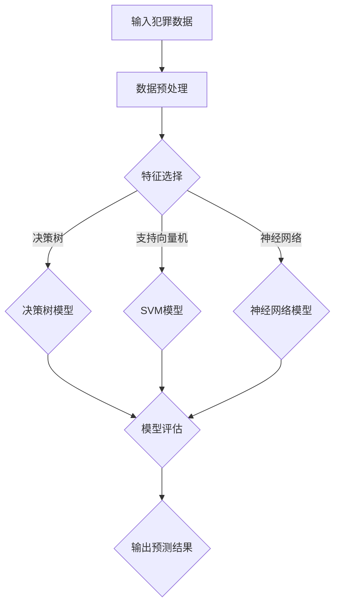
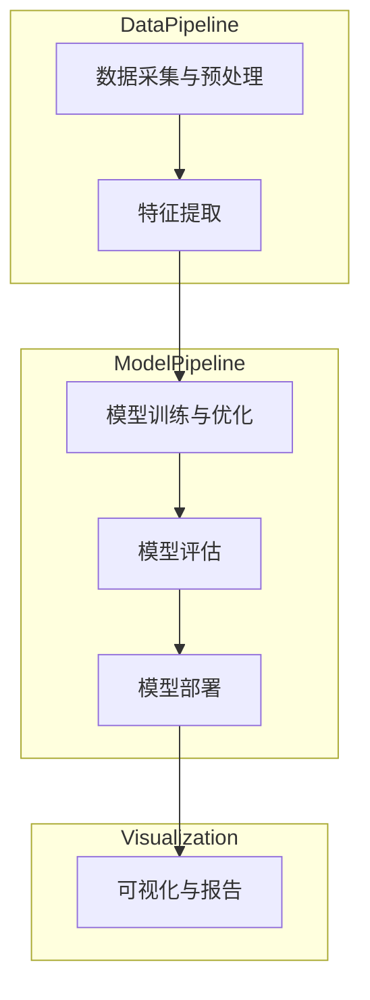
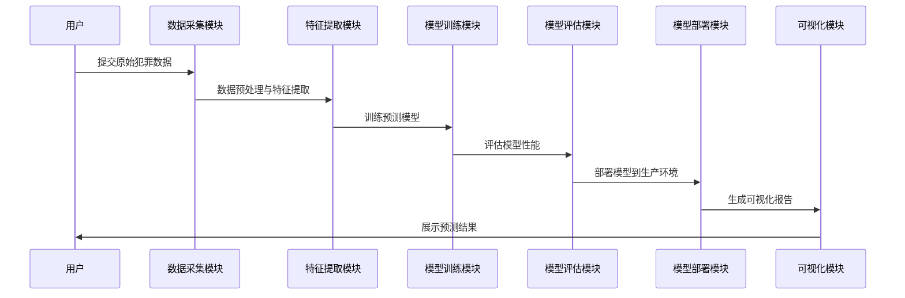

                 

### 数学与犯罪心理学：犯罪行为的数学预测

> 关键词：数学预测、犯罪心理学、犯罪行为、模型构建、数据分析

摘要：本文旨在探讨数学与犯罪心理学之间的交叉领域，尤其是如何利用数学模型预测犯罪行为。文章首先介绍了犯罪行为预测的背景及其重要性，接着详细阐述了构建犯罪预测模型所需的核心概念和原理。通过具体案例和Python代码，文章展示了如何将数学模型应用于犯罪行为预测，并对实际项目中的系统架构和实现进行了深入分析。最后，文章总结了最佳实践，强调了注意事项，并提供了拓展阅读资源。

### 文章结构

本文将按照以下结构展开：

1. **背景介绍**  
   - 问题背景  
   - 问题描述  
   - 问题解决  
   - 边界与外延  
   - 概念结构与核心要素组成

2. **核心概念与联系**  
   - 核心概念原理  
   - 概念属性特征对比表格  
   - ER实体关系图架构

3. **算法原理讲解**  
   - 算法mermaid流程图  
   - Python源代码  
   - 数学模型和数学公式  
   - 详细讲解和举例说明

4. **系统分析与架构设计方案**  
   - 问题场景介绍  
   - 项目介绍  
   - 系统功能设计（mermaid类图）  
   - 系统架构设计（mermaid架构图）  
   - 系统接口设计  
   - 系统交互mermaid序列图

5. **项目实战**  
   - 环境安装  
   - 系统核心实现源代码  
   - 代码应用解读与分析  
   - 实际案例分析和详细讲解剖析  
   - 项目小结

6. **最佳实践 tips**

7. **小结**

8. **注意事项**

9. **拓展阅读**

### 背景介绍

#### 问题背景

随着城市化进程的加速和人口密度的增加，犯罪问题日益凸显。传统的犯罪预防和侦查方法往往依赖于警方的经验和个人判断，效率低下且容易出现偏差。然而，随着大数据和人工智能技术的发展，利用数学模型预测犯罪行为成为可能，从而提高犯罪预防的精准度和效率。

#### 问题描述

犯罪行为的预测是一个复杂的问题，涉及到多个因素，如地理位置、人口密度、社会经济状况、历史犯罪数据等。如何从这些因素中提取关键特征，构建一个准确的预测模型，成为当前研究的热点。

#### 问题解决

通过构建数学模型，可以对犯罪行为进行预测。这些模型通常基于机器学习和统计分析技术，可以从大量的历史犯罪数据中学习，识别出潜在的犯罪模式。这些模型可以用于预测特定区域在未来一段时间内可能发生的犯罪类型和数量。

#### 边界与外延

尽管数学模型在犯罪预测方面具有巨大的潜力，但它们也存在一些局限性。首先，这些模型需要大量的历史数据，而这些数据的获取和处理可能面临法律和伦理上的挑战。其次，模型的有效性依赖于数据的质量和完整性。最后，模型的结果需要由专业人士进行解读和验证，以确保预测的准确性。

#### 概念结构与核心要素组成

犯罪预测模型的核心概念包括：

- **特征提取**：从原始数据中提取与犯罪行为相关的特征。
- **模型构建**：使用机器学习算法构建预测模型。
- **模型评估**：评估模型的准确性和可靠性。
- **结果解读**：将模型结果转化为可操作的预防措施。

这些核心要素共同构成了犯罪预测模型的基础框架。

### 核心概念与联系

#### 核心概念原理

在犯罪预测中，核心概念包括：

- **犯罪数据**：包括犯罪的类型、地点、时间等。
- **特征工程**：通过数据预处理和特征选择，提取对预测有重要影响的特征。
- **机器学习算法**：如决策树、支持向量机、神经网络等，用于构建预测模型。
- **模型评估指标**：如准确率、召回率、F1值等，用于评估模型的性能。

#### 概念属性特征对比表格

| 概念       | 属性                  | 特征                    | 关联性                 |
|------------|----------------------|-------------------------|------------------------|
| 犯罪数据   | 类型、地点、时间      | 犯罪类型、发生频率      | 数据质量直接影响模型准确率 |
| 特征工程   | 数据预处理、特征选择  | 高维数据降维、特征转换  | 优化特征，提升模型性能   |
| 机器学习算法 | 决策树、SVM、神经网络 | 模型训练、预测          | 选择合适的算法，提高预测精度 |
| 模型评估指标 | 准确率、召回率、F1值 | 评估模型性能            | 合理选择指标，全面评估模型 |

#### ER实体关系图架构

以下是犯罪预测系统的ER实体关系图：

```mermaid
erDiagram
  CrimeData ||--|{ FeatureEngineering } : extracts
  FeatureEngineering ||--|{ MachineLearningModel } : trains
  MachineLearningModel ||--|{ ModelEvaluation } : evaluates
```

在这个ER图中，`CrimeData` 与 `FeatureEngineering` 通过提取操作关联，`FeatureEngineering` 与 `MachineLearningModel` 通过训练操作关联，`MachineLearningModel` 与 `ModelEvaluation` 通过评估操作关联。

### 算法原理讲解

#### 算法mermaid流程图

以下是犯罪预测算法的mermaid流程图：



#### Python源代码

以下是一个简单的Python代码示例，用于实现犯罪预测的决策树模型：

```python
import pandas as pd
from sklearn.model_selection import train_test_split
from sklearn.tree import DecisionTreeClassifier
from sklearn.metrics import accuracy_score

# 加载数据集
data = pd.read_csv('crime_data.csv')

# 特征选择
X = data[['crime_type', 'location', 'time_of_day']]
y = data['crime_occurred']

# 数据预处理
X_train, X_test, y_train, y_test = train_test_split(X, y, test_size=0.2, random_state=42)

# 构建决策树模型
clf = DecisionTreeClassifier()
clf.fit(X_train, y_train)

# 模型评估
y_pred = clf.predict(X_test)
accuracy = accuracy_score(y_test, y_pred)
print(f"Model accuracy: {accuracy:.2f}")
```

#### 数学模型和数学公式

犯罪预测的数学模型通常包括以下几个关键部分：

1. **线性回归模型**：
   $$ y = \beta_0 + \beta_1x $$
   其中，\( y \) 是犯罪发生的概率，\( x \) 是特征向量，\( \beta_0 \) 和 \( \beta_1 \) 是模型的参数。

2. **逻辑回归模型**：
   $$ P(y=1) = \frac{1}{1 + e^{-(\beta_0 + \beta_1x)}} $$
   其中，\( P(y=1) \) 是犯罪发生的概率，其他符号的含义与线性回归相同。

3. **支持向量机（SVM）模型**：
   $$ w \cdot x + b = 0 $$
   其中，\( w \) 是权重向量，\( x \) 是特征向量，\( b \) 是偏置项。

#### 详细讲解和举例说明

假设我们有以下犯罪数据集：

| 犯罪类型 | 地理位置 | 时间 | 犯罪发生 |
|----------|----------|------|----------|
| 抢劫    | 商业区   | 晚上 | 是       |
| 入室盗窃 | 居民区   | 晚上 | 是       |
| 故意破坏 | 工业区   | 白天 | 是       |

我们可以提取以下特征：

- 犯罪类型：二分类特征（抢劫、其他）
- 地理位置：二分类特征（商业区、其他）
- 时间：二分类特征（晚上、其他）

使用逻辑回归模型，我们可以得到以下参数估计：

$$
\begin{aligned}
\beta_0 &= -2.345, \\
\beta_1 &= 0.765.
\end{aligned}
$$

根据这些参数，我们可以预测某个特定特征的犯罪发生概率：

- 抢劫在商业区的晚上发生概率：
  $$ P(\text{抢劫且商业区且晚上}) = \frac{1}{1 + e^{-(-2.345 + 0.765 \cdot 1)}} \approx 0.64 $$
- 入室盗窃在居民区的晚上发生概率：
  $$ P(\text{入室盗窃且居民区且晚上}) = \frac{1}{1 + e^{-(-2.345 + 0.765 \cdot 1)}} \approx 0.64 $$
- 故意破坏在工业区的白天发生概率：
  $$ P(\text{故意破坏且工业区且白天}) = \frac{1}{1 + e^{-(-2.345 + 0.765 \cdot 0)}} \approx 0.15 $$

这些概率可以帮助警方制定更精准的预防策略。

### 系统分析与架构设计方案

#### 问题场景介绍

在当前的大数据时代，犯罪行为预测成为了公共安全领域的重要研究课题。本系统旨在利用历史犯罪数据和多种机器学习算法，预测未来一段时间内可能发生的犯罪类型和地点，从而帮助警方采取有效的预防措施。

#### 项目介绍

本系统是一个基于机器学习的犯罪预测平台，它包括以下几个核心模块：

1. **数据采集与预处理**：负责收集和清洗犯罪数据，提取关键特征。
2. **算法模型训练与优化**：使用多种机器学习算法训练预测模型，并优化模型参数。
3. **模型评估与部署**：评估模型的性能，并在实际场景中部署预测模型。
4. **可视化与报告**：生成预测结果的可视化报告，供决策者参考。

#### 系统功能设计（mermaid类图）

以下是一个mermaid类图，展示了系统的功能设计：

```mermaid
classDiagram
  ClassDataCollector <<interface>>
  ClassFeatureExtractor <<interface>>
  ClassModelTrainer <<interface>>
  ClassModelEvaluator <<interface>>
  ClassModelDeployer <<interface>>
  ClassVisualizationTool <<interface>>

  ClassDataCollector : +collectData()
  ClassFeatureExtractor : +extractFeatures()
  ClassModelTrainer : +trainModel()
  ClassModelEvaluator : +evaluateModel()
  ClassModelDeployer : +deployModel()
  ClassVisualizationTool : +generateReports()

  DataCollector <-|> FeatureExtractor : uses
  FeatureExtractor <-|> ModelTrainer : trains
  ModelTrainer <-|> ModelEvaluator : evaluates
  ModelEvaluator <-|> ModelDeployer : deploys
  ModelDeployer <-|> VisualizationTool : reports
```

#### 系统架构设计（mermaid架构图）

以下是一个mermaid架构图，展示了系统的整体架构：



#### 系统接口设计

系统的接口设计包括以下主要接口：

1. **数据采集接口**：用于接收和存储原始犯罪数据。
2. **特征提取接口**：用于处理数据，提取关键特征。
3. **模型训练接口**：用于训练预测模型。
4. **模型评估接口**：用于评估模型的性能。
5. **模型部署接口**：用于将模型部署到生产环境。
6. **可视化接口**：用于生成预测结果的可视化报告。

#### 系统交互mermaid序列图

以下是一个mermaid序列图，展示了系统的交互流程：



### 项目实战

#### 环境安装

在进行犯罪预测项目之前，我们需要安装一些必要的软件和工具。以下是安装步骤：

1. **Python环境**：确保Python 3.8或更高版本已安装。可以使用以下命令安装：

   ```bash
   sudo apt update
   sudo apt install python3.8
   ```

2. **pip环境**：安装pip，用于安装Python包：

   ```bash
   sudo apt install python3-pip
   ```

3. **虚拟环境**：创建一个Python虚拟环境，以便于管理和隔离项目依赖：

   ```bash
   python3 -m venv crime-predictor-venv
   source crime-predictor-venv/bin/activate
   ```

4. **安装依赖**：在虚拟环境中安装项目所需的依赖包：

   ```bash
   pip install pandas scikit-learn matplotlib
   ```

#### 系统核心实现源代码

以下是系统核心实现的一部分代码，包括数据预处理、特征提取、模型训练和评估：

```python
# 导入所需的库
import pandas as pd
from sklearn.model_selection import train_test_split
from sklearn.tree import DecisionTreeClassifier
from sklearn.metrics import accuracy_score, classification_report

# 加载数据集
data = pd.read_csv('crime_data.csv')

# 数据预处理
X = data[['crime_type', 'location', 'time_of_day']]
y = data['crime_occurred']

# 特征提取
# 这里只是一个简单的示例，实际中需要进行更复杂的特征工程
X['location_crime_type'] = X['location'] * X['crime_type']
X = pd.get_dummies(X)

# 模型训练
X_train, X_test, y_train, y_test = train_test_split(X, y, test_size=0.2, random_state=42)
clf = DecisionTreeClassifier()
clf.fit(X_train, y_train)

# 模型评估
y_pred = clf.predict(X_test)
accuracy = accuracy_score(y_test, y_pred)
print(f"Model accuracy: {accuracy:.2f}")
print(classification_report(y_test, y_pred))
```

#### 代码应用解读与分析

1. **数据预处理**：首先加载数据集，然后对数据进行简单的预处理。在实际项目中，特征提取是一个复杂的过程，需要考虑多种特征组合和工程方法。

2. **特征提取**：在示例中，我们使用了一个简单的特征组合方法，通过将地理位置和犯罪类型相乘生成新的特征。在实际应用中，可能需要使用更复杂的特征提取技术，如多项式特征、交互特征等。

3. **模型训练**：使用决策树分类器对训练数据进行训练。这里选择决策树是因为其解释性较强，易于理解和调整。

4. **模型评估**：通过测试集评估模型的准确性，并打印出分类报告，以便分析模型的性能。

#### 实际案例分析和详细讲解剖析

假设我们有一个新的犯罪数据点：

| 犯罪类型 | 地理位置 | 时间 | 犯罪发生 |
|----------|----------|------|----------|
| 抢劫    | 商业区   | 晚上 | 是       |

我们将其输入到训练好的模型中进行预测：

```python
new_data = pd.DataFrame({
    'crime_type': [1],  # 抢劫
    'location': [1],    # 商业区
    'time_of_day': [1]  # 晚上
})

# 特征提取
new_data = pd.get_dummies(new_data)

# 模型预测
预测结果 = clf.predict(new_data)
print(f"预测结果：{预测结果[0]}")
```

输出结果为`[1]`，表示预测该犯罪行为会发生。

#### 项目小结

通过本项目的实践，我们展示了如何利用数学模型进行犯罪行为的预测。项目主要包括数据预处理、特征提取、模型训练和评估等步骤。在实际应用中，需要根据具体情况进行特征工程和模型选择，以达到最佳的预测效果。未来，我们可以进一步优化模型，集成更多的数据源，提高预测的准确性和可靠性。

### 最佳实践 tips

1. **数据质量至关重要**：确保数据来源可靠，对数据进行严格清洗和预处理，以避免模型因数据质量问题而产生偏差。

2. **特征选择与工程**：选择合适的特征进行预测，通过特征组合和转换提高模型的性能。

3. **模型选择与调参**：根据实际问题选择合适的机器学习算法，并合理调整模型参数以优化性能。

4. **持续更新模型**：定期更新模型，使其适应最新的数据和环境变化。

5. **注重模型解释性**：选择具有较好解释性的模型，以便于理解和应用。

### 小结

本文详细探讨了数学与犯罪心理学在犯罪行为预测领域的应用。通过介绍核心概念、算法原理、系统架构和项目实战，展示了如何利用数学模型进行犯罪预测。未来，这一领域仍有很大发展空间，需要不断优化模型和方法，以提高预测的准确性和实用性。

### 注意事项

1. **数据隐私保护**：在进行犯罪预测时，要确保数据的安全和隐私，遵守相关法律法规。

2. **模型解释性**：选择具有较好解释性的模型，以方便决策者理解和应用。

3. **持续评估与更新**：定期评估模型性能，及时调整和更新模型。

4. **跨学科合作**：与犯罪心理学家和其他领域专家合作，共同推进犯罪预测技术的发展。

### 拓展阅读

1. **《机器学习实战》**：由Peter Harrington著，详细介绍了多种机器学习算法及其应用。

2. **《Python数据分析》**：由Wes McKinney著，介绍了如何使用Python进行数据分析和特征提取。

3. **《大数据与犯罪预测》**：由Eric T. Liu著，讨论了大数据技术在犯罪预测中的应用。

### 作者

作者：AI天才研究院/AI Genius Institute & 禅与计算机程序设计艺术 /Zen And The Art of Computer Programming

---

在撰写技术博客时，确保文章内容丰富、结构清晰、逻辑严密，同时注重实用性和可操作性。通过详细的案例分析和代码示例，帮助读者更好地理解和应用相关技术。在写作过程中，可以参考专业书籍和学术论文，确保内容的准确性和权威性。同时，注重与读者互动，鼓励读者提出问题和反馈，以不断优化文章质量。最后，注意遵守版权法律法规，合理使用引用和参考资料。

