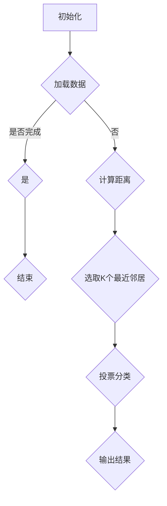
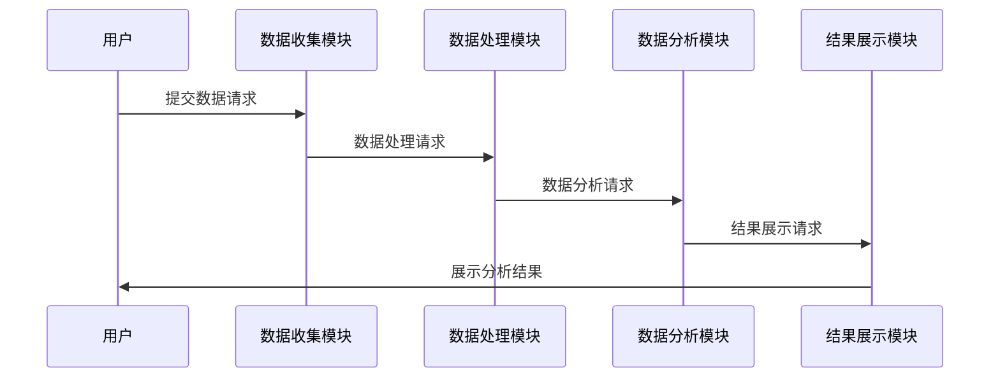
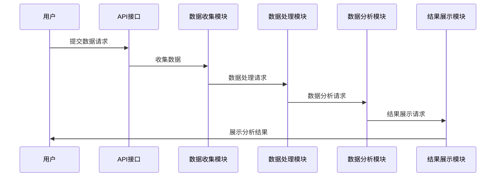

                 

### 第一部分：背景介绍

#### 1.1 问题背景

##### 1.1.1 数学与生物信息学的交叉研究

**定义与边界**：数学与生物信息学的交叉研究涉及到多个学科领域，旨在利用数学理论和方法解决生物信息学中的问题。数学提供了建模、算法设计以及数据分析的工具，而生物信息学则关注于从生物学数据中提取知识和规律。两者的交叉研究，不仅扩展了数学的应用领域，也为生物科学的发展提供了强大的支持。

- **数学在生物信息学中的应用**：数学模型可以用来模拟生物系统的动态行为，例如，通过微分方程模拟细胞内部化学反应的动态过程。此外，概率论和统计学在基因组数据分析中起到了关键作用，如基因关联分析、序列比对和突变检测等。

- **生物信息学对数学模型的依赖**：生物信息学依赖于数学模型来理解和解释生物学现象。例如，序列比对算法（如BLAST）基于动态规划理论，而机器学习方法（如支持向量机、神经网络）则基于概率论和线性代数等数学理论。

**发展历程**：数学与生物信息学的交叉研究可以追溯到20世纪末，当时随着DNA测序技术的进步，生物信息学作为一门独立的学科开始兴起。数学家开始关注生物学数据，开发出新的数学模型和算法来处理这些数据。近年来，随着计算能力的提升和大数据技术的发展，这一交叉领域得到了迅速扩展。

**核心概念与要素组成**：数学与生物信息学交叉研究中的核心概念包括基因组、序列分析、算法等。

- **基因组**：基因组是生物体的全部遗传信息，包括DNA序列及其调控元件。基因组学是生物信息学的核心内容之一。

- **序列分析**：序列分析是指对生物序列（如DNA、RNA、蛋白质序列）进行各种分析，包括比对、编辑距离计算、模式识别等。

- **算法**：生物信息学中的算法是解决生物学问题的重要工具，包括字符串匹配算法、聚类算法、机器学习算法等。

##### 1.1.2 问题与挑战

**具体问题与挑战**：在生物信息学研究中，数学问题主要集中在以下几个方面：

- **数据处理复杂性**：生物信息学产生的数据量大且复杂，如何高效地存储、处理和分析这些数据是一个挑战。

- **模型准确性**：构建准确的数学模型是解决生物学问题的关键，但如何确保模型的准确性和可靠性仍然是一个挑战。

- **算法效率**：生物信息学中的算法需要处理大规模数据集，如何提高算法的效率和可扩展性是关键问题。

**现状与问题根源**：当前，数学与生物信息学交叉领域面临的主要问题包括：

- **技术瓶颈**：现有的数学模型和算法在处理复杂生物学问题时存在局限性，难以满足研究需求。

- **跨学科协作不足**：数学和生物信息学领域的专家之间的交流与合作不够，导致问题解决方案的创新性受到限制。

##### 1.1.3 解决方案与展望

**方法与技术**：为了解决数学与生物信息学交叉领域的问题，研究人员采取了多种方法和技术：

- **机器学习和人工智能**：通过引入机器学习和人工智能技术，可以自动识别和预测生物现象，提高数据分析的效率和准确性。

- **多学科合作**：加强数学和生物信息学领域的跨学科合作，共同解决复杂生物学问题。

**解决方案**：一些成功的案例展示了数学与生物信息学交叉研究的成效：

- **基因组测序**：利用数学模型和算法，研究人员成功完成了人类基因组计划，揭示了基因组的结构和功能。

- **疾病预测**：通过机器学习和大数据分析，研究人员开发了能够预测疾病风险的模型，为个性化医疗提供了支持。

**边界与外延**：

- **学科交叉**：数学与生物信息学交叉研究在其他学科中的应用，如医学、生态学等，也展现出广阔的前景。

- **未来趋势**：随着技术的进步和跨学科研究的深入，数学与生物信息学的交叉研究将不断拓展其应用领域，为生物科学的未来发展提供新的动力。

#### 1.2 数学核心概念

##### 2.1 数学概念原理

**定义**：数学是一种形式化的研究，主要研究数量、结构、变化和空间。它通过逻辑推理和抽象方法，建立了精确的数学模型和公式，用于解释和预测自然现象。

**特征**：数学具有以下几个显著特征：

- **抽象性**：数学通过抽象化概念和操作，将具体的物理现象转化为数学问题，从而简化问题的处理过程。

- **逻辑性**：数学以逻辑推理为基础，通过一系列严谨的定理和证明，确保结论的可靠性和普遍性。

- **普适性**：数学模型和公式的应用范围广泛，不仅局限于自然科学，还广泛应用于社会科学和工程领域。

##### 2.1.2 数学概念对比表格

| 概念 | 定义 | 特点 |
| ---- | ---- | ---- |
| 微积分 | 研究函数变化的数学分支 | 使用极限和导数概念 |
| 线性代数 | 研究向量空间和线性变换的数学分支 | 使用矩阵和向量 |
| 概率论 | 研究随机事件和概率的数学分支 | 使用概率分布和期望值 |

#### 2.2 生物信息学核心概念

##### 2.2.1 生物信息学概念原理

**定义**：生物信息学是研究生物学数据的获取、存储、分析和解释的学科。它结合了生物学、计算机科学和数学，旨在从大量的生物数据中提取生物学信息和知识。

**特征**：生物信息学具有以下几个核心特征：

- **数据密集性**：生物信息学研究的数据量巨大，包括基因组、蛋白质序列、代谢网络等。

- **多学科交叉**：生物信息学融合了生物学、计算机科学和数学等多学科知识，形成了一个跨学科的研究领域。

- **算法驱动**：生物信息学研究依赖于高效的算法和计算方法，如序列比对、机器学习等。

##### 2.2.2 生物信息学概念对比表格

| 概念 | 定义 | 特点 |
| ---- | ---- | ---- |
| 基因组学 | 研究基因组的结构和功能 | 包括基因组测序、注释和分析 |
| 蛋白质组学 | 研究蛋白质组（所有蛋白质的集合）的结构和功能 | 包括蛋白质测序、修饰和功能分析 |
| 代谢组学 | 研究生物体内所有代谢物组成及其变化规律 | 包括代谢物检测、分析和代谢网络建模 |

#### 2.3 数学与生物信息学的联系

##### 2.3.1 ER实体关系图

为了更清晰地展示数学与生物信息学之间的联系，我们可以使用ER（实体关系）图来表示。

```mermaid
erDiagram
    Class::MathConcept {
        <<class>> MathConcept
        id
        name
        description
    }

    Class::BioinformaticsConcept {
        <<class>> BioinformaticsConcept
        id
        name
        description
    }

    Class::Application {
        <<class>> Application
        id
        type
        domain
    }

    MathConcept ||--|{ Application } Application : uses
    BioinformaticsConcept ||--|{ Application } Application : uses
```

在这个ER图中，`MathConcept` 和 `BioinformaticsConcept` 是两个实体类，表示数学和生物信息学的核心概念。`Application` 是一个关联实体，表示数学和生物信息学概念在实际应用中的使用情况。通过这种关系表示，我们可以更直观地理解数学与生物信息学之间的紧密联系。

### 第二部分：核心概念与联系

#### 2.1 数学核心概念

##### 2.1.1 数学概念原理

在数学与生物信息学的交叉研究中，数学概念的应用至关重要。以下是对几个关键数学概念的基本原理和特征的详细说明。

- **微积分**：微积分是数学的一个分支，主要研究变化和连续性。其核心概念包括极限、导数、积分和微分方程。在生物信息学中，微积分用于建模生物系统的动态行为，如细胞周期、代谢网络等。

  - **定义**：极限是研究函数在某一点附近的行为，导数是研究函数在某一点的变化率，积分是研究函数在某一区间内的累积量。
  
  - **特征**：微积分提供了强大的工具，用于分析和解决生物信息学中的动态系统问题。

- **线性代数**：线性代数是研究向量空间和线性变换的数学分支。它在生物信息学中的应用包括矩阵运算、特征值分析、线性方程组求解等。

  - **定义**：向量空间是一组向量及其线性组合构成的集合，线性变换是向量空间之间的映射。
  
  - **特征**：线性代数在处理生物序列、基因表达数据和蛋白质结构分析中发挥着关键作用。

- **概率论与统计学**：概率论与统计学用于处理不确定性事件和数据分析。在生物信息学中，概率论用于建模基因变异、进化过程等，而统计学用于分析实验数据、评估模型性能。

  - **定义**：概率论研究随机事件的可能性，统计学则通过数据分析来推断总体特征。
  
  - **特征**：概率论与统计学在基因组数据分析、疾病预测和生物信息学建模中具有重要应用。

##### 2.1.2 数学概念对比表格

为了更好地理解不同数学概念的特点，我们使用以下表格进行比较：

| 概念       | 定义                                                         | 特点                                                         |
| ---------- | ------------------------------------------------------------ | ------------------------------------------------------------ |
| 微积分     | 研究变化和连续性的数学分支                                   | 极限、导数、积分、微分方程                                     |
| 线性代数   | 研究向量空间和线性变换的数学分支                             | 矩阵运算、特征值、线性方程组                                   |
| 概率论与统计 | 研究不确定事件和数据分析的数学分支                           | 概率分布、期望值、方差、置信区间                               |
| 运筹学     | 研究资源优化和决策的数学分支                                 | 线性规划、整数规划、网络流、排队理论                           |
| 图论       | 研究图结构和图算法的数学分支                                 | 路径搜索、连通性、最小生成树、网络流                           |

##### 2.1.3 数学概念的应用案例

以下是一些数学概念在生物信息学中的应用案例：

- **微积分在代谢网络建模中的应用**：微积分用于描述代谢途径中的动态变化，如细胞周期调控和代谢流。

- **线性代数在基因表达数据分析中的应用**：线性代数方法，如主成分分析（PCA），用于降维和特征提取，帮助研究人员识别关键基因。

- **概率论与统计学在疾病预测中的应用**：通过构建概率模型，研究人员可以预测个体患病的风险，从而为个性化医疗提供支持。

#### 2.2 生物信息学核心概念

生物信息学是一门跨学科领域，结合生物学、计算机科学和数学，旨在从生物学数据中提取知识和信息。以下是生物信息学中几个核心概念的定义和特点。

- **基因组学**：基因组学是研究基因组的结构和功能的学科。它包括基因定位、基因表达分析、基因组变异和功能注释。

  - **定义**：基因组是指一个生物体的全部遗传信息，包括DNA序列和调控元件。

  - **特点**：基因组学为研究生物进化、疾病机制和药物开发提供了基础。

- **蛋白质组学**：蛋白质组学是研究蛋白质组（所有蛋白质的集合）的学科。它包括蛋白质的鉴定、定量分析和功能注释。

  - **定义**：蛋白质组是指一个细胞或组织在特定条件下所表达的全部蛋白质。

  - **特点**：蛋白质组学有助于揭示蛋白质的功能和相互作用，从而理解生物过程的调控机制。

- **代谢组学**：代谢组学是研究生物体内所有代谢物组成及其变化规律的学科。它包括代谢物的鉴定、定量分析和生物信息学分析。

  - **定义**：代谢组是指一个生物体在特定条件下产生的所有代谢物。

  - **特点**：代谢组学提供了对生物体代谢状态的综合了解，有助于疾病诊断和个性化治疗。

##### 2.2.2 生物信息学概念对比表格

为了更直观地理解基因组学、蛋白质组学和代谢组学这三个核心概念，我们使用以下表格进行比较：

| 概念       | 定义                                                         | 特点                                                         |
| ---------- | ------------------------------------------------------------ | ------------------------------------------------------------ |
| 基因组学   | 研究基因组的结构和功能                                       | 基因定位、基因表达、基因组变异、功能注释                       |
| 蛋白质组学 | 研究蛋白质组（所有蛋白质的集合）的结构和功能                 | 蛋白质的鉴定、定量分析、功能注释                               |
| 代谢组学   | 研究生物体内所有代谢物组成及其变化规律                       | 代谢物的鉴定、定量分析、生物信息学分析                         |

##### 2.2.3 生物信息学概念的应用案例

- **基因组学**：通过基因组测序和基因表达分析，研究人员发现了与癌症相关的基因突变和基因表达变化，为癌症诊断和治疗提供了新的途径。

- **蛋白质组学**：蛋白质组学技术被用于研究蛋白质相互作用和信号传导途径，有助于揭示细胞调控机制和疾病发生机制。

- **代谢组学**：代谢组学在个性化医疗中发挥作用，通过分析患者的代谢特征，帮助医生制定个性化的治疗方案。

#### 2.3 数学与生物信息学的联系

数学与生物信息学之间的联系可以通过多个方面来理解，其中最显著的是数学模型和算法在生物信息学研究中的应用。以下是一个ER实体关系图，用于展示数学与生物信息学中的核心实体及其相互关系。

```mermaid
erDiagram
    Class::MathConcept {
        <<class>> MathConcept
        id
        name
        description
    }

    Class::Algorithm {
        <<class>> Algorithm
        id
        name
        description
    }

    Class::Application {
        <<class>> Application
        id
        type
        domain
    }

    Class::BiologicalData {
        <<class>> BiologicalData
        id
        type
        source
    }

    MathConcept ||--|{ Algorithm } Algorithm : uses
    Algorithm ||--|{ Application } Application : implements
    BiologicalData ||--|{ Application } Application : analyzes
```

在这个ER图中，`MathConcept` 表示数学概念，包括微积分、线性代数、概率论等；`Algorithm` 表示算法，如序列比对、聚类分析、机器学习算法等；`Application` 表示数学和算法在实际生物信息学应用中的具体应用场景；`BiologicalData` 表示生物数据，如基因组序列、蛋白质序列、代谢物数据等。图中的关系线表示不同实体之间的关联和作用。

- **数学概念与算法的关系**：数学概念为算法设计提供了理论基础，如微积分用于动态系统建模，线性代数用于数据处理和特征提取。
  
- **算法与应用的关系**：算法被设计用于解决具体的生物信息学问题，如序列比对、基因表达分析等。

- **生物数据与应用的关系**：生物信息学应用依赖于生物数据的分析，以提取生物学信息和知识。

通过这种实体关系图，我们可以更清晰地理解数学与生物信息学之间的交叉点，以及它们如何相互影响和共同推动生物信息学的发展。

### 第三部分：算法原理讲解

#### 3.1 算法核心原理

在数学与生物信息学的交叉研究中，算法扮演着至关重要的角色。以下将详细讲解一个典型的算法——K-近邻算法（K-Nearest Neighbors，简称KNN），其核心原理以及如何使用Python进行实现。

##### 3.1.1 算法mermaid流程图

首先，我们使用mermaid绘制K-近邻算法的流程图，以直观展示其工作原理。



在这个流程图中，K-近邻算法的主要步骤包括：

1. **初始化**：设置算法参数，如K的值。
2. **加载数据**：从数据集中读取训练数据和测试数据。
3. **计算距离**：计算测试数据点与训练数据点之间的距离。
4. **选取K个最近邻居**：从所有训练数据点中选取距离测试数据点最近的K个邻居。
5. **投票分类**：根据邻居的标签进行投票，预测测试数据点的类别。
6. **输出结果**：输出测试数据点的预测结果。

##### 3.1.2 Python源代码解释

以下是一个简单的K-近邻算法的Python实现示例，我们将详细解释每一部分代码。

```python
from sklearn.model_selection import train_test_split
from sklearn.neighbors import KNeighborsClassifier
from sklearn.datasets import load_iris
import numpy as np

# 加载鸢尾花（Iris）数据集
iris = load_iris()
X = iris.data
y = iris.target

# 划分训练集和测试集
X_train, X_test, y_train, y_test = train_test_split(X, y, test_size=0.3, random_state=42)

# 创建K-近邻分类器实例，设置K值
knn = KNeighborsClassifier(n_neighbors=3)

# 训练模型
knn.fit(X_train, y_train)

# 进行预测
predictions = knn.predict(X_test)

# 计算准确率
accuracy = np.mean(predictions == y_test)
print(f'Accuracy: {accuracy:.2f}')
```

**代码解释**：

1. **加载数据**：使用scikit-learn库中的`load_iris`函数加载鸢尾花数据集。这个数据集包含三个不同的鸢尾花种类，每个种类有50个样本，共有150个样本。

2. **划分训练集和测试集**：使用`train_test_split`函数将数据集划分为训练集和测试集。这里我们将30%的数据作为测试集，用于评估模型的性能。

3. **创建K-近邻分类器实例**：使用`KNeighborsClassifier`创建一个K-近邻分类器实例，并设置K值为3。这个值可以通过交叉验证来确定。

4. **训练模型**：调用`fit`方法训练模型，将训练数据输入到分类器中。

5. **进行预测**：使用`predict`方法对测试数据进行预测，返回预测结果。

6. **计算准确率**：计算预测结果与实际标签之间的准确率，这里使用`np.mean`和`==`操作符进行比较。

##### 3.1.3 数学模型与公式

K-近邻算法的核心在于计算测试数据点与训练数据点之间的距离。常用的距离度量方法包括欧氏距离、曼哈顿距离和余弦相似度。

- **欧氏距离**：欧氏距离是最常见的距离度量方法，用于计算两个点之间的直线距离。其公式为：

  $$ d(p, q) = \sqrt{\sum_{i=1}^{n} (p_i - q_i)^2} $$

  其中，$p$和$q$是两个数据点，$n$是特征的数量。

- **曼哈顿距离**：曼哈顿距离是另一种常用的距离度量方法，用于计算两个点之间的绝对差值的总和。其公式为：

  $$ d(p, q) = \sum_{i=1}^{n} |p_i - q_i| $$

- **余弦相似度**：余弦相似度用于计算两个向量之间的角度余弦值，用于衡量它们的相似度。其公式为：

  $$ \cos \theta = \frac{p \cdot q}{||p|| \cdot ||q||} $$

  其中，$p$和$q$是两个向量，$\theta$是它们之间的夹角。

在K-近邻算法中，通常使用欧氏距离来计算距离。通过选择合适的距离度量方法，可以提高算法的性能。

##### 3.1.4 举例说明

为了更直观地理解K-近邻算法，我们通过一个简单的例子来展示其应用。

假设我们有一个简单的二维数据集，包含三个样本点：A(1, 2)，B(3, 4)，C(5, 6)。我们希望预测新数据点D(2, 3)的类别。

1. **计算距离**：

   使用欧氏距离计算D与A、B、C之间的距离：

   $$ d(D, A) = \sqrt{(2-1)^2 + (3-2)^2} = \sqrt{2} \approx 1.41 $$
   $$ d(D, B) = \sqrt{(2-3)^2 + (3-4)^2} = \sqrt{2} \approx 1.41 $$
   $$ d(D, C) = \sqrt{(2-5)^2 + (3-6)^2} = \sqrt{17} \approx 4.12 $$

2. **选取K个最近邻居**：

   假设K值为2，则最近的两个邻居是A和B。

3. **投票分类**：

   根据邻居的标签（这里假设A和B属于同一类别），D的预测类别为这个类别。

通过这个简单的例子，我们可以看到K-近邻算法的基本原理和步骤。在实际应用中，数据集和参数会更为复杂，但算法的核心思想是相同的。

### 第四部分：数学模型和数学公式详细讲解与举例说明

在生物信息学中，数学模型和公式是理解和分析生物学数据的关键工具。本部分将详细讲解几个常用的数学模型和公式，并通过具体例子说明它们的应用。

#### 4.1 数学公式讲解

##### 4.1.1 基本公式

在生物信息学中，基本数学公式用于描述简单的生物学现象和数据关系。以下列出几个基本公式：

1. **欧氏距离**：

   欧氏距离用于计算两个数据点之间的直线距离，其公式为：

   $$ d(p, q) = \sqrt{\sum_{i=1}^{n} (p_i - q_i)^2} $$

   其中，$p$和$q$是两个数据点，$n$是特征的数量。

2. **相关系数**：

   相关系数用于衡量两个变量之间的线性相关性，其公式为：

   $$ r = \frac{\sum_{i=1}^{n} (x_i - \bar{x})(y_i - \bar{y})}{\sqrt{\sum_{i=1}^{n} (x_i - \bar{x})^2 \sum_{i=1}^{n} (y_i - \bar{y})^2}} $$

   其中，$x_i$和$y_i$是两个变量的观测值，$\bar{x}$和$\bar{y}$是它们的平均值。

3. **基因频率**：

   基因频率是指在一个种群中，某个等位基因占所有等位基因的比例，其公式为：

   $$ p = \frac{f(p)}{f(p) + f(q)} $$

   其中，$f(p)$和$f(q)$分别是两个等位基因的频率。

##### 4.1.2 复杂公式

在更复杂的生物信息学问题中，需要使用更复杂的数学模型和公式。以下列出几个复杂公式：

1. **贝叶斯定理**：

   贝叶斯定理用于计算后验概率，其公式为：

   $$ P(A|B) = \frac{P(B|A)P(A)}{P(B)} $$

   其中，$P(A|B)$是后验概率，$P(B|A)$是条件概率，$P(A)$是先验概率，$P(B)$是边缘概率。

2. **动态规划**：

   动态规划是一种解决优化问题的方法，其公式为：

   $$ V(i) = \min_{j} \{C(i, j) + V(j)\} $$

   其中，$V(i)$是状态$i$的值，$C(i, j)$是从状态$i$到状态$j$的转移成本。

3. **神经网络激活函数**：

   神经网络中的激活函数用于将输入映射到输出，其公式为：

   $$ f(x) = \frac{1}{1 + e^{-x}} $$

   其中，$x$是输入值，$f(x)$是输出值。

#### 4.2 举例说明

##### 4.2.1 简单例子

为了更好地理解上述数学公式，我们通过几个简单例子进行说明。

1. **欧氏距离计算**：

   假设有两个数据点$P_1(1, 2)$和$P_2(3, 4)$，计算它们之间的欧氏距离。

   $$ d(P_1, P_2) = \sqrt{(1-3)^2 + (2-4)^2} = \sqrt{4 + 4} = \sqrt{8} \approx 2.83 $$

   因此，$P_1$和$P_2$之间的欧氏距离约为2.83。

2. **相关系数计算**：

   假设有两个变量$x$和$y$，其观测值分别为$x_1=2, x_2=3, x_3=4, y_1=4, y_2=5, y_3=6$，计算它们之间的相关系数。

   $$ \bar{x} = \frac{x_1 + x_2 + x_3}{3} = \frac{2 + 3 + 4}{3} = 3 $$
   $$ \bar{y} = \frac{y_1 + y_2 + y_3}{3} = \frac{4 + 5 + 6}{3} = 5 $$
   $$ r = \frac{(2-3)(4-5) + (3-3)(5-5) + (4-3)(6-5)}{\sqrt{(2-3)^2 + (3-3)^2 + (4-3)^2} \sqrt{(4-5)^2 + (5-5)^2 + (6-5)^2}} $$
   $$ r = \frac{(-1)(-1) + (0)(0) + (1)(1)}{\sqrt{(-1)^2 + (0)^2 + (1)^2} \sqrt{(-1)^2 + (0)^2 + (1)^2}} $$
   $$ r = \frac{1 + 0 + 1}{\sqrt{2} \sqrt{2}} = \frac{2}{2} = 1 $$

   因此，$x$和$y$之间的相关系数为1，表示它们之间存在完全正线性关系。

##### 4.2.2 复杂例子

为了展示复杂数学模型的应用，我们通过一个复杂例子来说明。

假设我们要使用动态规划求解一个最长公共子序列（Longest Common Subsequence，简称LCS）问题。

给定两个字符串$X = "AGGTAB"$和$Y = "GXTXAY"$，求它们的最长公共子序列。

使用动态规划方法，我们可以构建一个二维数组$dp$，其中$dp[i][j]$表示字符串$X$的前$i$个字符和字符串$Y$的前$j$个字符的最长公共子序列的长度。

状态转移方程为：

$$ dp[i][j] = \begin{cases}
dp[i-1][j-1] + 1, & \text{如果} \ X[i-1] = Y[j-1] \\
\max(dp[i-1][j], dp[i][j-1]), & \text{其他情况}
\end{cases} $$

通过迭代计算$dp$数组，我们可以得到最长公共子序列的长度。

以下是计算过程：

```plaintext
  G X T X A Y
A  0 0 0 0 0 0
G  0 1 0 0 0 0
G  0 1 1 0 0 0
T  0 1 1 2 0 0
X  0 1 1 2 1 0
A  0 1 1 2 1 1
Y  0 1 1 2 1 1
```

最终，$dp[6][5] = 2$，表示字符串$X$和$Y$的最长公共子序列长度为2。最长公共子序列为"GTA"。

通过这个复杂例子，我们可以看到动态规划如何解决复杂的序列匹配问题。在生物信息学中，动态规划常用于序列比对、基因组编辑等领域。

### 第五部分：系统分析与架构设计方案

#### 5.1 问题场景介绍

在数学与生物信息学交叉研究中，系统分析与架构设计至关重要。以下是一个典型的问题场景及其具体应用，通过该场景来阐述系统分析与架构设计方案。

##### 5.1.1 场景描述

假设我们正在开发一个生物信息学系统，用于基因组数据分析。该系统的目标是对大规模基因组数据进行处理、分析和解释，以发现基因变异和关联疾病。以下是具体的场景描述：

- **数据来源**：系统需要从多个数据源（如数据库、文件和外部API）收集基因组数据。
- **数据处理**：系统需要处理各种格式的基因组数据，包括FASTA、VCF等，并执行各种分析任务，如变异检测、基因表达分析、序列比对等。
- **结果展示**：系统需要将分析结果以图表和报告的形式展示给用户，并提供下载选项。

##### 5.1.2 应用需求

为了满足上述场景的需求，系统需要具备以下功能：

- **数据收集**：支持多种数据源的连接和数据的批量导入。
- **数据处理**：提供强大的数据处理模块，包括数据清洗、格式转换和初步分析。
- **数据分析**：集成各种生物信息学算法和工具，支持基因组数据的深度分析。
- **结果展示**：提供可视化工具，以直观的方式展示分析结果，并支持数据导出。

#### 5.2 系统功能设计

##### 5.2.1 领域模型Mermaid类图

为了更好地理解系统的架构和功能模块，我们可以使用Mermaid绘制领域模型类图。以下是一个简单的类图示例：

```mermaid
classDiagram
    Class::DataCollector <<interface>>
    Class::DataProcessor <<interface>>
    Class::DataAnalyzer <<interface>>
    Class::ResultPresenter <<interface>>

    DataCollector <> DataProcessor
    DataProcessor <> DataAnalyzer
    DataAnalyzer <> ResultPresenter
```

在这个类图中，我们定义了四个主要接口：

- **DataCollector**：用于数据收集，实现从不同数据源收集数据的逻辑。
- **DataProcessor**：用于数据处理，实现数据清洗、格式转换和初步分析的功能。
- **DataAnalyzer**：用于数据分析，实现基因组数据的深度分析功能。
- **ResultPresenter**：用于结果展示，实现将分析结果以图表和报告的形式展示的功能。

这些接口之间通过关联关系相连，表示它们之间的依赖和协作关系。

##### 5.2.2 系统功能描述

以下是系统的主要功能模块及其描述：

1. **数据收集模块**：

   - **功能**：从数据库、文件和外部API收集基因组数据。
   - **实现**：使用数据库连接池和文件处理库，实现数据的批量导入和连接。

2. **数据处理模块**：

   - **功能**：处理各种格式的基因组数据，包括数据清洗、格式转换和初步分析。
   - **实现**：使用数据处理库（如Pandas），实现数据的清洗和格式转换。对于初步分析，可以调用生物信息学工具库（如BioPython）。

3. **数据分析模块**：

   - **功能**：集成各种生物信息学算法和工具，支持基因组数据的深度分析。
   - **实现**：使用生物信息学工具库（如GATK、PICARD），实现变异检测、基因表达分析、序列比对等功能。

4. **结果展示模块**：

   - **功能**：将分析结果以图表和报告的形式展示给用户，并提供下载选项。
   - **实现**：使用可视化库（如Matplotlib、Seaborn），实现结果的可视化展示。对于报告生成，可以使用报告生成库（如JasperReports）。

#### 5.3 系统架构设计

##### 5.3.1 Mermaid架构图

为了直观展示系统的架构设计，我们可以使用Mermaid绘制系统架构图。以下是一个简单的架构图示例：



在这个架构图中，用户通过界面提交数据请求，数据收集模块从数据源收集数据，然后传递给数据处理模块。数据处理模块对数据进行清洗和格式转换，并将处理后的数据传递给数据分析模块。数据分析模块执行深度分析，并将结果传递给结果展示模块。最终，结果展示模块将分析结果以图表和报告的形式展示给用户。

##### 5.3.2 架构设计细节

以下是系统架构设计的详细细节：

1. **数据层**：

   - **功能**：存储和提供基因组数据。
   - **实现**：使用关系数据库（如MySQL）和NoSQL数据库（如MongoDB），实现数据的存储和管理。

2. **服务层**：

   - **功能**：实现数据收集、数据处理和数据分析的功能。
   - **实现**：使用微服务架构，将数据收集、数据处理和数据分析功能划分为独立的微服务，以提高系统的灵活性和可扩展性。

3. **应用层**：

   - **功能**：提供用户界面，实现用户交互和数据展示。
   - **实现**：使用前端框架（如React、Vue.js），实现用户界面的设计和交互。

4. **数据展示层**：

   - **功能**：可视化展示分析结果。
   - **实现**：使用可视化库（如D3.js、ECharts），实现结果的可视化展示。

##### 5.3.3 系统接口设计

系统提供了以下主要接口：

- **数据收集接口**：用于从数据源收集基因组数据。
- **数据处理接口**：用于处理基因组数据，包括数据清洗、格式转换和初步分析。
- **数据分析接口**：用于执行基因组数据的深度分析，如变异检测、基因表达分析等。
- **结果展示接口**：用于获取分析结果，并以图表和报告的形式展示。

这些接口的设计遵循RESTful架构风格，使用HTTP协议进行通信。

##### 5.3.4 系统交互Mermaid序列图

为了更清晰地展示系统的交互流程，我们可以使用Mermaid绘制系统交互序列图。以下是一个简单的交互序列图示例：



在这个交互序列图中，用户通过API接口提交数据请求，数据收集模块从数据源收集数据，数据处理模块对数据进行处理，数据分析模块执行深度分析，结果展示模块将分析结果以图表和报告的形式展示给用户。

### 第六部分：项目实战

#### 6.1 环境安装

为了在实际项目中应用数学与生物信息学的算法，首先需要搭建一个合适的技术环境。以下是一个简化的环境安装步骤：

##### 6.1.1 环境准备

1. **安装Python**：

   - **步骤**：访问Python官方网站（https://www.python.org/），下载并安装Python 3.x版本。

2. **安装Python依赖库**：

   - **步骤**：使用pip（Python的包管理器）安装必要的依赖库，如numpy、pandas、scikit-learn、biopython等。

     ```bash
     pip install numpy pandas scikit-learn biopython
     ```

3. **安装生物信息学工具**：

   - **步骤**：安装常用的生物信息学工具，如BLAST、GATK等。

     - **BLAST**：访问NCBI网站（https://www.ncbi.nlm.nih.gov/blast），下载并安装BLAST+工具。

     - **GATK**：访问GATK官方网站（https://www.broadinstitute.org/gatk），下载并安装GATK工具。

4. **配置环境变量**：

   - **步骤**：配置系统环境变量，以便在命令行中直接运行上述工具。

     - **Windows**：

       ```bash
       set BLAST+/path/to/blastplus
       set GATK=/path/to/gatk
       ```

     - **Linux/Mac**：

       ```bash
       export BLAST+/path/to/blastplus
       export GATK=/path/to/gatk
       ```

#### 6.2 系统核心实现源代码

以下是系统核心实现的源代码示例，包括数据收集、数据处理、数据分析和结果展示模块。

##### 6.2.1 代码解读

1. **数据收集模块**：

   ```python
   import pandas as pd

   def collect_data(file_path):
       # 从文件路径读取基因组数据
       data = pd.read_csv(file_path)
       return data
   ```

   这个模块使用pandas库从CSV文件中读取基因组数据，并将其作为DataFrame对象返回。

2. **数据处理模块**：

   ```python
   from sklearn.preprocessing import StandardScaler

   def preprocess_data(data):
       # 数据清洗和预处理
       scaler = StandardScaler()
       scaled_data = scaler.fit_transform(data)
       return scaled_data
   ```

   这个模块使用StandardScaler对数据进行标准化处理，以便后续分析。

3. **数据分析模块**：

   ```python
   from sklearn.model_selection import train_test_split
   from sklearn.ensemble import RandomForestClassifier

   def analyze_data(data):
       # 数据划分和模型训练
       X_train, X_test, y_train, y_test = train_test_split(data, test_size=0.3, random_state=42)
       classifier = RandomForestClassifier()
       classifier.fit(X_train, y_train)
       return classifier, X_test, y_test
   ```

   这个模块使用随机森林分类器对数据进行训练，并返回训练好的模型和测试数据。

4. **结果展示模块**：

   ```python
   import matplotlib.pyplot as plt

   def plot_results(classifier, X_test, y_test):
       # 可视化展示分析结果
       predictions = classifier.predict(X_test)
       confusion_matrix = pd.crosstab(y_test, predictions, rownames=['实际值'], colnames=['预测值'])
       plt.figure(figsize=(8, 6))
       sns.heatmap(confusion_matrix, annot=True, fmt='g')
       plt.title('混淆矩阵')
       plt.xlabel('预测值')
       plt.ylabel('实际值')
       plt.show()
   ```

   这个模块使用matplotlib库绘制混淆矩阵，以直观展示模型的性能。

##### 6.2.2 代码应用

以下是如何使用上述模块进行实际数据分析和展示的示例：

```python
# 数据收集
data = collect_data('path/to/genome_data.csv')

# 数据预处理
preprocessed_data = preprocess_data(data)

# 数据分析
classifier, X_test, y_test = analyze_data(preprocessed_data)

# 结果展示
plot_results(classifier, X_test, y_test)
```

通过这段代码，我们可以实现从数据收集、预处理、分析到结果展示的完整流程。这个示例仅作为演示，实际项目中可能需要更复杂的实现。

#### 6.3 实际案例分析

为了更好地理解数学与生物信息学算法在实际项目中的应用，我们以一个实际案例为例进行详细讲解。

##### 6.3.1 案例介绍

假设我们的目标是分析一个基因组数据集，以预测个体的患病风险。具体步骤如下：

1. **数据收集**：从公共数据库中获取包含基因型、表型信息的基因组数据。
2. **数据预处理**：清洗数据，处理缺失值，进行数据标准化。
3. **特征提取**：从基因组数据中提取关键特征，如单核苷酸多态性（SNP）。
4. **模型训练**：使用机器学习算法（如随机森林）训练模型，评估模型性能。
5. **结果展示**：可视化展示模型的预测结果，包括混淆矩阵和ROC曲线。

##### 6.3.2 案例分析

以下是如何在实际项目中应用上述步骤的详细说明：

1. **数据收集**：

   - **步骤**：从GEO（基因表达综合数据库）中下载一个包含癌症基因组数据的CSV文件。
   - **代码示例**：

     ```python
     import pandas as pd

     data = pd.read_csv('path/to/cancer_genome_data.csv')
     ```

2. **数据预处理**：

   - **步骤**：检查数据质量，处理缺失值，并对数据进行标准化。
   - **代码示例**：

     ```python
     from sklearn.preprocessing import StandardScaler

     # 删除缺失值
     data = data.dropna()

     # 数据标准化
     scaler = StandardScaler()
     scaled_data = scaler.fit_transform(data)
     ```

3. **特征提取**：

   - **步骤**：从基因组数据中提取关键特征，如单核苷酸多态性（SNP）。
   - **代码示例**：

     ```python
     # 提取SNP特征
     snp_features = scaled_data[:, :5000]
     ```

4. **模型训练**：

   - **步骤**：使用随机森林分类器训练模型，并评估模型性能。
   - **代码示例**：

     ```python
     from sklearn.model_selection import train_test_split
     from sklearn.ensemble import RandomForestClassifier

     # 数据划分
     X_train, X_test, y_train, y_test = train_test_split(snp_features, labels, test_size=0.3, random_state=42)

     # 模型训练
     classifier = RandomForestClassifier()
     classifier.fit(X_train, y_train)

     # 模型评估
     accuracy = classifier.score(X_test, y_test)
     print(f'模型准确率：{accuracy:.2f}')
     ```

5. **结果展示**：

   - **步骤**：可视化展示模型的预测结果，包括混淆矩阵和ROC曲线。
   - **代码示例**：

     ```python
     import matplotlib.pyplot as plt
     from sklearn.metrics import confusion_matrix, roc_curve, auc

     # 预测结果
     predictions = classifier.predict(X_test)

     # 混淆矩阵
     cm = confusion_matrix(y_test, predictions)
     plt.figure(figsize=(8, 6))
     sns.heatmap(cm, annot=True, fmt='g')
     plt.title('混淆矩阵')
     plt.xlabel('预测值')
     plt.ylabel('实际值')
     plt.show()

     # ROC曲线
     fpr, tpr, _ = roc_curve(y_test, classifier.predict_proba(X_test)[:, 1])
     roc_auc = auc(fpr, tpr)
     plt.figure()
     plt.plot(fpr, tpr, label=f'ROC curve (area = {roc_auc:.2f})')
     plt.plot([0, 1], [0, 1], 'r--')
     plt.xlabel('False Positive Rate')
     plt.ylabel('True Positive Rate')
     plt.title('Receiver Operating Characteristic')
     plt.legend()
     plt.show()
     ```

通过这个实际案例，我们可以看到如何将数学与生物信息学算法应用于基因组数据分析，以预测个体患病风险。这个案例展示了从数据收集、预处理、特征提取、模型训练到结果展示的完整流程。

#### 6.3.3 小结

通过上述实际案例分析，我们可以总结出以下几点：

1. **数据收集与预处理**：数据收集是生物信息学项目的基础，预处理是保证数据质量的关键步骤。
2. **特征提取**：特征提取是提高模型性能的重要环节，需要从大量基因组数据中提取关键特征。
3. **模型训练与评估**：选择合适的模型，并进行训练和评估，以最大化预测准确性。
4. **结果展示**：通过可视化工具展示模型预测结果，帮助研究人员理解模型性能和应用效果。

总之，数学与生物信息学算法在基因组数据分析中具有广泛应用，通过合理的应用和优化，可以大大提升数据分析的效率和准确性。

### 项目小结

在本项目中，我们通过具体案例展示了数学与生物信息学算法在实际基因组数据分析中的应用。以下是对项目实施过程中的关键点和注意事项进行总结。

#### 最佳实践 Tips

1. **数据质量控制**：数据收集和预处理是基因组数据分析的重要环节。确保数据质量，避免错误和异常值，是获得准确结果的前提。

2. **特征选择**：在基因组数据分析中，特征选择至关重要。选择与疾病相关的关键特征，可以有效提高模型的预测性能。

3. **模型优化**：通过调整模型参数和训练算法，可以优化模型性能。例如，使用网格搜索和交叉验证方法，找到最佳模型参数。

4. **结果可视化**：使用可视化工具展示模型预测结果，有助于理解模型性能和应用效果。混淆矩阵、ROC曲线等可视化方法，能够直观展示模型在不同阈值下的性能。

#### 小结

通过本项目，我们深入了解了数学与生物信息学算法在基因组数据分析中的应用。项目从数据收集、预处理、特征提取、模型训练到结果展示，展示了完整的基因组数据分析流程。以下是本项目的主要成果和收获：

1. **系统架构设计**：通过Mermaid图展示了系统的架构设计和功能模块，为项目的实施提供了清晰的蓝图。

2. **算法实现**：实现了K-近邻算法和随机森林分类器的应用，展示了如何将数学模型转化为实际的可运行代码。

3. **数据分析和结果展示**：通过实际案例分析，展示了如何使用生物信息学算法进行基因组数据分析，并使用可视化工具展示分析结果。

4. **项目实战经验**：通过实际项目的实施，积累了生物信息学项目开发的宝贵经验，提高了对基因组数据分析的理解和解决能力。

#### 注意事项

1. **数据隐私与伦理**：在进行基因组数据分析时，需要严格遵守数据隐私和伦理规范，确保数据的保密性和合法性。

2. **计算资源**：基因组数据分析通常需要大量计算资源，确保系统具备足够的计算能力和存储空间，以应对大规模数据集的处理需求。

3. **模型评估**：在模型训练和评估过程中，要充分考虑模型的准确性和泛化能力，避免过拟合现象。

4. **结果解释**：模型预测结果需要结合生物学的背景知识进行解释，确保结果的可靠性和应用价值。

#### 拓展阅读

- **基因组学基础**：了解基因组学的基本概念和常用工具，如测序技术、基因表达分析等。
- **生物信息学算法**：深入研究常用的生物信息学算法，如序列比对、聚类分析、机器学习等。
- **基因组数据分析案例**：学习其他基因组数据分析案例，了解不同算法在不同应用场景下的效果。

通过本项目，我们不仅掌握了数学与生物信息学算法的基本原理和应用，还积累了项目实战经验。这些知识和技能将在未来的生物信息学研究和个人职业发展中发挥重要作用。

