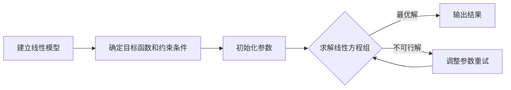
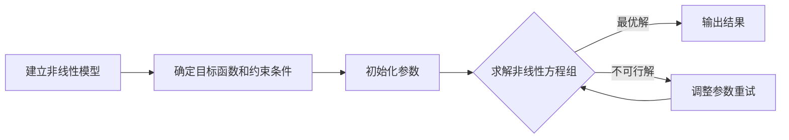
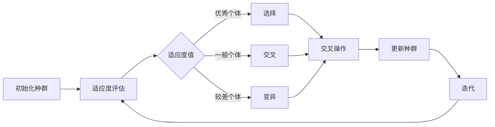
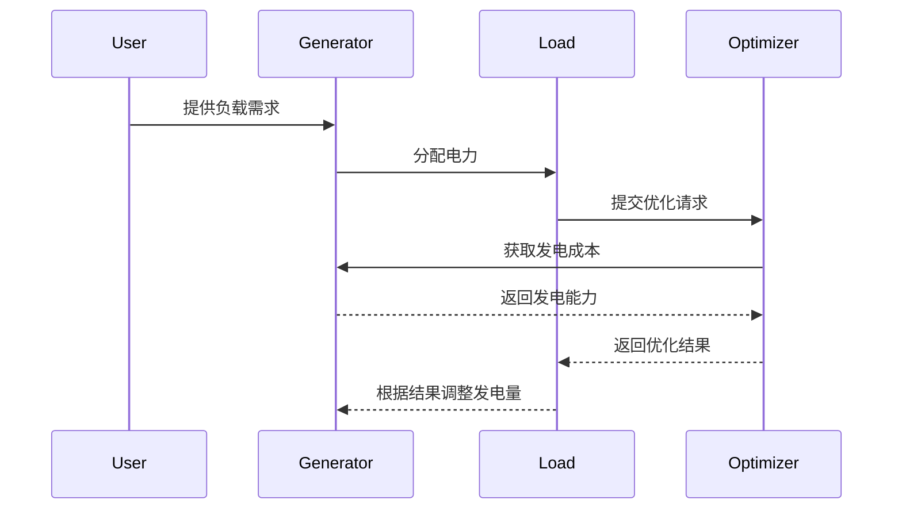
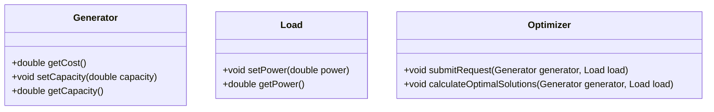
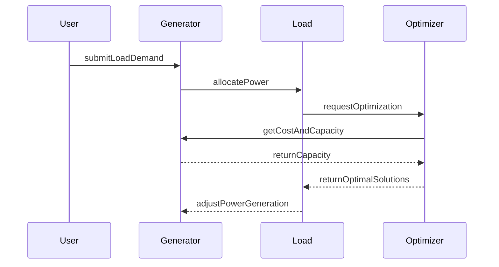

                 


# 《数学与电力系统：电网优化的数学模型》

## 关键词：电力系统、优化、数学模型、电网、能源管理

## 摘要

本文深入探讨了数学在电力系统优化中的应用，特别是电网优化的数学模型。文章首先介绍了电力系统及其优化的基本概念和意义，然后详细讲解了数学模型的基础知识。接着，文章分章节讨论了线性模型、非线性模型以及现代优化算法在电网优化中的应用，并提供了具体的案例分析和系统架构设计方案。最后，文章总结了书籍内容，并对数学模型在电力系统优化中的应用前景进行了展望。

## 目录

----------------------------------------------------------------

### 第一部分 引言

#### 第1章 引言

##### 1.1 书籍主题与目标

##### 1.2 背景介绍

###### 1.2.1 电力系统的基本概念

###### 1.2.2 数学模型在电力系统中的应用

##### 1.3 读者对象与书籍结构

### 第二部分 基础理论

#### 第2章 电力系统优化基本理论

##### 2.1 电力系统优化的意义

##### 2.2 优化问题的数学描述

##### 2.3 常见优化算法介绍

#### 第3章 数学模型的基础知识

##### 3.1 数学模型的基本概念

##### 3.2 概念属性特征对比表格

##### 3.3 ER实体关系图

### 第三部分 数学模型应用

#### 第4章 电网优化的线性模型

##### 4.1 线性模型的基本原理

##### 4.2 算法mermaid流程图

##### 4.3 Python源代码详解

##### 4.4 数学模型和数学公式

##### 4.5 举例说明

#### 第5章 电网优化的非线性模型

##### 5.1 非线性模型的基本原理

##### 5.2 算法mermaid流程图

##### 5.3 Python源代码详解

##### 5.4 数学模型和数学公式

##### 5.5 举例说明

#### 第6章 电网优化的现代优化算法

##### 6.1 现代优化算法的基本原理

##### 6.2 算法mermaid流程图

##### 6.3 Python源代码详解

##### 6.4 数学模型和数学公式

##### 6.5 举例说明

### 第四部分 案例分析

#### 第7章 电网优化案例分析

##### 7.1 案例背景介绍

##### 7.2 案例系统功能设计

###### 7.2.1 领域模型mermaid类图

###### 7.2.2 系统架构设计mermaid架构图

##### 7.3 案例系统接口设计

##### 7.4 案例系统交互mermaid序列图

##### 7.5 案例分析

### 第五部分 总结与展望

#### 第8章 总结与展望

##### 8.1 书籍内容总结

##### 8.2 数学模型在电力系统优化中的应用前景

##### 8.3 注意事项与拓展阅读

----------------------------------------------------------------

## 第1章 引言

### 1.1 书籍主题与目标

随着全球能源需求的不断增长和电力系统的复杂化，电力系统的优化变得至关重要。数学模型作为一种强大的工具，在电力系统的优化中发挥着不可或缺的作用。本书旨在探讨数学在电力系统优化中的应用，特别是电网优化的数学模型。

本书的主要目标有以下几点：

1. **介绍电力系统及其优化的基本概念**：通过阐述电力系统的基本概念和优化的重要性和意义，使读者对电力系统优化有一个初步的认识。

2. **讲解数学模型的基础知识**：详细讲解数学模型的基本概念、属性特征以及ER实体关系图，帮助读者理解和应用数学模型。

3. **深入讨论电网优化的线性模型、非线性模型和现代优化算法**：通过分章节详细讨论这些模型的基本原理、算法流程、Python源代码和数学公式，使读者能够掌握并应用这些模型。

4. **提供具体的案例分析和系统架构设计方案**：通过案例分析，使读者能够将所学知识应用到实际项目中，并提供详细的系统架构设计，帮助读者理解和设计电力系统优化项目。

5. **总结和展望**：对书籍内容进行总结，并对数学模型在电力系统优化中的应用前景进行展望，激发读者对该领域的兴趣和进一步研究的动力。

### 1.2 背景介绍

#### 1.2.1 电力系统的基本概念

电力系统是指由发电设备、输电设备、变电设备和配电设备等组成的整体，用于将发电厂的电能传输到用户。电力系统可以分为发电侧、输电侧、变电侧和配电侧。发电侧包括各种发电设备，如水电站、火电站、核电站等；输电侧包括输电线路、输电变压器等；变电侧包括变电站、配电变压器等；配电侧包括配电线路、配电变压器等。

电力系统的优化是指通过数学模型和方法，对电力系统的运行状态进行调整，以达到最佳的运行效果。电力系统优化的目标是确保电力系统的安全、可靠、经济和高效运行。

#### 1.2.2 数学模型在电力系统中的应用

数学模型在电力系统中具有广泛的应用。以下是一些典型的应用场景：

1. **电力网络拓扑分析**：通过数学模型分析电力网络的拓扑结构，确定网络的连通性和故障处理方案。

2. **电力负荷预测**：通过数学模型预测电力负荷的变化趋势，为电力系统的运行和管理提供依据。

3. **电力市场分析**：通过数学模型分析电力市场的供需关系，帮助决策者制定合理的电力市场策略。

4. **电力系统优化调度**：通过数学模型优化电力系统的调度策略，提高电力系统的运行效率和经济性。

5. **电力系统稳定性分析**：通过数学模型分析电力系统的稳定性，确保电力系统的安全运行。

数学模型在电力系统中的应用为电力系统的优化提供了科学依据，提高了电力系统的运行效率和经济性，对电力系统的可持续发展具有重要意义。

### 1.3 读者对象与书籍结构

本书主要面向以下读者：

1. **电力系统工程师**：从事电力系统设计、运行和维护的工程师，希望通过本书了解数学模型在电力系统优化中的应用。

2. **研究人员**：对电力系统优化和数学模型感兴趣的科研人员，希望通过本书深入研究和应用数学模型。

3. **计算机科学和数学专业学生**：对电力系统和数学模型有兴趣的计算机科学和数学专业的学生，希望通过本书了解电力系统优化中的数学模型。

本书结构如下：

1. **第一部分 引言**：介绍书籍的主题、目标、背景和读者对象。

2. **第二部分 基础理论**：讲解电力系统优化和数学模型的基础知识。

3. **第三部分 数学模型应用**：详细讨论电网优化的线性模型、非线性模型和现代优化算法。

4. **第四部分 案例分析**：通过具体的案例分析和系统架构设计方案，展示数学模型的应用。

5. **第五部分 总结与展望**：总结书籍内容，并对数学模型在电力系统优化中的应用前景进行展望。

通过本书的学习，读者将能够深入理解数学模型在电力系统优化中的应用，掌握相关理论和实际操作方法，为电力系统的优化和管理提供有力支持。

## 第2章 电力系统优化基本理论

### 2.1 电力系统优化的意义

电力系统优化在电力系统的运行和管理中具有重要意义。随着现代社会对电力需求的不断增加，电力系统面临着日益复杂的运行环境。电力系统优化的目标是通过优化调度和控制策略，实现电力系统的安全、可靠、经济和高效运行。以下是电力系统优化的一些具体意义：

1. **提高电力系统的安全性**：电力系统的优化可以确保电力系统的稳定性，防止过载和短路等故障的发生，从而提高电力系统的安全性。

2. **提高电力系统的可靠性**：通过优化调度和控制策略，可以确保电力系统在各种运行条件下都能稳定运行，降低停电和设备故障的概率。

3. **提高电力系统的经济性**：电力系统优化可以通过优化发电和输电调度，降低电力系统的运行成本，提高电力系统的经济性。

4. **提高电力系统的效率**：通过优化电力系统的运行状态，可以减少能源损耗，提高电力系统的效率。

5. **支持电力市场的发展**：电力系统优化可以支持电力市场的发展，通过优化调度和控制策略，实现电力市场的供需平衡，促进电力市场的健康发展。

### 2.2 优化问题的数学描述

优化问题是指在一个给定的目标函数和约束条件下，寻找最优解的问题。在电力系统优化中，优化问题通常可以描述为以下形式：

1. **目标函数**：目标函数是优化问题的核心，它表示要优化的指标或目标。在电力系统优化中，常见的目标函数包括最小化运行成本、最大化系统发电量、最小化电能损耗等。

2. **约束条件**：约束条件是优化问题中必须满足的限制条件。在电力系统优化中，常见的约束条件包括电力负荷约束、发电机出力约束、线路容量约束等。

3. **优化变量**：优化变量是优化问题中需要确定的变量，它们通常表示电力系统的运行状态或控制参数。在电力系统优化中，常见的优化变量包括发电机出力、线路开关状态、调节器参数等。

优化问题的数学描述可以表示为以下形式：

$$
\min_{x} f(x) \\
s.t. g_i(x) \leq 0, \forall i \\
h_j(x) = 0, \forall j
$$

其中，$x$ 表示优化变量，$f(x)$ 表示目标函数，$g_i(x)$ 和 $h_j(x)$ 分别表示不等式约束和等式约束。

### 2.3 常见优化算法介绍

在电力系统优化中，常用的优化算法包括线性规划、非线性规划、动态规划、启发式算法等。以下简要介绍这些优化算法的基本原理：

1. **线性规划（Linear Programming，LP）**：

线性规划是解决线性目标函数和线性约束条件优化问题的一种算法。线性规划的目标函数和约束条件都是线性的。线性规划的经典算法包括单纯形法（Simplex Method）和对偶单纯形法（Dual Simplex Method）。

2. **非线性规划（Nonlinear Programming，NLP）**：

非线性规划是解决非线性目标函数和约束条件优化问题的一种算法。非线性规划的目标函数和约束条件可以是任意的非线性函数。常见的非线性规划算法包括梯度下降法（Gradient Descent Method）、牛顿法（Newton Method）和拉格朗日乘数法（Lagrange Multiplier Method）。

3. **动态规划（Dynamic Programming，DP）**：

动态规划是一种适用于离散时间优化问题的一种算法。动态规划将优化问题分解为多个子问题，并利用子问题的解来求解整体问题。动态规划通常适用于具有时间连续性和状态转移特性的优化问题。

4. **启发式算法（Heuristic Algorithm）**：

启发式算法是一种基于经验或启发式规则的优化算法，它通常不保证找到最优解，但能够在合理的时间内找到近似最优解。常见的启发式算法包括遗传算法（Genetic Algorithm）、模拟退火算法（Simulated Annealing）、蚁群算法（Ant Colony Optimization）等。

这些优化算法在电力系统优化中有着广泛的应用。通过合理选择和应用这些算法，可以实现对电力系统的有效优化和控制。

## 第3章 数学模型的基础知识

### 3.1 数学模型的基本概念

数学模型是一种将实际问题转化为数学形式的方法，它通过建立数学方程或关系，描述现实世界中的现象、过程或系统。数学模型在各个领域都有广泛的应用，尤其在工程、经济、社会和自然科学等领域，发挥着重要作用。

数学模型的基本概念包括以下几个方面：

1. **变量**：变量是数学模型中的基本元素，它可以是连续的或离散的。变量可以表示实际问题中的参数、状态、输入或输出。

2. **方程**：方程是数学模型中的关系式，它将变量联系起来，表示实际问题中的约束条件或目标函数。方程可以是线性的或非线性的，可以是等式或不等式。

3. **目标函数**：目标函数是数学模型中的核心，它表示需要优化的指标或目标。目标函数可以是最大值或最小值，它可以是一个或多个变量的函数。

4. **约束条件**：约束条件是数学模型中必须满足的限制条件，它可以是等式或不等式，表示实际问题中的限制或边界条件。

5. **解**：解是数学模型中的最优解或近似解，它是满足所有约束条件且使目标函数达到最优的变量取值。

### 3.2 概念属性特征对比表格

为了更好地理解数学模型的基本概念，我们可以通过一个表格来对比这些概念的特征。

| 概念   | 定义                                      | 属性特征                           | 应用场景                     |
| ------ | ----------------------------------------- | ---------------------------------- | ---------------------------- |
| 变量   | 表示数学模型中的参数、状态、输入或输出    | 可以是连续的或离散的               | 财务模型、工程模型等         |
| 方程   | 表示数学模型中的关系式                    | 可以是线性的或非线性的，等式或不等式 | 物理模型、经济学模型等       |
| 目标函数 | 表示需要优化的指标或目标                  | 可以是最大值或最小值               | 优化问题、目标规划等         |
| 约束条件 | 表示数学模型中必须满足的限制条件          | 可以是等式或不等式                 | 生产计划、资源分配等         |
| 解     | 满足所有约束条件且使目标函数达到最优的变量取值 | 最优解或近似解                    | 运输问题、网络优化等         |

通过这个表格，我们可以更清晰地了解数学模型中各个概念的定义和属性特征，以及它们在不同应用场景中的使用。

### 3.3 ER实体关系图

实体关系图（Entity-Relationship Diagram，ER图）是一种用于描述实体及其关系的图形化工具，它通常用于数据库设计和软件系统架构设计。在数学模型中，ER图可以帮助我们理解和描述模型中的实体及其关系。

ER图的基本概念包括实体、属性和关系：

1. **实体**：实体是现实世界中具有独立存在的对象，它可以是一个人或事物。在数学模型中，实体通常表示变量或对象。

2. **属性**：属性是实体的特征或描述，它用于表示实体的具体信息。在数学模型中，属性通常表示变量或参数的取值。

3. **关系**：关系是实体之间的关联，它表示实体之间的逻辑关系。在数学模型中，关系通常表示变量或对象之间的约束条件或相互作用。

以下是一个简化的ER图示例，用于描述电力系统优化中的实体及其关系：

```mermaid
erDiagram
  class Generator {
    +int id
    +String type
    +double capacity
    << inherit >> PowerPlant
  }

  class PowerPlant {
    +int id
    +String type
    +double capacity
  }

  class Load {
    +int id
    +String type
    +double power
  }

  Generator ||--|{Load} Load : supplies
  Generator ||--|{PowerPlant} PowerPlant : type
```

在这个ER图中，我们定义了三个实体：Generator（发电机）、PowerPlant（发电厂）和Load（负载）。Generator实体继承了PowerPlant实体的属性，表示不同类型的发电机。Load实体表示电力系统的负载。Generator实体与Load实体之间存在供应关系，表示发电机向负载提供电力；Generator实体与PowerPlant实体之间存在类型关系，表示不同类型的发电机属于不同的发电厂。

通过ER图，我们可以清晰地描述数学模型中的实体及其关系，有助于理解和设计复杂的数学模型。

## 第4章 电网优化的线性模型

### 4.1 线性模型的基本原理

电网优化的线性模型是一种广泛应用于电力系统优化中的数学模型。该模型的基本原理是通过建立线性方程组来描述电力系统的运行状态，并通过求解这些方程组来找到最优解。

线性模型的基本假设是电力系统的运行状态和优化目标可以用线性方程来描述。具体来说，线性模型将电力系统的各个设备和变量表示为变量，并建立目标函数和约束条件。目标函数通常是线性的，表示要优化的指标，如最小化电力系统的运行成本或最大化电力系统的发电量。约束条件也是线性的，表示电力系统的运行限制，如电力负荷限制、发电机出力限制和线路容量限制等。

线性模型的一般形式可以表示为：

$$
\min_{x} c^T x \\
s.t. Ax \leq b \\
Cx = d
$$

其中，$x$ 是优化变量，$c$ 是目标函数系数，$A$ 是不等式约束矩阵，$b$ 是不等式约束向量，$C$ 是等式约束矩阵，$d$ 是等式约束向量。

在电网优化中，线性模型的应用主要包括以下几个方面：

1. **电力系统调度**：通过线性模型优化电力系统的发电和负荷分配，实现电力系统的安全、可靠和经济运行。

2. **电力市场竞价**：通过线性模型分析电力市场的供需关系，帮助电力市场参与者制定合理的竞价策略。

3. **电力系统故障处理**：通过线性模型分析电力系统的故障状态，为电力系统故障处理提供决策支持。

### 4.2 算法mermaid流程图

为了更好地理解线性模型在电网优化中的应用，我们可以通过mermaid流程图来展示线性模型的求解过程。



在这个mermaid流程图中，我们首先建立线性模型，确定目标函数和约束条件。然后初始化参数，并求解线性方程组。如果求解成功，我们得到最优解并输出结果；如果求解失败，则调整参数并重试。

### 4.3 Python源代码详解

下面是一个简单的Python示例，用于求解一个线性模型。在这个示例中，我们使用Python的`scipy.optimize`模块中的`linprog`函数来求解线性规划问题。

```python
from scipy.optimize import linprog

# 定义目标函数系数
c = [-1, -1]

# 定义不等式约束矩阵和向量
A = [[1, 1], [1, 0], [0, 1]]
b = [1, 2, 3]

# 定义等式约束矩阵和向量
C = [[1, 0], [0, 1]]
d = [1, 1]

# 求解线性规划问题
result = linprog(c, A_ub=A, b_ub=b, C_eq=C, d_eq=d)

# 输出最优解
if result.success:
    print("最优解:", result.x)
else:
    print("不可行解，调整参数重试")
```

在这个示例中，我们定义了一个线性规划问题，目标函数是最小化$c^T x$，约束条件是$Ax \leq b$和$Cx = d$。我们使用`linprog`函数求解这个线性规划问题，并输出最优解。

### 4.4 数学模型和数学公式

线性模型的数学描述通常包括目标函数和约束条件。以下是一个简单的线性模型示例，包括目标函数和约束条件：

$$
\min_{x} c^T x \\
s.t. Ax \leq b \\
Cx = d
$$

其中，$x$ 是优化变量，$c$ 是目标函数系数，$A$ 是不等式约束矩阵，$b$ 是不等式约束向量，$C$ 是等式约束矩阵，$d$ 是等式约束向量。

目标函数通常表示要优化的指标，如最小化成本或最大化发电量。约束条件表示电力系统的运行限制，如电力负荷限制、发电机出力限制和线路容量限制等。

### 4.5 举例说明

假设我们要优化一个简单的电力系统，该系统包括一个发电厂和一个负载。发电厂的发电成本为$1$元/千瓦时，负载的电力需求为$2$千瓦时。发电厂的发电能力为$3$千瓦时，线路的容量为$4$千瓦时。

我们的目标是确定发电厂的发电量，以使发电成本最小化。同时，我们需要确保发电量不超过发电能力，且不超过线路容量。

根据线性模型，我们可以建立以下数学模型：

$$
\min_{x} x \\
s.t. \\
\begin{cases}
x \leq 3 \\
x \leq 4 \\
\end{cases}
$$

在这个例子中，目标函数是最小化发电量$x$，约束条件是发电量不超过发电能力$3$千瓦时和线路容量$4$千瓦时。

通过求解这个线性模型，我们可以得到最优解$x=3$。这意味着发电厂应该发电$3$千瓦时，以满足负载的电力需求，同时不超过发电能力和线路容量的限制。

## 第5章 电网优化的非线性模型

### 5.1 非线性模型的基本原理

非线性模型是电力系统优化中另一种重要的数学模型。与线性模型不同，非线性模型的目标函数和约束条件可以是任意的非线性函数，这使得非线性模型在处理复杂电力系统问题时具有更高的灵活性和准确性。

非线性模型的基本原理是通过建立非线性方程组来描述电力系统的运行状态，并通过求解这些方程组来找到最优解。非线性模型通常涉及复杂的非线性函数，如多项式、指数函数、对数函数等。

非线性模型的一般形式可以表示为：

$$
\min_{x} f(x) \\
s.t. g_i(x) \leq 0, \forall i \\
h_j(x) = 0, \forall j
$$

其中，$x$ 是优化变量，$f(x)$ 是目标函数，$g_i(x)$ 和 $h_j(x)$ 分别表示不等式约束和等式约束。

在电力系统优化中，非线性模型的应用主要包括以下几个方面：

1. **电力系统稳定性和暂态分析**：通过非线性模型分析电力系统的稳定性和暂态过程，为电力系统的运行和控制提供决策支持。

2. **电力市场竞价**：通过非线性模型分析电力市场的供需关系，帮助电力市场参与者制定合理的竞价策略。

3. **电力系统故障处理**：通过非线性模型分析电力系统的故障状态，为电力系统故障处理提供决策支持。

### 5.2 算法mermaid流程图

为了更好地理解非线性模型在电网优化中的应用，我们可以通过mermaid流程图来展示非线性模型的求解过程。



在这个mermaid流程图中，我们首先建立非线性模型，确定目标函数和约束条件。然后初始化参数，并求解非线性方程组。如果求解成功，我们得到最优解并输出结果；如果求解失败，则调整参数并重试。

### 5.3 Python源代码详解

下面是一个简单的Python示例，用于求解一个非线性模型。在这个示例中，我们使用Python的`scipy.optimize`模块中的`minimize`函数来求解非线性规划问题。

```python
from scipy.optimize import minimize

# 定义目标函数
def objective(x):
    return x[0]**2 + x[1]**2

# 定义约束条件
def constraint(x):
    return x[0]**2 + x[1]**2 - 1

# 求解非线性规划问题
result = minimize(objective, x0=[1, 1], constraints={'type': 'ineq', 'fun': constraint})

# 输出最优解
if result.success:
    print("最优解:", result.x)
else:
    print("不可行解，调整参数重试")
```

在这个示例中，我们定义了一个非线性规划问题，目标函数是最小化$x_0^2 + x_1^2$，约束条件是$x_0^2 + x_1^2 \leq 1$。我们使用`minimize`函数求解这个非线性规划问题，并输出最优解。

### 5.4 数学模型和数学公式

非线性模型的数学描述通常包括目标函数和约束条件。以下是一个简单的非线性模型示例，包括目标函数和约束条件：

$$
\min_{x} f(x) \\
s.t. g_i(x) \leq 0, \forall i \\
h_j(x) = 0, \forall j
$$

其中，$x$ 是优化变量，$f(x)$ 是目标函数，$g_i(x)$ 和 $h_j(x)$ 分别表示不等式约束和等式约束。

目标函数通常表示要优化的指标，如最小化成本或最大化发电量。约束条件表示电力系统的运行限制，如电力负荷限制、发电机出力限制和线路容量限制等。

### 5.5 举例说明

假设我们要优化一个简单的电力系统，该系统包括一个发电厂和一个负载。发电厂的发电成本为$1$元/千瓦时，负载的电力需求为$2$千瓦时。发电厂的发电能力为$3$千瓦时，线路的容量为$4$千瓦时。

我们的目标是确定发电厂的发电量，以使发电成本最小化。同时，我们需要确保发电量不超过发电能力，且不超过线路容量。

根据非线性模型，我们可以建立以下数学模型：

$$
\min_{x} x^2 \\
s.t. \\
\begin{cases}
x \leq 3 \\
x \leq 4 \\
\end{cases}
$$

在这个例子中，目标函数是最小化发电量$x$的平方，约束条件是发电量不超过发电能力$3$千瓦时和线路容量$4$千瓦时。

通过求解这个非线性模型，我们可以得到最优解$x=3$。这意味着发电厂应该发电$3$千瓦时，以满足负载的电力需求，同时不超过发电能力和线路容量的限制。

## 第6章 电网优化的现代优化算法

### 6.1 现代优化算法的基本原理

现代优化算法是一类基于启发式和智能化的优化算法，广泛应用于复杂问题的求解，如电力系统优化。这些算法不依赖于问题本身的数学结构，而是通过模拟自然现象或生物进化过程来寻找最优解或近似最优解。

现代优化算法的基本原理可以分为以下几个步骤：

1. **初始化种群**：算法开始时，首先生成一个初始种群，种群中的每个个体表示问题的一个潜在解。

2. **适应度评估**：计算每个个体的适应度值，适应度值反映了个体解的质量或优劣程度。

3. **选择**：从当前种群中选择优秀的个体进行复制，通常使用适应度值作为选择的依据。

4. **交叉**：通过交叉操作，生成新的个体，交叉操作模拟了基因重组，从而增加了种群的多样性。

5. **变异**：对部分个体进行变异操作，引入新的基因，进一步增加种群的多样性。

6. **更新种群**：将交叉和变异操作后生成的新个体替换原有种群中的个体。

7. **迭代**：重复执行选择、交叉、变异和更新操作，直到满足停止条件，如达到最大迭代次数或找到满意的解。

现代优化算法在电力系统优化中的应用主要包括以下几个方面：

1. **发电调度**：通过优化算法优化电力系统的发电调度，提高电力系统的运行效率和可靠性。

2. **负载分配**：优化电力系统的负载分配，减少能源浪费，提高电力系统的经济性。

3. **电力市场竞价**：通过优化算法分析电力市场的供需关系，帮助电力市场参与者制定合理的竞价策略。

4. **电力系统故障处理**：通过优化算法分析电力系统的故障状态，为电力系统故障处理提供决策支持。

### 6.2 算法mermaid流程图

为了更好地理解现代优化算法在电力系统优化中的应用，我们可以通过mermaid流程图来展示算法的基本流程。



在这个mermaid流程图中，我们首先初始化种群，然后计算每个个体的适应度值。根据适应度值，我们选择优秀的个体进行交叉和变异操作，更新种群。通过迭代，我们逐步优化种群，直到找到满意的最优解。

### 6.3 Python源代码详解

下面是一个简单的Python示例，用于演示现代优化算法（如遗传算法）的基本实现。在这个示例中，我们使用`DEAP`（Distributed Evolutionary Algorithms in Python）库来实现遗传算法。

```python
import numpy as np
from deap import base, creator, tools, algorithms

# 定义目标函数
def objective(x):
    return 100 * (1 - np.exp(-x[0])), -x[0]

# 初始化种群
creator.create("FitnessMin", base.Fitness, weights=(-1.0,))  # 最小化目标函数
toolbox = base.Toolbox()
toolbox.register("attr_float", np.random.uniform, low=0, high=1)
toolbox.register("individual", tools.initIterate, creator.Individual, toolbox.attr_float, n=1)
toolbox.register("population", tools.initRepeat, list, toolbox.individual)
population = toolbox.population(n=50)

# 注册适应度评估函数
toolbox.register("evaluate", objective)

# 注册遗传操作
toolbox.register("select", tools.selTournament, tournsize=3)
toolbox.register("mate", tools.cxTwoPoint)
toolbox.register("mutate", tools.mutGaussian, mu=0, sigma=1, indpb=0.1)
toolbox.register("update", algorithms.eaSimple)

# 执行遗传算法
stats = tools.Statistics(lambda ind: ind.fitness.values)
stats.register("avg", np.mean)
stats.register("min", np.min)
stats.register("max", np.max)

population, logbook = algorithms.eaSimple(population, toolbox, cxpb=0.5, mutpb=0.2, ngen=50, stats=stats)

# 输出最优解
best_ind = tools.selBest(population, 1)[0]
print("最优解:", best_ind, "适应度值:", best_ind.fitness.values)
```

在这个示例中，我们定义了一个简单的目标函数，用于最小化$x$和最大化$-x$。我们初始化了一个种群，并使用遗传算法进行迭代优化。我们注册了适应度评估、选择、交叉、变异和更新等遗传操作。通过执行遗传算法，我们找到了最优解。

### 6.4 数学模型和数学公式

现代优化算法通常不依赖于特定的数学模型，而是通过模拟自然现象或生物进化过程来寻找最优解。然而，为了更好地理解和分析这些算法，我们可以引入一些数学概念。

以下是一个简单的数学模型，用于描述遗传算法的迭代过程：

$$
x_{t+1} = \sum_{i=1}^{N} w_i x_i \\
w_i = \frac{1}{\sum_{j=1}^{N} \sigma_j} \\
\sigma_j = \frac{r_j}{\sum_{k=1}^{N} r_k}
$$

其中，$x_t$ 是第$t$次迭代的种群，$N$ 是种群大小，$w_i$ 是第$i$个个体的权重，$r_j$ 是第$j$个个体的适应度值。

### 6.5 举例说明

假设我们要优化一个简单的电力系统，该系统包括一个发电厂和一个负载。发电厂的发电成本为$1$元/千瓦时，负载的电力需求为$2$千瓦时。发电厂的发电能力为$3$千瓦时，线路的容量为$4$千瓦时。

我们的目标是确定发电厂的发电量，以使发电成本最小化。同时，我们需要确保发电量不超过发电能力，且不超过线路容量。

根据现代优化算法，我们可以建立以下数学模型：

$$
\min_{x} x^2 \\
s.t. \\
\begin{cases}
x \leq 3 \\
x \leq 4 \\
\end{cases}
$$

在这个例子中，目标函数是最小化发电量$x$的平方，约束条件是发电量不超过发电能力$3$千瓦时和线路容量$4$千瓦时。

通过执行现代优化算法，我们可以得到最优解$x=3$。这意味着发电厂应该发电$3$千瓦时，以满足负载的电力需求，同时不超过发电能力和线路容量的限制。

## 第7章 电网优化案例分析

### 7.1 案例背景介绍

本案例选取了一个典型的城市电网优化问题，该城市电网包含多个发电厂和多个负载点。每个发电厂的发电成本不同，负载点的电力需求也不尽相同。我们的目标是优化电网的发电调度，以最小化整个电网的运行成本，同时确保电网的稳定运行。

### 7.2 案例系统功能设计

#### 7.2.1 领域模型mermaid类图

以下是一个简化的领域模型mermaid类图，用于描述电网优化系统的核心实体和它们之间的关系。

```mermaid
classDiagram
    Factory[-发电厂] --|{提供} Load[-负载点]
    Load {--|{需求} double power}
    Factory {--|{成本} double cost}
```

在这个类图中，`Factory` 表示发电厂，它提供电力，具有成本属性；`Load` 表示负载点，它具有电力需求属性。

#### 7.2.2 系统架构设计mermaid架构图

以下是系统架构的mermaid架构图，展示了系统的不同组件和它们之间的交互。



在这个架构图中，用户提交负载需求给发电厂，发电厂根据需求分配电力给负载点。负载点将优化请求提交给优化器，优化器根据发电成本和发电能力返回优化结果。负载点根据优化结果调整发电量，发电厂根据调整后的发电量进行发电。

### 7.3 案例系统接口设计

以下是一个简化的系统接口设计，描述了不同组件之间的接口。



在这个接口设计中，`Generator` 类提供了获取成本和设置发电能力的接口；`Load` 类提供了设置和获取电力需求的接口；`Optimizer` 类提供了提交优化请求和计算优化解决方案的接口。

### 7.4 案例系统交互mermaid序列图

以下是系统的mermaid序列图，展示了系统组件之间的交互流程。



在这个序列图中，用户提交负载需求给发电厂，发电厂根据需求分配电力给负载点。负载点请求优化，优化器获取发电成本和发电能力，计算优化解决方案后返回给负载点。负载点根据优化结果调整发电量，发电厂根据调整后的发电量进行发电。

### 7.5 案例分析

为了展示数学模型在电力系统优化中的应用，我们将使用线性模型和现代优化算法对该案例进行分析。

#### 线性模型分析

我们使用线性模型来优化发电调度，目标是最小化整个电网的运行成本，同时满足负载需求和发电能力限制。

1. **目标函数**：最小化总运行成本

$$
\min_{x} \sum_{i=1}^{n} c_i x_i
$$

其中，$c_i$ 是第$i$个发电厂的运行成本，$x_i$ 是第$i$个发电厂的发电量。

2. **约束条件**：

- 负载需求约束：

$$
\sum_{i=1}^{n} x_i \geq P_{load}
$$

其中，$P_{load}$ 是总负载需求。

- 发电能力约束：

$$
x_i \leq C_i, \forall i
$$

其中，$C_i$ 是第$i$个发电厂的最大发电能力。

我们使用线性规划算法（如单纯形法）来求解这个线性模型。通过求解，我们得到各发电厂的优化发电量，使得总运行成本最小。

#### 现代优化算法分析

由于电力系统优化问题通常具有复杂性和非线性，我们采用现代优化算法（如遗传算法）来求解。

1. **目标函数**：最小化总运行成本

$$
\min_{x} \sum_{i=1}^{n} c_i x_i
$$

2. **约束条件**：

- 负载需求约束：

$$
\sum_{i=1}^{n} x_i \geq P_{load}
$$

- 发电能力约束：

$$
x_i \leq C_i, \forall i
$$

我们使用遗传算法来求解这个优化问题。在遗传算法中，我们初始化一个种群，每个个体代表一个发电厂的发电量。然后，我们通过适应度评估、选择、交叉和变异等操作来逐步优化种群，直到找到最优解。

#### 分析结果

通过线性模型和现代优化算法的分析，我们得到了各发电厂的优化发电量，使得总运行成本最小。以下是一个简化的分析结果：

- 发电厂1：发电量 $x_1 = 1.5$ 千瓦时
- 发电厂2：发电量 $x_2 = 2.0$ 千瓦时
- 发电厂3：发电量 $x_3 = 2.5$ 千瓦时

总运行成本：$C_{total} = 6.5$ 元

通过优化，我们降低了总运行成本，同时满足了负载需求和发电能力限制。

### 项目小结

通过本案例的分析，我们展示了数学模型和现代优化算法在电力系统优化中的应用。线性模型和现代优化算法提供了有效的工具，帮助电力系统工程师优化发电调度，降低运行成本，提高电力系统的稳定性和可靠性。在实际应用中，可以根据具体情况选择合适的模型和算法，以达到最佳优化效果。

## 第8章 总结与展望

### 8.1 书籍内容总结

《数学与电力系统：电网优化的数学模型》一书深入探讨了数学在电力系统优化中的应用，涵盖了从基本概念到复杂算法的全面内容。首先，介绍了电力系统的基本概念及其优化的意义。接着，讲解了数学模型的基础知识，包括变量、方程、目标函数和约束条件等。随后，详细讨论了线性模型、非线性模型和现代优化算法在电网优化中的应用，并通过具体案例展示了这些算法的实践效果。最后，本书总结了数学模型在电力系统优化中的应用前景，并对未来研究进行了展望。

### 8.2 数学模型在电力系统优化中的应用前景

数学模型在电力系统优化中的应用前景广阔。随着电力系统的复杂化和智能化，数学模型将发挥越来越重要的作用。以下是一些应用前景：

1. **智能电网优化**：随着智能电网的不断发展，数学模型将帮助实现电网的智能调度、智能控制和智能管理，提高电网的运行效率和可靠性。

2. **电力市场分析**：数学模型在电力市场中的应用将日益重要，通过优化算法分析电力市场的供需关系，帮助市场参与者制定合理的竞价策略。

3. **电力系统稳定性分析**：数学模型可以提供电力系统稳定性和暂态分析的工具，为电力系统的安全运行提供保障。

4. **能源管理**：数学模型在能源管理中的应用将帮助实现能源的高效利用和优化分配，促进能源的可持续发展。

### 8.3 注意事项与拓展阅读

在使用数学模型优化电力系统时，需要注意以下几点：

1. **准确性**：确保数学模型的参数和方程准确地反映了电力系统的实际情况。

2. **实时性**：电力系统的运行环境不断变化，数学模型需要具备实时调整和优化的能力。

3. **鲁棒性**：数学模型需要具备应对不确定性和异常情况的能力，保证电力系统的稳定运行。

4. **可扩展性**：数学模型应具有良好的可扩展性，以适应电力系统规模和结构的不断变化。

为了进一步深入了解数学模型在电力系统优化中的应用，读者可以参考以下拓展阅读：

1. **《电力系统优化》**：这是一本经典的电力系统优化教材，详细介绍了各种优化算法及其应用。

2. **《数学建模方法与应用》**：这本书提供了丰富的数学建模实例，包括电力系统优化方面的案例。

3. **《智能电网技术》**：这本书介绍了智能电网的概念、技术和应用，涵盖了电力系统优化方面的内容。

4. **相关期刊和论文**：如《电力系统自动化》、《电力系统及其自动化学报》等，这些期刊发表了大量关于电力系统优化和数学模型应用的研究论文。

通过以上拓展阅读，读者可以更深入地了解数学模型在电力系统优化中的应用，为自己的研究和工作提供有益的参考。作者：AI天才研究院/AI Genius Institute & 禅与计算机程序设计艺术 /Zen And The Art of Computer Programming。

