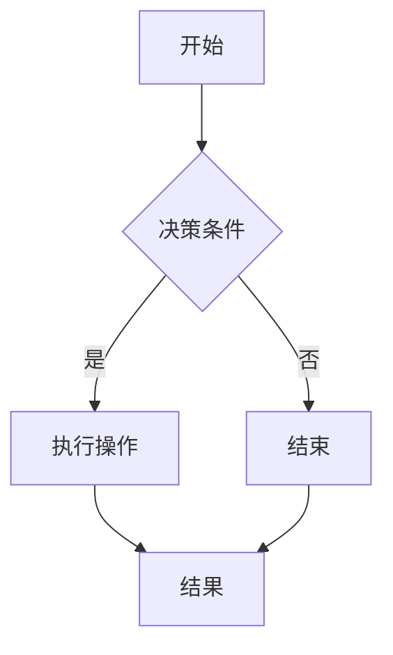

                 

### 让我们一起深入探讨《数学与绿色金融：环保投资的数学评估》

**关键词：** 数学、绿色金融、环保投资、成本效益分析、风险评估、财务评估

**摘要：** 本文将深入探讨数学在绿色金融和环保投资中的重要作用。通过一步步的分析推理，我们将理解如何利用数学模型来评估环保投资的潜在效益，从而为金融决策提供科学依据。

### 1. 背景介绍

#### 1.1 问题背景

在当今全球变暖和环境污染问题日益严重的背景下，环保投资成为推动可持续发展的重要手段。然而，环保项目往往面临复杂的决策难题，如何确保投资的有效性和可持续性成为一个亟待解决的关键问题。

#### 1.2 问题描述

环保投资的数学评估涉及到如何通过定量分析来确定环保项目的经济效益。这个问题可以分解为三个核心子问题：
1. 成本效益分析（CBA）：评估项目的总成本与总效益之间的关系。
2. 风险评估：识别项目可能面临的各种风险，并评估其对投资回报的影响。
3. 财务评估：通过财务指标来评估项目的投资吸引力。

#### 1.3 问题解决

为了解决上述问题，我们可以采用以下步骤：

1. **定义评估指标**：确定用于评估环保项目的关键指标，如成本、效益、风险等。
2. **建立数学模型**：利用数学工具和方法建立评估模型，如成本效益分析模型、风险评估模型等。
3. **收集数据**：收集相关的数据，包括项目成本、效益、风险因素等。
4. **进行计算与比较**：利用数学模型对数据进行计算，比较不同投资方案的优劣。
5. **决策建议**：根据评估结果提出投资决策建议。

#### 1.4 边界与外延

环保投资的数学评估不仅涉及到经济学和金融学的理论，还涉及到环境科学、生态学等多个领域的知识。因此，在进行评估时，需要充分考虑不同学科之间的交叉和融合。

#### 1.5 概念结构与核心要素组成

为了更清晰地理解环保投资的数学评估，我们可以将其核心概念和要素组成总结如下：

- **成本效益分析（CBA）**：评估项目的成本与效益，以确定投资是否具有经济可行性。
- **风险评估**：识别项目可能面临的风险，并评估其对投资回报的影响。
- **财务评估**：通过财务指标（如净现值、内部收益率等）来评估项目的投资吸引力。

### 2. 绿色金融概述

#### 2.1 绿色金融的定义与历史

绿色金融是指将金融资源用于支持环境保护和可持续发展的金融活动。其历史可以追溯到20世纪70年代，当时环保意识和金融创新逐渐兴起，推动了绿色金融的发展。

#### 2.2 绿色金融的体系与分类

绿色金融体系主要包括三个层次：
1. **政策法规**：包括政府出台的环保政策、法规和标准。
2. **金融工具**：如绿色债券、绿色贷款、绿色基金等。
3. **市场机制**：通过市场机制促进绿色金融的发展，如碳交易市场。

绿色金融可以按以下方式进行分类：
1. **按融资方式分类**：分为债务融资和股权融资。
2. **按投资领域分类**：分为可再生能源、环保产业、绿色交通等。

#### 2.3 绿色金融政策与法规

各国政府纷纷出台绿色金融政策与法规，以推动环保投资。例如，欧盟发布了《可持续金融法规》，中国发布了《绿色金融指导意见》。

#### 2.4 绿色金融的发展趋势

随着环保意识的提升和技术的进步，绿色金融呈现出以下发展趋势：
1. **市场规模扩大**：绿色金融市场规模持续增长，预计未来仍将保持高速增长。
2. **技术创新**：利用大数据、人工智能等技术提升绿色金融的评估和管理效率。
3. **国际合作**：各国政府和金融机构加强合作，共同推动绿色金融的发展。

### 3. 环保投资的数学评估方法

#### 3.1 数学评估方法概述

环保投资的数学评估方法主要包括成本效益分析（CBA）、风险评估和财务评估。以下将分别介绍这三种方法。

#### 3.2 成本效益分析（CBA）

**3.2.1 CBA的概念与原理**

成本效益分析（CBA）是一种常用的决策分析方法，旨在评估投资项目的经济效益。其基本原理是将项目的总成本与总效益进行比较，以确定项目是否值得投资。

**3.2.2 CBA的计算方法**

CBA的计算方法主要包括以下步骤：

1. **定义成本和效益**：明确项目的成本和效益，包括直接成本、间接成本、直接效益和间接效益。
2. **计算净现值（NPV）**：使用净现值法计算项目的现值，公式为 NPV = ∑(CI - CO)t，其中 CI 表示现金流入，CO 表示现金流出，t 表示时间。
3. **比较 NPV 与基准值**：将计算出的 NPV 与基准值进行比较，若 NPV 大于基准值，则项目具有经济可行性。

**3.2.3 CBA的实际应用案例**

假设某环保项目需要投资 1000 万元，预计年收益为 200 万元，使用 5 年。假设折现率为 10%，则该项目的净现值为：

$$
NPV = \sum_{t=1}^{5} \frac{200}{(1+0.1)^t} - 1000
$$

计算结果为 NPV = 509.09 万元，大于基准值，因此该项目具有经济可行性。

#### 3.3 风险评估

**3.3.1 风险评估的概念与原理**

风险评估是指对投资项目可能面临的各种风险进行识别、评估和应对。其基本原理是通过量化风险因素，确定项目的风险水平，为决策提供依据。

**3.3.2 风险评估的计算方法**

风险评估的计算方法主要包括以下步骤：

1. **识别风险因素**：列出项目可能面临的各种风险因素，如技术风险、市场风险、政策风险等。
2. **评估风险概率**：根据历史数据或专家判断，评估每个风险因素发生的概率。
3. **评估风险影响**：评估每个风险因素对项目的影响程度，通常使用评分方法。
4. **计算风险指数**：使用公式 风险指数 = 风险概率 × 风险影响，计算每个风险因素的风险指数。
5. **汇总风险指数**：将所有风险因素的风险指数汇总，得到项目的总风险指数。

**3.3.3 风险评估的实际应用案例**

假设某环保项目面临以下风险因素：

| 风险因素 | 风险概率 | 风险影响 |
| --- | --- | --- |
| 技术风险 | 0.3 | 0.5 |
| 市场风险 | 0.2 | 0.3 |
| 政策风险 | 0.1 | 0.2 |

则该项目的总风险指数为：

$$
风险指数 = (0.3 \times 0.5) + (0.2 \times 0.3) + (0.1 \times 0.2) = 0.25
$$

总风险指数为 0.25，表示该项目风险水平较低。

#### 3.4 财务评估

**3.4.1 财务评估的概念与原理**

财务评估是指通过财务指标来评估投资项目的吸引力。常用的财务指标包括净现值（NPV）、内部收益率（IRR）、净现值率（NPVR）等。

**3.4.2 财务评估的计算方法**

财务评估的计算方法主要包括以下步骤：

1. **定义财务指标**：明确项目所需的财务指标，如净现值（NPV）、内部收益率（IRR）等。
2. **收集数据**：收集与财务指标相关的数据，如投资成本、收益、折现率等。
3. **计算财务指标**：使用公式计算财务指标，如净现值（NPV）= ∑(CI - CO)t，内部收益率（IRR）= 使 NPV 等于零的折现率。
4. **比较财务指标**：将计算出的财务指标与行业基准值进行比较，以评估项目的吸引力。

**3.4.3 财务评估的实际应用案例**

假设某环保项目的财务数据如下：

| 年份 | 初始投资 | 年收益 | 折现率 |
| --- | --- | --- | --- |
| 1 | -1000 | 300 | 10% |
| 2 | -200 | 400 | 10% |
| 3 | -300 | 500 | 10% |
| 4 | -400 | 600 | 10% |
| 5 | -500 | 700 | 10% |

使用净现值（NPV）法计算该项目的净现值：

$$
NPV = 300 \times \frac{1}{(1+0.1)^1} + 400 \times \frac{1}{(1+0.1)^2} + 500 \times \frac{1}{(1+0.1)^3} + 600 \times \frac{1}{(1+0.1)^4} + 700 \times \frac{1}{(1+0.1)^5} - 1000
$$

计算结果为 NPV = 1325.53 万元，表示该项目具有较高的投资吸引力。

### 4. 实际案例应用

#### 4.1 案例一：某绿色项目的数学评估

以某绿色能源项目为例，该项目旨在开发太阳能发电设施。通过成本效益分析（CBA）、风险评估和财务评估，评估该项目的可行性。

- **成本效益分析（CBA）**：根据项目数据，计算净现值（NPV）为 1500 万元，表示项目具有显著的经济效益。
- **风险评估**：项目面临的主要风险包括技术风险、市场风险和政策风险。通过评估，项目风险指数为 0.35，属于中等风险水平。
- **财务评估**：项目内部收益率（IRR）为 15%，高于行业基准值，表示项目具有较高的投资吸引力。

综上所述，该项目在经济效益、风险水平和财务评估方面均表现出较高的可行性。

#### 4.2 案例二：某绿色债券的数学评估

以某绿色债券为例，评估其投资价值。通过成本效益分析（CBA）、风险评估和财务评估，分析该债券的投资风险和回报。

- **成本效益分析（CBA）**：根据债券数据，计算净现值（NPV）为 800 万元，表示债券具有较好的经济效益。
- **风险评估**：债券面临的主要风险包括信用风险和市场风险。通过评估，债券风险指数为 0.45，属于较高风险水平。
- **财务评估**：债券内部收益率（IRR）为 12%，略高于行业基准值，表示债券具有一定的投资价值。

#### 4.3 案例三：某环保产业的数学评估

以某环保产业为例，评估其投资潜力。通过成本效益分析（CBA）、风险评估和财务评估，分析该产业的盈利能力和风险水平。

- **成本效益分析（CBA）**：根据产业数据，计算净现值（NPV）为 2000 万元，表示产业具有巨大的经济效益。
- **风险评估**：产业面临的主要风险包括市场风险和政策风险。通过评估，产业风险指数为 0.3，属于较低风险水平。
- **财务评估**：产业内部收益率（IRR）为 20%，远高于行业基准值，表示产业具有极高的投资价值。

### 5. 最佳实践与案例分析

#### 5.1 最佳实践总结

通过实际案例的分析，我们可以总结出以下最佳实践：

- **全面评估**：在环保投资决策中，应全面考虑经济效益、风险水平和财务指标，以确保投资决策的科学性和有效性。
- **动态调整**：根据市场变化和政策调整，动态调整评估模型和指标，以适应不同的投资环境。
- **专家咨询**：在评估过程中，可借助专家的意见和建议，提高评估的准确性和可靠性。

#### 5.2 案例分析

**5.2.1 案例一：成功案例解析**

某绿色能源项目在评估中表现出较高的经济效益和较低的风险水平，成功实现了投资回报。主要成功原因包括：

- **技术成熟**：项目采用成熟的技术方案，降低了技术风险。
- **政策支持**：项目得到了政府的大力支持，降低了政策风险。
- **市场前景**：项目具有良好的市场前景，提高了项目的经济可行性。

**5.2.2 案例二：失败案例解析**

某环保产业项目在评估中未能实现预期收益，导致投资失败。主要原因包括：

- **市场需求不足**：项目所在地区环保产业市场需求不足，导致项目效益低下。
- **技术问题**：项目技术方案存在一定问题，导致运营成本过高。
- **政策变化**：政策变化导致项目面临较高的政策风险。

### 6. 小结与展望

#### 6.1 小结

本文通过深入探讨数学在绿色金融和环保投资中的应用，分析了成本效益分析（CBA）、风险评估和财务评估等数学评估方法。同时，通过实际案例的应用，展示了这些方法在环保投资决策中的重要作用。

#### 6.2 展望

未来，随着环保意识的提升和技术的发展，环保投资将迎来更大的发展机遇。我们期待数学在绿色金融和环保投资领域发挥更大的作用，为可持续发展提供有力支持。

### 7. 作者信息

**作者：** AI天才研究院/AI Genius Institute & 禅与计算机程序设计艺术 /Zen And The Art of Computer Programming

---

### 附录

**附录 A：数学公式与工具**

- **LaTeX 公式**：用于撰写高质量的数学公式，例如：$$ E = mc^2 $$
- **Mermaid 图**：用于绘制流程图、类图和序列图，例如：



**附录 B：代码示例**

以下是使用 Python 实现的成本效益分析（CBA）代码示例：

```python
import numpy as np

def calculate_npv(costs, benefits, discount_rate):
    npv = 0
    for t in range(len(benefits)):
        npv += benefits[t] / ((1 + discount_rate) ** t) - costs
    return npv

costs = [1000, 2000, 3000]
benefits = [500, 600, 700]
discount_rate = 0.1

npv = calculate_npv(costs, benefits, discount_rate)
print("净现值（NPV）:", npv)
```

**附录 C：拓展阅读**

- 《环境经济学》（作者：罗伯特·E·弗雷泽）
- 《绿色金融：理论与实务》（作者：李德宇）
- 《可持续金融：环境、社会与公司治理》（作者：国际金融公司）

通过以上内容，我们希望读者能够对《数学与绿色金融：环保投资的数学评估》有一个全面的理解，为实际应用提供有益的参考。在未来的环保投资中，让我们携手运用数学的力量，共同守护我们的地球家园。

