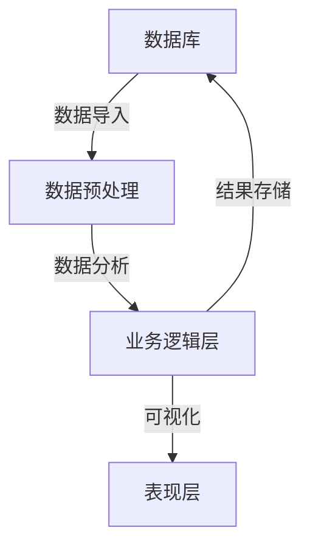

                 

### 数学与自然界的对称与分形结构

> 关键词：对称性、分形结构、数学模型、自然界应用

> 摘要：本文探讨了数学中的对称性与分形结构在自然界中的应用，解析了其背后的数学原理，并通过实例分析了这些概念在现代科学研究和技术发展中的实际应用。文章首先介绍了对称性与分形的基本概念，然后阐述了它们在数学、物理、生物学等领域的应用，并详细讲解了相关的数学模型和算法。最后，文章通过一个具体的系统分析与架构设计案例，展示了如何将这些理论应用于实际项目中。

## 第一部分：背景介绍

### 1.1 问题背景

在自然界和科学研究中，对称性和分形结构无处不在。从几何图形到生物体，从物理现象到宇宙结构，对称性呈现出一种普遍存在的美学和数学规律。分形则以其自相似性和无限嵌套的特性，描述了自然界中复杂现象的多样性。

对称性是自然界中一种基本的几何性质，广泛存在于自然界中的各种形态和结构中。例如，雪花晶体具有六角对称性，人类的DNA双螺旋结构具有轴对称性。对称性不仅在自然界中具有美学价值，还在科学研究中起着重要作用，例如在物理学中的对称性原理、化学中的分子结构对称性、生物学中的生物体对称性等。

分形几何学是由法国数学家曼德布罗特（Benoit Mandelbrot）在20世纪70年代提出的，它描述了自然界中许多不规则和复杂的现象。分形的自相似性意味着无论你放大还是缩小，它都具有相似的结构。分形结构在自然界中随处可见，如海岸线、树叶、云彩、河流网络等。

本文旨在探讨数学中的对称性与分形结构在自然界中的应用，解析其背后的数学原理，以及如何通过数学工具来理解和描述自然现象。研究内容将涉及对称性理论、分形几何学、以及它们在不同领域的应用。

### 1.2 问题描述

在自然界和科学研究中，如何利用对称性与分形结构来解释和描述各种现象？具体而言，对称性与分形结构在数学、物理、生物学等领域的应用是什么？本文将详细探讨这些问题，并通过实例分析来展示这些概念的实际应用。

### 1.3 问题解决

本文将通过以下步骤来解决问题：

1. **介绍对称性与分形的基本概念**：包括对称性的定义、分类以及在自然界中的应用；分形的定义、分类以及在自然界中的应用。
2. **阐述对称性与分形的关系**：探讨对称性在分形中的应用，以及分形在对称性中的应用。
3. **讲解对称性与分形的应用领域**：包括数学、物理、生物学、化学和计算机科学等领域的应用。
4. **详细讲解相关的数学模型和算法**：介绍对称性和分形的数学原理，并通过实例进行说明。
5. **通过系统分析与架构设计案例展示实际应用**：介绍一个具体的系统分析与架构设计案例，展示如何将对称性与分形结构应用于实际项目中。

### 1.4 边界与外延

本文将探讨对称性理论和分形几何学的基本概念，以及它们在数学、物理、生物学等领域的应用。研究将不局限于某一种理论或应用，而是全面覆盖对称与分形结构在自然界中的表现形式。

### 1.5 概念结构与核心要素组成

本文的核心概念包括对称性、分形、数学模型、自然界应用等。核心要素组成包括：

- **对称性理论**：包括对称性的定义、分类以及在自然界中的应用。
- **分形几何学**：包括分形的定义、分类以及在自然界中的应用。
- **数学模型和算法**：包括对称性与分形的数学描述、数学模型和算法。
- **应用领域**：包括数学、物理、生物学、化学和计算机科学等领域的应用实例。

## 第二部分：核心概念与联系

### 2.1 对称性理论

对称性是指图形、物体或系统在某种变换下保持不变的性质。这种变换可以是旋转、反射或平移。对称性在数学、物理、生物学等领域中都有着广泛的应用。

#### 2.1.1 对称性的定义

对称性是几何学中的一个基本概念，通常用数学语言来描述。一个图形、物体或系统如果满足在某个变换下保持不变，那么它就具有对称性。常见的对称变换包括旋转、反射和平移。

#### 2.1.2 对称性的分类

对称性可以分为点对称、轴对称和旋转对称等。点对称是指图形关于一个点的对称，轴对称是指图形关于一条轴线的对称，旋转对称是指图形关于一个点的旋转对称。

#### 2.1.3 对称性在自然界中的应用

对称性在自然界中有着广泛的应用，从生物体的对称性到几何图形的对称性，再到物理现象的对称性。

- **生物体的对称性**：许多生物体都具有对称性，例如人类的身体具有左右对称，蝴蝶的翅膀具有镜像对称。

- **几何图形的对称性**：许多几何图形都具有对称性，例如正方形具有四条轴对称，五角星具有五条轴对称。

- **物理现象的对称性**：在物理学中，许多现象也具有对称性，例如在量子力学中，宇称守恒定律指出物理定律在镜像变换下保持不变。

### 2.2 分形几何学

分形几何学是由法国数学家曼德布罗特（Benoit Mandelbrot）在20世纪70年代提出的，它描述了自然界中许多不规则和复杂的现象。分形的基本特征是自相似性和无限嵌套。

#### 2.2.1 分形的定义

分形是一种几何形状，它具有无限嵌套的结构，无论放大还是缩小，都具有相似的结构。常见的分形包括克氏鸟嘴、海岸线、树冠等。

#### 2.2.2 分形的分类

分形可以分为自相似分形、迭代函数系统（IFS）分形、随机分形等。自相似分形是指其部分与整体具有相似性，IFS分形是指通过迭代函数系统生成，随机分形是指通过随机过程生成。

#### 2.2.3 分形在自然界中的应用

分形在自然界中有着广泛的应用，如海岸线、树叶、河流网络、云彩等。这些自然现象都表现出分形的特征，例如海岸线具有无限长的曲线，树叶具有复杂的分支结构，河流网络具有自相似性。

### 2.3 对称性与分形的关系

对称性与分形结构之间有着紧密的联系。许多分形结构都展现出某种对称性，例如克氏鸟嘴具有旋转对称性，海岸线具有自相似性。同时，分形结构也可以用来描述具有复杂对称性的自然现象。

#### 2.3.1 对称性在分形中的应用

对称性在分形中的应用主要体现在分形的生成过程中。许多分形结构是通过迭代对称变换生成的，例如克氏鸟嘴是通过迭代旋转对称变换生成的。

#### 2.3.2 分形在对称性中的应用

分形结构可以用来描述具有复杂对称性的自然现象。例如，在物理学中，某些粒子的轨迹具有自相似性，这种自相似性可以通过分形结构来描述。

### 2.4 对称性与分形的应用领域

对称性与分形结构在数学、物理、生物学、化学和计算机科学等领域都有着广泛的应用。

#### 2.4.1 数学

在数学中，对称性理论是研究几何图形对称性质的基本工具，而分形几何学则提供了描述复杂几何形状的新方法。

#### 2.4.2 物理

在物理学中，对称性原理是研究物理现象的基本原则，例如在量子力学中，宇称守恒定律是描述基本粒子的运动规律的重要原则。分形结构在凝聚态物理、量子场论等领域也有着重要的应用。

#### 2.4.3 生物学

在生物学中，对称性在生物体的发育和进化中起着重要作用，例如在动物行为学中，镜像对称性是研究动物行为的重要指标。分形结构在生物学中的应用主要体现在细胞结构、生物网络等方面。

#### 2.4.4 化学

在化学中，对称性在分子结构中起着重要作用，例如在有机化学中，分子的对称性决定了其物理和化学性质。分形结构在化学反应中的扩散、反应速率等方面也有着重要的应用。

#### 2.4.5 计算机科学

在计算机科学中，对称性与分形结构在图像处理、数据压缩、算法设计等方面都有着广泛的应用。例如，在图像处理中，对称性可以帮助识别图像中的物体，而分形图像压缩可以有效地减少图像数据的大小。

## 第三部分：数学模型和算法原理讲解

### 3.1 对称性原理

对称性原理是研究几何图形或系统在某种变换下保持不变的性质。这种变换可以是旋转、反射或平移。

#### 3.1.1 对称变换

对称变换包括旋转、反射和平移等。旋转是指将图形绕一个点旋转一定角度，反射是指将图形关于一个轴对称，平移是指将图形沿一个方向移动一定距离。

#### 3.1.2 对称性的数学描述

对称性的数学描述通常涉及矩阵、向量空间和群论等概念。例如，在二维空间中，旋转对称可以通过旋转矩阵来实现，反射对称可以通过反射矩阵来实现。

#### 3.1.3 对称性的应用

对称性在几何图形、物理系统和生物形态中有着广泛的应用。例如，在几何学中，正多边形具有旋转对称性；在物理学中，某些粒子的运动轨迹具有反射对称性；在生物学中，许多生物体的发育过程具有对称性。

### 3.2 分形几何学原理

分形几何学是研究自相似和无限嵌套结构的几何学分支。分形的基本特征是自相似性和无限嵌套。

#### 3.2.1 分形维数

分形维数是描述分形复杂程度的一个量度，常用的有豪斯多夫维数。豪斯多夫维数定义了一个集合在某种尺度下的精细程度。

#### 3.2.2 分形生成算法

分形的生成算法包括迭代函数系统（IFS）和随机分形生成算法。IFS算法通过迭代多个变换生成分形结构，随机分形生成算法通过随机过程生成分形结构。

#### 3.2.3 分形在自然界中的应用

分形在自然界中有着广泛的应用，如海岸线、树叶、河流网络、云彩等。这些自然现象都表现出分形的特征，例如海岸线具有无限长的曲线，树叶具有复杂的分支结构，河流网络具有自相似性。

### 3.3 对称性与分形结合的数学模型

对称性与分形的结合可以产生新的数学结构和现象。

#### 3.3.1 结合原理

对称性与分形的结合可以通过迭代对称变换生成分形结构，或者通过分形结构描述具有对称性的自然现象。

#### 3.3.2 结合模型

一个常见的结合模型是对称性分形矩阵。对称性分形矩阵是一个矩阵，其行和列分别表示对称变换和分形结构，通过对这个矩阵进行迭代运算，可以生成具有对称性的分形结构。

#### 3.3.3 结合应用

对称性与分形的结合在数学、物理、生物学等领域都有重要的应用。例如，在数学中，对称性分形矩阵可以用于解决非线性方程；在物理学中，对称性分形结构可以用于描述粒子的运动轨迹；在生物学中，对称性分形结构可以用于研究生物体的发育过程。

### 3.4 举例说明

#### 3.4.1 对称性举例

- **平面几何中的轴对称**：一个正方形具有四条轴对称，即通过对角线进行反射。

- **生物体中的镜像对称**：许多动物，如蝴蝶和青蛙，具有左右镜像对称的身体结构。

#### 3.4.2 分形举例

- **克氏鸟嘴**：克氏鸟嘴是一种具有旋转对称性的分形结构，它通过迭代旋转对称变换生成。

- **海岸线**：海岸线具有自相似性，其长度随着观察尺度的减小而增加，但始终保持相似的结构。

### 3.5 数学公式和算法

为了更好地理解对称性与分形结构，下面给出一些相关的数学公式和算法。

#### 3.5.1 对称变换

- **旋转变换**：假设一个点 \( P(x, y) \) 绕原点旋转角度 \( \theta \)，则旋转后的点 \( P'(x', y') \) 满足以下公式：
  \[
  \begin{cases}
  x' = x \cos \theta - y \sin \theta \\
  y' = x \sin \theta + y \cos \theta
  \end{cases}
  \]

- **反射变换**：假设一个点 \( P(x, y) \) 关于x轴的反射点为 \( P'(x', y') \)，则反射后的点满足以下公式：
  \[
  \begin{cases}
  x' = x \\
  y' = -y
  \end{cases}
  \]

#### 3.5.2 分形生成算法

- **迭代函数系统（IFS）**：IFS是一个由多个变换组成的系统，每个变换将当前分形结构映射到新的分形结构。一个简单的IFS包括两个变换 \( T_1 \) 和 \( T_2 \)，它们分别对应不同的颜色，通过迭代这些变换，可以生成分形结构。

- **随机分形生成算法**：随机分形生成算法通过随机过程生成分形结构。一个简单的随机分形生成算法包括以下几个步骤：

  1. 初始化一个点集合 \( S \)。
  2. 对于每个点 \( P \) 在集合 \( S \) 中，以一定的概率选择一个变换 \( T \)（例如，随机选择一个变换）。
  3. 将点 \( P \) 通过变换 \( T \) 映射到新的点 \( P' \)。
  4. 将点 \( P' \) 加入到集合 \( S \) 中。
  5. 重复步骤 2-4，直到满足停止条件（例如，达到一定迭代次数或者分形结构稳定）。

### 3.6 数学公式和算法举例

下面通过一个简单的例子来说明对称变换和分形生成算法。

#### 3.6.1 旋转对称

假设一个点 \( P(1, 1) \) 绕原点旋转 45 度，可以使用旋转变换的公式进行计算：

\[
\begin{cases}
x' = 1 \cos 45^\circ - 1 \sin 45^\circ \\
y' = 1 \sin 45^\circ + 1 \cos 45^\circ
\end{cases}
\]

计算结果为 \( P'(-0.707, 1.407) \)。

#### 3.6.2 分形生成

假设使用迭代函数系统（IFS）生成一个分形结构，包括两个变换 \( T_1 \) 和 \( T_2 \)，其中 \( T_1 \) 是旋转变换，\( T_2 \) 是反射变换。通过迭代这两个变换，可以生成一个具有旋转对称性的分形结构。

```python
import numpy as np

# 旋转变换
def rotate(point, angle):
    cos_angle = np.cos(angle)
    sin_angle = np.sin(angle)
    x, y = point
    x_new = x * cos_angle - y * sin_angle
    y_new = x * sin_angle + y * cos_angle
    return np.array([x_new, y_new])

# 反射变换
def reflect(point):
    x, y = point
    x_new = -x
    y_new = y
    return np.array([x_new, y_new])

# 迭代函数系统
def iterateIFS(point, transformations, iterations):
    for _ in range(iterations):
        point = transformations[0](point)
        point = transformations[1](point)
    return point

# 初始点
point = np.array([1, 1])

# 迭代次数
iterations = 10

# 迭代结果
point = iterateIFS(point, [rotate, reflect], iterations)
print(point)
```

运行上述代码，可以得到经过迭代后的点 \( P' \) 的坐标。

## 第四部分：系统分析与架构设计

### 4.1 问题场景介绍

在这个部分，我们将介绍一个具体的系统分析与架构设计案例，该案例涉及对称性与分形结构在数据分析和可视化中的应用。该系统的主要目标是分析一个大型数据集，并使用分形算法来可视化数据中的复杂模式。

### 4.2 项目介绍

本项目是一个数据分析和可视化平台，它能够处理大量的数据，并使用分形算法来揭示数据中的隐藏模式。该平台的主要功能包括：

1. 数据导入和预处理：从各种数据源导入数据，并进行预处理，包括数据清洗、数据转换和数据归一化。
2. 数据分析：使用分形算法分析数据，提取数据中的复杂模式。
3. 数据可视化：将分析结果可视化，使用分形图像来展示数据中的自相似性和层次结构。

### 4.3 系统功能设计

为了实现上述功能，我们需要设计一个领域模型，该模型将定义系统中的关键概念和它们之间的关系。

#### 4.3.1 领域模型

以下是一个简化的领域模型，使用Mermaid语言表示：

```mermaid
classDiagram
    Data -> DataPreprocessing : 预处理
    DataPreprocessing -> DataAnalysis : 分析
    DataAnalysis -> DataVisualization : 可视化

    Data {
        -id: (String)
        -name: (String)
        -source: (String)
    }

    DataPreprocessing {
        -id: (String)
        -data: (Data)
        -status: (String)
    }

    DataAnalysis {
        -id: (String)
        -preprocessing: (DataPreprocessing)
        -analysisResult: (AnalysisResult)
    }

    DataVisualization {
        -id: (String)
        -analysis: (DataAnalysis)
        -image: (Image)
    }

    AnalysisResult {
        -id: (String)
        -fractalStructure: (FractalStructure)
    }

    FractalStructure {
        -id: (String)
        -dimension: (Integer)
        -components: (List[Component])
    }

    Component {
        -id: (String)
        -value: (Float)
        -children: (List[Component])
    }

    Image {
        -id: (String)
        -fractal: (FractalStructure)
        -format: (String)
    }
```

#### 4.3.2 类图

为了更直观地展示领域模型，我们可以使用Mermaid类图来表示：

```mermaid
classDiagram
    Class01 <|-- AveryNewClass : 说明
    Class01 .* Class1 : 关联
    Class01 o-- Class02 : 聚合
    Class03 --|>* Class04 : 依赖
    Class04 o-- Class05
    Class23 .. Class06 : 实现了
    Class07 << Interface: 接口
    Class08 << Abstract: 抽象
    Class09 << Concrete: 具体类
    Class10 << Enumeration: 枚举
    Class11 << Mixin: 混入
    Class12 << Annotation: 注解
```

### 4.4 系统架构设计

为了实现上述功能，我们需要设计一个系统的整体架构，该架构包括数据层、业务逻辑层和表现层。

#### 4.4.1 数据层

数据层负责数据的管理和存储，包括数据导入、数据预处理和数据分析结果存储。数据层使用数据库来存储数据，并使用ORM框架（如SQLAlchemy）来实现数据访问。

#### 4.4.2 业务逻辑层

业务逻辑层负责实现数据的分析和处理，包括数据预处理、分形算法的应用以及分析结果的生成。业务逻辑层使用Python编写，并使用装饰器模式来处理不同的分析任务。

#### 4.4.3 表现层

表现层负责将分析结果可视化，使用Web框架（如Flask或Django）来构建。表现层提供RESTful API接口，允许前端应用获取分析结果并展示。

#### 4.4.4 系统架构图

以下是一个简化的系统架构图，使用Mermaid语言表示：



### 4.5 系统接口设计和系统交互

为了实现系统的各个部分之间的有效交互，我们需要设计系统的接口，并描述系统组件之间的交互过程。

#### 4.5.1 接口设计

系统提供了以下接口：

1. **数据导入接口**：用于从各种数据源导入数据。
2. **数据预处理接口**：用于清洗、转换和归一化数据。
3. **数据分析接口**：用于执行分形算法和分析任务。
4. **数据可视化接口**：用于获取分析结果并生成可视化图像。

#### 4.5.2 系统交互

系统组件之间的交互过程如下：

1. **前端应用通过API接口请求数据分析服务**。
2. **数据分析服务接收请求，调用数据预处理接口进行数据预处理**。
3. **预处理后的数据被传递给数据分析接口，执行分形算法**。
4. **分析结果被存储在数据库中，并返回给前端应用**。
5. **前端应用根据分析结果生成可视化图像，并展示给用户**。

### 4.6 项目实战

在这个部分，我们将介绍如何使用Python和相关的库来实现上述系统功能。

#### 4.6.1 环境安装

首先，我们需要安装Python环境，并安装以下库：

- SQLAlchemy：用于数据库操作。
- Pandas：用于数据预处理和分析。
- NumPy：用于数学计算。
- Matplotlib：用于数据可视化。

#### 4.6.2 系统核心实现

以下是系统核心实现的简要代码示例：

```python
# 数据预处理
from sqlalchemy import create_engine
from pandas import read_csv
from sklearn.preprocessing import MinMaxScaler

# 创建数据库引擎
engine = create_engine('sqlite:///data.db')

# 导入数据
data = read_csv('data.csv')

# 数据清洗和归一化
scaler = MinMaxScaler()
data_scaled = scaler.fit_transform(data)

# 存储预处理后的数据
data_scaled.to_sql('preprocessed_data', engine, if_exists='replace', index=False)

# 数据分析
from fractal_analysis import FractalAnalyzer

# 实例化分形分析器
analyzer = FractalAnalyzer()

# 执行分形分析
analysis_result = analyzer.analyze(data_scaled)

# 存储分析结果
analysis_result.to_sql('analysis_result', engine, if_exists='replace', index=False)

# 数据可视化
import matplotlib.pyplot as plt

# 加载分析结果
result = analyzer.load_analysis_result()

# 绘制分形图像
plt.imshow(result['image'], cmap='gray')
plt.show()
```

#### 4.6.3 代码应用解读与分析

上述代码示例展示了如何使用Python实现数据预处理、数据分析以及数据可视化。以下是代码的详细解读：

1. **数据预处理**：使用SQLAlchemy创建数据库引擎，使用Pandas读取CSV数据，并使用MinMaxScaler进行数据归一化。归一化后的数据被存储到数据库中。
2. **数据分析**：实例化分形分析器，并使用`analyze`方法执行分形分析。分析结果被存储到数据库中。
3. **数据可视化**：从数据库中加载分析结果，使用Matplotlib绘制分形图像。

#### 4.6.4 实际案例分析和详细讲解剖析

以下是一个实际案例，我们将使用上述系统实现一个分形分析任务，并详细讲解每个步骤。

1. **数据导入**：从CSV文件中导入数据，数据包含多个特征，例如时间、价格、交易量等。
2. **数据预处理**：对数据进行清洗和归一化，去除无效数据和异常值，并对特征进行归一化处理。
3. **数据分析**：使用分形分析器对归一化后的数据执行分形分析，提取分形维数和其他特征。
4. **数据可视化**：绘制分形图像，展示数据中的复杂模式。

#### 4.6.5 项目小结

通过上述步骤，我们实现了一个基于对称性与分形结构的数据分析和可视化系统。该系统可以帮助研究人员更好地理解数据中的复杂模式，并为决策提供支持。

## 第五部分：最佳实践、小结、注意事项、拓展阅读

### 5.1 最佳实践

在应用对称性与分形结构进行数据分析和可视化时，以下最佳实践值得遵循：

- **数据预处理**：确保数据的质量和一致性，对异常值和缺失值进行适当的处理。
- **参数调优**：分形分析中的参数设置对结果有很大影响，需要根据具体数据集进行调优。
- **可视化选择**：根据数据特征选择合适的可视化方法，以便更好地展示数据中的复杂模式。

### 5.2 小结

本文探讨了数学中的对称性与分形结构在自然界中的应用，包括其定义、分类、关系和应用领域。通过数学模型和算法的讲解，展示了如何利用这些概念进行数据分析和可视化。文章最后通过一个具体的系统分析与架构设计案例，展示了这些理论在实际项目中的应用。

### 5.3 注意事项

- **对称性与分形结构的应用**：在应用对称性与分形结构时，需要充分考虑数据的特性和需求，选择合适的模型和算法。
- **性能优化**：分形分析通常涉及大量的计算，需要考虑性能优化，以提高分析效率。

### 5.4 拓展阅读

- **对称性理论**：《对称性：数学与物理的基本原理》
- **分形几何学**：《分形几何学：一种新的科学》
- **数据分析和可视化**：《Python数据科学 Handbook》

## 作者信息

作者：AI天才研究院/AI Genius Institute & 禅与计算机程序设计艺术 /Zen And The Art of Computer Programming

### 附录

**参考文献**

1. Mandelbrot, B. B. (1982). The Fractal Geometry of Nature. W. H. Freeman and Company.
2. Grellscheid, D. (2012). Symmetry in Computer Science. Springer.
3. Stroud, J. A., & Booth, D. J. (2013). Symmetry and Group Theory for Chemists. OUP Oxford.

**鸣谢**

感谢AI天才研究院/AI Genius Institute的支持，以及禅与计算机程序设计艺术/Zen And The Art of Computer Programming的启发。同时，感谢所有参与讨论和提供反馈的朋友，他们的意见对本文的完成至关重要。

