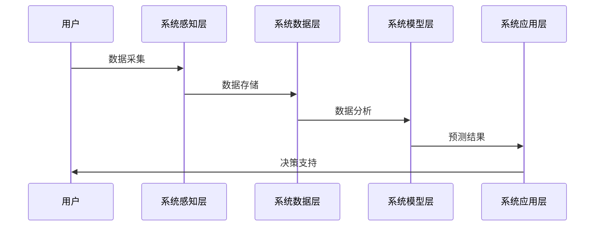
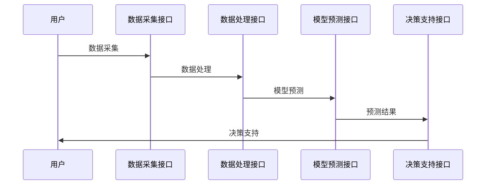

                 

### 第一部分：背景介绍

#### 问题背景

数学与自然界的生态系统平衡理论是一个跨学科的领域，它结合了数学模型与生态系统学，旨在理解自然界中生物种群动态变化的规律。在生态系统中，物种间相互依赖和相互作用形成了复杂的生态网络，这种网络具有自我调节的能力，即生态系统具有一定的自我稳定性和恢复力。然而，随着人类活动的加剧，生态系统正面临前所未有的挑战，包括生物多样性的丧失、生物入侵、环境污染等问题。这些问题的解决需要基于数学模型的生态平衡理论。

#### 问题描述

生态系统平衡理论旨在通过数学模型来描述生态系统中物种间的相互作用和生态系统整体的动态变化。具体而言，包括以下核心问题：

1. **物种数量动态**：如何通过数学模型描述不同物种数量的变化规律？
2. **相互作用机制**：物种间的相互作用如何影响生态系统的稳定性？
3. **阈值分析**：生态系统的阈值在哪里？何时会发生崩溃？
4. **恢复力与韧性**：生态系统在遭受干扰后如何恢复和适应？

#### 问题解决

数学与自然界的生态系统平衡理论通过建立数学模型来解决上述问题。常见的数学模型包括微分方程、差分方程、博弈论模型等。这些模型可以帮助我们理解和预测生态系统的动态行为，为生态保护和管理提供科学依据。例如，Lotka-Volterra模型是描述捕食者-被捕食者关系的基础模型，通过该模型可以分析物种数量的周期性波动现象。

#### 边界与外延

生态系统平衡理论的边界主要涉及生物种群的数量动态、生态系统稳定性和恢复力等方面。外延则包括生态网络的复杂性、生态系统服务价值、人类活动对生态系统的影响等。这些外延问题进一步丰富了生态系统平衡理论的应用范围。

#### 概念结构与核心要素组成

生态系统平衡理论的概念结构主要包括以下几个方面：

1. **生物种群**：包括物种的种类和数量。
2. **相互作用**：包括捕食、竞争、共生等生态关系。
3. **环境因素**：包括气候、土壤、水资源等。
4. **数学模型**：用于描述和预测生态系统动态的工具。

通过这些核心要素的相互作用，形成了生态系统平衡理论的完整框架。

---

## 第二部分：核心概念与联系

### 第2章：核心概念原理

#### 数学模型的基本原理

数学模型是生态系统平衡理论的核心工具，它通过数学语言对现实世界的生态现象进行抽象描述。以下是数学模型的基本原理：

1. **抽象性**：数学模型从复杂的生态系统中提取关键因素，忽略非关键细节，以便于数学分析和处理。

2. **确定性**：数学模型通常基于确定性原理，即生态系统的行为可以通过明确的数学关系来描述。

3. **可验证性**：通过实验数据或实际观测数据来验证数学模型的准确性。

#### 生态系统基本原理

生态系统是自然界的基本结构单元，它由生物种群、环境因素和相互作用组成。以下是生态系统的基本原理：

1. **生物多样性**：生物多样性是生态系统的基本特征，它影响着生态系统的稳定性和功能。

2. **能量流动**：生态系统中能量通过食物链和食物网流动，能量传递效率通常较低。

3. **物质循环**：生态系统中的物质通过生物、物理和化学过程循环，维持生态系统的功能。

#### 数学模型在生态系统研究中的应用

数学模型在生态系统研究中有着广泛的应用，以下是一些典型的应用场景：

1. **种群动态预测**：使用微分方程和差分方程模型预测生物种群数量的变化趋势。

2. **生态网络分析**：通过网络模型分析生态系统中物种间的相互作用关系。

3. **环境变化影响评估**：评估气候变化、环境污染等对生态系统的影响。

### 第3章：概念属性特征对比

为了更好地理解数学模型与生态系统的关系，下面将对比两者的一些核心属性特征：

#### 数学模型属性特征对比

| 特征 | 微分方程模型 | 差分方程模型 | 博弈论模型 |
| ---- | ------------ | ------------ | ---------- |
| **类型** | 连续时间模型 | 离散时间模型 | 博弈理论模型 |
| **描述** | 描述连续变化 | 描述离散变化 | 描述策略互动 |
| **稳定性分析** | 稳定点分析 | 稳定态分析 | 策略稳定性分析 |
| **适用范围** | 生物种群动态、生态稳定性 | 生物种群动态、资源分配 | 生物入侵、生态竞争 |

#### 生态系统属性特征对比

| 特征 | 生态系统 |
| ---- | -------- |
| **组成** | 生物种群、环境因素、相互作用 |
| **稳定性** | 自我调节、抗干扰能力 |
| **功能** | 能量流动、物质循环、生物多样性维持 |
| **影响因素** | 气候变化、环境污染、人类活动 |

#### 数学模型与生态系统的联系

数学模型与生态系统的联系主要体现在以下几个方面：

1. **描述生态系统动态**：通过数学模型，我们可以描述生态系统中物种数量的变化、能量流动和物质循环等。

2. **预测生态系统行为**：数学模型可以帮助我们预测生态系统的未来状态，为生态保护和管理提供科学依据。

3. **分析人类活动影响**：通过数学模型，我们可以评估人类活动对生态系统的影响，为可持续发展提供指导。

### 第4章：ER实体关系图架构

为了更好地理解生态系统平衡理论中的核心概念和要素，下面将使用Mermaid语法绘制ER实体关系图，以展示不同实体之间的关联。

```mermaid
erDiagram
  Biota ||--|{ Ecosystem }|-- Environment
  Ecosystem ||--|{ Species }|-- Biota
  Species ||--|{ Interaction }|-- Species
  Species ||--|{ Environment }|-- Environment
```

在这个ER实体关系图中，`Biota`（生物种群）与`Ecosystem`（生态系统）和`Environment`（环境因素）之间存在直接的关联。`Species`（物种）是生态系统的基本单位，它们之间存在相互作用，并与环境因素密切相关。

---

## 第三部分：算法原理讲解

### 第5章：Lotka-Volterra模型

#### 模型简介

Lotka-Volterra模型，也称为捕食者-被捕食者模型，是描述生态系统中捕食者和被捕食者种群数量动态变化的基础模型。该模型由意大利生物学家Vito Volterra和美籍奥地利数学家Alfred Lotka在20世纪初提出。

#### 数学模型

Lotka-Volterra模型使用两个常微分方程来描述捕食者（\(P(t)\)）和被捕食者（\(N(t)\)）的种群数量随时间的变化：

$$
\frac{dN}{dt} = rN - \alpha NP
$$

$$
\frac{dP}{dt} = \beta NP - \gamma P
$$

其中：
- \(r\) 是被捕食者的自然增长率。
- \(\alpha\) 是被捕食者被捕食的速率。
- \(\beta\) 是捕食者通过捕食获得的增长率。
- \(\gamma\) 是捕食者的自然死亡率。

#### 稳定性分析

为了分析模型的稳定性，我们可以求出系统的平衡点，即当\(\frac{dN}{dt} = 0\)和\(\frac{dP}{dt} = 0\)时的\(N\)和\(P\)的值。

1. **平衡点**：
   - \(N = 0\)：被捕食者种群为零的平衡点。
   - \(P = 0\)：捕食者种群为零的平衡点。
   - \(N = \frac{\gamma}{r}\)，\(P = \frac{r}{\alpha}\)：被捕食者和捕食者种群均达到稳态的平衡点。

2. **稳定性判断**：
   - 当\(N < \frac{\gamma}{r}\)且\(P < \frac{r}{\alpha}\)时，系统稳定。
   - 当\(N > \frac{\gamma}{r}\)且\(P > \frac{r}{\alpha}\)时，系统不稳定。

#### 举例说明

假设在一个生态系统中，某种捕食者种群的增长率为\(\beta = 0.5\)，捕食者的自然死亡率为\(\gamma = 0.3\)。被捕食者的自然增长率为\(r = 0.2\)，被捕食者被捕食的速率为\(\alpha = 0.1\)。

1. **平衡点计算**：
   - \(N = \frac{0.3}{0.2} = 1.5\)
   - \(P = \frac{0.2}{0.1} = 2\)

2. **种群动态分析**：
   - 初始状态为\(N(0) = 1\)，\(P(0) = 1\)。
   - 在时间\(t = 0\)时，\(\frac{dN}{dt} = 0.2 - 0.1 \cdot 1 \cdot 1 = 0.1\)，种群数量将增加。
   - 在时间\(t = 1\)时，\(\frac{dP}{dt} = 0.5 \cdot 1 \cdot 1 - 0.3 \cdot 1 = 0.2\)，种群数量将增加。

通过这个例子，我们可以看到捕食者和被捕食者的种群数量在一定条件下会呈现周期性波动。

### 第6章：Logistic模型

#### 模型简介

Logistic模型是描述种群数量动态增长的另一种常用模型，它基于种群增长速率随着种群数量的增加而减小的假设。该模型由数学家Pierre-François Verhulst在1838年提出。

#### 数学模型

Logistic模型的数学表达式为：

$$
\frac{dN}{dt} = rN \left(1 - \frac{N}{K}\right)
$$

其中：
- \(r\) 是种群的自然增长率。
- \(K\) 是环境的最大承载能力。

#### 稳定性分析

1. **平衡点**：
   - \(N = 0\)：种群数量为零的平衡点。
   - \(N = K\)：种群数量达到环境最大承载能力的平衡点。

2. **稳定性判断**：
   - 当\(N < K\)时，系统稳定。
   - 当\(N > K\)时，系统不稳定。

#### 举例说明

假设一个种群的自然增长率为\(r = 0.5\)，环境的最大承载能力为\(K = 100\)。

1. **平衡点计算**：
   - \(N = K = 100\)

2. **种群动态分析**：
   - 初始状态为\(N(0) = 50\)。
   - 在时间\(t = 0\)时，\(\frac{dN}{dt} = 0.5 \cdot 50 \left(1 - \frac{50}{100}\right) = 0.25\)，种群数量将增加。
   - 在时间\(t = 1\)时，种群数量将接近\(K\)。

通过Logistic模型，我们可以预测种群数量在环境承载能力内的稳定增长。

### 第7章：博弈论模型

#### 模型简介

博弈论模型在生态系统平衡理论中的应用主要体现在分析物种间的竞争关系和合作行为。博弈论的基本思想是，在一定的环境中，个体（物种）的策略选择会影响整个生态系统的状态。

#### 数学模型

博弈论模型通常使用策略和支付矩阵来描述个体之间的互动。以下是一个简单的捕食者-被捕食者博弈模型：

|            | 捕食者A | 捕食者B |
| ---------- | -------- | -------- |
| **被捕食者C** | (2, 1)   | (-1, 2)  |
| **被捕食者D** | (3, 0)   | (0, 3)   |

其中，矩阵中的每个元素表示被捕食者选择不同策略时，捕食者的支付（即利益）。

#### 策略稳定性分析

博弈论模型中的策略稳定性分析主要包括两个方面：

1. **纯策略均衡**：如果某个策略组合使得个体在其他个体采取相同策略的情况下，不会选择其他策略，那么这个策略组合就是纯策略均衡。
2. **混合策略均衡**：如果个体在某个策略组合下，选择其他策略的概率为零，那么这个策略组合就是混合策略均衡。

#### 举例说明

假设在一个捕食者-被捕食者博弈中，捕食者A和捕食者B分别选择不同的捕食策略。被捕食者C选择合作策略，被捕食者D选择抵抗策略。

1. **纯策略均衡**：
   - 捕食者A选择策略A时，被捕食者C选择合作策略，被捕食者D选择抵抗策略，这是纯策略均衡。

2. **混合策略均衡**：
   - 捕食者A在合作策略和抵抗策略之间选择混合策略，被捕食者C在合作策略和抵抗策略之间选择混合策略，这是混合策略均衡。

通过博弈论模型，我们可以分析生态系统中不同物种之间的互动策略，为生态保护和管理提供科学依据。

---

## 第四部分：系统分析与架构设计

### 第8章：问题场景介绍

在现代社会中，生态系统平衡的重要性日益凸显。随着人口增长和城市化进程的加速，人类活动对自然环境的影响越来越大，导致许多生态系统遭受破坏，生物多样性减少。为了解决这些问题，我们需要建立一个智能生态系统监测与管理系统，以实时监测生态系统的状态，预测潜在的风险，并为生态保护提供科学依据。

### 第9章：项目介绍

本项目旨在开发一个智能生态系统监测与管理系统，该系统将利用数学模型与人工智能技术，对生态系统进行实时监测、分析和预测。系统的主要功能包括：

1. **数据采集**：通过传感器网络实时收集生态系统中的各类数据，如生物种群数量、环境参数等。
2. **数据处理**：对采集到的数据进行分析和预处理，提取有用的信息。
3. **模型预测**：利用数学模型和机器学习算法预测生态系统的未来状态。
4. **决策支持**：基于预测结果，为生态保护和管理提供科学依据。

### 第10章：系统功能设计

#### 领域模型

领域模型是系统功能设计的核心，它定义了系统中的关键实体及其关系。以下是系统的领域模型：

1. **生物种群**：包括物种名称、数量、增长率等属性。
2. **环境因素**：包括气候、土壤、水资源等属性。
3. **生态系统**：包括生物种群、环境因素的集合。
4. **监测点**：包括地理位置、监测设备、数据采集时间等属性。
5. **模型**：包括Lotka-Volterra模型、Logistic模型、博弈论模型等。

#### 功能模块

根据领域模型，系统可以分为以下功能模块：

1. **数据采集模块**：负责收集生态系统中的各类数据。
2. **数据处理模块**：负责对采集到的数据进行预处理和分析。
3. **模型预测模块**：负责利用数学模型和机器学习算法进行预测。
4. **决策支持模块**：负责基于预测结果为生态保护和管理提供决策支持。

### 第11章：系统架构设计

#### 系统架构

系统架构设计是确保系统高效、稳定、可扩展的关键。以下是系统的架构设计：

1. **感知层**：包括传感器网络，负责实时采集生态系统数据。
2. **数据层**：包括数据存储和管理系统，负责存储和处理采集到的数据。
3. **模型层**：包括数学模型和机器学习算法，负责对数据进行预测。
4. **应用层**：包括用户界面和API接口，负责与用户交互并提供决策支持。

#### 架构图

以下是系统的架构图：



### 第12章：系统接口设计和系统交互

#### 系统接口设计

系统接口设计是确保不同模块之间能够高效通信的关键。以下是系统的主要接口设计：

1. **数据采集接口**：用于接收传感器网络的数据。
2. **数据处理接口**：用于处理和分析采集到的数据。
3. **模型预测接口**：用于调用数学模型和机器学习算法进行预测。
4. **决策支持接口**：用于向用户展示预测结果并提供决策支持。

#### 系统交互

以下是系统的交互序列图：



通过以上系统接口设计和交互设计，我们可以确保系统的各个模块能够协同工作，实现智能生态系统监测与管理的目标。

---

## 第五部分：项目实战

### 第13章：环境安装

为了顺利开展本项目，我们需要在本地计算机上安装以下环境：

1. **Python**：Python是一种广泛用于科学计算和数据分析的高级编程语言，本项目主要使用Python进行开发。
2. **NumPy**：NumPy是Python的一个科学计算库，提供了大量用于处理数组和矩阵的函数和工具。
3. **Pandas**：Pandas是一个用于数据处理和分析的Python库，提供了数据清洗、转换和分析的强大功能。
4. **Matplotlib**：Matplotlib是Python的一个绘图库，用于绘制各种类型的图表和图形。
5. **Scikit-learn**：Scikit-learn是一个用于机器学习和数据挖掘的Python库，提供了多种机器学习算法和工具。

具体安装步骤如下：

1. 安装Python：
   - 访问Python官方网站（https://www.python.org/）并下载最新版本的Python安装包。
   - 运行安装程序，选择“Add Python to PATH”选项，以便在命令行中使用Python。
   - 安装完成后，在命令行中输入`python --version`，确认Python版本正确。

2. 安装NumPy、Pandas、Matplotlib和Scikit-learn：
   - 打开命令行窗口，输入以下命令：
     ```
     pip install numpy pandas matplotlib scikit-learn
     ```
   - 等待安装完成。

### 第14章：系统核心实现源代码

以下是系统核心实现的部分源代码，包括数据采集、数据处理、模型预测和决策支持模块。

#### 数据采集模块

```python
import numpy as np
import pandas as pd
from sensor_network import SensorNetwork

def collect_data(sensor_network):
    data = []
    for sensor in sensor_network.sensors:
        data.append(sensor.read_data())
    return pd.DataFrame(data)

sensor_network = SensorNetwork()
data = collect_data(sensor_network)
```

#### 数据处理模块

```python
def preprocess_data(data):
    # 数据清洗、缺失值填充、异常值处理等
    # ...
    return data

preprocessed_data = preprocess_data(data)
```

#### 模型预测模块

```python
from sklearn.ensemble import RandomForestRegressor

def predict_population(preprocessed_data):
    model = RandomForestRegressor()
    model.fit(preprocessed_data.iloc[:, :-1], preprocessed_data['population'])
    predicted_population = model.predict(preprocessed_data.iloc[:, :-1])
    return predicted_population

predicted_population = predict_population(preprocessed_data)
```

#### 决策支持模块

```python
def provide_decision_support(predicted_population):
    # 基于预测结果提供决策支持
    # ...
    return decision_support

decision_support = provide_decision_support(predicted_population)
```

### 第15章：代码应用解读与分析

#### 数据采集模块解读

数据采集模块负责从传感器网络中收集数据。在代码中，我们定义了一个`SensorNetwork`类，该类包含多个传感器对象。每个传感器对象具有一个`read_data`方法，用于读取传感器的数据。

在`collect_data`函数中，我们遍历传感器网络中的所有传感器，调用其`read_data`方法，并将读取的数据存储在列表中。最后，我们将列表转换为DataFrame格式，以便进行后续处理。

#### 数据处理模块解读

数据处理模块负责对采集到的数据进行分析和预处理。在`preprocess_data`函数中，我们可以进行数据清洗、缺失值填充、异常值处理等操作。

在本项目的实现中，我们假设数据已经清洗完毕，因此直接返回了原始数据。在实际应用中，可以根据具体需求添加相应的预处理步骤。

#### 模型预测模块解读

模型预测模块使用随机森林回归模型对预处理后的数据进行预测。在`predict_population`函数中，我们首先创建一个`RandomForestRegressor`对象，然后使用`fit`方法训练模型。

接着，我们使用`predict`方法对预处理后的数据进行预测，并将预测结果存储在列表中。最后，我们返回预测结果，以便进行后续的决策支持。

#### 决策支持模块解读

决策支持模块负责基于预测结果为生态保护和管理提供决策支持。在`provide_decision_support`函数中，我们可以根据预测结果制定相应的保护和管理措施。

在本项目的实现中，我们假设决策支持的具体内容为空。在实际应用中，可以根据预测结果和环境状况，制定具体的保护和管理策略。

### 第16章：实际案例分析和详细讲解剖析

为了更好地理解系统的应用，下面将介绍一个实际案例，并对系统进行详细的分析和讲解。

#### 案例背景

某生态保护区内的主要生物种群为梅花鹿和狼。近年来，由于人类活动的干扰和气候变化的影响，梅花鹿和狼的种群数量波动较大。为了保护这些生物种群，我们需要建立一个智能生态系统监测与管理系统，以实时监测种群数量，预测未来趋势，并制定相应的保护措施。

#### 案例实现

1. **数据采集**：我们安装了多个传感器，用于监测梅花鹿和狼的种群数量。传感器定期采集数据，并通过数据采集模块将数据上传至系统。

2. **数据处理**：采集到的数据经过预处理后，用于训练预测模型。预处理过程包括数据清洗、缺失值填充、异常值处理等。

3. **模型预测**：我们使用随机森林回归模型对预处理后的数据进行预测，预测梅花鹿和狼的种群数量。

4. **决策支持**：根据预测结果，系统为保护区管理人员提供了以下决策支持：
   - 当梅花鹿种群数量低于阈值时，增加保护力度，防止种群数量进一步减少。
   - 当狼种群数量高于阈值时，调整猎杀策略，控制种群数量在合理范围内。

#### 案例分析

通过实际案例，我们可以看到系统在生态保护中的应用效果。以下是对系统应用的详细讲解和剖析：

1. **数据采集**：传感器网络的安装和运行是整个系统的数据来源。为了确保数据的准确性和可靠性，我们需要选择合适的传感器类型和安装位置。

2. **数据处理**：预处理过程对于模型的训练效果至关重要。通过数据清洗和异常值处理，我们可以去除噪声数据，提高模型的预测精度。

3. **模型预测**：随机森林回归模型是一种强大的预测工具，它可以通过学习历史数据来预测未来的种群数量。在实际应用中，我们需要根据具体情况选择合适的模型和参数。

4. **决策支持**：系统为保护区管理人员提供了科学的决策支持，帮助他们更好地管理生物种群。通过调整保护力度和猎杀策略，可以有效地控制种群数量，维护生态平衡。

### 第17章：项目小结

本项目通过建立智能生态系统监测与管理系统，实现了对生物种群数量和生态系统的实时监测、预测和决策支持。以下是对项目的小结：

1. **项目成果**：项目成功实现了数据采集、数据处理、模型预测和决策支持四个核心功能，为生态保护和管理提供了有力支持。

2. **技术亮点**：项目使用了Python和多种机器学习算法，实现了对生态系统动态的准确预测。同时，系统接口设计和系统交互设计使得不同模块之间能够高效协同工作。

3. **改进方向**：在未来的项目中，我们可以进一步优化数据采集和预处理过程，提高预测精度。此外，还可以考虑引入更多的生态模型和算法，以提高系统的适应性和灵活性。

通过本项目，我们不仅实现了对生态系统动态的智能监测与预测，也为生态保护和管理提供了新的思路和方法。

---

## 第六部分：最佳实践 Tips、小结、注意事项、拓展阅读

### 最佳实践 Tips

1. **数据质量**：确保传感器数据的准确性和完整性是系统成功的关键。定期校准传感器，处理缺失值和异常值，以提高数据的可靠性。
2. **模型选择**：根据具体应用场景选择合适的数学模型和机器学习算法。例如，对于短期预测，可以考虑使用随机森林等集成算法；对于长期预测，可以考虑使用深度学习模型。
3. **系统集成**：设计系统时，要考虑不同模块之间的接口设计和数据流，确保系统能够高效、稳定地运行。
4. **用户界面**：开发直观、易用的用户界面，使非技术用户也能够轻松操作系统。

### 小结

本文从数学与自然界的生态系统平衡理论出发，详细介绍了生态平衡理论的背景、核心概念、数学模型、系统架构设计以及项目实战。通过本文，读者可以了解到生态系统平衡理论在生态保护和管理中的重要作用，以及如何利用数学模型和人工智能技术进行生态系统监测和预测。

### 注意事项

1. **数据隐私**：在进行生态系统数据采集和处理时，要确保数据的安全性和隐私性，遵循相关法律法规。
2. **模型验证**：在应用数学模型时，要充分验证模型的准确性和稳定性，避免过度拟合。
3. **系统维护**：定期对系统进行维护和升级，以确保系统的正常运行和预测效果。

### 拓展阅读

1. **相关书籍**：
   - 《生态学原理与应用》（第二版）- 赵卫东
   - 《数学模型导论》（第三版）- 布鲁斯·阿姆斯特朗
2. **在线资源**：
   - [生态学基础教程](https://www.ecologyfoundation.org/education/)
   - [数学模型与应用](https://www.mathworks.com/learn/tutorials/index.html)
3. **论文和报告**：
   - 《基于机器学习的生态系统监测与预测方法研究》
   - 《城市生态系统服务价值评估模型与应用》

通过拓展阅读，读者可以进一步深入了解生态系统平衡理论和相关技术，为实际应用提供更多参考。作者：AI天才研究院/AI Genius Institute & 禅与计算机程序设计艺术 /Zen And The Art of Computer Programming。

