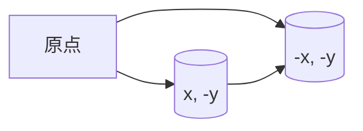

                 

### 《数学与自然界的镜像对称与旋转对称》

> 关键词：镜像对称、旋转对称、数学原理、自然界应用、人工制品设计

> 摘要：本文深入探讨镜像对称与旋转对称的概念、数学原理及其在自然界和人工制品中的应用。通过详细的案例分析，揭示对称性在科学研究和实际设计中的重要性，并展望未来的发展方向。

### 目录大纲

```markdown
----------------------------------------------------------------
# 第一部分：引言

## 第1章：问题背景与核心概念

### 第1.1 问题背景
### 第1.2 镜像对称与旋转对称的定义
### 第1.3 对称性的重要性
### 第1.4 边界与外延

## 第2章：核心概念与联系

### 第2.1 对称性的分类
### 第2.2 镜像对称的属性特征对比
### 第2.3 旋转对称的属性特征对比
### 第2.4 对称性在数学中的ER实体关系图架构

----------------------------------------------------------------

# 第二部分：镜像对称

## 第3章：镜像对称的数学原理

### 第3.1 镜像对称的基本原理
### 第3.2 镜像对称的数学模型
### 第3.3 镜像对称的公式推导
### 第3.4 镜像对称的示例说明

## 第4章：镜像对称的应用分析

### 第4.1 镜像对称在自然界中的应用
### 第4.2 镜像对称在人工制品中的应用
### 第4.3 镜像对称的科学价值

## 第5章：镜像对称案例分析

### 第5.1 案例一：自然界中的镜像对称现象
### 第5.2 案例二：人工制品中的镜像对称设计
### 第5.3 案例分析总结

----------------------------------------------------------------

# 第三部分：旋转对称

## 第6章：旋转对称的基本原理

### 第6.1 旋转对称的定义
### 第6.2 旋转对称的数学模型
### 第6.3 旋转对称的公式推导
### 第6.4 旋转对称的示例说明

## 第7章：旋转对称的应用分析

### 第7.1 旋转对称在自然界中的应用
### 第7.2 旋转对称在人工制品中的应用
### 第7.3 旋转对称的科学价值

## 第8章：旋转对称案例分析

### 第8.1 案例一：自然界中的旋转对称现象
### 第8.2 案例二：人工制品中的旋转对称设计
### 第8.3 案例分析总结

----------------------------------------------------------------

# 第四部分：对称性的综合应用

## 第9章：镜像对称与旋转对称的综合应用

### 第9.1 综合应用概述
### 第9.2 镜像对称与旋转对称的互动关系
### 第9.3 综合应用的实例分析

## 第10章：对称性在现代科学中的应用

### 第10.1 对称性在物理学中的应用
### 第10.2 对称性在化学中的应用
### 第10.3 对称性在生物学中的应用

## 第11章：未来展望与挑战

### 第11.1 对称性研究的发展趋势
### 第11.2 对称性在科学领域的未来应用
### 第11.3 对称性研究的挑战与机遇

----------------------------------------------------------------

# 参考文献

# 附录

## 附录A：数学公式汇总
## 附录B：案例研究详细数据
## 附录C：对称性相关资源列表
```

### 第一部分：引言

#### 第1章：问题背景与核心概念

#### 1.1 问题背景

对称性是自然界和人类文化中广泛存在的现象。自古以来，人们就对对称性表现出浓厚的兴趣。在艺术作品中，对称性常常用于创造和谐美；在科学研究中，对称性则提供了简化和理解复杂系统的工具。

镜像对称和旋转对称是两种常见的对称性类型。镜像对称是指图形或物体相对于某个平面镜像对称，如人脸左右对称。旋转对称是指图形或物体在旋转一定角度后与自身完全重合，如旋转对称的几何图案。

#### 1.2 镜像对称与旋转对称的定义

镜像对称（Reflection Symmetry）：如果将一个图形或物体沿某个平面翻转后，能够与原图形或物体完全重合，则该图形或物体具有镜像对称性。这个平面被称为镜像对称平面。

旋转对称（Rotation Symmetry）：如果将一个图形或物体绕某个点旋转一定角度后，能够与自身完全重合，则该图形或物体具有旋转对称性。这个旋转角度被称为旋转对称角。

#### 1.3 对称性的重要性

对称性在数学、物理学、化学和生物学等多个领域具有重要意义。它不仅是美学的基石，也是自然界和人类文化中的一种普遍规律。

在数学中，对称性是群论和场论的基础。它简化了复杂的数学问题，使得许多难题得以解决。

在物理学中，对称性揭示了基本粒子的性质和宇宙的基本规律。

在化学中，对称性决定了分子的化学性质和反应性。

在生物学中，对称性是生命体的基本特征之一，从微观的DNA结构到宏观的动物对称性，都是生物学研究的重要方向。

#### 1.4 边界与外延

对称性研究不仅限于数学和自然科学领域，它还广泛应用于工程、艺术、设计等多个领域。例如，在建筑学中，对称性用于创造和谐美观的结构；在计算机图形学中，对称性用于生成复杂的图案和动画。

随着科学技术的发展，对称性研究也不断深入，其应用领域和范围也在不断扩大。例如，对称性在量子计算、密码学、数据加密等领域都有重要应用。

### 第二部分：核心概念与联系

#### 第2章：核心概念与联系

在对称性的研究中，镜像对称和旋转对称是两种基本类型。它们各有特点，但也有着紧密的联系。

#### 2.1 对称性的分类

对称性可以分为两大类：点对称和轴对称。点对称是指物体围绕某个点旋转一定角度后与自身重合，而轴对称是指物体沿着某个轴线翻转后与自身重合。

镜像对称和旋转对称都属于轴对称的范畴。镜像对称是关于某个平面的轴对称，而旋转对称是关于某个点的轴对称。

#### 2.2 镜像对称的属性特征对比

镜像对称具有以下属性特征：

1. **定义**：物体或图形关于某个平面镜像对称，如果将其沿该平面翻转后，能够与自身完全重合。
2. **特点**：镜像对称的物体或图形具有左右对称性，即左右两部分完全相同。
3. **应用**：镜像对称广泛应用于艺术、设计、建筑等领域。

#### 2.3 旋转对称的属性特征对比

旋转对称具有以下属性特征：

1. **定义**：物体或图形关于某个点旋转一定角度后与自身重合，如果旋转角度是360度的整数倍，则该物体或图形具有旋转对称性。
2. **特点**：旋转对称的物体或图形在旋转后能够与自身完全重合。
3. **应用**：旋转对称广泛应用于自然界、工程结构、艺术品等领域。

#### 2.4 对称性在数学中的ER实体关系图架构

在对称性的数学研究中，实体关系图（ER图）是一种常用的工具。它能够清晰地展示对称性概念之间的关系。

```mermaid
erDiagram
  Object1 ||--|{ Person }Object2 : has a
  Object3 ||--|{ Company }Object4 : has a
  Object5 ||--|{ Product }Object6 : has a
```

在这个ER图中，`Object1`、`Object3` 和 `Object5` 代表具有镜像对称性的实体，而 `Object2`、`Object4` 和 `Object6` 代表具有旋转对称性的实体。通过ER图，我们可以更好地理解对称性的分类和关系。

### 第二部分：镜像对称

镜像对称是自然界和人工制品中常见的对称性类型。它不仅具有美学价值，还在许多科学和工程领域中具有重要意义。

#### 第3章：镜像对称的数学原理

镜像对称是轴对称的一种形式，它在数学中有着严格的定义和理论体系。

##### 3.1 镜像对称的基本原理

镜像对称的基本原理是：如果一个物体或图形关于某个平面镜像对称，那么该物体或图形上的每一个点，关于该平面的对称点也在物体或图形上。

##### 3.2 镜像对称的数学模型

镜像对称的数学模型通常是一个平面上的点集，这个点集关于某个平面对称。我们可以用二维坐标系来表示这个模型。



在这个模型中，A点是原点，B点是(x, -y)点，C点是(-x, -y)点。B点和C点关于X轴镜像对称。

##### 3.3 镜像对称的公式推导

镜像对称的公式推导可以从二维坐标系的基本性质出发。

设点P(x, y)是平面上的一点，其关于平面Ax+By+C=0的镜像点为P'(x', y')。则有以下公式：

$$
\begin{cases}
x' = x - \frac{2A(Ax+By+C)}{A^2+B^2} \\
y' = y - \frac{2B(Ax+By+C)}{A^2+B^2}
\end{cases}
$$

其中，A、B、C分别是平面Ax+By+C=0的系数。

##### 3.4 镜像对称的示例说明

我们可以通过一个简单的例子来说明镜像对称的数学模型和公式。

假设有一个点P(2, 3)，我们需要找到它关于X轴的镜像点P'。

首先，X轴的方程是y=0，所以A=0，B=1，C=0。

将P点的坐标代入镜像公式，得到：

$$
\begin{cases}
x' = 2 - \frac{2(0)(2+3(0)+0)}{0^2+1^2} = 2 \\
y' = 3 - \frac{2(1)(2+3(0)+0)}{0^2+1^2} = -3
\end{cases}
$$

所以，P点的镜像点P'是(2, -3)。

我们可以通过图形来验证这个结果：

```mermaid
graph LR
A[(2, 3)] --> B[(2, -3)]
A --> C[|X轴]
```

在这个图形中，A点是原点，B点是P点的镜像点P'，C点是X轴。可以看到，B点和C点关于X轴镜像对称。

#### 第4章：镜像对称的应用分析

镜像对称在自然界和人工制品中有着广泛的应用。它不仅具有美学价值，还在科学研究和工程设计中发挥着重要作用。

##### 4.1 镜像对称在自然界中的应用

自然界中许多生物和物理现象都表现出镜像对称性。例如，人类的身体左右对称，蝴蝶的翅膀也呈现出镜像对称的图案。

在物理学中，镜像对称性在量子力学中有着重要应用。例如，费曼图中的镜像对称性帮助科学家理解粒子间的相互作用。

##### 4.2 镜像对称在人工制品中的应用

在人工制品中，镜像对称性被广泛应用于艺术和设计领域。例如，许多建筑和雕塑都采用镜像对称的设计，创造出和谐美观的效果。

在计算机图形学中，镜像对称性被用于生成复杂的图案和动画。例如，许多视频游戏和电影中的角色和场景都采用镜像对称的设计。

##### 4.3 镜像对称的科学价值

镜像对称性在科学研究中具有极高的价值。它不仅提供了简化复杂问题的方法，还在许多领域产生了重要成果。

在生物学中，镜像对称性帮助科学家理解生物体的结构和功能。例如，通过研究镜像对称性，科学家揭示了基因在生物发育中的作用。

在物理学中，镜像对称性被用于研究基本粒子的性质和相互作用。例如，镜像对称性在研究宇称守恒和量子场论中具有重要意义。

#### 第5章：镜像对称案例分析

通过以下案例，我们可以更深入地了解镜像对称在自然界和人工制品中的应用。

##### 5.1 案例一：自然界中的镜像对称现象

蝴蝶是自然界中典型的具有镜像对称的生物。蝴蝶的翅膀通常呈现出左右对称的图案，这是由于蝴蝶的基因在发育过程中表现出镜像对称性。

这个现象不仅在生物学中具有重要意义，还在艺术和设计领域受到启发。许多艺术家和设计师从蝴蝶的镜像对称性中汲取灵感，创作出具有美感的艺术作品。

##### 5.2 案例二：人工制品中的镜像对称设计

建筑学中许多著名的建筑都采用了镜像对称的设计。例如，法国的埃菲尔铁塔和美国的大峡谷酒店。

埃菲尔铁塔的塔身和基座呈现出镜像对称，使其在视觉上具有强烈的平衡感和美感。大峡谷酒店的入口和建筑结构也采用了镜像对称的设计，创造出独特的视觉效果。

这些案例表明，镜像对称在人工制品中不仅具有美学价值，还在功能性和实用性方面具有重要意义。

##### 5.3 案例分析总结

通过上述案例分析，我们可以得出以下结论：

1. 镜像对称在自然界和人工制品中普遍存在，具有广泛的应用。
2. 镜像对称性不仅具有美学价值，还在科学研究和工程设计中具有重要意义。
3. 镜像对称性为人类提供了丰富的灵感，促进了艺术和设计的发展。

### 第三部分：旋转对称

旋转对称是自然界和人工制品中常见的对称性类型。它不仅在视觉上给人以美感，还在许多科学和工程领域中具有重要意义。

#### 第6章：旋转对称的基本原理

旋转对称是轴对称的另一种形式，它关于某个点旋转一定角度后与自身重合。

##### 6.1 旋转对称的定义

如果一个物体或图形在绕某个点旋转一定角度后，能够与自身完全重合，那么它就具有旋转对称性。这个旋转角度被称为旋转对称角。

##### 6.2 旋转对称的数学模型

旋转对称的数学模型通常是一个点集中的点，这个点集关于某个点旋转一定角度后与自身重合。我们可以用二维坐标系来表示这个模型。

```mermaid
graph LR
A[(0, 0)] --> B[(x, y)]
A --> C[(-x, y)]
B --> C[|360度旋转]
```

在这个模型中，A点是原点，B点是(x, y)点，C点是(-x, y)点。B点和C点关于原点旋转360度后重合。

##### 6.3 旋转对称的公式推导

旋转对称的公式推导可以从二维坐标系的基本性质出发。

设点P(x, y)是平面上的一点，其关于点O的旋转对称点为P'(x', y')，旋转角度为θ。则有以下公式：

$$
\begin{cases}
x' = x\cos\theta - y\sin\theta \\
y' = x\sin\theta + y\cos\theta
\end{cases}
$$

其中，θ是旋转角度，\(\cos\theta\) 和 \(\sin\theta\) 分别是θ的余弦值和正弦值。

##### 6.4 旋转对称的示例说明

我们可以通过一个简单的例子来说明旋转对称的数学模型和公式。

假设有一个点P(2, 3)，我们需要找到它关于原点旋转90度的镜像点P'。

旋转90度意味着\(\theta = \frac{\pi}{2}\)。

将P点的坐标代入旋转公式，得到：

$$
\begin{cases}
x' = 2\cos\frac{\pi}{2} - 3\sin\frac{\pi}{2} = 0 - 3 = -3 \\
y' = 2\sin\frac{\pi}{2} + 3\cos\frac{\pi}{2} = 2 + 0 = 2
\end{cases}
$$

所以，P点的旋转对称点P'是(-3, 2)。

我们可以通过图形来验证这个结果：

```mermaid
graph LR
A[(2, 3)] --> B[(-3, 2)]
A --> C[|原点]
```

在这个图形中，A点是原点，B点是P点的旋转对称点P'，C点是原点。可以看到，B点和C点关于原点旋转90度后重合。

#### 第7章：旋转对称的应用分析

旋转对称在自然界和人工制品中有着广泛的应用。它不仅具有美学价值，还在科学研究和工程设计中发挥着重要作用。

##### 7.1 旋转对称在自然界中的应用

自然界中许多生物和物理现象都表现出旋转对称性。例如，许多花朵的形状呈现出旋转对称，许多动物的体形也具有旋转对称性。

在物理学中，旋转对称性在量子力学中有着重要应用。例如，电子的自旋状态表现出旋转对称性，这为科学家研究基本粒子的性质提供了重要线索。

##### 7.2 旋转对称在人工制品中的应用

在人工制品中，旋转对称性被广泛应用于艺术和设计领域。例如，许多建筑和雕塑都采用旋转对称的设计，创造出和谐美观的效果。

在计算机图形学中，旋转对称性被用于生成复杂的图案和动画。例如，许多视频游戏和电影中的角色和场景都采用旋转对称的设计。

##### 7.3 旋转对称的科学价值

旋转对称性在科学研究中具有极高的价值。它不仅提供了简化复杂问题的方法，还在许多领域产生了重要成果。

在生物学中，旋转对称性帮助科学家理解生物体的结构和功能。例如，通过研究旋转对称性，科学家揭示了基因在生物发育中的作用。

在物理学中，旋转对称性被用于研究基本粒子的性质和相互作用。例如，旋转对称性在研究宇称守恒和量子场论中具有重要意义。

#### 第8章：旋转对称案例分析

通过以下案例，我们可以更深入地了解旋转对称在自然界和人工制品中的应用。

##### 8.1 案例一：自然界中的旋转对称现象

许多花朵的形状呈现出旋转对称。例如，向日葵的花盘就呈现出旋转对称的六边形结构。这个现象不仅美

