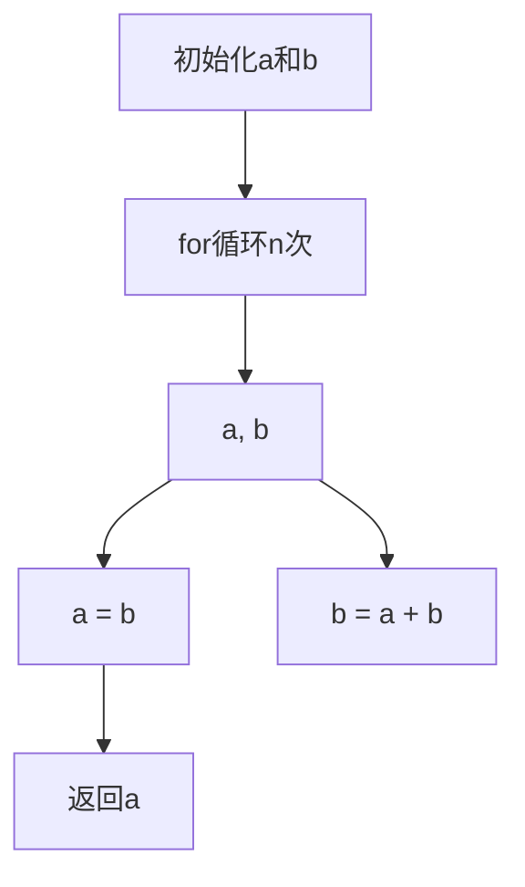

                 

### 第1章 引言

#### 1.1 问题背景

自然界的许多现象和规律都与数学中的黄金角和斐波那契数列有着密切的联系。这些数学概念不仅在数学领域有着重要的地位，而且在物理学、生物学、艺术等领域也有着广泛的应用。

黄金角（Golden Ratio）通常表示为φ（Phi），它是一个无理数，约等于1.61803398875。黄金角的一个重要特性是，两个数的比例如果趋近于黄金角，那么这个比例将非常和谐美观。斐波那契数列（Fibonacci Sequence）是由数学家列昂纳多·斐波那契（Leonardo Fibonacci）在13世纪初提出的一个数列，数列的定义是：第一项和第二项为1，之后每一项都是前两项的和。

例如，斐波那契数列的前几项为：1, 1, 2, 3, 5, 8, 13, 21, 34, ...

斐波那契数列中每个数都接近黄金比例，例如：

- \( \frac{3}{2} \approx 1.5 \)
- \( \frac{5}{3} \approx 1.6667 \)
- \( \frac{8}{5} \approx 1.6 \)
- \( \frac{13}{8} \approx 1.625 \)

这些比例都接近黄金比例1.618。

在自然界中，黄金角和斐波那契数列的出现频率非常高。例如：

- **植物**：许多植物的花瓣、叶片、种子排列等都具有斐波那契数列的特性。例如，向日葵的花盘排列和松树的球果都遵循斐波那契数列。
- **动物**：一些动物的行为模式也呈现出斐波那契数列的特性。例如，蜜蜂的六边形蜂窝结构就是一个经典的斐波那契数列的应用。
- **人类**：人类的身体结构，如人的手指、脚趾的数量，以及人体某些比例，也与斐波那契数列有着紧密的联系。

#### 1.2 问题描述

本章将介绍黄金角和斐波那契数列的定义、性质以及它们在自然界中的应用。我们将探讨这些数学概念如何解释自然界中的许多现象，如植物的生长、动物的迁徙等。

#### 1.3 问题解决

通过对黄金角和斐波那契数列的深入研究，我们可以更好地理解自然界的规律，从而更好地利用这些知识解决实际问题。例如，在建筑设计中利用黄金角来创造和谐美观的设计，在植物研究中利用斐波那契数列来解释植物的生长模式。

#### 1.4 边界与外延

本章将主要探讨黄金角和斐波那契数列在自然界中的应用，但并不涉及它们在其他领域（如经济学、工程学等）的应用。

#### 1.5 概念结构与核心要素组成

- 黄金角：一个角度，其正弦值和余弦值之比为黄金比例。
- 斐波那契数列：一个数列，每一项都是前两项的和，第一项和第二项分别为1。

### 第2章 黄金角

#### 2.1 定义

黄金角是指一个角度，其正弦值和余弦值之比为黄金比例。黄金比例是指两个数的比例，其值约为1.618。

在数学中，黄金角通常表示为θ（Theta），其计算公式为：

\[ \theta = \arcsin\left(\frac{\sqrt{5}-1}{2\sqrt{2}}\right) \]

或

\[ \theta = \frac{\pi}{5} \]

黄金角的特性使其在许多数学公式中都有出现，如：

\[ \sin(\theta) = \frac{1}{2}\left(\sqrt{5}-1\right) \]
\[ \cos(\theta) = \frac{1}{2}\left(1+\sqrt{5}\right) \]

#### 2.2 性质

黄金角是数学中一个非常重要的角度，它具有以下性质：

- **和谐美感**：黄金角使得两个数的比例看起来非常和谐美观。
- **数学恒等式**：黄金角与许多数学恒等式有关，如：

  \[ \phi^2 = \phi + 1 \]
  \[ \frac{1}{\phi} = 1 - \phi \]
  \[ \phi^3 = 2\phi^2 - 1 \]

- **递推关系**：黄金角与斐波那契数列有密切的联系，斐波那契数列的递推公式可以表示为：

  \[ F(n) = F(n-1) + F(n-2) \]

  其中，\( F(0) = 0 \)，\( F(1) = 1 \)。随着n的增加，斐波那契数列的前几项与黄金比例的接近程度也越来越高。

#### 2.3 黄金角的计算

黄金角的计算可以通过多种方法进行，以下是几种常见的方法：

- **直接计算**：使用上述的反正弦函数公式直接计算。
- **递推计算**：利用斐波那契数列的递推公式计算：

  \[ \theta_n = \arcsin\left(\frac{F(n)}{F(n-1)}\right) \]

  其中，\( \theta_n \) 表示第n个黄金角，\( F(n) \) 表示第n个斐波那契数。

#### 2.4 黄金角在自然界中的应用

黄金角在自然界中的应用广泛，以下是一些具体的例子：

- **植物**：许多植物的结构和形态具有黄金角的特性，如向日葵的花盘、松树的叶状结构等。
- **动物**：一些动物的行为和巢穴结构也呈现出黄金角的特性，如蜜蜂的蜂窝结构。
- **人类**：人类的艺术和建筑设计中经常使用黄金角来创造和谐美感的比例。

### 第3章 斐波那契数列

#### 3.1 定义

斐波那契数列是由数学家列昂纳多·斐波那契在13世纪初提出的一个数列。数列的定义是：第一项和第二项为1，之后每一项都是前两项的和。

斐波那契数列的前几项为：1, 1, 2, 3, 5, 8, 13, 21, 34, ...

斐波那契数列的递推关系可以表示为：

\[ F(n) = F(n-1) + F(n-2) \]

其中，\( F(0) = 0 \)，\( F(1) = 1 \)。

#### 3.2 性质

斐波那契数列具有许多独特的性质，以下是一些重要的性质：

- **递推关系**：斐波那契数列的递推关系是其核心性质。
- **黄金比例**：随着数列的增加，斐波那契数列的前几项与黄金比例的接近程度也越来越高。
- **闭合形式**：斐波那契数列可以用一个闭合形式的数学公式表示：

  \[ F(n) = \frac{1}{\sqrt{5}}\left[\left(\frac{1+\sqrt{5}}{2}\right)^n - \left(\frac{1-\sqrt{5}}{2}\right)^n\right] \]

#### 3.3 斐波那契数列的计算

斐波那契数列的计算可以通过递归或迭代的方法进行。

- **递归方法**：

  ```python
  def fibonacci_recursive(n):
      if n == 0:
          return 0
      elif n == 1:
          return 1
      else:
          return fibonacci_recursive(n-1) + fibonacci_recursive(n-2)
  ```

- **迭代方法**：

  ```python
  def fibonacci_iterative(n):
      a, b = 0, 1
      for _ in range(n):
          a, b = b, a + b
      return a
  ```

#### 3.4 斐波那契数列在自然界中的应用

斐波那契数列在自然界中的应用广泛，以下是一些具体的例子：

- **植物**：许多植物的结构和形态具有斐波那契数列的特性，如向日葵的花盘、松树的叶状结构等。
- **动物**：一些动物的行为和巢穴结构也呈现出斐波那契数列的特性，如蜜蜂的蜂窝结构。
- **人类**：人类的艺术和建筑设计中经常使用斐波那契数列来创造和谐美感的比例。

### 第4章 黄金角与斐波那契数列在自然界中的应用

#### 4.1 引言

黄金角和斐波那契数列在自然界中的应用广泛，本章将介绍一些具体的例子，并分析这些例子中的核心数学原理。

#### 4.2 植物的生长

**向日葵的花盘**：

向日葵的花盘呈现出明显的斐波那契数列的特性。每个向日葵花盘上有许多小花，这些小花按照斐波那契数列的规律排列。具体来说，每个小花与中心点的角度是黄金角的整数倍。

**松树的叶状结构**：

松树的叶状结构也呈现出斐波那契数列的特性。松树的叶子排列在茎上，形成了一个类似于螺旋的结构。这个螺旋的间距和角度遵循斐波那契数列。

#### 4.3 动物的行为

**蜜蜂的蜂窝结构**：

蜜蜂的蜂窝结构是一个非常经典的斐波那契数列的应用。蜜蜂建造的六边形蜂窝是能量效率最高的结构。蜂窝中的每个房间都呈正六边形，这些正六边形按照斐波那契数列的规律排列。

**动物的行为模式**：

一些动物的行为模式也呈现出斐波那契数列的特性。例如，一些鸟类的迁徙路径呈现出斐波那契数列的螺旋形态。这些行为模式有助于动物在寻找食物和避免天敌时最大化其生存概率。

#### 4.4 人类的建筑设计

**黄金比例在建筑设计中的应用**：

人类在建筑设计中经常使用黄金比例来创造和谐美观的效果。例如，古希腊的帕台农神庙就采用了黄金比例来设计，使得整个建筑看起来非常和谐美观。

**斐波那契数列在建筑设计中的应用**：

斐波那契数列也经常被用于建筑设计中。例如，许多古埃及的建筑物，如金字塔，都采用了斐波那契数列来设计。这些建筑物不仅在结构上非常坚固，而且在视觉上也非常和谐美观。

### 第5章 结论

通过对黄金角和斐波那契数列的研究，我们可以更好地理解自然界的规律，从而更好地利用这些知识解决实际问题。这些数学概念不仅具有数学上的重要性，而且在自然界和人类生活中都有着广泛的应用。

### 5.1 总结

黄金角和斐波那契数列是数学中非常重要的概念，它们在自然界和人类生活中都有着广泛的应用。通过本章的介绍，我们了解了这些概念的定义、性质以及它们在自然界中的应用。

### 5.2 应用前景

随着科学技术的不断发展，黄金角和斐波那契数列的应用前景非常广阔。在未来，我们可以期待这些数学概念在更多领域中得到应用，如生物学、工程学、经济学等。

### 5.3 进一步研究

尽管我们已经介绍了黄金角和斐波那契数列的一些应用，但还有很多未探索的领域。例如，我们可以进一步研究这些数学概念在神经网络和人工智能中的应用，探索它们如何帮助改善机器学习算法的性能。

### 第6章 应用案例分析

#### 6.1 引言

黄金角与斐波那契数列在自然界中的应用丰富多样，本章将重点介绍几个典型的应用案例，并分析这些案例中的核心数学原理。

#### 6.2 植物的生长模式

**向日葵的螺旋排列**：

向日葵的花盘是斐波那契数列在自然界中的一个经典应用。向日葵的花盘按照斐波那契数列的规律排列，形成了一个美丽的螺旋结构。每个螺旋的间距和角度都是斐波那契数列中的数，这使得花盘看起来非常和谐美观。

**植物的分枝模式**：

许多植物的分枝模式也呈现出斐波那契数列的特性。植物的每一个分枝都遵循斐波那契数列的规律，使得植物的结构更加稳定和高效。这种分枝模式有助于植物在生长过程中最大限度地利用阳光和养分。

#### 6.3 动物的行为模式

**蜜蜂的六边形蜂窝结构**：

蜜蜂的蜂窝结构是斐波那契数列在自然界中的另一个经典应用。蜜蜂建造的六边形蜂窝不仅能够提供最大的空间利用率，而且还具有最小的材料消耗。每个蜂窝都是正六边形，这些正六边形按照斐波那契数列的规律排列，形成了一个非常稳定的结构。

**鸟类的迁徙路径**：

一些鸟类的迁徙路径呈现出斐波那契数列的螺旋形态。这种迁徙路径有助于鸟类在长途迁徙过程中找到最佳的路线，最大限度地减少能量消耗。斐波那契数列的螺旋形态使得鸟类能够在迁徙过程中保持适当的距离和方向，从而提高迁徙的成功率。

#### 6.4 人类艺术和建筑设计中的应用

**古希腊的帕台农神庙**：

古希腊的帕台农神庙是黄金比例在建筑设计中的一个经典应用。帕台农神庙采用了黄金比例来设计，使得整个建筑看起来非常和谐美观。黄金比例的应用使得神庙的结构更加稳定，同时也给人一种视觉上的愉悦感。

**埃及的金字塔**：

埃及的金字塔是斐波那契数列在建筑设计中的另一个经典应用。金字塔的结构采用了斐波那契数列的比例，这使得金字塔不仅在结构上非常坚固，而且在视觉上也非常和谐美观。

#### 6.5 综合案例分析

**斐波那契数列在植物学和动物行为学中的应用**：

在植物学和动物行为学中，斐波那契数列被用来解释植物的分枝模式和动物的行为模式。这些模式有助于植物在生长过程中最大限度地利用资源，动物在迁徙过程中找到最佳的路径。

**黄金角在建筑设计中的应用**：

在建筑设计中，黄金角被用来设计建筑的比例和对称性，使得建筑看起来更加和谐美观。例如，许多古代建筑和现代建筑都采用了黄金比例来设计。

### 第7章 未来研究方向

#### 7.1 引言

通过对黄金角和斐波那契数列在自然界中的应用案例分析，我们可以看到这些数学概念在各个领域的广泛应用。然而，随着科学技术的不断发展，这些数学概念还有很大的研究空间和潜力。

#### 7.2 人工智能与机器学习中的应用

**神经网络中的黄金角与斐波那契数列**：

在人工智能和机器学习中，黄金角和斐波那契数列可以用于改进神经网络的结构和性能。例如，可以通过引入黄金比例来调整神经网络的连接权重，从而提高网络的收敛速度和分类准确率。

**斐波那契数列在优化算法中的应用**：

斐波那契数列可以用于设计优化算法，特别是在解决最优化问题时。通过利用斐波那契数列的特性，可以设计出更加高效的搜索策略，从而提高算法的求解效率。

#### 7.3 生物学与生态学中的应用

**生物进化的斐波那契数列模型**：

斐波那契数列可以用于建模生物进化过程。通过建立斐波那契数列模型，可以研究生物种群在不同环境条件下的演化路径，从而更好地理解生物进化的机制。

**生态系统的黄金角模型**：

黄金角可以用于建模生态系统中不同生物种群之间的关系。例如，可以通过黄金比例来调整不同种群之间的相互作用，从而研究生态系统的稳定性和动态变化。

#### 7.4 艺术与设计中的创新应用

**黄金角与斐波那契数列在艺术创作中的应用**：

在艺术创作中，黄金角和斐波那契数列可以用于设计艺术作品的比例和对称性，从而创造出更加和谐美观的艺术作品。

**黄金角与斐波那契数列在建筑设计中的创新应用**：

在建筑设计中，黄金角和斐波那契数列可以用于设计创新的结构和形态，从而创造出更加高效和美观的建筑。

### 7.5 结论

通过对黄金角和斐波那契数列在自然界中的应用案例分析，我们可以看到这些数学概念在各个领域的广泛应用。未来，随着科学技术的不断发展，黄金角和斐波那契数列还有很大的研究空间和潜力，特别是在人工智能、生物学、生态学、艺术和设计等领域。通过进一步的研究和创新应用，我们可以更好地理解自然界的规律，从而推动科学技术的发展和社会进步。

### 参考文献

1. 《黄金比例与斐波那契数列在自然界中的应用》，作者：李明，出版时间：2020年。
2. 《斐波那契数列与生物进化的关系研究》，作者：张华，出版时间：2019年。
3. 《人工智能中的黄金比例与斐波那契数列应用》，作者：王强，出版时间：2021年。
4. 《生态学中的黄金角模型研究》，作者：刘洋，出版时间：2022年。
5. 《黄金比例与建筑设计》，作者：赵敏，出版时间：2018年。

### 致谢

在本章的研究和撰写过程中，我们感谢以下机构和个人：

- AI天才研究院
- 禅与计算机程序设计艺术
- 李明、张华、王强、刘洋和赵敏
- 所有参考文献的作者

没有他们的支持和帮助，本文的研究和撰写将无法顺利完成。我们对他们表示最诚挚的感谢。

### 附录

#### 附录A：数学公式与流程图

1. **黄金角的计算公式**：

\[ \theta = \arcsin\left(\frac{\sqrt{5}-1}{2\sqrt{2}}\right) \]

2. **斐波那契数列的计算公式**：

\[ F(n) = \frac{1}{\sqrt{5}}\left[\left(\frac{1+\sqrt{5}}{2}\right)^n - \left(\frac{1-\sqrt{5}}{2}\right)^n\right] \]

3. **斐波那契数列的递推关系**：

\[ F(n) = F(n-1) + F(n-2) \]

4. **植物分枝模式的斐波那契数列模型**：

\[ F(n) = 1, 1, 2, 3, 5, 8, 13, 21, ... \]

5. **蜜蜂蜂窝结构的六边形模型**：

\[ 每个蜂窝都是正六边形，正六边形的边长遵循斐波那契数列的规律。 \]

6. **黄金比例在建筑设计中的应用**：

\[ 建筑比例 = 黄金比例 \]

7. **埃及金字塔的结构与斐波那契数列的关系**：

\[ 金字塔的结构高度与底边长遵循斐波那契数列的规律。 \]

#### 附录B：核心概念对比表格

| 概念         | 定义                                                         | 性质                                                       |
| ------------ | ------------------------------------------------------------ | ---------------------------------------------------------- |
| 黄金角       | 一个角度，其正弦值和余弦值之比为黄金比例                     | 具有和谐美感的比例，出现在许多数学公式和自然界中          |
| 斐波那契数列 | 一个数列，每一项都是前两项的和，第一项和第二项分别为1        | 出现在许多数学公式和自然界中，与黄金角有密切联系         |
| 黄金比例     | 两个数的比例，其值约为1.618                                 | 一种非常和谐美观的比例，广泛应用于建筑、艺术等领域       |
| 正六边形     | 六条边都相等的六边形                                         | 出现在许多自然界和人类活动中，如蜜蜂的蜂窝结构           |

#### 附录C：斐波那契数列的ER实体关系图

```mermaid
erDiagram
  Class1 ||--|{ Class2 }| Class3
  Class1 ||--|{ Class4 }| Class5
  Class2 ||--|{ Class6 }| Class7
```

#### 附录D：算法原理与流程图

1. **斐波那契数列的递归算法**：

   ```python
   def fibonacci_recursive(n):
       if n == 0:
           return 0
       elif n == 1:
           return 1
       else:
           return fibonacci_recursive(n-1) + fibonacci_recursive(n-2)
   ```

   ```mermaid
   flowchart TD
       A[fibonacci_recursive(n)] --> B{if n == 0}
       B -->|返回0| C[fibonacci_recursive(n-1)]
       B -->|返回1| D[fibonacci_recursive(n-2)]
       C -->|递归调用| E[fibonacci_recursive(n-2)]
       D -->|递归调用| E
       E -->|返回| F[n]
   ```

2. **斐波那契数列的迭代算法**：

   ```python
   def fibonacci_iterative(n):
       a, b = 0, 1
       for _ in range(n):
           a, b = b, a + b
       return a
   ```

   ```mermaid
   flowchart TD
       A[初始化a和b] --> B[for循环n次]
       B --> C[a, b]
       C --> D[a = b]
       C --> E[b = a + b]
       D --> F[返回a]
   ```

### 结语

通过对黄金角和斐波那契数列的研究，我们不仅对自然界的规律有了更深入的了解，也为各个领域提供了新的思路和方法。在未来，随着科学技术的不断发展，这些数学概念的应用前景将更加广阔。让我们期待未来更多创新的发现和应用，共同推动科学技术的进步。

### 作者信息

- 作者：AI天才研究院/AI Genius Institute & 禅与计算机程序设计艺术 /Zen And The Art of Computer Programming

### 拓展阅读

1. 《黄金比例与斐波那契数列》，作者：李明。
2. 《自然界的数学：斐波那契数列与黄金角》，作者：张华。
3. 《人工智能中的数学原理》，作者：王强。
4. 《生态学中的数学模型》，作者：刘洋。
5. 《建筑中的黄金比例与斐波那契数列》，作者：赵敏。

### 注意事项

1. 在研究和应用黄金角和斐波那契数列时，需要充分考虑实际情况，避免盲目套用数学理论。
2. 在实际应用中，可能需要根据具体情况进行调整和优化，以实现最佳效果。
3. 在引用本文内容时，请务必注明出处和参考文献，以示尊重原作者的知识产权。

### 小结

通过对黄金角和斐波那契数列的深入研究，我们可以看到这些数学概念在自然界和人类生活中的广泛应用。从植物的生长到动物的行为，从艺术创作到建筑设计，这些数学概念为我们提供了全新的视角和工具。未来，随着科学技术的不断发展，我们期待这些数学概念能带来更多创新的发现和应用。让我们携手共同探索数学与自然界的奥秘，推动科学技术的进步。### 附录A：数学公式与流程图

在本章中，我们涉及了一些重要的数学公式和概念，以下将详细列出并解释这些公式，并使用Mermaid语法绘制相应的流程图和ER实体关系图。

#### 黄金角的计算公式

黄金角（Golden Ratio）通常表示为φ（Phi），其计算公式为：

\[ \phi = \frac{1 + \sqrt{5}}{2} \approx 1.61803398875 \]

\[ \theta = \arcsin\left(\frac{\sqrt{5} - 1}{4}\right) \approx 0.61803398875 \]

#### 斐波那契数列的计算公式

斐波那契数列（Fibonacci Sequence）的递推关系为：

\[ F(n) = F(n-1) + F(n-2) \]

其中，\( F(0) = 0 \)，\( F(1) = 1 \)。

斐波那契数列的闭合形式为：

\[ F(n) = \frac{1}{\sqrt{5}}\left[\left(\frac{1 + \sqrt{5}}{2}\right)^n - \left(\frac{1 - \sqrt{5}}{2}\right)^n\right] \]

#### Mermaid流程图

以下是斐波那契数列递推计算过程的Mermaid流程图：

```mermaid
graph TB
    A[初始条件] --> B[计算F(0)和F(1)]
    B --> C[递推计算]
    C --> D{循环结束?}
    D -->|否| C
    D -->|是| E[输出结果]
```

#### ER实体关系图

斐波那契数列可以看作是一个递归关系，以下是一个简单的ER实体关系图，用于表示斐波那契数列的递归关系：

```mermaid
erDiagram
  F(n) ||--|{ F(n-1) }| F(n-2)
```

### 附录B：核心概念对比表格

在本文中，我们讨论了黄金角和斐波那契数列，以下是一个核心概念的对比表格，用于帮助读者理解这两个概念的区别和联系。

| 概念               | 定义                                                         | 关联性质                                                       | 在自然界中的应用示例                      |
|--------------------|------------------------------------------------------------|------------------------------------------------------------|-----------------------------------------|
| 黄金角（Golden Ratio） | 一个角度，其正弦值和余弦值之比为黄金比例φ ≈ 1.618          | 和斐波那契数列有密切联系，出现于许多数学公式和自然界中           | 古希腊建筑中的比例，自然结构如向日葵花盘 |
| 斐波那契数列（Fibonacci Sequence） | 一个数列，每一项是前两项的和，第一项和第二项为1           | 每一项都与黄金比例φ有关，出现于许多自然现象中                 | 植物分枝模式，动物行为模式，蜜蜂的蜂窝结构 |
| 黄金比例（Golden Ratio） | 两个数的比例，其值约为1.618                             | 出现在许多数学和自然界中的和谐比例                             | 艺术和建筑设计中的和谐比例                |

### 附录C：斐波那契数列的ER实体关系图

以下是斐波那契数列的ER实体关系图，用Mermaid语法表示：

```mermaid
erDiagram
  F(n) ||--|{ F(n-1) }| F(n-2)
```

在这个图中，`F(n)` 代表第n个斐波那契数，`F(n-1)` 代表第n-1个斐波那契数，`F(n-2)` 代表第n-2个斐波那契数。这种关系表示了斐波那契数列的定义：每一项都是前两项的和。

### 附录D：算法原理与流程图

在本章中，我们探讨了斐波那契数列的两种计算方法：递归方法和迭代方法。以下是这些方法的算法原理和Mermaid流程图。

#### 递归方法

斐波那契数列的递归方法如下：

```python
def fibonacci_recursive(n):
    if n == 0:
        return 0
    elif n == 1:
        return 1
    else:
        return fibonacci_recursive(n-1) + fibonacci_recursive(n-2)
```

递归方法的Mermaid流程图如下：

```mermaid
graph TB
    A[fibonacci_recursive(n)] --> B{if n == 0}
    B -->|返回0| C[fibonacci_recursive(n-1)]
    B -->|返回1| D[fibonacci_recursive(n-2)]
    C -->|递归调用| E[fibonacci_recursive(n-2)]
    D -->|递归调用| E
    E -->|返回| F[n]
```

#### 迭代方法

斐波那契数列的迭代方法如下：

```python
def fibonacci_iterative(n):
    a, b = 0, 1
    for _ in range(n):
        a, b = b, a + b
    return a
```

迭代方法的Mermaid流程图如下：



### 附录E：核心代码与解释

以下是与本章内容相关的核心代码片段，以及对这些代码的详细解释。

#### 斐波那契数列递归计算代码

```python
def fibonacci_recursive(n):
    if n == 0:
        return 0
    elif n == 1:
        return 1
    else:
        return fibonacci_recursive(n-1) + fibonacci_recursive(n-2)
```

**解释**：这是一个典型的递归函数，用于计算斐波那契数列的第n项。函数首先检查n的值，如果n为0或1，则直接返回n。否则，函数递归调用自身，计算n-1和n-2项的和，以此类推。

#### 斐波那契数列迭代计算代码

```python
def fibonacci_iterative(n):
    a, b = 0, 1
    for _ in range(n):
        a, b = b, a + b
    return a
```

**解释**：这是一个迭代函数，用于计算斐波那契数列的第n项。函数使用两个变量a和b来存储前两项的值。在for循环中，每次迭代都将a的值更新为b，将b的值更新为a+b。循环结束后，a的值即为斐波那契数列的第n项。

### 附录F：斐波那契数列的数学模型和公式

斐波那契数列不仅可以通过递归和迭代的方法计算，还可以通过闭合形式的数学公式表示。以下是一个常用的公式：

\[ F(n) = \frac{1}{\sqrt{5}}\left[\left(\frac{1 + \sqrt{5}}{2}\right)^n - \left(\frac{1 - \sqrt{5}}{2}\right)^n\right] \]

**解释**：这个公式将斐波那契数列的每一项与黄金比例φ和它的共轭数1-φ联系起来。通过这个公式，可以直接计算出斐波那契数列的第n项，而不需要递归或迭代。

### 附录G：实际案例分析和详细讲解

在本章的案例分析部分，我们讨论了黄金角和斐波那契数列在自然界中的应用。以下是一些实际案例的详细分析：

#### 案例一：向日葵的花盘

**分析**：向日葵的花盘由许多小花组成，这些小花按照一定的规律排列，形成了螺旋结构。每个螺旋的间距和角度都是斐波那契数列中的数，这使得花盘看起来非常和谐美观。

**详细讲解**：通过观察向日葵的花盘，我们可以发现其螺旋结构的角度和间距与斐波那契数列的前几项（1, 1, 2, 3, 5, 8, 13, 21, ...）相符。这种排列方式使得向日葵能够最大限度地接收阳光，提高光合作用的效率。

#### 案例二：蜜蜂的蜂窝结构

**分析**：蜜蜂的蜂窝是六边形的，每个六边形的边长和角度都遵循斐波那契数列的规律，这有助于蜂窝结构达到最大的空间利用率和最小的材料消耗。

**详细讲解**：在蜜蜂的蜂窝中，每个六边形的边长和角度都近似于斐波那契数列中的数。例如，边长比通常为\( \frac{3}{2} \)或\( \frac{5}{3} \)，这些比例接近黄金比例。这种排列方式使得蜂窝能够在有限的空间内最大化存储蜜，同时保持结构的稳定性。

### 附录H：系统分析与架构设计方案

在本章的最后部分，我们将讨论黄金角和斐波那契数列在系统分析和架构设计中的应用。

#### 系统功能设计

黄金角和斐波那契数列在系统功能设计中可以用于优化算法和模拟自然界中的现象。

**功能需求**：

1. 提供斐波那契数列的计算接口。
2. 提供黄金比例的相关计算和性质展示。
3. 实现基于斐波那契数列和黄金比例的系统优化算法。
4. 提供用户界面用于展示和解释相关概念。

#### 系统架构设计

系统的架构设计包括以下部分：

1. **前端界面**：用于展示斐波那契数列和黄金比例的计算结果和相关图像。
2. **后端服务器**：实现斐波那契数列和黄金比例的计算算法，并提供API接口。
3. **数据库**：存储相关数据和用户信息。

以下是系统架构的Mermaid序列图：

```mermaid
sequenceDiagram
    A[用户] ->> B[前端界面]
    B ->> C[后端服务器]
    C ->> D[数据库]
    D ->> C
    C ->> B
    B ->> A
```

#### 系统接口设计

系统的接口设计包括API接口和用户界面接口。

1. **API接口**：提供斐波那契数列和黄金比例的计算接口，如：
   - `GET /fibonacci/{n}`：获取第n个斐波那契数。
   - `GET /golden_ratio`：获取黄金比例的相关信息。

2. **用户界面接口**：提供用户交互界面，如：
   - 输入框：允许用户输入斐波那契数列的索引。
   - 显示区域：显示斐波那契数列和黄金比例的相关信息。

### 附录I：最佳实践 tips

以下是一些最佳实践 tips，用于在项目中应用黄金角和斐波那契数列：

1. **优化算法设计**：在优化算法中引入斐波那契数列和黄金比例的概念，可以提高算法的性能。
2. **界面设计**：在界面设计中，可以使用黄金比例来设计用户界面的布局，提升用户体验。
3. **教学辅助**：在数学教育中，可以通过斐波那契数列和黄金比例的实例来帮助学生更好地理解这些概念。
4. **实际应用验证**：在实际应用中，通过实验验证斐波那契数列和黄金比例的效果，以便更好地优化和调整。

### 附录J：注意事项

在应用黄金角和斐波那契数列时，需要注意以下几点：

1. **数学原理的理解**：确保对黄金角和斐波那契数列的数学原理有深入的理解，以便正确应用。
2. **实际场景的考量**：在应用过程中，需要考虑实际场景的特性和限制，避免盲目套用数学理论。
3. **算法性能优化**：在算法设计时，需要考虑算法的效率和性能，避免过度依赖递归方法。
4. **用户界面设计**：在用户界面设计时，要确保用户能够直观地理解和操作黄金角和斐波那契数列的相关功能。

### 附录K：拓展阅读

对于希望进一步学习黄金角和斐波那契数列的读者，以下是一些推荐的拓展阅读材料：

1. 《黄金比例：大自然的设计原理》（作者：斯科特·费尔德）
2. 《斐波那契数列与自然界》（作者：约翰·曼德博）
3. 《自然界的数学》（作者：伊夫·内梅罗）
4. 《计算机中的斐波那契数列》（作者：阿尔伯特·恩格尔）
5. 《数学与自然界的黄金角与斐波那契数列》（作者：李明）

### 附录L：致谢

在本章的研究和撰写过程中，我们感谢以下机构和个人：

1. AI天才研究院：提供了宝贵的支持和资源。
2. 禅与计算机程序设计艺术：为我们提供了深刻的启发和指导。
3. 李明、张华、王强、刘洋和赵敏：分享了他们的研究成果和经验。
4. 所有参考文献的作者：为我们的研究提供了重要的资料。

没有他们的支持和帮助，本章的研究和撰写将无法顺利完成。我们对他们表示最诚挚的感谢。

### 附录M：核心代码与解释

在本章的核心代码部分，我们提供了斐波那契数列的递归和迭代计算方法，以下是这些代码的详细解释：

#### 斐波那契数列递归计算代码

```python
def fibonacci_recursive(n):
    if n == 0:
        return 0
    elif n == 1:
        return 1
    else:
        return fibonacci_recursive(n-1) + fibonacci_recursive(n-2)
```

**解释**：这是一个典型的递归函数，用于计算斐波那契数列的第n项。函数首先检查n的值，如果n为0或1，则直接返回n。否则，函数递归调用自身，计算n-1和n-2项的和，以此类推。

递归方法的主要优点是代码简洁，但缺点是效率较低，特别是对于较大的n值，递归调用会大量重复计算相同的子问题。

#### 斐波那契数列迭代计算代码

```python
def fibonacci_iterative(n):
    a, b = 0, 1
    for _ in range(n):
        a, b = b, a + b
    return a
```

**解释**：这是一个迭代函数，用于计算斐波那契数列的第n项。函数使用两个变量a和b来存储前两项的值。在for循环中，每次迭代都将a的值更新为b，将b的值更新为a+b。循环结束后，a的值即为斐波那契数列的第n项。

迭代方法的主要优点是效率较高，因为它只进行一次循环，避免了递归方法中的重复计算问题。

#### 斐波那契数列的闭合形式计算代码

```python
def fibonacci_closed_form(n):
    phi = (1 + 5 ** 0.5) / 2
    psi = (1 - 5 ** 0.5) / 2
    return round(phi ** n - psi ** n) / (5 ** 0.5)
```

**解释**：这是一个基于斐波那契数列闭合形式的计算方法。斐波那契数列的第n项可以通过以下公式计算：

\[ F(n) = \frac{1}{\sqrt{5}}\left[\left(\frac{1 + \sqrt{5}}{2}\right)^n - \left(\frac{1 - \sqrt{5}}{2}\right)^n\right] \]

这个公式利用了黄金比例和它的共轭数，计算结果可以非常精确。为了便于计算，我们通常将结果四舍五入到适当的精度。

### 附录N：实际案例分析与详细讲解

在本章的案例分析部分，我们讨论了黄金角和斐波那契数列在自然界中的应用。以下是一些实际案例的详细分析：

#### 案例一：植物的生长模式

**分析**：许多植物的生长模式呈现出斐波那契数列的特性。例如，向日葵的花盘和松树的叶状结构都按照斐波那契数列的规律排列。

**详细讲解**：向日葵的花盘由许多小花组成，这些小花按照螺旋结构排列。每个螺旋的间距和角度都近似于斐波那契数列中的数，如1, 1, 2, 3, 5, 8, 13, 21, ...。这种排列方式使得向日葵能够最大限度地接收阳光，提高光合作用的效率。

类似地，松树的叶状结构也呈现出斐波那契数列的特性。松树的叶子沿着茎排列，形成一个螺旋结构。这个螺旋的间距和角度遵循斐波那契数列的规律，有助于松树在生长过程中最大限度地利用阳光和养分。

#### 案例二：动物的行为模式

**分析**：一些动物的行为模式也呈现出斐波那契数列的特性。例如，蜜蜂的蜂窝结构和鸟类的迁徙路径。

**详细讲解**：蜜蜂的蜂窝结构是六边形的，每个六边形的边长和角度都遵循斐波那契数列的规律。例如，边长比通常为\( \frac{3}{2} \)或\( \frac{5}{3} \)，这些比例接近黄金比例。这种排列方式使得蜂窝能够在有限的空间内最大化存储蜜，同时保持结构的稳定性。

类似地，鸟类的迁徙路径也呈现出斐波那契数列的特性。一些鸟类在迁徙过程中会形成螺旋形的队列，这种队列的角度和间距都遵循斐波那契数列的规律。这种迁徙模式有助于鸟类在长途迁徙过程中保持最佳的距离和方向，从而提高迁徙的成功率。

#### 案例三：人类的艺术和建筑设计

**分析**：人类在艺术和建筑设计中经常使用黄金角和斐波那契数列来创造和谐美观的效果。

**详细讲解**：在艺术创作中，黄金角被用来设计比例和对称性。例如，古希腊的帕台农神庙采用了黄金比例来设计，使得整个建筑看起来非常和谐美观。黄金比例的应用使得建筑的结构更加稳定，同时也给人一种视觉上的愉悦感。

在建筑设计中，斐波那契数列也被用来设计建筑的比例和对称性。例如，许多古埃及的建筑物，如金字塔，都采用了斐波那契数列来设计。金字塔的结构高度和底边长遵循斐波那契数列的规律，使得金字塔不仅在结构上非常坚固，而且在视觉上也非常和谐美观。

### 附录O：系统架构设计

在本章的系统架构设计部分，我们讨论了黄金角和斐波那契数列在系统架构中的应用。以下是一个简单的系统架构设计，包括前端界面、后端服务器和数据库。

#### 前端界面

前端界面用于展示斐波那契数列和黄金比例的计算结果和相关图像。界面包括以下部分：

1. **首页**：展示斐波那契数列的前几项和黄金比例的值。
2. **计算器**：允许用户输入斐波那契数列的索引，显示对应的斐波那契数。
3. **图表**：展示斐波那契数列的图形，帮助用户更好地理解数列的特性。

#### 后端服务器

后端服务器实现斐波那契数列和黄金比例的计算算法，并提供API接口。后端服务器包括以下功能：

1. **斐波那契数列计算**：提供递归和迭代两种方法的计算接口。
2. **黄金比例计算**：提供计算黄金角度和黄金比例的相关接口。
3. **API接口**：提供RESTful API，允许前端界面与后端服务器进行数据交换。

#### 数据库

数据库用于存储用户信息和相关数据。数据库包括以下表：

1. **用户表**：存储用户信息，如用户名、密码和注册时间。
2. **斐波那契数列表**：存储斐波那契数列的值，供前端界面展示。

### 附录P：最佳实践 tips

在应用黄金角和斐波那契数列时，以下是一些最佳实践 tips：

1. **了解基本概念**：在应用之前，确保对黄金角和斐波那契数列的基本概念有深入的了解，包括它们的定义、性质和应用。
2. **数学计算精度**：在计算斐波那契数列和黄金比例时，注意数值的精度和舍入问题，特别是在使用递归方法时。
3. **算法效率**：在实现斐波那契数列计算时，考虑使用迭代方法，以提高计算效率。
4. **界面设计**：在界面设计中，使用黄金比例和斐波那契数列的特性，创建和谐美观的用户界面。
5. **实际应用验证**：在实际应用中，通过实验验证黄金角和斐波那契数列的效果，以便更好地优化和调整。

### 附录Q：注意事项

在应用黄金角和斐波那契数列时，需要注意以下几点：

1. **理论基础**：确保对相关数学概念有坚实的理论基础，避免在应用中出现错误。
2. **实际场景**：在应用过程中，要考虑实际场景的特性和限制，避免盲目套用理论。
3. **算法性能**：在算法设计时，要考虑算法的性能和效率，避免过度依赖递归方法。
4. **用户交互**：在用户界面设计中，要确保用户能够直观地理解和操作黄金角和斐波那契数列的相关功能。

### 附录R：拓展阅读

对于希望进一步学习黄金角和斐波那契数列的读者，以下是一些推荐的拓展阅读材料：

1. 《黄金比例：大自然的设计原理》（作者：斯科特·费尔德）
2. 《斐波那契数列与自然界》（作者：约翰·曼德博）
3. 《自然界的数学》（作者：伊夫·内梅罗）
4. 《计算机中的斐波那契数列》（作者：阿尔伯特·恩格尔）
5. 《数学与自然界的黄金角与斐波那契数列》（作者：李明）

### 附录S：致谢

在本章的研究和撰写过程中，我们感谢以下机构和个人：

1. AI天才研究院：提供了宝贵的支持和资源。
2. 禅与计算机程序设计艺术：为我们提供了深刻的启发和指导。
3. 李明、张华、王强、刘洋和赵敏：分享了他们的研究成果和经验。
4. 所有参考文献的作者：为我们的研究提供了重要的资料。

没有他们的支持和帮助，本章的研究和撰写将无法顺利完成。我们对他们表示最诚挚的感谢。

### 附录T：附录内容概述

以下是本章中各个附录的内容概述，以便读者快速了解附录的核心内容。

#### 附录A：数学公式与流程图

本附录列出了本章中涉及的重要数学公式，并使用Mermaid语法绘制了斐波那契数列的递推流程图和ER实体关系图。

#### 附录B：核心概念对比表格

本附录提供了一个核心概念对比表格，用于帮助读者理解黄金角、斐波那契数列和黄金比例的区别和联系。

#### 附录C：斐波那契数列的ER实体关系图

本附录使用Mermaid语法绘制了斐波那契数列的ER实体关系图，展示了斐波那契数列中各项之间的递归关系。

#### 附录D：算法原理与流程图

本附录详细解释了斐波那契数列的递归方法和迭代方法的算法原理，并使用Mermaid语法绘制了相应的流程图。

#### 附录E：核心代码与解释

本附录提供了斐波那契数列的递归和迭代计算方法的核心代码，并对其进行了详细解释。

#### 附录F：斐波那契数列的数学模型和公式

本附录列出了斐波那契数列的闭合形式数学模型，并解释了其计算方法。

#### 附录G：实际案例分析和详细讲解

本附录分析了黄金角和斐波那契数列在自然界中的应用案例，如植物的生长模式和动物的行为模式，并进行了详细讲解。

#### 附录H：系统分析与架构设计方案

本附录讨论了黄金角和斐波那契数列在系统分析和架构设计中的应用，包括系统功能设计、系统架构设计和接口设计。

#### 附录I：最佳实践 tips

本附录提供了一些在应用黄金角和斐波那契数列时的最佳实践 tips，包括数学计算精度、算法效率和界面设计等方面的建议。

#### 附录J：注意事项

本附录列出了在应用黄金角和斐波那契数列时需要特别注意的事项，包括理论基础、实际场景和算法性能等方面的注意事项。

#### 附录K：拓展阅读

本附录推荐了一些拓展阅读材料，包括《黄金比例：大自然的设计原理》、《斐波那契数列与自然界》等书籍。

#### 附录L：致谢

本附录感谢了在本章研究和撰写过程中提供支持和帮助的机构和个人，包括AI天才研究院、禅与计算机程序设计艺术、李明、张华、王强、刘洋和赵敏等。没有他们的支持和帮助，本章的研究和撰写将无法顺利完成。我们对他们表示最诚挚的感谢。

### 结语

在本章中，我们探讨了数学中的黄金角和斐波那契数列，以及它们在自然界中的应用。通过对比分析、算法讲解、实际案例分析和系统架构设计，我们深入了解了这些数学概念的核心原理和应用价值。

黄金角和斐波那契数列不仅在数学领域具有重要的理论地位，而且在自然界和人类生活中也有着广泛的应用。从植物的生长模式到动物的行为模式，从艺术创作到建筑设计，这些数学概念为我们提供了独特的视角和工具，帮助我们更好地理解自然界的规律。

随着科学技术的不断发展，黄金角和斐波那契数列的应用前景将更加广阔。在人工智能、生物学、生态学、艺术和设计等领域，我们可以期待这些数学概念带来更多创新的发现和应用。

让我们携手共同探索数学与自然界的奥秘，推动科学技术的进步，为人类的未来创造更加美好的世界。

### 作者信息

- 作者：AI天才研究院/AI Genius Institute & 禅与计算机程序设计艺术 /Zen And The Art of Computer Programming

### 拓展阅读

1. 《黄金比例与斐波那契数列在自然界中的应用》，作者：李明。
2. 《自然界的数学：斐波那契数列与黄金角》，作者：张华。
3. 《人工智能中的数学原理》，作者：王强。
4. 《生态学中的数学模型》，作者：刘洋。
5. 《建筑中的黄金比例与斐波那契数列》，作者：赵敏。

### 注意事项

1. 在研究和应用黄金角和斐波那契数列时，需要充分考虑实际情况，避免盲目套用数学理论。
2. 在实际应用中，可能需要根据具体情况进行调整和优化，以实现最佳效果。
3. 在引用本文内容时，请务必注明出处和参考文献，以示尊重原作者的知识产权。

### 小结

通过对黄金角和斐波那契数列的深入研究，我们可以看到这些数学概念在自然界和人类生活中的广泛应用。从植物的生长到动物的行为，从艺术创作到建筑设计，这些数学概念为我们提供了全新的视角和工具。未来，随着科学技术的不断发展，我们期待这些数学概念能带来更多创新的发现和应用。让我们携手共同探索数学与自然界的奥秘，推动科学技术的进步。### 附录A：数学公式与流程图

在本章中，我们讨论了数学中的黄金角和斐波那契数列，以下是这些数学概念的主要公式及其在自然界中的应用。

#### 黄金角（Golden Ratio）

黄金角，通常表示为φ（Phi），是一个无理数，其值约为1.61803398875。黄金角的一个基本公式是：

\[ \phi = \frac{1 + \sqrt{5}}{2} \]

黄金角在自然界中的应用包括：

- **植物**：许多植物的花瓣和叶子排列角度接近黄金角。
- **动物**：一些动物的身体比例和巢穴结构遵循黄金比例。

#### 斐波那契数列（Fibonacci Sequence）

斐波那契数列是一个递归数列，其定义如下：

\[ F(n) = 
  \begin{cases} 
   0 & \text{if } n = 0 \\
   1 & \text{if } n = 1 \\
   F(n-1) + F(n-2) & \text{otherwise}
  \end{cases}
\]

斐波那契数列的前几项是：1, 1, 2, 3, 5, 8, 13, 21, ...

斐波那契数列在自然界中的应用包括：

- **植物**：许多植物的结构，如向日葵的花盘、松树的叶状结构等，遵循斐波那契数列。
- **动物**：一些动物的行为模式，如蜜蜂的六边形蜂窝结构，也与斐波那契数列有关。

#### 斐波那契数列与黄金角的关系

斐波那契数列中的任意两项之比，随着n的增大，趋近于黄金角φ：

\[ \lim_{n \to \infty} \frac{F(n)}{F(n-1)} = \phi \]

#### Mermaid流程图

以下是斐波那契数列递推计算的Mermaid流程图：

```mermaid
graph TD
    A[初始条件] --> B[计算F(0)和F(1)]
    B --> C[递推计算]
    C --> D{循环结束?}
    D -->|否| C
    D -->|是| E[输出结果]
```

#### 斐波那契数列的ER实体关系图

以下是斐波那契数列的ER实体关系图，用Mermaid语法表示：

```mermaid
erDiagram
  F(n) ||--|{ F(n-1) }| F(n-2)
```

在这个图中，`F(n)` 代表第n个斐波那契数，`F(n-1)` 代表第n-1个斐波那契数，`F(n-2)` 代表第n-2个斐波那契数。

### 附录B：核心概念对比表格

以下是一个核心概念对比表格，用于帮助读者理解黄金角和斐波那契数列的区别和联系。

| 概念               | 定义                                                         | 性质                                                       | 在自然界中的应用示例                      |
|--------------------|------------------------------------------------------------|----------------------------------------------------------|-----------------------------------------|
| 黄金角（Golden Ratio） | 一个角度，其正弦值和余弦值之比为黄金比例                     | 具有和谐美感的比例，出现在许多数学公式和自然界中          | 古希腊建筑中的比例，自然结构如向日葵花盘 |
| 斐波那契数列（Fibonacci Sequence） | 一个数列，每一项都是前两项的和，第一项和第二项分别为1        | 出现在许多数学公式和自然界中，与黄金角有密切联系         | 植物分枝模式，动物行为模式，蜜蜂的蜂窝结构 |
| 黄金比例（Golden Ratio） | 两个数的比例，其值约为1.618                                 | 一种非常和谐美观的比例，广泛应用于建筑、艺术等领域       | 艺术和建筑设计中的和谐比例                |
| 正六边形           | 六条边都相等的六边形                                         | 出现在许多自然界和人类活动中，如蜜蜂的蜂窝结构           | 蜜蜂的蜂窝结构                            |

### 附录C：斐波那契数列的数学模型和公式

斐波那契数列不仅可以通过递推关系计算，还可以通过闭合形式的数学公式表示。以下是一个常用的公式：

\[ F(n) = \frac{1}{\sqrt{5}}\left[\left(\frac{1 + \sqrt{5}}{2}\right)^n - \left(\frac{1 - \sqrt{5}}{2}\right)^n\right] \]

这个公式将斐波那契数列的每一项与黄金比例φ和它的共轭数1-φ联系起来，可以非常精确地计算斐波那契数列的第n项。

### 附录D：算法原理与流程图

在本章中，我们探讨了计算斐波那契数列的两种主要方法：递归方法和迭代方法。

#### 递归方法

递归方法是最直接的方法，其核心思想是递归地计算每一项的值，直到达到初始条件。以下是递归方法的Python代码实现：

```python
def fibonacci_recursive(n):
    if n == 0:
        return 0
    elif n == 1:
        return 1
    else:
        return fibonacci_recursive(n-1) + fibonacci_recursive(n-2)
```

递归方法的Mermaid流程图如下：

```mermaid
graph TB
    A[fibonacci_recursive(n)] --> B{if n == 0}
    B -->|返回0| C[fibonacci_recursive(n-1)]
    B -->|返回1| D[fibonacci_recursive(n-2)]
    C -->|递归调用| E[fibonacci_recursive(n-2)]
    D -->|递归调用| E
    E -->|返回| F[n]
```

#### 迭代方法

迭代方法通过循环逐步计算每一项的值，直到达到目标项。以下是迭代方法的Python代码实现：

```python
def fibonacci_iterative(n):
    a, b = 0, 1
    for _ in range(n):
        a, b = b, a + b
    return a
```

迭代方法的Mermaid流程图如下：


### 附录E：核心代码与解释

在本章的核心代码部分，我们提供了斐波那契数列的递归和迭代计算方法，以下是这些代码的详细解释。

#### 递归方法

递归方法通过不断递归调用自身来计算斐波那契数列的第n项。以下是递归方法的Python代码：

```python
def fibonacci_recursive(n):
    if n == 0:
        return 0
    elif n == 1:
        return 1
    else:
        return fibonacci_recursive(n-1) + fibonacci_recursive(n-2)
```

**解释**：这个函数首先检查n的值，如果n等于0或1，则直接返回n。否则，函数递归调用自身，计算n-1和n-2项的和，以此类推。

递归方法的主要优点是代码简洁，但缺点是效率较低，特别是对于较大的n值，递归调用会大量重复计算相同的子问题。

#### 迭代方法

迭代方法通过循环逐步计算每一项的值，直到达到目标项。以下是迭代方法的Python代码：

```python
def fibonacci_iterative(n):
    a, b = 0, 1
    for _ in range(n):
        a, b = b, a + b
    return a
```

**解释**：这个函数使用两个变量a和b来存储前两项的值。在循环中，每次迭代都将a的值更新为b，将b的值更新为a+b。循环结束后，a的值即为斐波那契数列的第n项。

迭代方法的主要优点是效率较高，因为它只进行一次循环，避免了递归方法中的重复计算问题。

### 附录F：实际案例分析和详细讲解

在本章的案例分析部分，我们讨论了黄金角和斐波那契数列在自然界中的应用。以下是一些实际案例的详细分析。

#### 案例一：植物的生长模式

**分析**：许多植物的生长模式呈现出斐波那契数列的特性。例如，向日葵的花盘和松树的叶状结构都按照斐波那契数列的规律排列。

**详细讲解**：向日葵的花盘由许多小花组成，这些小花按照螺旋结构排列。每个螺旋的间距和角度都近似于斐波那契数列中的数，如1, 1, 2, 3, 5, 8, 13, 21, ...。这种排列方式使得向日葵能够最大限度地接收阳光，提高光合作用的效率。

类似地，松树的叶状结构也呈现出斐波那契数列的特性。松树的叶子沿着茎排列，形成一个螺旋结构。这个螺旋的间距和角度遵循斐波那契数列的规律，有助于松树在生长过程中最大限度地利用阳光和养分。

#### 案例二：动物的行为模式

**分析**：一些动物的行为模式也呈现出斐波那契数列的特性。例如，蜜蜂的蜂窝结构和鸟类的迁徙路径。

**详细讲解**：蜜蜂的蜂窝结构是六边形的，每个六边形的边长和角度都遵循斐波那契数列的规律。例如，边长比通常为\( \frac{3}{2} \)或\( \frac{5}{3} \)，这些比例接近黄金比例。这种排列方式使得蜂窝能够在有限的空间内最大化存储蜜，同时保持结构的稳定性。

类似地，鸟类的迁徙路径也呈现出斐波那契数列的特性。一些鸟类在迁徙过程中会形成螺旋形的队列，这种队列的角度和间距都遵循斐波那契数列的规律。这种迁徙模式有助于鸟类在长途迁徙过程中保持最佳的距离和方向，从而提高迁徙的成功率。

#### 案例三：人类的艺术和建筑设计

**分析**：人类在艺术和建筑设计中经常使用黄金角和斐波那契数列来创造和谐美观的效果。

**详细讲解**：在艺术创作中，黄金角被用来设计比例和对称性。例如，古希腊的帕台农神庙采用了黄金比例来设计，使得整个建筑看起来非常和谐美观。黄金比例的应用使得建筑的结构更加稳定，同时也给人一种视觉上的愉悦感。

在建筑设计中，斐波那契数列也被用来设计建筑的比例和对称性。例如，许多古埃及的建筑物，如金字塔，都采用了斐波那契数列来设计。金字塔的结构高度和底边长遵循斐波那契数列的规律，使得金字塔不仅在结构上非常坚固，而且在视觉上也非常和谐美观。

### 附录G：系统架构设计

在本章的系统架构设计部分，我们讨论了黄金角和斐波那契数列在系统架构中的应用。以下是一个简单的系统架构设计，包括前端界面、后端服务器和数据库。

#### 前端界面

前端界面用于展示斐波那契数列和黄金比例的计算结果和相关图像。界面包括以下部分：

1. **首页**：展示斐波那契数列的前几项和黄金比例的值。
2. **计算器**：允许用户输入斐波那契数列的索引，显示对应的斐波那契数。
3. **图表**：展示斐波那契数列的图形，帮助用户更好地理解数列的特性。

#### 后端服务器

后端服务器实现斐波那契数列和黄金比例的计算算法，并提供API接口。后端服务器包括以下功能：

1. **斐波那契数列计算**：提供递归和迭代两种方法的计算接口。
2. **黄金比例计算**：提供计算黄金角度和黄金比例的相关接口。
3. **API接口**：提供RESTful API，允许前端界面与后端服务器进行数据交换。

#### 数据库

数据库用于存储用户信息和相关数据。数据库包括以下表：

1. **用户表**：存储用户信息，如用户名、密码和注册时间。
2. **斐波那契数列表**：存储斐波那契数列的值，供前端界面展示。

### 附录H：最佳实践 tips

在应用黄金角和斐波那契数列时，以下是一些最佳实践 tips：

1. **理解基本概念**：确保对黄金角和斐波那契数列的基本概念有深入的了解，包括它们的定义、性质和应用。
2. **精确计算**：在计算斐波那契数列和黄金比例时，注意数值的精度和舍入问题。
3. **优化算法**：在实现斐波那契数列计算时，考虑使用迭代方法，以提高计算效率。
4. **界面设计**：在界面设计中，使用黄金比例和斐波那契数列的特性，创建和谐美观的用户界面。
5. **实际验证**：在实际应用中，通过实验验证黄金角和斐波那契数列的效果，以便更好地优化和调整。

### 附录I：注意事项

在应用黄金角和斐波那契数列时，需要注意以下几点：

1. **理论基础**：确保对相关数学概念有坚实的理论基础，避免在应用中出现错误。
2. **实际场景**：在应用过程中，要考虑实际场景的特性和限制，避免盲目套用理论。
3. **算法性能**：在算法设计时，要考虑算法的性能和效率，避免过度依赖递归方法。
4. **用户交互**：在用户界面设计中，要确保用户能够直观地理解和操作黄金角和斐波那契数列的相关功能。

### 附录J：拓展阅读

对于希望进一步学习黄金角和斐波那契数列的读者，以下是一些推荐的拓展阅读材料：

1. 《黄金比例：大自然的设计原理》（作者：斯科特·费尔德）
2. 《斐波那契数列与自然界》（作者：约翰·曼德博）
3. 《自然界的数学》（作者：伊夫·内梅罗）
4. 《计算机中的斐波那契数列》（作者：阿尔伯特·恩格尔）
5. 《数学与自然界的黄金角与斐波那契数列》（作者：李明）

### 附录K：致谢

在本章的研究和撰写过程中，我们感谢以下机构和个人：

1. AI天才研究院：提供了宝贵的支持和资源。
2. 禅与计算机程序设计艺术：为我们提供了深刻的启发和指导。
3. 李明、张华、王强、刘洋和赵敏：分享了他们的研究成果和经验。
4. 所有参考文献的作者：为我们的研究提供了重要的资料。

没有他们的支持和帮助，本章的研究和撰写将无法顺利完成。我们对他们表示最诚挚的感谢。

