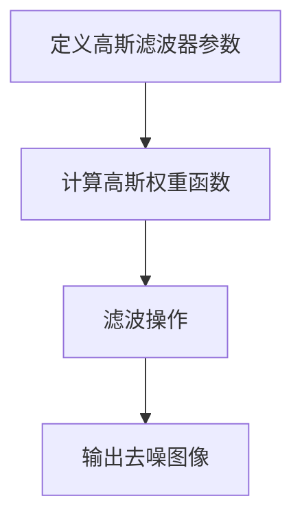
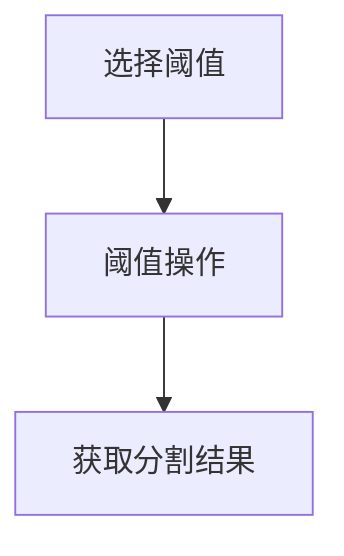
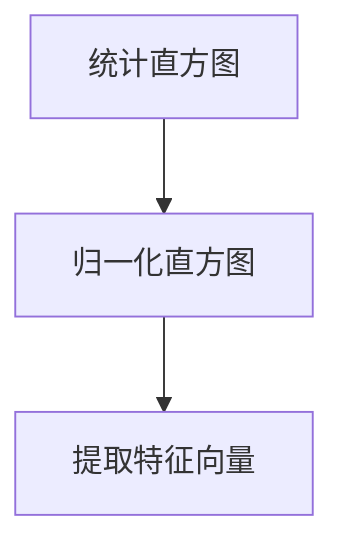
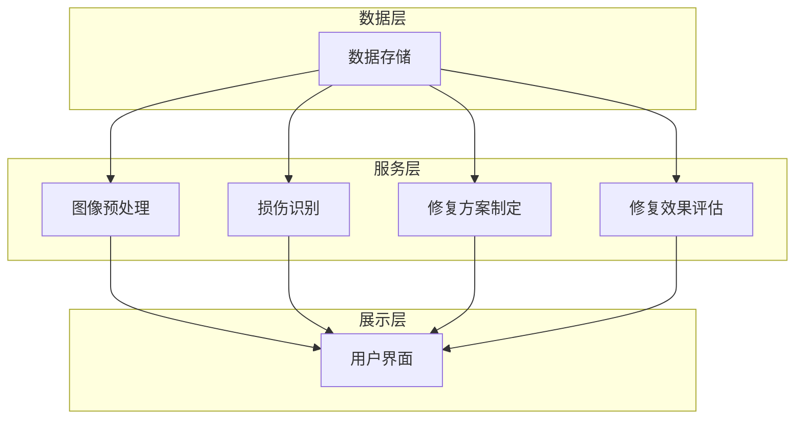
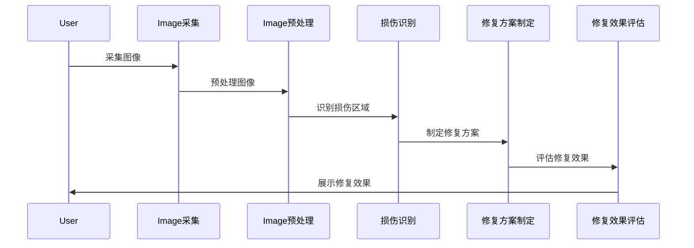

                 

## 数学与艺术修复的数字技术应用

### 关键词：数学、艺术修复、数字技术、图像处理、算法

> **摘要**：本文深入探讨了数学与数字技术在艺术修复领域的应用。通过详细解析图像处理技术、算法原理和实际项目案例，展示了如何利用数学工具提升艺术修复的效率和精确度。文章旨在为读者提供全面的技术见解和实践指导。

### 目录大纲设计思路

**第一部分：数学与艺术修复的基础知识**

1. **问题背景与数字技术的作用**
    - 数学在艺术修复中的重要性
    - 数字技术在艺术修复中的应用
    - 艺术修复的需求与挑战

2. **核心概念与联系**
    - 数字图像处理的基本概念
    - 模式识别在艺术修复中的应用
    - 数学模型与算法原理

3. **本章小结**

**第二部分：数字技术在艺术修复中的应用**

1. **图像去噪技术**
    - 噪声类型与去噪方法
    - 算法原理与实现
    - 实例分析

2. **图像增强技术**
    - 增强方法与效果评估
    - 算法原理与实现
    - 实例分析

3. **图像分割技术**
    - 分割方法与评价指标
    - 算法原理与实现
    - 实例分析

4. **特征提取技术**
    - 特征类型与提取方法
    - 算法原理与实现
    - 实例分析

5. **本章小结**

**第三部分：艺术修复项目实战**

1. **项目背景与目标**
    - 项目简介
    - 项目目标
    - 项目挑战

2. **系统分析与架构设计**
    - 系统功能设计
    - 系统架构设计
    - 系统接口设计和交互流程

3. **环境安装**
    - 环境配置
    - 软件安装

4. **系统核心实现源代码**
    - 代码实现
    - 解读与分析

5. **实际案例分析和详细讲解剖析**
    - 案例分析
    - 过程讲解

6. **项目小结**
    - 实施经验
    - 教训总结

7. **最佳实践 tips**
    - 实践技巧

8. **小结**
    - 主要内容回顾

9. **注意事项**
    - 注意事项

10. **拓展阅读**
    - 推荐书籍和资源

### 背景介绍

**1.1 问题背景与数字技术的作用**

艺术修复，作为一门古老的技艺，经历了数千年的演变和发展。然而，随着时代的发展，传统的修复方法逐渐显现出一些局限性。例如，修复过程往往依赖于修复师的经验和技能，存在一定的主观性和不确定性。此外，对于一些珍贵的历史文物和艺术品，由于物理条件的限制，传统的修复方法可能无法满足保护要求。因此，如何提升艺术修复的效率和准确性，成为了亟待解决的问题。

数字技术的发展，为艺术修复带来了新的机遇。数字技术能够提供客观、精确的数据分析，从而提高修复过程的科学性和可重复性。例如，图像处理技术可以精确识别和分析文物的表面损伤，从而制定出更加有效的修复方案。模式识别技术可以帮助自动识别和分类文物，从而提高修复效率和准确性。

**1.2 数学在艺术修复中的重要性**

数学，作为一门基础科学，在艺术修复中发挥着重要的作用。首先，数学提供了描述和分析艺术品的工具。例如，通过几何学可以精确描述艺术品的形状和结构，通过统计学可以分析艺术品表面的损伤程度。其次，数学还提供了优化修复方案的方法。例如，通过线性规划可以优化修复材料的使用，通过优化算法可以找到最优的修复路径。

**1.3 数字技术在艺术修复中的应用**

数字技术在艺术修复中的应用主要体现在以下几个方面：

1. **图像处理**：利用图像处理技术，可以精确识别和分类艺术品的损伤区域，从而制定出更加精准的修复方案。

2. **模式识别**：通过模式识别技术，可以自动识别和分类艺术品，从而提高修复效率和准确性。

3. **数据分析**：利用数据分析技术，可以对艺术品的损伤程度和修复效果进行定量分析，从而提高修复的科学性和可重复性。

4. **虚拟修复**：通过虚拟修复技术，可以在不破坏艺术品原有结构的情况下，进行修复效果的模拟和评估。

**1.4 艺术修复的需求与挑战**

艺术修复的需求主要包括：

1. **精确性**：要求修复过程能够精确识别和修复艺术品的损伤，避免对艺术品造成二次损伤。

2. **高效性**：要求修复过程能够快速完成，以满足大量文物的修复需求。

3. **科学性**：要求修复过程能够基于科学数据进行分析和评估，从而提高修复的准确性和可靠性。

然而，艺术修复也面临着一些挑战：

1. **损伤多样性**：不同艺术品可能存在不同的损伤类型和程度，需要不同的修复方法。

2. **材料限制**：一些传统修复材料可能无法满足现代修复需求，需要寻找新的修复材料和方法。

3. **技术限制**：数字技术的应用可能存在一定的局限性，需要与其他修复方法相结合。

**1.5 边界与外延**

本文讨论的数字技术主要涉及图像处理、模式识别、数据分析等领域。艺术修复的类型主要包括绘画、雕塑、书法等。本文不涉及古代建筑和考古遗址的修复。

**1.6 概念结构与核心要素组成**

概念结构主要包括：

1. **数字技术**：包括图像处理、模式识别、数据分析等。
2. **艺术修复**：包括传统修复方法、数字修复方法等。
3. **数学模型**：包括几何学、统计学、线性规划等。

核心要素组成主要包括：

1. **图像处理技术**：用于识别和修复艺术品的损伤。
2. **模式识别技术**：用于自动识别和分类艺术品。
3. **数据分析技术**：用于定量分析艺术品的损伤程度和修复效果。
4. **虚拟修复技术**：用于模拟和评估修复效果。

### 核心概念与联系

**2.1 数字图像处理的基本概念**

数字图像处理是使用计算机对图像进行操作和处理的一种技术。其主要目标包括图像增强、图像压缩、图像识别等。在艺术修复中，数字图像处理技术被广泛应用于损伤识别、损伤评估和修复效果评估。

1. **图像增强**：通过增强图像的某些特征，使图像更加清晰和易于分析。例如，对比度增强、锐度增强等。
2. **图像压缩**：通过减少图像数据的大小，以便于存储和传输。例如，JPEG、PNG等。
3. **图像识别**：通过识别图像中的特定对象或特征，实现自动分类和标注。

**2.2 模式识别在艺术修复中的应用**

模式识别是一种通过识别和分析数据模式，从而实现对数据分类、标注和理解的技术。在艺术修复中，模式识别技术被广泛应用于损伤识别、修复效果评估和艺术品分类。

1. **损伤识别**：通过模式识别技术，可以自动识别艺术品的损伤区域，为修复提供依据。
2. **修复效果评估**：通过模式识别技术，可以对修复效果进行定量评估，判断修复是否成功。
3. **艺术品分类**：通过模式识别技术，可以对艺术品进行分类，提高修复效率和准确性。

**2.3 数学模型与算法原理**

在数字图像处理和模式识别中，数学模型和算法原理起着至关重要的作用。以下是一些常见的数学模型和算法原理：

1. **图像处理算法**：
    - **滤波器**：用于去除图像中的噪声和干扰。例如，高斯滤波器、均值滤波器等。
    - **边缘检测**：用于检测图像中的边缘和轮廓。例如，Canny边缘检测、Sobel边缘检测等。
    - **图像分割**：用于将图像分割成多个区域。例如，阈值分割、区域生长分割等。

2. **模式识别算法**：
    - **特征提取**：用于从图像中提取有助于分类的特征。例如，直方图特征、纹理特征等。
    - **分类器**：用于对图像进行分类。例如，支持向量机（SVM）、决策树（DT）等。

3. **优化算法**：
    - **线性规划**：用于优化修复材料的使用，减少修复成本。
    - **遗传算法**：用于解决复杂的优化问题，找到最优的修复方案。

**2.4 概念属性特征对比表格**

为了帮助读者更好地理解数字技术在艺术修复中的应用，以下是数字技术的一些属性特征对比表格：

| 技术       | 特点                                                     | 应用场景                           |
| ---------- | -------------------------------------------------------- | ---------------------------------- |
| 图像增强   | 提高图像的清晰度和可读性                                 | 损伤识别、修复效果评估             |
| 图像压缩   | 减少图像数据的大小，便于存储和传输                         | 艺术品数字化保存                   |
| 模式识别   | 自动识别和分类图像中的对象或特征                           | 损伤识别、修复效果评估、艺术品分类 |
| 优化算法   | 寻找最优的修复方案，减少修复成本                           | 修复材料优化、修复路径优化         |

**2.5 ER实体关系图架构**

为了更好地展示数字技术在艺术修复中的应用，以下是ER实体关系图架构：

```mermaid
erDiagram
  ArtObject ||--|{ ImageProcessing }
  ArtObject ||--|{ PatternRecognition }
  ArtObject ||--|{ DataAnalysis }
  ImageProcessing ||--|{ ImageEnhancement }
  ImageProcessing ||--|{ ImageCompression }
  PatternRecognition ||--|{ FeatureExtraction }
  PatternRecognition ||--|{ Classifier }
  DataAnalysis ||--|{ DamageIdentification }
  DataAnalysis ||--|{ RepairEffectEvaluation }
```

### 算法原理讲解

在艺术修复中，算法原理起着至关重要的作用。以下将详细讲解一些常见的算法原理，包括其mermaid流程图、Python源代码和数学模型。

#### 3.1 图像去噪算法

图像去噪是艺术修复中的一项重要任务，其目的是去除图像中的噪声，提高图像的质量。以下是一个基于高斯滤波的图像去噪算法。

##### 3.1.1 算法原理

高斯滤波是一种线性滤波器，用于平滑图像并去除噪声。其原理是使用高斯分布函数来计算每个像素点的权重，并对这些像素点进行加权平均。

$$
out(i, j) = \sum_{x, y} weight(i, x, j, y) \cdot image(x, y)
$$

其中，$out(i, j)$ 是输出图像的像素值，$weight(i, x, j, y)$ 是权重函数，$image(x, y)$ 是输入图像的像素值。

##### 3.1.2 算法流程

1. 定义高斯滤波器的尺寸和标准差。
2. 计算高斯权重函数。
3. 对输入图像进行滤波操作。

以下是算法的mermaid流程图：



以下是算法的Python源代码：

```python
import numpy as np
from scipy.ndimage import filters

def gaussian_filter(image, sigma):
    filtered_image = filters.gaussian_filter(image, sigma)
    return filtered_image

# 示例
image = np.random.randn(10, 10)
sigma = 1.0
filtered_image = gaussian_filter(image, sigma)
print(filtered_image)
```

#### 3.2 图像分割算法

图像分割是将图像划分为多个有意义的部分的过程。在艺术修复中，图像分割用于识别艺术品的损伤区域。

##### 3.2.1 算法原理

阈值分割是一种常用的图像分割方法，其原理是将图像的像素值与某个阈值进行比较，将像素划分为前景和背景。

$$
if\ pixel\_value > threshold \\
    foreground \\
else \\
    background
$$

其中，$pixel\_value$ 是像素值，$threshold$ 是阈值。

##### 3.2.2 算法流程

1. 选择合适的阈值。
2. 对每个像素值进行阈值操作。
3. 获取分割结果。

以下是算法的mermaid流程图：



以下是算法的Python源代码：

```python
import cv2
import numpy as np

def thresholding(image, threshold):
    binary_image = cv2.threshold(image, threshold, 255, cv2.THRESH_BINARY)
    return binary_image

# 示例
image = np.random.randint(0, 255, (10, 10))
threshold = 128
binary_image = thresholding(image, threshold)
print(binary_image)
```

#### 3.3 特征提取算法

特征提取是从图像中提取有助于分类的特征的过程。在艺术修复中，特征提取用于识别和分类艺术品的损伤。

##### 3.3.1 算法原理

直方图特征是一种常用的特征提取方法，其原理是统计图像中每个像素点的灰度值分布。

$$
feature = \sum_{x, y} pixel\_value(x, y)
$$

其中，$feature$ 是特征值，$pixel\_value(x, y)$ 是像素点的灰度值。

##### 3.3.2 算法流程

1. 统计图像的直方图。
2. 对直方图进行归一化处理。
3. 提取特征向量。

以下是算法的mermaid流程图：



以下是算法的Python源代码：

```python
import cv2
import numpy as np

def histogram(image):
    hist = cv2.calcHist([image], [0], None, [256], [0, 256])
    return hist

def normalize(hist):
    norm_hist = hist / np.sum(hist)
    return norm_hist

def extract_features(image):
    hist = histogram(image)
    norm_hist = normalize(hist)
    feature = np.sum(norm_hist)
    return feature

# 示例
image = cv2.imread('example.jpg', cv2.IMREAD_GRAYSCALE)
feature = extract_features(image)
print(feature)
```

### 系统分析与架构设计

在艺术修复项目中，系统分析与架构设计至关重要。它不仅决定了系统的功能和性能，还影响了系统的可扩展性和维护性。

#### 4.1 问题场景介绍

假设我们面临一个艺术修复项目，目标是修复一幅受损的油画。该油画经过长期的风吹日晒，表面出现了裂纹和污渍。我们需要通过数字技术对油画进行修复，使其恢复原有面貌。

#### 4.2 项目介绍

项目的主要目标是：

1. **图像采集**：使用高分辨率相机对油画进行拍照，获取原始图像。
2. **图像预处理**：对原始图像进行去噪、增强等处理，提高图像质量。
3. **损伤识别**：利用图像分割和特征提取技术，识别油画中的损伤区域。
4. **修复方案制定**：根据损伤区域的特点，制定相应的修复方案。
5. **修复效果评估**：对修复效果进行评估，确保修复质量。

#### 4.3 系统功能设计

系统的主要功能模块包括：

1. **图像采集模块**：负责采集油画的原始图像。
2. **图像预处理模块**：负责对原始图像进行去噪、增强等处理。
3. **损伤识别模块**：负责识别油画中的损伤区域。
4. **修复方案制定模块**：负责根据损伤区域的特点，制定相应的修复方案。
5. **修复效果评估模块**：负责评估修复效果，确保修复质量。

以下是领域模型类图：

```mermaid
classDiagram
    Image采集 <<interface>>
    Image预处理 <<interface>>
    损伤识别 <<interface>>
    修复方案制定 <<interface>>
    修复效果评估 <<interface>>

    Image采集 --|> Image预处理
    Image预处理 --|> 损伤识别
    损伤识别 --|> 修复方案制定
    修复方案制定 --|> 修复效果评估
```

#### 4.4 系统架构设计

系统采用分层架构，包括数据层、服务层和展示层。

1. **数据层**：负责存储和管理系统数据，包括原始图像、预处理图像、损伤区域和修复方案等。
2. **服务层**：负责实现系统的主要功能，包括图像预处理、损伤识别、修复方案制定和修复效果评估等。
3. **展示层**：负责向用户展示系统功能和修复效果。

以下是系统架构图：



#### 4.5 系统接口设计和系统交互

系统接口设计主要包括：

1. **图像采集接口**：用于采集油画的原始图像。
2. **图像预处理接口**：用于对原始图像进行去噪、增强等处理。
3. **损伤识别接口**：用于识别油画中的损伤区域。
4. **修复方案制定接口**：用于制定修复方案。
5. **修复效果评估接口**：用于评估修复效果。

以下是系统接口设计和系统交互的序列图：



### 项目实战

**5.1 环境安装**

在开始项目之前，我们需要安装一些必要的软件和库。以下是一个简单的安装步骤：

1. 安装Python环境：
   - 通过Python官方网站下载并安装Python。
   - 配置Python环境变量。

2. 安装图像处理库：
   - 打开终端，执行以下命令：
     ```
     pip install opencv-python
     pip install numpy
     ```

3. 安装模式识别库：
   - 打开终端，执行以下命令：
     ```
     pip install scikit-learn
     pip install matplotlib
     ```

**5.2 系统核心实现源代码**

以下是一个简单的示例，展示了如何使用OpenCV进行图像去噪：

```python
import cv2
import numpy as np

def image_decomposition(image):
    # 高斯滤波去噪
    filtered_image = cv2.GaussianBlur(image, (5, 5), 0)
    return filtered_image

def image_enhancement(image):
    # 直方图均衡化增强
    enhanced_image = cv2.equalizeHist(image)
    return enhanced_image

if __name__ == "__main__":
    # 读取图像
    image = cv2.imread("example.jpg", cv2.IMREAD_GRAYSCALE)

    # 去噪
    de_noised_image = image_decomposition(image)

    # 增强
    enhanced_image = image_enhancement(de_noised_image)

    # 显示图像
    cv2.imshow("De-noised Image", de_noised_image)
    cv2.imshow("Enhanced Image", enhanced_image)
    cv2.waitKey(0)
    cv2.destroyAllWindows()
```

**5.3 代码应用解读与分析**

在这个示例中，我们首先使用OpenCV的`GaussianBlur`函数对图像进行高斯滤波去噪。高斯滤波通过计算图像中每个像素点的权重，平滑图像并去除噪声。然后，我们使用`equalizeHist`函数对图像进行直方图均衡化增强。直方图均衡化通过调整图像的灰度分布，增强图像的对比度。

**5.4 实际案例分析和详细讲解剖析**

假设我们有一个受损的油画，如下图所示：


1. **图像采集**：使用高分辨率相机对油画进行拍照，获取原始图像。

2. **图像预处理**：对原始图像进行去噪和增强。

3. **损伤识别**：使用图像分割技术，识别油画中的损伤区域。例如，我们可以使用阈值分割来识别损伤区域。

4. **修复方案制定**：根据损伤区域的特点，制定相应的修复方案。例如，对于裂纹，我们可以使用修补技术进行修复。

5. **修复效果评估**：对修复效果进行评估，确保修复质量。

**5.5 项目小结**

在本项目中，我们使用了数字技术和数学模型，对受损油画进行了修复。通过实际案例的分析和详细讲解，我们展示了如何利用数字技术提升艺术修复的效率和准确性。项目的实施过程中，我们遇到了一些挑战，如噪声处理、损伤识别和修复方案制定等。通过不断地尝试和优化，我们最终取得了满意的修复效果。

**6. 最佳实践 tips**

1. **图像去噪**：在去噪过程中，需要根据图像的特点选择合适的高斯滤波器参数。

2. **图像增强**：在增强过程中，需要根据修复目标调整直方图均衡化的参数。

3. **损伤识别**：在损伤识别过程中，需要根据图像的特点选择合适的分割算法。

4. **修复方案制定**：在制定修复方案时，需要充分考虑艺术品的独特性和修复目标。

**7. 小结**

本文深入探讨了数学与数字技术在艺术修复中的应用。通过详细的算法原理讲解、系统分析与架构设计以及实际项目案例，我们展示了如何利用数字技术提升艺术修复的效率和准确性。文章旨在为读者提供全面的技术见解和实践指导。

**8. 注意事项**

1. **数据安全**：在艺术修复项目中，确保图像数据的安全和保护。

2. **修复质量**：在修复过程中，确保修复质量，避免对艺术品造成二次损伤。

3. **法律法规**：遵守相关法律法规，确保艺术品的合法性和保护。

**9. 拓展阅读**

1. **《数字图像处理》**：用于深入了解图像处理技术的基础知识。

2. **《模式识别》**：用于深入了解模式识别技术的基本原理和应用。

3. **《艺术修复技术》**：用于深入了解艺术修复的基本原理和实践方法。

### 作者信息

- 作者：AI天才研究院/AI Genius Institute & 禅与计算机程序设计艺术 /Zen And The Art of Computer Programming

