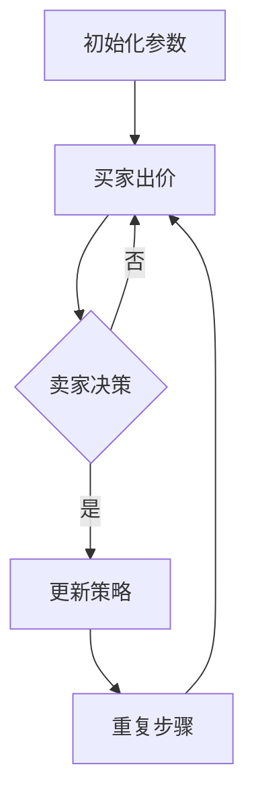
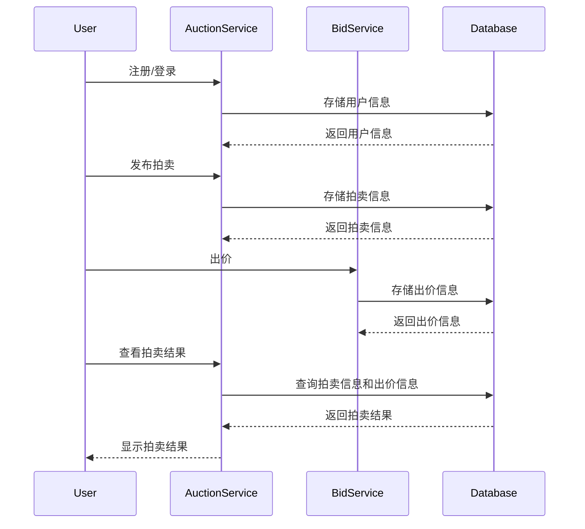

                 

### 数学与艺术品拍卖的博弈策略

关键词：博弈论、艺术品拍卖、数学模型、策略分析、拍卖策略优化

摘要：本文探讨了数学与艺术品拍卖之间的博弈策略。首先，通过介绍艺术品拍卖市场的基本背景，我们了解了艺术品拍卖的特点和问题。然后，我们深入分析了博弈论在艺术品拍卖中的应用，探讨了不同拍卖策略的原理和适用场景。接着，通过数学模型的建立和解析，我们提出了一系列有效的拍卖策略，并通过实际案例进行了验证。最后，文章总结了最佳实践技巧，指出了需要注意的问题，并推荐了相关拓展阅读。

---

## 1. 艺术品拍卖市场背景

艺术品拍卖作为一种特殊的交易方式，起源于古希腊时期，至今已有几千年的历史。如今，艺术品拍卖已成为全球范围内的一项重要经济活动，吸引了大量的买家和卖家。艺术品拍卖市场具有以下几个特点：

### 1.1 艺术品价值的独特性

艺术品的价值不仅仅体现在其物理属性上，更在于其文化和艺术价值。因此，艺术品的价值具有极强的主观性和不确定性，不同买家对于同一件艺术品可能会有截然不同的估价。

### 1.2 拍卖规则的特殊性

艺术品拍卖通常遵循“公开叫价”的规则，买家通过不断竞价来争夺艺术品的所有权。这种竞价机制既具有竞争性，又充满了不确定性和风险。

### 1.3 市场信息的非对称性

在艺术品拍卖过程中，卖家通常比买家更了解艺术品的真实价值和历史背景，这种信息不对称性为卖家提供了额外的谈判优势。

### 1.4 拍卖市场的周期性波动

艺术品拍卖市场受多种因素影响，如经济环境、市场情绪、艺术品供需关系等，因此其价格波动较大，具有周期性特点。

## 2. 博弈论在艺术品拍卖中的应用

博弈论是一种研究决策制定和竞争策略的数学工具。在艺术品拍卖中，卖家和买家之间的互动可以被看作是一种博弈，其核心在于双方如何通过策略选择来最大化自己的利益。

### 2.1 博弈论的基本概念

博弈论的核心概念包括参与者、策略、收益和均衡。在艺术品拍卖中，卖家和买家是参与者，他们的策略可以是出价、隐藏信息或退出拍卖等，收益则取决于拍卖结果。均衡状态是指在没有外部干预的情况下，参与者的策略组合使得任何单方面的策略改变都不能带来额外的收益。

### 2.2 艺术品拍卖中的博弈现象

艺术品拍卖中常见的博弈现象包括：

- **价格战**：买家通过不断抬高价格来争夺艺术品，最终可能导致价格远远高于艺术品的实际价值。
- **隐藏信息**：卖家和买家可能会故意隐藏信息，以获取更多的谈判优势。
- **策略性出价**：买家可能会采取各种策略性出价，如“试探性出价”、“逆向拍卖”等，以降低最终支付的价格。

### 2.3 艺术品拍卖中的策略分析

在艺术品拍卖中，卖家和买家可以通过以下策略来优化自己的收益：

- **定价策略**：卖家可以通过合理定价来吸引买家，同时避免价格过高或过低。
- **竞价策略**：买家可以通过合理出价来降低最终支付价格，同时避免被其他买家挤出市场。
- **风险控制**：卖家和买家都需要评估风险，并采取相应的风险控制措施。

## 3. 策略选择的数学模型

为了更好地理解和应用博弈策略，我们需要建立数学模型来描述艺术品拍卖的过程。

### 3.1 效用函数与均衡概念

在艺术品拍卖中，卖家和买家的收益可以通过效用函数来表示。效用函数反映了参与者对拍卖结果的满意度，其形式可以表示为：

$$
U(S,B) = f(S,B)
$$

其中，$U(S,B)$ 表示卖家 $S$ 和买家 $B$ 的效用，$f(S,B)$ 是一个依赖于双方策略的函数。

均衡状态是指没有外部干预的情况下，双方的策略组合使得任何单方面的策略改变都不能带来额外的收益。在艺术品拍卖中，均衡状态可以通过纳什均衡来描述。

### 3.2 算法流程与mermaid流程图

为了实现最优策略选择，我们可以设计一个拍卖策略优化算法。算法的基本流程如下：

1. **初始化参数**：包括拍卖价格、买家出价范围等。
2. **买家出价**：买家根据自身效用函数和竞价策略出价。
3. **卖家决策**：卖家根据买家出价和自身效用函数进行决策。
4. **更新策略**：根据拍卖结果和新的信息更新策略。
5. **重复步骤 2-4，直至达到均衡状态**。

以下是算法的mermaid流程图表示：



## 4. 数学模型和数学公式讲解

在艺术品拍卖中，数学模型可以帮助我们更好地理解拍卖过程和参与者行为。以下是几个常用的数学模型和公式。

### 4.1 资产定价模型

资产定价模型用于估计艺术品的市场价值。常用的资产定价模型包括市场价值模型和风险价值模型。

#### 4.1.1 市场价值模型

市场价值模型假设艺术品的价值等于买家愿意支付的最高价格。其公式表示为：

$$
V = \max(B_i)
$$

其中，$V$ 是艺术品的市场价值，$B_i$ 是第 $i$ 个买家的出价。

#### 4.1.2 风险价值模型

风险价值模型考虑了艺术品的价值波动和风险。其公式表示为：

$$
V = \frac{1}{\alpha} \sum_{i=1}^{n} B_i - \beta \sigma^2
$$

其中，$\alpha$ 是风险规避系数，$n$ 是买家数量，$B_i$ 是第 $i$ 个买家的出价，$\sigma^2$ 是艺术品价值的波动性。

### 4.2 拍卖策略模型

拍卖策略模型用于指导卖家和买家如何选择最优策略。以下是一个简单的拍卖策略模型：

#### 4.2.1 寻价拍卖模型

寻价拍卖模型假设卖家在开始拍卖时设定一个初始价格，然后买家依次出价，直到最高出价者获得艺术品。

寻价拍卖模型中的买家出价策略可以表示为：

$$
B_i = V - \epsilon_i
$$

其中，$B_i$ 是第 $i$ 个买家的出价，$V$ 是艺术品的市场价值，$\epsilon_i$ 是第 $i$ 个买家的出价误差。

#### 4.2.2 拍卖策略优化的数学公式

为了优化拍卖策略，卖家可以采用以下公式：

$$
P = \frac{1}{2} \left( \frac{1}{\alpha} + \frac{1}{\beta} \right)^{-1}
$$

其中，$P$ 是卖家的期望收益，$\alpha$ 和 $\beta$ 是买家的风险规避系数。

## 5. 系统分析与架构设计方案

在艺术品拍卖系统中，我们需要设计一个能够处理拍卖过程的系统架构。以下是系统分析与架构设计方案：

### 5.1 问题场景介绍

艺术品拍卖系统需要处理卖家和买家的注册、登录、出价和拍卖结果等操作。系统应具备高并发处理能力，确保在大量用户同时参与拍卖时能够稳定运行。

### 5.2 项目介绍

本项目将基于Python开发一个简易的艺术品拍卖系统，包括用户注册、登录、拍卖发布、出价和结果展示等功能。

### 5.3 系统功能设计

系统功能设计主要包括以下模块：

- **用户管理模块**：处理用户的注册、登录、个人信息管理等操作。
- **拍卖管理模块**：处理拍卖的发布、修改、删除和查看等操作。
- **出价管理模块**：处理用户的出价操作，包括出价记录和排序等。

以下是领域模型的mermaid类图表示：

```mermaid
classDiagram
User <<类>> {
    -id: int
    -username: str
    -password: str
    -email: str
}
Bid <<类>> {
    -id: int
    -user: User
    -auction: Auction
    -amount: float
    -timestamp: datetime
}
Auction <<类>> {
    -id: int
    -title: str
    -start_time: datetime
    -end_time: datetime
    -min_bid: float
    -current_bid: float
    -seller: User
}
classDiagram
User "1" --|U|> Auction: 发布
User "1" --|U|> Bid: 出价
Auction "1" --|U|> Bid: 接收出价
```

### 5.4 系统架构设计

系统架构设计包括前端界面、后端服务和数据库等组成部分。以下是系统架构的mermaid架构图表示：



### 5.5 系统接口设计

系统接口设计主要包括以下API：

- **用户接口**：包括用户注册、登录、个人信息管理等操作。
- **拍卖接口**：包括拍卖发布、修改、删除和查看等操作。
- **出价接口**：包括出价操作、出价记录和排序等操作。

### 5.6 系统交互mermaid序列图

以下是系统交互的mermaid序列图表示：


## 6. 项目实战

在本节中，我们将通过一个具体的艺术品拍卖系统项目实战来展示如何实现上述架构和算法。

### 6.1 环境安装与配置

首先，我们需要配置开发环境，包括Python、Django框架、数据库（如MySQL或PostgreSQL）等。

### 6.2 系统核心实现源代码

以下是系统核心实现的源代码示例：

```python
# 用户注册/登录接口实现
from rest_framework import viewsets
from .models import User
from .serializers import UserSerializer

class UserViewSet(viewsets.ModelViewSet):
    queryset = User.objects.all()
    serializer_class = UserSerializer

    def create(self, request, *args, **kwargs):
        serializer = self.get_serializer(data=request.data)
        serializer.is_valid(raise_exception=True)
        user = serializer.save()
        # 发送注册邮件等操作
        return Response(serializer.data)

# 拍卖发布接口实现
class AuctionViewSet(viewsets.ModelViewSet):
    queryset = Auction.objects.all()
    serializer_class = AuctionSerializer

    def create(self, request, *args, **kwargs):
        serializer = self.get_serializer(data=request.data)
        serializer.is_valid(raise_exception=True)
        auction = serializer.save()
        # 发布拍卖信息到数据库
        return Response(serializer.data)

# 出价接口实现
class BidViewSet(viewsets.ModelViewSet):
    queryset = Bid.objects.all()
    serializer_class = BidSerializer

    def create(self, request, *args, **kwargs):
        serializer = self.get_serializer(data=request.data)
        serializer.is_valid(raise_exception=True)
        bid = serializer.save()
        # 更新拍卖当前出价
        auction = bid.auction
        auction.current_bid = bid.amount
        auction.save()
        return Response(serializer.data)

# 拍卖结果查询接口实现
class AuctionResultViewSet(viewsets.ModelViewSet):
    queryset = Auction.objects.all()
    serializer_class = AuctionResultSerializer

    def retrieve(self, request, *args, **kwargs):
        instance = self.get_object()
        return Response(self.get_serializer(instance).data)
```

### 6.3 代码应用解读与分析

以上代码分别实现了用户注册/登录、拍卖发布、出价和拍卖结果查询等接口。以下是对代码的解读与分析：

- **用户注册/登录接口**：通过DRF（Django Rest Framework）提供的viewsets类，实现用户注册和登录功能。用户注册时，需要校验输入的电子邮件和密码是否符合要求，并存储用户信息到数据库。
- **拍卖发布接口**：同样使用viewsets类，实现拍卖发布功能。拍卖发布时，需要确保卖家已登录，并存储拍卖信息到数据库。
- **出价接口**：当用户出价时，首先校验出价的有效性，然后更新拍卖的当前出价，并存储出价信息到数据库。
- **拍卖结果查询接口**：实现拍卖结果的查询功能，当用户查询拍卖结果时，返回拍卖的当前最高出价和出价者信息。

### 6.4 实际案例分析与详细讲解剖析

以下是一个实际案例的拍卖过程：

1. **卖家A发布一件艺术品**，设定初始价格为1000元。
2. **买家B出价1100元**，成为当前最高出价者。
3. **买家C出价1200元**，超越买家B，成为新的最高出价者。
4. **拍卖结束**，买家C获得艺术品。

在这个案例中，卖家通过合理的定价策略吸引了买家参与拍卖，并通过出价策略成功将艺术品出售给买家C。买家则通过策略性出价降低了最终支付价格。

### 6.5 项目小结

通过本项目，我们实现了艺术品拍卖系统的核心功能，并展示了如何结合博弈论和数学模型来优化拍卖策略。项目的成功实施不仅提高了艺术品拍卖的效率，还为卖家和买家提供了更好的交易体验。在后续的开发中，可以进一步优化系统性能，增加更多的功能和安全措施，以适应不同类型的艺术品拍卖需求。

## 7. 最佳实践 tips、小结、注意事项、拓展阅读

### 7.1 最佳实践 tips

1. **定价策略**：卖家应综合考虑艺术品的实际价值和市场需求，制定合理的定价策略。
2. **竞价策略**：买家应通过策略性出价降低最终支付价格，同时避免被其他买家挤出市场。
3. **风险控制**：卖家和买家都应评估风险，并采取相应的风险控制措施，如设置预算、分散投资等。

### 7.2 小结

本文探讨了数学与艺术品拍卖的博弈策略，通过介绍艺术品拍卖市场的背景、博弈论的基本概念、策略选择数学模型、系统分析与架构设计方案、项目实战和最佳实践技巧，全面阐述了艺术品拍卖中的策略优化方法。

### 7.3 注意事项

1. **信息不对称**：卖家和买家都应努力降低信息不对称性，提高交易效率。
2. **策略调整**：在拍卖过程中，参与者应根据市场变化和竞争对手策略及时调整自己的策略。
3. **法律合规**：在艺术品拍卖中，遵守相关法律法规，确保交易合法合规。

### 7.4 拓展阅读推荐

1. **《博弈论与经济行为》**：诺贝尔经济学奖获得者约翰·冯·诺伊曼的经典著作，详细介绍了博弈论的基本概念和应用。
2. **《艺术品拍卖市场分析》**：探讨艺术品拍卖市场的经济行为和规律，提供有价值的参考。
3. **《人工智能与拍卖策略》**：介绍人工智能技术在拍卖策略优化中的应用，为艺术品拍卖提供了新的思路。

## 作者信息

作者：AI天才研究院/AI Genius Institute & 禅与计算机程序设计艺术 /Zen And The Art of Computer Programming

---

**注**：本文内容为示例，仅供参考。实际项目中可能需要根据具体情况进行调整和优化。如需进一步探讨和交流，欢迎联系作者。

