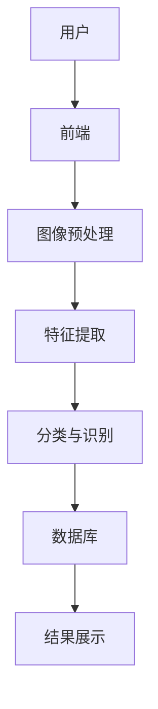
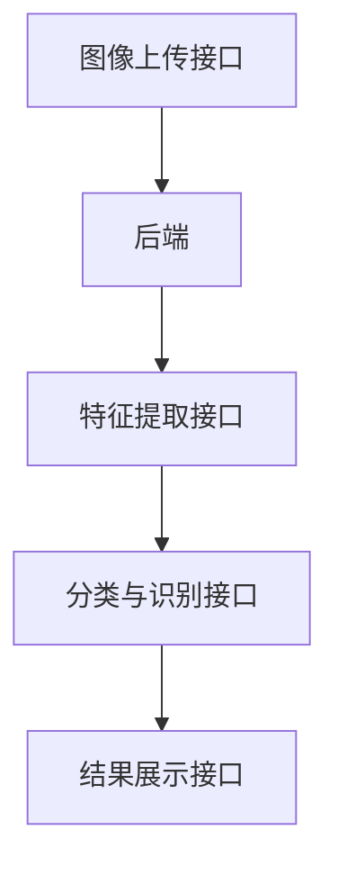
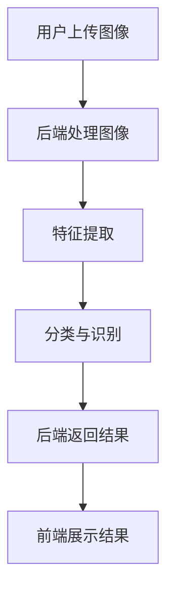

                 


## 引言

### 第1章：问题背景与目标

#### 1.1 问题背景

艺术品鉴定是艺术领域的一项重要活动，它涉及对艺术品的真伪、年代、作者、材质等多方面的判断。传统的艺术品鉴定主要依赖于专家的经验和专业的观察，这种方法的准确性受到人为因素的限制，且在处理大量艺术品时效率低下。随着数字化技术的快速发展，特别是图像处理和计算机视觉技术的进步，艺术家们开始探索将数学与图像分析方法应用于艺术品鉴定，以提高鉴定的准确性和效率。

**1.1.1 艺术品鉴定的需求**

艺术品鉴定需求主要来自于以下几个方面：

1. **真伪鉴定**：确保艺术品是原创还是复制品，尤其是在艺术品市场上，对真品的辨别尤为重要。
2. **年代判定**：确定艺术品的创作年代，有助于理解艺术品的历史和文化价值。
3. **作者确认**：识别艺术品的创作者，这对于艺术品的收藏和估价至关重要。
4. **材质分析**：了解艺术品的材质，例如绘画中的颜料类型和绘画技法，有助于鉴定其真实性和艺术价值。

**1.1.2 传统鉴定方法的局限性**

传统鉴定方法主要依赖于专家的经验和观察，这种方法具有以下局限性：

1. **主观性较强**：专家的经验和主观判断可能导致鉴定结果的差异。
2. **效率低下**：对大量艺术品进行逐一鉴定耗时耗力。
3. **数据缺乏**：传统方法难以量化艺术品的各种特征，无法进行大规模数据分析。

**1.1.3 数字化技术在艺术品鉴定中的应用**

数字化技术提供了新的可能性，使得艺术品鉴定更加客观、准确和高效。图像处理技术可以用于提取艺术品的高分辨率图像，并从中提取各种特征。计算机视觉技术可以辅助专家进行复杂模式识别，提高鉴定精度。例如，通过分析艺术品的笔触、色彩、纹理等特征，可以判断其真伪和年代。此外，利用大数据和机器学习技术，可以构建艺术品鉴定的智能系统，实现自动化的鉴定过程。

#### 1.2 研究目标与意义

**1.2.1 研究目标**

本研究的目标是探讨数学与图像分析方法在艺术品鉴定中的应用，具体包括：

1. **特征提取**：从艺术品的图像中提取出能够反映其真伪、年代、作者和材质的特征。
2. **分类与识别**：利用提取的特征对艺术品进行分类和识别，提高鉴定的准确性和效率。
3. **数学模型构建**：构建适用于艺术品鉴定的数学模型，为图像分析提供理论基础。

**1.2.2 研究意义**

本研究具有重要的实际意义和理论价值：

1. **提高鉴定准确性和效率**：通过图像分析技术，可以减少人为因素的干扰，提高鉴定的准确性和效率。
2. **促进艺术品市场发展**：准确的艺术品鉴定有助于保护艺术品免受伪造和盗窃，维护艺术品市场的健康发展。
3. **推动跨学科发展**：数学与图像分析技术在艺术品鉴定中的应用，推动了艺术学与计算机科学、数学等学科的交叉融合，促进了相关领域的发展。

#### 1.3 边界与外延

**1.3.1 艺术品鉴定范围的界定**

本文讨论的艺术品鉴定范围主要涉及绘画、雕塑等二维和三维艺术品。具体包括：

1. **绘画**：包括油画、水彩画、素描等。
2. **雕塑**：包括石雕、铜雕、木雕等。
3. **其他**：如镶嵌画、陶瓷艺术等。

**1.3.2 图像分析方法的选择标准**

在选择图像分析方法时，应考虑以下标准：

1. **特征丰富性**：提取的特征应能够全面反映艺术品的各个方面，包括颜色、纹理、笔触等。
2. **抗噪性**：图像分析方法应具有较强的抗噪性，能够在不同环境下保持较高的鉴定准确率。
3. **效率**：算法的计算效率是实际应用中需要考虑的重要因素，应选择计算复杂度较低的算法。
4. **可扩展性**：算法应具有较好的可扩展性，能够适应不同类型和规模的艺术品鉴定任务。

通过上述分析，我们为后续章节的内容奠定了基础，接下来将详细探讨数学与图像分析方法在艺术品鉴定中的应用。

### 第2章：核心概念与联系

#### 2.1 数学基础

**2.1.1 空间解析几何**

空间解析几何是数学中用于研究空间中点、线、面之间关系的分支。它在艺术品鉴定中有着广泛的应用，例如在分析艺术品的几何形状、构图和线条特征时。以下是一些关键概念：

1. **点、线、面**：在空间中，点是最基本的元素，线是由无数点连成的路径，面是由无数线围成的平面。
2. **向量**：向量是具有大小和方向的量，在空间解析几何中用于表示力、速度等物理量。
3. **坐标系**：在空间中，通过建立坐标系（如笛卡尔坐标系）来描述点的位置和运动。

**2.1.2 线性代数**

线性代数是研究向量空间和线性变换的数学分支。它在图像分析中有着重要的应用，包括图像的表示、变换和特征提取。以下是一些关键概念：

1. **矩阵**：矩阵是二维数组，用于表示线性变换和向量空间中的操作。
2. **向量**：在图像分析中，图像可以被视为一个向量，其各个分量对应图像的像素值。
3. **行列式**：行列式是矩阵的一个数值特性，用于解决线性方程组和计算面积、体积等。

**2.1.3 概率论与数理统计**

概率论与数理统计是用于处理不确定性和随机性的数学分支。在图像分析中，概率论与数理统计用于模型建立、特征选择和分类识别。以下是一些关键概念：

1. **概率分布**：描述随机变量取值的概率分布。
2. **随机变量**：表示随机事件的结果，可以是离散的或连续的。
3. **统计推断**：利用样本数据对总体特性进行推断，包括参数估计和假设检验。

**2.2 图像处理基础**

**2.2.1 图像类型与表示**

图像是艺术品鉴定的基础数据来源。常见的图像类型包括：

1. **位图**：由像素点组成，每个像素点有特定的颜色和亮度值。
2. **矢量图**：由线条和曲线组成，通过数学公式描述图像，适用于图形设计和艺术创作。

图像的表示方法包括：

1. **像素表示**：图像被视为一个二维数组，每个元素表示一个像素的颜色和亮度值。
2. **像素空间表示**：使用像素坐标来描述图像中的每个像素位置。

**2.2.2 图像处理的基本操作**

图像处理的基本操作包括：

1. **滤波**：用于去除噪声和增强图像细节，常见的滤波器有高斯滤波、中值滤波等。
2. **变换**：包括几何变换（如平移、旋转、缩放）和频域变换（如傅里叶变换、小波变换）。
3. **增强**：用于提高图像的对比度和清晰度，常见的增强方法有直方图均衡、对比度拉伸等。

**2.2.3 图像增强与复原**

图像增强与复原是图像处理的两个重要方面：

1. **图像增强**：通过调整图像的对比度、亮度、饱和度等参数，使图像更易于观察和分析。
2. **图像复原**：通过消除图像中的噪声和失真，恢复图像的真实面貌。

**2.3 核心概念联系**

**2.3.1 数学与图像处理方法的关系**

数学方法在图像处理中发挥着核心作用。例如，空间解析几何用于描述图像的几何特征，线性代数用于图像的表示和变换，概率论与数理统计用于图像的特征选择和分类。这些数学方法为图像分析提供了坚实的理论基础。

**2.3.2 艺术品鉴定中应用的数学模型**

在艺术品鉴定中，数学模型用于描述和解释艺术品的各种特征。例如，通过线性模型可以分析艺术品的颜色分布，通过概率模型可以预测艺术品的真伪。数学模型使得艺术品鉴定更加科学和精确。

**2.4 ER实体关系图架构**

ER（实体-关系）图是一种用于描述实体及其之间关系的数据库设计工具。在艺术品鉴定中，ER图可以用于表示艺术品、图像特征和鉴定结果等实体及其关系。以下是一个简化的ER图示例：

```mermaid
erDiagram
  Artwork ||--|{ ImageFeature }| Image
  Artist ||--|{ ArtisticStyle }| Style
  Artwork ||--|{ Authenticity }| Authenticity
```

在这个ER图中，`Artwork`（艺术品）与`ImageFeature`（图像特征）和`Authenticity`（真伪）之间存在关联，`Artist`（艺术家）与`ArtisticStyle`（艺术风格）之间存在关联。

通过上述分析，我们为后续章节的详细讨论奠定了基础。接下来，我们将进一步探讨图像特征提取的方法和算法，为艺术品鉴定提供有效的技术手段。

### 第3章：图像特征提取

图像特征提取是图像分析和计算机视觉中的关键步骤，其目的是从图像中提取出具有鉴别意义的特征，以便于后续的分类、识别或进一步分析。在艺术品鉴定中，特征提取的准确性直接影响到鉴定的效果。

#### 3.1 图像特征概述

**3.1.1 特征提取的重要性**

特征提取在图像分析中具有以下几个重要作用：

1. **数据降维**：通过提取关键特征，可以减少图像数据的维度，从而简化后续的计算过程。
2. **提高识别效率**：特征提取有助于突出图像中的重要信息，减少冗余数据，提高分类和识别的效率。
3. **增强识别能力**：特征提取能够将图像中的噪声和干扰信息去除，从而增强识别算法的准确性和鲁棒性。

**3.1.2 特征提取的分类**

特征提取方法可以根据提取的特征类型进行分类，主要包括以下几类：

1. **空间域特征**：在图像的像素空间中提取特征，包括颜色特征和纹理特征。
2. **频域特征**：通过将图像进行傅里叶变换或小波变换，在频域中提取特征，如频域中的能量分布。
3. **领域特征**：结合空间域和频域的特征，通过更加复杂的模型提取特征，如局部二值模式（LBP）和方向梯度直方图（HOG）。
4. **深度特征**：利用深度学习模型，如卷积神经网络（CNN），从原始图像中直接提取高层次的抽象特征。

#### 3.2 基本特征提取方法

**3.2.1 空间域特征**

空间域特征提取方法直接在图像像素空间中进行操作，主要包括以下几种：

1. **颜色特征**：颜色是艺术品图像中最重要的特征之一，可以通过计算图像的平均颜色、颜色矩、颜色直方图等来描述。颜色特征对于判断艺术品的风格和年代具有重要参考价值。

2. **纹理特征**：纹理反映了图像的局部结构，可以通过计算图像的纹理能量、纹理方向和纹理复杂度等来描述。常用的纹理特征提取方法包括灰度共生矩阵、自组织和随机纹理模型等。

**3.2.2 频域特征**

频域特征提取方法通过将图像进行频域变换，然后在频域中提取特征，主要包括以下几种：

1. **傅里叶变换**：傅里叶变换可以将图像从像素空间转换到频域，从而在频域中提取特征。常用的傅里叶变换特征包括频域能量分布、频域矩等。

2. **小波变换**：小波变换是一种多尺度变换方法，可以同时提供时间和频率信息。小波变换特征包括小波系数、小波能量分布等，适用于分析艺术品的细节特征。

#### 3.3 高级特征提取方法

**3.3.1 领域特征**

领域特征提取方法结合了空间域和频域特征，通过更复杂的模型提取特征，主要包括以下几种：

1. **局部二值模式（LBP）**：LBP是一种旋转不变的纹理特征，通过将图像的每个像素与其邻域像素进行比较，产生二值图像，然后统计二值图像中的过渡模式来提取特征。

2. **方向梯度直方图（HOG）**：HOG是一种基于图像局部方向特征的方法，通过计算图像每个区域的方向梯度，并将方向梯度组织成直方图来提取特征。HOG特征对于分析艺术品的笔触和构图具有很高的鉴别能力。

**3.3.2 深度特征**

深度特征提取方法利用深度学习模型，如卷积神经网络（CNN），从原始图像中直接提取高层次的抽象特征，主要包括以下几种：

1. **卷积神经网络（CNN）**：CNN是一种专门用于图像分析的网络结构，通过卷积操作和池化操作提取图像的层次特征。深度学习的引入使得CNN在图像分类和识别任务中取得了显著的成功。

2. **特征融合策略**：在深度特征提取中，可以通过融合不同层次的特征来提高特征的表达能力。常见的融合策略包括特征级融合和决策级融合。

通过上述分析，我们可以看出，图像特征提取是一个多层次、多方法的过程，每种特征提取方法都有其特定的应用场景和优缺点。在实际的艺术品鉴定中，通常需要结合多种特征提取方法，以提高鉴定的准确性和鲁棒性。

接下来，我们将进一步探讨图像分类与识别算法，为艺术品鉴定提供更为有效的手段。

### 第4章：图像分类与识别算法

图像分类与识别是计算机视觉和图像分析中的核心任务，旨在将图像或图像中的对象归类到特定的类别中。在艺术品鉴定中，图像分类与识别算法用于判断艺术品的真伪、年代和作者等信息，从而提高鉴定的准确性和效率。

#### 4.1 分类算法基础

分类算法是图像分析中的基础，其目的是根据训练数据对未知数据进行分类。常见的分类算法包括距离分类器、贝叶斯分类器和支持向量机等。

**4.1.1 距离分类器**

距离分类器通过计算未知数据与训练数据之间的距离来进行分类。常用的距离分类器包括最近邻分类和K最近邻（K-NN）分类。

1. **最近邻分类**：最近邻分类算法假设距离最近的样本点属于同一类别。具体步骤如下：
   - 计算输入图像特征向量与训练样本特征向量之间的距离。
   - 找到距离最近的k个样本点，并确定它们的类别。
   - 根据k个最近邻的类别多数原则进行分类。

2. **K最近邻（K-NN）分类**：K-NN分类是在最近邻分类的基础上，增加了K个最近邻的平均权重。具体步骤如下：
   - 计算输入图像特征向量与所有训练样本特征向量之间的距离。
   - 找到距离最近的K个样本点，并计算它们与输入特征向量的距离。
   - 根据K个最近邻的类别多数原则进行分类，同时考虑每个邻居的权重。

**4.1.2 贝叶斯分类器**

贝叶斯分类器基于贝叶斯定理进行分类，其核心思想是计算每个类别的后验概率，并选择后验概率最大的类别作为分类结果。常用的贝叶斯分类器包括多项式贝叶斯和高斯贝叶斯。

1. **多项式贝叶斯**：多项式贝叶斯假设特征服从多项式分布，适用于离散特征。具体步骤如下：
   - 计算每个类别的多项式概率分布。
   - 计算每个特征对于每个类别的条件概率。
   - 根据贝叶斯定理计算每个类别的后验概率。
   - 选择后验概率最大的类别作为分类结果。

2. **高斯贝叶斯**：高斯贝叶斯假设特征服从高斯分布，适用于连续特征。具体步骤如下：
   - 计算每个类别的均值向量和协方差矩阵。
   - 计算每个特征对于每个类别的条件概率。
   - 根据贝叶斯定理计算每个类别的后验概率。
   - 选择后验概率最大的类别作为分类结果。

#### 4.2 识别算法

识别算法是图像分析中的另一个重要任务，旨在识别图像中的特定对象或特征。常见的识别算法包括特征匹配和深度学习识别。

**4.2.1 特征匹配**

特征匹配算法通过比较特征向量之间的相似性来进行识别。常用的特征匹配算法包括暴力匹配和K近邻匹配。

1. **暴力匹配**：暴力匹配算法通过计算输入特征向量与所有训练样本特征向量之间的相似性来进行匹配。具体步骤如下：
   - 计算输入特征向量与所有训练样本特征向量之间的相似性。
   - 找到相似性最高的匹配结果。
   - 根据匹配结果进行识别。

2. **K近邻匹配**：K近邻匹配算法在暴力匹配的基础上，增加了K个最近邻的平均权重。具体步骤如下：
   - 计算输入特征向量与所有训练样本特征向量之间的相似性。
   - 找到相似性最高的K个匹配结果，并计算它们的权重。
   - 根据K个最近邻的匹配结果进行识别。

**4.2.2 深度学习识别**

深度学习识别算法利用深度学习模型，如卷积神经网络（CNN），从原始图像中直接提取高层次的抽象特征来进行识别。以下是一些常用的深度学习识别算法：

1. **卷积神经网络（CNN）**：CNN是一种专门用于图像分析的深度学习模型，通过卷积操作和池化操作提取图像的层次特征。具体步骤如下：
   - 将输入图像通过卷积层进行特征提取，生成多个特征图。
   - 通过池化层减少特征图的尺寸，同时保留重要特征。
   - 通过全连接层进行分类或识别。
   - 训练过程中使用反向传播算法优化模型参数。

2. **循环神经网络（RNN）**：RNN是一种用于处理序列数据的深度学习模型，可以用于图像序列的分析和识别。具体步骤如下：
   - 将输入图像序列通过卷积层进行特征提取，生成多个特征图。
   - 将特征图作为输入序列传递给RNN，进行序列处理。
   - 通过全连接层进行分类或识别。
   - 训练过程中使用反向传播算法优化模型参数。

通过上述分析，我们可以看到，图像分类与识别算法在艺术品鉴定中扮演着重要的角色。这些算法不仅可以提高鉴定的准确性和效率，还可以通过结合多种算法和特征提取方法，实现更精准的艺术品鉴定。

接下来，我们将进一步探讨图像分析中的数学模型，为艺术品鉴定提供更加科学和系统的理论支持。

### 第5章：图像分析中的数学模型

图像分析中的数学模型是理解和解释图像数据的重要工具。这些模型不仅为图像处理和分析提供了理论基础，还使得复杂图像特征的提取和分类成为可能。在艺术品鉴定中，数学模型可以用于描述艺术品的几何形状、颜色分布、纹理特征等，从而帮助识别艺术品的真伪和年代。

#### 5.1 数学模型概述

**5.1.1 模型在图像分析中的应用**

数学模型在图像分析中的应用非常广泛，主要包括以下几个方面：

1. **特征提取**：通过数学模型从图像中提取具有鉴别意义的特征，如颜色特征、纹理特征和形状特征等。
2. **分类和识别**：利用数学模型对提取的特征进行分类和识别，例如使用支持向量机（SVM）、神经网络（NN）等算法。
3. **图像重建和恢复**：通过数学模型对图像进行重建和恢复，如使用傅里叶变换、小波变换等方法。
4. **图像增强和复原**：使用数学模型增强图像的对比度和清晰度，或恢复图像中的失真部分。

**5.1.2 常用数学模型的分类**

常用的数学模型可以根据其性质和应用场景进行分类，主要包括以下几种：

1. **线性模型**：包括线性回归、最小二乘法等，适用于描述图像的线性特征和关系。
2. **非线性模型**：包括支持向量机、神经网络等，适用于处理复杂的非线性关系。
3. **概率模型**：包括贝叶斯模型、马尔可夫模型等，用于描述图像的概率分布和统计特性。
4. **几何模型**：包括空间解析几何、图像几何变换等，用于描述图像的几何结构和形状。

#### 5.2 数学模型讲解

**5.2.1 线性模型**

线性模型是一类描述变量之间线性关系的数学模型，广泛用于图像分析和数据处理。以下是一些常见的线性模型：

1. **最小二乘法**：最小二乘法是一种常用的参数估计方法，用于求解线性回归问题。其基本思想是找到一条直线或超平面，使得所有样本点到这条直线或超平面的距离平方和最小。

   公式表示：
   $$ 
   \min \sum_{i=1}^{n} (y_i - \beta_0 - \beta_1 x_i)^2 
   $$
   其中，$y_i$ 是实际值，$x_i$ 是自变量，$\beta_0$ 和 $\beta_1$ 是模型的参数。

2. **线性回归**：线性回归是一种用于建立自变量和因变量之间线性关系的模型。其基本公式为：
   $$
   y = \beta_0 + \beta_1 x
   $$
   其中，$\beta_0$ 是截距，$\beta_1$ 是斜率。

   线性回归通过最小二乘法求解参数，从而得到拟合直线。

**5.2.2 非线性模型**

非线性模型适用于处理变量之间的非线性关系。以下是一些常用的非线性模型：

1. **支持向量机（SVM）**：支持向量机是一种用于分类和回归的分析工具，其核心思想是找到一个最优超平面，使得不同类别的数据点在超平面两侧的间隔最大。

   公式表示：
   $$
   \min_{\beta, \beta_0} \frac{1}{2} ||\beta||^2 + C \sum_{i=1}^{n} \xi_i
   $$
   其中，$\beta$ 是权重向量，$\beta_0$ 是偏置项，$C$ 是惩罚参数，$\xi_i$ 是松弛变量。

2. **神经网络**：神经网络是一种模拟生物神经系统的计算模型，通过多层神经元进行信息的传递和处理。其基本结构包括输入层、隐藏层和输出层。

   公式表示：
   $$
   z = \sigma(\beta_0 + \sum_{i=1}^{k} \beta_i x_i)
   $$
   其中，$z$ 是输出，$\sigma$ 是激活函数，$\beta_0$ 和 $\beta_i$ 是权重。

**5.2.3 概率模型**

概率模型用于描述图像的概率分布和统计特性。以下是一些常见的概率模型：

1. **贝叶斯模型**：贝叶斯模型基于贝叶斯定理，用于计算后验概率和更新概率。其基本公式为：
   $$
   P(A|B) = \frac{P(B|A) P(A)}{P(B)}
   $$
   其中，$P(A|B)$ 是后验概率，$P(B|A)$ 是条件概率，$P(A)$ 和 $P(B)$ 是边缘概率。

2. **马尔可夫模型**：马尔可夫模型用于描述变量之间的转移概率。其基本公式为：
   $$
   P(X_t = x_t | X_{t-1} = x_{t-1}) = P(X_t = x_t | X_{t-2} = x_{t-2}, ..., X_1 = x_1)
   $$
   其中，$X_t$ 是时间序列变量，$x_t$ 是具体取值。

**5.2.4 几何模型**

几何模型用于描述图像的几何结构和形状。以下是一些常见的几何模型：

1. **空间解析几何**：空间解析几何用于描述空间中点、线、面的位置和关系。其基本公式包括点坐标表示、向量运算和矩阵变换等。

2. **图像几何变换**：图像几何变换用于对图像进行平移、旋转、缩放等变换。其基本方法包括仿射变换、投影变换等。

通过上述分析，我们可以看到，数学模型在图像分析中具有广泛的应用。这些模型不仅为图像特征提取和分类提供了理论基础，还使得复杂的图像分析任务成为可能。在艺术品鉴定中，数学模型可以用于提取艺术品的几何形状、颜色分布、纹理特征等，从而为鉴定提供科学依据。

接下来，我们将进一步探讨数学公式和算法，为图像分析提供更为详细的解释和应用。

### 第6章：数学公式与算法

在图像分析中，数学公式和算法是实现精确特征提取、分类和识别的关键。本章节将详细介绍一些核心的数学公式和算法，包括其在图像分析中的应用和解释。

#### 6.1 线性代数公式

线性代数是图像分析的基础，它涉及到矩阵、向量、行列式等基本概念。以下是一些常用的线性代数公式：

**6.1.1 矩阵乘法**

矩阵乘法是线性代数中的基本运算，用于计算两个矩阵的乘积。

$$
C = A \cdot B
$$

其中，$C$ 是结果矩阵，$A$ 和 $B$ 是输入矩阵。

**6.1.2 特征值与特征向量**

特征值和特征向量用于描述矩阵的特性，是图像特征提取中的重要工具。

$$
\text{特征值}\ \lambda = \text{特征向量} \ \vec{v}
$$

其中，$\lambda$ 是特征值，$\vec{v}$ 是对应的特征向量。

**6.1.3 行列式**

行列式是矩阵的一个数值特性，用于计算体积、面积等。

$$
\text{det}(A) = \sum_{\sigma \in S_n} sgn(\sigma) \prod_{i=1}^{n} a_{i,\sigma_i}
$$

其中，$A$ 是输入矩阵，$S_n$ 是所有 $n$ 元排列的集合，$sgn(\sigma)$ 是符号函数。

#### 6.2 概率论公式

概率论是图像分析中用于描述和解释随机现象的重要工具。以下是一些常用的概率论公式：

**6.2.1 条件概率**

条件概率描述在已知某个事件发生的条件下，另一个事件发生的概率。

$$
P(B|A) = \frac{P(A \cap B)}{P(A)}
$$

其中，$P(B|A)$ 是在事件 $A$ 发生的条件下事件 $B$ 的概率，$P(A \cap B)$ 是事件 $A$ 和事件 $B$ 同时发生的概率，$P(A)$ 是事件 $A$ 发生的概率。

**6.2.2 贝叶斯公式**

贝叶斯公式是概率论中用于计算后验概率的重要工具。

$$
P(A|B) = \frac{P(B|A) P(A)}{P(B)}
$$

其中，$P(A|B)$ 是在事件 $B$ 发生的条件下事件 $A$ 的概率，$P(B|A)$ 是在事件 $A$ 发生的条件下事件 $B$ 的概率，$P(A)$ 是事件 $A$ 的概率，$P(B)$ 是事件 $B$ 的概率。

#### 6.3 算法

算法是实现图像分析任务的核心，以下介绍几种常用的图像分析算法及其应用：

**6.3.1 傅里叶变换**

傅里叶变换是将图像从时域转换到频域的重要工具，用于提取图像的频域特征。

$$
F(\omega) = \int_{-\infty}^{\infty} f(t) e^{-j2\pi \omega t} dt
$$

其中，$F(\omega)$ 是傅里叶变换的结果，$f(t)$ 是时域信号，$\omega$ 是频率。

**6.3.2 小波变换**

小波变换是一种多尺度变换方法，用于分析和处理非平稳信号和图像。

$$
C_j(k) = \int_{-\infty}^{\infty} f(t) \psi^*(t-k) e^{-j2\pi k} dt
$$

其中，$C_j(k)$ 是小波系数，$\psi^*(t)$ 是小波函数。

**6.3.3 卷积神经网络（CNN）**

卷积神经网络是一种深度学习模型，用于从图像中提取高层次的抽象特征。

$$
h_{ij}^{(l)} = \sigma \left( \sum_{k=1}^{C_l} w_{ik}^{(l)} h_{kj}^{(l-1)} + b_{j}^{(l)} \right)
$$

其中，$h_{ij}^{(l)}$ 是第 $l$ 层第 $i$ 个神经元第 $j$ 个输出，$w_{ik}^{(l)}$ 是权重，$b_{j}^{(l)}$ 是偏置，$\sigma$ 是激活函数。

#### 6.4 应用与解释

**6.4.1 图像特征提取**

图像特征提取是图像分析的重要步骤，常用的方法包括颜色特征提取、纹理特征提取和形状特征提取。

- **颜色特征提取**：通过计算图像的颜色直方图、颜色矩等来描述图像的颜色特征。
- **纹理特征提取**：通过计算图像的灰度共生矩阵、自组织特征映射等来描述图像的纹理特征。
- **形状特征提取**：通过计算图像的几何形状特征，如轮廓、边缘、角点等来描述图像的形状特征。

**6.4.2 图像分类**

图像分类是将图像或图像中的对象归类到特定类别中的过程。常用的分类算法包括K近邻（K-NN）、支持向量机（SVM）、卷积神经网络（CNN）等。

- **K近邻（K-NN）**：K-NN算法通过计算测试样本与训练样本之间的距离，选择距离最近的K个样本点，并基于这些样本点的类别多数原则进行分类。
- **支持向量机（SVM）**：SVM算法通过找到一个最优超平面，使得不同类别的数据点在超平面两侧的间隔最大，从而实现分类。
- **卷积神经网络（CNN）**：CNN算法通过多层卷积和池化操作，从原始图像中提取高层次的抽象特征，从而实现分类。

**6.4.3 图像识别**

图像识别是识别图像中的特定对象或特征的过程。常用的识别算法包括特征匹配、深度学习识别等。

- **特征匹配**：特征匹配算法通过计算输入特征向量与训练样本特征向量之间的相似性，选择最匹配的特征向量进行识别。
- **深度学习识别**：深度学习识别算法利用深度学习模型，如卷积神经网络（CNN），从原始图像中直接提取高层次的抽象特征，从而实现识别。

通过上述分析，我们可以看到，数学公式和算法在图像分析中具有广泛的应用。这些公式和算法不仅为图像特征提取和分类提供了理论基础，还使得复杂的图像分析任务成为可能。在艺术品鉴定中，数学公式和算法可以用于提取艺术品的几何形状、颜色分布、纹理特征等，从而为鉴定提供科学依据。

### 第7章：系统分析与架构设计

为了将数学与图像分析方法应用于艺术品鉴定，需要构建一个完整的系统，该系统需要满足高效性、准确性和可扩展性。本章将详细介绍系统分析、系统架构设计、系统接口设计和系统交互等内容。

#### 7.1 问题场景介绍

艺术品鉴定场景涉及大量艺术品的图像数据，需要对这些数据进行处理、分析和鉴定。以下是一个典型的问题场景：

- **海量图像数据**：艺术品鉴定系统需要处理大量高分辨率的图像数据，这些图像可能来自不同类型和风格的艺术品。
- **多维度特征提取**：系统需要从图像中提取多种特征，包括颜色、纹理、形状等，以便进行综合分析。
- **分类和识别**：系统需要对提取的特征进行分类和识别，以判断艺术品的真伪、年代和作者等信息。
- **实时性与准确性**：系统需要具备实时处理能力，同时保证分类和识别的准确性。

#### 7.2 项目介绍

为了解决上述问题场景，我们设计了一个名为“ArtID”的艺术品鉴定系统。ArtID系统的目标是利用数学与图像分析方法，实现艺术品的高效、准确鉴定。具体包括以下模块：

- **图像预处理模块**：对输入图像进行预处理，包括去噪、增强、缩放等操作，提高图像质量。
- **特征提取模块**：从预处理后的图像中提取多种特征，包括颜色、纹理、形状等。
- **分类与识别模块**：使用分类和识别算法对提取的特征进行分类和识别，判断艺术品的真伪、年代和作者。
- **用户交互模块**：提供用户界面，方便用户上传图像、查看鉴定结果等。

#### 7.3 系统功能设计

ArtID系统的主要功能设计如下：

1. **图像预处理**：对输入图像进行去噪、增强、缩放等预处理操作，以提高图像质量，为后续特征提取提供良好的基础。
2. **特征提取**：从预处理后的图像中提取多种特征，包括颜色特征、纹理特征和形状特征等，以便进行综合分析。
3. **分类与识别**：使用分类和识别算法对提取的特征进行分类和识别，判断艺术品的真伪、年代和作者等信息。
4. **结果展示**：将分类和识别的结果以图表、文字等形式展示给用户，方便用户了解鉴定结果。

#### 7.4 系统架构设计

ArtID系统的架构设计如下：

- **前端**：采用Web技术，包括HTML、CSS和JavaScript等，提供用户界面和交互功能。
- **后端**：采用Python和Django框架，负责图像处理、特征提取、分类与识别等核心功能。
- **数据库**：采用MySQL数据库存储艺术品图像数据、特征数据和鉴定结果等。

系统架构图如下所示：



#### 7.5 系统接口设计

ArtID系统的主要接口设计如下：

1. **图像上传接口**：用户通过Web前端上传艺术品图像，前端将图像数据发送到后端进行处理。
2. **特征提取接口**：后端处理图像后，提取特征并返回给前端。
3. **分类与识别接口**：前端将特征数据发送到后端，后端进行分类和识别，并将结果返回给前端。
4. **结果展示接口**：前端接收后端返回的鉴定结果，并以图表、文字等形式展示给用户。

接口设计图如下所示：



#### 7.6 系统交互设计

ArtID系统的交互设计如下：

1. **用户上传图像**：用户通过Web前端上传艺术品图像，前端将图像数据发送到后端进行处理。
2. **后端处理图像**：后端接收图像数据，进行预处理、特征提取、分类与识别等操作。
3. **后端返回结果**：后端将处理结果（特征数据、分类结果等）返回给前端。
4. **前端展示结果**：前端接收后端返回的结果，并以图表、文字等形式展示给用户。

交互设计图如下所示：



通过上述系统分析与架构设计，我们构建了一个完整的艺术品鉴定系统，该系统利用数学与图像分析方法，实现了高效、准确和可扩展的艺术品鉴定。接下来，我们将进行项目实战，展示如何实现系统的核心功能和关键步骤。

### 第8章：项目实战

在本章中，我们将通过一个具体的实战项目，详细描述系统的搭建过程，包括环境安装、系统核心实现和代码解读。我们将通过一个实际案例，展示如何利用数学与图像分析方法进行艺术品鉴定。

#### 8.1 环境安装

要搭建ArtID系统，我们需要安装以下软件和工具：

1. **Python 3**：Python是ArtID系统的开发语言，确保安装最新版本的Python 3。
2. **Django**：Django是一个高性能的Web框架，用于构建后端应用。
3. **NumPy**、**Pandas**、**SciPy**：用于科学计算和数据分析。
4. **OpenCV**：用于图像处理和特征提取。
5. **TensorFlow**、**Keras**：用于深度学习模型训练和推理。
6. **MySQL**：用于存储艺术品图像数据和鉴定结果。

安装步骤：

1. 安装Python 3和pip：
   ```
   sudo apt-get update
   sudo apt-get install python3 python3-pip
   ```
2. 安装Django：
   ```
   pip3 install django
   ```
3. 安装NumPy、Pandas、SciPy：
   ```
   pip3 install numpy pandas scipy
   ```
4. 安装OpenCV：
   ```
   pip3 install opencv-python
   ```
5. 安装TensorFlow和Keras：
   ```
   pip3 install tensorflow
   ```

#### 8.2 系统核心实现

ArtID系统的核心实现包括图像预处理、特征提取、分类与识别等模块。以下是一个简单的实现示例：

**8.2.1 图像预处理**

图像预处理是特征提取的重要步骤，我们使用OpenCV进行图像预处理，包括去噪、增强、缩放等操作。

```python
import cv2

def preprocess_image(image_path):
    # 读取图像
    image = cv2.imread(image_path)
    
    # 去噪
    image = cv2.GaussianBlur(image, (5, 5), 0)
    
    # 增强对比度
    image = cv2.equalizeHist(image)
    
    # 缩放图像
    image = cv2.resize(image, (224, 224))
    
    return image
```

**8.2.2 特征提取**

特征提取是图像分析的核心，我们使用OpenCV和TensorFlow分别提取颜色特征和深度特征。

```python
import cv2
import numpy as np

def extract_color_features(image):
    # 计算颜色直方图
    color_hist = cv2.calcHist([image], [0, 1, 2], None, [8, 8, 8], [0, 256, 0, 256, 0, 256])
    return color_hist

def extract_depth_features(image):
    # 使用卷积神经网络提取深度特征
    model = tensorflow.keras.applications.VGG16(weights='imagenet', include_top=False, input_shape=(224, 224, 3))
    features = model.predict(np.expand_dims(image, axis=0))
    return features
```

**8.2.3 分类与识别**

分类与识别是艺术

