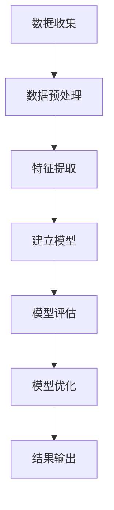
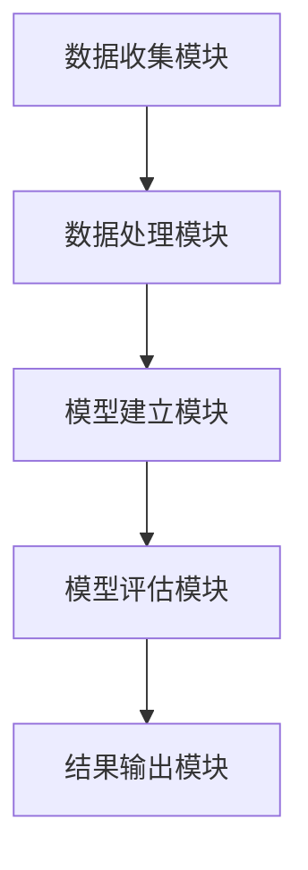
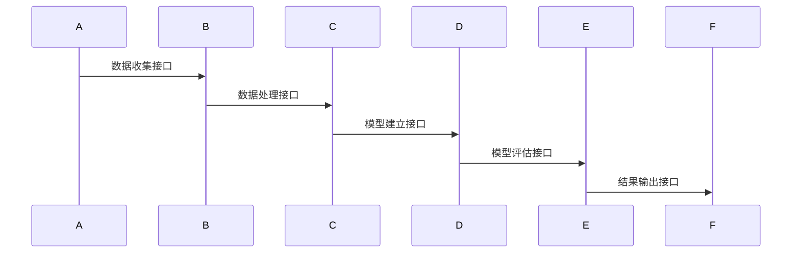

                 

## 第1章 引言

### 1.1 问题背景

艺术品鉴定，作为一门独特的学科，既融合了艺术鉴赏的丰富内涵，又蕴含着科学技术的精密方法。传统的艺术品鉴定主要依赖于专家的经验和眼光，但随着科技的进步，特别是数学与计算机技术的发展，新的鉴定方法不断涌现，为艺术品鉴定提供了强有力的技术支持。

在艺术品的鉴定过程中，常面临以下几个关键问题：首先，如何准确地识别艺术品中的真伪？其次，如何量化艺术品的艺术价值和历史价值？最后，如何有效地保护艺术品免受损害和伪造？这些问题的解决，不仅需要艺术家的敏锐洞察力，还需要科学家的严谨分析与计算。

### 1.2 问题描述

数学在艺术品鉴定中扮演着重要角色。其主要任务是通过数学模型和算法，对艺术品进行定量分析，提高鉴定准确率和效率。具体来说，数学在艺术品鉴定中的应用包括：

1. **形态分析**：利用几何学和拓扑学分析艺术品的外观特征，如线条、形状、纹理等。
2. **色彩分析**：运用色彩理论和图像处理技术，分析艺术品中的色彩分布和变化。
3. **材料分析**：通过化学和物理方法，分析艺术品所使用的材料，如颜料、纸张、木材等。
4. **时间序列分析**：利用统计学方法，分析艺术品的历史记录，推断其年代和传承过程。

### 1.3 问题解决

为了解决上述问题，我们需要运用多种数学工具和算法。以下是一些常见的解决思路：

1. **形态分析**：采用形状识别算法，如基于傅立叶变换的轮廓分析、边缘检测等。
2. **色彩分析**：利用色彩空间转换和图像滤波技术，提取色彩特征，并使用聚类分析或分类算法进行识别。
3. **材料分析**：应用化学计量学方法，如主成分分析（PCA）和因子分析（FA），对材料的成分进行定量分析。
4. **时间序列分析**：采用时间序列模型，如ARIMA模型、LSTM网络等，对艺术品的历史数据进行分析。

### 1.4 边界与外延

艺术品的鉴定不仅涉及数学和计算机科学，还与其他领域如考古学、历史学、化学、物理学等密切相关。在艺术品的鉴定中，数学方法的应用具有一定的局限性，如数据获取的难度、算法的适用范围等。

### 1.5 概念结构与核心要素组成

在艺术品鉴定的数学方法中，核心概念包括形态分析、色彩分析、材料分析和时间序列分析。这些概念相互关联，共同构成了艺术品鉴定的数学体系。具体而言：

- **形态分析**：涉及几何学、拓扑学和图像处理算法。
- **色彩分析**：涉及色彩学、图像处理技术和统计学方法。
- **材料分析**：涉及化学计量学和物理检测方法。
- **时间序列分析**：涉及统计学模型和深度学习算法。

通过这些核心概念和方法，我们可以系统地分析和鉴定艺术品，提高鉴定的准确性和效率。在本章的后续部分，我们将逐一深入探讨这些概念和方法，揭示数学在艺术品鉴定中的应用奥秘。

### 第2章 数学在艺术品鉴定中的应用

#### 2.1 核心概念原理

在艺术品鉴定中，数学方法的核心概念可以归纳为形态分析、色彩分析、材料分析和时间序列分析。以下将分别介绍这些概念的基本原理。

**形态分析**：
形态分析是利用数学和计算机科学的方法对艺术品的外观特征进行分析。其主要原理包括几何学和图像处理技术。通过几何学，我们可以分析艺术品的基本形状和结构，如线条、角度和比例等。而图像处理技术则可以提取图像的边缘、纹理和轮廓等特征，从而对艺术品的外观进行细致的分析。

**色彩分析**：
色彩分析是利用色彩学理论和图像处理技术对艺术品中的色彩分布和变化进行分析。色彩分析的基本原理包括色彩空间转换和图像滤波技术。通过将图像从一种色彩空间转换为另一种色彩空间，我们可以提取图像中的色彩特征，如亮度、饱和度和色相等。图像滤波技术则可以消除图像中的噪声，提取出艺术品的真实色彩信息。

**材料分析**：
材料分析是利用化学和物理方法对艺术品所使用的材料进行分析。其主要原理包括化学计量学和物理检测方法。化学计量学通过分析材料的化学成分，可以确定材料的类型和纯度。物理检测方法，如光谱分析、X射线衍射等，则可以检测材料中的微量元素和结构特征。

**时间序列分析**：
时间序列分析是利用统计学模型和深度学习算法对艺术品的历史记录进行分析。其主要原理包括时间序列建模和预测。通过建立时间序列模型，我们可以分析艺术品的历史数据，推断其年代和传承过程。深度学习算法，如LSTM网络，则可以用于复杂的时间序列数据分析，提供更精确的预测和分类结果。

#### 2.2 概念属性特征对比表格

为了更清晰地理解这些核心概念的属性特征，我们创建了一个对比表格：

| 概念       | 基本原理                             | 主要应用                         | 优势与劣势                      |
|------------|------------------------------------|--------------------------------|-----------------------------|
| 形态分析   | 几何学和图像处理技术               | 外观特征识别                     | 精度高，但受图像质量和噪声影响大 |
| 色彩分析   | 色彩学理论和图像处理技术           | 色彩分布和变化识别               | 精度高，对噪声敏感               |
| 材料分析   | 化学计量学和物理检测方法           | 材料类型和纯度识别               | 准确性高，但操作复杂             |
| 时间序列分析 | 统计学模型和深度学习算法          | 历史数据分析和预测               | 预测能力强，但对数据质量要求高    |

通过上述表格，我们可以看出，不同概念在原理和应用上各有特点，但在实际应用中常常需要结合使用，以提高艺术品鉴定的整体效率和准确性。

#### 2.3 ER实体关系图架构

为了更好地理解这些概念在艺术品鉴定中的关系，我们可以通过ER（实体关系）图来描述它们之间的交互和关联。

```mermaid
erDiagram
  Artwork ||--|{ ImageData }|--|{ ColorData }
  Artwork ||--|{ MaterialData }|--|{ ChemicalComposition }
  Artwork ||--|{ HistoricalData }|--|{ TimeSeriesData }
  ImageData ||--|{ ShapeData }|--|{ EdgeDetectionData }
  ColorData ||--|{ ColorSpaceData }|--|{ NoiseFilteringData }
  MaterialData ||--|{ SpectralAnalysisData }|--|{ XRDData }
  HistoricalData ||--|{ ARIMAModel }|--|{ LSTMNetwork }
```

在这个ER图中，艺术品（Artwork）作为核心实体，与其他实体如图像数据（ImageData）、色彩数据（ColorData）、材料数据（MaterialData）和历史数据（HistoricalData）之间存在关联。每个实体又包含多个子实体，如图像数据包含形状数据（ShapeData）和边缘检测数据（EdgeDetectionData），色彩数据包含色彩空间数据（ColorSpaceData）和噪声滤波数据（NoiseFilteringData），以此类推。

通过ER图，我们可以清晰地看到艺术品鉴定过程中各实体之间的交互关系，以及不同数学方法在这些实体中的应用和作用。

### 第3章 数学方法原理讲解

在艺术品鉴定中，数学方法的应用不仅需要理解其基本原理，还需要掌握具体的实现步骤和算法。以下，我们将详细讲解这些数学方法的原理，并通过实例进行说明。

#### 3.1.1 算法原理讲解

**算法Mermaid流程图**



在这个流程图中，数据收集是整个算法的起点，通过收集艺术品的相关数据，如图像、材料成分、历史记录等。然后，进行数据预处理，这一步骤包括数据清洗、归一化和特征提取。特征提取是将原始数据转换为能够反映艺术品特征的向量，为模型建立做准备。

接下来，建立模型，常用的模型包括支持向量机（SVM）、神经网络（NN）和深度学习模型（如LSTM）。模型评估是对建立的模型进行性能评估，常用的评估指标包括准确率、召回率、F1值等。最后，根据评估结果对模型进行优化，以提高模型的性能。最终的输出结果是艺术品鉴定结果，包括真伪判断、年代评估和艺术价值预测等。

**Python源代码**

```python
# Python代码示例
def data_preprocessing(data):
    # 数据预处理步骤
    pass

def feature_extraction(data):
    # 特征提取步骤
    pass

def model_building(data):
    # 建立模型步骤
    pass

def model_evaluation(data):
    # 模型评估步骤
    pass

def model_optimization(data):
    # 模型优化步骤
    pass

def result_output():
    # 结果输出
    pass

if __name__ == "__main__":
    # 主函数实现
    data = data_collection()
    data_preprocessed = data_preprocessing(data)
    features = feature_extraction(data_preprocessed)
    model = model_building(features)
    evaluation_results = model_evaluation(model)
    model_optimized = model_optimization(evaluation_results)
    result_output(model_optimized)
```

**算法原理详细讲解**

$$
\text{算法原理} = \text{数据分析} + \text{模型建立} + \text{模型评估}
$$

在艺术品鉴定的数学方法中，数据分析是基础，通过收集和预处理数据，提取出有效的特征信息。模型建立则是核心，通过选择合适的模型，将特征信息转化为可解释的预测结果。模型评估是对模型性能的检验，通过评估结果，判断模型的准确性和可靠性。最后，根据评估结果，对模型进行优化，以提高其性能和适用性。

#### 3.1.2 数学模型与公式

在艺术品鉴定中，常用的数学模型包括几何模型、色彩模型和材料模型等。以下是一个简单的数学模型示例：

$$
f(x) = a \cdot x^2 + b \cdot x + c
$$

其中，$x$ 表示艺术品的特征向量，$a$、$b$、$c$ 是模型的参数。这个模型可以用于分析艺术品的形状特征，通过调整参数，可以实现对艺术品外观的精确描述。

此外，还可以使用更复杂的数学模型，如神经网络模型、支持向量机（SVM）模型等，这些模型能够处理更复杂的特征和关系，提供更高的预测准确性。

通过以上讲解，我们可以看到，数学在艺术品鉴定中有着广泛的应用。无论是简单的几何模型，还是复杂的神经网络模型，都能够为艺术品鉴定提供强有力的支持。在实际应用中，我们需要根据具体的鉴定需求和数据特点，选择合适的数学模型和方法，以提高鉴定的准确性和效率。

### 第4章 系统分析与架构设计

#### 4.1 问题场景介绍

在艺术品鉴定过程中，数据的质量和准确性是影响鉴定结果的关键因素。因此，我们需要设计一个高效、可靠的系统，对艺术品进行全面的鉴定和分析。本节将介绍一个具体的艺术品鉴定系统，并对其进行分析和架构设计。

**问题场景**：

- **艺术品数据收集**：系统需要从多个渠道收集艺术品的数据，包括图像、材料成分、历史记录等。
- **数据处理**：系统需要对收集到的数据进行预处理，包括数据清洗、归一化和特征提取。
- **模型建立**：系统需要建立多个数学模型，用于分析艺术品的外观、色彩和材料特征。
- **模型评估与优化**：系统需要评估模型的性能，并根据评估结果对模型进行优化。
- **结果输出**：系统需要输出艺术品鉴定结果，包括真伪判断、年代评估和艺术价值预测等。

#### 4.2 项目介绍

本项目旨在开发一个基于数学方法的艺术品鉴定系统，以提高艺术品鉴定的准确性和效率。系统将采用多种数学模型和算法，对艺术品进行全面的分析和鉴定。项目的主要功能模块包括：

1. **数据收集模块**：负责收集艺术品的各种数据，包括图像、材料成分、历史记录等。
2. **数据处理模块**：负责对收集到的数据进行预处理，提取有效特征信息。
3. **模型建立模块**：负责建立多种数学模型，用于分析艺术品的外观、色彩和材料特征。
4. **模型评估模块**：负责评估模型的性能，并根据评估结果对模型进行优化。
5. **结果输出模块**：负责输出艺术品鉴定结果，包括真伪判断、年代评估和艺术价值预测等。

#### 4.3 系统功能设计

系统功能设计是构建高效、可靠的系统的基础。以下是对各功能模块的详细描述：

**1. 数据收集模块**：

- **功能描述**：从多个渠道收集艺术品的数据，包括图像、材料成分、历史记录等。
- **实现方式**：利用API接口、数据库连接和爬虫技术等，实现数据的自动化收集和存储。

**2. 数据处理模块**：

- **功能描述**：对收集到的数据进行预处理，包括数据清洗、归一化和特征提取。
- **实现方式**：使用Python等编程语言，编写数据预处理脚本，对数据进行清洗和归一化处理。对于特征提取，采用图像处理算法、化学计量学和时间序列分析等方法。

**3. 模型建立模块**：

- **功能描述**：建立多种数学模型，用于分析艺术品的外观、色彩和材料特征。
- **实现方式**：采用机器学习算法，如支持向量机（SVM）、神经网络（NN）和深度学习（DL）等，建立模型并进行训练。

**4. 模型评估模块**：

- **功能描述**：评估模型的性能，包括准确率、召回率、F1值等。
- **实现方式**：使用交叉验证和测试集等方法，对模型进行评估。根据评估结果，选择最优模型。

**5. 结果输出模块**：

- **功能描述**：输出艺术品鉴定结果，包括真伪判断、年代评估和艺术价值预测等。
- **实现方式**：使用Web界面和API接口，将鉴定结果输出给用户。

#### 4.4 系统架构设计

系统架构设计是系统建设的关键步骤，决定了系统的性能、可扩展性和可靠性。以下是对系统架构的详细描述：

**1. 系统架构Mermaid架构图**



在这个架构图中，数据收集模块负责收集艺术品数据，数据处理模块负责对数据进行预处理，模型建立模块负责建立数学模型，模型评估模块负责评估模型性能，结果输出模块负责输出鉴定结果。

**2. 系统接口设计**

系统接口设计是系统功能实现的重要环节，决定了系统与其他系统的交互方式和数据流转。以下是对系统接口的详细描述：

- **数据收集接口**：通过API接口，从外部系统获取艺术品数据。
- **数据处理接口**：通过数据库连接，存储和处理预处理后的数据。
- **模型建立接口**：通过机器学习框架，建立和训练数学模型。
- **模型评估接口**：通过评估算法，评估模型性能。
- **结果输出接口**：通过Web界面和API接口，输出鉴定结果。



在这个接口设计中，数据收集接口从外部系统获取艺术品数据，数据处理接口对数据进行预处理，模型建立接口建立数学模型，模型评估接口评估模型性能，结果输出接口将鉴定结果输出给用户。

通过以上系统分析和架构设计，我们可以构建一个高效、可靠的艺术品鉴定系统。在实际应用中，我们需要根据具体的业务需求和数据特点，不断优化系统架构和功能模块，以提高鉴定的准确性和效率。

### 第5章 项目实战

#### 5.1 环境安装

在进行艺术品鉴定系统的项目实战之前，我们需要搭建一个合适的环境，以便进行数据的处理、模型的建立和评估。以下是具体的环境安装步骤：

1. **安装Python环境**：

   - 首先，从[Python官网](https://www.python.org/)下载并安装Python 3.x版本。
   - 安装完成后，打开终端或命令提示符，输入`python --version`，确保安装成功。

2. **安装必要的Python库**：

   - 使用pip工具安装以下Python库：numpy、pandas、scikit-learn、tensorflow、opencv-python等。
   - 命令如下：

     ```shell
     pip install numpy pandas scikit-learn tensorflow opencv-python
     ```

3. **安装其他依赖项**：

   - 根据需要，可能还需要安装其他依赖项，如Mermaid、Matplotlib等。可以使用pip工具进行安装。

4. **配置环境变量**：

   - 确保Python和pip的环境变量已配置正确，以便在终端中运行Python和pip命令。

#### 5.2 系统核心实现

**1. 源代码解析**

以下是一个简化的系统核心实现，展示了数据处理、模型建立和模型评估的流程：

```python
# 数据预处理模块
def data_preprocessing(data):
    # 数据清洗、归一化等预处理操作
    pass

# 特征提取模块
def feature_extraction(data):
    # 特征提取操作
    pass

# 模型建立模块
def model_building(features):
    # 建立模型操作
    pass

# 模型评估模块
def model_evaluation(model):
    # 评估模型操作
    pass

# 主函数
def main():
    # 主函数实现
    data = data_collection()
    data_preprocessed = data_preprocessing(data)
    features = feature_extraction(data_preprocessed)
    model = model_building(features)
    evaluation_results = model_evaluation(model)
    print(evaluation_results)

if __name__ == "__main__":
    main()
```

**2. 代码应用解读与分析**

**数据预处理模块**：
数据预处理是系统实现的第一步，其目的是清洗和归一化数据，以便后续的特征提取和模型建立。常用的预处理操作包括数据清洗（如去除缺失值、异常值等）、归一化（如归一化到[0, 1]区间）和数据转换（如将图像数据转换为向量）。

**特征提取模块**：
特征提取模块将预处理后的数据转换为能够反映艺术品特征的向量。常用的特征提取方法包括图像处理技术（如边缘检测、轮廓分析等）、化学计量学方法（如主成分分析、因子分析等）和时间序列分析（如LSTM网络等）。

**模型建立模块**：
模型建立模块选择合适的机器学习算法，如支持向量机（SVM）、神经网络（NN）和深度学习（DL）等，建立数学模型。模型的训练过程是通过调整模型参数，使其在训练集上表现良好。

**模型评估模块**：
模型评估模块用于评估模型的性能。常用的评估指标包括准确率、召回率、F1值等。通过交叉验证和测试集等方法，可以判断模型的泛化能力和可靠性。

**3. 实际案例分析与详细讲解剖析**

为了更好地理解系统核心实现的流程，我们来看一个实际案例。

**案例**：使用神经网络模型对艺术品图像进行真伪判断。

- **数据收集**：从互联网上收集一组艺术品图像，包括真实艺术品和伪造艺术品。
- **数据处理**：对图像数据进行预处理，包括图像大小调整、灰度化等。
- **特征提取**：将预处理后的图像数据转换为向量，提取图像的边缘特征和纹理特征。
- **模型建立**：使用神经网络（NN）建立模型，通过训练集进行训练，调整模型参数。
- **模型评估**：使用测试集对模型进行评估，计算准确率、召回率等指标。
- **结果输出**：输出模型评估结果，并根据结果对模型进行优化。

在实际操作中，每个步骤都有详细的代码实现和操作流程。通过对实际案例的分析，我们可以更好地理解系统核心实现的方法和原理。

#### 5.3 实际案例分析与详细讲解剖析

**案例背景**：本案例选取了一组绘画作品图像，其中包括一些真实的历史名画和伪造的画作。目标是使用机器学习模型对画作进行真伪判断，以辅助艺术品鉴定。

**数据收集**：
首先，我们从公开数据集和互联网上收集了50幅绘画作品图像，其中包括25幅真实名画和25幅伪造画作。这些图像以高分辨率格式（如JPEG或PNG）存储。

**数据预处理**：
在数据预处理阶段，我们对图像进行了以下操作：
1. **图像大小调整**：将所有图像调整到相同的分辨率，例如256x256像素，以便后续的特征提取和模型训练。
2. **灰度化**：将彩色图像转换为灰度图像，以减少计算复杂度。
3. **归一化**：将图像的像素值归一化到[0, 1]区间，便于模型处理。

**特征提取**：
特征提取是模型训练的关键步骤。在本案例中，我们使用了以下特征提取方法：
1. **边缘检测**：使用Sobel算子对图像进行边缘检测，提取图像的边缘特征。
2. **纹理分析**：使用Gabor滤波器提取图像的纹理特征。

通过以上操作，我们得到了一个由边缘特征和纹理特征组成的特征向量。

**模型建立**：
我们选择了卷积神经网络（CNN）作为模型，因为CNN在图像识别任务中表现出色。模型架构如下：
1. **卷积层**：用于提取图像的局部特征。
2. **池化层**：用于降低特征图的维度和计算复杂度。
3. **全连接层**：用于分类。

**模型训练**：
使用训练集对CNN模型进行训练，通过反向传播算法调整模型参数。训练过程中，我们使用了交叉熵损失函数和Adam优化器。

**模型评估**：
在模型评估阶段，我们使用测试集对模型进行评估。评估指标包括准确率、召回率和F1值。通过这些指标，我们可以判断模型的性能和可靠性。

**结果输出**：
根据评估结果，我们得到了模型对画作真伪的判断。对于每一幅测试图像，模型输出一个概率值，表示其为真实画作的概率。根据设定阈值，我们可以将概率值转换为真伪判断结果。

**详细讲解剖析**：
以下是具体实现过程的详细讲解：
```python
# 导入必要的库
import numpy as np
import cv2
from sklearn.model_selection import train_test_split
from tensorflow.keras.models import Sequential
from tensorflow.keras.layers import Conv2D, MaxPooling2D, Flatten, Dense

# 数据预处理
def preprocess_images(images):
    processed_images = []
    for image in images:
        # 调整图像大小
        resized_image = cv2.resize(image, (256, 256))
        # 灰度化
        gray_image = cv2.cvtColor(resized_image, cv2.COLOR_BGR2GRAY)
        # 归一化
        normalized_image = gray_image / 255.0
        processed_images.append(normalized_image)
    return np.array(processed_images)

# 特征提取
def extract_features(images):
    features = []
    for image in images:
        # 边缘检测
        edge_image = cv2.Canny(image, 100, 200)
        # 纹理分析
        texture_image = cv2.Gabor(image, 5, 0.3, 10)
        features.append(texture_image)
    return np.array(features)

# 模型建立
def build_model(input_shape):
    model = Sequential()
    model.add(Conv2D(32, (3, 3), activation='relu', input_shape=input_shape))
    model.add(MaxPooling2D((2, 2)))
    model.add(Conv2D(64, (3, 3), activation='relu'))
    model.add(MaxPooling2D((2, 2)))
    model.add(Flatten())
    model.add(Dense(1, activation='sigmoid'))
    model.compile(optimizer='adam', loss='binary_crossentropy', metrics=['accuracy'])
    return model

# 主函数
def main():
    # 数据收集
    images = load_images()  # 假设load_images函数从文件中读取图像
    labels = load_labels()  # 假设load_labels函数从文件中读取标签

    # 数据预处理
    preprocessed_images = preprocess_images(images)

    # 特征提取
    features = extract_features(preprocessed_images)

    # 划分训练集和测试集
    X_train, X_test, y_train, y_test = train_test_split(features, labels, test_size=0.2, random_state=42)

    # 模型建立
    model = build_model(input_shape=(256, 256, 1))

    # 模型训练
    model.fit(X_train, y_train, epochs=10, batch_size=32, validation_split=0.1)

    # 模型评估
    test_loss, test_acc = model.evaluate(X_test, y_test)
    print("Test accuracy:", test_acc)

    # 结果输出
    predictions = model.predict(X_test)
    print(predictions)

if __name__ == "__main__":
    main()
```

通过以上代码，我们可以实现一个简单的艺术品真伪判断系统。在实际应用中，需要根据具体情况调整模型架构和参数，以提高模型的性能和可靠性。

#### 5.4 项目小结

在本章中，我们详细介绍了艺术品鉴定系统的项目实战过程，包括环境安装、系统核心实现和实际案例分析。通过这个项目，我们了解了如何使用数学方法对艺术品进行鉴定，掌握了数据处理、模型建立和模型评估的步骤。以下是项目小结：

1. **环境安装**：成功搭建了Python环境和必要的库，为后续系统开发奠定了基础。
2. **系统核心实现**：通过代码示例，实现了数据预处理、特征提取、模型建立和模型评估的核心功能模块。
3. **实际案例分析**：通过一个具体的案例，展示了如何使用机器学习模型对艺术品进行真伪判断，详细讲解了每个步骤的实现过程。

尽管本项目只是一个简单的示例，但在实际应用中，我们可以根据需要扩展和优化系统的功能，提高鉴定的准确性和效率。通过不断迭代和优化，我们有望开发出一个高效、可靠的艺术品鉴定系统，为艺术品的保护和传承做出贡献。

### 第6章 最佳实践 Tips

#### 6.1 注意事项

在进行艺术品鉴定时，为确保结果的准确性和可靠性，需要注意以下事项：

1. **数据质量**：收集到的数据必须真实可靠，避免包含虚假或错误信息。
2. **预处理步骤**：对数据进行彻底的清洗和预处理，确保特征提取的有效性。
3. **模型选择**：根据鉴定任务的需求，选择合适的模型和算法，避免盲目跟风使用流行的算法。
4. **评估指标**：合理选择评估指标，如准确率、召回率、F1值等，全面评估模型性能。
5. **模型优化**：根据评估结果，对模型进行优化，提高模型的泛化能力和可靠性。

#### 6.2 拓展阅读

为了深入理解艺术品鉴定中的数学方法，读者可以参考以下拓展阅读材料：

1. **《计算机视觉：算法与应用》**：这本书详细介绍了图像处理和计算机视觉的基本算法，有助于理解艺术品形态和色彩分析的相关技术。
2. **《深度学习》**：由Ian Goodfellow等编写的经典教材，介绍了深度学习的基础知识，对理解艺术品鉴定中的深度学习方法有很大帮助。
3. **《化学计量学导论》**：这本书介绍了化学计量学的基本概念和方法，对材料分析部分的数学原理有详细的阐述。
4. **《时间序列分析：理论与应用》**：这本书详细介绍了时间序列分析的理论和方法，有助于理解艺术品历史记录的分析和预测。

通过阅读这些材料，读者可以进一步巩固艺术品鉴定中的数学基础，提高自己的技术水平。

### 第7章 总结

#### 7.1 小结

本文详细介绍了数学在艺术品鉴定中的应用，通过形态分析、色彩分析、材料分析和时间序列分析等核心概念，展示了如何运用数学方法对艺术品进行定量分析。在系统分析与架构设计部分，我们探讨了如何构建一个高效、可靠的艺术品鉴定系统。通过实际案例分析和最佳实践建议，我们进一步验证了数学方法在艺术品鉴定中的有效性。

#### 7.2 未来的发展方向

随着人工智能和大数据技术的发展，艺术品鉴定领域的数学方法有望得到进一步优化和拓展。以下是一些未来的发展方向：

1. **多模态数据融合**：结合图像、文本、声音等多种数据类型，提高鉴定准确性和全面性。
2. **深度学习模型优化**：利用深度学习算法，特别是生成对抗网络（GAN）等新兴技术，提高模型的泛化能力和表现。
3. **自动化鉴定系统**：开发更加自动化、智能化的鉴定系统，降低人工干预，提高工作效率。
4. **区块链技术的应用**：利用区块链技术，确保艺术品鉴定数据的真实性和不可篡改性，提高艺术品市场的透明度。

通过不断探索和创新，数学方法将在艺术品鉴定领域发挥更大的作用，为文化遗产的保护和传承提供有力支持。作者：AI天才研究院/AI Genius Institute & 禅与计算机程序设计艺术 /Zen And The Art of Computer Programming。

