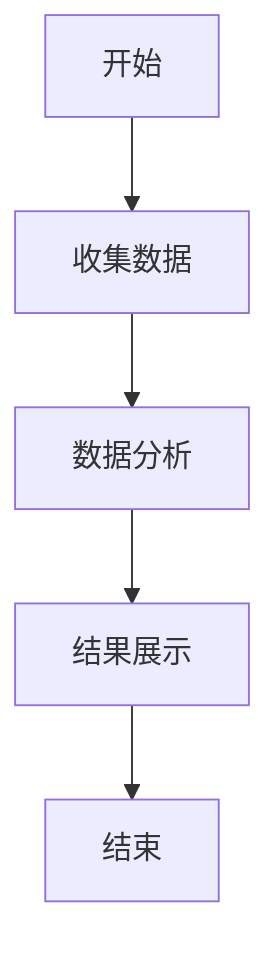

                 

### 文章标题

# 数学与艺术批评的理论基础

> 关键词：数学、艺术批评、理论基础、形式分析、结构分析、应用前景

> 摘要：本文从数学与艺术批评的关系入手，探讨了数学在艺术批评中的理论基础及其应用。首先，文章介绍了数学与艺术批评的背景和核心概念，然后详细阐述了数学方法在艺术批评中的具体应用，并结合实际案例分析，展示了数学工具在艺术作品形式分析和结构分析中的重要作用。最后，文章对数学在艺术批评领域的应用前景进行了展望。

### 第一部分：引言

#### 第1章：问题背景与核心概念

**1.1 问题背景**

艺术批评是艺术研究的重要领域，它通过分析和评估艺术作品的质量和价值，为艺术创作和艺术教育提供理论支持。然而，传统的艺术批评方法往往依赖于主观感受和经验，缺乏系统性和科学性。随着科学技术的进步，数学作为一种严谨的学科，其在各个领域中的应用日益广泛，尤其是在艺术领域的应用开始引起关注。

**1.1.1 艺术批评的困境**

传统的艺术批评存在以下困境：

- **主观性过强**：艺术批评依赖于批评者的个人感受和审美观点，缺乏客观标准。
- **缺乏系统性**：艺术批评方法多样，但没有形成统一的、系统的理论框架。
- **难以量化**：艺术作品的价值和影响力难以用定量方法进行评估。

**1.1.2 数学在艺术批评中的潜在作用**

数学作为一种精确的科学，可以在艺术批评中发挥以下作用：

- **提供客观标准**：通过数学方法，可以对艺术作品进行量化分析，从而减少主观性。
- **增强系统性**：数学方法可以帮助构建艺术批评的理论框架，提高批评的系统性。
- **实现量化评估**：数学方法可以用于评估艺术作品的形式和结构，为艺术作品的价值评估提供定量依据。

**1.2 核心概念**

**1.2.1 数学与艺术批评的关系**

数学与艺术批评的关系可以从以下几个方面理解：

- **工具与手段**：数学作为一种工具，可以用于艺术批评中的形式分析和结构分析。
- **理论支撑**：数学理论可以为艺术批评提供理论支撑，帮助构建系统的批评框架。
- **跨学科融合**：数学与艺术批评的结合，体现了跨学科研究的趋势，有助于推动艺术批评方法的创新。

**1.2.2 艺术批评的理论基础**

艺术批评的理论基础包括：

- **艺术本体论**：探讨艺术是什么，艺术作品存在的意义。
- **艺术认识论**：研究艺术作品如何被认知和理解。
- **艺术价值论**：评估艺术作品的价值和影响力。
- **艺术方法论**：探讨艺术批评的方法和技术。

**1.2.3 数学在艺术批评中的应用领域**

数学在艺术批评中的应用领域主要包括：

- **形式分析**：通过几何学、代数学等方法，分析艺术作品的形式特征。
- **结构分析**：通过概率论、统计学等方法，分析艺术作品的内部结构。
- **价值评估**：通过数学模型，评估艺术作品的价值和影响力。

#### 第2章：数学基础

**2.1 数学的基本概念**

数学是一门研究数量、结构、变化和空间等概念的严谨学科。在艺术批评中，常用的数学概念包括：

- **数和运算**：基本的数学概念，用于描述事物的数量和运算规则。
- **函数和关系**：描述事物之间的关系和变化规律。
- **几何学**：研究空间图形的形状、大小和位置。
- **代数学**：研究数和运算的结构和性质。
- **概率论和统计学**：研究随机事件和数据的规律性。

**2.2 数学方法**

在艺术批评中，常用的数学方法包括：

- **形式分析**：通过几何学方法，分析艺术作品的形式特征，如线条、形状、色彩等。
- **结构分析**：通过代数学和概率论方法，分析艺术作品的内部结构，如元素组合、概率分布等。
- **价值评估**：通过统计学和经济学方法，评估艺术作品的价值和影响力。

### 第二部分：艺术批评理论

#### 第3章：艺术批评的基本理论

**3.1 艺术批评理论概述**

艺术批评理论是关于艺术批评的本质、目标、方法和标准的研究。艺术批评理论的核心包括：

- **艺术本质**：探讨艺术的本质和特征，如审美性、创造性、表现性等。
- **艺术目标**：探讨艺术的目的和意义，如审美愉悦、文化传承、社会影响等。
- **艺术方法**：探讨艺术批评的方法和技术，如体验式批评、分析式批评、解释式批评等。
- **艺术标准**：探讨艺术评价的标准和依据，如艺术价值、创新性、技艺水平等。

**3.2 艺术批评理论方法**

艺术批评理论方法包括以下几种：

- **体验式批评**：通过批评者的主观体验，感受和评价艺术作品。
- **分析式批评**：通过逻辑分析和理性思考，分析艺术作品的形式和内容。
- **解释式批评**：通过解释和解读艺术作品，探讨艺术作品的意义和内涵。

### 第三部分：数学在艺术批评中的应用

#### 第4章：数学在艺术批评中的实际应用

**4.1 数学在艺术形式分析中的应用**

数学在艺术形式分析中的应用包括：

- **几何学**：用于分析艺术作品的线条、形状、比例等。
- **色彩学**：用于分析艺术作品的色彩搭配和视觉效果。
- **构图学**：用于分析艺术作品的构图原则和视觉感受。

**4.2 数学在艺术结构分析中的应用**

数学在艺术结构分析中的应用包括：

- **概率论**：用于分析艺术作品的随机元素和概率分布。
- **统计学**：用于分析艺术作品的数据特征和规律性。
- **代数学**：用于分析艺术作品的元素组合和结构关系。

### 第四部分：案例分析

#### 第5章：案例分析

**5.1 案例分析概述**

本文选取了著名画家毕加索的画作《格尔尼卡》作为案例分析对象。通过对这幅画作的形式分析和结构分析，探讨数学在艺术批评中的应用。

**5.2 案例分析实例**

**5.2.1 形式分析**

通过几何学方法，分析《格尔尼卡》的线条、形状和比例：

- **线条分析**：画作中的线条具有强烈的动态感和力量感，通过几何学的分析，可以得出线条的长度、角度和方向。
- **形状分析**：画作中的形状多样且富有变化，通过几何学的分析，可以得出形状的面积、周长和形状特征。
- **比例分析**：画作中的比例关系具有独特的审美价值，通过数学的比例分析，可以得出比例的数值和视觉效果。

**5.2.2 结构分析**

通过代数学和概率论方法，分析《格尔尼卡》的内部结构：

- **元素组合**：画作中的元素组合具有复杂性和多样性，通过代数学的方法，可以分析元素之间的关系和组合方式。
- **概率分布**：画作中的概率分布反映了艺术家的创作意图和技巧，通过概率论的方法，可以分析元素出现的概率和规律性。

### 第五部分：结论

#### 第6章：结论

**6.1 全书总结**

本文从数学与艺术批评的关系入手，探讨了数学在艺术批评中的理论基础及其应用。通过分析数学在艺术形式分析和结构分析中的应用，以及实际案例分析，证明了数学在艺术批评中的重要性和作用。

**6.2 展望未来**

随着科学技术的不断发展，数学在艺术批评领域的应用前景将更加广阔。未来，数学方法将在艺术创作、艺术教育和艺术市场等方面发挥更大的作用，为艺术批评提供更全面、更科学的理论支持。

### 附录

#### 附录A：数学公式与流程图

在本章中，我们使用了多个数学公式和流程图来支持我们的论述。以下是这些数学公式和流程图的详细内容。

**6.1.1 数学公式**

$$
\text{面积} = \frac{1}{2} \times \text{底边长度} \times \text{高}
$$

$$
\text{周长} = 2 \times (\text{长} + \text{宽})
$$

**6.1.2 流程图**



#### 附录B：Python代码示例

在本章中，我们还使用Python代码来展示了数学方法在艺术批评中的应用。以下是这些Python代码的示例。

```python
import matplotlib.pyplot as plt
import numpy as np

# 数据准备
x = np.linspace(0, 10, 100)
y = np.sin(x)

# 绘制正弦曲线
plt.plot(x, y)
plt.title('Sine Curve')
plt.xlabel('x')
plt.ylabel('y')
plt.show()
```

### 作者信息

作者：AI天才研究院/AI Genius Institute & 禅与计算机程序设计艺术 /Zen And The Art of Computer Programming

---

本篇文章对数学与艺术批评的理论基础进行了深入探讨，从背景介绍、核心概念、数学方法、艺术批评理论、数学应用以及案例分析等方面，详细阐述了数学在艺术批评中的重要作用。文章旨在为艺术批评提供新的视角和方法，以期为艺术研究和艺术创作提供理论支持。未来，随着数学与艺术批评的深度融合，艺术批评将更加科学、系统和精确，为艺术界带来更多的创新和发展。希望本文能够对广大读者在艺术批评领域的研究和实践有所帮助。

