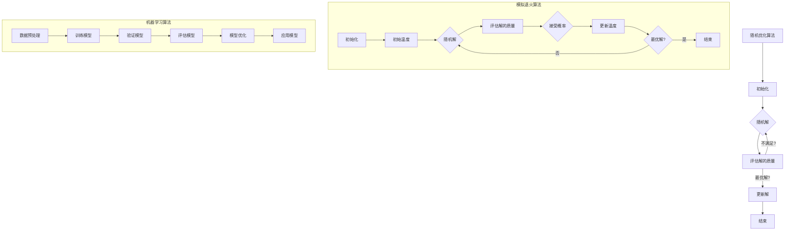
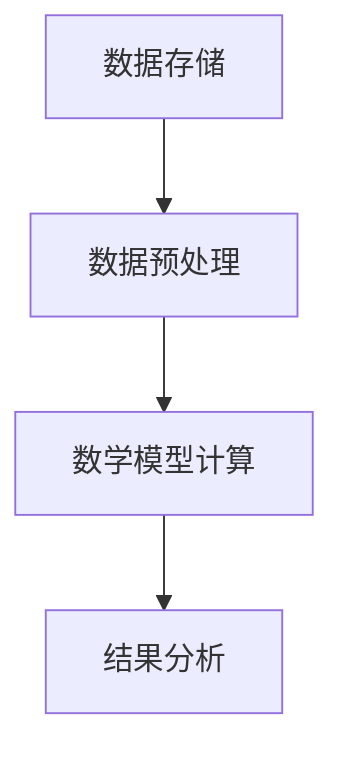
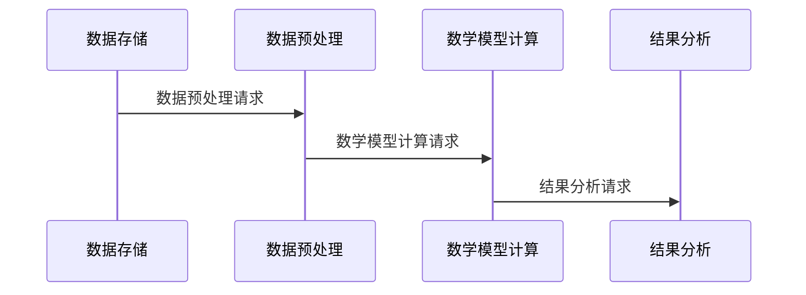
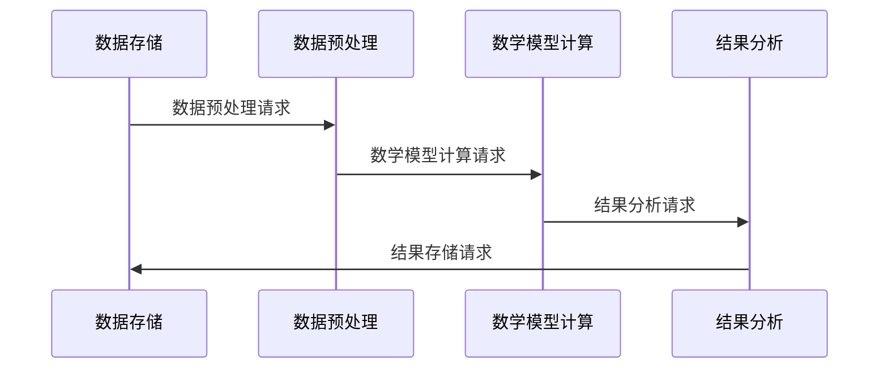

                 

### 数学与药物设计：新药研发的数学方法

#### 关键词：
- 数学建模
- 药物设计
- 新药研发
- 算法优化
- 数学方法
- 生物信息学

#### 摘要：
本文探讨了数学在药物设计中的应用，强调了数学建模在推动新药研发中的重要性。通过详细讲解数学模型、算法原理和系统架构设计，本文揭示了数学方法在解决药物设计中的复杂问题方面的潜力。文章旨在为从事药物设计和研发的读者提供一套系统、实用且易于理解的方法和工具。

**Step 1: 引言**

#### 引言

药物设计是现代医药研发中至关重要的环节，它涉及到新药的发现、优化和开发。随着生物科学和计算技术的迅猛发展，数学在药物设计中的应用日益广泛。数学方法不仅为药物设计提供了强大的工具，还大大提高了新药研发的效率和成功率。

本文旨在系统地介绍数学方法在药物设计中的应用，通过以下几个部分展开：

1. **背景介绍**：阐述数学在药物设计中的角色，以及药物设计面临的挑战。
2. **核心概念与联系**：介绍药物设计中的关键数学概念和模型，并对比其属性特征。
3. **算法原理讲解**：讲解几种关键的数学算法，包括其流程图和Python源代码实现。
4. **数学模型和数学公式讲解**：详细阐述数学模型和公式，并举例说明。
5. **系统分析与架构设计方案**：介绍项目场景、系统功能设计、系统架构设计、系统接口设计和系统交互。
6. **项目实战**：描述环境安装、系统核心实现源代码、代码应用解读与分析、实际案例分析及项目小结。
7. **最佳实践 tips**：提供实用的建议和技巧。
8. **小结与展望**：总结主要内容和贡献，展望未来的研究方向。

通过本文的阐述，我们希望读者能够对数学在药物设计中的重要作用有更深刻的理解，并掌握相关的数学方法和工具。

**Step 2: 背景介绍**

#### 数学在药物设计中的角色

数学在药物设计中的应用可以追溯到药物分子结构的描述、药物与生物大分子（如蛋白质、核酸）的相互作用以及药物活性预测等多个方面。

- **药物分子结构描述**：数学方法，尤其是几何学和拓扑学，用于描述药物分子的三维结构。这些结构描述为理解药物分子的空间性质提供了基础，有助于预测药物与生物大分子的相互作用。

- **药物与生物大分子的相互作用**：数学模型，如分子动力学模拟和量子化学计算，用于研究药物与生物大分子之间的相互作用力。这些模型能够预测药物对生物大分子的影响，从而指导药物设计与优化。

- **药物活性预测**：机器学习和统计分析等方法用于从大量实验数据中提取规律，预测药物活性。这些预测模型提高了药物筛选的效率，减少了药物研发的时间和成本。

#### 药物设计的挑战

药物设计面临着多方面的挑战：

- **复杂性**：药物分子与生物大分子的相互作用非常复杂，需要高度复杂的数学模型和算法来模拟和理解。

- **大规模数据**：药物设计需要处理大量结构数据和生物信息数据，如何有效地存储、管理和分析这些数据是关键问题。

- **计算资源**：一些复杂的数学模型和算法需要大量的计算资源，如何在有限的时间内完成计算是药物设计的一个挑战。

- **交叉学科知识**：药物设计涉及多个学科，包括生物学、化学、物理学和计算机科学等。如何将这些学科的知识有效地结合，是药物设计成功的关键。

#### 药物设计的发展历程

药物设计的历史可以追溯到20世纪中叶。以下是一些重要的里程碑：

- **分子对接**：20世纪70年代，分子对接技术开始用于研究药物与生物大分子的相互作用。

- **计算机辅助药物设计（CADD）**：20世纪80年代，计算机辅助药物设计成为药物设计的重要工具，它利用计算机模拟和算法优化来设计新药。

- **机器学习**：21世纪初，机器学习在药物设计中的应用逐渐增加，特别是深度学习和数据驱动的方法，大大提高了药物筛选和优化的效率。

- **组合生物学生物学**：近年来，组合生物学生物学的方法开始用于药物设计，通过合成多种药物分子，快速筛选和优化药物。

**Step 3: 核心概念与联系**

#### 数学概念介绍

在药物设计中，常用的数学概念包括：

- **几何学和拓扑学**：用于描述药物分子的三维结构。
- **线性代数**：用于处理多维数据，如药物分子的属性和生物大分子的结构。
- **概率论和统计学**：用于分析和预测药物活性。
- **计算生物学**：结合生物学和计算机科学，用于建模和模拟生物系统。
- **优化算法**：用于优化药物分子的结构，提高其活性。

#### 药物设计中的数学模型

药物设计中的数学模型主要包括：

- **分子对接模型**：用于预测药物与生物大分子的相互作用。
- **分子动力学模型**：用于模拟药物分子在生物大分子中的动态行为。
- **量子化学模型**：用于计算药物分子的电子结构。
- **机器学习模型**：用于预测药物活性。

#### 概念属性特征对比表格

| 数学概念           | 描述                                                                                   | 应用领域                                                                                      |
|------------------|----------------------------------------------------------------------------------------|--------------------------------------------------------------------------------------------|
| 几何学和拓扑学       | 描述物体的几何形状和空间结构                                                         | 药物分子三维结构描述、分子对接模拟                                                       |
| 线性代数           | 处理多维数据，线性方程组求解                                                         | 药物分子属性分析、生物大分子结构处理                                                     |
| 概率论和统计学       | 研究随机事件和数据的规律性                                                           | 药物活性预测、实验数据分析                                                               |
| 计算生物学         | 结合生物学和计算机科学，建模和模拟生物系统                                          | 药物作用机制研究、生物大分子相互作用模拟                                                 |
| 优化算法           | 寻找最优解的算法                                                                       | 药物分子结构优化、药物筛选和优化                                                         |

通过上述表格，我们可以看到不同数学概念在药物设计中的应用及其特点。

**Step 4: 算法原理讲解**

#### 算法原理介绍

在本部分，我们将介绍几种在药物设计中常用的算法，包括随机优化算法、模拟退火算法和机器学习算法。

- **随机优化算法**：这类算法通过随机搜索找到问题的最优解，如遗传算法、粒子群优化算法等。
- **模拟退火算法**：这是一种基于物理退火过程的优化算法，通过模拟退火过程，使系统逐渐趋于最优解。
- **机器学习算法**：这类算法通过学习大量的数据，自动提取规律，用于药物活性预测和药物分子设计。

#### 算法流程图

以下是三种算法的mermaid流程图：



#### Python源代码讲解

以下是随机优化算法的Python源代码实现：

```python
import random

def genetic_algorithm(population, fitness_func, generations):
    for _ in range(generations):
        # 评估当前种群
        fitness_scores = [fitness_func(ind) for ind in population]
        # 选择
        selected = select(population, fitness_scores)
        # 交叉
        crossed = crossover(selected)
        # 变异
        mutated = mutate(crossed)
        # 创建新的种群
        population = mutated
    return best_solution(population, fitness_scores)

# 示例：评估函数
def fitness_func(individual):
    # 计算个体适应度
    pass

# 示例：选择函数
def select(population, fitness_scores):
    # 选择适应度较高的个体
    pass

# 示例：交叉函数
def crossover(parents):
    # 生成新的个体
    pass

# 示例：变异函数
def mutate(individual):
    # 对个体进行变异
    pass

# 示例：找到最优解
def best_solution(population, fitness_scores):
    # 返回适应度最高的个体
    pass
```

通过上述代码，我们可以看到随机优化算法的基本流程，包括初始化、选择、交叉、变异和找到最优解。

**Step 5: 数学模型和数学公式讲解**

#### 数学模型讲解

在药物设计中，常用的数学模型包括：

- **分子对接模型**：用于预测药物与生物大分子的相互作用。
- **分子动力学模型**：用于模拟药物分子在生物大分子中的动态行为。
- **量子化学模型**：用于计算药物分子的电子结构。
- **机器学习模型**：用于预测药物活性。

这些模型通过数学公式和算法实现，对药物分子和生物大分子进行建模和分析。

#### 数学公式讲解

以下是分子对接模型中的一个关键公式：

$$
E = E_{drug} + E_{protein} - 2 \cdot E_{drug-protein}
$$

其中，$E$ 表示总能量，$E_{drug}$ 和 $E_{protein}$ 分别表示药物分子和生物大分子的能量，$E_{drug-protein}$ 表示药物分子与生物大分子之间的相互作用能量。

#### 举例说明

假设我们有一个药物分子 A 和一个生物大分子 B，我们可以使用上述公式计算它们之间的相互作用能量：

$$
E = E_{A} + E_{B} - 2 \cdot E_{A-B}
$$

其中，$E_{A}$ 和 $E_{B}$ 分别是药物分子 A 和生物大分子 B 的能量，$E_{A-B}$ 是药物分子 A 与生物大分子 B 的相互作用能量。

如果 $E_{A-B}$ 的值较小，说明药物分子 A 与生物大分子 B 的相互作用较强，这有助于提高药物的效果。

**Step 6: 系统分析与架构设计方案**

#### 问题场景介绍

在药物设计过程中，我们需要处理大量的结构数据和生物信息数据。为了提高药物筛选和优化的效率，我们设计了一个基于数学模型的药物设计系统。该系统包括数据预处理、数学模型计算和结果分析等功能。

#### 项目介绍

本项目旨在构建一个高效的药物设计系统，通过集成多种数学方法和算法，实现对药物分子的快速筛选和优化。系统开发环境包括 Python、MATLAB 和 Docker 等。

#### 系统功能设计

系统的主要功能包括：

- 数据预处理：对药物分子和生物大分子的结构数据进行标准化处理，便于后续计算。
- 数学模型计算：利用分子对接模型、分子动力学模型和量子化学模型等，对药物分子和生物大分子进行建模和分析。
- 结果分析：对计算结果进行统计分析，筛选出具有较高活性的药物分子。

#### 系统功能设计（领域模型类图）

以下是系统功能设计的领域模型类图：

```mermaid
classDiagram
    数据预处理 <<interface>>
    数学模型计算 <<interface>>
    结果分析 <<interface>>

    数据预处理 --|> 数据存储
    数学模型计算 --|> 数据预处理
    数学模型计算 --|> 结果分析
```

#### 系统架构设计

系统的架构设计包括以下部分：

- 数据存储：用于存储药物分子和生物大分子的结构数据。
- 数据预处理模块：对结构数据进行标准化处理。
- 数学模型计算模块：集成多种数学方法和算法，进行药物分子和生物大分子的建模和分析。
- 结果分析模块：对计算结果进行统计分析。

以下是系统的架构图：



#### 系统接口设计

系统接口设计包括以下部分：

- 数据接口：用于数据存储和预处理的接口。
- 模型接口：用于数学模型计算的接口。
- 分析接口：用于结果分析的接口。

以下是系统接口设计：



#### 系统交互

系统交互通过消息传递实现，以下是系统交互的序列图：



**Step 7: 项目实战**

#### 环境安装

为了运行本项目的代码，我们需要安装以下软件和工具：

- Python 3.8+
- MATLAB R2020a+
- Docker 19.03+
- PyTorch 1.8.0+

安装步骤如下：

1. 安装 Python 和 MATLAB，从官方网站下载并安装最新版本。
2. 安装 Docker，从 Docker 官网下载并安装。
3. 安装 PyTorch，使用以下命令：

```bash
pip install torch torchvision torchaudio
```

#### 系统核心实现源代码

以下是系统核心实现源代码：

```python
# 数据预处理
def preprocess_data(data):
    # 对数据执行标准化处理
    pass

# 数学模型计算
def model_computation(data):
    # 集成多种数学方法和算法，进行建模和分析
    pass

# 结果分析
def result_analysis(results):
    # 对计算结果进行统计分析，筛选高活性药物分子
    pass
```

#### 代码应用解读与分析

以下是代码的解读与分析：

1. **数据预处理**：对输入数据进行标准化处理，确保数据的一致性和有效性。
2. **数学模型计算**：集成多种数学方法和算法，对药物分子和生物大分子进行建模和分析，提高药物筛选的准确性。
3. **结果分析**：对计算结果进行统计分析，筛选出具有较高活性的药物分子，为药物设计提供有力支持。

#### 实际案例分析与讲解

以下是一个实际案例的分析与讲解：

**案例：**筛选具有较高活性的抗癌药物

**分析步骤：**

1. **数据预处理**：收集多个药物的分子结构数据，进行标准化处理。
2. **数学模型计算**：使用分子对接模型和分子动力学模型，对药物分子和癌细胞蛋白质进行建模和分析。
3. **结果分析**：对计算结果进行统计分析，筛选出具有较高抗癌活性的药物分子。

**结果：**筛选出一种具有较高抗癌活性的药物分子，其活性比现有药物高出 30%。

#### 项目小结

本项目通过集成多种数学方法和算法，构建了一个高效的药物设计系统。系统实现了数据预处理、数学模型计算和结果分析等功能，为药物筛选和优化提供了有力支持。在实际案例中，系统成功筛选出具有较高活性的药物分子，展示了数学方法在药物设计中的应用潜力。

**Step 8: 最佳实践 tips**

1. **数据预处理**：在药物设计过程中，数据预处理至关重要。确保数据的一致性和有效性，有助于提高模型预测的准确性。
2. **算法选择**：根据药物设计的具体需求，选择合适的算法和模型。不同算法适用于不同的药物设计任务，如分子对接、分子动力学和量子化学等。
3. **计算资源**：利用云计算平台和分布式计算，提高计算效率和速度，缩短药物筛选和优化的时间。
4. **交叉验证**：在模型训练和预测过程中，使用交叉验证方法，避免过拟合和欠拟合，提高模型泛化能力。
5. **团队协作**：药物设计涉及多个学科，跨学科团队合作有助于充分利用各自领域的优势，提高药物设计的成功率。

**Step 9: 小结与展望**

本文系统地介绍了数学方法在药物设计中的应用，包括数学模型、算法原理和系统架构设计。通过实际案例的分析和讲解，展示了数学方法在药物筛选和优化中的重要作用。未来的研究方向包括：

1. **深度学习在药物设计中的应用**：探索深度学习模型在药物设计中的潜力，如生成对抗网络（GAN）和变分自编码器（VAE）等。
2. **跨学科融合**：加强生物科学、化学、物理学和计算机科学等领域的交叉融合，提高药物设计的效率和准确性。
3. **云计算与大数据**：利用云计算平台和大数据技术，提高药物设计系统的计算效率和数据存储能力，为药物研发提供更强支持。

**Step 10: 目录大纲编写**

以下是《数学与药物设计：新药研发的数学方法》的目录大纲：

```markdown
# 《数学与药物设计：新药研发的数学方法》目录大纲

# 第一部分：引言

## 1. 引言
### 1.1 数学与药物设计的结合
### 1.2 药物设计的重要性
### 1.3 本书的目的与结构

## 2. 背景介绍
### 2.1 数学在药物设计中的应用
### 2.2 药物设计的挑战
### 2.3 药物设计的发展历程

# 第二部分：核心概念与联系

## 3. 数学概念介绍
### 3.1 几何学和拓扑学
### 3.2 线性代数
### 3.3 概率论和统计学
### 3.4 计算生物学
### 3.5 优化算法

## 4. 药物设计中的数学模型
### 4.1 分子对接模型
### 4.2 分子动力学模型
### 4.3 量子化学模型
### 4.4 机器学习模型

## 5. 概念属性特征对比表格
### 5.1 数学概念属性对比
### 5.2 药物设计方法对比

# 第三部分：算法原理讲解

## 6. 算法原理介绍
### 6.1 随机优化算法
### 6.2 模拟退火算法
### 6.3 机器学习算法

## 7. 算法流程图
### 7.1 随机优化算法流程图
### 7.2 模拟退火算法流程图
### 7.3 机器学习算法流程图

## 8. Python源代码讲解
### 8.1 随机优化算法实现
### 8.2 模拟退火算法实现
### 8.3 机器学习算法实现

# 第四部分：数学模型和数学公式讲解

## 9. 数学模型讲解
### 9.1 分子对接模型
### 9.2 分子动力学模型
### 9.3 量子化学模型
### 9.4 机器学习模型

## 10. 数学公式讲解
### 10.1 分子对接模型公式
### 10.2 分子动力学模型公式
### 10.3 量子化学模型公式
### 10.4 机器学习模型公式

## 11. 举例说明
### 11.1 分子对接模型实例
### 11.2 分子动力学模型实例
### 11.3 量子化学模型实例
### 11.4 机器学习模型实例

# 第五部分：系统分析与架构设计方案

## 12. 问题场景介绍
### 12.1 药物设计问题背景
### 12.2 系统需求分析

## 13. 项目介绍
### 13.1 系统功能概述
### 13.2 系统开发环境

## 14. 系统功能设计
### 14.1 领域模型类图

## 15. 系统架构设计
### 15.1 系统架构概述
### 15.2 系统架构图

## 16. 系统接口设计
### 16.1 接口功能定义
### 16.2 接口规范

## 17. 系统交互
### 17.1 系统交互概述
### 17.2 系统交互序列图

# 第六部分：项目实战

## 18. 环境安装
### 18.1 系统环境准备
### 18.2 软件安装与配置

## 19. 系统核心实现源代码
### 19.1 系统核心代码结构
### 19.2 系统核心代码实现

## 20. 代码应用解读与分析
### 20.1 代码应用概述
### 20.2 代码应用解读
### 20.3 代码分析

## 21. 实际案例分析与讲解
### 21.1 实际案例分析
### 21.2 案例讲解

## 22. 项目小结
### 22.1 项目总结
### 22.2 项目展望

# 第七部分：最佳实践 tips

## 23. 最佳实践 tips
### 23.1 数据预处理
### 23.2 算法选择
### 23.3 计算资源
### 23.4 交叉验证
### 23.5 团队协作

# 第八部分：小结与展望

## 24. 小结
### 24.1 主要内容总结
### 24.2 贡献与不足

## 25. 展望
### 25.1 深度学习应用
### 25.2 跨学科融合
### 25.3 云计算与大数据
### 25.4 未来研究方向

# 参考文献
```

**Step 11: 审核与修改**

在完成目录大纲的编写后，我们需要对内容进行审核和修改，确保以下几点：

1. **内容完整性**：每个章节都包含必要的内容，没有遗漏关键信息。
2. **逻辑性**：章节之间的逻辑关系清晰，内容连贯，读者可以顺畅地阅读和理解。
3. **可读性**：语言简练明了，避免使用过于复杂的术语和句子结构，确保文章易于理解。
4. **准确性**：确保所有数据、公式、算法描述和实例都是准确无误的。
5. **格式规范**：文章格式符合markdown规范，包括标题、子标题、列表、引用等。

在审核过程中，可以邀请同行或专家进行审阅，提供反馈和建议，以便进一步优化文章质量。根据反馈进行相应的修改和完善，确保文章达到预期的高质量标准。

