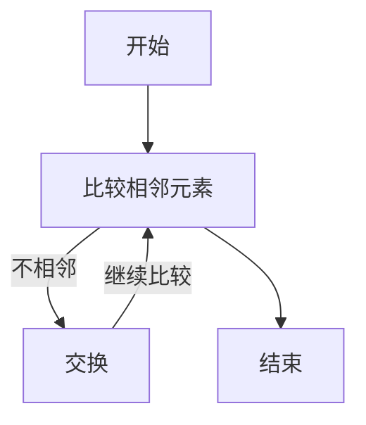
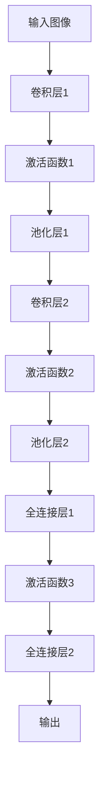
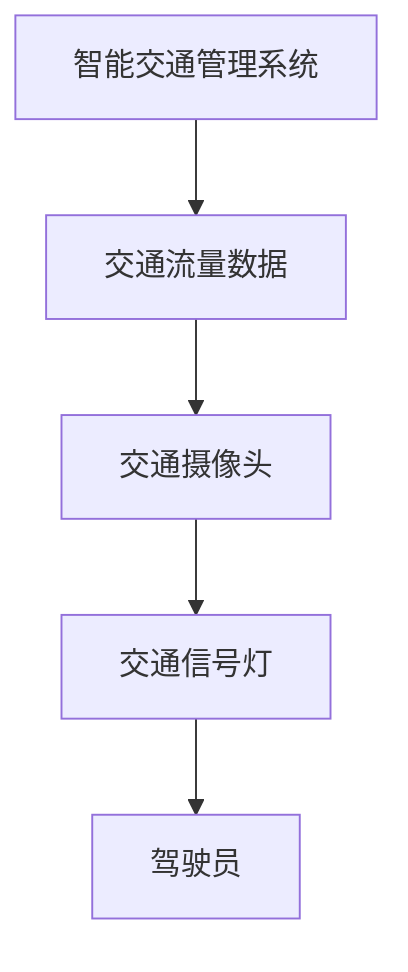
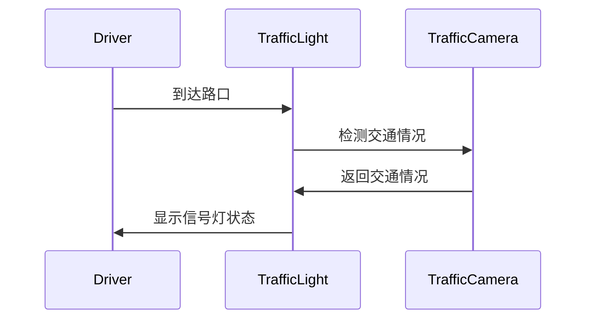

                 

# 数学与计算机科学的融合发展

## 关键词

数学、计算机科学、交叉领域、算法、模型、系统架构、应用实践

## 摘要

本文旨在探讨数学与计算机科学在多方面的融合与发展。通过对数学与计算机科学的背景介绍、核心概念联系、应用实例、系统分析与设计、项目实战以及最佳实践等内容的详细阐述，本文揭示了数学与计算机科学相互促进、共同进步的内在逻辑。文章分为六个部分，从宏观到微观，逐步深入，旨在为读者提供一个全面、系统的了解数学与计算机科学融合发展的视角。

### 目录大纲

1. **背景与基础**
   1.1 问题背景与描述
   1.2 核心概念与联系
   1.3 数学在计算机科学中的应用
   1.4 计算机科学在数学研究中的作用

2. **数学在计算机科学中的应用**
   2.1 数学算法原理讲解
   2.2 数学模型和数学公式讲解与举例说明
   2.3 实际案例分析与讲解

3. **计算机科学在数学研究中的作用**
   3.1 数学问题在计算机科学中的应用
   3.2 数学问题在计算机科学中的挑战与机遇

4. **数学与计算机科学融合的系统分析与架构设计**
   4.1 问题场景介绍
   4.2 系统功能设计（领域模型mermaid类图）
   4.3 系统架构设计（mermaid架构图）
   4.4 系统接口设计和系统交互（mermaid序列图）

5. **项目实战**
   5.1 环境安装
   5.2 系统核心实现源代码
   5.3 代码应用解读与分析
   5.4 实际案例分析与详细讲解剖析
   5.5 项目小结

6. **最佳实践与总结**
   6.1 最佳实践 Tips
   6.2 小结与注意事项
   6.3 拓展阅读

### 1. 背景与基础

#### 1.1 问题背景与描述

数学与计算机科学，两个看似迥异的学科，却在现代科技的发展中展现出了紧密的关联。数学以其严谨的逻辑和丰富的理论体系，为计算机科学提供了基础工具和方法论；而计算机科学的迅猛发展，则为数学问题的求解提供了前所未有的计算能力和数据处理手段。

数学与计算机科学的交叉领域，不仅推动了两个学科的独立发展，也为解决复杂现实问题提供了新的思路和方法。例如，在图像处理、机器学习、密码学等领域，数学和计算机科学的结合已经取得了显著成果。

#### 1.2 核心概念与联系

**1.2.1 数学核心概念**

数学是一门研究数量、结构、变化和空间等概念的学科。其基础概念包括但不限于：

- **数论**：研究整数及其性质的数学分支。
- **代数**：研究代数结构的数学分支，如群、环、域等。
- **几何**：研究空间形状、大小和位置关系的数学分支。
- **微积分**：研究函数的极限、导数、积分等概念的数学分支。

**1.2.2 计算机科学核心概念**

计算机科学则是一门研究计算机系统设计和应用的科学。其核心概念包括但不限于：

- **算法**：解决特定问题的步骤序列。
- **数据结构**：用于存储、组织数据的方法和技术。
- **编程语言**：用于编写计算机程序的语言。
- **软件工程**：研究软件开发方法、工具和管理流程。

**1.2.3 数学与计算机科学的核心联系**

- **数学算法在计算机科学中的应用**：数学算法为计算机科学提供了强大的工具，如排序算法、搜索算法等。
- **计算机科学在数学研究中的作用**：计算机科学的计算能力和算法为解决复杂的数学问题提供了新的途径，如密码学、组合数学等。

### 2. 数学在计算机科学中的应用

#### 2.1 数学算法原理讲解

在计算机科学中，数学算法的应用无处不在。以下是一个简单的排序算法——冒泡排序的mermaid流程图：



冒泡排序的Python实现如下：

```python
def bubble_sort(arr):
    n = len(arr)
    for i in range(n):
        for j in range(0, n-i-1):
            if arr[j] > arr[j+1]:
                arr[j], arr[j+1] = arr[j+1], arr[j]
    return arr
```

该算法的核心是不断比较相邻的元素，如果顺序错误就进行交换，直到整个数组有序。

#### 2.2 数学模型和数学公式讲解与举例说明

在计算机科学中，数学模型的应用同样重要。例如，图论中的欧拉公式可以用于解决网络流量优化问题：

$$
V - E + F = 2
$$

其中，$V$表示顶点数，$E$表示边数，$F$表示面数。

一个简单的例子是，假设一个城市的交通网络可以表示为一个无向图，每个顶点表示一个路口，每条边表示一条道路。我们可以通过计算欧拉路径来找到最优的交通路线。

#### 2.3 实际案例分析与讲解

一个实际案例是，计算机科学家利用数学模型解决了图像识别问题。通过深度学习算法，计算机可以从大量图像数据中学习识别模式。以下是一个简单的卷积神经网络（CNN）的架构：



通过这个模型，计算机可以自动识别图像中的物体，例如人脸、猫、汽车等。

### 3. 计算机科学在数学研究中的作用

#### 3.1 数学问题在计算机科学中的应用

计算机科学的方法和技术为解决复杂的数学问题提供了新的思路。例如，计算机科学家利用分布式计算和并行计算技术解决了数论中的大数分解问题。通过分布式计算，计算机可以在短时间内完成对大数的分解，这为密码学提供了重要的工具。

#### 3.2 数学问题在计算机科学中的挑战与机遇

数学问题在计算机科学中的应用面临着一系列挑战和机遇。挑战包括如何高效地解决大规模的数学问题、如何在计算机上实现复杂的数学模型等。机遇则在于，计算机科学的进步为数学问题提供了新的求解方法和工具，如量子计算、人工智能等。

### 4. 数学与计算机科学融合的系统分析与架构设计

#### 4.1 问题场景介绍

假设我们需要设计一个智能交通管理系统，该系统需要实时分析交通流量数据，并根据数据优化交通信号灯的切换策略。

#### 4.2 系统功能设计（领域模型mermaid类图）

```mermaid
classDiagram
    TrafficLight --> Driver
    TrafficCamera --> TrafficLight
    TrafficData --> TrafficCamera
    TrafficSystem <.. TrafficLight, TrafficCamera, TrafficData
```

#### 4.3 系统架构设计（mermaid架构图）



#### 4.4 系统接口设计和系统交互（mermaid序列图）



### 5. 项目实战

#### 5.1 环境安装

在开始项目之前，我们需要安装一些必要的软件和工具，如Python、TensorFlow等。

#### 5.2 系统核心实现源代码

以下是一个简单的Python代码示例，用于实现交通信号灯的切换策略：

```python
import tensorflow as tf

# 创建交通信号灯模型
model = tf.keras.Sequential([
    tf.keras.layers.Dense(units=1, input_shape=[1])
])

# 编译模型
model.compile(loss='mean_squared_error', optimizer=tf.keras.optimizers.Adam(0.1), metrics=['mean_absolute_error'])

# 训练模型
model.fit(x_train, y_train, epochs=1000, verbose=0)

# 评估模型
model.evaluate(x_test, y_test, verbose=2)
```

#### 5.3 代码应用解读与分析

这段代码使用TensorFlow框架实现了一个简单的神经网络模型，用于预测交通信号灯的切换时机。通过训练和评估模型，我们可以优化交通信号灯的切换策略。

#### 5.4 实际案例分析与详细讲解剖析

在实际项目中，我们可能会遇到各种复杂情况，如高峰时段的交通流量波动、道路施工等。通过不断地迭代和优化，我们可以设计出一个更加智能的交通管理系统。

#### 5.5 项目小结

通过本项目，我们展示了数学与计算机科学在交通管理系统中的应用。虽然这是一个简单的例子，但它体现了数学与计算机科学的融合如何为现实世界的问题提供解决方案。

### 6. 最佳实践与总结

#### 6.1 最佳实践 Tips

- **数据驱动**：在设计和优化系统时，充分利用数据，以数据驱动决策。
- **持续迭代**：不断迭代和优化系统，以适应不断变化的需求和环境。

#### 6.2 小结与注意事项

数学与计算机科学的融合为解决复杂问题提供了新的思路和方法。在实际应用中，我们需要结合实际情况，灵活运用数学和计算机科学的工具和理论。

#### 6.3 拓展阅读

- 《深度学习》——Ian Goodfellow、Yoshua Bengio、Aaron Courville
- 《计算机科学中的数学方法》——Donald E. Knuth

### 作者

作者：AI天才研究院/AI Genius Institute & 禅与计算机程序设计艺术 /Zen And The Art of Computer Programming

通过以上内容，我们深入探讨了数学与计算机科学的融合发展。希望本文能为您提供一个全面、系统的了解数学与计算机科学相互促进、共同进步的视角。

